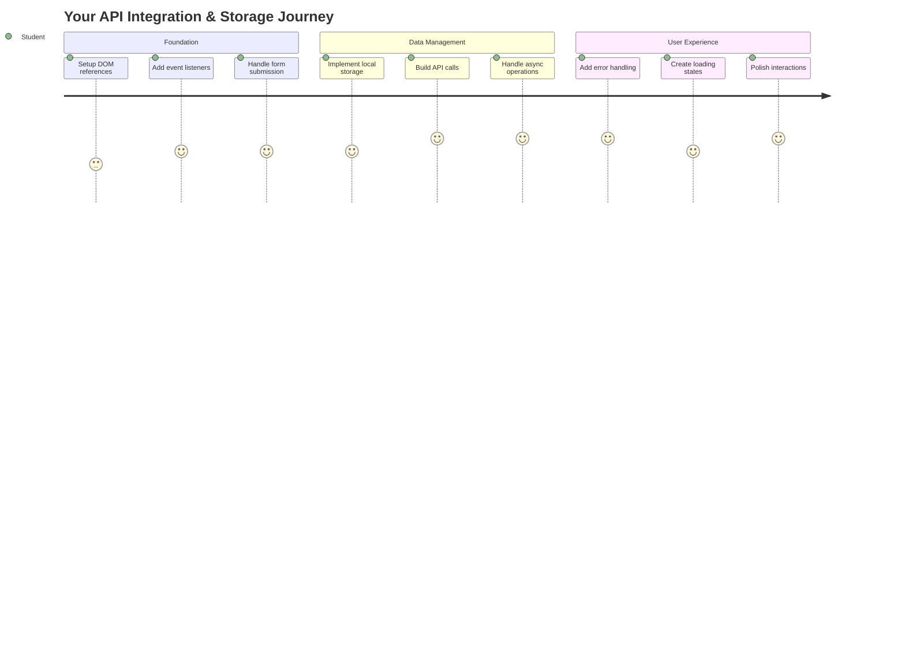
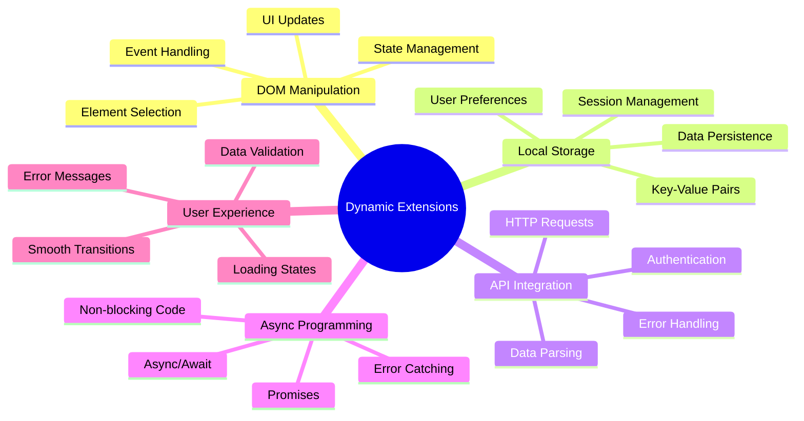
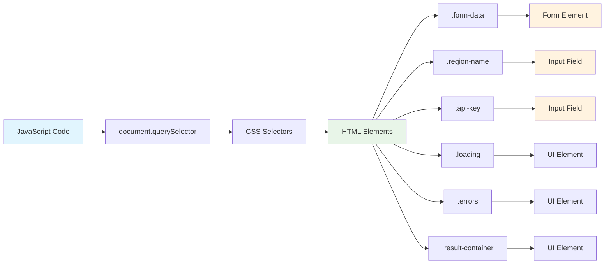
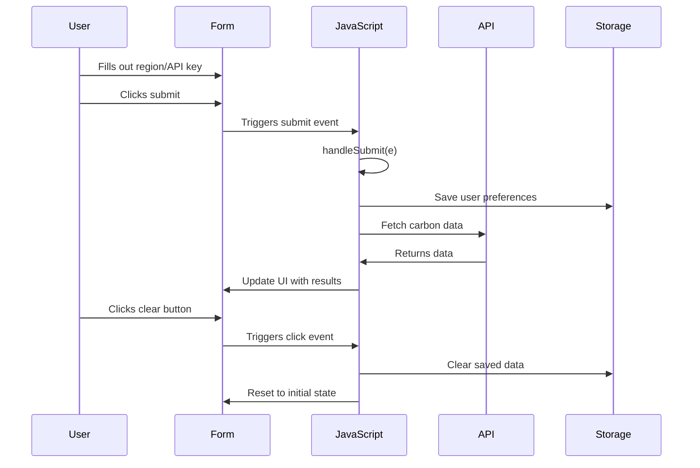
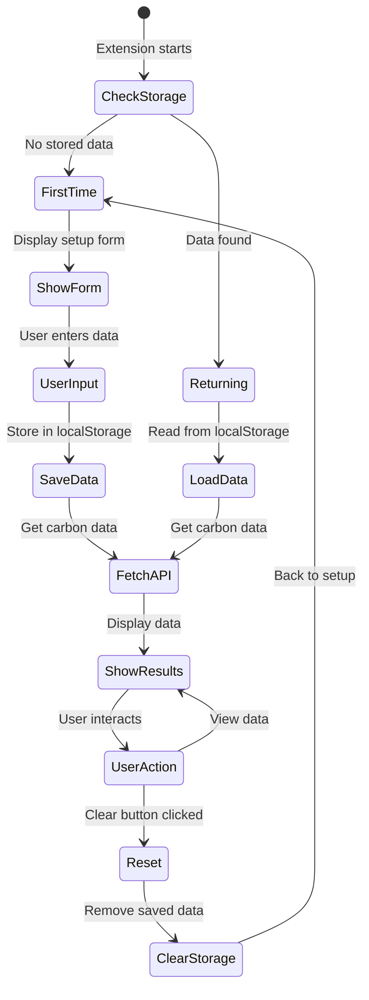
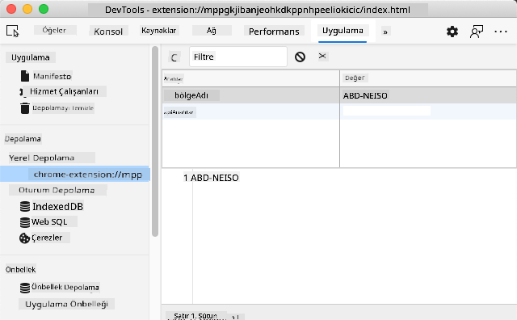
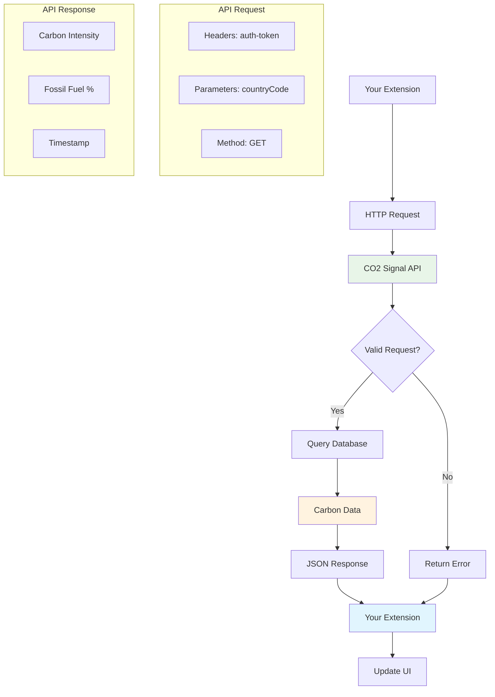
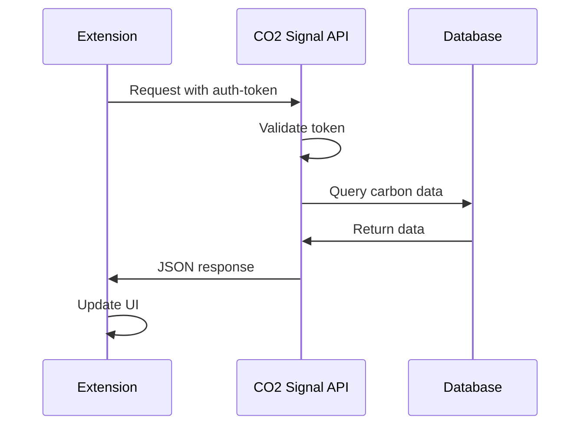
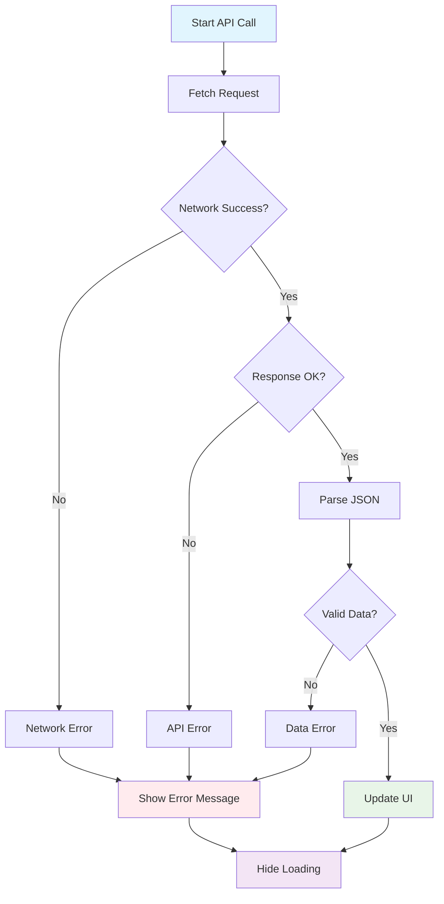
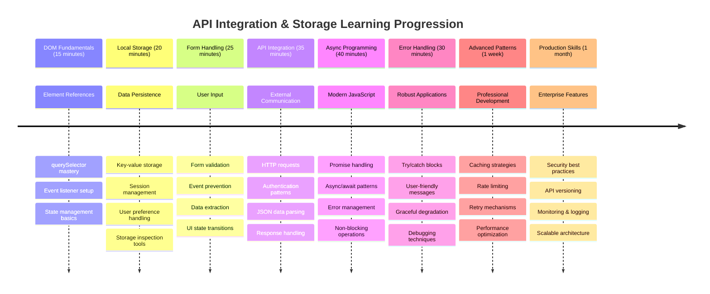

<!--
CO_OP_TRANSLATOR_METADATA:
{
  "original_hash": "2b6203a48c48d8234e0948353b47d84e",
  "translation_date": "2025-11-04T01:07:28+00:00",
  "source_file": "5-browser-extension/2-forms-browsers-local-storage/README.md",
  "language_code": "tr"
}
-->
# Tarayıcı Uzantısı Projesi Bölüm 2: Bir API Çağırma, Yerel Depolama Kullanma



## Ders Öncesi Test

[Ders öncesi test](https://ff-quizzes.netlify.app/web/quiz/25)

## Giriş

Hatırlıyor musunuz, tarayıcı uzantınızı oluşturmaya başlamıştınız? Şu anda güzel görünümlü bir formunuz var, ancak bu form temelde statik. Bugün onu gerçek verilerle bağlayarak ve hafıza kazandırarak canlandıracağız.

Apollo görev kontrol bilgisayarlarını düşünün - sadece sabit bilgileri göstermiyorlardı. Sürekli olarak uzay aracıyla iletişim kuruyor, telemetri verileriyle güncelleniyor ve kritik görev parametrelerini hatırlıyorlardı. Bugün oluşturacağımız dinamik davranış tam olarak bu. Uzantınız internete bağlanacak, gerçek çevresel verileri alacak ve ayarlarınızı bir dahaki sefere hatırlayacak.

API entegrasyonu karmaşık görünebilir, ancak aslında kodunuza diğer hizmetlerle nasıl iletişim kuracağını öğretmekten ibarettir. İster hava durumu verilerini, ister sosyal medya akışlarını, ister bugün yapacağımız gibi karbon ayak izi bilgilerini alıyor olun, hepsi bu dijital bağlantıları kurmakla ilgilidir. Ayrıca tarayıcıların bilgiyi nasıl saklayabileceğini keşfedeceğiz - tıpkı kütüphanelerin kitapların nerede olduğunu hatırlamak için kart kataloglarını kullanması gibi.

Bu dersin sonunda, gerçek verileri alan, kullanıcı tercihlerini saklayan ve sorunsuz bir deneyim sunan bir tarayıcı uzantısına sahip olacaksınız. Haydi başlayalım!



✅ Kodunuzu nereye yerleştireceğinizi bilmek için ilgili dosyalardaki numaralandırılmış segmentleri takip edin.

## Uzantıda manipüle edilecek öğeleri ayarlayın

JavaScript'in arayüzü manipüle edebilmesi için önce belirli HTML öğelerine referanslar oluşturması gerekir. Bunu, bir teleskopun belirli yıldızlara yönlendirilmesi gibi düşünün - Galileo, Jüpiter'in uydularını incelemeden önce Jüpiter'i bulmalı ve odaklanmalıydı.

`index.js` dosyanızda, her önemli form öğesine referanslar yakalayan `const` değişkenleri oluşturacağız. Bu, bilim insanlarının ekipmanlarını etiketlemesine benzer - her seferinde tüm laboratuvarı aramak yerine, doğrudan ihtiyaç duydukları şeye erişebilirler.



```javascript
// form fields
const form = document.querySelector('.form-data');
const region = document.querySelector('.region-name');
const apiKey = document.querySelector('.api-key');

// results
const errors = document.querySelector('.errors');
const loading = document.querySelector('.loading');
const results = document.querySelector('.result-container');
const usage = document.querySelector('.carbon-usage');
const fossilfuel = document.querySelector('.fossil-fuel');
const myregion = document.querySelector('.my-region');
const clearBtn = document.querySelector('.clear-btn');
```

**Bu kodun yaptığı şey:**
- **Form öğelerini yakalar** `document.querySelector()` kullanarak CSS sınıf seçicileriyle
- **Giriş alanlarına referanslar oluşturur** bölge adı ve API anahtarı için
- **Sonuç görüntüleme öğelerine bağlantılar kurar** karbon kullanım verileri için
- **UI öğelerine erişim sağlar** yükleme göstergeleri ve hata mesajları gibi
- **Her öğe referansını bir `const` değişkeninde saklar** kodunuzda kolayca yeniden kullanmak için

## Olay dinleyicileri ekleyin

Şimdi uzantınızı kullanıcı eylemlerine yanıt verecek hale getireceğiz. Olay dinleyiciler, kodunuzun kullanıcı etkileşimlerini izleme yöntemidir. Bunları, erken telefon santrallerindeki operatörler gibi düşünün - gelen çağrıları dinler ve bir bağlantı yapmak istendiğinde doğru devreleri bağlarlardı.



```javascript
form.addEventListener('submit', (e) => handleSubmit(e));
clearBtn.addEventListener('click', (e) => reset(e));
init();
```

**Bu kavramları anlamak:**
- **Form gönderme dinleyicisi ekler** kullanıcılar Enter tuşuna bastığında veya gönder düğmesine tıkladığında tetiklenir
- **Temizleme düğmesine bir tıklama dinleyicisi bağlar** formu sıfırlamak için
- **Olay nesnesini `(e)` işleyici fonksiyonlara iletir** ek kontrol için
- **`init()` fonksiyonunu hemen çağırır** uzantınızın başlangıç durumunu ayarlamak için

✅ Burada kullanılan kısa ok fonksiyon sözdizimine dikkat edin. Bu modern JavaScript yaklaşımı, geleneksel fonksiyon ifadelerinden daha temizdir, ancak her ikisi de eşit derecede iyi çalışır!

### 🔄 **Pedagojik Kontrol Noktası**
**Olay İşleme Anlayışı**: Başlangıç işlemlerine geçmeden önce şunları açıklayabildiğinizden emin olun:
- ✅ `addEventListener`'ın kullanıcı eylemlerini JavaScript fonksiyonlarına nasıl bağladığını açıklayın
- ✅ Olay nesnesi `(e)`'nin neden işleyici fonksiyonlara iletildiğini anlayın
- ✅ `submit` ve `click` olayları arasındaki farkı tanıyın
- ✅ `init()` fonksiyonunun ne zaman çalıştığını ve nedenini açıklayın

**Hızlı Kendini Test Et**: Bir form gönderiminde `e.preventDefault()`'u unutursanız ne olur?
*Cevap: Sayfa yenilenir, tüm JavaScript durumu kaybolur ve kullanıcı deneyimi kesintiye uğrar.*

## Başlatma ve sıfırlama fonksiyonlarını oluşturun

Uzantınız için başlatma mantığını oluşturalım. `init()` fonksiyonu, bir geminin navigasyon sistemi gibi enstrümanlarını kontrol eder - mevcut durumu belirler ve arayüzü buna göre ayarlar. Birinin uzantınızı daha önce kullanıp kullanmadığını kontrol eder ve önceki ayarlarını yükler.

`reset()` fonksiyonu, kullanıcılara temiz bir başlangıç sağlar - bilim insanlarının deneyler arasında enstrümanlarını sıfırlayarak temiz veri elde etmeleri gibi.

```javascript
function init() {
	// Check if user has previously saved API credentials
	const storedApiKey = localStorage.getItem('apiKey');
	const storedRegion = localStorage.getItem('regionName');

	// Set extension icon to generic green (placeholder for future lesson)
	// TODO: Implement icon update in next lesson

	if (storedApiKey === null || storedRegion === null) {
		// First-time user: show the setup form
		form.style.display = 'block';
		results.style.display = 'none';
		loading.style.display = 'none';
		clearBtn.style.display = 'none';
		errors.textContent = '';
	} else {
		// Returning user: load their saved data automatically
		displayCarbonUsage(storedApiKey, storedRegion);
		results.style.display = 'none';
		form.style.display = 'none';
		clearBtn.style.display = 'block';
	}
}

function reset(e) {
	e.preventDefault();
	// Clear stored region to allow user to choose a new location
	localStorage.removeItem('regionName');
	// Restart the initialization process
	init();
}
```

**Burada olanları parçalayarak açıklayalım:**
- **Tarayıcının yerel depolamasından** saklanan API anahtarı ve bölgeyi alır
- **İlk kez kullanıcı mı yoksa geri dönen kullanıcı mı olduğunu kontrol eder**
- **Yeni kullanıcılar için kurulum formunu gösterir** ve diğer arayüz öğelerini gizler
- **Kaydedilmiş verileri otomatik olarak yükler** geri dönen kullanıcılar için ve sıfırlama seçeneğini gösterir
- **Mevcut verilere dayalı olarak kullanıcı arayüzü durumunu yönetir**

**Yerel Depolama Hakkında Temel Kavramlar:**
- **Tarayıcı oturumları arasında veri saklar** (oturum depolamanın aksine)
- **Veriyi anahtar-değer çiftleri olarak saklar** `getItem()` ve `setItem()` kullanarak
- **Belirli bir anahtar için veri yoksa `null` döner**
- **Kullanıcı tercihlerini ve ayarlarını hatırlamak için basit bir yol sağlar**

> 💡 **Tarayıcı Depolamasını Anlamak**: [LocalStorage](https://developer.mozilla.org/docs/Web/API/Window/localStorage), uzantınıza kalıcı bir hafıza kazandırmak gibidir. Antik İskenderiye Kütüphanesi'nin parşömenleri sakladığı gibi - bilgiler, bilim insanları ayrılıp geri döndüğünde bile erişilebilir kalır.
>
> **Anahtar özellikler:**
> - **Veriyi tarayıcı kapandıktan sonra bile saklar**
> - **Bilgisayar yeniden başlatıldığında ve tarayıcı çöktüğünde hayatta kalır**
> - **Kullanıcı tercihleri için önemli bir depolama alanı sağlar**
> - **Ağ gecikmeleri olmadan anında erişim sunar**

> **Önemli Not**: Tarayıcı uzantınızın kendi izole edilmiş yerel depolaması vardır ve bu, normal web sayfalarından ayrı çalışır. Bu, güvenlik sağlar ve diğer web siteleriyle çakışmaları önler.

Saklanan verilerinizi tarayıcı Geliştirici Araçları'nı (F12) açarak, **Uygulama** sekmesine giderek ve **Yerel Depolama** bölümünü genişleterek görüntüleyebilirsiniz.





> ⚠️ **Güvenlik Düşüncesi**: Üretim uygulamalarında, API anahtarlarını Yerel Depolama'da saklamak güvenlik riskleri taşır çünkü JavaScript bu verilere erişebilir. Öğrenme amacıyla bu yaklaşım uygundur, ancak gerçek uygulamalar hassas kimlik bilgileri için güvenli sunucu tarafı depolama kullanmalıdır.

## Form gönderimini işleme

Şimdi birinin formunuzu gönderdiğinde ne olacağını ele alacağız. Varsayılan olarak, tarayıcılar form gönderildiğinde sayfayı yeniler, ancak bu davranışı kesintisiz bir deneyim oluşturmak için durduracağız.

Bu yaklaşım, görev kontrolünün uzay aracı iletişimlerini nasıl ele aldığına benzer - her iletim için tüm sistemi sıfırlamak yerine, yeni bilgileri işlerken sürekli operasyonu sürdürürler.

Form gönderim olayını yakalayan ve kullanıcının girişini çıkaran bir fonksiyon oluşturun:

```javascript
function handleSubmit(e) {
	e.preventDefault();
	setUpUser(apiKey.value, region.value);
}
```

**Yukarıda şunları yaptık:**
- **Varsayılan form gönderim davranışını engeller** sayfanın yenilenmesini önlemek için
- **Kullanıcı giriş değerlerini çıkarır** API anahtarı ve bölge alanlarından
- **Form verilerini `setUpUser()` fonksiyonuna iletir** işleme için
- **Sayfa yenilemelerinden kaçınarak** tek sayfa uygulama davranışını sürdürür

✅ HTML form alanlarınız `required` özelliğini içerir, bu nedenle tarayıcı, kullanıcıların bu fonksiyon çalışmadan önce hem API anahtarını hem de bölgeyi sağlamasını otomatik olarak doğrular.

## Kullanıcı tercihlerini ayarlama

`setUpUser` fonksiyonu, kullanıcının kimlik bilgilerini kaydetmek ve ilk API çağrısını başlatmaktan sorumludur. Bu, kurulumdan sonuçları görüntülemeye sorunsuz bir geçiş sağlar.

```javascript
function setUpUser(apiKey, regionName) {
	// Save user credentials for future sessions
	localStorage.setItem('apiKey', apiKey);
	localStorage.setItem('regionName', regionName);
	
	// Update UI to show loading state
	loading.style.display = 'block';
	errors.textContent = '';
	clearBtn.style.display = 'block';
	
	// Fetch carbon usage data with user's credentials
	displayCarbonUsage(apiKey, regionName);
}
```

**Adım adım, burada olanlar:**
- **API anahtarını ve bölge adını yerel depolamaya kaydeder** gelecekteki kullanım için
- **Yükleme göstergesini gösterir** kullanıcıları veri alındığı konusunda bilgilendirmek için
- **Önceki hata mesajlarını ekrandan temizler**
- **Kullanıcıların ayarlarını daha sonra sıfırlamaları için temizleme düğmesini gösterir**
- **Gerçek karbon kullanım verilerini almak için API çağrısını başlatır**

Bu fonksiyon, hem veri kalıcılığını hem de kullanıcı arayüzü güncellemelerini bir arada yöneterek sorunsuz bir kullanıcı deneyimi oluşturur.

## Karbon kullanım verilerini görüntüleme

Şimdi uzantınızı API'ler aracılığıyla harici veri kaynaklarına bağlayacağız. Bu, uzantınızı bağımsız bir araçtan, internet üzerinden gerçek zamanlı bilgilere erişebilen bir şeye dönüştürür.

**API'leri Anlamak**

[API'ler](https://www.webopedia.com/TERM/A/API.html), farklı uygulamaların birbirleriyle nasıl iletişim kurduğudur. Bunları, 19. yüzyılda uzak şehirleri birbirine bağlayan telgraf sistemi gibi düşünün - operatörler uzak istasyonlara istek gönderir ve istenen bilgilerle yanıt alırlardı. Sosyal medyayı her kontrol ettiğinizde, bir sesli asistana soru sorduğunuzda veya bir teslimat uygulaması kullandığınızda, API'ler bu veri alışverişlerini kolaylaştırır.



**REST API'ler hakkında temel kavramlar:**
- **REST**, 'Temsili Durum Transferi' anlamına gelir
- **Standart HTTP yöntemlerini kullanır** (GET, POST, PUT, DELETE) veriyle etkileşim için
- **Veriyi tahmin edilebilir formatlarda döner**, genellikle JSON
- **Farklı türde istekler için tutarlı, URL tabanlı uç noktalar sağlar**

✅ Kullanacağımız [CO2 Signal API](https://www.co2signal.com/) dünya çapındaki elektrik şebekelerinden gerçek zamanlı karbon yoğunluğu verileri sağlar. Bu, kullanıcıların elektrik kullanımının çevresel etkisini anlamalarına yardımcı olur!

> 💡 **Asenkron JavaScript'i Anlamak**: [`async` anahtar kelimesi](https://developer.mozilla.org/docs/Web/JavaScript/Reference/Statements/async_function), kodunuzun aynı anda birden fazla işlemi yönetmesini sağlar. Bir sunucudan veri istediğinizde, tüm uzantınızın donmasını istemezsiniz - bu, hava trafik kontrolünün bir uçağın yanıtını beklerken tüm operasyonları durdurması gibi olurdu.
>
> **Anahtar faydalar:**
> - **Uzantının yanıt verebilirliğini korur** veri yüklenirken
> - **Diğer kodun** ağ istekleri sırasında çalışmaya devam etmesine izin verir
> - **Kod okunabilirliğini artırır** geleneksel geri çağırma desenlerine kıyasla
> - **Ağ sorunları için zarif hata işleme sağlar**

İşte `async` hakkında hızlı bir video:

[](https://youtube.com/watch?v=YwmlRkrxvkk "Async ve Await ile sözleri yönetme")

> 🎥 Yukarıdaki görüntüye tıklayarak async/await hakkında bir video izleyin.

### 🔄 **Pedagojik Kontrol Noktası**
**Asenkron Programlama Anlayışı**: API fonksiyonuna dalmadan önce şunları anladığınızdan emin olun:
- ✅ Neden `async/await` kullandığımızı ve uzantıyı neden dondurmadığımızı anlayın
- ✅ `try/catch` bloklarının ağ hatalarını zarif bir şekilde nasıl ele aldığını anlayın
- ✅ Senkron ve asenkron işlemler arasındaki farkı anlayın
- ✅ API çağrılarının neden başarısız olabileceğini ve bu hataların nasıl ele alınacağını anlayın

**Gerçek Dünya Bağlantısı**: İşte günlük asenkron örnekler:
- **Yemek siparişi vermek**: Mutfağın yanında beklemezsiniz - bir fiş alır ve diğer aktivitelerinize devam edersiniz
- **E-posta göndermek**: E-posta uygulamanız gönderirken donmaz - daha fazla e-posta yazabilirsiniz
- **Web sayfalarını yüklemek**: Görseller kademeli olarak yüklenirken metni okuyabilirsiniz

**API Kimlik Doğrulama Akışı**:


Karbon kullanım verilerini almak ve görüntülemek için fonksiyonu oluşturun:

```javascript
// Modern fetch API approach (no external dependencies needed)
async function displayCarbonUsage(apiKey, region) {
	try {
		// Fetch carbon intensity data from CO2 Signal API
		const response = await fetch('https://api.co2signal.com/v1/latest', {
			method: 'GET',
			headers: {
				'auth-token': apiKey,
				'Content-Type': 'application/json'
			},
			// Add query parameters for the specific region
			...new URLSearchParams({ countryCode: region }) && {
				url: `https://api.co2signal.com/v1/latest?countryCode=${region}`
			}
		});

		// Check if the API request was successful
		if (!response.ok) {
			throw new Error(`API request failed: ${response.status}`);
		}

		const data = await response.json();
		const carbonData = data.data;

		// Calculate rounded carbon intensity value
		const carbonIntensity = Math.round(carbonData.carbonIntensity);

		// Update the user interface with fetched data
		loading.style.display = 'none';
		form.style.display = 'none';
		myregion.textContent = region.toUpperCase();
		usage.textContent = `${carbonIntensity} grams (grams CO₂ emitted per kilowatt hour)`;
		fossilfuel.textContent = `${carbonData.fossilFuelPercentage.toFixed(2)}% (percentage of fossil fuels used to generate electricity)`;
		results.style.display = 'block';

		// TODO: calculateColor(carbonIntensity) - implement in next lesson

	} catch (error) {
		console.error('Error fetching carbon data:', error);
		
		// Show user-friendly error message
		loading.style.display = 'none';
		results.style.display = 'none';
		errors.textContent = 'Sorry, we couldn\'t fetch data for that region. Please check your API key and region code.';
	}
}
```

**Burada olanları parçalayarak açıklayalım:**
- **Modern `fetch()` API'sini kullanır** harici kütüphaneler yerine daha temiz, bağımlılıksız kod için
- **`response.ok` ile doğru hata kontrolü uygular** API hatalarını erken yakalamak için
- **Asenkron işlemleri `async/await` ile yönetir** daha okunabilir kod akışı için
- **CO2 Signal API ile kimlik doğrulama yapar** `auth-token` başlığı kullanarak
- **JSON yanıt verilerini ayrıştırır** ve karbon yoğunluğu bilgilerini çıkarır
- **Birden fazla UI öğesini günceller** biçimlendirilmiş çevresel verilerle
- **API çağrıları başarısız olduğunda kullanıcı dostu hata mesajları sağlar**

**Gösterilen modern JavaScript kavramları:**
- **Şablon dizileri** `${}` sözdizimi ile temiz dize biçimlendirme için
- **Hata işleme** try/catch blokları ile sağlam uygulamalar için
- **Async/await** ağ isteklerini zarif bir şekilde yönetmek için
- **Nesne yapılandırması** API yanıtlarından belirli verileri çıkarmak için
- **Yöntem zincirleme** birden fazla DOM manipülasyonu için

✅ Bu fonksiyon, profesyonel geliştiricilerin düzenli olarak kullandığı birkaç önemli web geliştirme kavramını gösterir - harici sunucularla iletişim kurma, kimlik doğrulama, veri işleme, arayüz güncelleme ve hataları zarif bir şekilde yönetme.



### 🔄 **Pedagojik Kontrol Noktası**
**Tam Sistem Anlayışı**: Tüm akışın ustalığını doğrulayın:
- ✅ DOM referanslarının JavaScript'in arayüzü kontrol etmesini nasıl sağladığını anlayın
- ✅ Yerel depolamanın tarayıcı oturumları arasında kalıcılık oluşturduğunu anlayın
- ✅ Async/await'in API çağrılarını uzantıyı dondurmadan nasıl yaptığını anlayın
- ✅ API çağrıları başarısız olduğunda ne olduğunu ve hataların nasıl ele alındığını anlayın
- ✅ Kullanıcı deneyiminin neden yükleme durumlarını ve hata mesajlarını içerdiğini anlayın

🎉 **Başardığınız şey:** Şunları yapan bir tarayıcı uzantısı oluşturdunuz:
- **İnternete bağlanır** ve gerçek çevresel verileri alır
- **Kullanıcı ayarlarını oturumlar arasında saklar**
- **Hataları zarif bir şekilde ele alır** çökmeden
- **Sorunsuz, profesyonel bir kullanıcı deneyimi sağlar**

Çalışmanızı `npm run build` çalıştırarak ve tarayıcıda uzantınızı yenileyerek test edin. Artık işlevsel bir karbon ayak izi takipçiniz var. Bir sonraki derste, uzantıyı tamamlamak için dinamik simge işlevselliği ekleyeceğiz.

---

## GitHub Copilot Agent Challenge 🚀

Agent modunu kullanarak aşağıdaki meydan okumayı tamamlayın:
**Açıklama:** Tarayıcı uzantısını hata yönetimi iyileştirmeleri ve kullanıcı deneyimi özellikleri ekleyerek geliştirin. Bu zorluk, API'lerle çalışma, yerel depolama ve modern JavaScript desenleri kullanarak DOM manipülasyonu pratiği yapmanıza yardımcı olacak.

**Görev:** displayCarbonUsage fonksiyonunun geliştirilmiş bir versiyonunu oluşturun. Bu versiyon şunları içermelidir: 1) API çağrılarında başarısızlık durumunda üstel geri çekilme ile yeniden deneme mekanizması, 2) API çağrısından önce bölge kodu için giriş doğrulaması, 3) İlerleme göstergeleri içeren bir yükleme animasyonu, 4) API yanıtlarının localStorage'da 30 dakika süreyle geçerlilik zaman damgalarıyla önbelleğe alınması, ve 5) önceki API çağrılarından gelen geçmiş verileri görüntüleme özelliği. Ayrıca tüm fonksiyon parametrelerini ve dönüş türlerini belgelemek için TypeScript tarzı JSDoc yorumları ekleyin.

[agent mode](https://code.visualstudio.com/blogs/2025/02/24/introducing-copilot-agent-mode) hakkında daha fazla bilgi edinin.

## 🚀 Zorluk

Web geliştirme için mevcut tarayıcı tabanlı API'leri keşfederek API'ler hakkındaki bilginizi genişletin. Bu tarayıcı API'lerinden birini seçin ve küçük bir demo oluşturun:

- [Geolocation API](https://developer.mozilla.org/docs/Web/API/Geolocation_API) - Kullanıcının mevcut konumunu alın
- [Notification API](https://developer.mozilla.org/docs/Web/API/Notifications_API) - Masaüstü bildirimleri gönderin
- [HTML Drag and Drop API](https://developer.mozilla.org/docs/Web/API/HTML_Drag_and_Drop_API) - Etkileşimli sürükleme arayüzleri oluşturun
- [Web Storage API](https://developer.mozilla.org/docs/Web/API/Web_Storage_API) - Gelişmiş yerel depolama teknikleri
- [Fetch API](https://developer.mozilla.org/docs/Web/API/Fetch_API) - XMLHttpRequest için modern bir alternatif

**Araştırma soruları:**
- Bu API gerçek dünyada hangi sorunları çözüyor?
- API hataları ve uç durumları nasıl ele alıyor?
- Bu API'yi kullanırken hangi güvenlik hususları dikkate alınmalı?
- Bu API farklı tarayıcılar arasında ne kadar yaygın destekleniyor?

Araştırmanızdan sonra, bir API'yi geliştirici dostu ve güvenilir yapan özellikleri belirleyin.

## Ders Sonrası Test

[Ders sonrası test](https://ff-quizzes.netlify.app/web/quiz/26)

## Gözden Geçirme ve Kendi Kendine Çalışma

Bu derste LocalStorage ve API'ler hakkında bilgi edindiniz; her ikisi de profesyonel bir web geliştirici için oldukça kullanışlıdır. Bu iki şeyin birlikte nasıl çalıştığını düşünebilir misiniz? Bir API tarafından kullanılacak öğeleri depolayan bir web sitesi tasarlamayı düşünün.

### ⚡ **Sonraki 5 Dakikada Yapabilecekleriniz**
- [ ] DevTools Uygulama sekmesini açın ve herhangi bir web sitesinde localStorage'ı keşfedin
- [ ] Basit bir HTML formu oluşturun ve tarayıcıda form doğrulamasını test edin
- [ ] Tarayıcı konsolunda localStorage kullanarak veri depolamayı ve almayı deneyin
- [ ] Ağ sekmesini kullanarak gönderilen form verilerini inceleyin

### 🎯 **Bu Saatte Başarabilecekleriniz**
- [ ] Ders sonrası testi tamamlayın ve form işleme kavramlarını anlayın
- [ ] Kullanıcı tercihlerini kaydeden bir tarayıcı uzantısı formu oluşturun
- [ ] Yardımcı hata mesajlarıyla istemci tarafı form doğrulamasını uygulayın
- [ ] Uzantı veri kalıcılığı için chrome.storage API'sini kullanmayı deneyin
- [ ] Kaydedilen kullanıcı ayarlarına yanıt veren bir kullanıcı arayüzü oluşturun

### 📅 **Hafta Boyunca Uzantı Geliştirme**
- [ ] Form işlevselliği ile tam özellikli bir tarayıcı uzantısı tamamlayın
- [ ] Farklı depolama seçeneklerini öğrenin: local, sync ve session storage
- [ ] Otomatik tamamlama ve doğrulama gibi gelişmiş form özelliklerini uygulayın
- [ ] Kullanıcı verileri için içe/dışa aktarma işlevselliği ekleyin
- [ ] Uzantınızı farklı tarayıcılarda kapsamlı bir şekilde test edin
- [ ] Uzantınızın kullanıcı deneyimini ve hata yönetimini iyileştirin

### 🌟 **Web API Uzmanlığı için Bir Aylık Plan**
- [ ] Çeşitli tarayıcı depolama API'lerini kullanarak karmaşık uygulamalar oluşturun
- [ ] Çevrimdışı öncelikli geliştirme desenlerini öğrenin
- [ ] Veri kalıcılığı içeren açık kaynak projelerine katkıda bulunun
- [ ] Gizlilik odaklı geliştirme ve GDPR uyumluluğunu öğrenin
- [ ] Form işleme ve veri yönetimi için yeniden kullanılabilir kütüphaneler oluşturun
- [ ] Web API'leri ve uzantı geliştirme hakkında bilgi paylaşın

## 🎯 Uzantı Geliştirme Uzmanlığı Zaman Çizelgesi



### 🛠️ Tam Yığın Geliştirme Araç Seti Özeti

Bu dersi tamamladıktan sonra artık şunlara sahipsiniz:
- **DOM Uzmanlığı**: Hassas öğe hedefleme ve manipülasyonu
- **Depolama Uzmanlığı**: localStorage ile kalıcı veri yönetimi
- **API Entegrasyonu**: Gerçek zamanlı veri alma ve kimlik doğrulama
- **Asenkron Programlama**: Modern JavaScript ile engellemeyen işlemler
- **Hata Yönetimi**: Başarısızlıkları zarifçe ele alan sağlam uygulamalar
- **Kullanıcı Deneyimi**: Yükleme durumları, doğrulama ve akıcı etkileşimler
- **Modern Desenler**: fetch API, async/await ve ES6+ özellikleri

**Profesyonel Beceriler Kazanıldı**: Şu alanlarda kullanılan desenleri uyguladınız:
- **Web Uygulamaları**: Harici veri kaynaklarıyla tek sayfa uygulamalar
- **Mobil Geliştirme**: Çevrimdışı özelliklere sahip API odaklı uygulamalar
- **Masaüstü Yazılımı**: Kalıcı depolama ile Electron uygulamaları
- **Kurumsal Sistemler**: Kimlik doğrulama, önbellekleme ve hata yönetimi
- **Modern Çerçeveler**: React/Vue/Angular veri yönetimi desenleri

**Bir Sonraki Seviye**: Önbellekleme stratejileri, gerçek zamanlı WebSocket bağlantıları veya karmaşık durum yönetimi gibi ileri düzey konuları keşfetmeye hazırsınız!

## Ödev

[Bir API Benimseyin](assignment.md)

---

**Feragatname**:  
Bu belge, AI çeviri hizmeti [Co-op Translator](https://github.com/Azure/co-op-translator) kullanılarak çevrilmiştir. Doğruluk için çaba göstersek de, otomatik çevirilerin hata veya yanlışlıklar içerebileceğini lütfen unutmayın. Belgenin orijinal dili, yetkili kaynak olarak kabul edilmelidir. Kritik bilgiler için profesyonel insan çevirisi önerilir. Bu çevirinin kullanımından kaynaklanan yanlış anlamalar veya yanlış yorumlamalar için sorumluluk kabul etmiyoruz.