<!--
CO_OP_TRANSLATOR_METADATA:
{
  "original_hash": "b275fed2c6fc90d2b9b6661a3225faa2",
  "translation_date": "2025-11-04T01:06:40+00:00",
  "source_file": "5-browser-extension/3-background-tasks-and-performance/README.md",
  "language_code": "tr"
}
-->
# Tarayıcı Uzantısı Projesi Bölüm 3: Arka Plan Görevleri ve Performans Hakkında Bilgi Edinin

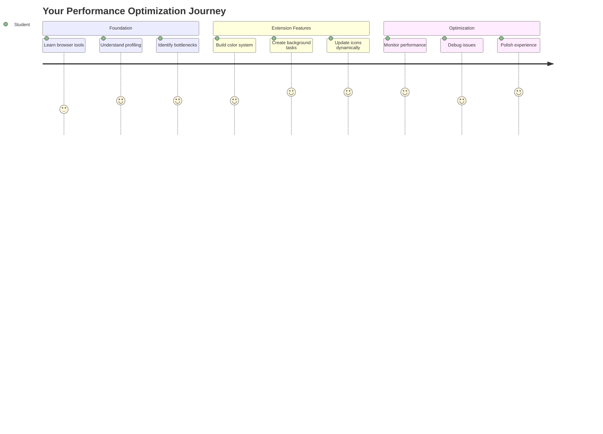

Bazı tarayıcı uzantılarının neden hızlı ve duyarlı hissettirdiğini, diğerlerinin ise neden yavaş göründüğünü hiç merak ettiniz mi? Sır, perde arkasında neler olduğunda gizlidir. Kullanıcılar uzantınızın arayüzünde gezinirken, veri alma, simge güncellemeleri ve sistem kaynaklarını sessizce yöneten bir arka plan işlemleri dünyası vardır.

Bu, tarayıcı uzantısı serimizin son dersidir ve karbon ayak izi takipçinizi sorunsuz çalıştırmayı öğreneceksiniz. Dinamik simge güncellemeleri ekleyecek ve performans sorunlarını sorun haline gelmeden önce nasıl tespit edeceğinizi öğreneceksiniz. Bu, bir yarış arabasını ayarlamak gibi - küçük optimizasyonlar her şeyin nasıl çalıştığı konusunda büyük bir fark yaratabilir.

Dersin sonunda, cilalı bir uzantıya sahip olacak ve iyi web uygulamalarını harika olanlardan ayıran performans ilkelerini anlayacaksınız. Haydi tarayıcı optimizasyonu dünyasına dalalım.

## Ders Öncesi Test

[Ders öncesi test](https://ff-quizzes.netlify.app/web/quiz/27)

### Giriş

Önceki derslerimizde bir form oluşturmuş, bunu bir API'ye bağlamış ve asenkron veri almayı ele almıştınız. Uzantınız güzel bir şekilde şekilleniyor.

Şimdi son dokunuşları eklememiz gerekiyor - örneğin, karbon verilerine göre uzantı simgesinin renk değiştirmesini sağlamak. Bu, NASA'nın Apollo uzay aracındaki her sistemi optimize etmek zorunda olduğu zamana benziyor. Performans hayat kurtarmak için önemli olduğundan, hiçbir döngü veya bellek israfına yer yoktu. Tarayıcı uzantımız o kadar kritik olmasa da, aynı ilkeler geçerli - verimli kod daha iyi kullanıcı deneyimleri yaratır.

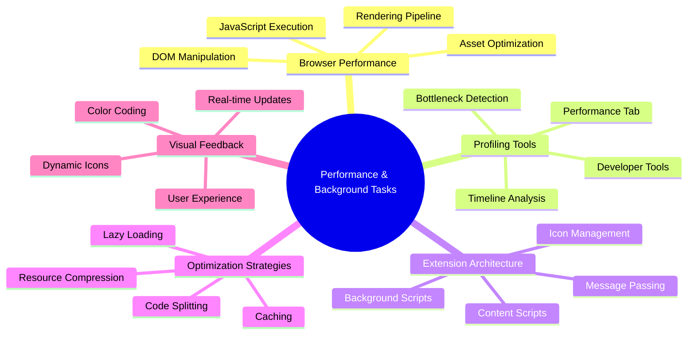

## Web Performansı Temelleri

Kodunuz verimli çalıştığında, insanlar gerçekten *farkı hissedebilir*. Bir sayfa anında yüklendiğinde veya bir animasyon akıcı bir şekilde aktığında yaşadığınız o an? İşte bu, iyi performansın iş başında olduğu an.

Performans sadece hızla ilgili değil - doğal ve akıcı hissettiren web deneyimleri yaratmakla ilgilidir, hantal ve sinir bozucu olanlarla değil. Bilgisayarın ilk günlerinde, Grace Hopper bir nanosecond (yaklaşık bir ayak uzunluğunda bir tel parçası) masasının üzerinde tutardı, ışığın bir milyarda bir saniyede ne kadar yol aldığını göstermek için. Bu, her mikro saniyenin bilgisayarda neden önemli olduğunu açıklama şekliydi. Şimdi, nelerin yavaşladığını anlamanıza yardımcı olan dedektif araçlarını keşfedelim.

> "Web sitesi performansı iki şeyle ilgilidir: sayfanın ne kadar hızlı yüklendiği ve üzerindeki kodun ne kadar hızlı çalıştığı." -- [Zack Grossbart](https://www.smashingmagazine.com/2012/06/javascript-profiling-chrome-developer-tools/)

Web sitelerinizi her tür cihazda, her tür kullanıcı için, her tür durumda son derece hızlı hale getirme konusu, tahmin edilebileceği gibi oldukça geniştir. İster standart bir web projesi ister bir tarayıcı uzantısı oluşturuyor olun, işte aklınızda tutmanız gereken bazı noktalar.

Sitenizi optimize etmenin ilk adımı, kaputun altında neler olduğunu anlamaktır. Neyse ki, tarayıcınızda güçlü dedektif araçları yerleşik olarak bulunur.

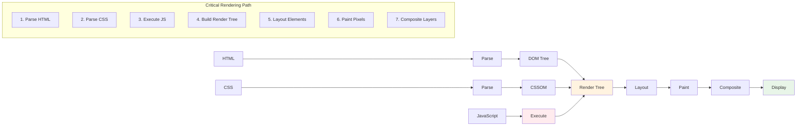

Edge'de Geliştirici Araçlarını açmak için sağ üst köşedeki üç noktaya tıklayın, ardından Daha Fazla Araç > Geliştirici Araçları'na gidin. Veya klavye kısayolunu kullanabilirsiniz: Windows'da `Ctrl` + `Shift` + `I` veya Mac'te `Option` + `Command` + `I`. Oraya vardığınızda, Performans sekmesine tıklayın - araştırmanızı burada yapacaksınız.

**İşte performans dedektif araçlarınız:**
- **Açın** Geliştirici Araçlarını (bir geliştirici olarak bunları sürekli kullanacaksınız!)
- **Performans sekmesine gidin** - bunu web uygulamanızın fitness takipçisi olarak düşünün
- **Kaydı başlatın** ve sayfanızın aksiyonunu izleyin
- **Sonuçları inceleyin** ve nelerin yavaşladığını tespit edin

Haydi bunu deneyelim. Bir web sitesi açın (Microsoft.com bu iş için iyi çalışır) ve 'Kaydı başlat' düğmesine tıklayın. Şimdi sayfayı yenileyin ve profil oluşturucu her şeyi yakalasın. Kaydı durdurduğunuzda, tarayıcının siteyi 'komut dosyaları', 'render' ve 'boyama' işlemleriyle nasıl işlediğine dair ayrıntılı bir döküm göreceksiniz. Bu, görev kontrolünün bir roket fırlatışı sırasında her sistemi izlediği gibi - tam olarak neler olduğunu ve ne zaman olduğunu gerçek zamanlı verilerle görüyorsunuz.

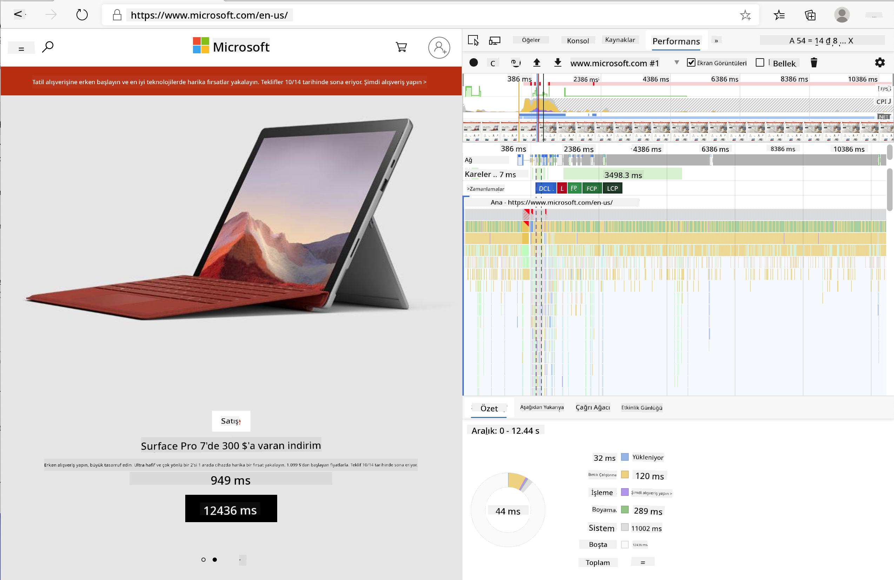

✅ [Microsoft Belgeleri](https://docs.microsoft.com/microsoft-edge/devtools-guide/performance/?WT.mc_id=academic-77807-sagibbon) daha fazla ayrıntı için harika bir kaynak

> İpucu: Test yapmadan önce tarayıcı önbelleğinizi temizleyin, böylece sitenizin ilk kez ziyaret edenler için nasıl performans gösterdiğini görebilirsiniz - genellikle tekrar ziyaretlerden oldukça farklıdır!

Profil zaman çizelgesindeki öğeleri seçerek sayfanız yüklenirken gerçekleşen olaylara yakınlaşabilirsiniz.

Profil zaman çizelgesinin bir bölümünü seçerek ve özet paneline bakarak sayfanızın performansının bir anlık görüntüsünü alın:

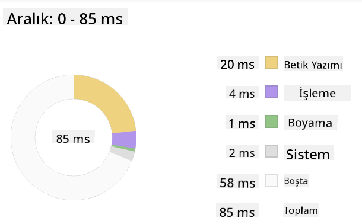

Olay Günlüğü panelini kontrol ederek herhangi bir olayın 15 ms'den uzun sürüp sürmediğini görebilirsiniz:

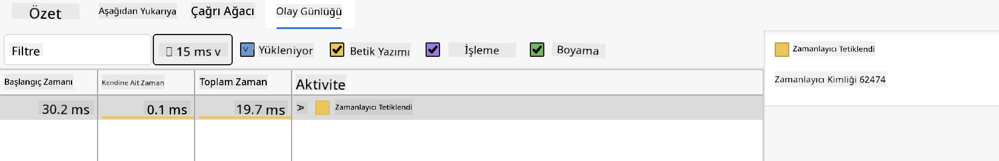

✅ Profil oluşturucuyu tanıyın! Bu sitede geliştirici araçlarını açın ve herhangi bir darboğaz olup olmadığını kontrol edin. En yavaş yüklenen varlık hangisi? En hızlı olan hangisi?

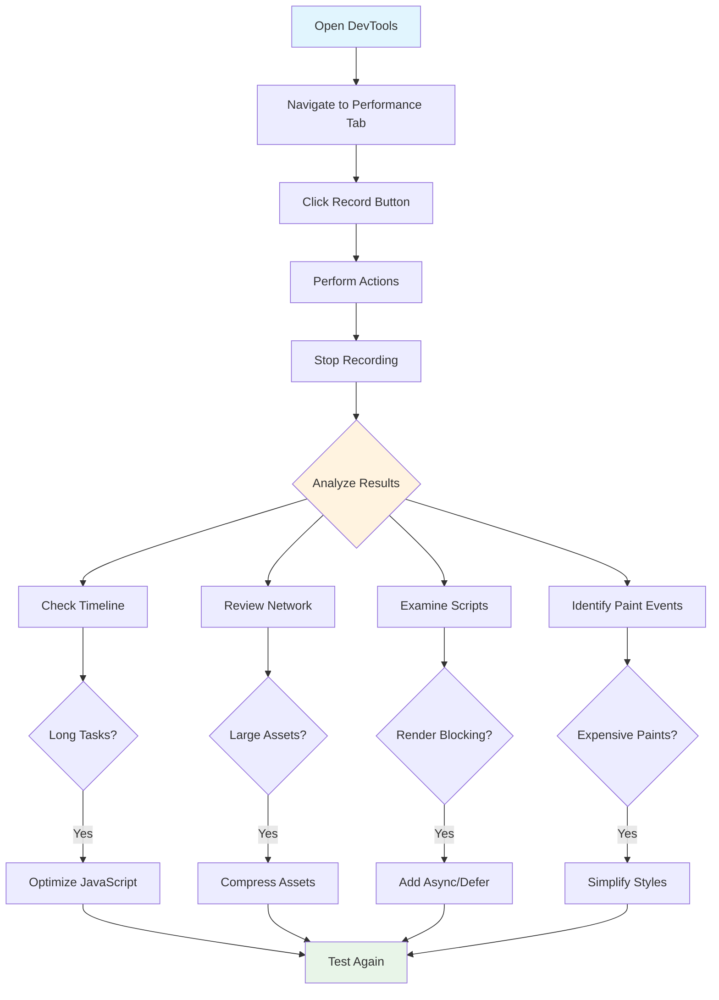

## Profil Oluştururken Nelere Dikkat Edilmeli

Profil oluşturucuyu çalıştırmak sadece başlangıçtır - asıl beceri, o renkli grafiklerin size ne söylediğini anlamaktır. Endişelenmeyin, onları okumayı öğrenirsiniz. Deneyimli geliştiriciler, uyarı işaretlerini tam bir sorun haline gelmeden önce fark etmeyi öğrenmiştir.

Hadi yaygın şüphelilerden - web projelerine sızma eğiliminde olan performans sorunlarından - bahsedelim. Marie Curie'nin laboratuvarında radyasyon seviyelerini dikkatle izlemesi gerektiği gibi, biz de sorunların kaynadığını gösteren belirli desenleri izlemeliyiz. Bunları erken yakalamak size (ve kullanıcılarınıza) çok fazla hayal kırıklığını önleyecektir.

**Varlık boyutları**: Web siteleri yıllar içinde "ağırlaşmaya" başladı ve bu ekstra ağırlığın büyük bir kısmı görüntülerden geliyor. Sanki dijital bavullarımıza daha fazla şey doldurmuşuz gibi.

✅ [Internet Archive](https://httparchive.org/reports/page-weight) sayfa boyutlarının zaman içinde nasıl büyüdüğünü görmek için harika bir kaynak - oldukça açıklayıcı.

**Varlıklarınızı optimize etmenin yolları:**
- **Görüntüleri sıkıştırın!** WebP gibi modern formatlar dosya boyutlarını önemli ölçüde azaltabilir
- **Her cihaz için doğru görüntü boyutunu sunun** - telefonlara büyük masaüstü görüntüleri göndermeye gerek yok
- **CSS ve JavaScript'i küçültün** - her bayt önemlidir
- **Lazy loading kullanın** böylece kullanıcılar gerçekten kaydırdığında görüntüler indirilsin

**DOM geçişleri**: Tarayıcı, yazdığınız koda dayanarak Belge Nesne Modelini oluşturmak zorundadır, bu nedenle iyi sayfa performansı için etiketlerinizi minimumda tutmak, yalnızca sayfanın ihtiyaç duyduğu şeyleri kullanmak ve stil vermek önemlidir. Bu noktada, bir sayfayla ilişkili fazla CSS optimize edilebilir; yalnızca bir sayfada kullanılacak stiller ana stil sayfasına dahil edilmemelidir.

**DOM optimizasyonu için temel stratejiler:**
- **HTML öğelerinin ve iç içe geçme seviyelerinin sayısını azaltır**
- **Kullanılmayan CSS kurallarını kaldırır ve stil sayfalarını verimli bir şekilde birleştirir**
- **Her sayfa için yalnızca gerekli olan CSS'yi yükler**
- **HTML'yi tarayıcı tarafından daha iyi ayrıştırma için anlamsal olarak yapılandırır**

**JavaScript**: Her JavaScript geliştiricisi, DOM'un geri kalanını geçmeden ve tarayıcıya boyamadan önce yüklenmesi gereken 'render-blocking' komut dosyalarına dikkat etmelidir. Inline komut dosyalarınızla `defer` kullanmayı düşünün (Terrarium modülünde olduğu gibi).

**Modern JavaScript optimizasyon teknikleri:**
- **Komut dosyalarını DOM ayrıştırmasından sonra yüklemek için `defer` özniteliğini kullanır**
- **Yalnızca gerekli JavaScript'i yüklemek için kod bölme uygular**
- **Kritik olmayan işlevsellik için lazy loading uygular**
- **Mümkün olduğunda ağır kütüphane ve çerçevelerin kullanımını en aza indirir**

✅ [Site Hız Testi web sitesinde](https://www.webpagetest.org/) bazı siteleri deneyin ve site performansını belirlemek için yapılan yaygın kontroller hakkında daha fazla bilgi edinin.

### 🔄 **Pedagojik Kontrol Noktası**
**Performans Anlayışı**: Uzantı özelliklerini oluşturmadan önce şunları yapabildiğinizden emin olun:
- ✅ HTML'den piksele kadar kritik işleme yolunu açıklayın
- ✅ Web uygulamalarındaki yaygın performans darboğazlarını belirleyin
- ✅ Tarayıcı geliştirici araçlarını kullanarak sayfa performansını profil oluşturun
- ✅ Varlık boyutunun ve DOM karmaşıklığının hızı nasıl etkilediğini anlayın

**Hızlı Kendini Test Et**: Render-blocking JavaScript olduğunda ne olur?
*Cevap: Tarayıcı, HTML'yi ayrıştırmaya ve sayfayı oluşturmaya devam etmeden önce komut dosyasını indirip çalıştırmalıdır.*

**Gerçek Dünya Performans Etkisi**:
- **100ms gecikme**: Kullanıcılar yavaşlamayı fark eder
- **1 saniye gecikme**: Kullanıcılar dikkatlerini kaybetmeye başlar
- **3+ saniye gecikme**: Kullanıcıların %40'ı sayfayı terk eder
- **Mobil ağlar**: Performans daha da önemlidir

Tarayıcının gönderdiğiniz varlıkları nasıl işlediği hakkında bir fikriniz olduğuna göre, uzantınızı tamamlamak için yapmanız gereken son birkaç şeye bakalım:

### Renk Hesaplamak İçin Bir Fonksiyon Oluşturun

Şimdi sayısal verileri anlamlı renklere dönüştüren bir fonksiyon oluşturacağız. Bunu bir trafik ışığı sistemi gibi düşünün - temiz enerji için yeşil, yüksek karbon yoğunluğu için kırmızı.

Bu fonksiyon, API'mizden gelen CO2 verilerini alacak ve çevresel etkiyi en iyi temsil eden rengi belirleyecek. Bu, bilim insanlarının karmaşık veri desenlerini görselleştirmek için ısı haritalarında renk kodlamasını kullanmasına benzer - okyanus sıcaklıklarından yıldız oluşumuna kadar. Bunu `/src/index.js` dosyasına, daha önce ayarladığımız `const` değişkenlerinin hemen ardından ekleyelim:

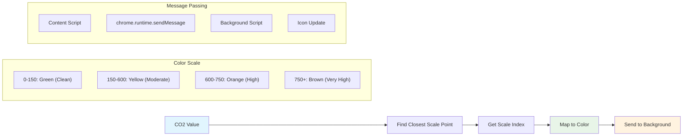

```javascript
function calculateColor(value) {
	// Define CO2 intensity scale (grams per kWh)
	const co2Scale = [0, 150, 600, 750, 800];
	// Corresponding colors from green (clean) to dark brown (high carbon)
	const colors = ['#2AA364', '#F5EB4D', '#9E4229', '#381D02', '#381D02'];

	// Find the closest scale value to our input
	const closestNum = co2Scale.sort((a, b) => {
		return Math.abs(a - value) - Math.abs(b - value);
	})[0];
	
	console.log(`${value} is closest to ${closestNum}`);
	
	// Find the index for color mapping
	const num = (element) => element > closestNum;
	const scaleIndex = co2Scale.findIndex(num);

	const closestColor = colors[scaleIndex];
	console.log(scaleIndex, closestColor);

	// Send color update message to background script
	chrome.runtime.sendMessage({ action: 'updateIcon', value: { color: closestColor } });
}
```

**Bu akıllı küçük fonksiyonu parçalayalım:**
- **İki dizi oluşturur** - biri CO2 seviyeleri için, diğeri renkler için (yeşil = temiz, kahverengi = kirli!)
- **Gerçek CO2 değerimize en yakın eşleşmeyi bulur** bazı güzel dizi sıralama kullanarak
- **Eşleşen rengi alır** findIndex() yöntemiyle
- **Seçilen rengi Chrome'un arka plan komut dosyasına bir mesaj olarak gönderir**
- **Şablon dizileri (o ters tırnak işaretleri) kullanır** daha temiz dize biçimlendirme için
- **Her şeyi düzenli tutar** const bildirimleriyle

`chrome.runtime` [API](https://developer.chrome.com/extensions/runtime) uzantınızın sinir sistemi gibidir - tüm perde arkası iletişim ve görevleri yönetir:

> "chrome.runtime API'sini kullanarak arka plan sayfasını alın, manifest hakkında ayrıntıları döndürün ve uygulama veya uzantı yaşam döngüsündeki olayları dinleyin ve yanıt verin. Ayrıca bu API'yi URL'lerin göreceli yolunu tam nitelikli URL'lere dönüştürmek için kullanabilirsiniz."

**Chrome Runtime API neden bu kadar kullanışlıdır:**
- **Uzantınızın farklı bölümlerinin birbirleriyle konuşmasına izin verir**
- **Arka plan işlerini kullanıcı arayüzünü dondurmadan yönetir**
- **Uzantınızın yaşam döngüsü olaylarını yönetir**
- **Komut dosyaları arasında mesaj iletimini çok kolaylaştırır**

✅ Bu tarayıcı uzantısını Edge için geliştiriyorsanız, Chrome API'si kullandığınıza şaşırabilirsiniz. Yeni Edge tarayıcı sürümleri Chromium tarayıcı motorunda çalışır, bu nedenle bu araçlardan yararlanabilirsiniz.

```mermaid
architecture-beta
    group browser(logos:chrome)[Browser]
    
    service popup(logos:html5)[Popup UI] in browser
    service content(logos:javascript)[Content Script] in browser
    service background(database)[Background Script] in browser
    service api(logos:api)[External API] in browser
    
    popup:R -- L:content
    content:R -- L:background
    background:T -- B:api
    content:T -- B:api
    
    junction junctionCenter in browser
    popup:R -- L:junctionCenter
    junctionCenter:R -- L:background
```

> **İpucu**: Bir tarayıcı uzantısının profilini oluşturmak istiyorsanız, uzantının içinden geliştirici araçlarını başlatın, çünkü bu kendi ayrı tarayıcı örneğidir. Bu, uzantıya özgü performans metriklerine erişim sağlar.

### Varsayılan Simge Rengi Ayarla

Gerçek verileri almaya başlamadan önce, uzantımıza bir başlangıç noktası verelim. Kimse boş veya bozuk görünen bir simgeye bakmayı sevmez. Yeşil bir renkle başlayacağız, böylece kullanıcılar uzantının kurulduğu andan itibaren çalıştığını bilecek.

`init()` fonksiyonunuzda, bu varsayılan yeşil simgeyi ayarlayalım:

```javascript
chrome.runtime.sendMessage({
	action: 'updateIcon',
	value: {
		color: 'green',
	},
});
```

**Bu başlatma şunları başarır:**
- **Nötr bir yeşil renk ayarlar** varsayılan durum olarak
- **Uzantı yüklendiğinde anında görsel geri bildirim sağlar**
- **Arka plan komut dosyasıyla iletişim modelini oluşturur**
- **Veriler yüklenmeden önce kullanıcıların işlevsel bir uzantı görmesini sağlar**

### Fonksiyonu Çağırın, Çağrıyı Gerçekleştirin

Şimdi her şeyin birbiriyle bağlantılı olmasını sağlayalım, böylece yeni CO2 verileri geldiğinde simgeniz otomatik olarak doğru renkle güncellensin. Bu, elektronik bir cihazda son devreyi bağlamak gibi - birdenbire tüm bireysel bileşenler bir sistem olarak çalışır.

API'den CO2 verilerini aldıktan hemen sonra bu satırı ekleyin:

```javascript
// After retrieving CO2 data from the API
// let CO2 = data.data[0].intensity.actual;
calculateColor(CO2);
```

**Bu entegrasyon şunları başarır:**
- **API veri akışını görsel gösterge sistemiyle bağlar**
- **Yeni veriler geldiğinde simge güncellemelerini otomatik olarak tetikler**
- **Mevcut karbon yoğunluğuna dayalı gerçek zamanlı görsel geri bildirim sağlar**
- **Veri alma ve görüntüleme mantığı arasındaki sorumluluk ayrımını korur**

Ve son olarak, `/dist/background.js` dosyasında bu arka plan eylem çağrıları için dinleyiciyi ekleyin:

```javascript
// Listen for messages from the content script
chrome.runtime.onMessage.addListener(function (msg, sender, sendResponse) {
	if (msg.action === 'updateIcon') {
		chrome.action.setIcon({ imageData: drawIcon(msg.value) });
	}
});

// Draw dynamic icon using Canvas API
// Borrowed from energy lollipop extension - nice feature!
function drawIcon(value) {
	// Create an offscreen canvas for better performance
	const canvas = new OffscreenCanvas(200, 200);
	const context = canvas.getContext('2d');

	// Draw a colored circle representing carbon intensity
	context.beginPath();
	context.fillStyle = value.color;
	context.arc(100, 100, 50, 0, 2 * Math.PI);
	context.fill();

	// Return the image data for the browser icon
	return context.getImageData(50, 50, 100, 100);
}
```

**Bu arka plan komut dosyası şunları yapar:**
- **Ana komut dosyanızdan gelen mesajları dinler** (bir resepsiyonist gibi çağrıları alır)
- **Bu 'updateIcon' isteklerini işleyerek araç çubuğu simgenizi değiştirir**
- **Canvas API kullanarak yeni simgeler oluşturur**
- **Mevcut karbon yoğunluğunu gösteren basit bir renkli daire çizer**
- **Tarayıcı araç çubuğunuzu yeni simgeyle günceller**
- **OffscreenCanvas kullanarak sorunsuz performans sağlar** (kullanıcı arayüzü donması olmadan)

✅ Canvas API hakkında daha fazla bilgi edineceksiniz [Uzay Oyunu derslerinde](../../6-space-game/2-drawing-to-canvas/README.md).

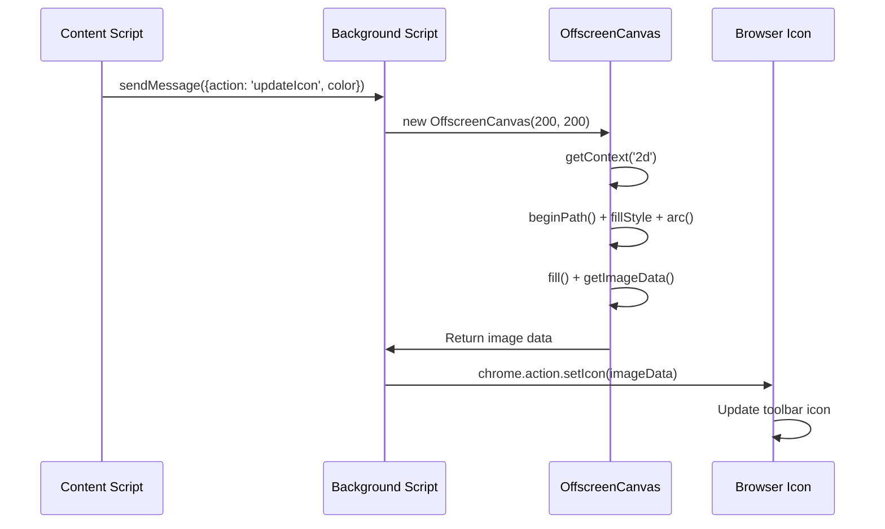

### 🔄 **Pedagojik Kontrol Noktası**
**Tam Uzantı Anlayışı**: Tüm sistemi tam olarak anladığınızı doğrulayın:
- ✅ Farklı uzantı komut dosyaları arasında mesaj iletimi nasıl çalışır?
- ✅ Performans için neden OffscreenCanvas yerine normal Canvas kullanıyoruz?
- ✅ Chrome Runtime API, uzantı mimarisinde hangi rolü oynar?
- ✅ Renk hesaplama algoritması, verileri görsel geri bildirime nasıl dönüştürür?

**Performans Düşünceleri**: Uzantınız artık şunları sergiliyor:
- **Verimli mesajlaşma**: Script bağlamları arasında temiz iletişim
- **Optimize edilmiş render**: OffscreenCanvas, UI bloklamasını önler
- **Gerçek zamanlı güncellemeler**: Canlı verilere dayalı dinamik simge değişiklikleri
- **Bellek yönetimi**: Uygun temizlik ve kaynak kullanımı

**Uzantınızı test etme zamanı:**
- **Her şeyi derleyin** `npm run build` komutuyla
- **Yeniden yükleyin** uzantınızı tarayıcıda (bu adımı unutmayın)
- **Açın** uzantınızı ve simgenin renk değiştirdiğini izleyin
- **Kontrol edin** dünya çapındaki gerçek karbon verilerine nasıl tepki verdiğini

Artık çamaşır yıkamak için doğru zaman olup olmadığını veya daha temiz enerji için beklemeniz gerekip gerekmediğini bir bakışta anlayabilirsiniz. Gerçekten faydalı bir şey inşa ettiniz ve bu süreçte tarayıcı performansı hakkında bilgi edindiniz.

## GitHub Copilot Agent Challenge 🚀

Agent modunu kullanarak aşağıdaki meydan okumayı tamamlayın:

**Açıklama:** Tarayıcı uzantısının performans izleme yeteneklerini geliştirerek uzantının farklı bileşenlerinin yükleme sürelerini izleyen ve görüntüleyen bir özellik ekleyin.

**İstek:** Tarayıcı uzantısı için bir performans izleme sistemi oluşturun. Bu sistem, API'den CO2 verilerini alma, renkleri hesaplama ve simgeyi güncelleme işlemlerinin süresini ölçer ve sonuçları tarayıcı konsolunda zaman damgaları ve süre metrikleriyle görüntüler. Bu işlemleri ölçmek için Performance API'sini kullanan ve sonuçları konsolda gösteren `performanceTracker` adlı bir fonksiyon ekleyin.

[Agent modunu](https://code.visualstudio.com/blogs/2025/02/24/introducing-copilot-agent-mode) burada öğrenin.

## 🚀 Meydan Okuma

İşte ilginç bir dedektiflik görevi: yıllardır var olan birkaç açık kaynaklı web sitesini (Wikipedia, GitHub veya Stack Overflow gibi) seçin ve commit geçmişlerini inceleyin. Performans iyileştirmelerini nerede yaptıklarını görebiliyor musunuz? Sürekli ortaya çıkan sorunlar neler?

**Araştırma yaklaşımınız:**
- **Ara** commit mesajlarında "optimize", "performans" veya "daha hızlı" gibi kelimeleri
- **Bak** desenlere - sürekli aynı tür sorunları mı düzeltiyorlar?
- **Belirle** web sitelerini yavaşlatan yaygın nedenleri
- **Paylaş** bulduklarınızı - diğer geliştiriciler gerçek dünya örneklerinden öğrenir

## Ders Sonrası Test

[Ders sonrası test](https://ff-quizzes.netlify.app/web/quiz/28)

## Gözden Geçirme ve Kendi Kendine Çalışma

Bir [performans bültenine](https://perf.email/) abone olmayı düşünün.

Tarayıcıların web performansını nasıl değerlendirdiğini, web araçlarındaki performans sekmelerini inceleyerek araştırın. Önemli farklılıklar buluyor musunuz?

### ⚡ **Sonraki 5 Dakikada Yapabilecekleriniz**
- [ ] Tarayıcı Görev Yöneticisini açın (Chrome'da Shift+Esc) ve uzantı kaynak kullanımını görün
- [ ] DevTools Performans sekmesini kullanarak web sayfası performansını kaydedin ve analiz edin
- [ ] Tarayıcının Uzantılar sayfasını kontrol ederek hangi uzantıların başlangıç süresini etkilediğini görün
- [ ] Uzantıları geçici olarak devre dışı bırakarak performans farklarını test edin

### 🎯 **Bir Saatte Başarabilecekleriniz**
- [ ] Ders sonrası testi tamamlayın ve performans kavramlarını anlayın
- [ ] Tarayıcı uzantınız için bir arka plan scripti uygulayın
- [ ] Verimli arka plan görevleri için browser.alarms kullanmayı öğrenin
- [ ] İçerik scriptleri ile arka plan scriptleri arasında mesaj iletimini pratik yapın
- [ ] Uzantınızın kaynak kullanımını ölçün ve optimize edin

### 📅 **Bir Haftalık Performans Yolculuğunuz**
- [ ] Arka plan işlevselliği olan yüksek performanslı bir tarayıcı uzantısı tamamlayın
- [ ] Hizmet çalışanları ve modern uzantı mimarisinde ustalaşın
- [ ] Verimli veri senkronizasyonu ve önbellekleme stratejileri uygulayın
- [ ] Uzantı performansı için gelişmiş hata ayıklama tekniklerini öğrenin
- [ ] Uzantınızı hem işlevsellik hem de kaynak verimliliği açısından optimize edin
- [ ] Uzantı performans senaryoları için kapsamlı testler oluşturun

### 🌟 **Bir Aylık Optimizasyon Ustalığı**
- [ ] Optimal performansa sahip kurumsal düzeyde tarayıcı uzantıları oluşturun
- [ ] Web Workers, Service Workers ve modern web performansı hakkında bilgi edinin
- [ ] Performans optimizasyonuna odaklanan açık kaynak projelerine katkıda bulunun
- [ ] Tarayıcı iç yapıları ve gelişmiş hata ayıklama tekniklerinde ustalaşın
- [ ] Performans izleme araçları ve en iyi uygulama kılavuzları oluşturun
- [ ] Web uygulamalarını optimize eden bir performans uzmanı olun

## 🎯 Tarayıcı Uzantısı Geliştirme Ustalığı Zaman Çizelgeniz

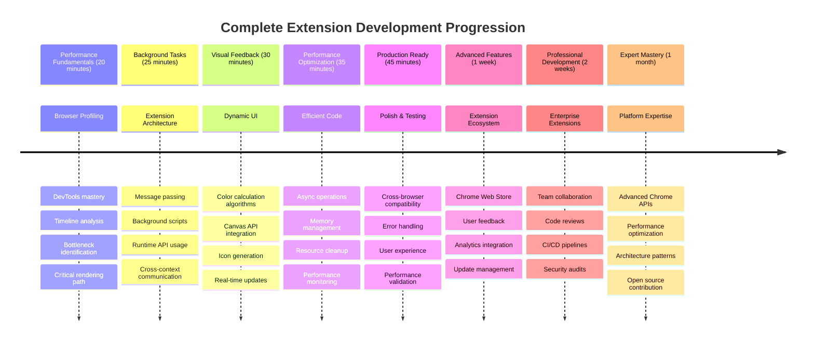

### 🛠️ Tam Uzantı Geliştirme Araç Setiniz

Bu üçlemeyi tamamladıktan sonra şunlarda ustalaştınız:
- **Tarayıcı Mimarisi**: Uzantıların tarayıcı sistemleriyle nasıl entegre olduğunu derinlemesine anlama
- **Performans Profili**: Geliştirici araçlarını kullanarak darboğazları belirleme ve düzeltme yeteneği
- **Asenkron Programlama**: Modern JavaScript desenleriyle duyarlı, engellemeyen işlemler
- **API Entegrasyonu**: Kimlik doğrulama ve hata yönetimi ile harici veri alma
- **Görsel Tasarım**: Dinamik UI güncellemeleri ve Canvas tabanlı grafik oluşturma
- **Mesaj İletimi**: Uzantı mimarilerinde scriptler arası iletişim
- **Kullanıcı Deneyimi**: Yükleme durumları, hata yönetimi ve sezgisel etkileşimler
- **Üretim Becerileri**: Gerçek dünya dağıtımı için test, hata ayıklama ve optimizasyon

**Gerçek Dünya Uygulamaları**: Uzantı geliştirme becerileriniz doğrudan şunlara uygulanabilir:
- **Progressive Web Apps**: Benzer mimari ve performans desenleri
- **Electron Masaüstü Uygulamaları**: Web teknolojilerini kullanan çapraz platform uygulamaları
- **Mobil Hibrit Uygulamalar**: Cordova/PhoneGap ile web API'lerini kullanarak geliştirme
- **Kurumsal Web Uygulamaları**: Karmaşık kontrol paneli ve üretkenlik araçları
- **Chrome DevTools Uzantıları**: Gelişmiş geliştirici araçları ve hata ayıklama
- **Web API Entegrasyonu**: Harici hizmetlerle iletişim kuran herhangi bir uygulama

**Profesyonel Etki**: Artık şunları yapabilirsiniz:
- **Oluşturun** konseptten dağıtıma kadar üretime hazır tarayıcı uzantıları
- **Optimize edin** web uygulaması performansını endüstri standartlarındaki profil araçlarını kullanarak
- **Mimari oluşturun** uygun sorumluluk ayrımı ile ölçeklenebilir sistemler
- **Hata ayıklayın** karmaşık asenkron işlemleri ve bağlamlar arası iletişimi
- **Katkıda bulunun** açık kaynak uzantı projelerine ve tarayıcı standartlarına

**Bir Sonraki Seviye Fırsatlar**:
- **Chrome Web Store Geliştiricisi**: Milyonlarca kullanıcı için uzantılar yayınlayın
- **Web Performans Mühendisi**: Optimizasyon ve kullanıcı deneyimi konusunda uzmanlaşın
- **Tarayıcı Platformu Geliştiricisi**: Tarayıcı motoru geliştirmeye katkıda bulunun
- **Uzantı Çerçeve Yaratıcısı**: Diğer geliştiricilere yardımcı olacak araçlar oluşturun
- **Geliştirici İlişkileri**: Öğretim ve içerik oluşturma yoluyla bilgi paylaşın

🌟 **Başarı Kilidi Açıldı**: Profesyonel geliştirme uygulamalarını ve modern web standartlarını sergileyen eksiksiz, işlevsel bir tarayıcı uzantısı oluşturdunuz!

## Ödev

[Bir siteyi performans açısından analiz edin](assignment.md)

---

**Feragatname**:  
Bu belge, AI çeviri hizmeti [Co-op Translator](https://github.com/Azure/co-op-translator) kullanılarak çevrilmiştir. Doğruluk için çaba göstersek de, otomatik çevirilerin hata veya yanlışlıklar içerebileceğini lütfen unutmayın. Belgenin orijinal dili, yetkili kaynak olarak kabul edilmelidir. Kritik bilgiler için profesyonel insan çevirisi önerilir. Bu çevirinin kullanımından kaynaklanan yanlış anlamalar veya yanlış yorumlamalar için sorumluluk kabul edilmez.