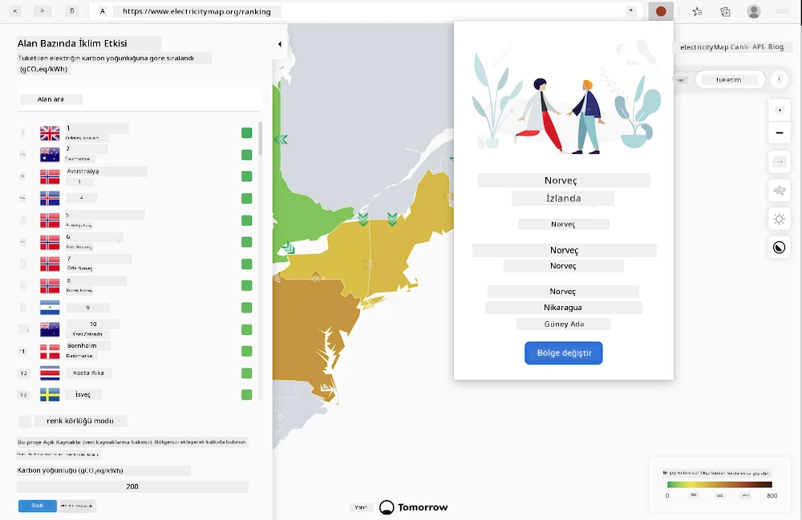
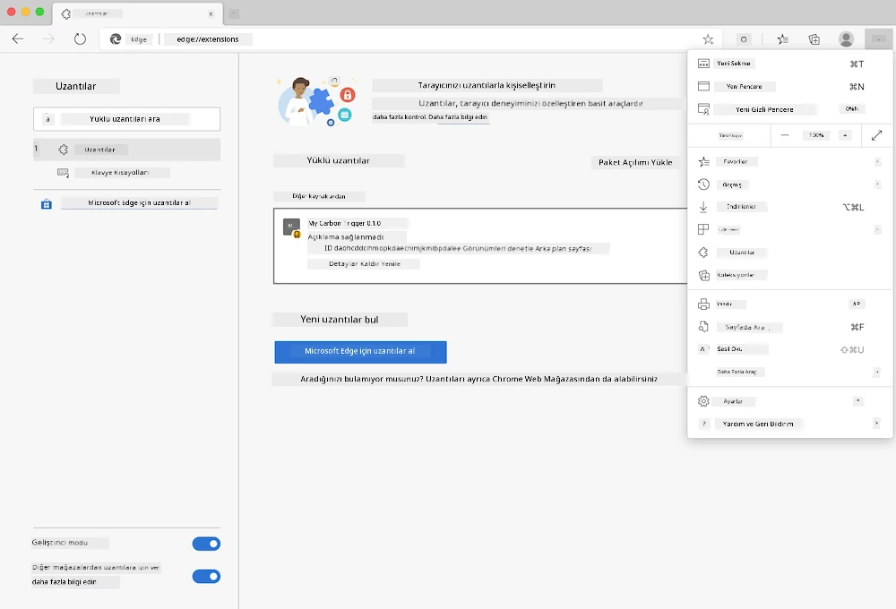

<!--
CO_OP_TRANSLATOR_METADATA:
{
  "original_hash": "9a6b22a2eff0f499b66236be973b24ad",
  "translation_date": "2025-08-26T00:00:26+00:00",
  "source_file": "5-browser-extension/solution/translation/README.it.md",
  "language_code": "tr"
}
-->
# Carbon Trigger Tarayıcı Eklentisi: Başlangıç Kodu

Elektrik kullanımını izlemek için tmrow'un Signal CO2 API'sini kullanarak, bölgenizdeki elektrik kullanımının ne kadar yoğun olduğunu doğrudan tarayıcınızda hatırlatacak bir tarayıcı eklentisi oluşturacağız. Bu özel eklentiyi kullanmak, bu bilgilere dayanarak kendi aktivitelerinizi değerlendirmenize yardımcı olacaktır.



## Başlangıç

[npm](https://npmjs.com)'in yüklü olması gereklidir. Bu kodun bir kopyasını bilgisayarınızdaki bir klasöre indirin.

Gerekli tüm paketleri yükleyin:

```
npm install
```

Webpack ile eklentiyi oluşturun:

```
npm run build
```

Edge'e yüklemek için, tarayıcının sağ üst köşesindeki "üç nokta" menüsünü kullanarak Eklentiler panelini bulun. Henüz etkin değilse, Geliştirici Modu'nu (sol alt köşede) etkinleştirin. Yeni bir eklenti yüklemek için "Sıkıştırılmamış yükle" seçeneğini seçin. İstemde "dist" klasörünü açın ve eklenti yüklenecektir. Kullanmak için, CO2 Signal API'si için bir API anahtarına ihtiyacınız olacak ([buradan e-posta yoluyla alabilirsiniz](https://www.co2signal.com/) - bu sayfadaki kutuya e-posta adresinizi girin) ve [elektrik haritasına](https://www.electricitymap.org/map) karşılık gelen [bölge koduna](http://api.electricitymap.org/v3/zones) ihtiyacınız olacak (örneğin, Boston için "US-NEISO").



API anahtarı ve bölge eklenti arayüzüne girildiğinde, tarayıcı eklenti çubuğundaki renkli nokta, bölgenin enerji kullanımını yansıtacak şekilde değişmelidir ve yüksek enerji tüketen hangi aktivitelerin uygun olabileceği konusunda bir gösterge sağlayacaktır. Bu "nokta" sisteminin arkasındaki konsept, Kaliforniya emisyonları için [Energy Lollipop eklentisi](https://energylollipop.com/) tarafından sağlanmıştır.

**Feragatname**:  
Bu belge, AI çeviri hizmeti [Co-op Translator](https://github.com/Azure/co-op-translator) kullanılarak çevrilmiştir. Doğruluk için çaba göstersek de, otomatik çevirilerin hata veya yanlışlık içerebileceğini lütfen unutmayın. Belgenin orijinal dili, yetkili kaynak olarak kabul edilmelidir. Kritik bilgiler için profesyonel insan çevirisi önerilir. Bu çevirinin kullanımından kaynaklanan yanlış anlamalar veya yanlış yorumlamalar için sorumluluk kabul etmiyoruz.