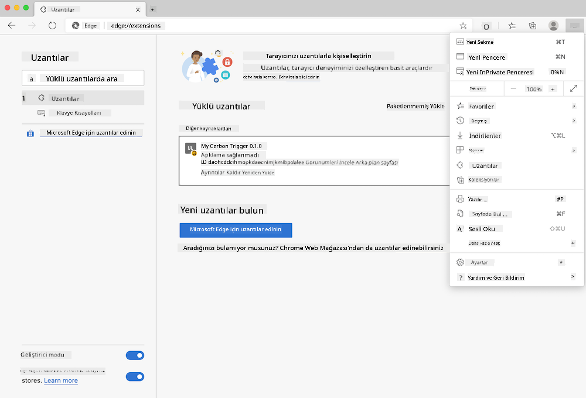

<!--
CO_OP_TRANSLATOR_METADATA:
{
  "original_hash": "26fd39046d264ba185dcb086d3a8cf3e",
  "translation_date": "2025-08-25T23:36:09+00:00",
  "source_file": "5-browser-extension/start/README.md",
  "language_code": "tr"
}
-->
# Karbon Tetikleyici Tarayıcı Uzantısı: Başlangıç Kodu

Elektrik kullanımını takip etmek için tmrow'un CO2 Signal API'sini kullanarak, bölgenizdeki elektrik kullanımının ne kadar yoğun olduğunu tarayıcınızda hatırlatıcı olarak görebileceğiniz bir tarayıcı uzantısı oluşturun. Bu uzantıyı rastgele kullanmak, bu bilgilere dayanarak aktiviteleriniz hakkında karar vermenize yardımcı olacaktır.


## Başlarken

[Node.js](https://npmjs.com) yüklü olmalıdır. Bu kodun bir kopyasını bilgisayarınızdaki bir klasöre indirin.

Gerekli tüm paketleri yükleyin:

```
npm install
```

Webpack ile uzantıyı oluşturun:

```
npm run build
```

Edge tarayıcısında yüklemek için, tarayıcının sağ üst köşesindeki 'üç nokta' menüsünü kullanarak Uzantılar panelini bulun. Buradan 'Paketlenmemiş Yükle' seçeneğini seçerek yeni bir uzantı yükleyin. İstendiğinde 'dist' klasörünü açın ve uzantı yüklenecektir. Kullanmak için, CO2 Signal API'si için bir API anahtarına ([buradan e-posta ile alın](https://www.co2signal.com/) - bu sayfadaki kutuya e-posta adresinizi girin) ve [Electricity Map](https://www.electricitymap.org/map) ile ilgili bölgenizin koduna ([kodları burada bulabilirsiniz](http://api.electricitymap.org/v3/zones)) ihtiyacınız olacak (örneğin, Boston'da 'US-NEISO' kullanıyorum).



API anahtarı ve bölge uzantı arayüzüne girildikten sonra, tarayıcı uzantı çubuğundaki renkli nokta bölgenizin enerji kullanımını yansıtacak şekilde değişmelidir ve enerji yoğun aktiviteleriniz için uygun bir yönlendirme sağlayacaktır. Bu 'nokta' sisteminin konsepti, California emisyonları için [Energy Lollipop uzantısı](https://energylollipop.com/) tarafından bana önerildi.

**Feragatname**:  
Bu belge, AI çeviri hizmeti [Co-op Translator](https://github.com/Azure/co-op-translator) kullanılarak çevrilmiştir. Doğruluk için çaba göstersek de, otomatik çevirilerin hata veya yanlışlıklar içerebileceğini lütfen unutmayın. Belgenin orijinal dilindeki hali, yetkili kaynak olarak kabul edilmelidir. Kritik bilgiler için profesyonel insan çevirisi önerilir. Bu çevirinin kullanımından kaynaklanan yanlış anlamalar veya yanlış yorumlamalar için sorumluluk kabul etmiyoruz.