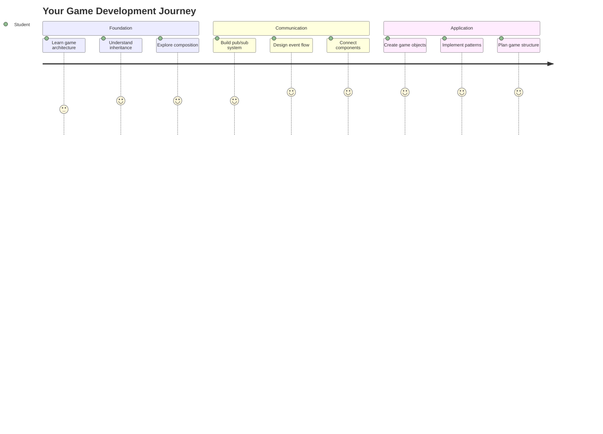
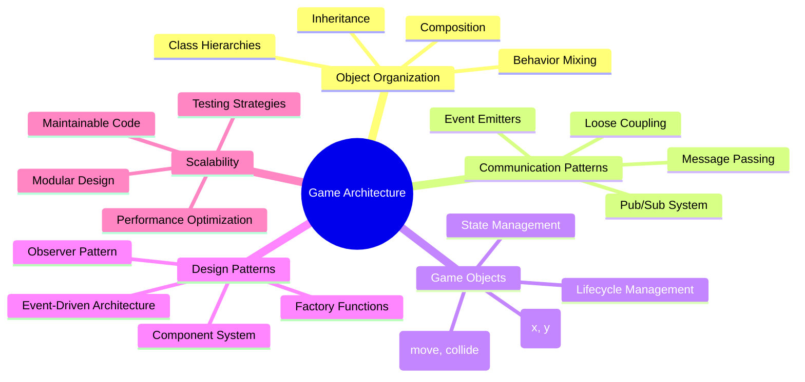
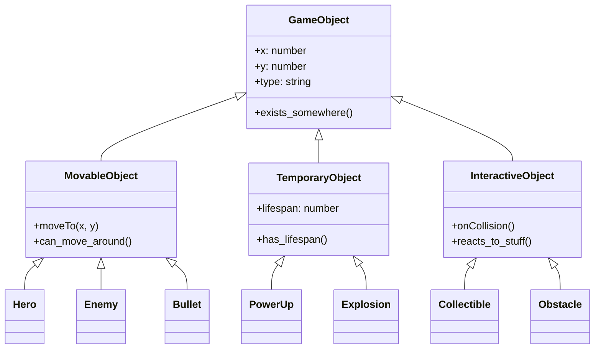
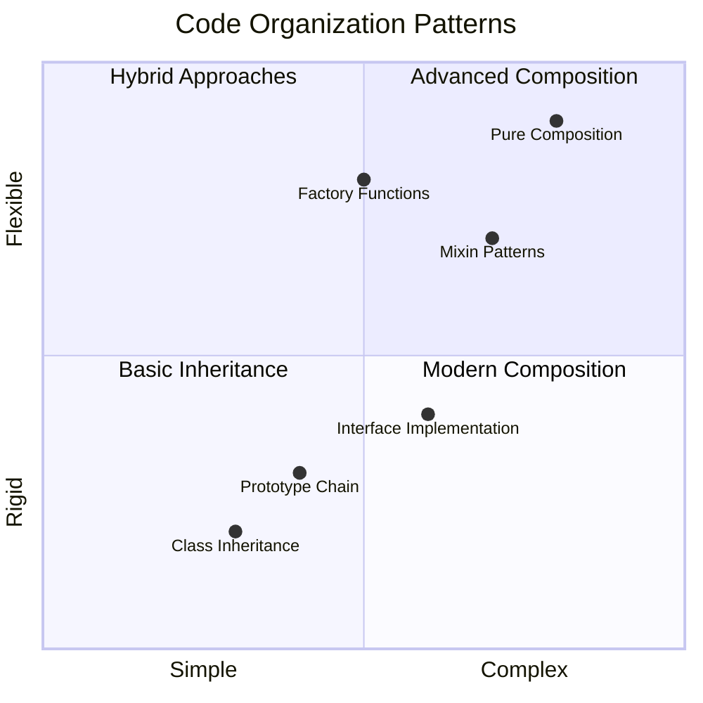
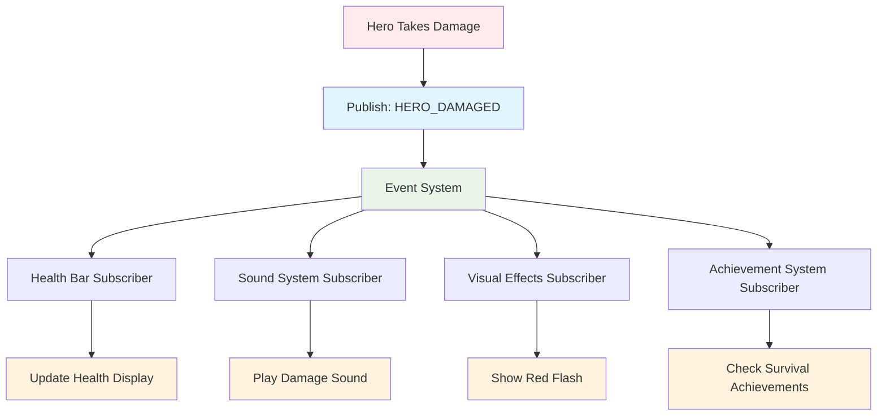
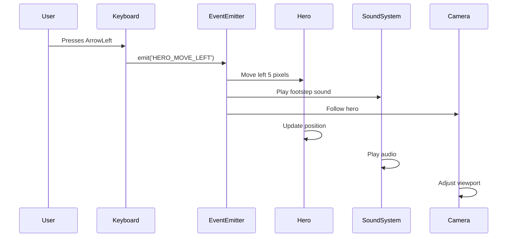
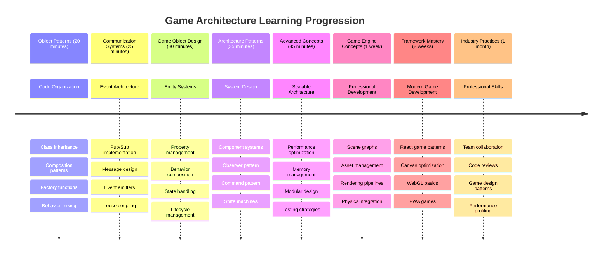

# Uzay Oyunu Yapımı Bölüm 1: Giriş




NASA'nın görev kontrol merkezi bir uzay fırlatışı sırasında birden fazla sistemi nasıl koordine ediyorsa, biz de bir programın farklı bölümlerinin sorunsuz bir şekilde birlikte çalışmasını gösteren bir uzay oyunu yapacağız. Oynayabileceğiniz bir şey yaratırken, herhangi bir yazılım projesine uygulanabilecek temel programlama kavramlarını öğreneceksiniz.

Kod organizasyonu için iki temel yaklaşımı keşfedeceğiz: kalıtım ve bileşim. Bunlar sadece akademik kavramlar değil – video oyunlarından bankacılık sistemlerine kadar her şeyi güçlendiren aynı desenlerdir. Ayrıca, uzay araçlarında kullanılan iletişim ağları gibi, farklı bileşenlerin bağımlılık oluşturmadan bilgi paylaşmasını sağlayan pub/sub adlı bir iletişim sistemini uygulayacağız.

Bu serinin sonunda, oyunlar, web uygulamaları veya başka herhangi bir yazılım sistemi geliştirirken ölçeklenebilir ve evrimleşebilir uygulamalar oluşturmayı anlayacaksınız.



## Ders Öncesi Test

[Ders öncesi test](https://ff-quizzes.netlify.app/web/quiz/29)

## Oyun Geliştirmede Kalıtım ve Bileşim

Projeler karmaşıklık kazandıkça, kod organizasyonu kritik hale gelir. Basit bir script olarak başlayan şey, uygun bir yapı olmadan bakımı zor hale gelebilir – tıpkı Apollo görevlerinin binlerce bileşen arasında dikkatli bir koordinasyon gerektirdiği gibi.

Kod organizasyonu için iki temel yaklaşımı inceleyeceğiz: kalıtım ve bileşim. Her birinin kendine özgü avantajları vardır ve her ikisini anlamak, farklı durumlar için doğru yaklaşımı seçmenize yardımcı olur. Bu kavramları, kahramanların, düşmanların, güçlendirmelerin ve diğer nesnelerin verimli bir şekilde etkileşimde bulunması gereken uzay oyunumuz aracılığıyla göstereceğiz.

✅ Yazılmış en ünlü programlama kitaplarından biri [tasarım desenleri](https://en.wikipedia.org/wiki/Design_Patterns) ile ilgilidir.

Her oyunda, oyun dünyanızı dolduran etkileşimli öğeler olan `oyun nesneleri` vardır. Kahramanlar, düşmanlar, güçlendirmeler ve görsel efektler hepsi oyun nesneleridir. Her biri, bir koordinat düzleminde noktaları çizmek gibi `x` ve `y` değerlerini kullanarak belirli ekran koordinatlarında bulunur.

Görsel farklılıklarına rağmen, bu nesneler genellikle temel davranışları paylaşır:

- **Bir yerde bulunurlar** – Her nesne x ve y koordinatlarına sahiptir, böylece oyun onu nereye çizeceğini bilir
- **Birçoğu hareket edebilir** – Kahramanlar koşar, düşmanlar kovalar, mermiler ekran boyunca uçar
- **Bir ömre sahiptirler** – Bazıları sonsuza kadar kalır, diğerleri (patlamalar gibi) kısa bir süre görünür ve kaybolur
- **Bir şeylere tepki verirler** – Çarpışmalar olduğunda, güçlendirmeler toplanır, sağlık çubukları güncellenir

✅ Pac-Man gibi bir oyunu düşünün. Bu oyunda yukarıda listelenen dört nesne türünü tanımlayabilir misiniz?



### Davranışı Kodla İfade Etmek

Artık oyun nesnelerinin paylaştığı ortak davranışları anladığınıza göre, bu davranışları JavaScript'te nasıl uygulayacağımızı inceleyelim. Nesne davranışlarını sınıflara veya bireysel nesnelere eklenmiş yöntemler aracılığıyla ifade edebilirsiniz ve seçebileceğiniz birkaç yaklaşım vardır.

**Sınıf Tabanlı Yaklaşım**

Sınıflar ve kalıtım, oyun nesnelerini organize etmek için yapılandırılmış bir yaklaşım sağlar. Carl Linnaeus tarafından geliştirilen taksonomik sınıflandırma sistemi gibi, ortak özellikler içeren bir temel sınıfla başlarsınız, ardından bu temelleri miras alırken belirli yetenekler ekleyen özel sınıflar oluşturursunuz.

✅ Kalıtım önemli bir kavramdır. [MDN'nin kalıtım hakkındaki makalesinde](https://developer.mozilla.org/docs/Web/JavaScript/Inheritance_and_the_prototype_chain) daha fazla bilgi edinin.

İşte sınıflar ve kalıtım kullanarak oyun nesnelerini nasıl uygulayabileceğiniz:

```javascript
// Step 1: Create the base GameObject class
class GameObject {
  constructor(x, y, type) {
    this.x = x;
    this.y = y;
    this.type = type;
  }
}
```

**Bunu adım adım inceleyelim:**
- Her oyun nesnesinin kullanabileceği temel bir şablon oluşturuyoruz
- Yapıcı, nesnenin nerede olduğunu (`x`, `y`) ve ne tür bir şey olduğunu kaydeder
- Bu, tüm oyun nesnelerinizin üzerine inşa edileceği temel haline gelir

```javascript
// Step 2: Add movement capability through inheritance
class Movable extends GameObject {
  constructor(x, y, type) {
    super(x, y, type); // Call parent constructor
  }

  // Add the ability to move to a new position
  moveTo(x, y) {
    this.x = x;
    this.y = y;
  }
}
```

**Yukarıda şunları yaptık:**
- GameObject sınıfını genişleterek hareket işlevselliği ekledik
- `super()` kullanarak miras alınan özellikleri başlatmak için üst yapıcıyı çağırdık
- Nesnenin konumunu güncelleyen bir `moveTo()` yöntemi ekledik

```javascript
// Step 3: Create specific game object types
class Hero extends Movable {
  constructor(x, y) {
    super(x, y, 'Hero'); // Set type automatically
  }
}

class Tree extends GameObject {
  constructor(x, y) {
    super(x, y, 'Tree'); // Trees don't need movement
  }
}

// Step 4: Use your game objects
const hero = new Hero(0, 0);
hero.moveTo(5, 5); // Hero can move!

const tree = new Tree(10, 15);
// tree.moveTo() would cause an error - trees can't move
```

**Bu kavramları anlamak:**
- Uygun davranışları miras alan özel nesne türleri oluşturur
- Kalıtımın seçici özellik eklemeye nasıl izin verdiğini gösterir
- Kahramanların hareket edebileceğini, ağaçların ise sabit kalacağını gösterir
- Sınıf hiyerarşisinin uygunsuz eylemleri nasıl önlediğini açıklar

✅ Birkaç dakika ayırarak bir Pac-Man kahramanını (örneğin Inky, Pinky veya Blinky) yeniden tasarlayın ve JavaScript'te nasıl yazılacağını düşünün.

**Bileşim Yaklaşımı**

Bileşim, mühendislerin uzay araçlarını değiştirilebilir bileşenlerle tasarladığı modüler bir tasarım felsefesini takip eder. Bir üst sınıftan miras almak yerine, belirli davranışları birleştirerek tam olarak ihtiyaç duyduğu işlevselliğe sahip nesneler oluşturursunuz. Bu yaklaşım, katı hiyerarşik kısıtlamalar olmadan esneklik sunar.

```javascript
// Step 1: Create base behavior objects
const gameObject = {
  x: 0,
  y: 0,
  type: ''
};

const movable = {
  moveTo(x, y) {
    this.x = x;
    this.y = y;
  }
};
```

**Bu kodun yaptığı şey:**
- Konum ve tür özelliklerine sahip bir temel `gameObject` tanımlar
- Hareket işlevselliğine sahip ayrı bir `movable` davranış nesnesi oluşturur
- Konum verilerini ve hareket mantığını bağımsız tutarak endişeleri ayırır

```javascript
// Step 2: Compose objects by combining behaviors
const movableObject = { ...gameObject, ...movable };

// Step 3: Create factory functions for different object types
function createHero(x, y) {
  return {
    ...movableObject,
    x,
    y,
    type: 'Hero'
  };
}

function createStatic(x, y, type) {
  return {
    ...gameObject,
    x,
    y,
    type
  };
}
```

**Yukarıda şunları yaptık:**
- Temel nesne özelliklerini hareket davranışıyla yayılma sözdizimi kullanarak birleştirdik
- Özelleştirilmiş nesneler döndüren fabrika fonksiyonları oluşturduk
- Katı sınıf hiyerarşileri olmadan esnek nesne oluşturmayı sağladık
- Nesnelerin tam olarak ihtiyaç duyduğu davranışlara sahip olmasını sağladık

```javascript
// Step 4: Create and use your composed objects
const hero = createHero(10, 10);
hero.moveTo(5, 5); // Works perfectly!

const tree = createStatic(0, 0, 'Tree');
// tree.moveTo() is undefined - no movement behavior was composed
```

**Hatırlanması gereken önemli noktalar:**
- Nesneleri miras almak yerine davranışları karıştırarak oluşturur
- Katı kalıtım hiyerarşilerinden daha fazla esneklik sağlar
- Nesnelerin tam olarak ihtiyaç duyduğu özelliklere sahip olmasını sağlar
- Temiz nesne kombinasyonu için modern JavaScript yayılma sözdizimini kullanır
```

**Which Pattern Should You Choose?**

**Which Pattern Should You Choose?**



> 💡 **Profesyonel İpucu**: Her iki desen de modern JavaScript geliştirmede yerini bulur. Sınıflar açıkça tanımlanmış hiyerarşiler için iyi çalışır, bileşim ise maksimum esneklik gerektiğinde öne çıkar.
> 
**Her yaklaşımı ne zaman kullanmalı:**
- **Kalıtımı seçin**: Açık "bir türdür" ilişkileri olduğunda (Bir Kahraman *bir tür* Hareketli nesnedir)
- **Bileşimi seçin**: "Sahiptir" ilişkileri gerektiğinde (Bir Kahraman *hareket yeteneklerine sahiptir*)
- **Ekibinizin tercihlerini ve proje gereksinimlerini göz önünde bulundurun**
- **Her iki yaklaşımı** aynı uygulamada karıştırabileceğinizi unutmayın

### 🔄 **Pedagojik Kontrol**
**Nesne Organizasyonu Anlayışı**: İletişim desenlerine geçmeden önce şunları yapabildiğinizden emin olun:
- ✅ Kalıtım ve bileşim arasındaki farkı açıklayın
- ✅ Sınıfları fabrika fonksiyonlarına karşı ne zaman kullanacağınızı belirleyin
- ✅ Kalıtımda `super()` anahtar kelimesinin nasıl çalıştığını anlayın
- ✅ Oyun geliştirme için her yaklaşımın avantajlarını tanıyın

**Hızlı Kendini Test Etme**: Hem hareket edebilen hem de uçabilen bir Uçan Düşman nasıl oluşturulur?
- **Kalıtım yaklaşımı**: `class FlyingEnemy extends Movable`
- **Bileşim yaklaşımı**: `{ ...movable, ...flyable, ...gameObject }`

**Gerçek Dünya Bağlantısı**: Bu desenler her yerde karşımıza çıkar:
- **React Bileşenleri**: Props (bileşim) vs sınıf kalıtımı
- **Oyun Motorları**: Varlık-bileşen sistemleri bileşim kullanır
- **Mobil Uygulamalar**: UI çerçeveleri genellikle kalıtım hiyerarşileri kullanır

## İletişim Desenleri: Pub/Sub Sistemi

Uygulamalar karmaşıklaştıkça, bileşenler arasındaki iletişimi yönetmek zorlaşır. Yayın-abone deseni (pub/sub), bir vericinin kimin dinlediğini bilmeden birden fazla alıcıya ulaşmasını sağlayan radyo yayınına benzer ilkeler kullanarak bu sorunu çözer.

Bir kahraman hasar aldığında ne olur: sağlık çubuğu güncellenir, ses efektleri çalınır, görsel geri bildirim görünür. Kahraman nesnesini doğrudan bu sistemlere bağlamak yerine, pub/sub kahramanın "hasar alındı" mesajını yayınlamasına izin verir. Yanıt vermesi gereken herhangi bir sistem bu mesaj türüne abone olabilir ve buna göre tepki verebilir.

✅ **Pub/Sub** 'yayın-abone' anlamına gelir



### Pub/Sub Mimarisini Anlamak

Pub/sub deseni, uygulamanızın farklı bölümlerini gevşek bir şekilde bağlı tutar, yani doğrudan birbirine bağımlı olmadan birlikte çalışabilirler. Bu ayrım, kodunuzu daha sürdürülebilir, test edilebilir ve değişikliklere karşı esnek hale getirir.

**Pub/sub'deki ana oyuncular:**
- **Mesajlar** – `'PLAYER_SCORED'` gibi ne olduğunu açıklayan basit metin etiketleri (artı ekstra bilgiler)
- **Yayıncılar** – "Bir şey oldu!" diye bağıran ve kimin dinlediğini bilmeyen nesneler
- **Aboneler** – "Bu olayla ilgileniyorum" diyen ve olduğunda tepki veren nesneler
- **Olay Sistemi** – Mesajların doğru dinleyicilere ulaşmasını sağlayan aracı

### Bir Olay Sistemi Oluşturmak

Bu kavramları gösteren basit ama güçlü bir olay sistemi oluşturalım:

```javascript
// Step 1: Create the EventEmitter class
class EventEmitter {
  constructor() {
    this.listeners = {}; // Store all event listeners
  }
  
  // Register a listener for a specific message type
  on(message, listener) {
    if (!this.listeners[message]) {
      this.listeners[message] = [];
    }
    this.listeners[message].push(listener);
  }
  
  // Send a message to all registered listeners
  emit(message, payload = null) {
    if (this.listeners[message]) {
      this.listeners[message].forEach(listener => {
        listener(message, payload);
      });
    }
  }
}
```

**Burada olanları açıklamak:**
- Basit bir sınıf kullanarak merkezi bir olay yönetim sistemi oluşturur
- Dinleyicileri mesaj türüne göre düzenlenmiş bir nesnede saklar
- `on()` yöntemiyle yeni dinleyiciler kaydeder
- Mesajları ilgilenen tüm dinleyicilere `emit()` yöntemiyle iletir
- İlgili bilgileri iletmek için isteğe bağlı veri yüklerini destekler

### Hepsini Bir Araya Getirmek: Pratik Bir Örnek

Tamam, bunu harekete geçirelim! Pub/sub'un ne kadar temiz ve esnek olabileceğini gösteren basit bir hareket sistemi oluşturacağız:

```javascript
// Step 1: Define your message types
const Messages = {
  HERO_MOVE_LEFT: 'HERO_MOVE_LEFT',
  HERO_MOVE_RIGHT: 'HERO_MOVE_RIGHT',
  ENEMY_SPOTTED: 'ENEMY_SPOTTED'
};

// Step 2: Create your event system and game objects
const eventEmitter = new EventEmitter();
const hero = createHero(0, 0);
```

**Bu kodun yaptığı şey:**
- Mesaj adlarında yazım hatalarını önlemek için bir sabitler nesnesi tanımlar
- Tüm iletişimi yönetmek için bir olay yayıcı örneği oluşturur
- Kahraman nesnesini başlangıç pozisyonunda başlatır

```javascript
// Step 3: Set up event listeners (subscribers)
eventEmitter.on(Messages.HERO_MOVE_LEFT, () => {
  hero.moveTo(hero.x - 5, hero.y);
  console.log(`Hero moved to position: ${hero.x}, ${hero.y}`);
});

eventEmitter.on(Messages.HERO_MOVE_RIGHT, () => {
  hero.moveTo(hero.x + 5, hero.y);
  console.log(`Hero moved to position: ${hero.x}, ${hero.y}`);
});
```

**Yukarıda şunları yaptık:**
- Hareket mesajlarına yanıt veren olay dinleyicileri kaydettik
- Hareket yönüne göre kahramanın konumunu güncelledik
- Kahramanın konum değişikliklerini izlemek için konsol kaydı ekledik
- Hareket mantığını giriş işleme mantığından ayırdık

```javascript
// Step 4: Connect keyboard input to events (publishers)
window.addEventListener('keydown', (event) => {
  switch(event.key) {
    case 'ArrowLeft':
      eventEmitter.emit(Messages.HERO_MOVE_LEFT);
      break;
    case 'ArrowRight':
      eventEmitter.emit(Messages.HERO_MOVE_RIGHT);
      break;
  }
});
```

**Bu kavramları anlamak:**
- Klavye girişini oyun olaylarına sıkı bağlamadan bağlar
- Giriş sisteminin oyun nesneleriyle dolaylı olarak iletişim kurmasını sağlar
- Aynı klavye olaylarına birden fazla sistemin tepki vermesini sağlar
- Tuş atamalarını değiştirmeyi veya yeni giriş yöntemleri eklemeyi kolaylaştırır



> 💡 **Profesyonel İpucu**: Bu desenin güzelliği esnekliktir! Ses efektleri, ekran titremesi veya parçacık efektleri eklemek, yalnızca daha fazla olay dinleyicisi ekleyerek kolayca yapılabilir – mevcut klavye veya hareket kodunu değiştirmenize gerek yok.
> 
**Bu yaklaşımı neden seveceksiniz:**
- Yeni özellikler eklemek çok kolay hale gelir – sadece ilgilendiğiniz olayları dinleyin
- Aynı olaya birden fazla şey birbirine karışmadan tepki verebilir
- Test yapmak çok daha basit hale gelir çünkü her parça bağımsız çalışır
- Bir şeyler bozulduğunda, tam olarak nerede arayacağınızı bilirsiniz

### Pub/Sub Neden Etkili Bir Şekilde Ölçeklenir?

Pub/sub deseni, uygulamalar karmaşıklaştıkça basitliği korur. Düşmanların yönetimi, dinamik UI güncellemeleri veya ses sistemleri gibi durumlarda, desen mimari değişiklikler olmadan artan ölçeği yönetir. Yeni özellikler, mevcut olay sistemine entegre edilir ve yerleşik işlevselliği etkilemez.

> ⚠️ **Yaygın Hata**: Erken aşamada çok fazla spesifik mesaj türü oluşturmayın. Geniş kategorilerle başlayın ve oyununuzun ihtiyaçları daha net hale geldikçe bunları geliştirin.
> 
**Takip edilecek en iyi uygulamalar:**
- **İlgili mesajları** mantıksal kategorilere ayırır
- **Açıklayıcı adlar kullanır** ve ne olduğunu açıkça belirtir
- **Mesaj yüklerini** basit ve odaklanmış tutar
- **Mesaj türlerinizi** ekip iş birliği için belgeler

### 🔄 **Pedagojik Kontrol**
**Olay Tabanlı Mimari Anlayışı**: Tüm sistemi anladığınızdan emin olun:
- ✅ Pub/sub deseni bileşenler arasındaki sıkı bağlanmayı nasıl önler?
- ✅ Olay tabanlı mimari ile yeni özellikler eklemek neden daha kolaydır?
- ✅ EventEmitter iletişim akışında hangi rolü oynar?
- ✅ Mesaj sabitleri hataları nasıl önler ve sürdürülebilirliği nasıl artırır?

**Tasarım Zorluğu**: Bu oyun senaryolarını pub/sub ile nasıl ele alırsınız?
1. **Düşman ölür**: Skoru güncelle, ses çal, güçlendirme oluştur, ekrandan kaldır
2. **Seviye tamamlandı**: Müziği durdur, UI göster, ilerlemeyi kaydet, bir sonraki seviyeyi yükle
3. **Güçlendirme toplandı**: Yetenekleri artır, UI güncelle, efekt çal, zamanlayıcı başlat

**Profesyonel Bağlantı**: Bu desen şu alanlarda görülür:
- **Frontend Çerçeveleri**: React/Vue olay sistemleri
- **Backend Hizmetleri**: Mikro hizmet iletişimi
- **Oyun Motorları**: Unity'nin olay sistemi
- **Mobil Geliştirme**: iOS/Android bildirim sistemleri

---

## GitHub Copilot Agent Zorluğu 🚀

Agent modunu kullanarak aşağıdaki zorluğu tamamlayın:

**Açıklama:** Hem kalıtım hem de pub/sub desenini kullanarak basit bir oyun nesne sistemi oluşturun. Farklı nesnelerin birbirlerini doğrudan bilmeden olaylar aracılığıyla iletişim kurduğu temel bir oyun yapacaksınız.

**İstek:** Aşağıdaki gereksinimlere sahip bir JavaScript oyun sistemi oluşturun: 1) x, y koordinatları ve bir tür özelliği olan bir temel GameObject sınıfı oluşturun. 2) GameObject'i genişleten ve hareket edebilen bir Hero sınıfı oluşturun. 3) GameObject'i genişleten ve kahramanı takip edebilen bir Enemy sınıfı oluşturun. 4) Pub/sub deseni için bir EventEmitter sınıfı uygulayın. 5) Kahraman hareket ettiğinde, yakındaki düşmanların 'HERO_MOVED' olayını alıp kahramana doğru hareket etmek için konumlarını güncellediği olay dinleyicilerini ayarlayın. Nesneler arasındaki iletişimi göstermek için console.log ifadeleri ekleyin.

Agent modu hakkında daha fazla bilgi edinin [burada](https://code.visualstudio.com/blogs/2025/02/24/introducing-copilot-agent-mode).

## 🚀 Zorluk
Pub-sub deseninin oyun mimarisini nasıl geliştirebileceğini düşünün. Hangi bileşenlerin olaylar yayması gerektiğini ve sistemin nasıl tepki vermesi gerektiğini belirleyin. Bir oyun konsepti tasarlayın ve bileşenler arasındaki iletişim desenlerini haritalayın.

## Ders Sonrası Test

[Ders sonrası test](https://ff-quizzes.netlify.app/web/quiz/30)

## Gözden Geçirme ve Kendi Kendine Çalışma

Pub/Sub hakkında daha fazla bilgi edinmek için [buradan okuyabilirsiniz](https://docs.microsoft.com/azure/architecture/patterns/publisher-subscriber/?WT.mc_id=academic-77807-sagibbon).

### ⚡ **Sonraki 5 Dakikada Yapabilecekleriniz**
- [ ] Çevrimiçi herhangi bir HTML5 oyununu açın ve DevTools kullanarak kodunu inceleyin
- [ ] Basit bir HTML5 Canvas öğesi oluşturun ve temel bir şekil çizin
- [ ] `setInterval` kullanarak basit bir animasyon döngüsü oluşturmayı deneyin
- [ ] Canvas API belgelerini keşfedin ve bir çizim yöntemini deneyin

### 🎯 **Bu Saatte Başarabilecekleriniz**
- [ ] Ders sonrası testi tamamlayın ve oyun geliştirme kavramlarını anlayın
- [ ] HTML, CSS ve JavaScript dosyalarıyla oyun projesi yapınızı oluşturun
- [ ] Sürekli güncellenen ve render edilen temel bir oyun döngüsü oluşturun
- [ ] Canvas üzerinde ilk oyun sprite'larınızı çizin
- [ ] Görüntü ve sesler için temel varlık yüklemeyi uygulayın

### 📅 **Bir Haftalık Oyun Yaratımı**
- [ ] Planlanan tüm özelliklerle tam bir uzay oyunu tamamlayın
- [ ] Grafikler, ses efektleri ve akıcı animasyonlar ekleyerek oyunu cilalayın
- [ ] Oyun durumlarını uygulayın (başlangıç ekranı, oyun oynama, oyun sonu)
- [ ] Bir puanlama sistemi ve oyuncu ilerleme takibi oluşturun
- [ ] Oyununuzu cihazlar arasında duyarlı ve erişilebilir hale getirin
- [ ] Oyununuzu çevrimiçi paylaşın ve oyunculardan geri bildirim alın

### 🌟 **Bir Aylık Oyun Geliştirme**
- [ ] Farklı türler ve mekanikler keşfederek birden fazla oyun oluşturun
- [ ] Phaser veya Three.js gibi bir oyun geliştirme çerçevesi öğrenin
- [ ] Açık kaynak oyun geliştirme projelerine katkıda bulunun
- [ ] İleri düzey oyun programlama desenlerini ve optimizasyonu öğrenin
- [ ] Oyun geliştirme becerilerinizi sergileyen bir portföy oluşturun
- [ ] Oyun geliştirme ve etkileşimli medya ile ilgilenenlere mentorluk yapın

## 🎯 Oyun Geliştirme Ustalık Zaman Çizelgeniz



### 🛠️ Oyun Mimari Araç Seti Özeti

Bu dersi tamamladıktan sonra artık:
- **Tasarım Deseni Ustalığı**: Kalıtım ve kompozisyon arasındaki dengeyi anlama
- **Olay Tabanlı Mimari**: Ölçeklenebilir iletişim için pub/sub uygulaması
- **Nesne Tabanlı Tasarım**: Sınıf hiyerarşileri ve davranış kompozisyonu
- **Modern JavaScript**: Fabrika fonksiyonları, spread sözdizimi ve ES6+ desenleri
- **Ölçeklenebilir Mimari**: Gevşek bağlılık ve modüler tasarım prensipleri
- **Oyun Geliştirme Temeli**: Varlık sistemleri ve bileşen desenleri
- **Profesyonel Desenler**: Kod organizasyonu için endüstri standart yaklaşımlar

**Gerçek Dünya Uygulamaları**: Bu desenler doğrudan şuralarda uygulanabilir:
- **Frontend Çerçeveleri**: React/Vue bileşen mimarisi ve durum yönetimi
- **Backend Hizmetleri**: Mikro hizmet iletişimi ve olay tabanlı sistemler
- **Mobil Geliştirme**: iOS/Android uygulama mimarisi ve bildirim sistemleri
- **Oyun Motorları**: Unity, Unreal ve web tabanlı oyun geliştirme
- **Kurumsal Yazılım**: Olay kaynaklı ve dağıtık sistem tasarımı
- **API Tasarımı**: RESTful hizmetler ve gerçek zamanlı iletişim

**Kazanılan Profesyonel Beceriler**: Artık şunları yapabilirsiniz:
- **Tasarım**: Kanıtlanmış desenler kullanarak ölçeklenebilir yazılım mimarileri
- **Uygulama**: Karmaşık etkileşimleri yöneten olay tabanlı sistemler
- **Seçim**: Farklı senaryolar için uygun kod organizasyon stratejileri
- **Hata Ayıklama**: Gevşek bağlı sistemleri etkili bir şekilde bakım ve hata ayıklama
- **İletişim**: Teknik kararları endüstri standart terminoloji kullanarak açıklama

**Bir Sonraki Seviye**: Bu desenleri gerçek bir oyunda uygulamaya, ileri düzey oyun geliştirme konularını keşfetmeye veya bu mimari konseptleri web uygulamalarına uygulamaya hazırsınız!

🌟 **Başarı Kilidi Açıldı**: Basit oyunlardan karmaşık kurumsal sistemlere kadar her şeyi güçlendiren temel yazılım mimari desenlerini ustalıkla öğrendiniz!

## Ödev

[Bir oyun taslağı oluşturun](assignment.md)

---

**Feragatname**:  
Bu belge, AI çeviri hizmeti [Co-op Translator](https://github.com/Azure/co-op-translator) kullanılarak çevrilmiştir. Doğruluk için çaba göstersek de, otomatik çevirilerin hata veya yanlışlıklar içerebileceğini lütfen unutmayın. Belgenin orijinal dili, yetkili kaynak olarak kabul edilmelidir. Kritik bilgiler için profesyonel insan çevirisi önerilir. Bu çevirinin kullanımından kaynaklanan yanlış anlamalar veya yanlış yorumlamalar için sorumluluk kabul etmiyoruz.