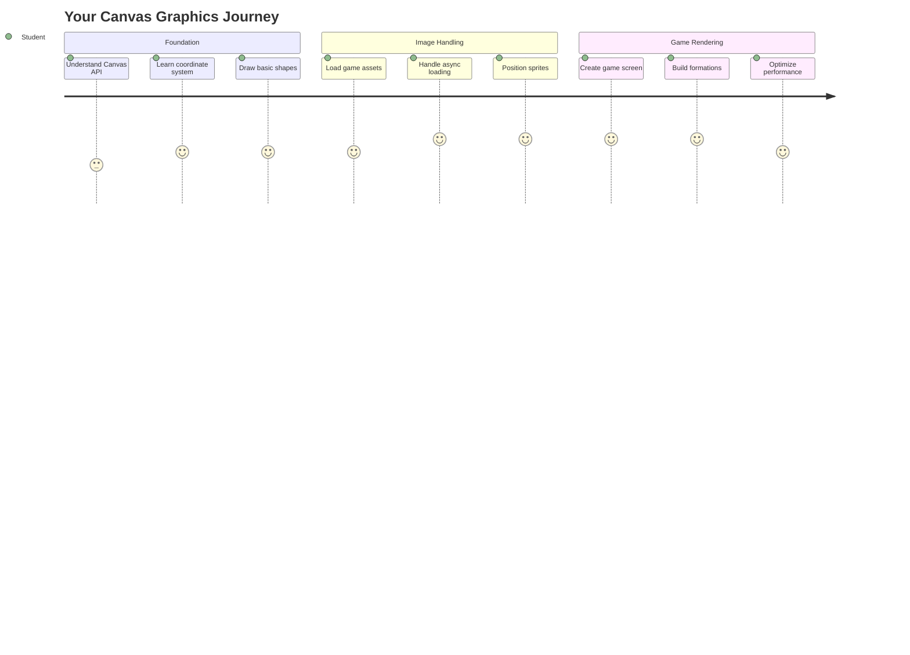
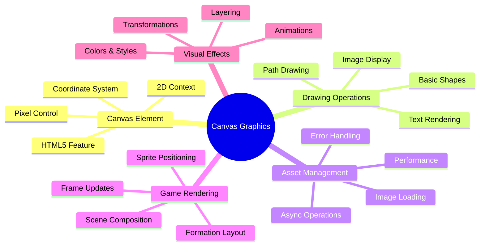
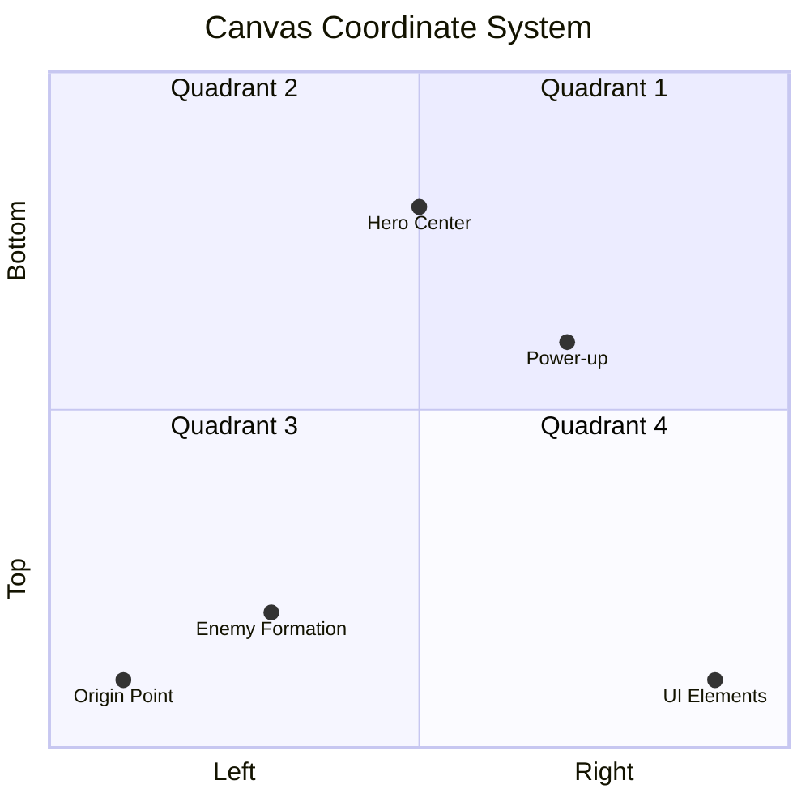
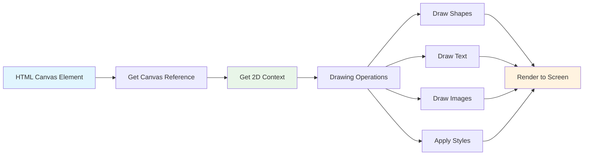
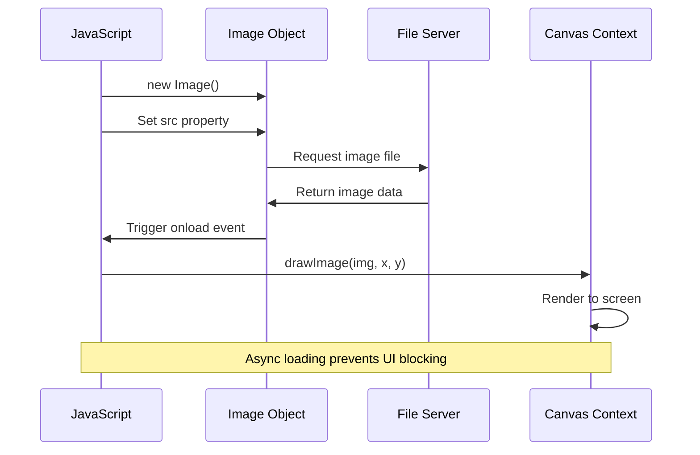
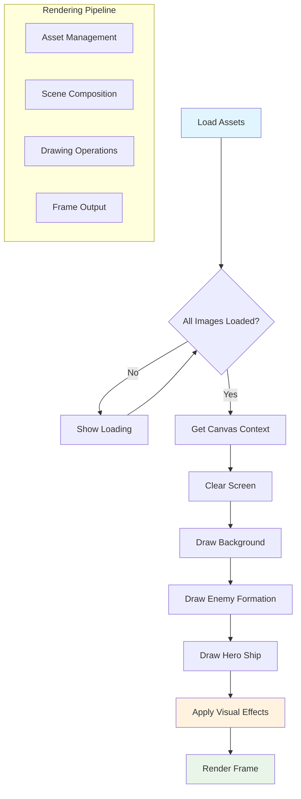
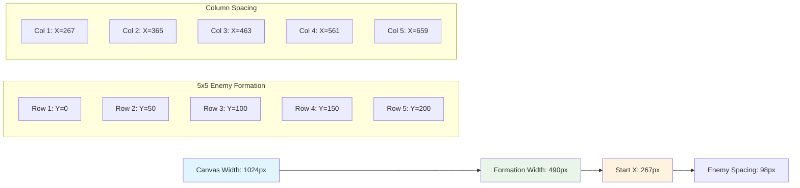
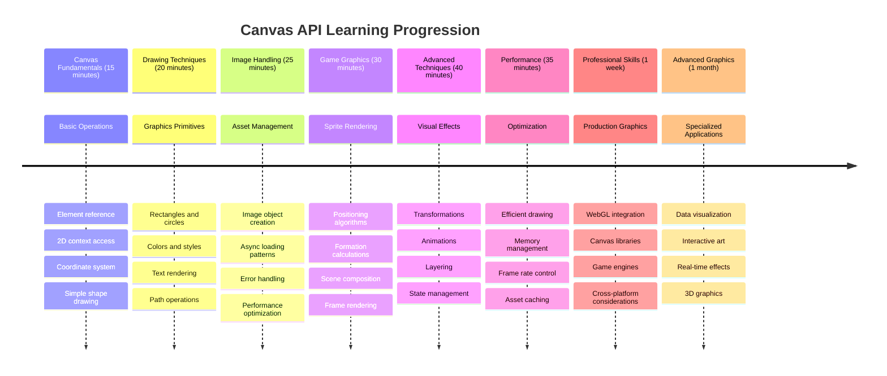

<!--
CO_OP_TRANSLATOR_METADATA:
{
  "original_hash": "7994743c5b21fdcceb36307916ef249a",
  "translation_date": "2025-11-04T01:03:10+00:00",
  "source_file": "6-space-game/2-drawing-to-canvas/README.md",
  "language_code": "tr"
}
-->
# Uzay Oyunu Yapımı Bölüm 2: Kahraman ve Canavarları Tuvale Çizmek



Canvas API, tarayıcınızda dinamik ve etkileşimli grafikler oluşturmak için web geliştirme dünyasının en güçlü özelliklerinden biridir. Bu derste, boş HTML `<canvas>` öğesini kahramanlar ve canavarlarla dolu bir oyun dünyasına dönüştüreceğiz. Tuvali, kodun görselleştiği dijital sanat tahtanız olarak düşünün.

Önceki derste öğrendiklerinizin üzerine inşa ediyoruz ve şimdi görsel yönlere dalacağız. Oyun sprite'larını nasıl yükleyeceğinizi ve görüntüleyeceğinizi, öğeleri hassas bir şekilde nasıl konumlandıracağınızı ve uzay oyununuz için görsel temeli nasıl oluşturacağınızı öğreneceksiniz. Bu, statik web sayfaları ile dinamik, etkileşimli deneyimler arasındaki boşluğu doldurur.

Bu dersin sonunda, kahraman geminizin doğru bir şekilde konumlandırıldığı ve düşman oluşumlarının savaşa hazır olduğu eksiksiz bir oyun sahnesine sahip olacaksınız. Modern oyunların tarayıcılarda grafiklerini nasıl işlediğini anlayacak ve kendi etkileşimli görsel deneyimlerinizi oluşturma becerileri kazanacaksınız. Haydi, tuval grafiklerini keşfedelim ve uzay oyununuzu hayata geçirelim!



## Ders Öncesi Test

[Ders öncesi test](https://ff-quizzes.netlify.app/web/quiz/31)

## Canvas Nedir?

Peki, bu `<canvas>` öğesi tam olarak nedir? HTML5'in web tarayıcılarında dinamik grafikler ve animasyonlar oluşturmak için sunduğu çözüm. Statik olan normal resimler veya videoların aksine, canvas ekranda görünen her şey üzerinde piksel seviyesinde kontrol sağlar. Bu, oyunlar, veri görselleştirmeleri ve etkileşimli sanat için mükemmel bir araçtır. JavaScript'in fırçanız olduğu programlanabilir bir çizim yüzeyi olarak düşünün.

Varsayılan olarak, bir canvas öğesi sayfanızda boş, şeffaf bir dikdörtgen gibi görünür. Ancak potansiyel burada yatıyor! Gerçek gücü, JavaScript kullanarak şekiller çizmeye, görüntüleri yüklemeye, animasyonlar oluşturmaya ve kullanıcı etkileşimlerine yanıt vermeye başladığınızda ortaya çıkar. Bu, 1960'larda Bell Labs'taki erken bilgisayar grafikleri öncülerinin ilk dijital animasyonları oluşturmak için her pikseli programlamak zorunda olduğu zamana benzer.

✅ MDN'de [Canvas API hakkında daha fazla bilgi edinin](https://developer.mozilla.org/docs/Web/API/Canvas_API).

Genellikle, sayfanın gövdesinin bir parçası olarak şu şekilde tanımlanır:

```html
<canvas id="myCanvas" width="200" height="100"></canvas>
```

**Bu kodun yaptığı şey:**
- **`id` özelliğini ayarlar**, böylece bu belirli canvas öğesine JavaScript'te başvurabilirsiniz
- **Genişliği** piksel cinsinden tanımlar, canvas'ın yatay boyutunu kontrol eder
- **Yüksekliği** piksel cinsinden belirler, canvas'ın dikey boyutlarını kontrol eder

## Basit Geometri Çizimi

Artık canvas öğesinin ne olduğunu bildiğinize göre, üzerinde gerçekten çizim yapmayı keşfedelim! Canvas, matematik dersinden tanıdık gelebilecek bir koordinat sistemi kullanır, ancak bilgisayar grafikleriyle ilgili önemli bir fark vardır.

Canvas, çizdiğiniz her şeyi konumlandırmak için bir x ekseni (yatay) ve y ekseni (dikey) ile Kartezyen koordinatlar kullanır. Ancak işte önemli fark: Matematik dersindeki koordinat sisteminden farklı olarak, başlangıç noktası `(0,0)` sol üst köşede başlar, x değerleri sağa doğru hareket ettikçe artar ve y değerleri aşağıya doğru hareket ettikçe artar. Bu yaklaşım, elektron ışınlarının yukarıdan aşağıya tarandığı erken bilgisayar ekranlarından kaynaklanır ve sol üst doğal başlangıç noktası haline gelir.




> Görsel [MDN](https://developer.mozilla.org/docs/Web/API/Canvas_API/Tutorial/Drawing_shapes) üzerinden alınmıştır

Canvas öğesi üzerinde çizim yapmak için, tüm canvas grafiklerinin temelini oluşturan aynı üç adımlı süreci takip edeceksiniz. Bunu birkaç kez yaptığınızda, doğal bir hale gelir:



1. **Canvas öğesine referans alın** (diğer HTML öğeleri gibi DOM'dan)
2. **2D render bağlamını alın** – bu, tüm çizim yöntemlerini sağlar
3. **Çizmeye başlayın!** Bağlamın yerleşik yöntemlerini kullanarak grafiklerinizi oluşturun

Kodda bu şu şekilde görünür:

```javascript
// Step 1: Get the canvas element
const canvas = document.getElementById("myCanvas");

// Step 2: Get the 2D rendering context
const ctx = canvas.getContext("2d");

// Step 3: Set fill color and draw a rectangle
ctx.fillStyle = 'red';
ctx.fillRect(0, 0, 200, 200); // x, y, width, height
```

**Adım adım açıklayalım:**
- Canvas öğemizi **ID'siyle alırız** ve bir değişkende saklarız
- 2D render bağlamını **alırız** – bu, çizim yöntemleriyle dolu araç kutumuzdur
- Canvas'a **kırmızıyla doldurmak istediğimizi** `fillStyle` özelliğiyle söyleriz
- Sol üst köşeden (0,0) başlayarak 200 piksel genişliğinde ve yüksekliğinde bir dikdörtgen **çizeriz**

✅ Canvas API çoğunlukla 2D şekillere odaklanır, ancak bir web sitesine 3D öğeler de çizebilirsiniz; bunun için [WebGL API](https://developer.mozilla.org/docs/Web/API/WebGL_API) kullanabilirsiniz.

Canvas API ile şunları çizebilirsiniz:

- **Geometrik şekiller**, dikdörtgen çizmeyi zaten gösterdik, ancak çizebileceğiniz daha birçok şey var.
- **Metin**, istediğiniz herhangi bir yazı tipi ve renkle metin çizebilirsiniz.
- **Görüntüler**, bir .jpg veya .png gibi bir görüntü varlığından bir görüntü çizebilirsiniz.

✅ Deneyin! Dikdörtgen çizmeyi biliyorsunuz, bir sayfaya bir daire çizebilir misiniz? CodePen'deki bazı ilginç Canvas çizimlerine göz atın. İşte [özellikle etkileyici bir örnek](https://codepen.io/dissimulate/pen/KrAwx).

### 🔄 **Pedagojik Kontrol Noktası**
**Canvas Temellerini Anlama**: Görüntü yüklemeye geçmeden önce şunları yapabildiğinizden emin olun:
- ✅ Canvas koordinat sisteminin matematiksel koordinatlardan nasıl farklı olduğunu açıklayın
- ✅ Canvas çizim işlemleri için üç adımlı süreci anlayın
- ✅ 2D render bağlamının ne sağladığını belirleyin
- ✅ `fillStyle` ve `fillRect`'in birlikte nasıl çalıştığını açıklayın

**Hızlı Kendini Test Et**: (100, 50) konumunda yarıçapı 25 olan mavi bir daireyi nasıl çizersiniz?
```javascript
ctx.fillStyle = 'blue';
ctx.beginPath();
ctx.arc(100, 50, 25, 0, 2 * Math.PI);
ctx.fill();
```

**Artık Bildiğiniz Canvas Çizim Yöntemleri**:
- **fillRect()**: Dolu dikdörtgenler çizer
- **fillStyle**: Renkleri ve desenleri ayarlar
- **beginPath()**: Yeni çizim yolları başlatır
- **arc()**: Daireler ve eğriler oluşturur

## Görüntü Varlığını Yükleme ve Çizme

Temel şekiller çizmek başlangıç için faydalıdır, ancak çoğu oyun gerçek görüntülere ihtiyaç duyar! Sprite'lar, arka planlar ve dokular oyunlara görsel çekicilik kazandırır. Canvas üzerinde görüntüleri yüklemek ve görüntülemek, geometrik şekiller çizmeye göre farklı çalışır, ancak süreci anladığınızda oldukça basittir.

Bir `Image` nesnesi oluşturmalı, görüntü dosyamızı yüklemeliyiz (bu arka planda, yani "asenkron" olarak gerçekleşir) ve ardından hazır olduğunda canvas'a çizmeliyiz. Bu yaklaşım, görüntülerinizin düzgün bir şekilde görüntülenmesini sağlar ve yüklenirken uygulamanızın engellenmesini önler.



### Temel Görüntü Yükleme

```javascript
const img = new Image();
img.src = 'path/to/my/image.png';
img.onload = () => {
  // Image loaded and ready to be used
  console.log('Image loaded successfully!');
};
```

**Bu kodda neler oluyor:**
- Sprite veya dokumuzu tutmak için yepyeni bir Image nesnesi **oluşturuyoruz**
- Hangi görüntü dosyasını yükleyeceğini **söylüyoruz** (kaynak yolunu ayarlayarak)
- Görüntünün tam olarak ne zaman kullanıma hazır olduğunu bilmek için yükleme olayını **dinliyoruz**

### Görüntüleri Yüklemek İçin Daha İyi Bir Yöntem

Profesyonel geliştiricilerin sıklıkla kullandığı daha sağlam bir görüntü yükleme yöntemi işte burada. Görüntü yüklemeyi Promise tabanlı bir fonksiyon içinde saracağız – bu yaklaşım, JavaScript Promises ES6'da standart hale geldiğinde popülerleşti, kodunuzu daha düzenli hale getirir ve hataları zarif bir şekilde yönetir:

```javascript
function loadAsset(path) {
  return new Promise((resolve, reject) => {
    const img = new Image();
    img.src = path;
    img.onload = () => {
      resolve(img);
    };
    img.onerror = () => {
      reject(new Error(`Failed to load image: ${path}`));
    };
  });
}

// Modern usage with async/await
async function initializeGame() {
  try {
    const heroImg = await loadAsset('hero.png');
    const monsterImg = await loadAsset('monster.png');
    // Images are now ready to use
  } catch (error) {
    console.error('Failed to load game assets:', error);
  }
}
```

**Burada yaptığımız şey:**
- Tüm o görüntü yükleme mantığını bir Promise içinde **sardık**, böylece daha iyi yönetebiliriz
- Bir şeyler ters gittiğinde bize gerçekten söyleyen hata yönetimi **ekledik**
- Modern async/await sözdizimini **kullandık**, çünkü okunması çok daha temiz
- Herhangi bir yükleme aksaklığını zarif bir şekilde yönetmek için try/catch blokları **ekledik**

Görüntüleriniz yüklendikten sonra, onları canvas'a çizmek aslında oldukça basittir:

```javascript
async function renderGameScreen() {
  try {
    // Load game assets
    const heroImg = await loadAsset('hero.png');
    const monsterImg = await loadAsset('monster.png');

    // Get canvas and context
    const canvas = document.getElementById("myCanvas");
    const ctx = canvas.getContext("2d");

    // Draw images to specific positions
    ctx.drawImage(heroImg, canvas.width / 2, canvas.height / 2);
    ctx.drawImage(monsterImg, 0, 0);
  } catch (error) {
    console.error('Failed to render game screen:', error);
  }
}
```

**Adım adım inceleyelim:**
- Kahraman ve canavar görüntülerimizi arka planda await kullanarak **yüklüyoruz**
- Canvas öğemizi **alıyoruz** ve ihtiyacımız olan 2D render bağlamını alıyoruz
- Kahraman görüntüsünü hızlı bir koordinat matematiği kullanarak tam ortasına **yerleştiriyoruz**
- Canavar görüntüsünü sol üst köşeye **yerleştiriyoruz** ve düşman oluşumumuzu başlatıyoruz
- Yükleme veya render sırasında meydana gelebilecek hataları **yakalarız**



## Şimdi Oyununuzu Yapmaya Başlama Zamanı

Şimdi her şeyi bir araya getirerek uzay oyununuzun görsel temelini oluşturacağız. Canvas temelleri ve görüntü yükleme teknikleri hakkında sağlam bir anlayışa sahipsiniz, bu nedenle bu uygulamalı bölüm, doğru bir şekilde konumlandırılmış sprite'larla eksiksiz bir oyun ekranı oluşturmanız için size rehberlik edecek.

### Ne Yapılacak?

Bir Canvas öğesi içeren bir web sayfası oluşturacaksınız. `1024*768` boyutlarında siyah bir ekran oluşturmalıdır. Size iki görüntü sağladık:

- Kahraman gemisi

   

- 5*5 canavar

   

### Geliştirmeye Başlamak İçin Önerilen Adımlar

`your-work` alt klasöründe sizin için oluşturulmuş başlangıç dosyalarını bulun. Proje yapınız şunları içermelidir:

```bash
your-work/
├── assets/
│   ├── enemyShip.png
│   └── player.png
├── index.html
├── app.js
└── package.json
```

**Elinizde olanlar:**
- **Oyun sprite'ları** her şey düzenli kalsın diye `assets/` klasöründe bulunuyor
- **Ana HTML dosyanız** canvas öğesini ayarlar ve her şeyi hazırlar
- **Bir JavaScript dosyası**, tüm oyun render sihrinizi yazacağınız yer
- **Bir package.json**, yerel bir geliştirme sunucusu kurar, böylece yerel olarak test yapabilirsiniz

Bu klasörü Visual Studio Code'da açarak geliştirmeye başlayın. Visual Studio Code, NPM ve Node.js yüklü bir yerel geliştirme ortamına ihtiyacınız olacak. Bilgisayarınızda `npm` kurulu değilse, [nasıl kuracağınızı buradan öğrenebilirsiniz](https://www.npmjs.com/get-npm).

Geliştirme sunucunuzu `your-work` klasörüne giderek başlatın:

```bash
cd your-work
npm start
```

**Bu komut oldukça havalı şeyler yapar:**
- **Yerel bir sunucu başlatır**: `http://localhost:5000` adresinde oyununuzu test edebilirsiniz
- **Tüm dosyalarınızı düzgün bir şekilde sunar**, böylece tarayıcınız bunları doğru bir şekilde yükleyebilir
- **Dosyalarınızı değişiklikler için izler**, böylece sorunsuz bir şekilde geliştirme yapabilirsiniz
- **Size** her şeyi test etmek için profesyonel bir geliştirme ortamı sağlar

> 💡 **Not**: Tarayıcınız başlangıçta boş bir sayfa gösterecek – bu beklenen bir durum! Kod ekledikçe, değişikliklerinizi görmek için tarayıcınızı yenileyin. Bu yinelemeli geliştirme yaklaşımı, NASA'nın Apollo yönlendirme bilgisayarını inşa ettiği yönteme benzer – her bir bileşeni daha büyük sisteme entegre etmeden önce test etmek.

### Kod Ekleme

`your-work/app.js` dosyasına aşağıdaki görevleri tamamlamak için gerekli kodu ekleyin:

1. **Siyah arka planlı bir canvas çizin**
   > 💡 **Nasıl yapılır**: `/app.js` içinde TODO'yu bulun ve sadece iki satır ekleyin. `ctx.fillStyle`'i siyah olarak ayarlayın, ardından canvas boyutlarınızla (0,0)'dan başlayarak `ctx.fillRect()` kullanın. Kolay!

2. **Oyun dokularını yükleyin**
   > 💡 **Nasıl yapılır**: Oyuncu ve düşman görüntülerinizi yüklemek için `await loadAsset()` kullanın. Daha sonra kullanabilmek için bunları değişkenlerde saklayın. Unutmayın – aslında onları çizene kadar görünmeyecekler!

3. **Kahraman gemisini merkez-alt konumuna çizin**
   > 💡 **Nasıl yapılır**: Kahramanınızı konumlandırmak için `ctx.drawImage()` kullanın. x koordinatı için, `canvas.width / 2 - 45` kullanarak ortalayın ve y koordinatı için `canvas.height - canvas.height / 4` kullanarak alt bölgeye yerleştirin.

4. **5×5 düşman gemisi formasyonu çizin**
   > 💡 **Nasıl yapılır**: `createEnemies` fonksiyonunu bulun ve iç içe bir döngü kurun. Aralık ve konumlandırma için biraz matematik yapmanız gerekecek, ancak endişelenmeyin – size tam olarak nasıl yapılacağını göstereceğim!

Öncelikle, doğru düşman formasyonu düzeni için sabitler belirleyin:

```javascript
const ENEMY_TOTAL = 5;
const ENEMY_SPACING = 98;
const FORMATION_WIDTH = ENEMY_TOTAL * ENEMY_SPACING;
const START_X = (canvas.width - FORMATION_WIDTH) / 2;
const STOP_X = START_X + FORMATION_WIDTH;
```

**Bu sabitlerin yaptığı şey:**
- Satır ve sütun başına 5 düşman **ayarlar** (güzel bir 5×5 ızgara)
- Düşmanlar arasında ne kadar boşluk bırakılacağını **tanımlar**, böylece sıkışık görünmezler
- Tüm formasyonumuzun ne kadar geniş olacağını **hesaplar**
- Formasyonun merkezlenmiş görünmesi için nereden başlayıp nerede duracağımızı **bulur**



Daha sonra, düşman formasyonunu çizmek için iç içe döngüler oluşturun:

```javascript
for (let x = START_X; x < STOP_X; x += ENEMY_SPACING) {
  for (let y = 0; y < 50 * 5; y += 50) {
    ctx.drawImage(enemyImg, x, y);
  }
}
```

**Bu iç içe döngünün yaptığı şey:**
- Dış döngü, formasyon boyunca soldan sağa **hareket eder**
- İç döngü, düzenli satırlar oluşturmak için yukarıdan aşağıya **gider**
- Her bir düşman sprite'ını hesapladığımız tam x,y koordinatlarında **çizeriz**
- Her şey **eşit aralıklı** kalır, böylece profesyonel ve düzenli görünür

### 🔄 **Pedagojik Kontrol Noktası**
**Oyun Render Sistemi Ustası**: Tam render sistemini anladığınızdan emin olun:
- ✅ Asenkron görüntü yükleme, oyun başlangıcında UI engellenmesini nasıl önler?
- ✅ Düşman formasyon pozisyonlarını sabitler kullanarak hesaplamamızın nedeni nedir?
- ✅ 2D render bağlamı çizim işlemlerinde ne rol oynar?
- ✅ İç içe döngüler organize sprite formasyonlarını nasıl oluşturur?

**Performans Düşünceleri**: Oyununuz artık şunları gösteriyor:
- **Verimli varlık yükleme**: Promise tabanlı görüntü yönetimi
- **Düzenli render**: Yapılandırılmış çizim işlemleri
- **Matematiksel konumlandırma**: Hesaplanmış sprite yerleştirme
- **Hata yönetimi**: Zarif hata yönetimi

**Görsel Programlama Kavramları**: Şunları öğrendiniz:
- **Koordinat sistemleri**: Matematiği ekran pozisyonlarına dönüştürmek  
- **Sprite yönetimi**: Oyun grafiklerini yüklemek ve görüntülemek  
- **Formasyon algoritmaları**: Düzenli yerleşimler için matematiksel desenler  
- **Asenkron işlemler**: Modern JavaScript ile akıcı kullanıcı deneyimi  

## Sonuç  

Sonuç aşağıdaki gibi görünmelidir:  

  

## Çözüm  

Önce kendiniz çözmeyi deneyin, ancak takılırsanız bir [çözüm](../../../../6-space-game/2-drawing-to-canvas/solution/app.js) inceleyebilirsiniz.  

---

## GitHub Copilot Agent Challenge 🚀  

Agent modunu kullanarak aşağıdaki meydan okumayı tamamlayın:  

**Açıklama:** Canvas API tekniklerini kullanarak uzay oyununuzun görsel efektlerini ve etkileşimli öğelerini geliştirin.  

**İstek:** `enhanced-canvas.html` adlı yeni bir dosya oluşturun ve arka planda animasyonlu yıldızlar, kahraman gemisi için nabız atan bir sağlık çubuğu ve yavaşça aşağıya doğru hareket eden düşman gemileri içeren bir canvas ekleyin. Rastgele pozisyonlar ve opaklık kullanarak parlayan yıldızlar çizen, sağlık seviyesine göre renk değiştiren (yeşil > sarı > kırmızı) bir sağlık çubuğu uygulayan ve düşman gemilerini farklı hızlarda ekranın aşağısına doğru hareket ettiren JavaScript kodu ekleyin.  

Agent modu hakkında daha fazla bilgi edinin [buradan](https://code.visualstudio.com/blogs/2025/02/24/introducing-copilot-agent-mode).  

## 🚀 Meydan Okuma  

2D odaklı Canvas API ile çizim yapmayı öğrendiniz; [WebGL API](https://developer.mozilla.org/docs/Web/API/WebGL_API)'ye bir göz atın ve 3D bir nesne çizmeyi deneyin.  

## Ders Sonrası Test  

[Ders sonrası test](https://ff-quizzes.netlify.app/web/quiz/32)  

## İnceleme ve Kendi Kendine Çalışma  

Canvas API hakkında daha fazla bilgi edinin [buradan](https://developer.mozilla.org/docs/Web/API/Canvas_API).  

### ⚡ **Sonraki 5 Dakikada Yapabilecekleriniz**  
- [ ] Tarayıcı konsolunu açın ve `document.createElement('canvas')` ile bir canvas öğesi oluşturun  
- [ ] Bir canvas bağlamında `fillRect()` kullanarak bir dikdörtgen çizmeyi deneyin  
- [ ] `fillStyle` özelliğini kullanarak farklı renklerle deney yapın  
- [ ] `arc()` yöntemiyle basit bir daire çizin  

### 🎯 **Bu Saatte Başarabilecekleriniz**  
- [ ] Ders sonrası testi tamamlayın ve canvas temel bilgilerini anlayın  
- [ ] Birden fazla şekil ve renk içeren bir canvas çizim uygulaması oluşturun  
- [ ] Oyun için görüntü yükleme ve sprite işleme uygulayın  
- [ ] Canvas üzerinde nesneleri hareket ettiren basit bir animasyon oluşturun  
- [ ] Ölçekleme, döndürme ve çeviri gibi canvas dönüşümleri uygulayın  

### 📅 **Haftalık Canvas Yolculuğunuz**  
- [ ] Uzay oyununu cilalı grafikler ve sprite animasyonları ile tamamlayın  
- [ ] Gradyanlar, desenler ve birleştirme gibi gelişmiş canvas tekniklerini öğrenin  
- [ ] Canvas kullanarak veri temsili için etkileşimli görselleştirmeler oluşturun  
- [ ] Akıcı performans için canvas optimizasyon tekniklerini öğrenin  
- [ ] Çeşitli araçlarla bir çizim veya boyama uygulaması oluşturun  
- [ ] Canvas ile yaratıcı kodlama desenlerini ve üretken sanatı keşfedin  

### 🌟 **Aylık Grafik Ustalığı**  
- [ ] Canvas 2D ve WebGL kullanarak karmaşık görsel uygulamalar oluşturun  
- [ ] Grafik programlama kavramlarını ve gölgelendirici temellerini öğrenin  
- [ ] Açık kaynak grafik kütüphanelerine ve görselleştirme araçlarına katkıda bulunun  
- [ ] Grafik yoğun uygulamalar için performans optimizasyonunda ustalaşın  
- [ ] Canvas programlama ve bilgisayar grafikleri hakkında eğitim içerikleri oluşturun  
- [ ] Görsel deneyimler yaratmak için başkalarına yardımcı olan bir grafik programlama uzmanı olun  

## 🎯 Canvas Grafik Ustalığı Zaman Çizelgeniz  


  
### 🛠️ Canvas Grafik Araç Seti Özeti  

Bu dersi tamamladıktan sonra artık:  
- **Canvas API Ustalığı**: 2D grafik programlama konusunda tam bilgi  
- **Koordinat Matematiği**: Hassas konumlandırma ve yerleşim algoritmaları  
- **Varlık Yönetimi**: Profesyonel görüntü yükleme ve hata ayıklama  
- **Renderleme Süreci**: Sahne kompozisyonu için yapılandırılmış yaklaşım  
- **Oyun Grafikleri**: Sprite konumlandırma ve formasyon hesaplamaları  
- **Asenkron Programlama**: Akıcı performans için modern JavaScript desenleri  
- **Görsel Programlama**: Matematiksel kavramları ekran grafiklerine dönüştürme  

**Gerçek Dünya Uygulamaları**: Canvas becerileriniz doğrudan şunlara uygulanabilir:  
- **Veri Görselleştirme**: Grafikler, tablolar ve etkileşimli panolar  
- **Oyun Geliştirme**: 2D oyunlar, simülasyonlar ve etkileşimli deneyimler  
- **Dijital Sanat**: Yaratıcı kodlama ve üretken sanat projeleri  
- **UI/UX Tasarımı**: Özel grafikler ve etkileşimli öğeler  
- **Eğitim Yazılımı**: Görsel öğrenme araçları ve simülasyonlar  
- **Web Uygulamaları**: Dinamik grafikler ve gerçek zamanlı görselleştirmeler  

**Kazanılan Profesyonel Beceriler**: Artık şunları yapabilirsiniz:  
- **Oluştur**: Harici kütüphaneler olmadan özel grafik çözümleri  
- **Optimize Et**: Akıcı kullanıcı deneyimleri için renderleme performansını  
- **Hata Ayıkla**: Tarayıcı geliştirici araçlarını kullanarak karmaşık görsel sorunları  
- **Tasarla**: Matematiksel prensipler kullanarak ölçeklenebilir grafik sistemleri  
- **Entegre Et**: Canvas grafiklerini modern web uygulama çerçeveleriyle  

**Canvas API Yöntemlerinde Ustalık**:  
- **Element Yönetimi**: getElementById, getContext  
- **Çizim İşlemleri**: fillRect, drawImage, fillStyle  
- **Varlık Yükleme**: Görüntü nesneleri, Promise desenleri  
- **Matematiksel Konumlandırma**: Koordinat hesaplamaları, formasyon algoritmaları  

**Bir Sonraki Seviye**: Animasyon, kullanıcı etkileşimi, çarpışma algılama eklemeye veya 3D grafikler için WebGL'yi keşfetmeye hazırsınız!  

🌟 **Başarı Kilidi Açıldı**: Temel Canvas API tekniklerini kullanarak eksiksiz bir oyun renderleme sistemi oluşturdunuz!  

## Ödev  

[Canvas API ile oynayın](assignment.md)  

---

**Feragatname**:  
Bu belge, AI çeviri hizmeti [Co-op Translator](https://github.com/Azure/co-op-translator) kullanılarak çevrilmiştir. Doğruluk için çaba göstersek de, otomatik çeviriler hata veya yanlışlıklar içerebilir. Belgenin orijinal dili, yetkili kaynak olarak kabul edilmelidir. Kritik bilgiler için profesyonel insan çevirisi önerilir. Bu çevirinin kullanımından kaynaklanan herhangi bir yanlış anlama veya yanlış yorumlamadan sorumlu değiliz.