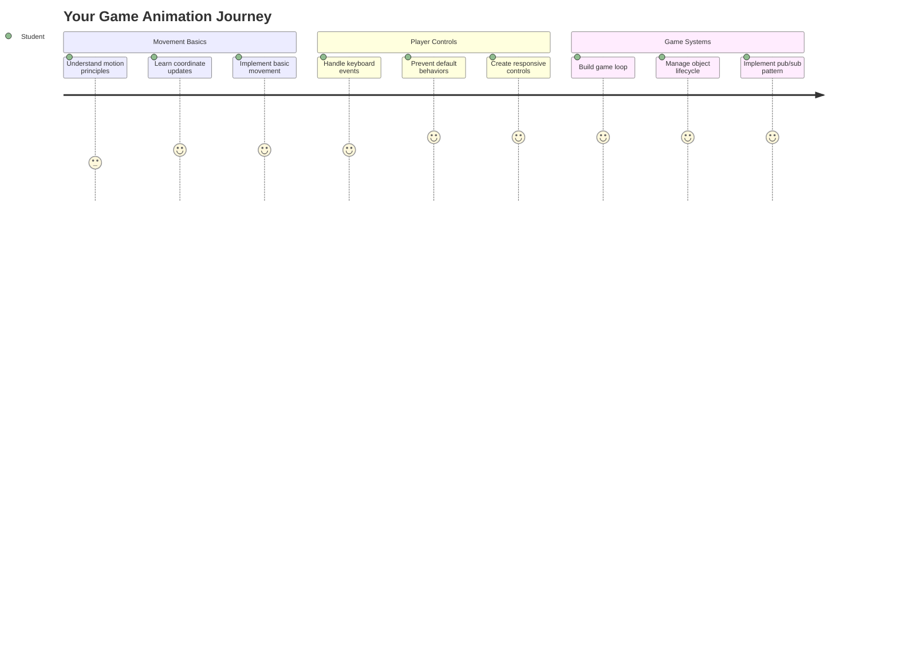
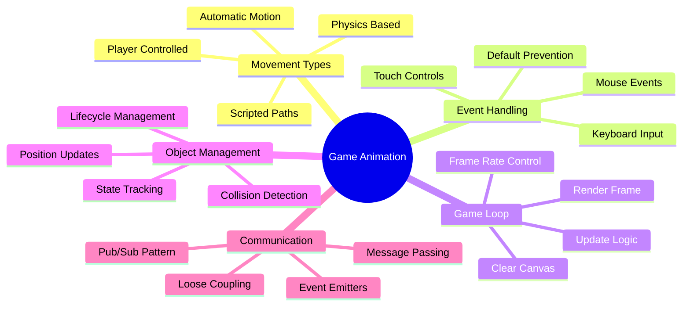
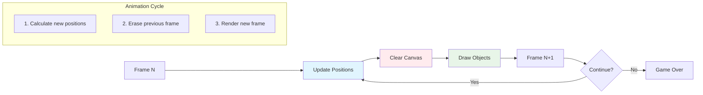
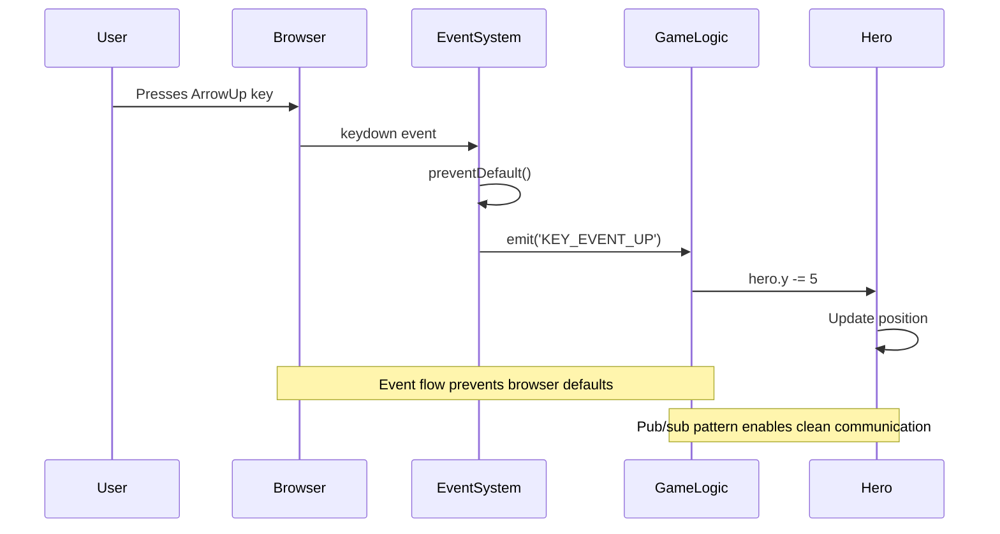
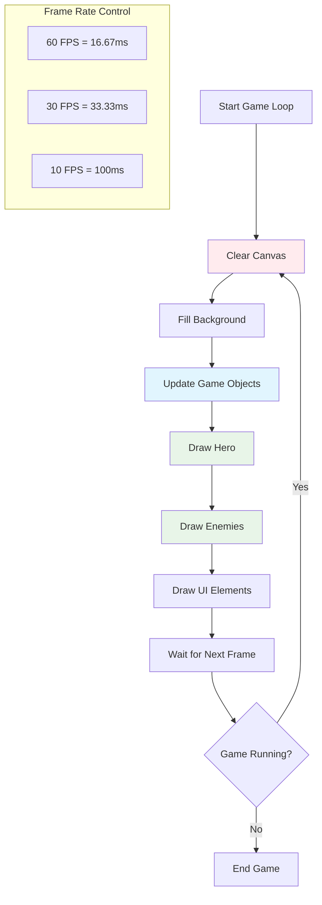
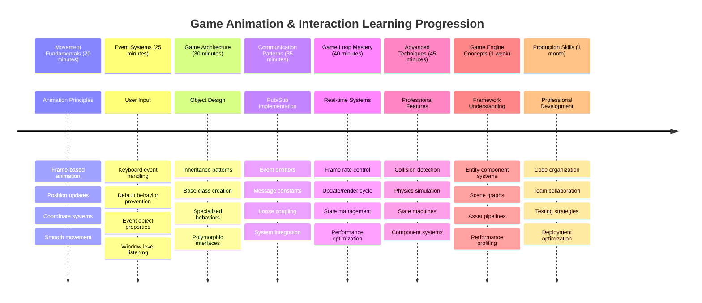

# Uzay Oyunu Yapımı Bölüm 3: Hareket Ekleme



Favori oyunlarınızı düşünün – onları etkileyici kılan şey sadece güzel grafikler değil, her şeyin hareket etmesi ve eylemlerinize tepki vermesidir. Şu anda uzay oyununuz güzel bir tablo gibi, ancak ona hayat verecek hareketi eklemek üzereyiz.

NASA mühendisleri Apollo görevleri için rehberlik bilgisayarını programladıklarında benzer bir zorlukla karşılaştılar: Bir uzay aracını pilotun girdilerine nasıl tepki verecek şekilde programlarsınız ve aynı zamanda otomatik olarak rota düzeltmelerini nasıl sağlarsınız? Bugün öğreneceğimiz prensipler, oyuncu kontrollü hareketi otomatik sistem davranışlarıyla yönetme konusunda aynı kavramları yansıtıyor.

Bu derste, uzay gemilerinin ekran boyunca kaymasını, oyuncu komutlarına tepki vermesini ve pürüzsüz hareket desenleri oluşturmayı öğreneceksiniz. Her şeyi doğal bir şekilde birbirine bağlanan yönetilebilir kavramlara ayıracağız.

Sonunda, oyuncular kahraman gemilerini ekranın etrafında uçururken düşman gemileri yukarıda devriye gezecek. Daha da önemlisi, oyun hareket sistemlerini çalıştıran temel prensipleri anlayacaksınız.



## Ders Öncesi Test

[Ders öncesi test](https://ff-quizzes.netlify.app/web/quiz/33)

## Oyun Hareketini Anlamak

Oyunlar, nesneler hareket etmeye başladığında canlanır ve bu genelde iki şekilde olur:

- **Oyuncu kontrollü hareket**: Bir tuşa bastığınızda veya farenizi tıkladığınızda bir şey hareket eder. Bu, sizinle oyun dünyanız arasındaki doğrudan bağlantıdır.
- **Otomatik hareket**: Oyun kendi kendine bir şeyleri hareket ettirmeye karar verdiğinde – örneğin, düşman gemilerinin ekran boyunca devriye gezmesi gibi, siz bir şey yapmasanız bile.

Bilgisayar ekranında nesneleri hareket ettirmek düşündüğünüzden daha basittir. Matematik dersinden hatırladığınız x ve y koordinatlarını hatırlıyor musunuz? İşte tam olarak bununla çalışıyoruz. Galileo, 1610 yılında Jüpiter'in uydularını izlerken aslında aynı şeyi yapıyordu – hareket desenlerini anlamak için zaman içinde konumları çiziyordu.

Ekranda bir şeyleri hareket ettirmek, bir flipbook animasyonu oluşturmak gibidir – şu üç basit adımı takip etmeniz gerekir:



1. **Konumu güncelle** – Nesnenizin nerede olması gerektiğini değiştirin (belki 5 piksel sağa hareket ettirin)
2. **Eski kareyi sil** – Ekranı temizleyin, böylece her yerde hayalet izler görmezsiniz
3. **Yeni kareyi çizin** – Nesnenizi yeni yerine yerleştirin

Bunu yeterince hızlı yaparsanız, işte! Oyunculara doğal gelen pürüzsüz bir hareket elde ettiniz.

Kodda nasıl görünebileceğine bir örnek:

```javascript
// Set the hero's location
hero.x += 5;
// Clear the rectangle that hosts the hero
ctx.clearRect(0, 0, canvas.width, canvas.height);
// Redraw the game background and hero
ctx.fillRect(0, 0, canvas.width, canvas.height);
ctx.fillStyle = "black";
ctx.drawImage(heroImg, hero.x, hero.y);
```

**Bu kodun yaptığı şey:**
- Kahramanın x-koordinatını 5 piksel güncelleyerek yatay olarak hareket ettirir
- Önceki kareyi kaldırmak için tüm tuvali temizler
- Tuvali siyah bir arka plan rengiyle doldurur
- Kahraman resmini yeni konumunda yeniden çizer

✅ Kahramanınızı saniyede birçok karede yeniden çizmenin performans maliyetlerini artırabileceği bir neden düşünebilir misiniz? [Bu desene alternatifler hakkında](https://developer.mozilla.org/en-US/docs/Web/API/Canvas_API/Tutorial/Optimizing_canvas) okuyun.

## Klavye olaylarını işleme

Burada oyuncu girdisini oyun eylemine bağlayacağız. Birisi lazer ateşlemek için boşluk tuşuna bastığında veya bir asteroitten kaçmak için ok tuşuna dokunduğunda, oyununuz bu girdiyi algılamalı ve buna tepki vermelidir.

Klavye olayları pencere seviyesinde gerçekleşir, yani tüm tarayıcı pencereniz bu tuş vuruşlarını dinler. Öte yandan fare tıklamaları belirli öğelere bağlanabilir (örneğin bir düğmeye tıklamak gibi). Uzay oyunumuz için klavye kontrollerine odaklanacağız çünkü bu, oyunculara klasik arcade hissi verir.

Bu, 1800'lerde telgraf operatörlerinin mors kodu girdisini anlamlı mesajlara çevirmesi gerektiği zamana benziyor – biz de benzer bir şey yapıyoruz, tuş vuruşlarını oyun komutlarına çeviriyoruz.

Bir olayı işlemek için pencerenin `addEventListener()` metodunu kullanmanız ve ona iki giriş parametresi sağlamanız gerekir. İlk parametre olayın adıdır, örneğin `keyup`. İkinci parametre ise olay gerçekleştiğinde çağrılması gereken fonksiyondur.

İşte bir örnek:

```javascript
window.addEventListener('keyup', (evt) => {
  // evt.key = string representation of the key
  if (evt.key === 'ArrowUp') {
    // do something
  }
});
```

**Burada olanları açıklamak:**
- Tüm pencere üzerinde klavye olaylarını dinler
- Hangi tuşun basıldığını içeren olay nesnesini yakalar
- Basılan tuşun belirli bir tuşla eşleşip eşleşmediğini kontrol eder (bu durumda yukarı ok tuşu)
- Koşul sağlandığında kodu çalıştırır

Tuş olayları için hangi tuşun basıldığını görmek için olay üzerinde kullanabileceğiniz iki özellik vardır:

- `key` - basılan tuşun string temsili, örneğin `'ArrowUp'`
- `keyCode` - bu bir sayı temsili, örneğin `37`, `ArrowLeft` ile eşleşir

✅ Tuş olayı manipülasyonu oyun geliştirme dışında da faydalıdır. Bu tekniğin başka hangi kullanımlarını düşünebilirsiniz?



### Özel tuşlar: dikkat!

Bazı tuşların yerleşik tarayıcı davranışları vardır ve bunlar oyununuzu etkileyebilir. Ok tuşları sayfayı kaydırır ve boşluk tuşu aşağıya atlar – birisi uzay gemisini kullanmaya çalışırken istemediğiniz davranışlar.

Bu varsayılan davranışları önleyebilir ve girdiyi oyununuzun işlemesine izin verebilirsiniz. Bu, erken dönem bilgisayar programcılarının özel davranışlar oluşturmak için sistem kesintilerini geçersiz kılmak zorunda olduğu zamana benzer – biz bunu tarayıcı seviyesinde yapıyoruz. İşte nasıl:

```javascript
const onKeyDown = function (e) {
  console.log(e.keyCode);
  switch (e.keyCode) {
    case 37:
    case 39:
    case 38:
    case 40: // Arrow keys
    case 32:
      e.preventDefault();
      break; // Space
    default:
      break; // do not block other keys
  }
};

window.addEventListener('keydown', onKeyDown);
```

**Bu önleme kodunu anlamak:**
- İstenmeyen tarayıcı davranışlarına neden olabilecek belirli tuş kodlarını kontrol eder
- Ok tuşları ve boşluk tuşu için varsayılan tarayıcı eylemini engeller
- Diğer tuşların normal şekilde çalışmasına izin verir
- Tarayıcının yerleşik davranışını durdurmak için `e.preventDefault()` kullanır

### 🔄 **Pedagojik Kontrol**
**Olay İşleme Anlayışı**: Otomatik harekete geçmeden önce şunları yapabildiğinizden emin olun:
- ✅ `keydown` ve `keyup` olayları arasındaki farkı açıklayın
- ✅ Varsayılan tarayıcı davranışlarını neden engellediğimizi anlayın
- ✅ Olay dinleyicilerinin kullanıcı girdisini oyun mantığına nasıl bağladığını açıklayın
- ✅ Hangi tuşların oyun kontrollerine müdahale edebileceğini belirleyin

**Hızlı Kendini Test Et**: Ok tuşları için varsayılan davranışı engellemeseydiniz ne olurdu?
*Cevap: Tarayıcı sayfayı kaydırır, oyun hareketine müdahale eder*

**Olay Sistemi Mimarisi**: Şimdi şunları anlıyorsunuz:
- **Pencere seviyesinde dinleme**: Olayları tarayıcı seviyesinde yakalama
- **Olay nesnesi özellikleri**: `key` stringleri ve `keyCode` numaraları
- **Varsayılan önleme**: İstenmeyen tarayıcı davranışlarını durdurma
- **Koşullu mantık**: Belirli tuş kombinasyonlarına tepki verme

## Oyun kaynaklı hareket

Şimdi oyuncu girdisi olmadan hareket eden nesnelerden bahsedelim. Ekranda dolaşan düşman gemilerini, düz çizgilerde uçan mermileri veya arka planda sürüklenen bulutları düşünün. Bu otonom hareket, kimse kontrolleri dokunmasa bile oyun dünyanızı canlı hissettirir.

JavaScript'in yerleşik zamanlayıcılarını kullanarak konumları düzenli aralıklarla güncelleriz. Bu konsept, sarkaçlı saatlerin nasıl çalıştığına benzer – düzenli bir mekanizma, tutarlı ve zamanlanmış eylemleri tetikler. İşte ne kadar basit olabileceği:

```javascript
const id = setInterval(() => {
  // Move the enemy on the y axis
  enemy.y += 10;
}, 100);
```

**Bu hareket kodunun yaptığı şey:**
- Her 100 milisaniyede bir çalışan bir zamanlayıcı oluşturur
- Her seferinde düşmanın y-koordinatını 10 piksel günceller
- Daha sonra durdurabilmek için interval kimliğini saklar
- Düşmanı ekranda otomatik olarak aşağıya doğru hareket ettirir

## Oyun döngüsü

İşte her şeyi bir araya getiren konsept – oyun döngüsü. Oyununuz bir film olsaydı, oyun döngüsü film projektörü olurdu, kare kare göstererek her şeyin pürüzsüz bir şekilde hareket etmesini sağlar.

Her oyunun sahne arkasında çalışan bir döngüsü vardır. Bu, tüm oyun nesnelerini güncelleyen, ekranı yeniden çizen ve bu süreci sürekli olarak tekrarlayan bir fonksiyondur. Bu, kahramanınızı, tüm düşmanları, uçan lazerleri – tüm oyun durumunu takip eder.

Bu konsept, Walt Disney gibi erken dönem film animatörlerinin hareket illüzyonu yaratmak için karakterleri kare kare yeniden çizmek zorunda olduğu zamana benziyor. Biz aynı şeyi yapıyoruz, sadece kalem yerine kod kullanıyoruz.

Bir oyun döngüsünün genelde kodda nasıl görünebileceğine bir örnek:



```javascript
const gameLoopId = setInterval(() => {
  function gameLoop() {
    ctx.clearRect(0, 0, canvas.width, canvas.height);
    ctx.fillStyle = "black";
    ctx.fillRect(0, 0, canvas.width, canvas.height);
    drawHero();
    drawEnemies();
    drawStaticObjects();
  }
  gameLoop();
}, 200);
```

**Oyun döngüsü yapısını anlamak:**
- Önceki kareyi kaldırmak için tüm tuvali temizler
- Arka planı düz bir renkle doldurur
- Tüm oyun nesnelerini mevcut konumlarında çizer
- Pürüzsüz animasyon oluşturmak için bu süreci her 200 milisaniyede bir tekrarlar
- Kare hızını kontrol ederek interval zamanlamasını yönetir

## Uzay Oyununa Devam Etmek

Şimdi, daha önce oluşturduğunuz statik sahneye hareket ekleyeceğiz. Onu bir ekran görüntüsünden interaktif bir deneyime dönüştüreceğiz. Her parçanın bir sonrakini doğal bir şekilde oluşturmasını sağlamak için adım adım ilerleyeceğiz.

Önceki derste kaldığınız kodu alın (veya yeni bir başlangıç yapmanız gerekiyorsa [Bölüm II- başlangıç](../../../../6-space-game/3-moving-elements-around/your-work) klasöründeki kodla başlayın).

**Bugün oluşturacağımız şey:**
- **Kahraman kontrolleri**: Ok tuşları uzay geminizi ekranın etrafında yönlendirecek
- **Düşman hareketi**: O uzaylı gemileri ilerlemeye başlayacak

Haydi bu özellikleri uygulamaya başlayalım.

## Önerilen adımlar

`your-work` alt klasöründe sizin için oluşturulmuş dosyaları bulun. Şunları içermelidir:

```bash
-| assets
  -| enemyShip.png
  -| player.png
-| index.html
-| app.js
-| package.json
```

Projenize `your-work` klasöründe şu komutu yazarak başlayın:

```bash
cd your-work
npm start
```

**Bu komutun yaptığı şey:**
- Proje dizinine **geçer**
- Adres `http://localhost:5000` üzerinde bir HTTP Sunucusu **başlatır**
- Oyun dosyalarınızı tarayıcıda test etmeniz için **sunmaya başlar**

Yukarıdaki işlem adres `http://localhost:5000` üzerinde bir HTTP Sunucusu başlatacaktır. Bir tarayıcı açın ve o adresi girin, şu anda kahramanı ve tüm düşmanları görüntülemelidir; henüz hiçbir şey hareket etmiyor!

### Kod ekleme

1. **Kahraman**, **düşman** ve **oyun nesnesi** için özel nesneler ekleyin, bunlar `x` ve `y` özelliklerine sahip olmalıdır. ([Kalıtım veya kompozisyon](../README.md) bölümünü hatırlayın).

   *İPUCU* `oyun nesnesi`, `x` ve `y` özelliklerine sahip olan ve kendisini bir tuvale çizebilme yeteneğine sahip olan nesne olmalıdır.

   > **İpucu**: Aşağıda belirtilen yapıcı ile yeni bir `GameObject` sınıfı ekleyerek başlayın ve ardından tuvale çizin:

    ```javascript
    class GameObject {
      constructor(x, y) {
        this.x = x;
        this.y = y;
        this.dead = false;
        this.type = "";
        this.width = 0;
        this.height = 0;
        this.img = undefined;
      }
    
      draw(ctx) {
        ctx.drawImage(this.img, this.x, this.y, this.width, this.height);
      }
    }
    ```

    **Bu temel sınıfı anlamak:**
    - Tüm oyun nesnelerinin paylaştığı ortak özellikleri **tanımlar** (konum, boyut, resim)
    - Nesnenin kaldırılıp kaldırılmadığını takip etmek için bir `dead` bayrağı **içerir**
    - Tuvalde nesneyi çizen bir `draw()` metodu **sağlar**
    - Alt sınıfların geçersiz kılabileceği tüm özellikler için varsayılan değerler **ayarlar**

    ```mermaid
    classDiagram
        class GameObject {
            +x: number
            +y: number
            +dead: boolean
            +type: string
            +width: number
            +height: number
            +img: Image
            +draw(ctx)
        }
        
        class Hero {
            +speed: number
            +type: "Hero"
            +width: 98
            +height: 75
        }
        
        class Enemy {
            +type: "Enemy"
            +width: 98
            +height: 50
            +setInterval()
        }
        
        GameObject <|-- Hero
        GameObject <|-- Enemy
        
        class EventEmitter {
            +listeners: object
            +on(message, listener)
            +emit(message, payload)
        }
    ```

    Şimdi bu `GameObject` sınıfını genişleterek `Hero` ve `Enemy` oluşturun:
    
    ```javascript
    class Hero extends GameObject {
      constructor(x, y) {
        super(x, y);
        this.width = 98;
        this.height = 75;
        this.type = "Hero";
        this.speed = 5;
      }
    }
    ```

    ```javascript
    class Enemy extends GameObject {
      constructor(x, y) {
        super(x, y);
        this.width = 98;
        this.height = 50;
        this.type = "Enemy";
        const id = setInterval(() => {
          if (this.y < canvas.height - this.height) {
            this.y += 5;
          } else {
            console.log('Stopped at', this.y);
            clearInterval(id);
          }
        }, 300);
      }
    }
    ```

    **Bu sınıflardaki anahtar kavramlar:**
    - `extends` anahtar kelimesini kullanarak `GameObject`'ten **miras alır**
    - `super(x, y)` ile üst yapıcıyı **çağırır**
    - Her nesne türü için belirli boyutlar ve özellikler **ayarlar**
    - `setInterval()` kullanarak düşmanlar için otomatik hareket **uygular**

2. **Tuş olay işleyicileri ekleyin** ve kahramanı yukarı/aşağı, sola/sağa hareket ettirmek için tuş navigasyonunu yönetin.

   *UNUTMAYIN* bu bir Kartezyen sistemdir, sol üst köşe `0,0`'dır. Ayrıca *varsayılan davranışı* durdurmak için kod eklemeyi unutmayın.

   > **İpucu**: `onKeyDown` fonksiyonunuzu oluşturun ve pencereye bağlayın:

   ```javascript
   const onKeyDown = function (e) {
     console.log(e.keyCode);
     // Add the code from the lesson above to stop default behavior
     switch (e.keyCode) {
       case 37:
       case 39:
       case 38:
       case 40: // Arrow keys
       case 32:
         e.preventDefault();
         break; // Space
       default:
         break; // do not block other keys
     }
   };

   window.addEventListener("keydown", onKeyDown);
   ```
    
   **Bu olay işleyicinin yaptığı şey:**
   - Tüm pencere üzerinde tuş aşağı olaylarını dinler
   - Hangi tuşların basıldığını görmek için tuş kodunu **kaydeder**
   - Ok tuşları ve boşluk tuşu için varsayılan tarayıcı davranışını **engeller**
   - Diğer tuşların normal şekilde çalışmasına **izin verir**
   
   Bu noktada tarayıcı konsolunuzu kontrol edin ve basılan tuşların kaydedildiğini izleyin. 

3. **Uygula** [Pub sub pattern](../README.md), bu kodunuzu temiz tutmanıza yardımcı olur ve geri kalan bölümleri takip etmenizi sağlar.

   Yayın-Abone olma deseni, olay algılamayı olay işleme sürecinden ayırarak kodunuzu düzenli tutmaya yardımcı olur. Bu, kodunuzu daha modüler ve bakımını kolay hale getirir.

   Bu son kısmı yapmak için şunları yapabilirsiniz:

   1. **Pencereye bir olay dinleyici ekleyin**:

       ```javascript
       window.addEventListener("keyup", (evt) => {
         if (evt.key === "ArrowUp") {
           eventEmitter.emit(Messages.KEY_EVENT_UP);
         } else if (evt.key === "ArrowDown") {
           eventEmitter.emit(Messages.KEY_EVENT_DOWN);
         } else if (evt.key === "ArrowLeft") {
           eventEmitter.emit(Messages.KEY_EVENT_LEFT);
         } else if (evt.key === "ArrowRight") {
           eventEmitter.emit(Messages.KEY_EVENT_RIGHT);
         }
       });
       ```

   **Bu olay sistemi ne yapar:**
   - Klavye girdisini algılar ve bunu özel oyun olaylarına dönüştürür
   - Girdi algılamayı oyun mantığından **ayırır**
   - Kontrolleri daha sonra değiştirmeyi kolaylaştırır, oyun kodunu etkilemeden
   - Aynı girdiye birden fazla sistemin tepki vermesine **izin verir**

   ```mermaid
   flowchart TD
       A["Keyboard Input"] --> B["Window Event Listener"]
       B --> C["Event Emitter"]
       C --> D["KEY_EVENT_UP"]
       C --> E["KEY_EVENT_DOWN"]
       C --> F["KEY_EVENT_LEFT"]
       C --> G["KEY_EVENT_RIGHT"]
       
       D --> H["Hero Movement"]
       D --> I["Sound System"]
       D --> J["Visual Effects"]
       
       E --> H
       F --> H
       G --> H
       
       style A fill:#e1f5fe
       style C fill:#e8f5e8
       style H fill:#fff3e0
   ```

   2. **Bir EventEmitter sınıfı oluşturun** ve mesajları yayınlayıp abone olun:

       ```javascript
       class EventEmitter {
         constructor() {
           this.listeners = {};
         }
       
         on(message, listener) {
           if (!this.listeners[message]) {
             this.listeners[message] = [];
           }
           this.listeners[message].push(listener);
         }
       
   3. **Sabitler ekleyin** ve EventEmitter'ı ayarlayın:

       ```javascript
       const Messages = {
         KEY_EVENT_UP: "KEY_EVENT_UP",
         KEY_EVENT_DOWN: "KEY_EVENT_DOWN",
         KEY_EVENT_LEFT: "KEY_EVENT_LEFT",
         KEY_EVENT_RIGHT: "KEY_EVENT_RIGHT",
       };
       
       let heroImg, 
           enemyImg, 
           laserImg,
           canvas, ctx, 
           gameObjects = [], 
           hero, 
           eventEmitter = new EventEmitter();
       ```

   **Kurulumu anlamak:**
   - Yazım hatalarını önlemek ve yeniden düzenlemeyi kolaylaştırmak için mesaj sabitlerini **tanımlar**
   - Resimler, tuval bağlamı ve oyun durumu için değişkenler **tanımlar**
   - Yayın-abone sistemi için global bir olay yayıcı **oluşturur**
   - **Bir dizi başlatır** ve tüm oyun nesnelerini tutar

   4. **Oyunu Başlat**

       ```javascript
       function initGame() {
         gameObjects = [];
         createEnemies();
         createHero();
       
         eventEmitter.on(Messages.KEY_EVENT_UP, () => {
           hero.y -= 5;
         });
       
         eventEmitter.on(Messages.KEY_EVENT_DOWN, () => {
           hero.y += 5;
         });
       
         eventEmitter.on(Messages.KEY_EVENT_LEFT, () => {
           hero.x -= 5;
         });
       
4. **Oyun döngüsünü ayarla**

   `window.onload` fonksiyonunu yeniden düzenleyerek oyunu başlatın ve iyi bir aralıkta bir oyun döngüsü kurun. Ayrıca bir lazer ışını ekleyeceksiniz:

    ```javascript
    window.onload = async () => {
      canvas = document.getElementById("canvas");
      ctx = canvas.getContext("2d");
      heroImg = await loadTexture("assets/player.png");
      enemyImg = await loadTexture("assets/enemyShip.png");
      laserImg = await loadTexture("assets/laserRed.png");
    
      initGame();
      const gameLoopId = setInterval(() => {
        ctx.clearRect(0, 0, canvas.width, canvas.height);
        ctx.fillStyle = "black";
        ctx.fillRect(0, 0, canvas.width, canvas.height);
        drawGameObjects(ctx);
      }, 100);
    };
    ```

   **Oyun kurulumunu anlama:**
   - **Sayfanın** tamamen yüklenmesini bekler
   - **Canvas** öğesini ve 2D çizim bağlamını alır
   - **Tüm resim varlıklarını** `await` kullanarak eşzamanlı olarak yükler
   - **Oyun döngüsünü** 100ms aralıklarla (10 FPS) başlatır
   - **Ekranı temizler** ve her karede yeniden çizer

5. **Kod ekle** ve düşmanları belirli bir aralıkta hareket ettir

    `createEnemies()` fonksiyonunu yeniden düzenleyerek düşmanları oluşturun ve yeni gameObjects sınıfına ekleyin:

    ```javascript
    function createEnemies() {
      const MONSTER_TOTAL = 5;
      const MONSTER_WIDTH = MONSTER_TOTAL * 98;
      const START_X = (canvas.width - MONSTER_WIDTH) / 2;
      const STOP_X = START_X + MONSTER_WIDTH;
    
      for (let x = START_X; x < STOP_X; x += 98) {
        for (let y = 0; y < 50 * 5; y += 50) {
          const enemy = new Enemy(x, y);
          enemy.img = enemyImg;
          gameObjects.push(enemy);
        }
      }
    }
    ```

    **Düşman oluşturma işlemi:**
    - **Düşmanları** ekranın ortasına yerleştirmek için pozisyonları hesaplar
    - **İç içe döngülerle** bir düşman ızgarası oluşturur
    - **Her düşman nesnesine** düşman resmini atar
    - **Her düşmanı** global oyun nesneleri dizisine ekler
    
    ve benzer bir işlem için bir `createHero()` fonksiyonu ekleyin.

    ```javascript
    function createHero() {
      hero = new Hero(
        canvas.width / 2 - 45,
        canvas.height - canvas.height / 4
      );
      hero.img = heroImg;
      gameObjects.push(hero);
    }
    ```

    **Kahraman oluşturma işlemi:**
    - **Kahramanı** ekranın alt ortasına yerleştirir
    - **Kahraman nesnesine** kahraman resmini atar
    - **Kahramanı** çizim için oyun nesneleri dizisine ekler

    ve son olarak, çizimi başlatmak için bir `drawGameObjects()` fonksiyonu ekleyin:

    ```javascript
    function drawGameObjects(ctx) {
      gameObjects.forEach(go => go.draw(ctx));
    }
    ```

    **Çizim fonksiyonunu anlama:**
    - **Dizideki tüm oyun nesnelerini** iterasyonla dolaşır
    - **Her nesne üzerinde** `draw()` metodunu çağırır
    - **Canvas bağlamını** nesnelerin kendilerini çizebilmesi için iletir

    ### 🔄 **Eğitimsel Kontrol Noktası**
    **Tam Oyun Sistemi Anlayışı**: Tüm mimariyi kavradığınızı doğrulayın:
    - ✅ Hero ve Enemy'nin ortak GameObject özelliklerini paylaşmasını sağlayan miras nasıl çalışıyor?
    - ✅ Pub/sub deseni kodunuzu neden daha sürdürülebilir hale getiriyor?
    - ✅ Oyun döngüsü, akıcı animasyon oluşturmakta nasıl bir rol oynuyor?
    - ✅ Olay dinleyicileri kullanıcı girdisini oyun nesnesi davranışına nasıl bağlar?

    **Sistem Entegrasyonu**: Oyununuz artık şunları gösteriyor:
    - **Nesneye Yönelik Tasarım**: Temel sınıflar ve özel miras
    - **Olay Tabanlı Mimari**: Gevşek bağlılık için pub/sub deseni
    - **Animasyon Çerçevesi**: Tutarlı kare güncellemeleriyle oyun döngüsü
    - **Girdi İşleme**: Varsayılan önleme ile klavye olayları
    - **Varlık Yönetimi**: Resim yükleme ve sprite çizimi

    **Profesyonel Desenler**: Şunları uyguladınız:
    - **Sorumlulukların Ayrılması**: Girdi, mantık ve çizim ayrı tutuldu
    - **Polimorfizm**: Tüm oyun nesneleri ortak bir çizim arayüzünü paylaşıyor
    - **Mesajlaşma**: Bileşenler arasında temiz iletişim
    - **Kaynak Yönetimi**: Verimli sprite ve animasyon işleme

    Düşmanlarınız kahraman uzay geminize doğru ilerlemeye başlamalı!
      }
    }
    ```
    
    and add a `createHero()` function to do a similar process for the hero.
    
    ```javascript
    function createHero() {
      hero = new Hero(
        canvas.width / 2 - 45,
        canvas.height - canvas.height / 4
      );
      hero.img = heroImg;
      gameObjects.push(hero);
    }
    ```

    ve son olarak, çizimi başlatmak için bir `drawGameObjects()` fonksiyonu ekleyin:

    ```javascript
    function drawGameObjects(ctx) {
      gameObjects.forEach(go => go.draw(ctx));
    }
    ```

    Düşmanlarınız kahraman uzay geminize doğru ilerlemeye başlamalı!

---

## GitHub Copilot Agent Challenge 🚀

İşte oyununuzun cilasını artıracak bir meydan okuma: sınırlar ve akıcı kontroller eklemek. Şu anda kahramanınız ekranın dışına uçabiliyor ve hareket biraz kesik kesik hissedebilir.

**Göreviniz:** Uzay geminizi daha gerçekçi hissettirmek için ekran sınırlarını ve akıcı hareketi uygulayın. Oyuncular bir ok tuşuna bastığında, gemi kesikli adımlar yerine sürekli olarak kaymalı. Geminin ekran sınırlarına ulaştığında görsel bir geri bildirim eklemeyi düşünün – oyun alanının kenarını göstermek için hafif bir efekt olabilir.

[agent mode](https://code.visualstudio.com/blogs/2025/02/24/introducing-copilot-agent-mode) hakkında daha fazla bilgi edinin.

## 🚀 Meydan Okuma

Projeler büyüdükçe kod organizasyonu giderek daha önemli hale gelir. Fonksiyonlar, değişkenler ve sınıfların hepsinin bir arada karıştığını fark etmiş olabilirsiniz. Bu, Apollo görev kodunu organize eden mühendislerin birden fazla ekibin aynı anda çalışabileceği açık ve sürdürülebilir sistemler oluşturması gerektiği durumu hatırlatıyor.

**Göreviniz:**
Bir yazılım mimarı gibi düşünün. Kodunuzu nasıl organize ederdiniz ki altı ay sonra siz (veya bir ekip arkadaşınız) ne olduğunu anlayabilsin? Şimdilik her şey tek bir dosyada kalsa bile, daha iyi bir organizasyon oluşturabilirsiniz:

- **İlgili fonksiyonları gruplandırmak** ve net yorum başlıkları eklemek
- **Sorumlulukları ayırmak** - oyun mantığını çizimden ayrı tutmak
- **Tutarlı adlandırma** kuralları kullanmak
- **Modüller veya ad alanları oluşturmak** ve oyununuzun farklı yönlerini organize etmek
- **Dokümantasyon eklemek** ve her ana bölümün amacını açıklamak

**Düşünme soruları:**
- Kodunuzun hangi bölümleri geri döndüğünüzde anlaması en zor olanlar?
- Kodunuzu başkalarının katkıda bulunmasını kolaylaştıracak şekilde nasıl organize edebilirsiniz?
- Güçlendirmeler veya farklı düşman türleri gibi yeni özellikler eklemek isteseydiniz ne olurdu?

## Ders Sonrası Quiz

[Ders sonrası quiz](https://ff-quizzes.netlify.app/web/quiz/34)

## Gözden Geçirme ve Kendi Kendine Çalışma

Her şeyi sıfırdan inşa ediyoruz, bu öğrenmek için harika, ama işte küçük bir sır – JavaScript'te harika oyun çerçeveleri var ve bunlar sizin için birçok ağır işi halledebilir. Kapsadığımız temellerde kendinizi rahat hissettiğinizde, [mevcut olanları keşfetmeye](https://github.com/collections/javascript-game-engines) değer.

Çerçeveleri, her aracı el yapımı yapmak yerine iyi donanımlı bir alet çantası olarak düşünün. Kod organizasyonu ile ilgili konuştuğumuz birçok sorunu çözebilirler ve haftalarca sürecek özellikler sunabilirler.

**Keşfetmeye değer şeyler:**
- Oyun motorlarının kodu nasıl organize ettiği – kullandıkları akıllı desenlere hayran kalacaksınız
- Canvas oyunlarının sorunsuz çalışmasını sağlamak için performans ipuçları  
- Kodunuzu daha temiz ve sürdürülebilir hale getirebilecek modern JavaScript özellikleri
- Oyun nesnelerini ve ilişkilerini yönetmek için farklı yaklaşımlar

## 🎯 Oyun Animasyonu Ustalık Zaman Çizelgeniz



### 🛠️ Oyun Geliştirme Araç Seti Özeti

Bu dersi tamamladıktan sonra artık şunları ustalıkla yapabiliyorsunuz:
- **Animasyon İlkeleri**: Kare tabanlı hareket ve akıcı geçişler
- **Olay Tabanlı Programlama**: Klavye girdi işleme ve doğru olay yönetimi
- **Nesneye Yönelik Tasarım**: Miras hiyerarşileri ve polimorfik arayüzler
- **İletişim Desenleri**: Sürdürülebilir kod için pub/sub mimarisi
- **Oyun Döngüsü Mimarisi**: Gerçek zamanlı güncelleme ve çizim döngüleri
- **Girdi Sistemleri**: Varsayılan davranış önleme ile kullanıcı kontrol eşlemesi
- **Varlık Yönetimi**: Sprite yükleme ve verimli çizim teknikleri

### ⚡ **Sonraki 5 Dakikada Yapabilecekleriniz**
- [ ] Tarayıcı konsolunu açın ve `addEventListener('keydown', console.log)` ile klavye olaylarını görün
- [ ] Basit bir div öğesi oluşturun ve ok tuşlarıyla hareket ettirin
- [ ] Sürekli hareket oluşturmak için `setInterval` ile deney yapın
- [ ] `event.preventDefault()` ile varsayılan davranışı önlemeyi deneyin

### 🎯 **Bu Saatte Başarabilecekleriniz**
- [ ] Ders sonrası quiz'i tamamlayın ve olay tabanlı programlamayı anlayın
- [ ] Tam klavye kontrolleriyle hareket eden kahraman uzay gemisini oluşturun
- [ ] Akıcı düşman hareket desenlerini uygulayın
- [ ] Oyun nesnelerinin ekran dışına çıkmasını önlemek için sınırlar ekleyin
- [ ] Oyun nesneleri arasında temel çarpışma algılama oluşturun

### 📅 **Haftalık Animasyon Yolculuğunuz**
- [ ] Cilalı hareket ve etkileşimlerle tam uzay oyununu tamamlayın
- [ ] Eğriler, hızlanma ve fizik gibi gelişmiş hareket desenleri ekleyin
- [ ] Akıcı geçişler ve yumuşatma fonksiyonları uygulayın
- [ ] Parçacık efektleri ve görsel geri bildirim sistemleri oluşturun
- [ ] Oyun performansını optimize ederek akıcı 60fps oynanış sağlayın
- [ ] Mobil dokunmatik kontroller ve duyarlı tasarım ekleyin

### 🌟 **Aylık Etkileşimli Gelişim**
- [ ] Gelişmiş animasyon sistemleriyle karmaşık etkileşimli uygulamalar oluşturun
- [ ] GSAP gibi animasyon kütüphanelerini öğrenin veya kendi animasyon motorunuzu oluşturun
- [ ] Açık kaynak oyun geliştirme ve animasyon projelerine katkıda bulunun
- [ ] Grafik yoğun uygulamalar için performans optimizasyonunda ustalaşın
- [ ] Oyun geliştirme ve animasyon hakkında eğitim içerikleri oluşturun
- [ ] Gelişmiş etkileşimli programlama becerilerini sergileyen bir portföy oluşturun

**Gerçek Dünya Uygulamaları**: Oyun animasyon becerileriniz doğrudan şunlara uygulanabilir:
- **Etkileşimli Web Uygulamaları**: Dinamik panolar ve gerçek zamanlı arayüzler
- **Veri Görselleştirme**: Animasyonlu grafikler ve etkileşimli görseller
- **Eğitim Yazılımı**: Etkileşimli simülasyonlar ve öğrenme araçları
- **Mobil Geliştirme**: Dokunmatik tabanlı oyunlar ve hareket algılama
- **Masaüstü Uygulamaları**: Akıcı animasyonlarla Electron uygulamaları
- **Web Animasyonları**: CSS ve JavaScript animasyon kütüphaneleri

**Kazanılan Profesyonel Beceriler**: Artık şunları yapabilirsiniz:
- **Olay Tabanlı Sistemler** tasarlayarak karmaşıklıkla ölçeklenebilir
- **Matematiksel İlkeler** kullanarak akıcı animasyonlar uygulayın
- **Karmaşık Etkileşim Sistemlerini** tarayıcı geliştirici araçlarıyla hata ayıklayın
- **Oyun Performansını** farklı cihazlar ve tarayıcılar için optimize edin
- **Sürdürülebilir Kod Yapıları** tasarlayarak kanıtlanmış desenler kullanın

**Oyun Geliştirme Kavramlarında Ustalık**:
- **Kare Hızı Yönetimi**: FPS ve zamanlama kontrollerini anlama
- **Girdi İşleme**: Platformlar arası klavye ve olay sistemleri
- **Nesne Yaşam Döngüsü**: Oluşturma, güncelleme ve yok etme desenleri
- **Durum Senkronizasyonu**: Oyun durumunu kareler arasında tutarlı tutma
- **Olay Mimarisi**: Oyun sistemleri arasında ayrık iletişim

**Bir Sonraki Seviye**: Çarpışma algılama, puanlama sistemleri, ses efektleri eklemeye veya Phaser ya da Three.js gibi modern oyun çerçevelerini keşfetmeye hazırsınız!

🌟 **Başarı Kilidi Açıldı**: Profesyonel mimari desenlerle tam bir etkileşimli oyun sistemi oluşturdunuz!

## Ödev

[Kodunuzu yorumlayın](assignment.md)

---

**Feragatname**:  
Bu belge, AI çeviri hizmeti [Co-op Translator](https://github.com/Azure/co-op-translator) kullanılarak çevrilmiştir. Doğruluk için çaba göstersek de, otomatik çeviriler hata veya yanlışlıklar içerebilir. Belgenin orijinal dili, yetkili kaynak olarak kabul edilmelidir. Kritik bilgiler için profesyonel insan çevirisi önerilir. Bu çevirinin kullanımından kaynaklanan yanlış anlamalar veya yanlış yorumlamalardan sorumlu değiliz.