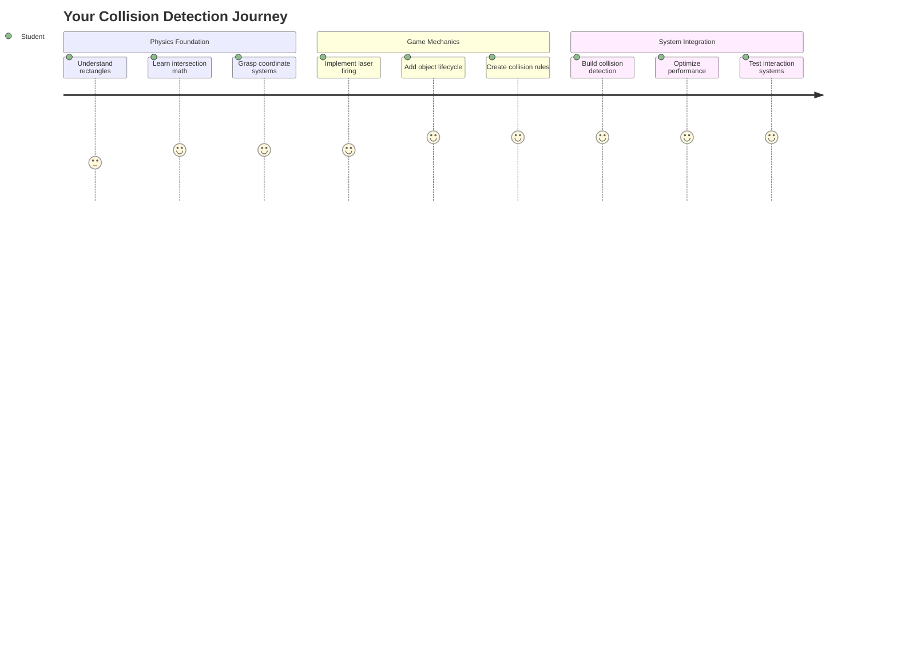
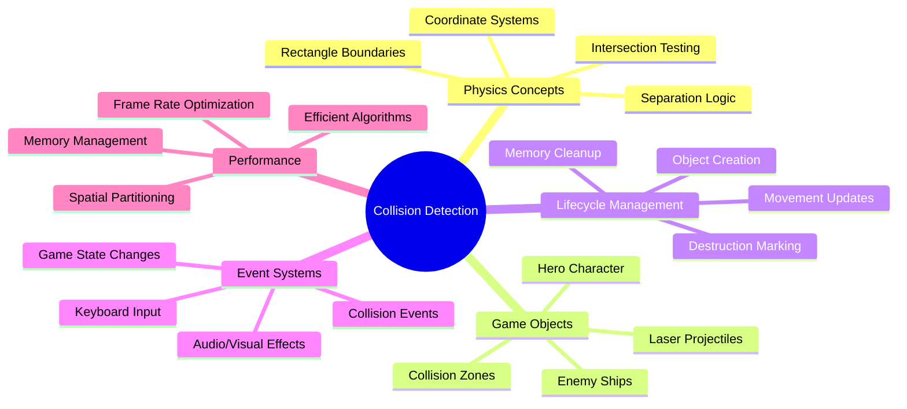
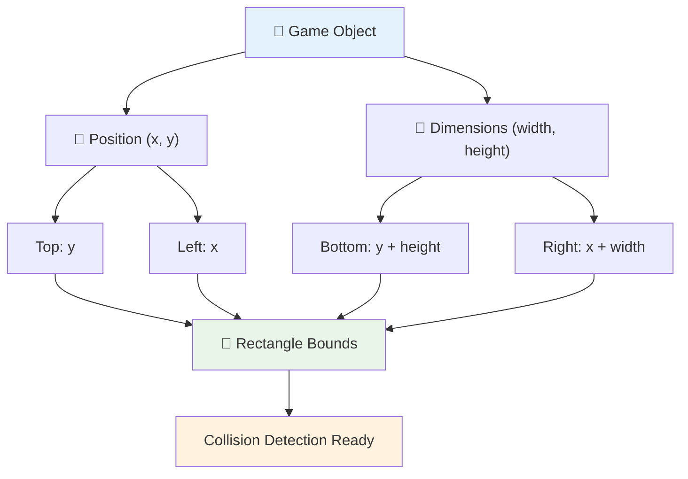
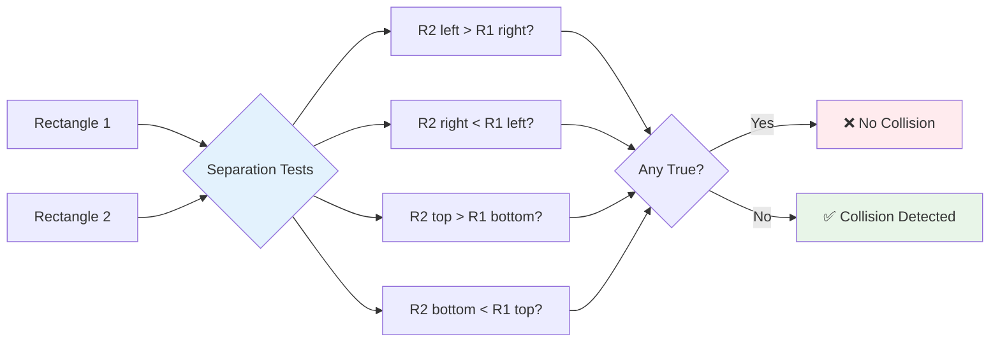
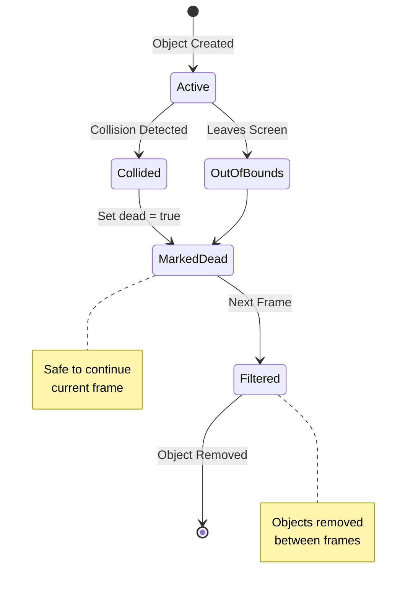
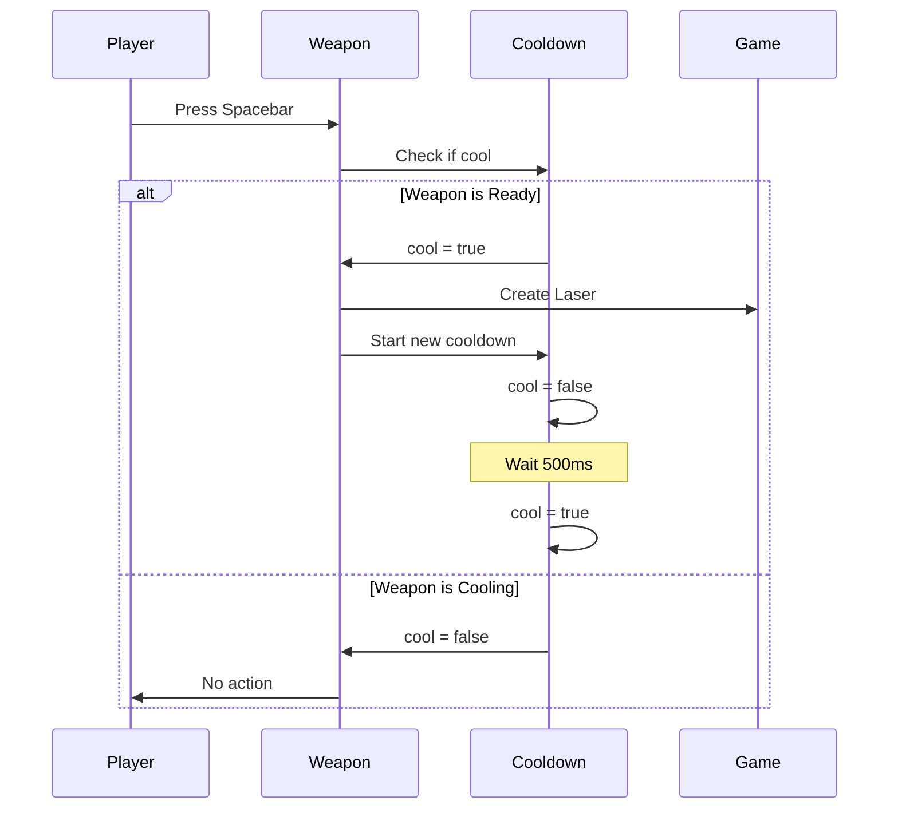
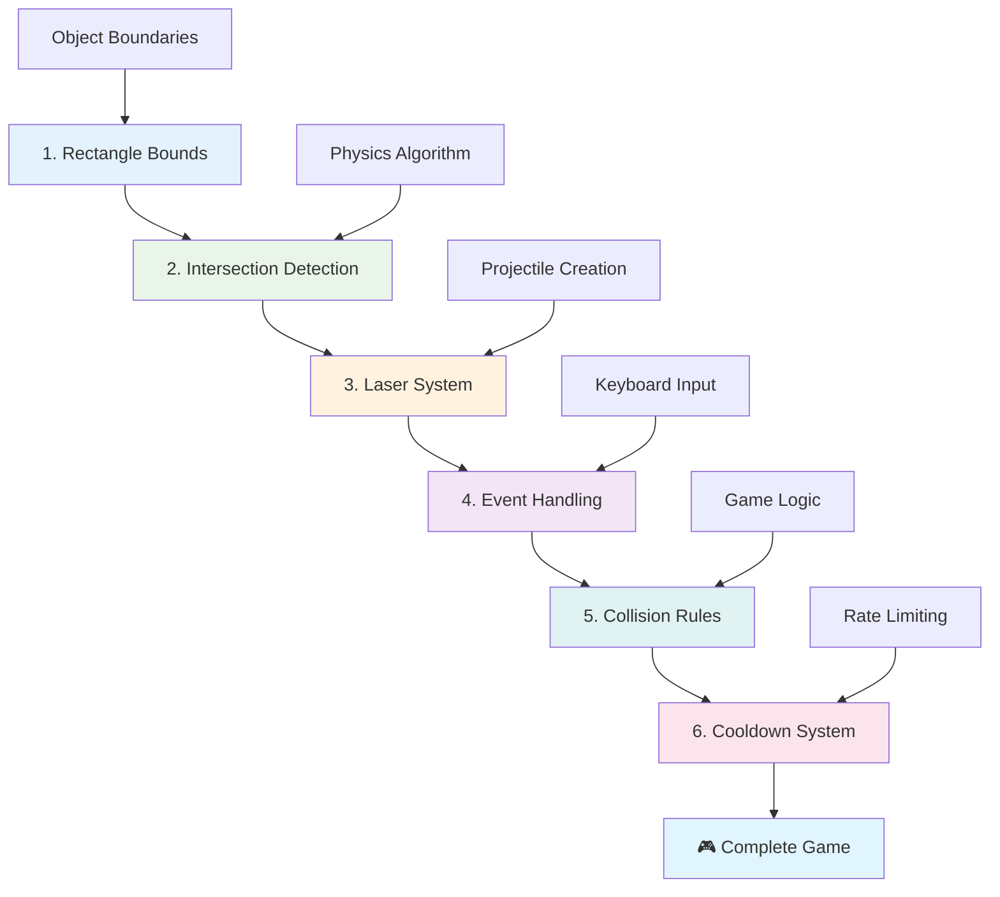
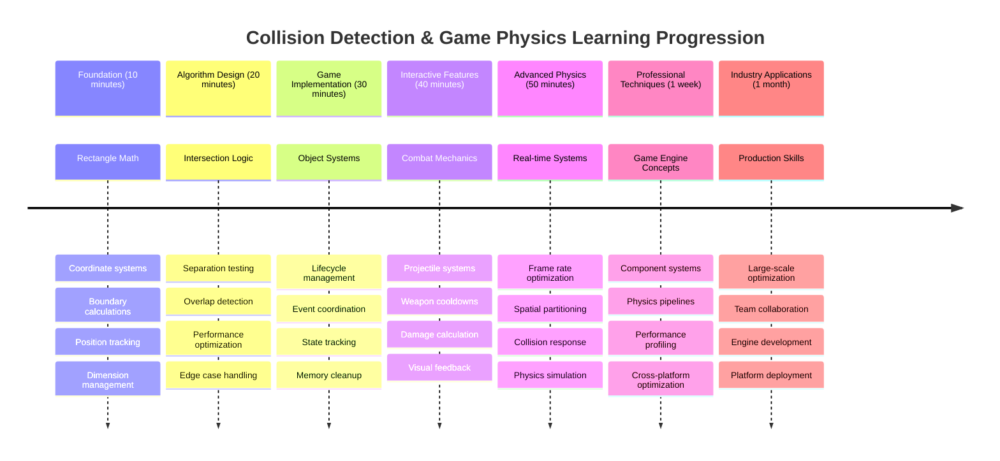

# Uzay Oyunu Yapımı Bölüm 4: Lazer Eklemek ve Çarpışmaları Algılamak



## Ders Öncesi Test

[Ders öncesi testi](https://ff-quizzes.netlify.app/web/quiz/35)

Star Wars'ta Luke'un proton torpidolarının Ölüm Yıldızı'nın egzoz portuna çarptığı anı düşünün. Bu hassas çarpışma algılama galaksinin kaderini değiştirdi! Oyunlarda çarpışma algılama aynı şekilde çalışır - nesnelerin ne zaman etkileşime geçtiğini ve sonrasında ne olduğunu belirler.

Bu derste, uzay oyununuza lazer silahları ekleyecek ve çarpışma algılamayı uygulayacaksınız. NASA'nın görev planlayıcılarının uzay araçlarının enkazdan kaçınması için yörüngeleri hesaplaması gibi, oyun nesnelerinin kesiştiği anları algılamayı öğreneceksiniz. Bunu birbirini tamamlayan adımlara bölerek öğreneceğiz.

Sonunda, lazerlerin düşmanları yok ettiği ve çarpışmaların oyun olaylarını tetiklediği çalışan bir savaş sistemi oluşturmuş olacaksınız. Bu çarpışma prensipleri, fizik simülasyonlarından etkileşimli web arayüzlerine kadar her şeyde kullanılır.



✅ İlk yazılan bilgisayar oyunu hakkında biraz araştırma yapın. İşlevselliği neydi?

## Çarpışma Algılama

Çarpışma algılama, Apollo ay modülündeki yakınlık sensörleri gibi çalışır - sürekli mesafeleri kontrol eder ve nesneler çok yaklaştığında uyarılar tetikler. Oyunlarda bu sistem, nesnelerin ne zaman etkileşime geçtiğini ve sonrasında ne olması gerektiğini belirler.

Kullanacağımız yaklaşım, her oyun nesnesini bir dikdörtgen olarak ele alır; hava trafik kontrol sistemlerinin uçakları izlemek için basitleştirilmiş geometrik şekiller kullanmasına benzer. Bu dikdörtgen yöntemi basit görünebilir, ancak hesaplama açısından verimlidir ve çoğu oyun senaryosu için iyi çalışır.

### Dikdörtgen Temsili

Her oyun nesnesinin koordinat sınırlarına ihtiyacı vardır; tıpkı Mars Pathfinder gezgininin Mars yüzeyindeki konumunu haritaladığı gibi. İşte bu sınır koordinatlarını nasıl tanımladığımız:



```javascript
rectFromGameObject() {
  return {
    top: this.y,
    left: this.x,
    bottom: this.y + this.height,
    right: this.x + this.width
  }
}
```

**Bunu parçalayalım:**
- **Üst kenar**: Nesnenizin dikey olarak başladığı yer (y pozisyonu)
- **Sol kenar**: Yatay olarak başladığı yer (x pozisyonu)
- **Alt kenar**: Y pozisyonuna yüksekliği ekleyin - şimdi nerede bittiğini biliyorsunuz!
- **Sağ kenar**: Genişliği x pozisyonuna ekleyin - ve tam sınırı elde ettiniz.

### Kesişim Algoritması

Dikdörtgen kesişimlerini algılamak, Hubble Uzay Teleskobu'nun görüş alanındaki gök cisimlerinin örtüşüp örtüşmediğini belirleme mantığına benzer. Algoritma ayrımı kontrol eder:



```javascript
function intersectRect(r1, r2) {
  return !(r2.left > r1.right ||
    r2.right < r1.left ||
    r2.top > r1.bottom ||
    r2.bottom < r1.top);
}
```

**Ayrım testi radar sistemleri gibi çalışır:**
- Dikdörtgen 2 tamamen dikdörtgen 1'in sağında mı?
- Dikdörtgen 2 tamamen dikdörtgen 1'in solunda mı?
- Dikdörtgen 2 tamamen dikdörtgen 1'in altında mı?
- Dikdörtgen 2 tamamen dikdörtgen 1'in üstünde mi?

Bu koşulların hiçbiri doğru değilse, dikdörtgenler örtüşüyor olmalı. Bu yaklaşım, radar operatörlerinin iki uçağın güvenli mesafede olup olmadığını belirleme yöntemine benzer.

## Nesne Yaşam Döngülerini Yönetmek

Bir lazer bir düşmana çarptığında, her iki nesne de oyundan kaldırılmalıdır. Ancak, döngü sırasında nesneleri silmek çökme sorunlarına neden olabilir - Apollo Rehberlik Bilgisayarı gibi erken bilgisayar sistemlerinde zor yoldan öğrenilen bir ders. Bunun yerine, nesneleri çerçeveler arasında güvenli bir şekilde kaldıran "silinmek için işaretleme" yaklaşımını kullanıyoruz.



Bir şeyi kaldırmak için nasıl işaretlediğimiz:

```javascript
// Mark object for removal
enemy.dead = true;
```

**Bu yaklaşım neden işe yarıyor:**
- Nesneyi "ölü" olarak işaretliyoruz ancak hemen silmiyoruz
- Bu, mevcut oyun çerçevesinin güvenli bir şekilde tamamlanmasına olanak tanır
- Zaten silinmiş bir şeyi kullanmaya çalışmaktan kaynaklanan çökme sorunları olmaz!

Sonraki render döngüsünden önce işaretlenmiş nesneleri filtreleyin:

```javascript
gameObjects = gameObjects.filter(go => !go.dead);
```

**Bu filtreleme ne yapar:**
- Sadece "canlı" nesnelerle yeni bir liste oluşturur
- Ölü olarak işaretlenmiş olan her şeyi çıkarır
- Oyununuzun sorunsuz çalışmasını sağlar
- Yok edilen nesnelerin birikmesinden kaynaklanan bellek şişmesini önler

## Lazer Mekaniklerini Uygulamak

Oyunlardaki lazer mermileri, Star Trek'teki foton torpidoları gibi çalışır - düz çizgiler halinde hareket eden ve bir şeye çarpana kadar ilerleyen ayrık nesnelerdir. Her boşluk tuşuna basıldığında, ekran boyunca hareket eden yeni bir lazer nesnesi oluşturulur.

Bunu çalıştırmak için birkaç farklı parçayı koordine etmemiz gerekiyor:

**Uygulanacak temel bileşenler:**
- **Lazer nesneleri oluştur**: Kahramanın konumundan doğar
- **Klavye girişini yönet**: Lazer oluşturmayı tetikler
- **Lazer hareketini ve yaşam döngüsünü yönet**
- **Lazer mermileri için görsel temsil uygula**

## Ateşleme Hızı Kontrolünü Uygulamak

Sınırsız ateşleme hızları oyun motorunu zorlar ve oyunu çok kolay hale getirir. Gerçek silah sistemleri benzer kısıtlamalarla karşı karşıya - USS Enterprise'ın fazörleri bile atışlar arasında yeniden şarj olmak için zamana ihtiyaç duyardı.

Spam ateşlemeyi önleyen ve kontrolleri duyarlı tutan bir soğuma sistemi uygulayacağız:



```javascript
class Cooldown {
  constructor(time) {
    this.cool = false;
    setTimeout(() => {
      this.cool = true;
    }, time);
  }
}

class Weapon {
  constructor() {
    this.cooldown = null;
  }
  
  fire() {
    if (!this.cooldown || this.cooldown.cool) {
      // Create laser projectile
      this.cooldown = new Cooldown(500);
    } else {
      // Weapon is still cooling down
    }
  }
}
```

**Soğuma nasıl çalışır:**
- Oluşturulduğunda, silah "sıcak" başlar (henüz ateş edemez)
- Zaman aşımı süresinden sonra "soğur" (ateş etmeye hazır)
- Ateşlemeden önce kontrol ederiz: "Silah soğuk mu?"
- Bu, spam tıklamayı önlerken kontrolleri duyarlı tutar

✅ Soğuma sistemlerini hatırlamak için uzay oyunu serisinin 1. dersine göz atın.

## Çarpışma Sistemini Oluşturmak

Mevcut uzay oyunu kodunuzu genişleterek bir çarpışma algılama sistemi oluşturacaksınız. Uluslararası Uzay İstasyonu'nun otomatik çarpışma önleme sistemi gibi, oyununuz nesne pozisyonlarını sürekli izler ve kesişimlere yanıt verir.

Önceki dersinizin kodundan başlayarak, nesne etkileşimlerini yöneten belirli kurallarla çarpışma algılamayı ekleyeceksiniz.

> 💡 **Profesyonel İpucu**: Lazer sprite'ı zaten varlıklar klasörünüzde ve kodunuzda referans olarak bulunuyor, uygulamaya hazır.

### Uygulanacak Çarpışma Kuralları

**Eklenmesi gereken oyun mekanikleri:**
1. **Lazer düşmana çarpar**: Lazer mermisi düşman nesnesine çarptığında düşman yok edilir
2. **Lazer ekran sınırına çarpar**: Lazer ekranın üst kenarına ulaştığında kaldırılır
3. **Düşman ve kahraman çarpışması**: İki nesne kesiştiğinde her ikisi de yok edilir
4. **Düşman alt kenara ulaşır**: Düşmanlar ekranın altına ulaştığında oyun biter

### 🔄 **Pedagojik Kontrol**
**Çarpışma Algılama Temeli**: Uygulamadan önce şunları anladığınızdan emin olun:
- ✅ Dikdörtgen sınırlarının çarpışma bölgelerini nasıl tanımladığı
- ✅ Ayrım testinin kesişim hesaplamasından neden daha verimli olduğu
- ✅ Oyun döngülerinde nesne yaşam döngüsü yönetiminin önemi
- ✅ Olay odaklı sistemlerin çarpışma yanıtlarını nasıl koordine ettiği

**Hızlı Kendini Test Et**: Nesneleri hemen silseydiniz ne olurdu?
*Cevap: Döngü ortasında silme, çökme veya yinelemede nesnelerin atlanmasına neden olabilir.*

**Fizik Anlayışı**: Şimdi şunları kavradınız:
- **Koordinat Sistemleri**: Pozisyon ve boyutların sınırları nasıl oluşturduğu
- **Kesişim Mantığı**: Çarpışma algılamanın matematiksel prensipleri
- **Performans Optimizasyonu**: Gerçek zamanlı sistemlerde verimli algoritmaların önemi
- **Bellek Yönetimi**: Kararlı nesne yaşam döngüsü desenleri

## Geliştirme Ortamınızı Ayarlamak

İyi haber - sizin için çoğu altyapıyı zaten hazırladık! Tüm oyun varlıklarınız ve temel yapınız, `your-work` alt klasöründe çarpışma özelliklerini eklemeniz için hazır.

### Proje Yapısı

```bash
-| assets
  -| enemyShip.png
  -| player.png
  -| laserRed.png
-| index.html
-| app.js
-| package.json
```

**Dosya yapısını anlamak:**
- **İçerir** oyun nesneleri için gerekli tüm sprite görüntülerini
- **Dahil eder** ana HTML belgesini ve JavaScript uygulama dosyasını
- **Sağlar** yerel geliştirme sunucusu için paket yapılandırması

### Geliştirme Sunucusunu Başlatmak

Proje klasörünüze gidin ve yerel sunucuyu başlatın:

```bash
cd your-work
npm start
```

**Bu komut dizisi:**
- **Çalışma** proje klasörünüze geçer
- **Başlatır** yerel bir HTTP sunucusunu `http://localhost:5000` adresinde
- **Sunar** oyun dosyalarınızı test ve geliştirme için
- **Etkinleştirir** otomatik yeniden yükleme ile canlı geliştirme

Tarayıcınızı açın ve `http://localhost:5000` adresine giderek kahraman ve düşmanların ekranda görüntülendiği mevcut oyun durumunuzu görün.

### Adım Adım Uygulama

NASA'nın Voyager uzay aracını programlamak için kullandığı sistematik yaklaşım gibi, çarpışma algılamayı adım adım metodik olarak uygulayacağız.



#### 1. Dikdörtgen Çarpışma Sınırlarını Ekleyin

Öncelikle, oyun nesnelerimize sınırlarını nasıl tanımlayacaklarını öğretelim. Bu yöntemi `GameObject` sınıfınıza ekleyin:

```javascript
rectFromGameObject() {
    return {
      top: this.y,
      left: this.x,
      bottom: this.y + this.height,
      right: this.x + this.width,
    };
  }
```

**Bu yöntem şunları sağlar:**
- **Oluşturur** kesin sınır koordinatlarına sahip bir dikdörtgen nesnesi
- **Hesaplar** alt ve sağ kenarları pozisyon artı boyutları kullanarak
- **Döndürür** çarpışma algılama algoritmaları için hazır bir nesne
- **Standartlaştırır** tüm oyun nesneleri için bir arayüz

#### 2. Kesişim Algılamayı Uygulayın

Şimdi çarpışma dedektifimizi - iki dikdörtgenin örtüşüp örtüşmediğini söyleyebilen bir fonksiyon - oluşturalım:

```javascript
function intersectRect(r1, r2) {
  return !(
    r2.left > r1.right ||
    r2.right < r1.left ||
    r2.top > r1.bottom ||
    r2.bottom < r1.top
  );
}
```

**Bu algoritma şunları yapar:**
- **Test eder** dikdörtgenler arasındaki dört ayrım koşulunu
- **Döndürür** herhangi bir ayrım koşulu doğruysa `false`
- **Gösterir** çarpışmayı ayrım olmadığında
- **Kullanır** verimli kesişim testi için olumsuz mantık

#### 3. Lazer Ateşleme Sistemini Uygulayın

İşte işler heyecanlanıyor! Lazer ateşleme sistemini kurmaya başlayalım.

##### Mesaj Sabitleri

Öncelikle, oyunun farklı bölümlerinin birbirleriyle konuşabilmesi için bazı mesaj türlerini tanımlayalım:

```javascript
KEY_EVENT_SPACE: "KEY_EVENT_SPACE",
COLLISION_ENEMY_LASER: "COLLISION_ENEMY_LASER",
COLLISION_ENEMY_HERO: "COLLISION_ENEMY_HERO",
```

**Bu sabitler şunları sağlar:**
- **Standartlaştırır** uygulama genelinde olay adlarını
- **Etkinleştirir** oyun sistemleri arasında tutarlı iletişim
- **Önler** olay işleyici kaydında yazım hatalarını

##### Klavye Girişini Yönetme

Boşluk tuşu algılamayı tuş olay dinleyicinize ekleyin:

```javascript
} else if(evt.keyCode === 32) {
  eventEmitter.emit(Messages.KEY_EVENT_SPACE);
}
```

**Bu giriş işleyici:**
- **Algılar** boşluk tuşu basışlarını keyCode 32 kullanarak
- **Gönderir** standart bir olay mesajı
- **Etkinleştirir** ayrık ateşleme mantığını

##### Olay Dinleyici Kurulumu

`initGame()` fonksiyonunuza ateşleme davranışını kaydedin:

```javascript
eventEmitter.on(Messages.KEY_EVENT_SPACE, () => {
 if (hero.canFire()) {
   hero.fire();
 }
});
```

**Bu olay dinleyici:**
- **Yanıt verir** boşluk tuşu olaylarına
- **Kontrol eder** ateşleme soğuma durumunu
- **Tetikler** lazer oluşturmayı izin verildiğinde

Lazer-düşman etkileşimleri için çarpışma işleyicisini ekleyin:

```javascript
eventEmitter.on(Messages.COLLISION_ENEMY_LASER, (_, { first, second }) => {
  first.dead = true;
  second.dead = true;
});
```

**Bu çarpışma işleyici:**
- **Alır** çarpışma olay verilerini her iki nesneyle birlikte
- **İşaretler** her iki nesneyi kaldırılmak üzere
- **Sağlar** çarpışma sonrası uygun temizliği

#### 4. Lazer Sınıfını Oluşturun

Yukarı doğru hareket eden ve kendi yaşam döngüsünü yöneten bir lazer mermisi uygulayın:

```javascript
class Laser extends GameObject {
  constructor(x, y) {
    super(x, y);
    this.width = 9;
    this.height = 33;
    this.type = 'Laser';
    this.img = laserImg;
    
    let id = setInterval(() => {
      if (this.y > 0) {
        this.y -= 15;
      } else {
        this.dead = true;
        clearInterval(id);
      }
    }, 100);
  }
}
```

**Bu sınıf uygulaması:**
- **Genişletir** GameObject'i temel işlevselliği miras almak için
- **Ayarlar** lazer sprite için uygun boyutlar
- **Oluşturur** `setInterval()` kullanarak otomatik yukarı hareket
- **Yönetir** ekranın üstüne ulaştığında kendi kendini yok etme
- **Yönetir** kendi animasyon zamanlamasını ve temizliğini

#### 5. Çarpışma Algılama Sistemini Uygulayın

Kapsamlı bir çarpışma algılama fonksiyonu oluşturun:

```javascript
function updateGameObjects() {
  const enemies = gameObjects.filter(go => go.type === 'Enemy');
  const lasers = gameObjects.filter(go => go.type === "Laser");
  
  // Test laser-enemy collisions
  lasers.forEach((laser) => {
    enemies.forEach((enemy) => {
      if (intersectRect(laser.rectFromGameObject(), enemy.rectFromGameObject())) {
        eventEmitter.emit(Messages.COLLISION_ENEMY_LASER, {
          first: laser,
          second: enemy,
        });
      }
    });
  });

  // Remove destroyed objects
  gameObjects = gameObjects.filter(go => !go.dead);
}
```

**Bu çarpışma sistemi:**
- **Filtreler** oyun nesnelerini türlerine göre verimli test için
- **Test eder** her lazeri her düşmana karşı kesişim için
- **Gönderir** kesişim algılandığında çarpışma olayları
- **Temizler** çarpışma işleminden sonra yok edilen nesneleri

> ⚠️ **Önemli**: Çarpışma algılamayı etkinleştirmek için `updateGameObjects()` fonksiyonunu `window.onload` içindeki ana oyun döngünüze ekleyin.

#### 6. Kahraman Sınıfına Soğuma Sistemi Ekleyin

Kahraman sınıfını ateşleme mekanikleri ve hız sınırlaması ile geliştirin:

```javascript
class Hero extends GameObject {
  constructor(x, y) {
    super(x, y);
    this.width = 99;
    this.height = 75;
    this.type = "Hero";
    this.speed = { x: 0, y: 0 };
    this.cooldown = 0;
  }
  
  fire() {
    gameObjects.push(new Laser(this.x + 45, this.y - 10));
    this.cooldown = 500;

    let id = setInterval(() => {
      if (this.cooldown > 0) {
        this.cooldown -= 100;
      } else {
        clearInterval(id);
      }
    }, 200);
  }
  
  canFire() {
    return this.cooldown === 0;
  }
}
```

**Geliştirilmiş Kahraman sınıfını anlamak:**
- **Başlatır** soğuma zamanlayıcısını sıfırda (ateşlemeye hazır)
- **Oluşturur** kahraman gemisinin üstünde konumlanmış lazer nesneleri
- **Ayarlar** hızlı ateşlemeyi önlemek için soğuma süresi
- **Azaltır** soğuma zamanlayıcısını aralık tabanlı güncellemelerle
- **Sağlar** `canFire()` yöntemiyle ateşleme durumu kontrolü

### 🔄 **Pedagojik Kontrol**
**Tam Sistem Anlayışı**: Çarpışma sistemine hakimiyetinizi doğrulayın:
- ✅ Dikdörtgen sınırları verimli çarpışma algılamayı nasıl sağlar?
- ✅ Nesne yaşam döngüsü yönetimi oyun istikrarı için neden kritiktir?
- ✅ Soğuma sistemi performans sorunlarını nasıl önler?
- ✅ Olay odaklı mimari çarpışma işleme sürecinde nasıl bir rol oynar?

**Sistem Entegrasyonu**: Çarpışma algılamanız şunları gösterir:
- **Matematiksel Hassasiyet**: Dikdörtgen kesişim algoritmaları
- **Performans Optimizasyonu**: Verimli çarpışma test desenleri
- **Bellek Yönetimi**: Güvenli nesne oluşturma ve yok etme
- **Olay Koordinasyonu**: Ayrık sistem iletişimi
- **Gerçek Zamanlı İşleme**: Çerçeve tabanlı güncelleme döngüleri

**Profesyonel Desenler**: Şunları uyguladınız:
- **Sorumlulukların Ayrımı**: Fizik, render ve girişin ayrılması
- **Nesneye Yönelik Tasarım**: Kalıtım ve çok biçimlilik
- **Durum Yönetimi**: Nesne yaşam döngüsü ve oyun durumu takibi
- **Performans Optimizasyonu**: Gerçek zamanlı kullanım için verimli algoritmalar

### Uygulamanızı Test Etmek

Uzay oyununuz artık tam bir çarpışma algıl
- [ ] Çarpışma olaylarını gerçek zamanlı izlemek için `console.log` ifadeleri ekleyin

### 🎯 **Bu Saatte Neler Başarabilirsiniz**
- [ ] Ders sonrası testi tamamlayın ve çarpışma algılama algoritmalarını anlayın
- [ ] Çarpışmalar gerçekleştiğinde patlama gibi görsel efektler ekleyin
- [ ] Farklı özelliklere sahip çeşitli mermiler uygulayın
- [ ] Oyuncunun yeteneklerini geçici olarak artıran güçlendirmeler oluşturun
- [ ] Çarpışmaları daha tatmin edici hale getirmek için ses efektleri ekleyin

### 📅 **Haftalık Fizik Programlama Planınız**
- [ ] Cilalı çarpışma sistemleriyle tam bir uzay oyunu tamamlayın
- [ ] Dikdörtgenlerin ötesinde gelişmiş çarpışma şekilleri uygulayın (daireler, çokgenler)
- [ ] Gerçekçi patlama efektleri için parçacık sistemleri ekleyin
- [ ] Çarpışmadan kaçınma ile karmaşık düşman davranışları oluşturun
- [ ] Çok sayıda nesneyle daha iyi performans için çarpışma algılamayı optimize edin
- [ ] Momentum ve gerçekçi hareket gibi fizik simülasyonları ekleyin

### 🌟 **Aylık Oyun Fiziği Uzmanlığı**
- [ ] Gelişmiş fizik motorları ve gerçekçi simülasyonlarla oyunlar oluşturun
- [ ] 3D çarpışma algılama ve uzaysal bölme algoritmalarını öğrenin
- [ ] Açık kaynak fizik kütüphanelerine ve oyun motorlarına katkıda bulunun
- [ ] Grafik yoğun uygulamalar için performans optimizasyonunda ustalaşın
- [ ] Oyun fiziği ve çarpışma algılama hakkında eğitim içerikleri oluşturun
- [ ] Gelişmiş fizik programlama becerilerini sergileyen bir portföy oluşturun

## 🎯 Çarpışma Algılama Uzmanlığı Zaman Çizelgeniz



### 🛠️ Oyun Fiziği Araç Seti Özeti

Bu dersi tamamladıktan sonra artık şunlarda ustalaştınız:
- **Çarpışma Matematiği**: Dikdörtgen kesişim algoritmaları ve koordinat sistemleri
- **Performans Optimizasyonu**: Gerçek zamanlı uygulamalar için verimli çarpışma algılama
- **Nesne Yaşam Döngüsü Yönetimi**: Güvenli oluşturma, güncelleme ve yok etme yöntemleri
- **Olay Tabanlı Mimari**: Çarpışma tepkisi için ayrık sistemler
- **Oyun Döngüsü Entegrasyonu**: Kare bazlı fizik güncellemeleri ve render koordinasyonu
- **Girdi Sistemleri**: Hız sınırlaması ve geri bildirim ile duyarlı kontroller
- **Bellek Yönetimi**: Verimli nesne havuzu ve temizleme stratejileri

**Gerçek Dünya Uygulamaları**: Çarpışma algılama becerileriniz doğrudan şunlara uygulanabilir:
- **Etkileşimli Simülasyonlar**: Bilimsel modelleme ve eğitim araçları
- **Kullanıcı Arayüzü Tasarımı**: Sürükle-bırak etkileşimleri ve dokunma algılama
- **Veri Görselleştirme**: Etkileşimli grafikler ve tıklanabilir öğeler
- **Mobil Geliştirme**: Dokunma hareketi tanıma ve çarpışma işleme
- **Robotik Programlama**: Yol planlama ve engel kaçınma
- **Bilgisayar Grafikleri**: Işın izleme ve uzaysal algoritmalar

**Kazanılan Profesyonel Beceriler**: Artık şunları yapabilirsiniz:
- **Tasarım**: Gerçek zamanlı çarpışma algılama için verimli algoritmalar
- **Uygulama**: Nesne karmaşıklığıyla ölçeklenen fizik sistemleri
- **Hata Ayıklama**: Matematiksel prensipler kullanarak karmaşık etkileşim sistemlerini çözme
- **Optimizasyon**: Farklı donanım ve tarayıcı yetenekleri için performans iyileştirme
- **Mimari**: Kanıtlanmış tasarım desenleri kullanarak sürdürülebilir oyun sistemleri oluşturma

**Oyun Geliştirme Konseptlerinde Ustalık**:
- **Fizik Simülasyonu**: Gerçek zamanlı çarpışma algılama ve tepki
- **Performans Mühendisliği**: Etkileşimli uygulamalar için optimize edilmiş algoritmalar
- **Olay Sistemleri**: Oyun bileşenleri arasında ayrık iletişim
- **Nesne Yönetimi**: Dinamik içerik için verimli yaşam döngüsü yöntemleri
- **Girdi İşleme**: Uygun geri bildirimle duyarlı kontroller

**Bir Sonraki Seviye**: Matter.js gibi gelişmiş fizik motorlarını keşfetmeye, 3D çarpışma algılamayı uygulamaya veya karmaşık parçacık sistemleri oluşturmaya hazırsınız!

🌟 **Başarı Kilidi Açıldı**: Profesyonel düzeyde çarpışma algılama ile tam bir fizik tabanlı etkileşim sistemi oluşturdunuz!

## GitHub Copilot Agent Challenge 🚀

Agent modunu kullanarak aşağıdaki meydan okumayı tamamlayın:

**Açıklama:** Çarpışma algılama sistemini geliştirerek rastgele ortaya çıkan ve kahraman gemi tarafından toplandığında geçici yetenekler sağlayan güçlendirmeler uygulayın.

**İstek:** GameObject'i genişleten bir PowerUp sınıfı oluşturun ve kahraman ile güçlendirmeler arasındaki çarpışma algılamasını uygulayın. En az iki tür güçlendirme ekleyin: biri ateş hızını artıran (bekleme süresini azaltan), diğeri geçici bir kalkan oluşturan. Rastgele aralıklarla ve pozisyonlarda güçlendirmeler oluşturan bir oluşturma mantığı ekleyin.

---

## 🚀 Meydan Okuma

Bir patlama ekleyin! [Space Art repo](../../../../6-space-game/solution/spaceArt/readme.txt) içindeki oyun varlıklarına göz atın ve lazer bir uzaylıya çarptığında bir patlama eklemeyi deneyin.

## Ders Sonrası Test

[Ders sonrası test](https://ff-quizzes.netlify.app/web/quiz/36)

## Gözden Geçirme ve Kendi Kendine Çalışma

Şimdiye kadar oyununuzdaki aralıklarla deney yapın. Onları değiştirdiğinizde ne oluyor? [JavaScript zamanlama olayları](https://www.freecodecamp.org/news/javascript-timing-events-settimeout-and-setinterval/) hakkında daha fazla okuyun.

## Ödev

[Çarpışmaları keşfedin](assignment.md)

---

**Feragatname**:  
Bu belge, AI çeviri hizmeti [Co-op Translator](https://github.com/Azure/co-op-translator) kullanılarak çevrilmiştir. Doğruluk için çaba göstersek de, otomatik çevirilerin hata veya yanlışlıklar içerebileceğini lütfen unutmayın. Belgenin orijinal dili, yetkili kaynak olarak kabul edilmelidir. Kritik bilgiler için profesyonel insan çevirisi önerilir. Bu çevirinin kullanımından kaynaklanan yanlış anlamalar veya yanlış yorumlamalar için sorumluluk kabul etmiyoruz.