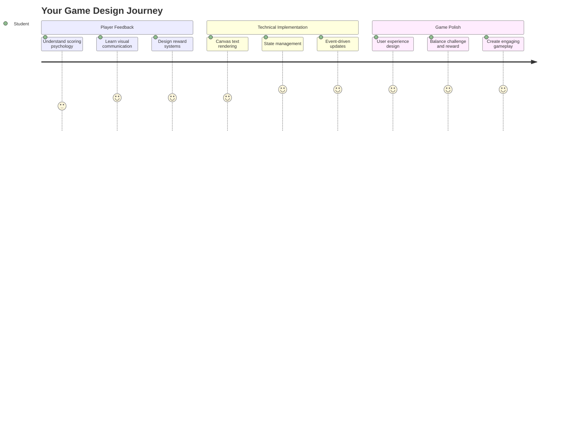
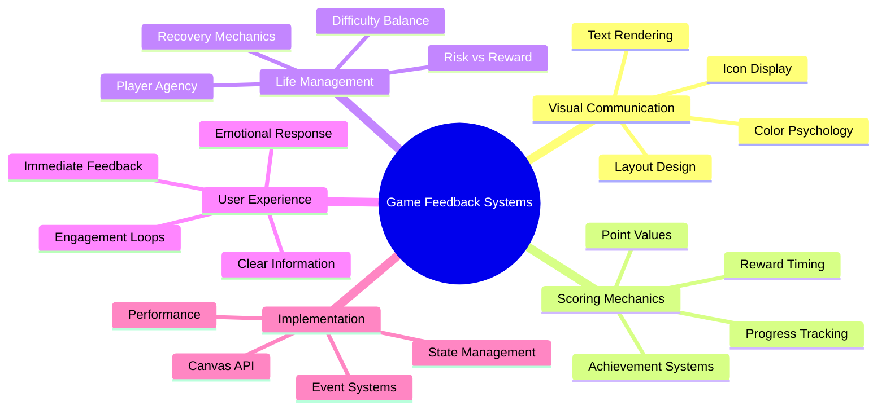
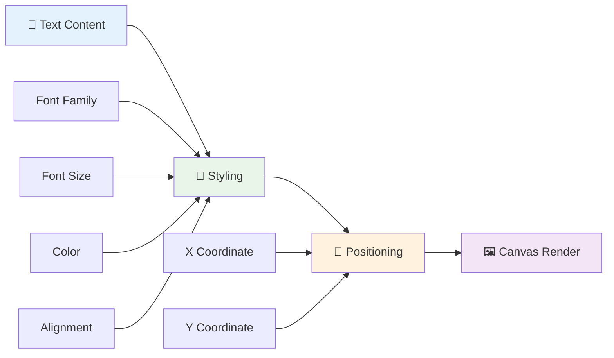
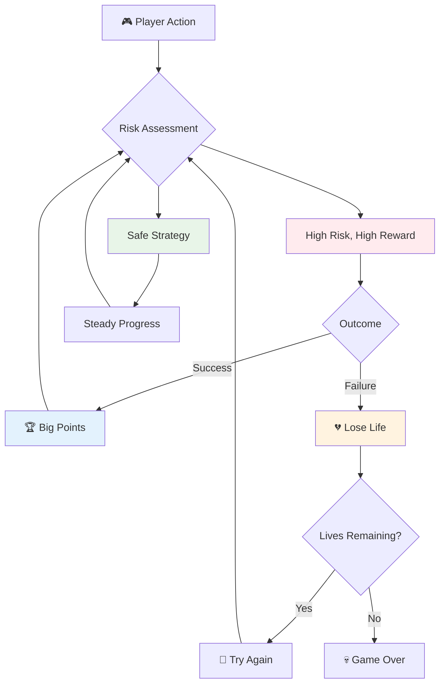
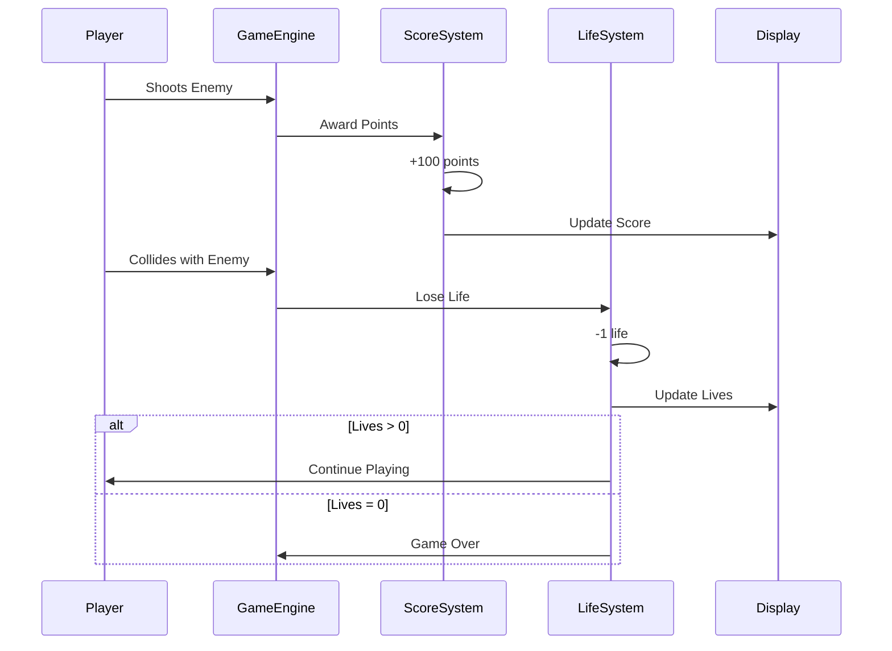
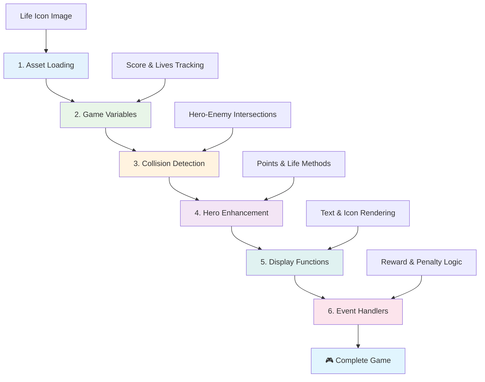
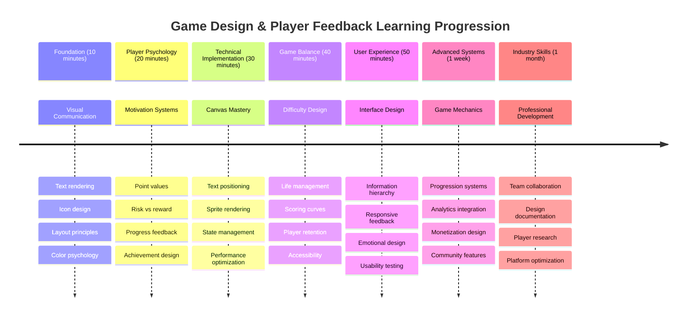

<!--
CO_OP_TRANSLATOR_METADATA:
{
  "original_hash": "2ed9145a16cf576faa2a973dff84d099",
  "translation_date": "2025-11-04T01:06:09+00:00",
  "source_file": "6-space-game/5-keeping-score/README.md",
  "language_code": "tr"
}
-->
# Uzay Oyunu Yapımı Bölüm 5: Puanlama ve Canlar



## Ders Öncesi Quiz

[Ders öncesi quiz](https://ff-quizzes.netlify.app/web/quiz/37)

Uzay oyununuzu gerçek bir oyun gibi hissettirmeye hazır mısınız? Puanlama ve can yönetimi ekleyelim - Space Invaders gibi erken dönem arcade oyunlarını basit bir gösterimden bağımlılık yaratan bir eğlenceye dönüştüren temel mekanikler. İşte oyununuzun gerçekten oynanabilir hale geldiği yer.



## Ekranda Metin Çizmek - Oyununuzun Sesi

Puanınızı göstermek için, tuval üzerinde metin nasıl çizileceğini öğrenmemiz gerekiyor. `fillText()` yöntemi, bunun için ana aracınızdır - klasik arcade oyunlarında puanları ve durum bilgilerini göstermek için kullanılan aynı tekniktir.



Metin görünümünü tamamen kontrol edebilirsiniz:

```javascript
ctx.font = "30px Arial";
ctx.fillStyle = "red";
ctx.textAlign = "right";
ctx.fillText("show this on the screen", 0, 0);
```

✅ [Tuvale metin ekleme](https://developer.mozilla.org/docs/Web/API/Canvas_API/Tutorial/Drawing_text) hakkında daha fazla bilgi edinin - yazı tipleri ve stillerle ne kadar yaratıcı olabileceğinize şaşırabilirsiniz!

## Canlar - Sadece Bir Sayıdan Fazlası

Oyun tasarımında "can", oyuncunun hata yapma payını temsil eder. Bu kavram, birden fazla top ile oynayabileceğiniz pinball makinelerine kadar uzanır. Asteroids gibi erken dönem video oyunlarında, canlar oyunculara risk alma ve hatalardan öğrenme izni verdi.



Görsel temsil büyük önem taşır - sadece "Canlar: 3" yerine gemi ikonları göstermek, dil engellerini aşmak için erken dönem arcade dolaplarının ikonografi kullandığı gibi, anında görsel tanıma sağlar.

## Oyununuzun Ödül Sistemini İnşa Etmek

Şimdi oyuncuları meşgul tutan temel geri bildirim sistemlerini uygulayacağız:



- **Puanlama sistemi**: Yok edilen her düşman gemisi 100 puan kazandırır (yuvarlak sayılar oyuncuların zihinsel olarak hesaplamasını kolaylaştırır). Puan, sol alt köşede gösterilir.
- **Can sayacı**: Kahramanınız üç canla başlar - erken dönem arcade oyunlarının zorluk ile oynanabilirlik arasında denge kurmak için belirlediği bir standart. Düşmanla her çarpışma bir cana mal olur. Kalan canları sağ altta gemi ikonlarıyla göstereceğiz .

## Hadi İnşa Edelim!

Öncelikle çalışma alanınızı kurun. `your-work` alt klasöründeki dosyalara gidin. Bu dosyaları görmelisiniz:

```bash
-| assets
  -| enemyShip.png
  -| player.png
  -| laserRed.png
-| index.html
-| app.js
-| package.json
```

Oyununuzu test etmek için, `your_work` klasöründen geliştirme sunucusunu başlatın:

```bash
cd your-work
npm start
```

Bu, `http://localhost:5000` adresinde yerel bir sunucu çalıştırır. Oyununuzu görmek için bu adresi tarayıcınızda açın. Kontrolleri ok tuşlarıyla test edin ve her şeyin çalıştığını doğrulamak için düşmanları vurmaya çalışın.



### Kodlama Zamanı!

1. **Görsel varlıkları alın**. `solution/assets/` klasöründen `life.png` varlığını `your-work` klasörünüze kopyalayın. Ardından `lifeImg`'i window.onload fonksiyonunuza ekleyin:

    ```javascript
    lifeImg = await loadTexture("assets/life.png");
    ```

1. `lifeImg`'i varlık listenize eklemeyi unutmayın:

    ```javascript
    let heroImg,
    ...
    lifeImg,
    ...
    eventEmitter = new EventEmitter();
    ```
  
2. **Oyun değişkenlerinizi ayarlayın**. Toplam puanınızı (0'dan başlayarak) ve kalan canlarınızı (3'ten başlayarak) takip etmek için biraz kod ekleyin. Bunları ekranda göstereceğiz, böylece oyuncular her zaman durumlarını bilecek.

3. **Çarpışma algılamayı uygulayın**. `updateGameObjects()` fonksiyonunuzu düşmanların kahramanınızla çarpıştığını algılayacak şekilde genişletin:

    ```javascript
    enemies.forEach(enemy => {
        const heroRect = hero.rectFromGameObject();
        if (intersectRect(heroRect, enemy.rectFromGameObject())) {
          eventEmitter.emit(Messages.COLLISION_ENEMY_HERO, { enemy });
        }
      })
    ```

4. **Kahramanınıza can ve puan takibi ekleyin**. 
   1. **Sayaçları başlatın**. `Hero` sınıfınızdaki `this.cooldown = 0` altında, can ve puan ayarlarını yapın:

        ```javascript
        this.life = 3;
        this.points = 0;
        ```

   1. **Bu değerleri oyuncuya gösterin**. Bu değerleri ekranda çizmek için fonksiyonlar oluşturun:

        ```javascript
        function drawLife() {
          // TODO, 35, 27
          const START_POS = canvas.width - 180;
          for(let i=0; i < hero.life; i++ ) {
            ctx.drawImage(
              lifeImg, 
              START_POS + (45 * (i+1) ), 
              canvas.height - 37);
          }
        }
        
        function drawPoints() {
          ctx.font = "30px Arial";
          ctx.fillStyle = "red";
          ctx.textAlign = "left";
          drawText("Points: " + hero.points, 10, canvas.height-20);
        }
        
        function drawText(message, x, y) {
          ctx.fillText(message, x, y);
        }

        ```

   1. **Her şeyi oyun döngünüze bağlayın**. Bu fonksiyonları `updateGameObjects()`'tan hemen sonra window.onload fonksiyonunuza ekleyin:

        ```javascript
        drawPoints();
        drawLife();
        ```

### 🔄 **Pedagojik Kontrol**
**Oyun Tasarımı Anlayışı**: Sonuçları uygulamadan önce şunları anladığınızdan emin olun:
- ✅ Görsel geri bildirimlerin oyunculara oyun durumunu nasıl ilettiği
- ✅ UI öğelerinin tutarlı yerleşiminin kullanılabilirliği nasıl artırdığı
- ✅ Puan değerleri ve can yönetiminin psikolojisi
- ✅ Tuval metin işleme ile HTML metni arasındaki farklar

**Hızlı Kendini Test Et**: Neden arcade oyunları genellikle yuvarlak sayılar kullanır?
*Cevap: Yuvarlak sayılar oyuncuların zihinsel olarak hesaplamasını kolaylaştırır ve tatmin edici psikolojik ödüller yaratır*

**Kullanıcı Deneyimi İlkeleri**: Şimdi uyguluyorsunuz:
- **Görsel Hiyerarşi**: Önemli bilgilerin belirgin bir şekilde konumlandırılması
- **Anında Geri Bildirim**: Oyuncu eylemlerine gerçek zamanlı güncellemeler
- **Bilişsel Yük**: Basit, net bilgi sunumu
- **Duygusal Tasarım**: Oyuncu bağlantısı oluşturan ikonlar ve renkler

1. **Oyun sonuçlarını ve ödüllerini uygulayın**. Şimdi oyuncu eylemlerini anlamlı kılan geri bildirim sistemlerini ekleyeceğiz:

   1. **Çarpışmalar canlara mal olur**. Kahramanınız her düşmanla çarpıştığında bir can kaybetmelisiniz.
   
      Bu yöntemi `Hero` sınıfınıza ekleyin:

        ```javascript
        decrementLife() {
          this.life--;
          if (this.life === 0) {
            this.dead = true;
          }
        }
        ```

   2. **Düşmanları vurmak puan kazandırır**. Her başarılı vuruş 100 puan kazandırır, doğru atış için anında olumlu geri bildirim sağlar.

      Kahraman sınıfınızı bu artırma yöntemiyle genişletin:
    
        ```javascript
          incrementPoints() {
            this.points += 100;
          }
        ```

        Şimdi bu fonksiyonları çarpışma olaylarınıza bağlayın:

        ```javascript
        eventEmitter.on(Messages.COLLISION_ENEMY_LASER, (_, { first, second }) => {
           first.dead = true;
           second.dead = true;
           hero.incrementPoints();
        })

        eventEmitter.on(Messages.COLLISION_ENEMY_HERO, (_, { enemy }) => {
           enemy.dead = true;
           hero.decrementLife();
        });
        ```

✅ JavaScript ve Canvas ile yapılmış diğer oyunlar hakkında meraklı mısınız? Biraz araştırma yapın - nelerin mümkün olduğuna şaşırabilirsiniz!

Bu özellikleri uyguladıktan sonra, oyununuzu test edin ve tam geri bildirim sistemini çalışırken görün. Sağ altta can ikonlarını, sol altta puanınızı görmelisiniz ve çarpışmalar canları azaltırken başarılı atışlar puanınızı artırmalı.

Oyununuz artık erken dönem arcade oyunlarını bu kadar çekici kılan temel mekaniklere sahip - net hedefler, anında geri bildirim ve oyuncu eylemleri için anlamlı sonuçlar.

### 🔄 **Pedagojik Kontrol**
**Tam Oyun Tasarımı Sistemi**: Oyuncu geri bildirim sistemleri üzerindeki ustalığınızı doğrulayın:
- ✅ Puanlama mekanikleri oyuncu motivasyonu ve katılımını nasıl oluşturur?
- ✅ Görsel tutarlılık neden kullanıcı arayüzü tasarımı için önemlidir?
- ✅ Can sistemi zorluk ile oyuncu tutma arasında nasıl denge kurar?
- ✅ Anında geri bildirim tatmin edici bir oyun deneyimi yaratmada nasıl bir rol oynar?

**Sistem Entegrasyonu**: Geri bildirim sisteminiz şunları gösterir:
- **Kullanıcı Deneyimi Tasarımı**: Net görsel iletişim ve bilgi hiyerarşisi
- **Olay Tabanlı Mimari**: Oyuncu eylemlerine duyarlı güncellemeler
- **Durum Yönetimi**: Dinamik oyun verilerini izleme ve görüntüleme
- **Tuval Ustalığı**: Metin işleme ve sprite konumlandırma
- **Oyun Psikolojisi**: Oyuncu motivasyonu ve katılımını anlama

**Profesyonel Kalıplar**: Şunları uyguladınız:
- **MVC Mimari**: Oyun mantığı, veri ve sunumun ayrılması
- **Observer Pattern**: Oyun durumu değişiklikleri için olay tabanlı güncellemeler
- **Bileşen Tasarımı**: Çizim ve mantık için yeniden kullanılabilir fonksiyonlar
- **Performans Optimizasyonu**: Oyun döngülerinde verimli işleme

### ⚡ **Sonraki 5 Dakikada Yapabilecekleriniz**
- [ ] Puan ekranı için farklı yazı tipi boyutları ve renkleri deneyin
- [ ] Puan değerlerini değiştirin ve bunun oyun hissini nasıl etkilediğini görün
- [ ] Puan ve can değiştiğinde izlemek için console.log ifadeleri ekleyin
- [ ] Canların tükenmesi veya yüksek puanlara ulaşma gibi uç durumları test edin

### 🎯 **Bu Saatte Başarabilecekleriniz**
- [ ] Ders sonrası testi tamamlayın ve oyun tasarımı psikolojisini anlayın
- [ ] Puanlama ve can kaybı için ses efektleri ekleyin
- [ ] localStorage kullanarak bir yüksek puan sistemi uygulayın
- [ ] Farklı düşman türleri için farklı puan değerleri oluşturun
- [ ] Can kaybı olduğunda ekran titremesi gibi görsel efektler ekleyin

### 📅 **Haftalık Oyun Tasarımı Yolculuğunuz**
- [ ] Tam geri bildirim sistemleriyle cilalanmış tam bir uzay oyunu tamamlayın
- [ ] Kombo çarpanları gibi gelişmiş puanlama mekanikleri uygulayın
- [ ] Başarılar ve açılabilir içerikler ekleyin
- [ ] Zorluk ilerlemesi ve dengeleme sistemleri oluşturun
- [ ] Menü ve oyun sonu ekranları için kullanıcı arayüzleri tasarlayın
- [ ] Diğer oyunları inceleyerek katılım mekanizmalarını anlayın

### 🌟 **Aylık Oyun Geliştirme Ustalığı**
- [ ] Gelişmiş ilerleme sistemleriyle tam oyunlar oluşturun
- [ ] Oyun analitiği ve oyuncu davranışı ölçümünü öğrenin
- [ ] Açık kaynak oyun geliştirme projelerine katkıda bulunun
- [ ] Gelişmiş oyun tasarımı kalıplarını ve para kazanma stratejilerini öğrenin
- [ ] Oyun tasarımı ve kullanıcı deneyimi hakkında eğitim içerikleri oluşturun
- [ ] Oyun tasarımı ve geliştirme becerilerini sergileyen bir portföy oluşturun

## 🎯 Oyun Tasarımı Ustalık Zaman Çizelgeniz



### 🛠️ Oyun Tasarımı Araç Seti Özeti

Bu dersi tamamladıktan sonra, artık şunlarda ustalaştınız:
- **Oyuncu Psikolojisi**: Motivasyon, risk/ödül ve katılım döngülerini anlama
- **Görsel İletişim**: Metin, ikonlar ve düzen kullanarak etkili UI tasarımı
- **Geri Bildirim Sistemleri**: Oyuncu eylemleri ve oyun olaylarına gerçek zamanlı yanıt
- **Durum Yönetimi**: Dinamik oyun verilerini verimli bir şekilde izleme ve görüntüleme
- **Tuval Metin İşleme**: Profesyonel metin görüntüleme, stil ve konumlandırma
- **Olay Entegrasyonu**: Kullanıcı eylemlerini anlamlı oyun sonuçlarına bağlama
- **Oyun Dengesi**: Zorluk eğrileri ve oyuncu ilerleme sistemleri tasarlama

**Gerçek Dünya Uygulamaları**: Oyun tasarımı becerileriniz doğrudan şunlara uygulanabilir:
- **Kullanıcı Arayüzü Tasarımı**: İlgi çekici ve sezgisel arayüzler oluşturma
- **Ürün Geliştirme**: Kullanıcı motivasyonu ve geri bildirim döngülerini anlama
- **Eğitim Teknolojisi**: Oyunlaştırma ve öğrenme katılım sistemleri
- **Veri Görselleştirme**: Karmaşık bilgileri erişilebilir ve ilgi çekici hale getirme
- **Mobil Uygulama Geliştirme**: Tutma mekanikleri ve kullanıcı deneyimi tasarımı
- **Pazarlama Teknolojisi**: Kullanıcı davranışını anlama ve dönüşüm optimizasyonu

**Kazanılan Profesyonel Beceriler**: Artık şunları yapabilirsiniz:
- **Tasarım** kullanıcı deneyimleri, kullanıcıları motive eden ve meşgul eden
- **Uygulama** kullanıcı davranışını etkili bir şekilde yönlendiren geri bildirim sistemleri
- **Dengeleme** etkileşimli sistemlerde zorluk ve erişilebilirlik
- **Oluşturma** farklı kullanıcı grupları için çalışan görsel iletişim
- **Analiz** kullanıcı davranışı ve tasarım iyileştirmeleri üzerinde iterasyon

**Oyun Geliştirme Kavramlarında Ustalık**:
- **Oyuncu Motivasyonu**: Katılım ve tutmayı neyin yönlendirdiğini anlama
- **Görsel Tasarım**: Net, çekici ve işlevsel arayüzler oluşturma
- **Sistem Entegrasyonu**: Birden fazla oyun sistemini bütünsel bir deneyim için bağlama
- **Performans Optimizasyonu**: Verimli işleme ve durum yönetimi
- **Erişilebilirlik**: Farklı beceri seviyeleri ve oyuncu ihtiyaçları için tasarım yapma

**Sonraki Seviye**: Gelişmiş oyun tasarımı kalıplarını keşfetmeye, analitik sistemler uygulamaya veya oyun para kazanma ve oyuncu tutma stratejilerini incelemeye hazırsınız!

🌟 **Başarı Kilidi Açıldı**: Profesyonel oyun tasarımı ilkeleriyle tam bir oyuncu geri bildirim sistemi oluşturdunuz!

---

## GitHub Copilot Agent Challenge 🚀

Agent modunu kullanarak aşağıdaki meydan okumayı tamamlayın:

**Açıklama:** Uzay oyununun puanlama sistemini, kalıcı depolama ve bonus puanlama mekanizmaları ile geliştirin.

**Talimat:** Oyuncunun en iyi puanını localStorage'a kaydeden bir yüksek puan sistemi oluşturun. Ardışık düşman öldürmeleri için bonus puanlar (kombo sistemi) ekleyin ve farklı düşman türleri için farklı puan değerleri uygulayın. Oyuncu yeni bir yüksek puan elde ettiğinde görsel bir gösterge ekleyin ve mevcut yüksek puanı oyun ekranında gösterin.


## 🚀 Meydan Okuma

Artık puanlama ve canlarla çalışan bir oyununuz var. Oyuncu deneyimini geliştirebilecek ek özellikler neler olabilir?

## Ders Sonrası Quiz

[Ders sonrası quiz](https://ff-quizzes.netlify.app/web/quiz/38)

## İnceleme ve Kendi Kendine Çalışma

Daha fazlasını keşfetmek ister misiniz? Oyun puanlama ve can sistemlerine yönelik farklı yaklaşımları araştırın. [PlayFab](https://playfab.com) gibi puanlama, liderlik tabloları ve oyuncu ilerlemesini yöneten büyüleyici oyun motorları var. Böyle bir şeyi entegre etmek oyununuzu bir sonraki seviyeye nasıl taşıyabilir?

## Ödev

[Puanlama Oyunu Yap](assignment.md)

---

**Feragatname**:  
Bu belge, AI çeviri hizmeti [Co-op Translator](https://github.com/Azure/co-op-translator) kullanılarak çevrilmiştir. Doğruluk için çaba göstersek de, otomatik çevirilerin hata veya yanlışlıklar içerebileceğini lütfen unutmayın. Belgenin orijinal dili, yetkili kaynak olarak kabul edilmelidir. Kritik bilgiler için profesyonel insan çevirisi önerilir. Bu çevirinin kullanımından kaynaklanan yanlış anlamalar veya yanlış yorumlamalar için sorumluluk kabul etmiyoruz.