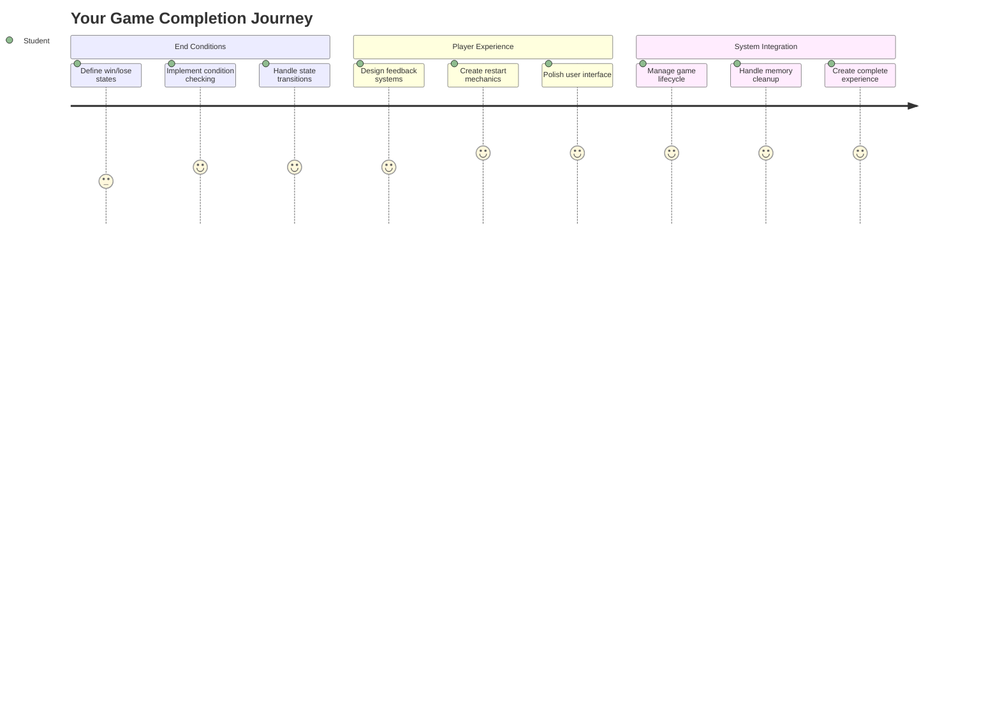
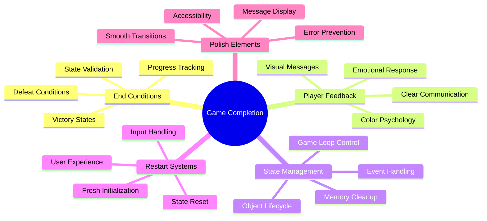
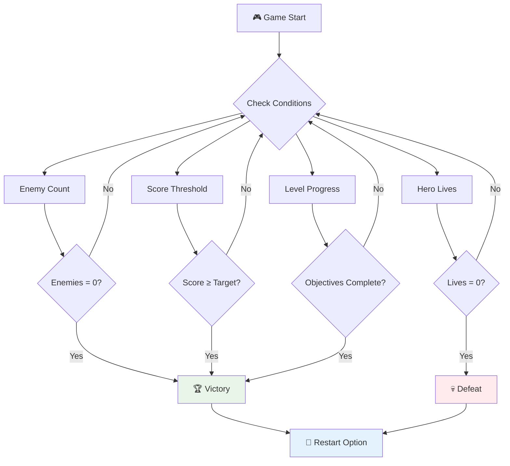
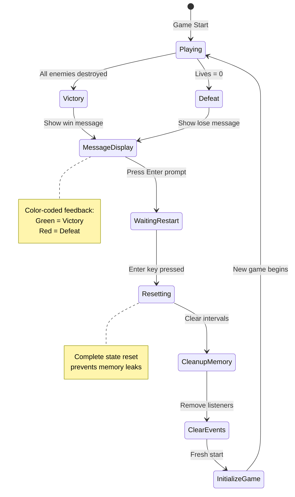
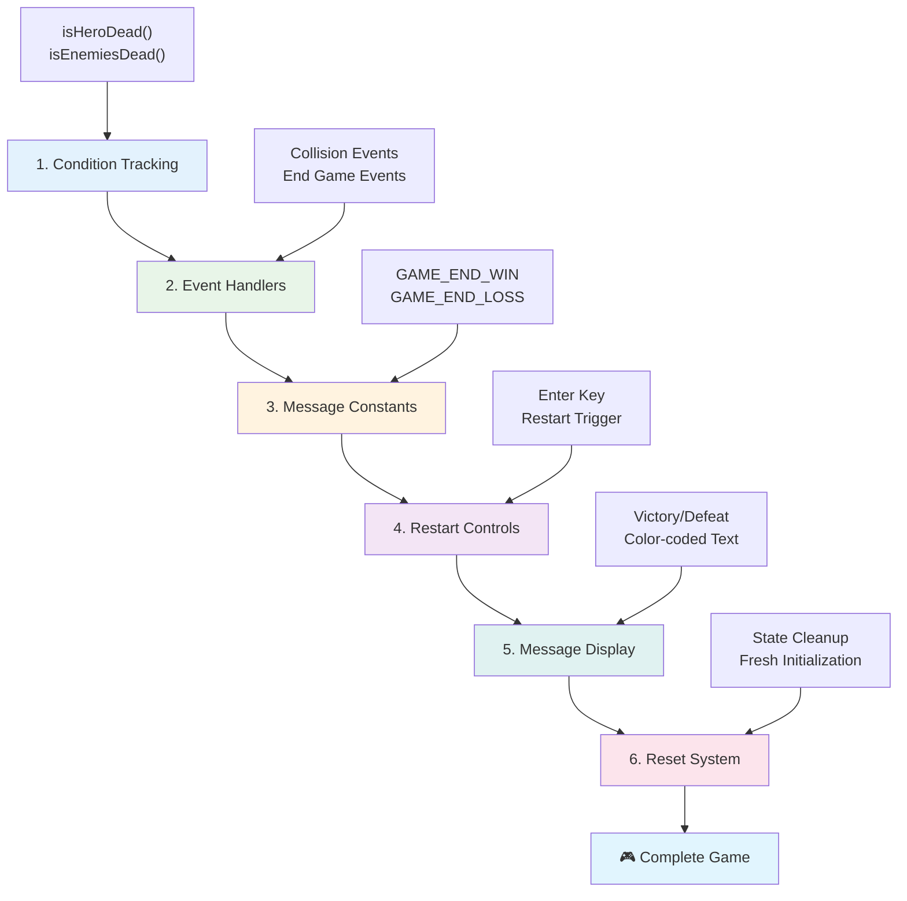
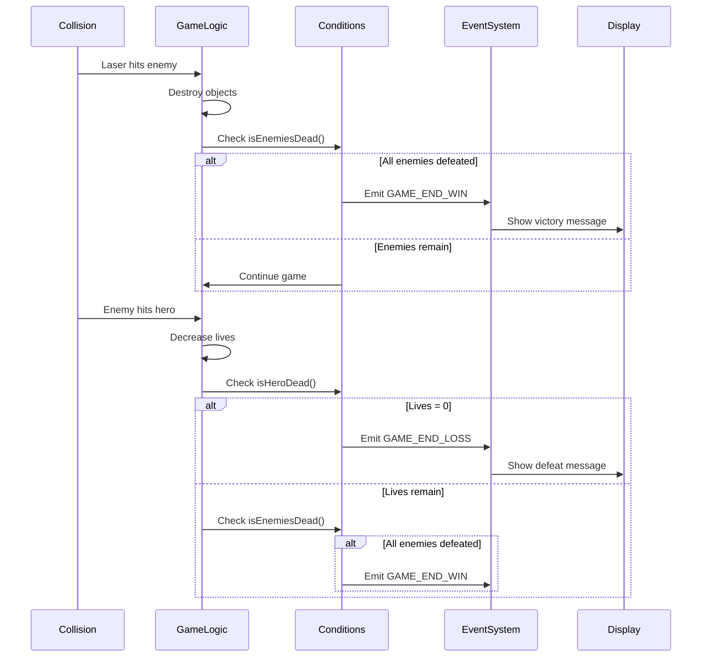
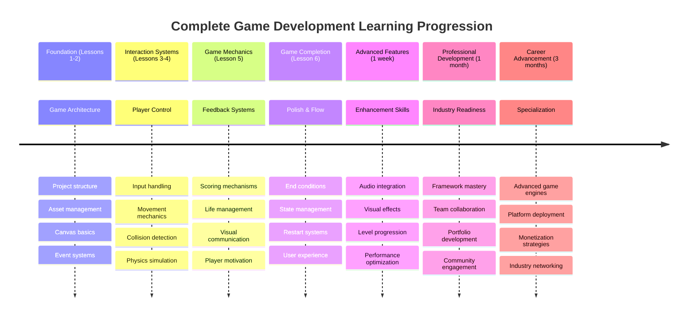

# Uzay Oyunu Yapımı Bölüm 6: Son ve Yeniden Başlatma



Her harika oyunun net bir bitiş koşuluna ve sorunsuz bir yeniden başlatma mekanizmasına ihtiyacı vardır. Hareket, savaş ve puanlama özelliklerine sahip etkileyici bir uzay oyunu geliştirdiniz - şimdi oyunu tamamlanmış hissettirecek son parçaları ekleme zamanı.

Oyununuz şu anda NASA'nın 1977'de fırlattığı ve onlarca yıl sonra hala uzayda seyahat eden Voyager sondaları gibi sonsuza kadar çalışıyor. Bu, uzay keşfi için uygun olsa da, oyunların tatmin edici deneyimler yaratmak için tanımlanmış bitiş noktalarına ihtiyacı vardır.

Bugün, doğru kazanma/kaybetme koşullarını ve bir yeniden başlatma sistemini uygulayacağız. Bu dersin sonunda, oyuncuların tamamlayabileceği ve tekrar oynayabileceği, klasik arcade oyunlarını andıran cilalı bir oyuna sahip olacaksınız.



## Ön Ders Testi

[Ön ders testi](https://ff-quizzes.netlify.app/web/quiz/39)

## Oyun Bitiş Koşullarını Anlamak

Oyun ne zaman bitmeli? Bu temel soru, erken dönem arcade çağından bu yana oyun tasarımını şekillendirmiştir. Pac-Man, hayaletler tarafından yakalandığınızda veya tüm noktaları temizlediğinizde sona ererken, Space Invaders, uzaylılar dibe ulaştığında veya hepsini yok ettiğinizde sona erer.

Bir oyun yaratıcısı olarak, zafer ve yenilgi koşullarını siz belirlersiniz. Uzay oyunumuz için, ilgi çekici bir oyun deneyimi yaratan kanıtlanmış yaklaşımlar şunlardır:



- **`N` Düşman gemisi yok edildi**: Oyunu farklı seviyelere böldüğünüzde, bir seviyeyi tamamlamak için `N` düşman gemisini yok etmeniz gerekmesi oldukça yaygındır.
- **Geminiz yok edildi**: Geminiz yok edilirse oyunu kaybettiğiniz oyunlar kesinlikle vardır. Bir diğer yaygın yaklaşım ise can kavramına sahip olmaktır. Geminiz her yok edildiğinde bir can kaybedersiniz. Tüm canlar tükendiğinde ise oyunu kaybedersiniz.
- **`N` puan topladınız**: Bir diğer yaygın bitiş koşulu, belirli bir puan toplamanızdır. Puanları nasıl kazanacağınız size bağlıdır, ancak genellikle bir düşman gemisini yok etmek veya yok edildiğinde düşen eşyaları toplamak gibi çeşitli etkinliklere puan atanır.
- **Bir seviyeyi tamamladınız**: Bu, `X` düşman gemisinin yok edilmesi, `Y` puanın toplanması veya belirli bir eşyanın toplanması gibi birkaç koşulu içerebilir.

## Oyun Yeniden Başlatma İşlevselliğini Uygulama

İyi oyunlar, sorunsuz yeniden başlatma mekanizmalarıyla tekrar oynanabilirliği teşvik eder. Oyuncular bir oyunu tamamladıklarında (veya yenilgiyle karşılaştıklarında), genellikle hemen tekrar denemek isterler - ister puanlarını geçmek, ister performanslarını geliştirmek için.



Tetris bunu mükemmel bir şekilde örnekler: Bloklarınız en üste ulaştığında, karmaşık menülerde gezinmeden hemen yeni bir oyun başlatabilirsiniz. Oyunun durumunu temiz bir şekilde sıfırlayan ve oyuncuları hızla tekrar aksiyona döndüren benzer bir yeniden başlatma sistemi oluşturacağız.

✅ **Düşünce**: Oynadığınız oyunları düşünün. Hangi koşullarda sona eriyorlar ve nasıl yeniden başlatılmaya yönlendiriliyorsunuz? Bir yeniden başlatma deneyimini sorunsuz veya sinir bozucu yapan nedir?

## Ne İnşa Edeceksiniz?

Projenizi tam bir oyun deneyimine dönüştürecek son özellikleri uygulayacaksınız. Bu unsurlar, cilalı oyunları temel prototiplerden ayırır.

**Bugün ekleyeceğimiz şeyler:**

1. **Zafer koşulu**: Tüm düşmanları yok edin ve hak ettiğiniz bir kutlama kazanın!
2. **Yenilgi koşulu**: Canlarınız biterse bir yenilgi ekranıyla yüzleşin
3. **Yeniden başlatma mekanizması**: Tekrar oynamak için Enter tuşuna basın - çünkü bir oyun asla yetmez
4. **Durum yönetimi**: Her seferinde temiz bir başlangıç - önceki oyundan kalan düşmanlar veya garip hatalar yok

## Başlarken

Geliştirme ortamınızı hazırlayalım. Önceki derslerden tüm uzay oyunu dosyalarınızın hazır olduğundan emin olun.

**Projeniz şu şekilde görünmelidir:**

```bash
-| assets
  -| enemyShip.png
  -| player.png
  -| laserRed.png
  -| life.png
-| index.html
-| app.js
-| package.json
```

**Geliştirme sunucunuzu başlatın:**

```bash
cd your-work
npm start
```

**Bu komut:**
- `http://localhost:5000` adresinde yerel bir sunucu çalıştırır
- Dosyalarınızı düzgün bir şekilde sunar
- Değişiklik yaptığınızda otomatik olarak yeniler

Tarayıcınızda `http://localhost:5000` adresini açın ve oyununuzun çalıştığını doğrulayın. Hareket edebilmeli, ateş edebilmeli ve düşmanlarla etkileşime girebilmelisiniz. Onayladıktan sonra uygulamaya geçebiliriz.

> 💡 **Profesyonel İpucu**: Visual Studio Code'da uyarılardan kaçınmak için, `gameLoopId`'yi dosyanızın en üstünde `let gameLoopId;` olarak tanımlayın, `window.onload` fonksiyonunun içinde tanımlamak yerine. Bu, modern JavaScript değişken tanımlama en iyi uygulamalarını takip eder.



## Uygulama Adımları

### Adım 1: Bitiş Koşullarını İzleyen Fonksiyonlar Oluşturun

Oyunun ne zaman sona ermesi gerektiğini izlemek için fonksiyonlara ihtiyacımız var. Uluslararası Uzay İstasyonu'ndaki kritik sistemleri sürekli izleyen sensörler gibi, bu fonksiyonlar da oyun durumunu sürekli kontrol edecek.

```javascript
function isHeroDead() {
  return hero.life <= 0;
}

function isEnemiesDead() {
  const enemies = gameObjects.filter((go) => go.type === "Enemy" && !go.dead);
  return enemies.length === 0;
}
```

**Kaputun altında neler oluyor:**
- **Kontrol eder**: Kahramanımızın canı bitmiş mi (vah vah!)
- **Sayar**: Kaç düşman hala hayatta ve savaşıyor
- **Döner**: Savaş alanı düşmanlardan temizlendiğinde `true` döner
- **Kullanır**: Basit doğru/yanlış mantığı, işleri kolaylaştırır
- **Filtreler**: Tüm oyun nesnelerini tarar ve hayatta kalanları bulur

### Adım 2: Bitiş Koşulları için Olay İşleyicileri Güncelleyin

Şimdi bu koşul kontrollerini oyunun olay sistemine bağlayacağız. Her çarpışma gerçekleştiğinde, oyun bunun bir bitiş koşulunu tetikleyip tetiklemediğini değerlendirecek. Bu, kritik oyun olayları için anında geri bildirim oluşturur.



```javascript
eventEmitter.on(Messages.COLLISION_ENEMY_LASER, (_, { first, second }) => {
    first.dead = true;
    second.dead = true;
    hero.incrementPoints();

    if (isEnemiesDead()) {
      eventEmitter.emit(Messages.GAME_END_WIN);
    }
});

eventEmitter.on(Messages.COLLISION_ENEMY_HERO, (_, { enemy }) => {
    enemy.dead = true;
    hero.decrementLife();
    if (isHeroDead())  {
      eventEmitter.emit(Messages.GAME_END_LOSS);
      return; // loss before victory
    }
    if (isEnemiesDead()) {
      eventEmitter.emit(Messages.GAME_END_WIN);
    }
});

eventEmitter.on(Messages.GAME_END_WIN, () => {
    endGame(true);
});
  
eventEmitter.on(Messages.GAME_END_LOSS, () => {
  endGame(false);
});
```

**Burada neler oluyor:**
- **Lazer düşmana çarpar**: İkisi de kaybolur, puan kazanırsınız ve kazanıp kazanmadığınızı kontrol ederiz
- **Düşman size çarpar**: Bir can kaybedersiniz ve hala hayatta olup olmadığınızı kontrol ederiz
- **Akıllı sıralama**: Önce yenilgiyi kontrol ederiz (kimse aynı anda kazanıp kaybetmek istemez!)
- **Anında tepkiler**: Önemli bir şey olur olmaz, oyun bunu hemen bilir

### Adım 3: Yeni Mesaj Sabitleri Ekleyin

`Messages` sabit nesnenize yeni mesaj türleri eklemeniz gerekecek. Bu sabitler, tutarlılığı korumaya ve olay sisteminizdeki yazım hatalarını önlemeye yardımcı olur.

```javascript
GAME_END_LOSS: "GAME_END_LOSS",
GAME_END_WIN: "GAME_END_WIN",
```

**Yukarıda şunları yaptık:**
- **Oyun bitiş olayları için** sabitler ekledik, tutarlılığı korumak için
- **Açıklayıcı isimler** kullandık, olayın amacını açıkça belirtmek için
- **Mevcut adlandırma düzenini** mesaj türleri için takip ettik

### Adım 4: Yeniden Başlatma Kontrollerini Uygulayın

Şimdi, oyuncuların oyunu yeniden başlatmasına olanak tanıyan klavye kontrolleri ekleyeceksiniz. Enter tuşu, genellikle eylemleri onaylamak ve yeni oyunlar başlatmakla ilişkilendirildiği için doğal bir seçimdir.

**Mevcut keydown olay dinleyicinize Enter tuşu algılamayı ekleyin:**

```javascript
else if(evt.key === "Enter") {
   eventEmitter.emit(Messages.KEY_EVENT_ENTER);
}
```

**Yeni mesaj sabitini ekleyin:**

```javascript
KEY_EVENT_ENTER: "KEY_EVENT_ENTER",
```

**Bilmeniz gerekenler:**
- **Mevcut klavye olay işleme sisteminizi genişletir**
- **Enter tuşunu**, sezgisel bir kullanıcı deneyimi için yeniden başlatma tetikleyicisi olarak kullanır
- **Özel bir olay yayar**, böylece oyunun diğer bölümleri bunu dinleyebilir
- **Diğer klavye kontrollerinizle aynı deseni korur**

### Adım 5: Mesaj Gösterim Sistemi Oluşturun

Oyununuzun sonuçları oyunculara net bir şekilde iletmesi gerekir. Zafer ve yenilgi durumlarını, erken bilgisayar sistemlerinin terminal arayüzlerine benzer şekilde, başarıyı yeşil ve hataları kırmızı ile işaretleyen renk kodlu metinler kullanarak gösterecek bir mesaj sistemi oluşturacağız.

**`displayMessage()` fonksiyonunu oluşturun:**

```javascript
function displayMessage(message, color = "red") {
  ctx.font = "30px Arial";
  ctx.fillStyle = color;
  ctx.textAlign = "center";
  ctx.fillText(message, canvas.width / 2, canvas.height / 2);
}
```

**Adım adım, burada olanlar:**
- **Yazı tipi boyutunu ve ailesini** açık ve okunabilir metin için ayarlar
- **Bir renk parametresi uygular**, uyarılar için varsayılan olarak "kırmızı"
- **Metni** tuval üzerinde yatay ve dikey olarak ortalar
- **Esnek renk seçenekleri için** modern JavaScript varsayılan parametrelerini kullanır
- **Tuval 2D bağlamını** doğrudan metin işleme için kullanır

**`endGame()` fonksiyonunu oluşturun:**

```javascript
function endGame(win) {
  clearInterval(gameLoopId);

  // Set a delay to ensure any pending renders complete
  setTimeout(() => {
    ctx.clearRect(0, 0, canvas.width, canvas.height);
    ctx.fillStyle = "black";
    ctx.fillRect(0, 0, canvas.width, canvas.height);
    if (win) {
      displayMessage(
        "Victory!!! Pew Pew... - Press [Enter] to start a new game Captain Pew Pew",
        "green"
      );
    } else {
      displayMessage(
        "You died !!! Press [Enter] to start a new game Captain Pew Pew"
      );
    }
  }, 200)  
}
```

**Bu fonksiyonun yaptığı şeyler:**
- **Her şeyi dondurur** - artık hareket eden gemiler veya lazerler yok
- **Küçük bir duraklama yapar** (200ms), son çerçevenin çizilmesini sağlar
- **Ekranı tamamen temizler** ve dramatik bir etki için siyaha boyar
- **Kazananlar ve kaybedenler için** farklı mesajlar gösterir
- **Haberleri renk kodlarıyla iletir** - iyi haberler için yeşil, kötü haberler için kırmızı
- **Oyunculara** tekrar nasıl başlayacaklarını açıkça söyler

### 🔄 **Pedagojik Kontrol Noktası**
**Oyun Durumu Yönetimi**: Sıfırlama işlevselliğini uygulamadan önce, şunları anladığınızdan emin olun:
- ✅ Bitiş koşulları, net oyun hedeflerini nasıl oluşturur?
- ✅ Görsel geri bildirimin oyuncu anlayışı için neden önemli olduğu
- ✅ Bellek sızıntılarını önlemede doğru temizliğin önemi
- ✅ Olay odaklı mimarinin temiz durum geçişlerini nasıl sağladığı

**Hızlı Kendini Test Et**: Sıfırlama sırasında olay dinleyicilerini temizlemezseniz ne olur?
*Cevap: Bellek sızıntıları ve öngörülemeyen davranışlara neden olan yinelenen olay işleyiciler*

**Oyun Tasarımı İlkeleri**: Şimdi şunları uyguluyorsunuz:
- **Net Hedefler**: Oyuncular başarı ve başarısızlığı neyin tanımladığını tam olarak bilir
- **Anında Geri Bildirim**: Oyun durumu değişiklikleri anında iletilir
- **Kullanıcı Kontrolü**: Oyuncular hazır olduklarında yeniden başlayabilir
- **Sistem Güvenilirliği**: Doğru temizlik, hataları ve performans sorunlarını önler

### Adım 6: Oyun Sıfırlama İşlevselliğini Uygulama

Sıfırlama sistemi, mevcut oyun durumunu tamamen temizlemeli ve yeni bir oyun oturumu başlatmalıdır. Bu, oyuncuların önceki oyundan kalan veriler olmadan temiz bir başlangıç yapmasını sağlar.

**`resetGame()` fonksiyonunu oluşturun:**

```javascript
function resetGame() {
  if (gameLoopId) {
    clearInterval(gameLoopId);
    eventEmitter.clear();
    initGame();
    gameLoopId = setInterval(() => {
      ctx.clearRect(0, 0, canvas.width, canvas.height);
      ctx.fillStyle = "black";
      ctx.fillRect(0, 0, canvas.width, canvas.height);
      drawPoints();
      drawLife();
      updateGameObjects();
      drawGameObjects(ctx);
    }, 100);
  }
}
```

**Her bir kısmı anlayalım:**
- **Kontrol eder**: Şu anda bir oyun döngüsü çalışıyor mu, çalışıyorsa sıfırlamadan önce durdurur
- **Mevcut oyun döngüsünü temizler**, tüm mevcut oyun etkinliklerini durdurur
- **Tüm olay dinleyicilerini kaldırır**, bellek sızıntılarını önler
- **Oyun durumunu yeniden başlatır**, yeni nesneler ve değişkenlerle
- **Tüm temel oyun işlevleriyle** yeni bir oyun döngüsü başlatır
- **Tutarlılığı korur**: 100ms'lik aynı aralıkla oyun performansını sabit tutar

**`initGame()` fonksiyonunuza Enter tuşu olay işleyicisini ekleyin:**

```javascript
eventEmitter.on(Messages.KEY_EVENT_ENTER, () => {
  resetGame();
});
```

**EventEmitter sınıfınıza `clear()` metodunu ekleyin:**

```javascript
clear() {
  this.listeners = {};
}
```

**Hatırlanması gereken önemli noktalar:**
- **Enter tuşu basışını**, oyunu sıfırlama işlevselliğiyle bağlar
- **Bu olay dinleyicisini**, oyun başlatma sırasında kaydeder
- **Oyunlar arasında** olay işleyicilerini temizlemek için temiz bir yol sağlar
- **Bellek sızıntılarını önler**, oyunlar arasında olay işleyicilerini temizleyerek
- **Dinleyiciler nesnesini** yeni bir başlatma için boş bir duruma sıfırlar

## Tebrikler! 🎉

👽 💥 🚀 Baştan sona eksiksiz bir oyun oluşturmayı başardınız. 1970'lerde ilk video oyunlarını yaratan programcılar gibi, kod satırlarını doğru oyun mekaniği ve kullanıcı geri bildirimi ile etkileşimli bir deneyime dönüştürdünüz. 🚀 💥 👽

**Başardıklarınız:**
- **Tamamlanmış** kazanma ve kaybetme koşullarını kullanıcı geri bildirimiyle uyguladınız
- **Sorunsuz bir yeniden başlatma sistemi** oluşturdunuz
- **Oyun durumları için** net görsel iletişim tasarladınız
- **Karmaşık oyun durumu geçişlerini ve temizliğini** yönettiniz
- **Tüm bileşenleri** uyumlu, oynanabilir bir oyun haline getirdiniz

### 🔄 **Pedagojik Kontrol Noktası**
**Tam Oyun Geliştirme Sistemi**: Tam oyun geliştirme döngüsündeki ustalığınızı kutlayın:
- ✅ Bitiş koşulları, tatmin edici oyuncu deneyimlerini nasıl oluşturur?
- ✅ Doğru durum yönetimi, oyun kararlılığı için neden kritiktir?
- ✅ Görsel geri bildirim, oyuncu anlayışını nasıl artırır?
- ✅ Yeniden başlatma sistemi, oyuncu bağlılığında nasıl bir rol oynar?

**Sistem Ustalığı**: Tamamlanmış oyununuz şunları gösterir:
- **Tam Yığın Oyun Geliştirme**: Grafiklerden girişe, durum yönetimine kadar
- **Profesyonel Mimari**: Doğru temizlikle olay odaklı sistemler
- **Kullanıcı Deneyimi Tasarımı**: Net geri bildirim ve sezgisel kontroller
- **Performans Optimizasyonu**: Verimli işleme ve bellek yönetimi
- **Cilalı ve Tamamlanmışlık**: Bir oyunu bitmiş hissettiren tüm detaylar

**Sektöre Hazır Beceriler**: Şunları uyguladınız:
- **Oyun Döngüsü Mimarisi**: Tutarlı performansla gerçek zamanlı sistemler
- **Olay Odaklı Programlama**: Etkili bir şekilde ölçeklenebilen ayrık sistemler
- **Durum Yönetimi**: Karmaşık veri işleme ve yaşam döngüsü yönetimi
- **Kullanıcı Arayüzü Tasarımı**: Net iletişim ve duyarlı kontroller
- **Test ve Hata Ayıklama**: Yinelemeli geliştirme ve problem çözme

### ⚡ **Sonraki 5 Dakikada Yapabilecekleriniz**
- [ ] Tamamlanmış oyununuzu oynayın ve tüm zafer ve yenilgi koşullarını test edin
- [ ] Farklı bitiş koşulu parametreleriyle deney yapın
- [ ] Oyun durumu değişikliklerini izlemek için console.log ifadeleri eklemeyi deneyin
- [ ] Oyununuzu arkadaşlarınızla paylaşın ve geri bildirim toplayın

### 🎯 **Bu Saatte Başarabilecekleriniz**
- [ ] Ders sonrası testi tamamlayın ve oyun geliştirme yolculuğunuzu değerlendirin
- [ ] Zafer ve yenilgi durumları için ses efektleri ekleyin
- [ ] Zaman sınırları veya bonus hedefler gibi ek bitiş koşulları uygulayın
- [ ] Farklı düşman sayılarıyla değişen zorluk seviyeleri oluşturun
- [ ] Daha iyi yazı tipleri ve renklerle görsel sunumu cilalayın

### 📅 **Haftalık Oyun Geliştirme Ustalığınız**
- [ ] Birden fazla seviyeye ve ilerlemeye sahip gelişmiş uzay oyununu tamamlayın

### 🌟 **Bir Aylık Oyun Geliştirme Kariyeriniz**
- [ ] Farklı türler ve mekanikleri keşfederek birden fazla tamamlanmış oyun oluşturun
- [ ] Phaser veya Three.js gibi ileri düzey oyun geliştirme çerçevelerini öğrenin
- [ ] Açık kaynaklı oyun geliştirme projelerine katkıda bulunun
- [ ] Oyun tasarımı prensiplerini ve oyuncu psikolojisini inceleyin
- [ ] Oyun geliştirme becerilerinizi sergileyen bir portföy oluşturun
- [ ] Oyun geliştirme topluluğuyla bağlantı kurun ve öğrenmeye devam edin

## 🎯 Tam Oyun Geliştirme Uzmanlığı Zaman Çizelgeniz



### 🛠️ Tam Oyun Geliştirme Araç Seti Özeti

Bu uzay oyunu serisini tamamladıktan sonra şu konularda ustalaştınız:
- **Oyun Mimarisi**: Olay odaklı sistemler, oyun döngüleri ve durum yönetimi
- **Grafik Programlama**: Canvas API, sprite renderleme ve görsel efektler
- **Girdi Sistemleri**: Klavye kontrolü, çarpışma algılama ve duyarlı kontroller
- **Oyun Tasarımı**: Oyuncu geri bildirimi, ilerleme sistemleri ve etkileşim mekanikleri
- **Performans Optimizasyonu**: Verimli renderleme, bellek yönetimi ve kare hızı kontrolü
- **Kullanıcı Deneyimi**: Net iletişim, sezgisel kontroller ve detaylı cilalama
- **Profesyonel Kalıplar**: Temiz kod, hata ayıklama teknikleri ve proje organizasyonu

**Gerçek Dünya Uygulamaları**: Oyun geliştirme becerileriniz doğrudan şu alanlarda uygulanabilir:
- **Etkileşimli Web Uygulamaları**: Dinamik arayüzler ve gerçek zamanlı sistemler
- **Veri Görselleştirme**: Animasyonlu grafikler ve etkileşimli görseller
- **Eğitim Teknolojisi**: Oyunlaştırma ve ilgi çekici öğrenme deneyimleri
- **Mobil Geliştirme**: Dokunmatik etkileşimler ve performans optimizasyonu
- **Simülasyon Yazılımı**: Fizik motorları ve gerçek zamanlı modelleme
- **Yaratıcı Endüstriler**: Etkileşimli sanat, eğlence ve dijital deneyimler

**Kazanılan Profesyonel Beceriler**: Artık şunları yapabilirsiniz:
- **Mimari** karmaşık etkileşimli sistemleri sıfırdan oluşturmak
- **Hata Ayıklama** gerçek zamanlı uygulamaları sistematik yaklaşımlarla çözmek
- **Optimizasyon** performansı kullanıcı deneyimini iyileştirmek için geliştirmek
- **Tasarım** ilgi çekici kullanıcı arayüzleri ve etkileşim desenleri oluşturmak
- **İşbirliği** teknik projelerde etkili bir şekilde çalışmak ve kod organizasyonunu sağlamak

**Oyun Geliştirme Konseptlerinde Ustalık**:
- **Gerçek Zamanlı Sistemler**: Oyun döngüleri, kare hızı yönetimi ve performans
- **Olay Odaklı Mimari**: Ayrıştırılmış sistemler ve mesaj iletimi
- **Durum Yönetimi**: Karmaşık veri işleme ve yaşam döngüsü yönetimi
- **Kullanıcı Arayüzü Programlama**: Canvas grafikleri ve duyarlı tasarım
- **Oyun Tasarımı Teorisi**: Oyuncu psikolojisi ve etkileşim mekanikleri

**Bir Sonraki Seviye**: İleri düzey oyun çerçevelerini, 3D grafikleri, çok oyunculu sistemleri keşfetmeye veya profesyonel oyun geliştirme rollerine geçmeye hazırsınız!

🌟 **Başarı Kilidi Açıldı**: Tam bir oyun geliştirme yolculuğunu tamamladınız ve sıfırdan profesyonel kalitede bir etkileşimli deneyim oluşturdunuz!

**Oyun geliştirme topluluğuna hoş geldiniz!** 🎮✨

## GitHub Copilot Agent Challenge 🚀

Agent modunu kullanarak aşağıdaki meydan okumayı tamamlayın:

**Açıklama:** Uzay oyununu, artan zorluk ve bonus özelliklerle bir seviye ilerleme sistemi ekleyerek geliştirin.

**İstek:** Her seviyede daha fazla düşman gemisi, artan hız ve sağlık ile bir çok seviyeli uzay oyunu sistemi oluşturun. Her seviyede artan bir puan çarpanı ekleyin ve düşmanlar yok edildiğinde rastgele ortaya çıkan güçlendirmeler (hızlı ateş veya kalkan gibi) ekleyin. Seviye tamamlama bonusu ekleyin ve mevcut skor ve canların yanında ekranda mevcut seviyeyi gösterin.

Agent modunu öğrenmek için [buraya](https://code.visualstudio.com/blogs/2025/02/24/introducing-copilot-agent-mode) göz atın.

## 🚀 İsteğe Bağlı Geliştirme Meydan Okuması

**Oyununuza Ses Ekleyin**: Oyun deneyiminizi ses efektleri ekleyerek geliştirin! Şunlar için ses eklemeyi düşünün:

- **Lazer atışları** oyuncu ateş ettiğinde
- **Düşman yok edilmesi** gemiler vurulduğunda
- **Kahraman hasarı** oyuncu darbe aldığında
- **Zafer müziği** oyun kazanıldığında
- **Yenilgi sesi** oyun kaybedildiğinde

**Ses uygulama örneği:**

```javascript
// Create audio objects
const laserSound = new Audio('assets/laser.wav');
const explosionSound = new Audio('assets/explosion.wav');

// Play sounds during game events
function playLaserSound() {
  laserSound.currentTime = 0; // Reset to beginning
  laserSound.play();
}
```

**Bilmeniz Gerekenler:**
- **Oluşturur** farklı ses efektleri için ses nesneleri
- **Sıfırlar** `currentTime` hızlı ateş ses efektlerine izin vermek için
- **Yönetir** tarayıcı otomatik oynatma politikalarını kullanıcı etkileşimlerinden sesleri tetikleyerek
- **Kontrol eder** ses seviyesi ve zamanlamayı daha iyi bir oyun deneyimi için

> 💡 **Öğrenme Kaynağı**: JavaScript oyunlarında ses uygulamayı öğrenmek için bu [ses kum havuzunu](https://www.w3schools.com/jsref/tryit.asp?filename=tryjsref_audio_play) keşfedin.

## Ders Sonrası Quiz

[Ders sonrası quiz](https://ff-quizzes.netlify.app/web/quiz/40)

## Gözden Geçirme ve Kendi Kendine Çalışma

Göreviniz yeni bir örnek oyun oluşturmak, bu yüzden dışarıdaki ilginç oyunları keşfederek ne tür bir oyun yapabileceğinizi görün.

## Ödev

[Bir Örnek Oyun Yapın](assignment.md)

---

**Feragatname**:  
Bu belge, AI çeviri hizmeti [Co-op Translator](https://github.com/Azure/co-op-translator) kullanılarak çevrilmiştir. Doğruluk için çaba göstersek de, otomatik çeviriler hata veya yanlışlıklar içerebilir. Belgenin orijinal dili, yetkili kaynak olarak kabul edilmelidir. Kritik bilgiler için profesyonel insan çevirisi önerilir. Bu çevirinin kullanımından kaynaklanan yanlış anlamalar veya yanlış yorumlamalardan sorumlu değiliz.