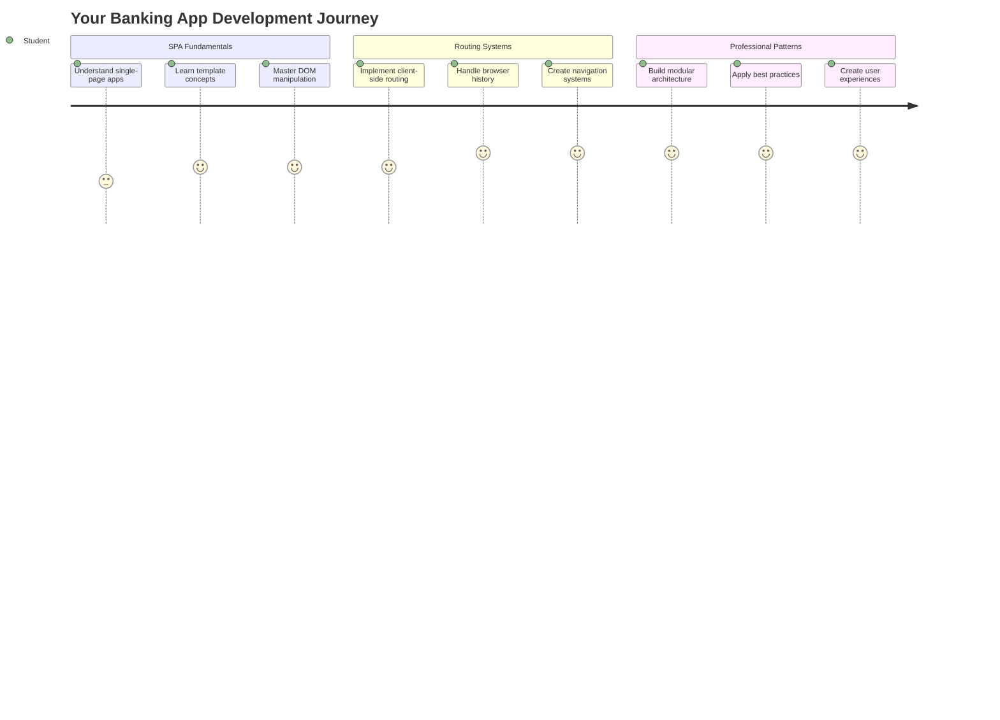
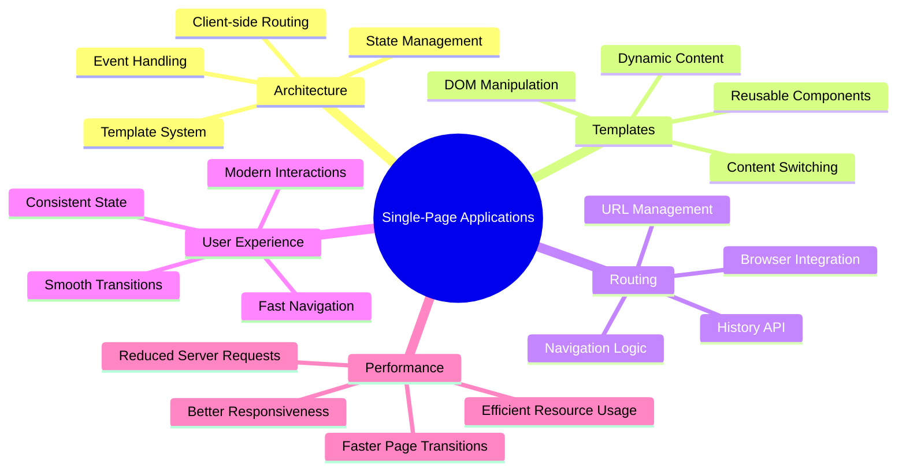
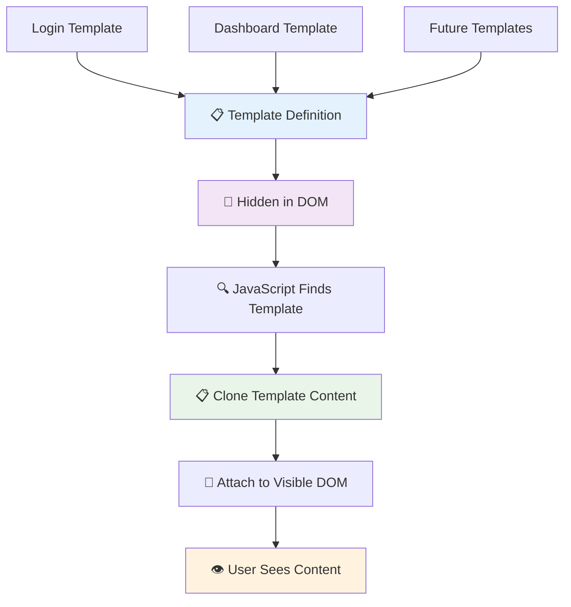
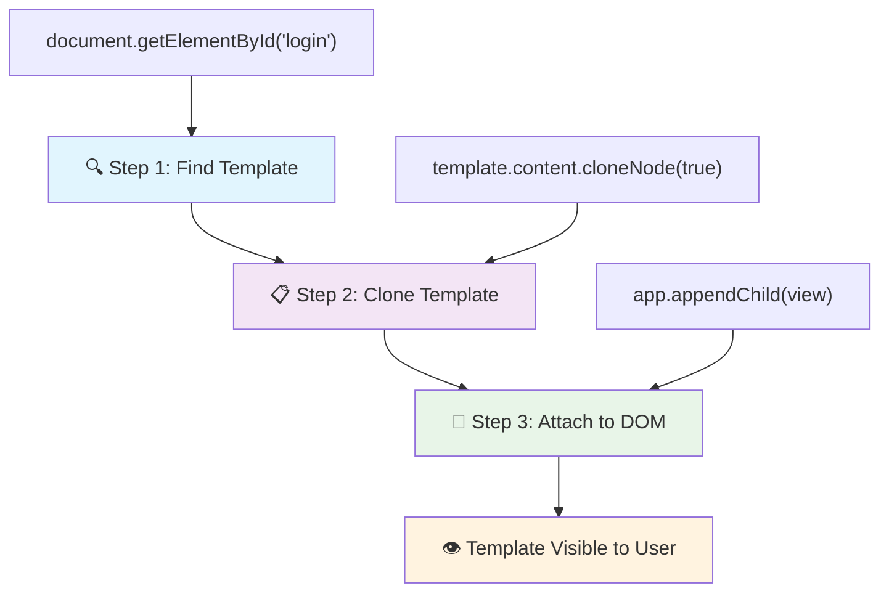
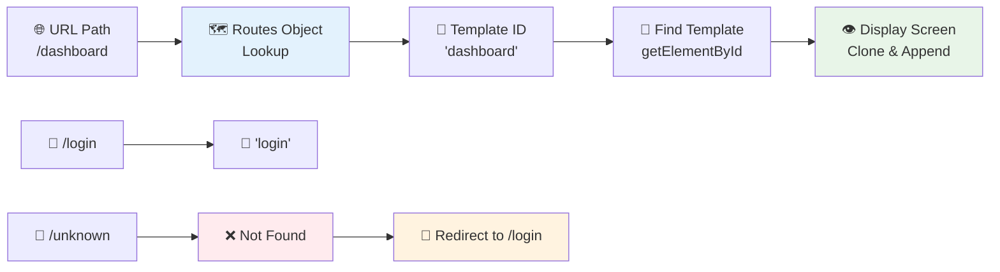
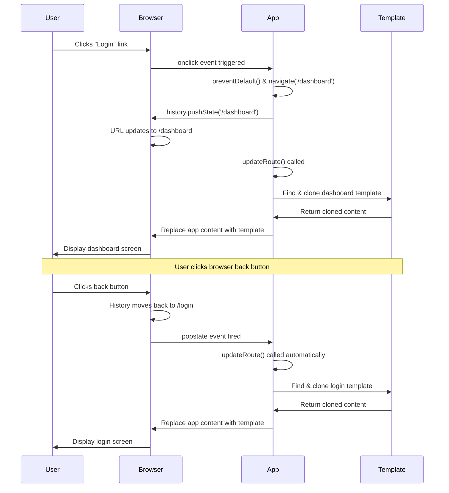
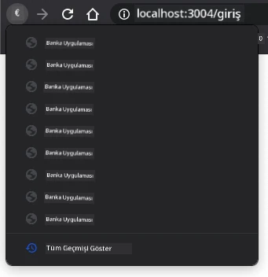
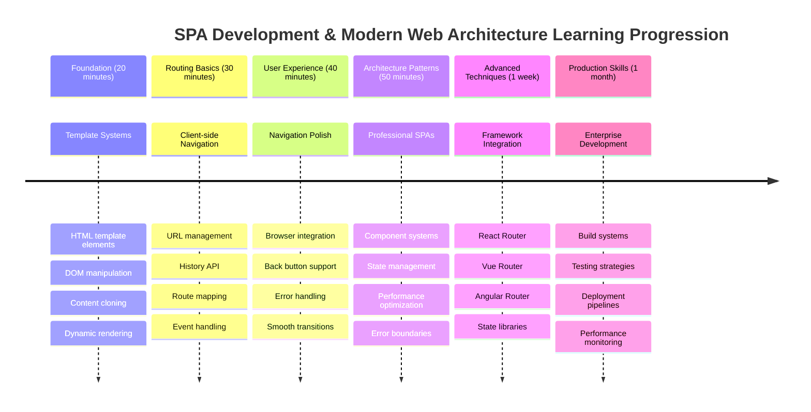

# Bankacılık Uygulaması Yapımı Bölüm 1: Web Uygulamasında HTML Şablonları ve Yönlendirmeler



Apollo 11'in rehberlik bilgisayarı 1969'da Ay'a giderken, tüm sistemi yeniden başlatmadan farklı programlar arasında geçiş yapması gerekiyordu. Modern web uygulamaları da benzer şekilde çalışır – gördüğünüz şeyleri sıfırdan yeniden yüklemeden değiştirir. Bu, kullanıcıların bugün beklediği akıcı ve duyarlı deneyimi yaratır.

Her etkileşim için tüm sayfaları yeniden yükleyen geleneksel web sitelerinin aksine, modern web uygulamaları yalnızca değiştirilmesi gereken bölümleri günceller. Bu yaklaşım, tıpkı görev kontrolünün farklı ekranlar arasında geçiş yaparken sürekli iletişimi sürdürmesi gibi, beklediğimiz akıcı deneyimi yaratır.

İşte bu farkı bu kadar dramatik yapan şey:

| Geleneksel Çok Sayfalı Uygulamalar | Modern Tek Sayfalı Uygulamalar |
|-----------------------------------|-------------------------------|
| **Gezinme** | Her ekran için tam sayfa yenileme | Anında içerik geçişi |
| **Performans** | Tam HTML indirmeleri nedeniyle daha yavaş | Kısmi güncellemelerle daha hızlı |
| **Kullanıcı Deneyimi** | Kesintili sayfa geçişleri | Akıcı, uygulama benzeri geçişler |
| **Veri Paylaşımı** | Sayfalar arasında zor | Kolay durum yönetimi |
| **Geliştirme** | Bakımı gereken birden fazla HTML dosyası | Dinamik şablonlarla tek bir HTML |

**Evrimi Anlamak:**
- **Geleneksel uygulamalar** her gezinme işlemi için sunucu isteği gerektirir
- **Modern SPA'lar** bir kez yüklenir ve içeriği JavaScript kullanarak dinamik olarak günceller
- **Kullanıcı beklentileri** artık anında, kesintisiz etkileşimleri tercih ediyor
- **Performans avantajları** arasında azaltılmış bant genişliği ve daha hızlı yanıtlar bulunur

Bu derste, birden fazla ekranı sorunsuz bir şekilde bir araya getiren bir bankacılık uygulaması oluşturacağız. Bilim insanlarının farklı deneyler için yeniden yapılandırılabilen modüler araçlar kullandığı gibi, biz de gerektiğinde görüntülenebilecek yeniden kullanılabilir bileşenler olarak HTML şablonlarını kullanacağız.

HTML şablonları (farklı ekranlar için yeniden kullanılabilir taslaklar), JavaScript yönlendirme (ekranlar arasında geçiş yapan sistem) ve tarayıcının geçmiş API'si (geri düğmesinin beklendiği gibi çalışmasını sağlar) ile çalışacaksınız. Bunlar, React, Vue ve Angular gibi çerçeveler tarafından kullanılan temel tekniklerdir.

Sonunda, profesyonel tek sayfalı uygulama prensiplerini gösteren çalışan bir bankacılık uygulamanız olacak.



## Ders Öncesi Test

[Ders öncesi test](https://ff-quizzes.netlify.app/web/quiz/41)

### İhtiyacınız Olanlar

Bankacılık uygulamamızı test etmek için yerel bir web sunucusuna ihtiyacımız olacak – endişelenmeyin, kulağa geldiği kadar zor değil! Eğer zaten bir sunucunuz yoksa, [Node.js](https://nodejs.org) yükleyin ve proje klasörünüzden `npx lite-server` komutunu çalıştırın. Bu kullanışlı komut, bir yerel sunucu başlatır ve uygulamanızı otomatik olarak tarayıcıda açar.

### Hazırlık

Bilgisayarınızda `bank` adında bir klasör oluşturun ve içine `index.html` adında bir dosya ekleyin. Bu HTML [şablon kodu](https://en.wikipedia.org/wiki/Boilerplate_code) ile başlayacağız:

```html
<!DOCTYPE html>
<html lang="en">
  <head>
    <meta charset="UTF-8">
    <meta name="viewport" content="width=device-width, initial-scale=1.0">
    <title>Bank App</title>
  </head>
  <body>
    <!-- This is where you'll work -->
  </body>
</html>
```

**Bu şablon kodu şunları sağlar:**
- **HTML5** belge yapısını uygun DOCTYPE bildirimi ile oluşturur
- **Karakter kodlamasını** uluslararası metin desteği için UTF-8 olarak ayarlar
- **Duyarlı tasarımı** mobil uyumluluk için viewport meta etiketi ile etkinleştirir
- **Açıklayıcı bir başlık** ayarlar, bu başlık tarayıcı sekmesinde görünür
- **Temiz bir gövde bölümü** oluşturur, burada uygulamamızı inşa edeceğiz

> 📁 **Proje Yapısı Önizlemesi**
> 
> **Bu dersin sonunda projeniz şunları içerecek:**
> ```
> bank/
> ├── index.html      <!-- Main HTML with templates -->
> ├── app.js          <!-- Routing and navigation logic -->
> └── style.css       <!-- (Optional for future lessons) -->
> ```
> 
> **Dosya görevleri:**
> - **index.html**: Tüm şablonları içerir ve uygulama yapısını sağlar
> - **app.js**: Yönlendirme, gezinme ve şablon yönetimini ele alır
> - **Şablonlar**: Giriş, kontrol paneli ve diğer ekranlar için kullanıcı arayüzünü tanımlar

---

## HTML Şablonları

Şablonlar, web geliştirmede temel bir sorunu çözer. Gutenberg, 1440'larda hareketli tip baskıyı icat ettiğinde, tüm sayfaları oymak yerine yeniden kullanılabilir harf blokları oluşturup gerektiğinde düzenleyebileceğini fark etti. HTML şablonları aynı prensipte çalışır – her ekran için ayrı HTML dosyaları oluşturmak yerine, gerektiğinde görüntülenebilecek yeniden kullanılabilir yapılar tanımlarsınız.



Şablonları uygulamanızın farklı bölümleri için taslaklar olarak düşünün. Tıpkı bir mimarın bir taslak oluşturup aynı odaları yeniden çizmek yerine birden fazla kez kullanması gibi, biz de şablonları bir kez oluşturur ve gerektiğinde kullanırız. Tarayıcı bu şablonları JavaScript tarafından etkinleştirilene kadar gizli tutar.

Bir web sayfası için birden fazla ekran oluşturmak istiyorsanız, bir çözüm her görüntülemek istediğiniz ekran için bir HTML dosyası oluşturmak olabilir. Ancak, bu çözüm bazı zorluklar içerir:

- Ekran değiştirirken tüm HTML'yi yeniden yüklemek zorunda kalırsınız, bu yavaş olabilir.
- Farklı ekranlar arasında veri paylaşımı zor olur.

Başka bir yaklaşım, yalnızca bir HTML dosyasına sahip olmak ve `<template>` öğesini kullanarak birden fazla [HTML şablonu](https://developer.mozilla.org/docs/Web/HTML/Element/template) tanımlamaktır. Bir şablon, tarayıcı tarafından görüntülenmeyen ve JavaScript kullanılarak çalışma zamanında örneklenmesi gereken yeniden kullanılabilir bir HTML bloğudur.

### Hadi Başlayalım

İki ana ekrana sahip bir bankacılık uygulaması oluşturacağız: bir giriş sayfası ve bir kontrol paneli. İlk olarak, HTML gövdemize bir yer tutucu öğesi ekleyelim – bu, farklı ekranlarımızın görüneceği yerdir:

```html
<div id="app">Loading...</div>
```

**Bu yer tutucuyu anlamak:**
- **ID "app"** ile bir konteyner oluşturur, tüm ekranlar burada görüntülenir
- **JavaScript** ilk ekranı başlatana kadar bir yükleme mesajı gösterir
- **Dinamik içerik** için tek bir montaj noktası sağlar
- **JavaScript** ile kolay hedefleme için `document.getElementById()` kullanır

> 💡 **İpucu**: Bu öğenin içeriği değiştirileceği için, uygulama yüklenirken gösterilecek bir yükleme mesajı veya göstergesi koyabiliriz.

Sonra, giriş sayfası için HTML şablonunu ekleyelim. Şimdilik sadece bir başlık ve bir bağlantı içeren bir bölüm ekleyeceğiz, bu bağlantıyı gezinme işlemi için kullanacağız.

```html
<template id="login">
  <h1>Bank App</h1>
  <section>
    <a href="/dashboard">Login</a>
  </section>
</template>
```

**Bu giriş şablonunun ayrıntıları:**
- **JavaScript** hedefleme için "login" benzersiz tanımlayıcısına sahip bir şablon tanımlar
- **Ana başlık** ile uygulamanın markasını belirler
- **İlgili içeriği** gruplamak için semantik bir `<section>` öğesi içerir
- **Gezinme bağlantısı** sağlar, kullanıcıları kontrol paneline yönlendirecek

Sonra kontrol paneli sayfası için başka bir HTML şablonu ekleyeceğiz. Bu sayfa farklı bölümler içerecek:

- Bir başlık, bir başlık ve çıkış bağlantısı ile
- Banka hesabının mevcut bakiyesi
- Bir tabloda görüntülenen işlem listesi

```html
<template id="dashboard">
  <header>
    <h1>Bank App</h1>
    <a href="/login">Logout</a>
  </header>
  <section>
    Balance: 100$
  </section>
  <section>
    <h2>Transactions</h2>
    <table>
      <thead>
        <tr>
          <th>Date</th>
          <th>Object</th>
          <th>Amount</th>
        </tr>
      </thead>
      <tbody></tbody>
    </table>
  </section>
</template>
```

**Bu kontrol panelinin her bir bölümünü anlamak:**
- **Sayfayı** gezinme içeren semantik bir `<header>` öğesiyle yapılandırır
- **Uygulama başlığını** ekranlar arasında tutarlı bir şekilde görüntüler
- **Çıkış bağlantısı** sağlar, kullanıcıları giriş ekranına yönlendirir
- **Mevcut hesap bakiyesini** özel bir bölümde gösterir
- **İşlem verilerini** düzgün yapılandırılmış bir HTML tablosu kullanarak düzenler
- **Tablo başlıklarını** Tarih, Nesne ve Tutar sütunları için tanımlar
- **Tablo gövdesini** dinamik içerik enjeksiyonu için boş bırakır

> 💡 **İpucu**: HTML şablonları oluştururken, nasıl görüneceğini görmek isterseniz, `<template>` ve `</template>` satırlarını `<!-- -->` ile yorumlayarak gizleyebilirsiniz.

### 🔄 **Pedagojik Kontrol**
**Şablon Sistemi Anlayışı**: JavaScript'i uygulamadan önce şunları anladığınızdan emin olun:
- ✅ Şablonların normal HTML öğelerinden nasıl farklı olduğu
- ✅ Şablonların neden JavaScript tarafından etkinleştirilene kadar gizli kaldığı
- ✅ Şablonlarda semantik HTML yapısının önemi
- ✅ Şablonların yeniden kullanılabilir kullanıcı arayüzü bileşenlerini nasıl sağladığı

**Hızlı Kendini Test Et**: HTML'nizden `<template>` etiketlerini çıkarırsanız ne olur?
*Cevap: İçerik hemen görünür hale gelir ve şablon işlevselliğini kaybeder.*

**Mimari Avantajlar**: Şablonlar şunları sağlar:
- **Yeniden kullanılabilirlik**: Bir tanım, birden fazla örnek
- **Performans**: Gereksiz HTML ayrıştırması yok
- **Bakım Kolaylığı**: Merkezi kullanıcı arayüzü yapısı
- **Esneklik**: Dinamik içerik geçişi

✅ Şablonlarda neden `id` özniteliklerini kullanıyoruz? Bunun yerine sınıflar gibi başka bir şey kullanabilir miyiz?

## Şablonları JavaScript ile Hayata Geçirmek

Şimdi şablonlarımızı işlevsel hale getirmemiz gerekiyor. Tıpkı bir 3D yazıcının dijital bir taslağı alıp fiziksel bir nesne oluşturması gibi, JavaScript gizli şablonlarımızı alır ve kullanıcıların görebileceği ve kullanabileceği görünür, etkileşimli öğeler oluşturur.

Süreç, modern web geliştirme temelini oluşturan üç tutarlı adımı takip eder. Bu deseni anladığınızda, birçok çerçeve ve kütüphanede bunu tanıyacaksınız.

Mevcut HTML dosyanızı bir tarayıcıda denerseniz, `Loading...` mesajında takılı kaldığını göreceksiniz. Bunun nedeni, HTML şablonlarını örneklemek ve görüntülemek için biraz JavaScript kodu eklememiz gerektiğidir.

Bir şablonu örneklemek genellikle 3 adımda yapılır:

1. DOM'daki şablon öğesini, örneğin [`document.getElementById`](https://developer.mozilla.org/docs/Web/API/Document/getElementById) kullanarak alın.
2. Şablon öğesini [`cloneNode`](https://developer.mozilla.org/docs/Web/API/Node/cloneNode) kullanarak kopyalayın.
3. Görünür bir öğenin altına DOM'a ekleyin, örneğin [`appendChild`](https://developer.mozilla.org/docs/Web/API/Node/appendChild) kullanarak.



**Sürecin görsel analizi:**
- **1. Adım**: Gizli şablonu DOM yapısında bulur
- **2. Adım**: Güvenle değiştirilebilecek bir çalışma kopyası oluşturur
- **3. Adım**: Kopyayı görünür sayfa alanına ekler
- **Sonuç**: Kullanıcıların etkileşimde bulunabileceği işlevsel bir ekran

✅ Şablonu DOM'a eklemeden önce neden kopyalamamız gerekiyor? Bu adımı atlarsak ne olacağını düşünüyorsunuz?

### Görev

Proje klasörünüzde `app.js` adında yeni bir dosya oluşturun ve bu dosyayı HTML'nizin `<head>` bölümüne ekleyin:

```html
<script src="app.js" defer></script>
```

**Bu script eklemesini anlamak:**
- **JavaScript dosyasını** HTML belgesine bağlar
- **`defer` özelliğini** kullanarak script'in HTML ayrıştırması tamamlandıktan sonra çalışmasını sağlar
- **Tüm DOM öğelerine** erişim sağlar çünkü script çalışmadan önce tamamen yüklenir
- **Modern en iyi uygulamaları** takip eder, script yükleme ve performansını optimize eder

Şimdi `app.js` dosyasında yeni bir `updateRoute` fonksiyonu oluşturacağız:

```js
function updateRoute(templateId) {
  const template = document.getElementById(templateId);
  const view = template.content.cloneNode(true);
  const app = document.getElementById('app');
  app.innerHTML = '';
  app.appendChild(view);
}
```

**Adım adım neler oluyor:**
- **Şablon öğesini** benzersiz ID'si ile bulur
- **Şablonun içeriğinin** derin bir kopyasını `cloneNode(true)` kullanarak oluşturur
- **Uygulama konteynerini** bulur, içeriğin görüntüleneceği yer
- **Mevcut içeriği** uygulama konteynerinden temizler
- **Klonlanmış şablon içeriğini** görünür DOM'a ekler

Şimdi bu fonksiyonu bir şablonla çağırın ve sonucu inceleyin.

```js
updateRoute('login');
```

**Bu fonksiyon çağrısının sağladığı şey:**
- **Giriş şablonunu** ID'sini parametre olarak geçirerek etkinleştirir
- **Farklı uygulama ekranları arasında** programlı olarak geçiş yapmayı gösterir
- **"Loading..." mesajı** yerine giriş ekranını gösterir

✅ Bu kodun amacı nedir: `app.innerHTML = '';`? Bu kod olmadan ne olur?

## Yönlendirme Oluşturma

Yönlendirme, URL'leri doğru içeriğe bağlamakla ilgilidir. Erken dönem telefon operatörlerinin gelen çağrıları doğru yere bağlamak için anahtar paneller kullandığını düşünün – gelen bir isteği alır ve doğru hedefe yönlendirirler. Web yönlendirme de benzer şekilde çalışır, bir URL isteğini alır ve hangi içeriğin görüntüleneceğini belirler.



Geleneksel olarak, web sunucuları farklı URL'ler için farklı HTML dosyaları sunarak bunu yapardı. Tek sayfalık bir uygulama oluşturduğumuz için, bu yönlendirmeyi JavaScript ile kendimiz halletmemiz gerekiyor. Bu yaklaşım, kullanıcı deneyimi ve performans üzerinde daha fazla kontrol sağlar.


**Yönlendirme akışını anlamak:**
- **URL değişiklikleri**, yönlendirme yapılandırmamızda bir aramayı tetikler
- **Geçerli yönlendirmeler**, belirli şablon ID'lerine eşlenir ve görüntülenir
- **Geçersiz yönlendirmeler**, bozuk durumları önlemek için yedek davranışı tetikler
- **Şablon görüntüleme**, daha önce öğrendiğimiz üç adımlı süreci takip eder

Bir web uygulaması hakkında konuşurken, *Yönlendirme* URL'leri görüntülenmesi gereken belirli ekranlara eşleme niyetini ifade eder. Birden fazla HTML dosyasına sahip bir web sitesinde, bu dosya yolları URL'de yansıtıldığı için otomatik olarak yapılır. Örneğin, proje klasörünüzde bu dosyalar varsa:

```
mywebsite/index.html
mywebsite/login.html
mywebsite/admin/index.html
```

Eğer `mywebsite` köküyle bir web sunucusu oluşturursanız, URL eşlemesi şu şekilde olur:

```
https://site.com            --> mywebsite/index.html
https://site.com/login.html --> mywebsite/login.html
https://site.com/admin/     --> mywebsite/admin/index.html
```

Ancak, web uygulamamız için tüm ekranları içeren tek bir HTML dosyası kullandığımızdan, bu varsayılan davranış bize yardımcı olmayacak. Bu haritayı manuel olarak oluşturmalı ve JavaScript kullanarak görüntülenen şablonu güncellemeliyiz.

### Görev

URL yolları ile şablonlarımızı eşlemek için basit bir nesne kullanacağız. Bu nesneyi `app.js` dosyanızın en üstüne ekleyin.

```js
const routes = {
  '/login': { templateId: 'login' },
  '/dashboard': { templateId: 'dashboard' },
};
```

**Bu yönlendirme yapılandırmasını anlamak:**
- **URL yolları ile şablon tanımlayıcıları arasında** bir eşleme tanımlar
- **Anahtar-değer** söz dizimi kullanır, burada anahtarlar URL yolları, değerler şablon bilgilerini içerir
- **Herhangi bir URL için** hangi şablonun görüntüleneceğini kolayca bulmayı sağlar
- **Gelecekte yeni yönlendirmeler eklemek için** ölçeklenebilir bir yapı sağlar
Şimdi `updateRoute` fonksiyonunu biraz değiştirelim. `templateId`'yi doğrudan bir argüman olarak geçirmek yerine, önce mevcut URL'ye bakarak ve ardından haritamızı kullanarak ilgili şablon kimliği değerini alarak elde etmek istiyoruz. URL'den yalnızca yol bölümünü almak için [`window.location.pathname`](https://developer.mozilla.org/docs/Web/API/Location/pathname) kullanabiliriz.

```js
function updateRoute() {
  const path = window.location.pathname;
  const route = routes[path];

  const template = document.getElementById(route.templateId);
  const view = template.content.cloneNode(true);
  const app = document.getElementById('app');
  app.innerHTML = '';
  app.appendChild(view);
}
```

**Burada olanları açıklayalım:**
- **Tarayıcı URL'sinden** `window.location.pathname` kullanarak mevcut yolu çıkarır
- **Rotalar nesnesinde** ilgili rota yapılandırmasını arar
- **Rota yapılandırmasından** şablon kimliğini alır
- **Önceki gibi** şablon oluşturma sürecini takip eder
- **URL değişikliklerine yanıt veren** dinamik bir sistem oluşturur

Burada tanımladığımız rotaları ilgili şablonlarla eşleştirdik. Tarayıcınızda URL'yi manuel olarak değiştirerek doğru çalıştığını test edebilirsiniz.

✅ URL'de bilinmeyen bir yol girerseniz ne olur? Bunu nasıl çözebiliriz?

## Navigasyon Ekleme

Rotalama kurulduktan sonra, kullanıcıların uygulama içinde gezinmesi için bir yol sunmamız gerekiyor. Geleneksel web siteleri bağlantılara tıklandığında tüm sayfaları yeniden yükler, ancak biz URL'yi ve içeriği sayfa yenilemeden güncellemek istiyoruz. Bu, masaüstü uygulamalarının farklı görünümler arasında geçiş yapma şekline benzer şekilde daha akıcı bir deneyim yaratır.

İki şeyi koordine etmemiz gerekiyor: tarayıcının URL'sini güncellemek, böylece kullanıcılar sayfaları yer imlerine ekleyebilir ve bağlantıları paylaşabilir, ve uygun içeriği görüntülemek. Doğru şekilde uygulandığında, bu modern uygulamalardan beklenen kesintisiz navigasyonu sağlar.



### 🔄 **Pedagojik Kontrol**
**Tek Sayfa Uygulama Mimarisi**: Sistemin tamamını anladığınızdan emin olun:
- ✅ İstemci tarafı rotalama, geleneksel sunucu tarafı rotalamadan nasıl farklıdır?
- ✅ Neden History API, doğru SPA navigasyonu için gereklidir?
- ✅ Şablonlar, sayfa yenilemeden dinamik içerik sağlamayı nasıl mümkün kılar?
- ✅ Navigasyonu engelleyen olay işleme ne rol oynar?

**Sistem Entegrasyonu**: SPA'nız şunları gösterir:
- **Şablon Yönetimi**: Dinamik içerikli yeniden kullanılabilir UI bileşenleri
- **İstemci Tarafı Rotalama**: Sunucu istekleri olmadan URL yönetimi
- **Olay Tabanlı Mimari**: Duyarlı navigasyon ve kullanıcı etkileşimleri
- **Tarayıcı Entegrasyonu**: Doğru geçmiş ve ileri/geri düğme desteği
- **Performans Optimizasyonu**: Hızlı geçişler ve azaltılmış sunucu yükü

**Profesyonel Kalıplar**: Şunları uyguladınız:
- **Model-Görünüm Ayrımı**: Şablonlar uygulama mantığından ayrılmıştır
- **Durum Yönetimi**: URL durumu görüntülenen içerikle senkronize edilmiştir
- **Kademeli Geliştirme**: JavaScript temel HTML işlevselliğini geliştirir
- **Kullanıcı Deneyimi**: Sayfa yenilemeden akıcı, uygulama benzeri navigasyon

> � **Mimari İçgörü**: Navigasyon Sistemi Bileşenleri
>
> **Yaptığınız şey:**
> - **🔄 URL Yönetimi**: Sayfa yenilemeden tarayıcı adres çubuğunu günceller
> - **📋 Şablon Sistemi**: Mevcut rotaya göre içeriği dinamik olarak değiştirir  
> - **📚 Geçmiş Entegrasyonu**: Tarayıcı ileri/geri düğme işlevselliğini korur
> - **🛡️ Hata Yönetimi**: Geçersiz veya eksik rotalar için zarif geri dönüşler
>
> **Bileşenlerin birlikte çalışma şekli:**
> - **Navigasyon olaylarını dinler** (tıklamalar, geçmiş değişiklikleri)
> - **URL'yi günceller** History API kullanarak
> - **Yeni rota için uygun şablonu oluşturur**
> - **Kesintisiz bir kullanıcı deneyimi sağlar**

Uygulamamızın bir sonraki adımı, URL'yi manuel olarak değiştirmek zorunda kalmadan sayfalar arasında gezinme olasılığını eklemek. Bu iki şeyi gerektirir:

  1. Mevcut URL'yi güncellemek
  2. Yeni URL'ye göre görüntülenen şablonu güncellemek

`updateRoute` fonksiyonuyla ikinci kısmı zaten hallettik, bu yüzden şimdi mevcut URL'yi nasıl güncelleyeceğimizi bulmamız gerekiyor.

JavaScript'i ve daha spesifik olarak [`history.pushState`](https://developer.mozilla.org/docs/Web/API/History/pushState) kullanmamız gerekecek. Bu, URL'yi güncellemeye ve HTML'yi yeniden yüklemeden tarama geçmişinde yeni bir giriş oluşturmaya olanak tanır.

> ⚠️ **Önemli Not**: HTML bağlantı öğesi [`<a href>`](https://developer.mozilla.org/docs/Web/HTML/Element/a) kendi başına farklı URL'lere bağlantılar oluşturmak için kullanılabilir, ancak varsayılan olarak tarayıcı HTML'yi yeniden yükler. Bu davranışı, özel JavaScript ile rotalama yaparken önlemek için tıklama olayında preventDefault() fonksiyonunu kullanmak gereklidir.

### Görev

Uygulamamızda gezinmek için kullanabileceğimiz yeni bir fonksiyon oluşturalım:

```js
function navigate(path) {
  window.history.pushState({}, path, path);
  updateRoute();
}
```

**Bu navigasyon fonksiyonunu anlamak:**
- **Tarayıcının URL'sini** `history.pushState` kullanarak yeni yola günceller
- **Tarayıcı geçmiş yığınına** yeni bir giriş ekler, ileri/geri düğme desteği sağlar
- **`updateRoute()` fonksiyonunu tetikler** ve ilgili şablonu görüntüler
- **Sayfa yenilemeden** tek sayfa uygulama deneyimini korur

Bu yöntem önce verilen yola göre mevcut URL'yi günceller, ardından şablonu günceller. `window.location.origin` özelliği, bir verilen yoldan tam bir URL oluşturmak için URL kökünü döndürür.

Artık bu fonksiyonumuz olduğuna göre, tanımlı bir rotayla eşleşmeyen bir yol sorunumuzu çözebiliriz. `updateRoute` fonksiyonunu, eşleşme bulamazsak mevcut rotalardan birine geri dönecek şekilde değiştireceğiz.

```js
function updateRoute() {
  const path = window.location.pathname;
  const route = routes[path];

  if (!route) {
    return navigate('/login');
  }

  const template = document.getElementById(route.templateId);
  const view = template.content.cloneNode(true);
  const app = document.getElementById('app');
  app.innerHTML = '';
  app.appendChild(view);
}
```

**Hatırlanması gereken önemli noktalar:**
- **Mevcut yol için bir rota olup olmadığını kontrol eder**
- **Geçersiz bir rota erişildiğinde giriş sayfasına yönlendirir**
- **Kırık navigasyonu önleyen bir geri dönüş mekanizması sağlar**
- **Kullanıcıların yanlış URL'lerle bile her zaman geçerli bir ekran görmesini sağlar**

Bir rota bulunamazsa, artık kullanıcıyı `login` sayfasına yönlendireceğiz.

Şimdi bir bağlantıya tıklandığında URL'yi almak ve tarayıcının varsayılan bağlantı davranışını önlemek için bir fonksiyon oluşturalım:

```js
function onLinkClick(event) {
  event.preventDefault();
  navigate(event.target.href);
}
```

**Bu tıklama işleyicisini açıklamak:**
- **Tarayıcının varsayılan bağlantı davranışını** `preventDefault()` kullanarak önler
- **Tıklanan bağlantı öğesinden** hedef URL'yi çıkarır
- **Sayfayı yeniden yüklemek yerine** özel navigate fonksiyonumuzu çağırır
- **Akıcı tek sayfa uygulama deneyimini korur**

```html
<a href="/dashboard" onclick="onLinkClick(event)">Login</a>
...
<a href="/login" onclick="onLinkClick(event)">Logout</a>
```

**Bu onclick bağlamasının sağladığı şey:**
- **Her bağlantıyı** özel navigasyon sistemimize bağlar
- **Tıklama olayını** işlenmesi için `onLinkClick` fonksiyonuna iletir
- **Sayfa yenilemeden akıcı navigasyonu sağlar**
- **Kullanıcıların yer imlerine ekleyebileceği veya paylaşabileceği doğru URL yapısını korur**

[`onclick`](https://developer.mozilla.org/docs/Web/API/GlobalEventHandlers/onclick) özelliği, `click` olayını JavaScript koduna bağlar, burada `navigate()` fonksiyonunun çağrılması sağlanır.

Bu bağlantılara tıklamayı deneyin, artık uygulamanızın farklı ekranları arasında gezinebilmelisiniz.

✅ `history.pushState` yöntemi HTML5 standardının bir parçasıdır ve [tüm modern tarayıcılarda](https://caniuse.com/?search=pushState) uygulanmıştır. Daha eski tarayıcılar için bir web uygulaması oluşturuyorsanız, bu API yerine kullanabileceğiniz bir hile var: yolun önüne bir [hash (`#`)](https://en.wikipedia.org/wiki/URI_fragment) ekleyerek, sayfayı yeniden yüklemeden çalışan ve düzenli bağlantı navigasyonu ile uyumlu bir rotalama uygulayabilirsiniz.

## Geri ve İleri Düğmelerini Çalıştırmak

Geri ve ileri düğmeleri, web taramasında temel unsurlardır; tıpkı NASA görev kontrolörlerinin uzay görevleri sırasında önceki sistem durumlarını gözden geçirebilmesi gibi. Kullanıcılar bu düğmelerin çalışmasını bekler ve çalışmadığında, beklenen tarama deneyimi bozulur.

Tek sayfa uygulamamızın bunu desteklemek için ek yapılandırmaya ihtiyacı var. Tarayıcı bir geçmiş yığını tutar (ki bunu `history.pushState` ile ekliyorduk), ancak kullanıcılar bu geçmişte gezinirken, uygulamamızın buna yanıt vererek görüntülenen içeriği buna göre güncellemesi gerekir.


**Temel etkileşim noktaları:**
- **Kullanıcı eylemleri**, tıklamalar veya tarayıcı düğmeleriyle navigasyonu tetikler
- **Uygulama**, sayfa yenilemelerini önlemek için bağlantı tıklamalarını engeller
- **Geçmiş API'si**, URL değişikliklerini ve tarayıcı geçmiş yığınını yönetir
- **Şablonlar**, her ekran için içerik yapısını sağlar
- **Olay dinleyiciler**, uygulamanın tüm navigasyon türlerine yanıt vermesini sağlar

`history.pushState` kullanımı, tarayıcının navigasyon geçmişinde yeni girişler oluşturur. Tarayıcınızın *geri düğmesini* basılı tutarak bunu kontrol edebilirsiniz, şöyle bir şey göstermesi gerekir:



Geri düğmesine birkaç kez tıklamayı deneyin, URL'nin değiştiğini ve geçmişin güncellendiğini göreceksiniz, ancak aynı şablon görüntülenmeye devam eder.

Bunun nedeni, uygulamanın her tarih değiştiğinde `updateRoute()` çağrılması gerektiğini bilmemesidir. [`history.pushState` dokümantasyonuna](https://developer.mozilla.org/docs/Web/API/History/pushState) bakarsanız, durum değiştiğinde - yani farklı bir URL'ye geçtiğimizde - [`popstate`](https://developer.mozilla.org/docs/Web/API/Window/popstate_event) olayının tetiklendiğini görebilirsiniz. Bu sorunu çözmek için bunu kullanacağız.

### Görev

Tarayıcı geçmişi değiştiğinde görüntülenen şablonun güncellendiğinden emin olmak için, `updateRoute()` fonksiyonunu çağıran yeni bir fonksiyon ekleyeceğiz. Bunu `app.js` dosyamızın en altına ekleyeceğiz:

```js
window.onpopstate = () => updateRoute();
updateRoute();
```

**Bu geçmiş entegrasyonunu anlamak:**
- **`popstate` olaylarını dinler**, kullanıcılar tarayıcı düğmeleriyle gezindiğinde tetiklenir
- **Kısa olay işleyici sözdizimi için** bir ok fonksiyonu kullanır
- **Her zaman** tarih durumu değiştiğinde `updateRoute()` çağırır
- **Uygulamayı başlatır**, sayfa ilk yüklendiğinde `updateRoute()` çağırır
- **Kullanıcıların nasıl gezindiğine bakılmaksızın** doğru şablonu görüntüler

> 💡 **Profesyonel İpucu**: Burada olay işleyicimizi kısa tutmak için bir [ok fonksiyonu](https://developer.mozilla.org/docs/Web/JavaScript/Reference/Functions/Arrow_functions) kullandık, ancak normal bir fonksiyon da aynı şekilde çalışır.

Ok fonksiyonları hakkında bir video:

[](https://youtube.com/watch?v=OP6eEbOj2sc "Ok Fonksiyonları")

> 🎥 Yukarıdaki görsele tıklayarak ok fonksiyonları hakkında bir video izleyebilirsiniz.

Şimdi tarayıcınızın geri ve ileri düğmelerini kullanmayı deneyin ve bu sefer görüntülenen rotanın doğru şekilde güncellendiğini kontrol edin.

### ⚡ **Sonraki 5 Dakikada Yapabilecekleriniz**
- [ ] Tarayıcınızın geri/ileri düğmelerini kullanarak bankacılık uygulamanızın navigasyonunu test edin
- [ ] Rotalamayı test etmek için adres çubuğuna manuel olarak farklı URL'ler yazmayı deneyin
- [ ] Tarayıcı DevTools'u açın ve şablonların DOM'a nasıl klonlandığını inceleyin
- [ ] Rotalama akışını izlemek için console.log ifadeleri eklemeyi deneyin

### 🎯 **Bu Saatte Başarabilecekleriniz**
- [ ] Ders sonrası testi tamamlayın ve SPA mimarisi kavramlarını anlayın
- [ ] Bankacılık uygulamanızın şablonlarını profesyonel görünüm için CSS ile stilize edin
- [ ] Uygun hata yönetimi ile 404 hata sayfası zorluğunu tamamlayın
- [ ] Ek rotalama işlevselliği ile kredi sayfası zorluğunu oluşturun
- [ ] Şablon geçişleri arasında yükleme durumları ve geçişler ekleyin

### 📅 **Haftalık SPA Geliştirme Yolculuğunuz**
- [ ] Formlar, veri yönetimi ve kalıcılık ile tam bankacılık uygulamasını tamamlayın
- [ ] Rota parametreleri ve iç içe rotalar gibi gelişmiş rotalama özellikleri ekleyin
- [ ] Navigasyon korumaları ve kimlik doğrulama tabanlı rotalama uygulayın
- [ ] Yeniden kullanılabilir şablon bileşenleri ve bir bileşen kütüphanesi oluşturun
- [ ] Daha akıcı kullanıcı deneyimi için animasyonlar ve geçişler ekleyin
- [ ] SPA'nızı bir barındırma platformuna dağıtın ve rotalamayı doğru şekilde yapılandırın

### 🌟 **Aylık Ön Uç Mimari Uzmanlık Yolculuğunuz**
- [ ] React, Vue veya Angular gibi modern çerçeveler kullanarak karmaşık SPA'lar oluşturun
- [ ] Gelişmiş durum yönetimi kalıpları ve kütüphaneler öğrenin
- [ ] SPA geliştirme için yapı araçları ve geliştirme iş akışlarını ustalaştırın
- [ ] İleri düzey web uygulaması özellikleri ve çevrimdışı işlevsellik uygulayın
- [ ] Büyük ölçekli SPA'lar için performans optimizasyon tekniklerini inceleyin
- [ ] Açık kaynaklı SPA projelerine katkıda bulunun ve bilginizi paylaşın

## 🎯 Tek Sayfa Uygulama Uzmanlık Zaman Çizelgeniz



### 🛠️ SPA Geliştirme Araç Seti Özeti

Bu dersi tamamladıktan sonra, şu konularda ustalaştınız:
- **Şablon Mimarisi**: Dinamik içerik oluşturma ile yeniden kullanılabilir HTML bileşenleri
- **İstemci Tarafı Rotalama**: Sayfa yenilemeden URL yönetimi ve navigasyon
- **Tarayıcı Entegrasyonu**: History API kullanımı ve geri/ileri düğme desteği
- **Olay Tabanlı Sistemler**: Navigasyon yönetimi ve kullanıcı etkileşimleri
- **DOM Manipülasyonu**: Şablon klonlama, içerik değiştirme ve öğe yönetimi
- **Hata Yönetimi**: Geçersiz rotalar ve eksik içerik için zarif geri dönüşler
- **Performans Kalıpları**: Verimli içerik yükleme ve oluşturma stratejileri

**Gerçek Dünya Uygulamaları**: SPA geliştirme becerileriniz doğrudan şunlara uygulanabilir:
- **Modern Web Uygulamaları**: React, Vue, Angular ve diğer çerçeve geliştirmeleri
- **İleri Web Uygulamaları**: Çevrimdışı işlevselliğe sahip uygulama benzeri deneyimler
- **Kurumsal Panolar**: Birden fazla görünüme sahip karmaşık iş uygulamaları
- **E-ticaret Platformları**: Ürün katalogları, alışveriş sepetleri ve ödeme akışları
- **İçerik Yönetimi**: Dinamik içerik oluşturma ve düzenleme arayüzleri
- **Mobil Geliştirme**: Web teknolojilerini kullanan hibrit uygulamalar

**Kazanılan Profesyonel Beceriler**: Artık şunları yapabilirsiniz:
- **Tek sayfa uygulamaları** uygun sorumluluk ayrımı ile tasarlayın  
- **Müşteri tarafı yönlendirme sistemlerini** uygulama karmaşıklığına uygun şekilde ölçeklendirin  
- **Karmaşık gezinme akışlarını** tarayıcı geliştirici araçlarıyla hata ayıklayın  
- **Uygulama performansını** verimli şablon yönetimi ile optimize edin  
- **Kullanıcı deneyimleri tasarlayın**: doğal ve duyarlı hissettiren tasarımlar oluşturun  

**Öğrenilen Frontend Geliştirme Kavramları**:  
- **Bileşen Mimarisi**: Yeniden kullanılabilir UI desenleri ve şablon sistemleri  
- **Durum Senkronizasyonu**: URL durum yönetimi ve tarayıcı geçmişi  
- **Olay Tabanlı Programlama**: Kullanıcı etkileşimlerini ve gezinmeyi yönetme  
- **Performans Optimizasyonu**: Verimli DOM manipülasyonu ve içerik yükleme  
- **Kullanıcı Deneyimi Tasarımı**: Akıcı geçişler ve sezgisel gezinme  

**Bir Sonraki Seviye**: Modern frontend frameworklerini keşfetmeye, gelişmiş durum yönetimi öğrenmeye veya karmaşık kurumsal uygulamalar geliştirmeye hazırsınız!  

🌟 **Başarı Kilidi Açıldı**: Modern web mimarisi desenleriyle profesyonel bir tek sayfa uygulaması temeli oluşturdunuz!  

---

## GitHub Copilot Agent Challenge 🚀  

Agent modunu kullanarak aşağıdaki meydan okumayı tamamlayın:  

**Açıklama:** Bankacılık uygulamasını geliştirin; hata yönetimi ve geçersiz yönlendirmeler için bir 404 sayfa şablonu ekleyerek kullanıcı deneyimini iyileştirin.  

**İstek:** "not-found" id'sine sahip, kullanıcı dostu bir 404 hata sayfası şablonu oluşturun ve stil ekleyin. Ardından, JavaScript yönlendirme mantığını değiştirerek kullanıcılar geçersiz URL'lere yönlendirildiğinde bu şablonu gösterin. Ayrıca, giriş sayfasına geri dönen bir "Ana Sayfaya Git" düğmesi ekleyin.  

[agent modunu](https://code.visualstudio.com/blogs/2025/02/24/introducing-copilot-agent-mode) burada daha fazla öğrenin.  

## 🚀 Meydan Okuma  

Bu uygulama için kredileri gösteren üçüncü bir sayfa için yeni bir şablon ve yönlendirme ekleyin.  

**Meydan okuma hedefleri:**  
- **Uygun içerik yapısına sahip** yeni bir HTML şablonu oluşturun  
- **Yeni yönlendirmeyi** yönlendirme yapılandırma nesnenize ekleyin  
- **Kredi sayfasına ve kredi sayfasından** gezinme bağlantıları ekleyin  
- **Tüm gezinmenin** tarayıcı geçmişi ile doğru çalıştığını test edin  

## Ders Sonrası Quiz  

[Ders sonrası quiz](https://ff-quizzes.netlify.app/web/quiz/42)  

## Gözden Geçirme ve Kendi Kendine Çalışma  

Yönlendirme, web geliştirme sürecinde şaşırtıcı derecede zorlayıcı bir alan olabilir, özellikle web, sayfa yenileme davranışlarından Tek Sayfa Uygulama yenilemelerine geçtikçe. [Azure Static Web App hizmetinin](https://docs.microsoft.com/azure/static-web-apps/routes/?WT.mc_id=academic-77807-sagibbon) yönlendirmeyi nasıl ele aldığını biraz okuyun. Bu belgede açıklanan bazı kararların neden gerekli olduğunu açıklayabilir misiniz?  

**Ek öğrenme kaynakları:**  
- **Popüler frameworklerin** (React Router, Vue Router gibi) müşteri tarafı yönlendirmeyi nasıl uyguladığını keşfedin  
- **Hash tabanlı yönlendirme ile History API yönlendirme arasındaki farkları** araştırın  
- **Sunucu tarafı render (SSR)** ve bunun yönlendirme stratejilerini nasıl etkilediğini öğrenin  
- **Progressive Web Apps (PWAs)**'in yönlendirme ve gezinmeyi nasıl ele aldığını inceleyin  

## Ödev  

[Yönlendirmeyi geliştirin](assignment.md)  

---

**Feragatname**:  
Bu belge, AI çeviri hizmeti [Co-op Translator](https://github.com/Azure/co-op-translator) kullanılarak çevrilmiştir. Doğruluk için çaba göstersek de, otomatik çevirilerin hata veya yanlışlıklar içerebileceğini lütfen unutmayın. Belgenin orijinal dili, yetkili kaynak olarak kabul edilmelidir. Kritik bilgiler için profesyonel insan çevirisi önerilir. Bu çevirinin kullanımından kaynaklanan yanlış anlamalar veya yanlış yorumlamalar için sorumluluk kabul etmiyoruz.