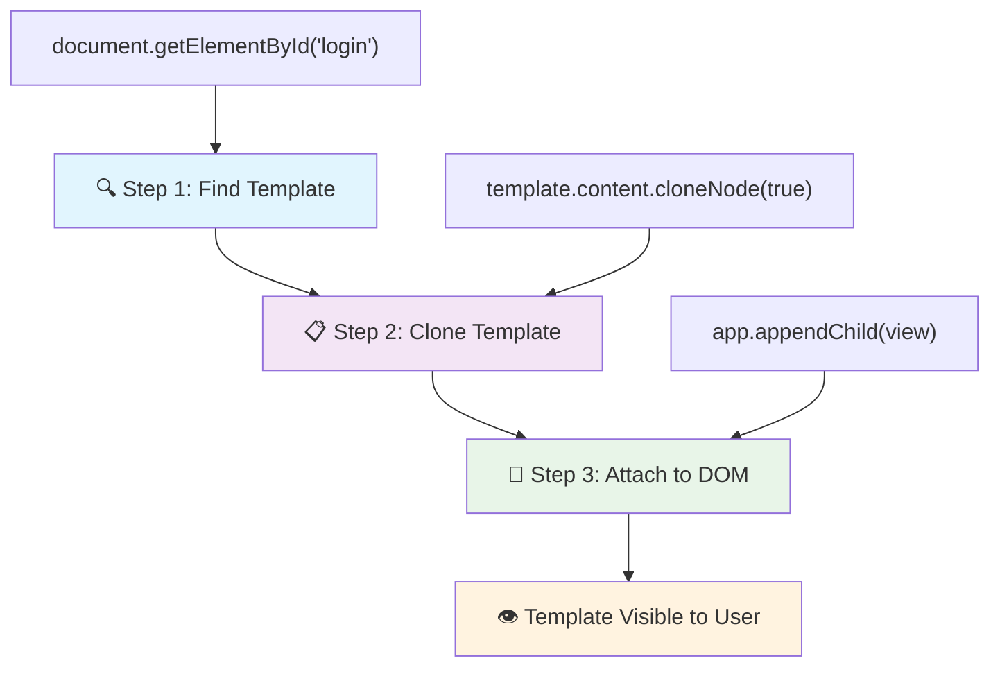
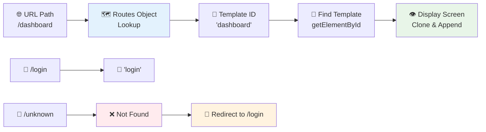
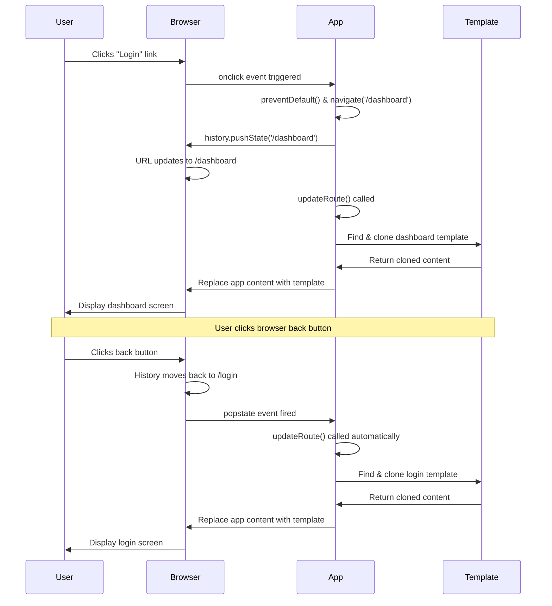
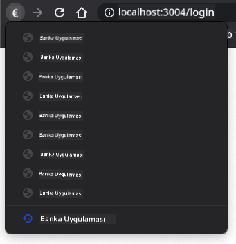

<!--
CO_OP_TRANSLATOR_METADATA:
{
  "original_hash": "5d259f6962464ad91e671083aa0398f4",
  "translation_date": "2025-10-23T00:02:17+00:00",
  "source_file": "7-bank-project/1-template-route/README.md",
  "language_code": "tr"
}
-->
# Bir Bankacılık Uygulaması Oluşturma Bölüm 1: Bir Web Uygulamasında HTML Şablonları ve Rotalar

Apollo 11'in yönlendirme bilgisayarı 1969'da Ay'a giderken, tüm sistemi yeniden başlatmadan farklı programlar arasında geçiş yapması gerekiyordu. Modern web uygulamaları da benzer şekilde çalışır – her şeyi sıfırdan yeniden yüklemeden gördüğünüz içeriği değiştirirler. Bu, kullanıcıların bugün beklediği akıcı ve duyarlı deneyimi yaratır.

Her etkileşim için tüm sayfaları yeniden yükleyen geleneksel web sitelerinin aksine, modern web uygulamaları yalnızca değişmesi gereken kısımları günceller. Bu yaklaşım, tıpkı görev kontrol merkezinin farklı ekranlar arasında geçiş yaparken sürekli iletişimi sürdürmesi gibi, beklediğimiz akıcı deneyimi yaratır.

İşte bu farkı bu kadar dramatik yapan şey:

| Geleneksel Çok Sayfalı Uygulamalar | Modern Tek Sayfalı Uygulamalar |
|-----------------------------------|--------------------------------|
| **Gezinme** | Her ekran için tam sayfa yeniden yükleme | Anında içerik geçişi |
| **Performans** | Tam HTML indirmeleri nedeniyle daha yavaş | Kısmi güncellemelerle daha hızlı |
| **Kullanıcı Deneyimi** | Kesintili sayfa geçişleri | Akıcı, uygulama benzeri geçişler |
| **Veri Paylaşımı** | Sayfalar arasında zor | Durum yönetimi kolay |
| **Geliştirme** | Bakımı gereken birden fazla HTML dosyası | Dinamik şablonlarla tek bir HTML |

**Evrimi anlamak:**
- **Geleneksel uygulamalar** her gezinme işlemi için sunucu isteği gerektirir
- **Modern SPA'lar** bir kez yüklenir ve içeriği JavaScript kullanarak dinamik olarak günceller
- **Kullanıcı beklentileri** artık anında, kesintisiz etkileşimleri tercih ediyor
- **Performans avantajları**, azaltılmış bant genişliği ve daha hızlı yanıt sürelerini içerir

Bu derste, birden fazla ekranı sorunsuz bir şekilde bir araya getiren bir bankacılık uygulaması oluşturacağız. Bilim insanlarının farklı deneyler için yeniden yapılandırılabilen modüler araçlar kullandığı gibi, biz de gerektiğinde görüntülenebilecek yeniden kullanılabilir bileşenler olarak HTML şablonlarını kullanacağız.

HTML şablonları (farklı ekranlar için yeniden kullanılabilir taslaklar), JavaScript yönlendirme (ekranlar arasında geçiş yapan sistem) ve tarayıcının geçmiş API'si (geri düğmesinin beklendiği gibi çalışmasını sağlar) ile çalışacaksınız. Bunlar, React, Vue ve Angular gibi çerçeveler tarafından kullanılan temel tekniklerle aynıdır.

Dersin sonunda, profesyonel tek sayfalı uygulama ilkelerini gösteren çalışan bir bankacılık uygulamanız olacak.

## Ders Öncesi Test

[Ders öncesi test](https://ff-quizzes.netlify.app/web/quiz/41)

### İhtiyacınız Olanlar

Bankacılık uygulamamızı test etmek için yerel bir web sunucusuna ihtiyacımız olacak – endişelenmeyin, düşündüğünüzden daha kolay! Eğer zaten bir sunucunuz yoksa, [Node.js](https://nodejs.org) yükleyin ve proje klasörünüzden `npx lite-server` komutunu çalıştırın. Bu kullanışlı komut, bir yerel sunucu başlatır ve uygulamanızı otomatik olarak tarayıcıda açar.

### Hazırlık

Bilgisayarınızda `bank` adında bir klasör oluşturun ve içine `index.html` adında bir dosya ekleyin. Bu HTML [şablon kodu](https://en.wikipedia.org/wiki/Boilerplate_code) ile başlayacağız:

```html
<!DOCTYPE html>
<html lang="en">
  <head>
    <meta charset="UTF-8">
    <meta name="viewport" content="width=device-width, initial-scale=1.0">
    <title>Bank App</title>
  </head>
  <body>
    <!-- This is where you'll work -->
  </body>
</html>
```

**Bu şablon kodunun sağladıkları:**
- **HTML5** belge yapısını doğru DOCTYPE bildirimiyle oluşturur
- **Karakter kodlamasını** UTF-8 olarak ayarlayarak uluslararası metin desteği sağlar
- **Duyarlı tasarımı** mobil uyumluluk için viewport meta etiketiyle etkinleştirir
- **Tarayıcı sekmesinde** görünen açıklayıcı bir başlık ayarlar
- **Uygulamamızı oluşturacağımız** temiz bir gövde bölümü oluşturur

> 📁 **Proje Yapısı Önizlemesi**
> 
> **Bu dersin sonunda projeniz şunları içerecek:**
> ```
> bank/
> ├── index.html      <!-- Main HTML with templates -->
> ├── app.js          <!-- Routing and navigation logic -->
> └── style.css       <!-- (Optional for future lessons) -->
> ```
> 
> **Dosya sorumlulukları:**
> - **index.html**: Tüm şablonları içerir ve uygulama yapısını sağlar
> - **app.js**: Yönlendirme, gezinme ve şablon yönetimini ele alır
> - **Şablonlar**: Giriş, kontrol paneli ve diğer ekranlar için kullanıcı arayüzünü tanımlar

---

## HTML Şablonları

Şablonlar, web geliştirmede temel bir sorunu çözer. Gutenberg, 1440'larda hareketli tip baskıyı icat ettiğinde, tüm sayfaları oymak yerine yeniden kullanılabilir harf blokları oluşturup gerektiğinde düzenleyebileceğini fark etti. HTML şablonları da aynı prensipte çalışır – her ekran için ayrı HTML dosyaları oluşturmak yerine, gerektiğinde görüntülenebilecek yeniden kullanılabilir yapılar tanımlarsınız.

Şablonları, uygulamanızın farklı bölümleri için taslaklar olarak düşünebilirsiniz. Bir mimarın bir planı bir kez oluşturup aynı odaları tekrar tekrar çizmek yerine birden çok kez kullanması gibi, biz de şablonları bir kez oluşturur ve gerektiğinde kullanırız. Tarayıcı, bu şablonları JavaScript tarafından etkinleştirilene kadar gizli tutar.

Bir web sayfası için birden fazla ekran oluşturmak istiyorsanız, bir çözüm her görüntülemek istediğiniz ekran için bir HTML dosyası oluşturmaktır. Ancak, bu çözüm bazı zorluklar getirir:

- Ekranlar arasında geçiş yaparken tüm HTML'yi yeniden yüklemeniz gerekir, bu da yavaş olabilir.
- Farklı ekranlar arasında veri paylaşımı zordur.

Başka bir yaklaşım, yalnızca bir HTML dosyasına sahip olmak ve `<template>` öğesini kullanarak birden fazla [HTML şablonu](https://developer.mozilla.org/docs/Web/HTML/Element/template) tanımlamaktır. Bir şablon, tarayıcı tarafından görüntülenmeyen ve JavaScript kullanılarak çalışma zamanında örneklenmesi gereken yeniden kullanılabilir bir HTML bloğudur.

### Hadi Başlayalım

İki ana ekranı olan bir bankacılık uygulaması oluşturacağız: bir giriş sayfası ve bir kontrol paneli. İlk olarak, HTML gövdemize bir yer tutucu öğesi ekleyelim – bu, tüm farklı ekranlarımızın görüneceği yerdir:

```html
<div id="app">Loading...</div>
```

**Bu yer tutucuyu anlamak:**
- **"app"** kimliğine sahip bir konteyner oluşturur, burada tüm ekranlar görüntülenecek
- **JavaScript** ilk ekranı başlatana kadar bir yükleme mesajı gösterir
- **Dinamik içerik** için tek bir montaj noktası sağlar
- **JavaScript** ile kolay hedefleme için `document.getElementById()` kullanır

> 💡 **İpucu**: Bu öğenin içeriği değiştirileceği için, uygulama yüklenirken gösterilecek bir yükleme mesajı veya göstergesi koyabiliriz.

Sonra, giriş sayfası için HTML şablonunu ekleyelim. Şimdilik, yalnızca bir başlık ve gezinme yapmak için kullanacağımız bir bağlantı içeren bir bölüm ekleyeceğiz.

```html
<template id="login">
  <h1>Bank App</h1>
  <section>
    <a href="/dashboard">Login</a>
  </section>
</template>
```

**Bu giriş şablonunun analizi:**
- **JavaScript** hedeflemesi için benzersiz bir "login" kimliğiyle bir şablon tanımlar
- **Uygulamanın markasını** belirleyen bir ana başlık içerir
- **İlgili içeriği** gruplamak için semantik bir `<section>` öğesi içerir
- **Kullanıcıları** kontrol paneline yönlendirecek bir gezinme bağlantısı sağlar

Daha sonra kontrol paneli sayfası için başka bir HTML şablonu ekleyeceğiz. Bu sayfa farklı bölümler içerecek:

- Bir başlık, bir başlık ve çıkış bağlantısı
- Banka hesabının mevcut bakiyesi
- Bir tabloda görüntülenen işlem listesi

```html
<template id="dashboard">
  <header>
    <h1>Bank App</h1>
    <a href="/login">Logout</a>
  </header>
  <section>
    Balance: 100$
  </section>
  <section>
    <h2>Transactions</h2>
    <table>
      <thead>
        <tr>
          <th>Date</th>
          <th>Object</th>
          <th>Amount</th>
        </tr>
      </thead>
      <tbody></tbody>
    </table>
  </section>
</template>
```

**Bu kontrol panelinin her bir bölümünü anlamak:**
- **Sayfayı**, gezinme içeren semantik bir `<header>` öğesiyle yapılandırır
- **Uygulama başlığını**, ekranlar arasında tutarlı bir şekilde görüntüler
- **Çıkış bağlantısı**, giriş ekranına geri yönlendirir
- **Mevcut hesap bakiyesini**, özel bir bölümde gösterir
- **İşlem verilerini**, düzgün yapılandırılmış bir HTML tablosu kullanarak düzenler
- **Tarih, Nesne ve Tutar** sütunları için tablo başlıklarını tanımlar
- **Tablo gövdesini**, daha sonra dinamik içerik eklemek için boş bırakır

> 💡 **İpucu**: HTML şablonları oluştururken, nasıl görüneceğini görmek isterseniz, `<template>` ve `</template>` satırlarını `<!-- -->` ile yorum satırı haline getirebilirsiniz.

✅ Şablonlarda neden `id` özniteliklerini kullanıyoruz? Bunun yerine sınıflar gibi başka bir şey kullanabilir miyiz?

## JavaScript ile Şablonları Hayata Geçirme

Şimdi şablonlarımızı işlevsel hale getirmemiz gerekiyor. Bir 3D yazıcının dijital bir taslağı alıp fiziksel bir nesne oluşturması gibi, JavaScript gizli şablonlarımızı alır ve kullanıcıların görebileceği ve kullanabileceği görünür, etkileşimli öğeler oluşturur.

Bu süreç, modern web geliştirme temelini oluşturan üç tutarlı adımı takip eder. Bu deseni bir kez anladığınızda, birçok çerçeve ve kütüphanede bunu tanıyacaksınız.

Mevcut HTML dosyanızı bir tarayıcıda denerseniz, `Loading...` mesajında takılı kaldığını göreceksiniz. Bunun nedeni, HTML şablonlarını başlatmak ve görüntülemek için biraz JavaScript kodu eklememiz gerektiğidir.

Bir şablonu başlatma genellikle 3 adımda yapılır:

1. DOM'daki şablon öğesini alın, örneğin [`document.getElementById`](https://developer.mozilla.org/docs/Web/API/Document/getElementById) kullanarak.
2. Şablon öğesini [`cloneNode`](https://developer.mozilla.org/docs/Web/API/Node/cloneNode) kullanarak kopyalayın.
3. Görünür bir öğenin altına, örneğin [`appendChild`](https://developer.mozilla.org/docs/Web/API/Node/appendChild) kullanarak ekleyin.



**Sürecin görsel analizi:**
- **1. Adım**, DOM yapısındaki gizli şablonu bulur
- **2. Adım**, güvenle değiştirilebilecek bir çalışma kopyası oluşturur
- **3. Adım**, kopyayı görünür sayfa alanına ekler
- **Sonuç**, kullanıcıların etkileşimde bulunabileceği işlevsel bir ekran olur

✅ Şablonu DOM'a eklemeden önce neden kopyalamamız gerekiyor? Bu adımı atlarsak ne olur?

### Görev

Proje klasörünüzde `app.js` adında yeni bir dosya oluşturun ve bu dosyayı HTML'nizin `<head>` bölümüne ekleyin:

```html
<script src="app.js" defer></script>
```

**Bu script eklemesini anlamak:**
- **JavaScript dosyasını**, HTML belgesine bağlar
- **`defer`** özniteliğini kullanarak scriptin HTML ayrıştırması tamamlandıktan sonra çalışmasını sağlar
- **Tüm DOM öğelerine**, script çalışmadan önce tamamen yüklenmiş oldukları için erişim sağlar
- **Modern en iyi uygulamaları**, script yükleme ve performansı için takip eder

Şimdi `app.js` içinde yeni bir `updateRoute` fonksiyonu oluşturacağız:

```js
function updateRoute(templateId) {
  const template = document.getElementById(templateId);
  const view = template.content.cloneNode(true);
  const app = document.getElementById('app');
  app.innerHTML = '';
  app.appendChild(view);
}
```

**Adım adım, burada olanlar:**
- **Şablon öğesini**, benzersiz kimliğiyle bulur
- **Şablonun içeriğinin**, `cloneNode(true)` kullanarak derin bir kopyasını oluşturur
- **İçeriğin görüntüleneceği** uygulama konteynerini bulur
- **Uygulama konteynerindeki** mevcut içeriği temizler
- **Klonlanmış şablon içeriğini**, görünür DOM'a ekler

Şimdi bu fonksiyonu şablonlardan biriyle çağırın ve sonucu görün.

```js
updateRoute('login');
```

**Bu fonksiyon çağrısının sağladıkları:**
- **Giriş şablonunu**, kimliğini bir parametre olarak geçirerek etkinleştirir
- **Farklı uygulama ekranları arasında**, programatik olarak nasıl geçiş yapılacağını gösterir
- **"Loading..."** mesajının yerine giriş ekranını gösterir

✅ Bu kodun amacı nedir: `app.innerHTML = '';`? Onsuz ne olur?

## Rotalar Oluşturma

Yönlendirme, temelde URL'leri doğru içeriğe bağlamakla ilgilidir. Erken dönem telefon operatörlerinin gelen çağrıları doğru yere bağlamak için anahtar panolar kullandığını düşünün – bir gelen isteği alır ve doğru hedefe yönlendirirler. Web yönlendirme de benzer şekilde çalışır, bir URL isteğini alır ve hangi içeriğin görüntüleneceğini belirler.

Geleneksel olarak, web sunucuları bunu farklı URL'ler için farklı HTML dosyaları sunarak yapardı. Tek sayfalık bir uygulama oluşturduğumuz için, bu yönlendirmeyi JavaScript ile kendimiz ele almamız gerekiyor. Bu yaklaşım, kullanıcı deneyimi ve performans üzerinde daha fazla kontrol sağlar.



**Yönlendirme akışını anlamak:**
- **URL değişiklikleri**, rotalar yapılandırmamızda bir aramayı tetikler
- **Geçerli rotalar**, belirli şablon kimliklerine eşlenir
- **Geçersiz rotalar**, bozuk durumları önlemek için yedek davranışı tetikler
- **Şablon oluşturma**, daha önce öğrendiğimiz üç adımlı süreci takip eder

Bir web uygulamasından bahsederken, *Yönlendirme*, **URL'leri** görüntülenmesi gereken belirli ekranlarla eşleştirme niyetini ifade eder. Birden fazla HTML dosyasına sahip bir web sitesinde, bu otomatik olarak yapılır çünkü dosya yolları URL'de yansıtılır. Örneğin, proje klasörünüzde şu dosyalar varsa:

```
mywebsite/index.html
mywebsite/login.html
mywebsite/admin/index.html
```

Eğer `mywebsite` kök diziniyle bir web sunucusu oluşturursanız, URL eşlemesi şu şekilde olur:

```
https://site.com            --> mywebsite/index.html
https://site.com/login.html --> mywebsite/login.html
https://site.com/admin/     --> mywebsite/admin/index.html
```

Ancak, web uygulamamız için tüm ekranları içeren tek bir HTML dosyası kullandığımızdan, bu varsayılan davranış bize yardımcı olmayacaktır. Bu haritayı manuel olarak oluşturmalı ve görüntülenen şablonu JavaScript kullanarak güncellemeliyiz.

### Görev

URL yolları ile şablonlarımızı eşleştirmek için basit bir nesne kullanacağız. Bu nesneyi `app.js` dosyanızın en üstüne ekleyin.

```js
const routes = {
  '/login': { templateId: 'login' },
  '/dashboard': { templateId: 'dashboard' },
};
```

**Bu rotalar yapılandırmasını anlamak:**
- **URL yolları ile şablon kimlikleri arasında** bir eşleme tanımlar
- **Anahtar-değer** sözdizimini kullanır, burada anahtarlar URL yollarını, değerler ise şablon bilgilerini içerir
- **Hangi şablonun görüntüleneceğini** kolayca bulmayı sağlar
- **Yeni rotalar eklemek için** ölçeklenebilir bir yapı sunar

Şimdi `updateRoute` fonksiyonunu biraz değiştirelim. `templateId`yi doğrudan bir argüman olarak geçirmek yerine, önce mevcut URL'ye bakmak ve ardından rotalar haritamızı kullanarak ilgili şablon kimliği değerini almak istiyoruz. URL'nin yalnızca yol bölümünü almak için [`window.location.pathname`](https://developer.mozilla.org/docs/Web/API/Location/pathname) kullanabiliriz.

```js
function updateRoute() {
  const path = window.location.pathname;
  const route = routes[path];

  const template = document.getElementById(route.templateId);
  const view = template.content.cloneNode(true);
  const app = document.getElementById('app');
  app.innerHTML = '';
  app.appendChild(view);
}
```

**Burada olanları adım adım inceleyelim:**
- **Tarayıcının URL'sinden**, `window.location.pathname` kullanarak mevcut yolu çıkarır
- **Rotalar nesnesinde**, ilgili rota yapılandırmasını arar
- **Şablon kimliğini**, rota yapılandırmasından alır
- **Daha önce öğrendiğimiz** şablon oluşturma sürecini takip eder
- **URL değişikliklerine** yanıt veren dinamik bir sistem oluşturur

Burada tanımladığımız rotaları ilgili şablonlarla eşleştirdik. Tarayıcınızda URL'yi manuel olarak değiştirerek doğru çalışıp çalışmadığını test edebilirsiniz.
✅ Bilinmeyen bir yol URL'ye girilirse ne olur? Bunu nasıl çözebiliriz?

## Navigasyon Ekleme

Yönlendirme kurulduktan sonra, kullanıcıların uygulama içinde gezinmesi için bir yol sunmamız gerekiyor. Geleneksel web siteleri, bağlantılara tıklandığında tüm sayfayı yeniden yükler, ancak biz URL'yi ve içeriği sayfa yenilemeden güncellemek istiyoruz. Bu, masaüstü uygulamalarının farklı görünümler arasında geçiş yapma şekline benzer şekilde daha akıcı bir deneyim yaratır.

İki şeyi koordine etmemiz gerekiyor: Kullanıcıların sayfaları yer imlerine ekleyebilmesi ve bağlantıları paylaşabilmesi için tarayıcının URL'sini güncellemek ve uygun içeriği görüntülemek. Doğru bir şekilde uygulandığında, bu modern uygulamalardan beklenen kesintisiz navigasyonu sağlar.

> 🏗️ **Mimari İçgörü**: Navigasyon Sistemi Bileşenleri
>
> **Oluşturduğunuz şey:**
> - **🔄 URL Yönetimi**: Sayfa yenilemeden tarayıcı adres çubuğunu günceller
> - **📋 Şablon Sistemi**: Mevcut rotaya göre içeriği dinamik olarak değiştirir  
> - **📚 Geçmiş Entegrasyonu**: Tarayıcı geri/ileri düğmesi işlevselliğini korur
> - **🛡️ Hata Yönetimi**: Geçersiz veya eksik rotalar için zarif bir yedekleme sağlar
>
> **Bileşenlerin birlikte çalışma şekli:**
> - Navigasyon olaylarını (tıklamalar, geçmiş değişiklikleri) **dinler**
> - History API kullanarak URL'yi **günceller**
> - Yeni rota için uygun şablonu **oluşturur**
> - Kesintisiz bir kullanıcı deneyimini **korur**

Uygulamamızın bir sonraki adımı, URL'yi manuel olarak değiştirmek zorunda kalmadan sayfalar arasında gezinme olasılığını eklemektir. Bu iki şeyi gerektirir:

  1. Mevcut URL'yi güncellemek
  2. Yeni URL'ye göre görüntülenen şablonu güncellemek

İkinci kısmı `updateRoute` fonksiyonu ile zaten hallettik, bu yüzden mevcut URL'yi nasıl güncelleyeceğimizi bulmamız gerekiyor.

Bunun için JavaScript ve daha spesifik olarak [`history.pushState`](https://developer.mozilla.org/docs/Web/API/History/pushState) kullanmamız gerekecek. Bu, HTML'yi yeniden yüklemeden URL'yi güncellemeye ve tarama geçmişinde yeni bir giriş oluşturmaya olanak tanır.

> ⚠️ **Önemli Not**: HTML bağlantı öğesi [`<a href>`](https://developer.mozilla.org/docs/Web/HTML/Element/a) kendi başına farklı URL'lere bağlantılar oluşturmak için kullanılabilir, ancak varsayılan olarak tarayıcının HTML'yi yeniden yüklemesine neden olur. Özel JavaScript ile yönlendirme yaparken bu davranışı önlemek için tıklama olayında preventDefault() fonksiyonunu kullanmak gereklidir.

### Görev

Uygulamamızda gezinmek için kullanabileceğimiz yeni bir fonksiyon oluşturalım:

```js
function navigate(path) {
  window.history.pushState({}, path, path);
  updateRoute();
}
```

**Bu navigasyon fonksiyonunu anlamak:**
- `history.pushState` kullanarak tarayıcının URL'sini yeni yola göre **günceller**
- Tarayıcının geçmiş yığınına yeni bir giriş **ekler**, geri/ileri düğmesi desteği sağlar
- İlgili şablonu görüntülemek için `updateRoute()` fonksiyonunu **tetikler**
- Sayfa yenilemeden tek sayfa uygulama deneyimini **korur**

Bu yöntem önce verilen yola göre mevcut URL'yi günceller, ardından şablonu günceller. `window.location.origin` özelliği, bir yolun tamamını yeniden oluşturmak için URL kökünü döndürür.

Artık bu fonksiyon elimizde olduğuna göre, tanımlı bir rota ile eşleşmeyen bir yol sorunumuzu çözebiliriz. Tanımlı bir eşleşme bulamazsak mevcut rotalardan birine geri dönmek için `updateRoute` fonksiyonunu değiştireceğiz.

```js
function updateRoute() {
  const path = window.location.pathname;
  const route = routes[path];

  if (!route) {
    return navigate('/login');
  }

  const template = document.getElementById(route.templateId);
  const view = template.content.cloneNode(true);
  const app = document.getElementById('app');
  app.innerHTML = '';
  app.appendChild(view);
}
```

**Hatırlanması gereken önemli noktalar:**
- Mevcut yol için bir rota olup olmadığını **kontrol eder**
- Geçersiz bir rota erişildiğinde giriş sayfasına **yönlendirir**
- Kırık navigasyonu önleyen bir yedekleme mekanizması **sağlar**
- Kullanıcıların yanlış URL'lerle bile geçerli bir ekran görmesini **garantiler**

Bir rota bulunamazsa, artık kullanıcıyı `login` sayfasına yönlendireceğiz.

Şimdi bir bağlantıya tıklandığında URL'yi almak ve tarayıcının varsayılan bağlantı davranışını önlemek için bir fonksiyon oluşturalım:

```js
function onLinkClick(event) {
  event.preventDefault();
  navigate(event.target.href);
}
```

**Bu tıklama işleyicisinin ayrıntıları:**
- Tarayıcının varsayılan bağlantı davranışını `preventDefault()` kullanarak **önler**
- Tıklanan bağlantı öğesinden hedef URL'yi **çıkarır**
- Sayfayı yeniden yüklemek yerine özel gezinme fonksiyonumuzu **çağırır**
- Akıcı tek sayfa uygulama deneyimini **korur**

```html
<a href="/dashboard" onclick="onLinkClick(event)">Login</a>
...
<a href="/login" onclick="onLinkClick(event)">Logout</a>
```

**Bu onclick bağlamasının sağladıkları:**
- Her bağlantıyı özel navigasyon sistemimize **bağlar**
- Tıklama olayını işlemek için `onLinkClick` fonksiyonuna **iletir**
- Sayfa yenilemeden akıcı bir navigasyon **sağlar**
- Kullanıcıların yer imlerine ekleyebileceği veya paylaşabileceği doğru URL yapısını **korur**

[`onclick`](https://developer.mozilla.org/docs/Web/API/GlobalEventHandlers/onclick) özelliği, `click` olayını JavaScript koduna bağlar, burada `navigate()` fonksiyonunun çağrılması sağlanır.

Bu bağlantılara tıklamayı deneyin, artık uygulamanızın farklı ekranları arasında gezinebilmelisiniz.

✅ `history.pushState` metodu HTML5 standardının bir parçasıdır ve [tüm modern tarayıcılarda](https://caniuse.com/?search=pushState) uygulanmıştır. Daha eski tarayıcılar için bir web uygulaması oluşturuyorsanız, bu API yerine kullanabileceğiniz bir hile var: Yolun önüne bir [hash (`#`)](https://en.wikipedia.org/wiki/URI_fragment) ekleyerek, düzenli bağlantı navigasyonu ile çalışan ve sayfayı yeniden yüklemeyen bir yönlendirme uygulayabilirsiniz. Bu, bir sayfa içinde dahili bağlantılar oluşturmak için tasarlanmıştır.

## Geri ve İleri Düğmelerini Çalıştırmak

Geri ve ileri düğmeleri, web tarayıcılığının temel unsurlarıdır; tıpkı NASA görev kontrolörlerinin uzay görevleri sırasında önceki sistem durumlarını gözden geçirebilmesi gibi. Kullanıcılar bu düğmelerin çalışmasını bekler ve çalışmadığında, beklenen tarama deneyimi bozulur.

Tek sayfa uygulamamızın bunu desteklemek için ek yapılandırmaya ihtiyacı var. Tarayıcı bir geçmiş yığını tutar (ki bunu `history.pushState` ile ekliyoruz), ancak kullanıcılar bu geçmişte gezinirken, uygulamamızın buna yanıt vererek görüntülenen içeriği buna göre güncellemesi gerekir.



**Ana etkileşim noktaları:**
- **Kullanıcı eylemleri**, tıklamalar veya tarayıcı düğmeleri aracılığıyla navigasyonu tetikler
- **Uygulama**, sayfa yenilemelerini önlemek için bağlantı tıklamalarını engeller
- **Geçmiş API'si**, URL değişikliklerini ve tarayıcı geçmiş yığınını yönetir
- **Şablonlar**, her ekran için içerik yapısını sağlar
- **Olay dinleyiciler**, uygulamanın tüm navigasyon türlerine yanıt vermesini sağlar

`history.pushState` kullanımı, tarayıcının navigasyon geçmişine yeni girişler oluşturur. Tarayıcınızın *geri düğmesini* basılı tutarak bunu kontrol edebilirsiniz, aşağıdaki gibi bir şey görmelisiniz:



Geri düğmesine birkaç kez tıklamayı denerseniz, mevcut URL'nin değiştiğini ve geçmişin güncellendiğini göreceksiniz, ancak aynı şablon görüntülenmeye devam eder.

Bunun nedeni, uygulamanın her seferinde `updateRoute()` çağrılması gerektiğini bilmemesidir. [`history.pushState`](https://developer.mozilla.org/docs/Web/API/History/pushState) belgelerine bakarsanız, durum değiştiğinde - yani farklı bir URL'ye geçtiğimizde - [`popstate`](https://developer.mozilla.org/docs/Web/API/Window/popstate_event) olayının tetiklendiğini görebilirsiniz. Bu sorunu çözmek için bunu kullanacağız.

### Görev

Tarayıcı geçmişi değiştiğinde görüntülenen şablonun güncellendiğinden emin olmak için, `updateRoute()` fonksiyonunu çağıran yeni bir fonksiyon ekleyeceğiz. Bunu `app.js` dosyamızın en altına ekleyeceğiz:

```js
window.onpopstate = () => updateRoute();
updateRoute();
```

**Bu geçmiş entegrasyonunu anlamak:**
- Kullanıcıların tarayıcı düğmeleriyle gezinmesi sırasında oluşan `popstate` olaylarını **dinler**
- Kısa olay işleyici sözdizimi için bir ok fonksiyonu **kullanır**
- Geçmiş durumu her değiştiğinde otomatik olarak `updateRoute()` **çağırır**
- Sayfa ilk yüklendiğinde `updateRoute()` çağırarak uygulamayı **başlatır**
- Kullanıcıların nasıl gezindiğine bakılmaksızın doğru şablonun görüntülenmesini **garantiler**

> 💡 **Profesyonel İpucu**: Burada `popstate` olay işleyicimizi kısa tutmak için bir [ok fonksiyonu](https://developer.mozilla.org/docs/Web/JavaScript/Reference/Functions/Arrow_functions) kullandık, ancak normal bir fonksiyon da aynı şekilde çalışır.

Ok fonksiyonları hakkında bir hatırlatma videosu:

[](https://youtube.com/watch?v=OP6eEbOj2sc "Ok Fonksiyonları")

> 🎥 Ok fonksiyonları hakkında bir video için yukarıdaki resme tıklayın.

Şimdi tarayıcılarınızın geri ve ileri düğmelerini kullanmayı deneyin ve görüntülenen rotanın bu sefer doğru şekilde güncellendiğini kontrol edin.

---

## GitHub Copilot Agent Challenge 🚀

Agent modunu kullanarak aşağıdaki meydan okumayı tamamlayın:

**Açıklama:** Bankacılık uygulamasını, geçersiz rotalar için hata yönetimi ve kullanıcı dostu bir 404 sayfa şablonu ekleyerek geliştirin. Kullanıcıların var olmayan sayfalara yönlendirildiğinde daha iyi bir deneyim yaşamasını sağlayın.

**İstek:** "not-found" kimliğine sahip, stilize edilmiş bir kullanıcı dostu 404 hata sayfası görüntüleyen yeni bir HTML şablonu oluşturun. Ardından, JavaScript yönlendirme mantığını bu şablonu geçersiz URL'lere yönlendirildiğinde gösterecek şekilde değiştirin ve giriş sayfasına geri dönen bir "Ana Sayfaya Git" düğmesi ekleyin.

Agent modu hakkında daha fazla bilgi edinin: [agent mode](https://code.visualstudio.com/blogs/2025/02/24/introducing-copilot-agent-mode).

## 🚀 Meydan Okuma

Bu uygulama için kredileri gösteren üçüncü bir sayfa için yeni bir şablon ve rota ekleyin.

**Meydan okuma hedefleri:**
- Uygun içerik yapısına sahip yeni bir HTML şablonu **oluşturun**
- Yeni rotayı rotalar yapılandırma nesnesine **ekleyin**
- Krediler sayfasına ve sayfadan navigasyon bağlantıları **ekleyin**
- Tüm navigasyonun tarayıcı geçmişiyle doğru şekilde çalıştığını **test edin**

## Ders Sonrası Test

[Ders sonrası test](https://ff-quizzes.netlify.app/web/quiz/42)

## Gözden Geçirme ve Kendi Kendine Çalışma

Yönlendirme, web geliştirme sürecinin şaşırtıcı derecede zorlayıcı bir parçasıdır, özellikle web sayfa yenileme davranışlarından Tek Sayfa Uygulama yenileme davranışlarına geçerken. [Azure Static Web App hizmetinin](https://docs.microsoft.com/azure/static-web-apps/routes/?WT.mc_id=academic-77807-sagibbon) yönlendirmeyi nasıl ele aldığı hakkında biraz okuyun. Bu belgede açıklanan bazı kararların neden gerekli olduğunu açıklayabilir misiniz?

**Ek öğrenme kaynakları:**
- Popüler çerçevelerin, örneğin React Router ve Vue Router'ın istemci tarafı yönlendirmeyi nasıl uyguladığını **keşfedin**
- Hash tabanlı yönlendirme ile History API yönlendirme arasındaki farkları **araştırın**
- Sunucu tarafı işleme (SSR) hakkında bilgi edinin ve bunun yönlendirme stratejilerini nasıl etkilediğini **öğrenin**
- İlerlemeli Web Uygulamaları (PWAs) yönlendirme ve navigasyonu nasıl ele aldığını **inceleyin**

## Ödev

[Yönlendirmeyi geliştirin](assignment.md)

---

**Feragatname**:  
Bu belge, AI çeviri hizmeti [Co-op Translator](https://github.com/Azure/co-op-translator) kullanılarak çevrilmiştir. Doğruluk için çaba göstersek de, otomatik çevirilerin hata veya yanlışlıklar içerebileceğini lütfen unutmayın. Belgenin orijinal dili, yetkili kaynak olarak kabul edilmelidir. Kritik bilgiler için profesyonel insan çevirisi önerilir. Bu çevirinin kullanımından kaynaklanan yanlış anlamalar veya yanlış yorumlamalar için sorumluluk kabul etmiyoruz.