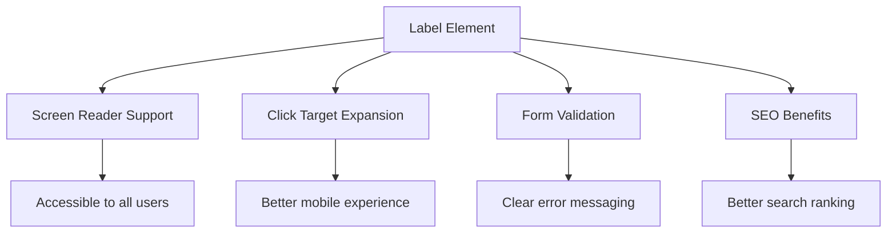
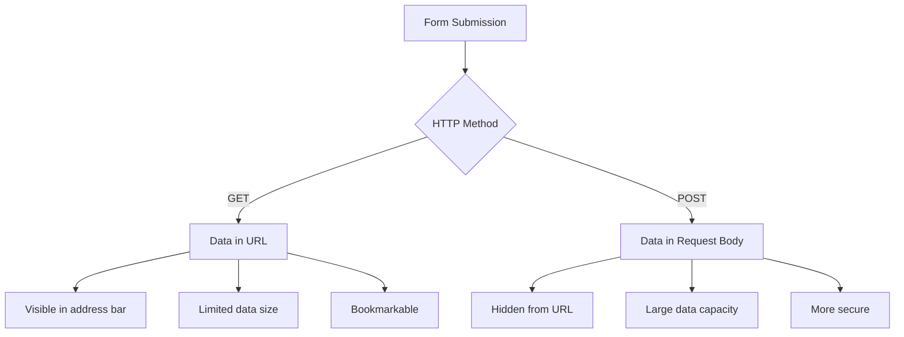
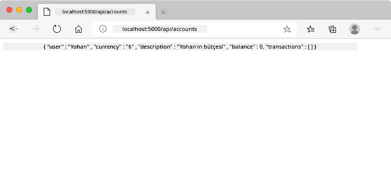
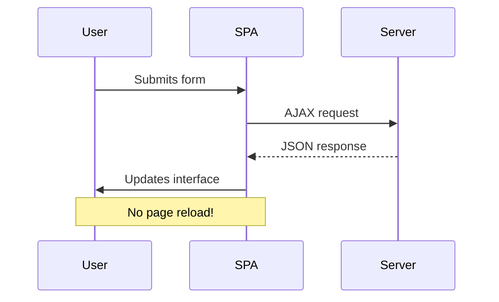
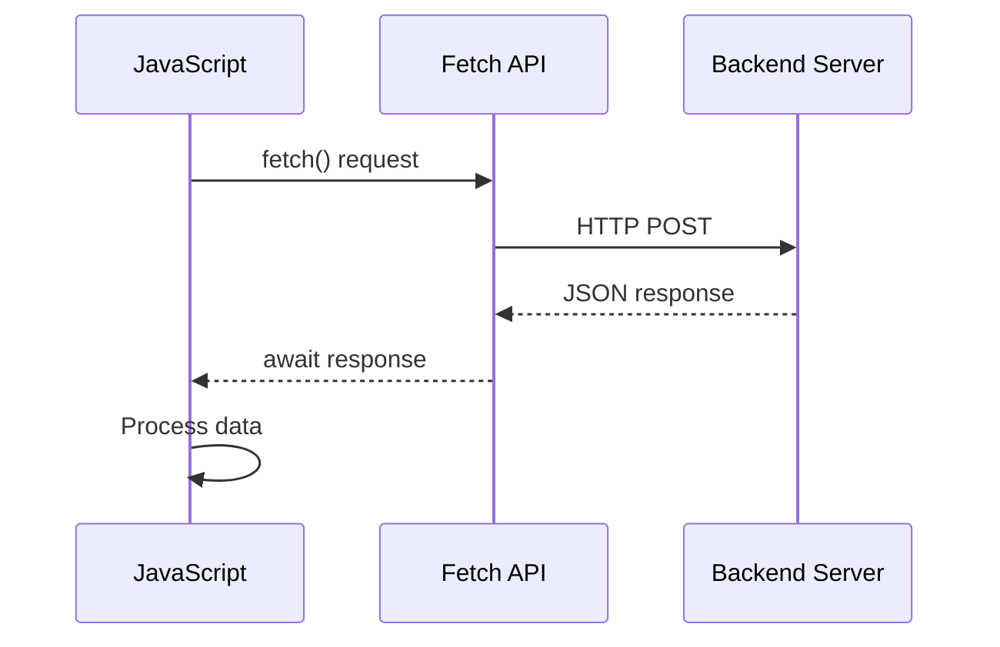
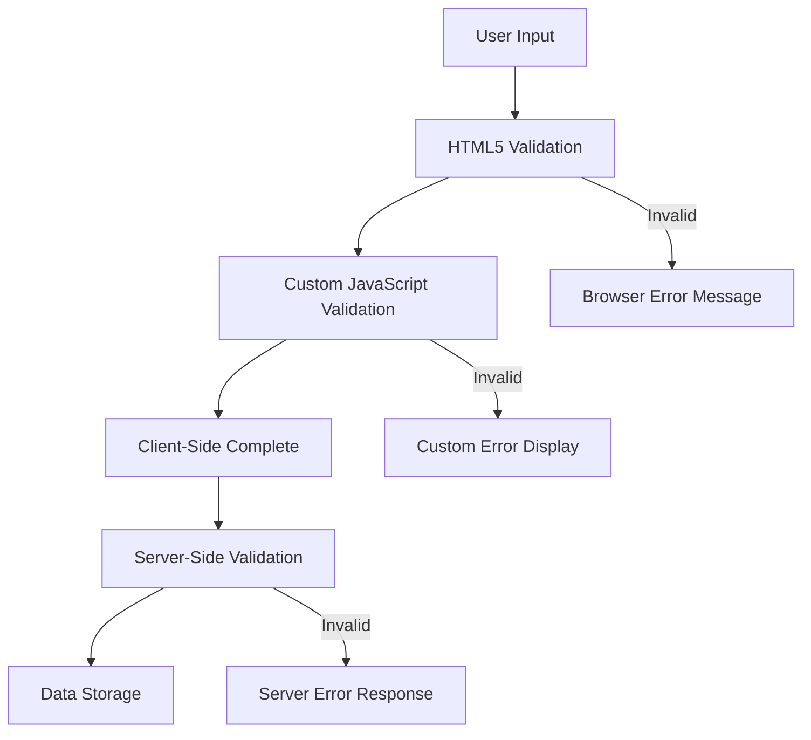
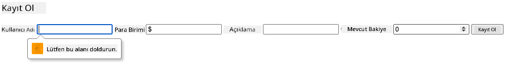
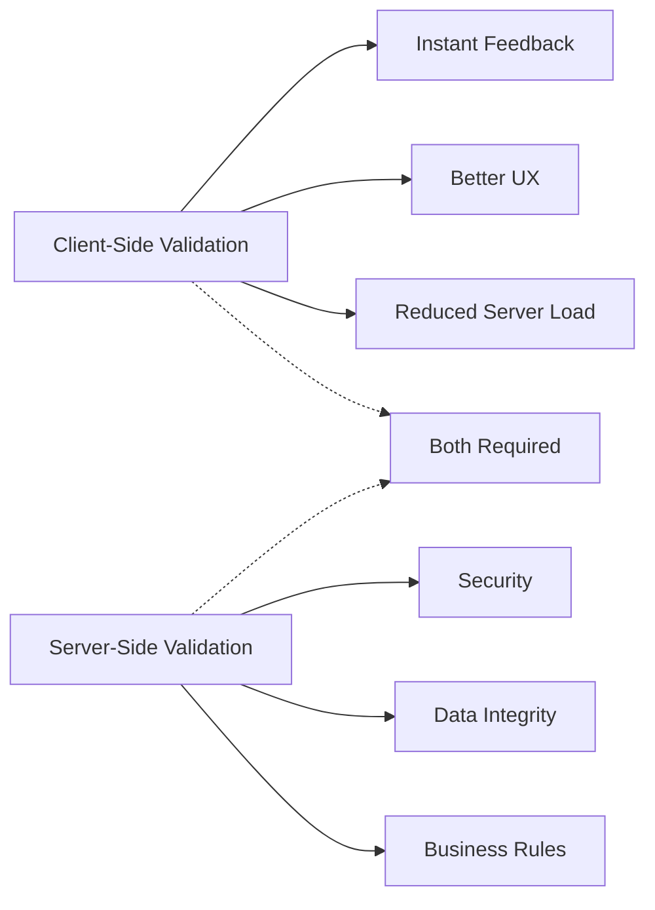
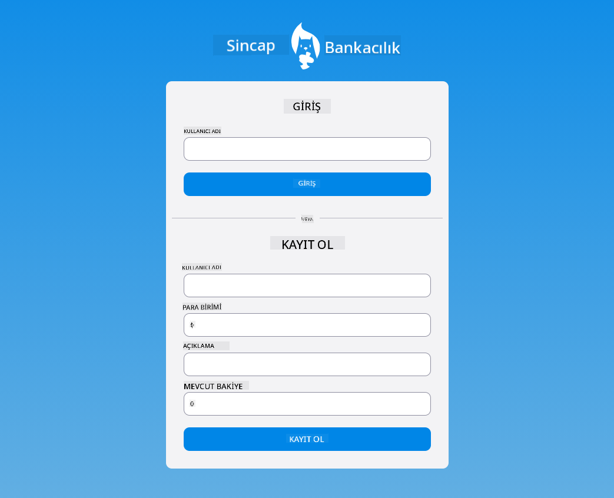

<!--
CO_OP_TRANSLATOR_METADATA:
{
  "original_hash": "b24f28fc46dd473aa9080f174182adde",
  "translation_date": "2025-10-23T00:03:20+00:00",
  "source_file": "7-bank-project/2-forms/README.md",
  "language_code": "tr"
}
-->
# Bankacılık Uygulaması Yapımı Bölüm 2: Giriş ve Kayıt Formu Oluşturma

## Ders Öncesi Test

[Ders öncesi testi](https://ff-quizzes.netlify.app/web/quiz/43)

Hiç çevrimiçi bir form doldurup e-posta formatınızın reddedildiğini gördünüz mü? Ya da gönder düğmesine tıkladığınızda tüm bilgilerinizin kaybolduğunu? Hepimiz bu tür sinir bozucu deneyimlerle karşılaştık.

Formlar, kullanıcılarınız ile uygulamanızın işlevselliği arasındaki köprüdür. Hava trafik kontrolörlerinin uçakları güvenli bir şekilde yönlendirmek için kullandıkları dikkatli protokoller gibi, iyi tasarlanmış formlar net geri bildirim sağlar ve pahalı hataları önler. Kötü formlar ise kullanıcıları yoğun bir havaalanındaki yanlış iletişimden daha hızlı uzaklaştırabilir.

Bu derste, statik bankacılık uygulamanızı interaktif bir uygulamaya dönüştüreceğiz. Kullanıcı girdisini doğrulayan, sunucularla iletişim kuran ve yardımcı geri bildirim sağlayan formlar oluşturmayı öğreneceksiniz. Bunu, kullanıcıların uygulamanızın özelliklerini gezinmesine olanak tanıyan bir kontrol arayüzü oluşturmak olarak düşünebilirsiniz.

Sonunda, kullanıcıları hayal kırıklığına değil başarıya yönlendiren doğrulama ile eksiksiz bir giriş ve kayıt sistemine sahip olacaksınız.

## Ön Koşullar

Formlar oluşturmaya başlamadan önce her şeyin doğru bir şekilde ayarlandığından emin olalım. Bu ders, bir önceki derste bıraktığımız yerden devam ediyor, bu yüzden ileriye atladıysanız, önce temel bilgileri çalışmak isteyebilirsiniz.

### Gerekli Kurulum

| Bileşen | Durum | Açıklama |
|---------|-------|----------|
| [HTML Şablonları](../1-template-route/README.md) | ✅ Gerekli | Temel bankacılık uygulaması yapısı |
| [Node.js](https://nodejs.org) | ✅ Gerekli | Sunucu için JavaScript çalışma zamanı |
| [Bank API Sunucusu](../api/README.md) | ✅ Gerekli | Veri depolama için arka uç hizmeti |

> 💡 **Geliştirme İpucu**: Ön uç bankacılık uygulamanız için bir sunucu ve arka uç API için başka bir sunucu olmak üzere iki ayrı sunucuyu aynı anda çalıştıracaksınız. Bu kurulum, ön uç ve arka uç hizmetlerinin bağımsız olarak çalıştığı gerçek dünya geliştirme ortamını yansıtır.

### Sunucu Yapılandırması

**Geliştirme ortamınız şunları içerecek:**
- **Ön uç sunucusu**: Bankacılık uygulamanızı sunar (genellikle `3000` portu)
- **Arka uç API sunucusu**: Veri depolama ve alma işlemlerini yönetir (`5000` portu)
- **Her iki sunucu** çakışma olmadan aynı anda çalışabilir

**API bağlantınızı test etme:**
```bash
curl http://localhost:5000/api
# Expected response: "Bank API v1.0.0"
```

**API sürüm yanıtını görüyorsanız, devam etmeye hazırsınız!**

---

## HTML Formlarını ve Kontrollerini Anlama

HTML formları, kullanıcıların web uygulamanızla iletişim kurma yoludur. Bunları, 19. yüzyılda uzak yerleri birbirine bağlayan telgraf sistemi gibi düşünebilirsiniz – kullanıcı niyeti ile uygulama yanıtı arasında bir iletişim protokolüdür. Düşünceli bir şekilde tasarlandıklarında, hataları yakalar, giriş formatlamasını yönlendirir ve yardımcı öneriler sunarlar.

Modern formlar, temel metin girişlerinden çok daha sofistike. HTML5, e-posta doğrulama, sayı formatlama ve tarih seçimi gibi işlemleri otomatik olarak gerçekleştiren özel giriş türlerini tanıttı. Bu iyileştirmeler hem erişilebilirlik hem de mobil kullanıcı deneyiminden fayda sağlar.

### Temel Form Elemanları

**Her formun ihtiyaç duyduğu yapı taşları:**

```html
<!-- Basic form structure -->
<form id="userForm" method="POST">
  <label for="username">Username</label>
  <input id="username" name="username" type="text" required>
  
  <button type="submit">Submit</button>
</form>
```

**Bu kodun yaptığı şeyler:**
- **Bir form konteyneri oluşturur** ve benzersiz bir kimlik atar
- **Veri gönderimi için HTTP yöntemini belirtir**
- **Erişilebilirlik için etiketleri girişlerle ilişkilendirir**
- **Formu işlemek için bir gönder düğmesi tanımlar**

### Modern Giriş Türleri ve Özellikleri

| Giriş Türü | Amaç | Örnek Kullanım |
|------------|------|----------------|
| `text` | Genel metin girişi | `<input type="text" name="username">` |
| `email` | E-posta doğrulama | `<input type="email" name="email">` |
| `password` | Gizli metin girişi | `<input type="password" name="password">` |
| `number` | Sayısal giriş | `<input type="number" name="balance" min="0">` |
| `tel` | Telefon numaraları | `<input type="tel" name="phone">` |

> 💡 **Modern HTML5 Avantajı**: Belirli giriş türlerini kullanmak, ek JavaScript olmadan otomatik doğrulama, uygun mobil klavyeler ve daha iyi erişilebilirlik desteği sağlar!

### Düğme Türleri ve Davranışları

```html
<!-- Different button behaviors -->
<button type="submit">Save Data</button>     <!-- Submits the form -->
<button type="reset">Clear Form</button>    <!-- Resets all fields -->
<button type="button">Custom Action</button> <!-- No default behavior -->
```

**Her düğme türünün yaptığı şeyler:**
- **Gönder düğmeleri**: Form gönderimini tetikler ve verileri belirtilen uç noktaya gönderir
- **Sıfırla düğmeleri**: Tüm form alanlarını başlangıç durumuna geri döndürür
- **Normal düğmeler**: Varsayılan bir davranış sağlamaz, işlevsellik için özel JavaScript gerektirir

> ⚠️ **Önemli Not**: `<input>` öğesi kendini kapatan bir etikettir ve kapanış etiketi gerektirmez. Modern en iyi uygulama, `<input>` etiketini eğik çizgi olmadan yazmaktır.

### Giriş Formunuzu Oluşturma

Şimdi modern HTML form uygulamalarını gösteren pratik bir giriş formu oluşturalım. Temel bir yapı ile başlayacağız ve bunu erişilebilirlik özellikleri ve doğrulama ile geliştireceğiz.

```html
<template id="login">
  <h1>Bank App</h1>
  <section>
    <h2>Login</h2>
    <form id="loginForm" novalidate>
      <div class="form-group">
        <label for="username">Username</label>
        <input id="username" name="user" type="text" required 
               autocomplete="username" placeholder="Enter your username">
      </div>
      <button type="submit">Login</button>
    </form>
  </section>
</template>
```

**Burada olanları açıklamak:**
- **Formu** semantik HTML5 öğeleriyle yapılandırır
- **İlgili öğeleri** anlamlı sınıflara sahip `div` konteynerleri kullanarak gruplar
- **Etiketleri** `for` ve `id` özellikleriyle girişlerle ilişkilendirir
- **Daha iyi kullanıcı deneyimi için** `autocomplete` ve `placeholder` gibi modern özellikler ekler
- **Doğrulamayı** tarayıcı varsayılanları yerine JavaScript ile yönetmek için `novalidate` ekler

### Doğru Etiketlerin Gücü

**Modern web geliştirme için etiketlerin önemi:**



**Doğru etiketlerin sağladıkları:**
- **Ekran okuyucuların** form alanlarını net bir şekilde duyurmasını sağlar
- **Tıklanabilir alanı genişletir** (etikete tıklamak girişi odaklar)
- **Mobil kullanılabilirliği** daha büyük dokunmatik hedeflerle iyileştirir
- **Anlamlı hata mesajlarıyla** form doğrulamasını destekler
- **SEO'yu iyileştirir** form öğelerine semantik anlam kazandırır

> 🎯 **Erişilebilirlik Hedefi**: Her form girişiyle ilişkili bir etikete sahip olmalıdır. Bu basit uygulama, formlarınızı engelli kullanıcılar dahil herkes için kullanılabilir hale getirir ve tüm kullanıcılar için deneyimi iyileştirir.

### Kayıt Formu Oluşturma

Kayıt formu, eksiksiz bir kullanıcı hesabı oluşturmak için daha ayrıntılı bilgi gerektirir. Bunu modern HTML5 özellikleri ve geliştirilmiş erişilebilirlik ile oluşturalım.

```html
<hr/>
<h2>Register</h2>
<form id="registerForm" novalidate>
  <div class="form-group">
    <label for="user">Username</label>
    <input id="user" name="user" type="text" required 
           autocomplete="username" placeholder="Choose a username">
  </div>
  
  <div class="form-group">
    <label for="currency">Currency</label>
    <input id="currency" name="currency" type="text" value="$" 
           required maxlength="3" placeholder="USD, EUR, etc.">
  </div>
  
  <div class="form-group">
    <label for="description">Account Description</label>
    <input id="description" name="description" type="text" 
           maxlength="100" placeholder="Personal savings, checking, etc.">
  </div>
  
  <div class="form-group">
    <label for="balance">Starting Balance</label>
    <input id="balance" name="balance" type="number" value="0" 
           min="0" step="0.01" placeholder="0.00">
  </div>
  
  <button type="submit">Create Account</button>
</form>
```

**Yukarıda şunları yaptık:**
- **Her alanı** daha iyi stil ve düzen için konteyner div'lerde organize ettik
- **Tarayıcı otomatik doldurma desteği için** uygun `autocomplete` özelliklerini ekledik
- **Kullanıcı girişini yönlendirmek için** yardımcı placeholder metni ekledik
- **Mantıklı varsayılanlar ayarladık** `value` özelliğini kullanarak
- **Doğrulama özellikleri ekledik** `required`, `maxlength` ve `min` gibi
- **Bakiye alanı için** ondalık desteğiyle `type="number"` kullandık

### Giriş Türlerini ve Davranışlarını Keşfetme

**Modern giriş türleri geliştirilmiş işlevsellik sağlar:**

| Özellik | Faydası | Örnek |
|---------|---------|-------|
| `type="number"` | Mobilde sayısal tuş takımı | Daha kolay bakiye girişi |
| `step="0.01"` | Ondalık hassasiyet kontrolü | Para biriminde kuruşlara izin verir |
| `autocomplete` | Tarayıcı otomatik doldurma | Daha hızlı form doldurma |
| `placeholder` | Bağlamsal ipuçları | Kullanıcı beklentilerini yönlendirir |

> 🎯 **Erişilebilirlik Mücadelesi**: Formları yalnızca klavyenizi kullanarak gezinmeyi deneyin! Alanlar arasında geçiş yapmak için `Tab` tuşunu, kutuları işaretlemek için `Space` tuşunu ve göndermek için `Enter` tuşunu kullanın. Bu deneyim, ekran okuyucu kullanıcılarının formlarınızla nasıl etkileşimde bulunduğunu anlamanıza yardımcı olur.

## Form Gönderim Yöntemlerini Anlama

Birisi formunuzu doldurup gönder düğmesine bastığında, bu veriler bir yere gitmelidir – genellikle bunu kaydedebilecek bir sunucuya. Bunun gerçekleşmesi için birkaç farklı yol vardır ve hangisini kullanacağınızı bilmek, ileride bazı baş ağrılarından kurtulmanızı sağlayabilir.

Hadi birisi gönder düğmesine tıkladığında gerçekte ne olduğunu inceleyelim.

### Varsayılan Form Davranışı

Öncelikle, temel form gönderimiyle neler olduğunu gözlemleyelim:

**Mevcut formlarınızı test edin:**
1. Formunuzdaki *Kayıt Ol* düğmesine tıklayın
2. Tarayıcınızın adres çubuğundaki değişiklikleri gözlemleyin
3. Sayfanın yeniden yüklendiğini ve verilerin URL'de göründüğünü fark edin


### HTTP Yöntemleri Karşılaştırması



**Farklılıkları anlamak:**

| Yöntem | Kullanım Durumu | Veri Konumu | Güvenlik Seviyesi | Boyut Sınırı |
|--------|-----------------|-------------|-------------------|--------------|
| `GET` | Arama sorguları, filtreler | URL parametreleri | Düşük (görünür) | ~2000 karakter |
| `POST` | Kullanıcı hesapları, hassas veriler | İstek gövdesi | Daha yüksek (gizli) | Pratikte sınır yok |

**Temel farklılıkları anlamak:**
- **GET**: Form verilerini URL'ye sorgu parametreleri olarak ekler (arama işlemleri için uygun)
- **POST**: Verileri istek gövdesine dahil eder (hassas bilgiler için gerekli)
- **GET sınırlamaları**: Boyut kısıtlamaları, görünür veriler, kalıcı tarayıcı geçmişi
- **POST avantajları**: Büyük veri kapasitesi, gizlilik koruması, dosya yükleme desteği

> 💡 **En İyi Uygulama**: Arama formları ve filtreler için `GET` kullanın (veri alma), kullanıcı kaydı, giriş ve veri oluşturma için `POST` kullanın.

### Form Gönderimini Yapılandırma

Kayıt formunuzu, POST yöntemi kullanarak arka uç API ile doğru şekilde iletişim kuracak şekilde yapılandıralım:

```html
<form id="registerForm" action="//localhost:5000/api/accounts" 
      method="POST" novalidate>
```

**Bu yapılandırmanın yaptığı şeyler:**
- **Form gönderimini** API uç noktasına yönlendirir
- **Güvenli veri iletimi için** POST yöntemini kullanır
- **Doğrulamayı** tarayıcı varsayılanları yerine JavaScript ile yönetmek için `novalidate` ekler

### Form Gönderimini Test Etme

**Formunuzu test etmek için şu adımları izleyin:**
1. **Kayıt formunu** bilgilerinizle doldurun
2. **"Hesap Oluştur"** düğmesine tıklayın
3. **Sunucu yanıtını** tarayıcınızda gözlemleyin



**Görmeniz gerekenler:**
- **Tarayıcı** API uç nokta URL'sine yönlendirilir
- **JSON yanıtı** yeni oluşturulan hesap verilerinizi içerir
- **Sunucu onayı**, hesabın başarıyla oluşturulduğunu gösterir

> 🧪 **Deney Zamanı**: Aynı kullanıcı adıyla tekrar kayıt olmayı deneyin. Ne tür bir yanıt alıyorsunuz? Bu, sunucunun yinelenen verileri ve hata koşullarını nasıl ele aldığını anlamanıza yardımcı olur.

### JSON Yanıtlarını Anlama

**Sunucu formunuzu başarıyla işlediğinde:**
```json
{
  "user": "john_doe",
  "currency": "$",
  "description": "Personal savings",
  "balance": 100,
  "id": "unique_account_id"
}
```

**Bu yanıt şunları doğrular:**
- **Belirttiğiniz verilerle** yeni bir hesap oluşturur
- **Gelecekteki referans için** benzersiz bir kimlik atar
- **Tüm hesap bilgilerini** doğrulama için geri döndürür
- **Başarılı** veritabanı depolamasını belirtir

## Modern Form İşleme ve JavaScript

Geleneksel form gönderimleri, erken uzay görevlerinin yönlendirme düzeltmeleri için tam sistem sıfırlamaları gerektirdiği gibi, tam sayfa yenilemelere neden olur. Bu yaklaşım kullanıcı deneyimini kesintiye uğratır ve uygulama durumunu kaybeder.

JavaScript form işleme, modern uzay araçlarının kullandığı sürekli yönlendirme sistemleri gibi çalışır – kullanıcı konumunu korurken gerçek zamanlı ayarlamalar yapar. Form gönderimlerini durdurabilir, anında geri bildirim sağlayabilir, hataları zarif bir şekilde ele alabilir ve kullanıcı uygulama içinde kalırken arayüzü sunucu yanıtlarına göre güncelleyebiliriz.

### Sayfa Yenilemelerinden Neden Kaçınılmalı?



**JavaScript form işleme avantajları:**
- **Uygulama durumunu ve kullanıcı bağlamını korur**
- **Anında geri bildirim ve yükleme göstergeleri sağlar**
- **Dinamik hata işleme ve doğrulama sağlar**
- **Sorunsuz, uygulama benzeri kullanıcı deneyimleri oluşturur**
- **Sunucu yanıtlarına dayalı koşullu mantığa izin verir**

### Gelenekselden Moderne Geçiş

**Geleneksel yaklaşımın zorlukları:**
- **Kullanıcıları** uygulamanızdan uzaklaştırır
- **Mevcut uygulama durumunu ve bağlamını kaybeder**
- **Basit işlemler için tam sayfa yenileme gerektirir**
- **Kullanıcı geri bildirimi üzerinde sınırlı kontrol sağlar**

**Modern JavaScript yaklaşımının avantajları:**
- **Kullanıcıları** uygulamanız içinde tutar
- **Tüm uygulama durumunu ve verileri korur**
- **Gerçek zamanlı doğrulama ve geri bildirim sağlar**
- **Kademeli geliştirme ve erişilebilirliği destekler**

### JavaScript Form İşleme Uygulama

Geleneksel form gönderimini modern JavaScript olay işleme ile değiştirelim:

```html
<!-- Remove the action attribute and add event handling -->
<form id="registerForm" method="POST" novalidate>
```

**`app.js` dosyanıza kayıt mantığını ekleyin:**

```javascript
// Modern event-driven form handling
function register() {
  const registerForm = document.getElementById('registerForm');
  const formData = new FormData(registerForm);
  const data = Object.fromEntries(formData);
  const jsonData = JSON.stringify(data);
  
  console.log('Form data prepared:', data);
}

// Attach event listener when the page loads
document.addEventListener('DOMContentLoaded', () => {
  const registerForm = document.getElementById('registerForm');
  registerForm.addEventListener('submit', (event) => {
    event.preventDefault(); // Prevent default form submission
    register();
  });
});
```

**Burada olanları açıklamak:**
- **Varsayılan form gönderimini** `event.preventDefault()` kullanarak durdurur
- **Form öğesini** modern DOM seçimiyle alır
- **Form verilerini** güçlü `FormData` API'si ile çıkarır
- **FormData'yı** `Object.fromEntries()` ile düz bir nesneye dönüştürür
- **Verileri** sunucu iletişimi için JSON formatına dönüştürür
- **İşlenmiş verileri** hata ayıklama ve doğrulama için kaydeder

### FormData API'yi Anlama

**FormData API güçlü form işleme sağlar:**

```javascript
// Example of what FormData captures
const formData = new FormData(registerForm);

// FormData automatically captures:
// {
//   "user": "john_doe",
//   "currency": "$", 
//   "description": "Personal account",
//   "balance": "100"
// }
```

**FormData API avantajları:**
- **Kapsamlı toplama**: Tüm form öğelerini, metin, dosyalar ve karmaşık girişler dahil olmak üzere yakalar
- **Tür farkındalığı**: Farklı giriş türlerini ek kodlama olmadan otomatik olarak işler
- **Verimlilik**: Tek bir API çağrısıyla manuel alan toplama işlemini ortadan kaldırır
- **Uyarlanabilirlik**: Form yapısı geliştikçe işlevselliği korur

### Sunucu İletişim Fonksiyonunu Oluşturma

Şimdi modern JavaScript desenlerini kullanarak API sunucunuzla iletişim kurmak için sağlam bir fonksiyon oluşturalım:

```javascript
async function createAccount(account) {
  try {
    const response = await fetch('//localhost:5000/api/accounts', {
      method: 'POST',
      headers: { 
        'Content-Type': 'application/json',
        'Accept': 'application/json'
      },
      body: account
    });
    
    // Check if the response was successful
    if (!response.ok) {
      throw new Error(`HTTP error! status: ${response.status}`);
    }
    
    return await response.json();
  } catch (error) {
    console.error('Account creation failed:', error);
    return { error: error.message || 'Network error occurred' };
  }
}
```

**Asenkron JavaScript'i anlama:**



**Bu modern uygulamanın sağladıkları:**
- **Okunabilir asenkron kod için** `async/await` kullanır
- **Hataları düzgün bir şekilde ele almak için** try/catch blokları içerir
- **Verileri işlemeye başlamadan
- **Sağlar** hata ayıklama için ayrıntılı hata mesajları
- **Döndürür** başarı ve hata durumları için tutarlı veri yapısı

### Modern Fetch API'nin Gücü

**Fetch API'nin eski yöntemlere göre avantajları:**

| Özellik | Faydası | Uygulama |
|---------|---------|----------|
| Promise tabanlı | Temiz asenkron kod | `await fetch()` |
| İstek özelleştirme | Tam HTTP kontrolü | Başlıklar, yöntemler, gövde |
| Yanıt işleme | Esnek veri ayrıştırma | `.json()`, `.text()`, `.blob()` |
| Hata yönetimi | Kapsamlı hata yakalama | Try/catch blokları |

> 🎥 **Daha Fazla Öğrenin**: [Async/Await Eğitimi](https://youtube.com/watch?v=YwmlRkrxvkk) - Modern web geliştirme için asenkron JavaScript desenlerini anlama.

**Sunucu iletişimi için temel kavramlar:**
- **Asenkron fonksiyonlar**, sunucu yanıtlarını beklemek için yürütmeyi durdurmanıza olanak tanır
- **Await anahtar kelimesi**, asenkron kodun senkron kod gibi okunmasını sağlar
- **Fetch API**, modern, promise tabanlı HTTP istekleri sunar
- **Hata yönetimi**, uygulamanızın ağ sorunlarına karşı zarif bir şekilde yanıt vermesini sağlar

### Kayıt Fonksiyonunu Tamamlama

Her şeyi bir araya getirerek tam, üretime hazır bir kayıt fonksiyonu oluşturalım:

```javascript
async function register() {
  const registerForm = document.getElementById('registerForm');
  const submitButton = registerForm.querySelector('button[type="submit"]');
  
  try {
    // Show loading state
    submitButton.disabled = true;
    submitButton.textContent = 'Creating Account...';
    
    // Process form data
    const formData = new FormData(registerForm);
    const jsonData = JSON.stringify(Object.fromEntries(formData));
    
    // Send to server
    const result = await createAccount(jsonData);
    
    if (result.error) {
      console.error('Registration failed:', result.error);
      alert(`Registration failed: ${result.error}`);
      return;
    }
    
    console.log('Account created successfully!', result);
    alert(`Welcome, ${result.user}! Your account has been created.`);
    
    // Reset form after successful registration
    registerForm.reset();
    
  } catch (error) {
    console.error('Unexpected error:', error);
    alert('An unexpected error occurred. Please try again.');
  } finally {
    // Restore button state
    submitButton.disabled = false;
    submitButton.textContent = 'Create Account';
  }
}
```

**Bu geliştirilmiş uygulama şunları içerir:**
- **Sağlar** form gönderimi sırasında görsel geri bildirim
- **Devre dışı bırakır** gönder düğmesini, yinelenen gönderimleri önlemek için
- **Yönetir** hem beklenen hem de beklenmeyen hataları zarif bir şekilde
- **Gösterir** kullanıcı dostu başarı ve hata mesajları
- **Sıfırlar** formu başarılı bir kayıt işleminden sonra
- **Eski haline getirir** sonuç ne olursa olsun kullanıcı arayüzü durumunu

### Uygulamanızı Test Etme

**Tarayıcı geliştirici araçlarını açın ve kayıt işlemini test edin:**

1. **Açın** tarayıcı konsolunu (F12 → Konsol sekmesi)
2. **Kayıt formunu doldurun**
3. **"Hesap Oluştur" butonuna tıklayın**
4. **Konsol mesajlarını ve kullanıcı geri bildirimlerini gözlemleyin**


**Görmeniz gerekenler:**
- **Yükleme durumu** gönder düğmesinde görünür
- **Konsol günlükleri**, işlemle ilgili ayrıntılı bilgileri gösterir
- **Başarı mesajı**, hesap oluşturma başarılı olduğunda görünür
- **Form otomatik olarak sıfırlanır** başarılı bir gönderimden sonra

> 🔒 **Güvenlik Düşüncesi**: Şu anda, veriler HTTP üzerinden iletiliyor, bu da üretim için güvenli değil. Gerçek uygulamalarda, veri iletimini şifrelemek için her zaman HTTPS kullanın. [HTTPS güvenliği](https://en.wikipedia.org/wiki/HTTPS) hakkında daha fazla bilgi edinin ve kullanıcı verilerini korumanın neden önemli olduğunu öğrenin.

## Kapsamlı Form Doğrulama

Form doğrulama, hataları yalnızca gönderimden sonra keşfetmenin sinir bozucu deneyimini önler. Uluslararası Uzay İstasyonu'ndaki birden fazla yedek sistem gibi, etkili doğrulama birden fazla güvenlik kontrol katmanı kullanır.

En iyi yaklaşım, anında geri bildirim için tarayıcı düzeyinde doğrulamayı, geliştirilmiş kullanıcı deneyimi için JavaScript doğrulamasını ve güvenlik ve veri bütünlüğü için sunucu tarafı doğrulamayı birleştirir. Bu yedeklilik, hem kullanıcı memnuniyetini hem de sistem korumasını sağlar.

### Doğrulama Katmanlarını Anlama



**Çok katmanlı doğrulama stratejisi:**
- **HTML5 doğrulama**: Anında tarayıcı tabanlı kontroller
- **JavaScript doğrulama**: Özel mantık ve kullanıcı deneyimi
- **Sunucu doğrulama**: Nihai güvenlik ve veri bütünlüğü kontrolleri
- **Kademeli geliştirme**: JavaScript devre dışı olsa bile çalışır

### HTML5 Doğrulama Özellikleri

**Kullanabileceğiniz modern doğrulama araçları:**

| Özellik | Amacı | Örnek Kullanım | Tarayıcı Davranışı |
|---------|-------|----------------|--------------------|
| `required` | Zorunlu alanlar | `<input required>` | Boş gönderimi önler |
| `minlength`/`maxlength` | Metin uzunluğu sınırları | `<input maxlength="20">` | Karakter sınırlarını uygular |
| `min`/`max` | Sayısal aralıklar | `<input min="0" max="1000">` | Sayı sınırlarını doğrular |
| `pattern` | Özel regex kuralları | `<input pattern="[A-Za-z]+">` | Belirli formatları eşleştirir |
| `type` | Veri türü doğrulama | `<input type="email">` | Format spesifik doğrulama |

### CSS Doğrulama Stili

**Doğrulama durumları için görsel geri bildirim oluşturun:**

```css
/* Valid input styling */
input:valid {
  border-color: #28a745;
  background-color: #f8fff9;
}

/* Invalid input styling */
input:invalid {
  border-color: #dc3545;
  background-color: #fff5f5;
}

/* Focus states for better accessibility */
input:focus:valid {
  box-shadow: 0 0 0 0.2rem rgba(40, 167, 69, 0.25);
}

input:focus:invalid {
  box-shadow: 0 0 0 0.2rem rgba(220, 53, 69, 0.25);
}
```

**Bu görsel ipuçlarının sağladıkları:**
- **Yeşil kenarlıklar**: Başarılı doğrulamayı gösterir, tıpkı kontrol merkezindeki yeşil ışıklar gibi
- **Kırmızı kenarlıklar**: Dikkat gerektiren doğrulama hatalarını işaret eder
- **Odak vurguları**: Mevcut giriş konumu için net görsel bağlam sağlar
- **Tutarlı stil**: Kullanıcıların öğrenebileceği öngörülebilir arayüz desenleri oluşturur

> 💡 **İpucu**: Kullanıcılar yazarken anında görsel geri bildirim sağlamak için `:valid` ve `:invalid` CSS pseudo-class'larını kullanın, böylece duyarlı ve yardımcı bir arayüz oluşturun.

### Kapsamlı Doğrulama Uygulama

Kayıt formunuzu mükemmel kullanıcı deneyimi ve veri kalitesi sağlayan sağlam bir doğrulama ile geliştirelim:

```html
<form id="registerForm" method="POST" novalidate>
  <div class="form-group">
    <label for="user">Username <span class="required">*</span></label>
    <input id="user" name="user" type="text" required 
           minlength="3" maxlength="20" 
           pattern="[a-zA-Z0-9_]+" 
           autocomplete="username"
           title="Username must be 3-20 characters, letters, numbers, and underscores only">
    <small class="form-text">Choose a unique username (3-20 characters)</small>
  </div>
  
  <div class="form-group">
    <label for="currency">Currency <span class="required">*</span></label>
    <input id="currency" name="currency" type="text" required 
           value="$" maxlength="3" 
           pattern="[A-Z$€£¥₹]+" 
           title="Enter a valid currency symbol or code">
    <small class="form-text">Currency symbol (e.g., $, €, £)</small>
  </div>
  
  <div class="form-group">
    <label for="description">Account Description</label>
    <input id="description" name="description" type="text" 
           maxlength="100" 
           placeholder="Personal savings, checking, etc.">
    <small class="form-text">Optional description (up to 100 characters)</small>
  </div>
  
  <div class="form-group">
    <label for="balance">Starting Balance</label>
    <input id="balance" name="balance" type="number" 
           value="0" min="0" step="0.01" 
           title="Enter a positive number for your starting balance">
    <small class="form-text">Initial account balance (minimum $0.00)</small>
  </div>
  
  <button type="submit">Create Account</button>
</form>
```

**Geliştirilmiş doğrulamayı anlama:**
- **Birleştirir** gerekli alan göstergelerini yardımcı açıklamalarla
- **İçerir** format doğrulama için `pattern` özelliklerini
- **Sağlar** erişilebilirlik ve ipuçları için `title` özelliklerini
- **Ekler** kullanıcı girişini yönlendiren yardımcı metin
- **Kullanır** daha iyi erişilebilirlik için semantik HTML yapısı

### Gelişmiş Doğrulama Kuralları

**Her doğrulama kuralının sağladıkları:**

| Alan | Doğrulama Kuralları | Kullanıcı Faydası |
|------|---------------------|------------------|
| Kullanıcı Adı | `required`, `minlength="3"`, `maxlength="20"`, `pattern="[a-zA-Z0-9_]+"` | Geçerli, benzersiz tanımlayıcılar sağlar |
| Para Birimi | `required`, `maxlength="3"`, `pattern="[A-Z$€£¥₹]+"` | Yaygın para birimi sembollerini kabul eder |
| Bakiye | `min="0"`, `step="0.01"`, `type="number"` | Negatif bakiyeleri önler |
| Açıklama | `maxlength="100"` | Makul uzunluk sınırları |

### Doğrulama Davranışını Test Etme

**Bu doğrulama senaryolarını deneyin:**
1. **Formu gönderin** boş gerekli alanlarla
2. **3 karakterden kısa bir kullanıcı adı girin**
3. **Kullanıcı adı alanında özel karakterler deneyin**
4. **Negatif bir bakiye miktarı girin**



**Gözlemleyecekleriniz:**
- **Tarayıcı**, yerel doğrulama mesajlarını gösterir
- **Stil değişiklikleri**, `:valid` ve `:invalid` durumlarına göre gerçekleşir
- **Form gönderimi**, tüm doğrulamalar geçene kadar engellenir
- **Odak otomatik olarak**, ilk geçersiz alana taşınır

### İstemci Tarafı ve Sunucu Tarafı Doğrulama



**Neden her iki katmana ihtiyacınız var:**
- **İstemci tarafı doğrulama**: Anında geri bildirim sağlar ve kullanıcı deneyimini iyileştirir
- **Sunucu tarafı doğrulama**: Güvenliği sağlar ve karmaşık iş kurallarını işler
- **Birleşik yaklaşım**: Sağlam, kullanıcı dostu ve güvenli uygulamalar oluşturur
- **Kademeli geliştirme**: JavaScript devre dışı olsa bile çalışır

> 🛡️ **Güvenlik Hatırlatması**: Sadece istemci tarafı doğrulamaya güvenmeyin! Kötü niyetli kullanıcılar istemci tarafı kontrolleri atlayabilir, bu yüzden sunucu tarafı doğrulama güvenlik ve veri bütünlüğü için gereklidir.

---

---

## GitHub Copilot Agent Challenge 🚀

Agent modunu kullanarak aşağıdaki meydan okumayı tamamlayın:

**Açıklama:** Kayıt formunu kapsamlı istemci tarafı doğrulama ve kullanıcı geri bildirimi ile geliştirin. Bu meydan okuma, form doğrulama, hata yönetimi ve etkileşimli geri bildirimle kullanıcı deneyimini iyileştirme pratiği yapmanıza yardımcı olacaktır.

**İpucu:** Kayıt formu için eksiksiz bir form doğrulama sistemi oluşturun. Bu sistem şunları içermelidir: 1) Kullanıcı yazarken her alan için gerçek zamanlı doğrulama geri bildirimi, 2) Her giriş alanının altında görünen özel doğrulama mesajları, 3) Eşleşme doğrulaması olan bir şifre onay alanı, 4) Geçerli alanlar için yeşil onay işaretleri ve geçersiz olanlar için kırmızı uyarılar gibi görsel göstergeler, 5) Tüm doğrulamalar geçtiğinde etkinleşen bir gönder düğmesi. HTML5 doğrulama özelliklerini, doğrulama durumlarını stilize etmek için CSS'yi ve etkileşimli davranış için JavaScript'i kullanın.

Daha fazla bilgi edinin: [agent mode](https://code.visualstudio.com/blogs/2025/02/24/introducing-copilot-agent-mode).

## 🚀 Meydan Okuma

HTML'de kullanıcı zaten varsa bir hata mesajı gösterin.

Son giriş sayfasının biraz stil ekledikten sonra nasıl görünebileceğine dair bir örnek:



## Ders Sonrası Test

[Ders sonrası test](https://ff-quizzes.netlify.app/web/quiz/44)

## Gözden Geçirme ve Kendi Kendine Çalışma

Geliştiriciler, özellikle doğrulama stratejileri konusunda form oluşturma çabalarında oldukça yaratıcı oldular. [CodePen](https://codepen.com) üzerinden farklı form akışlarını inceleyerek ilginç ve ilham verici formlar bulabilir misiniz?

## Ödev

[Bankacılık uygulamanızı stilize edin](assignment.md)

---

**Feragatname**:  
Bu belge, AI çeviri hizmeti [Co-op Translator](https://github.com/Azure/co-op-translator) kullanılarak çevrilmiştir. Doğruluk için çaba göstersek de, otomatik çevirilerin hata veya yanlışlıklar içerebileceğini lütfen unutmayın. Belgenin orijinal dili, yetkili kaynak olarak kabul edilmelidir. Kritik bilgiler için profesyonel insan çevirisi önerilir. Bu çevirinin kullanımından kaynaklanan yanlış anlamalar veya yanlış yorumlamalar için sorumluluk kabul etmiyoruz.