# Bankacılık Uygulaması Geliştirme Bölüm 2: Giriş ve Kayıt Formu Oluşturma

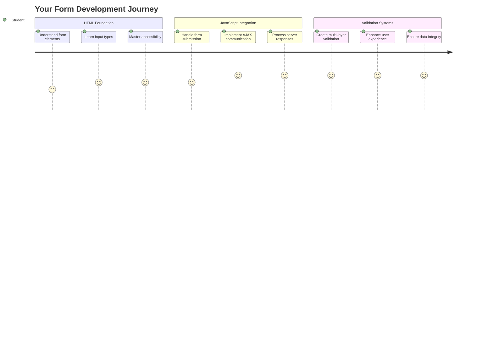
```mermaid
journey
    title Your Form Development Journey
    section HTML Foundation
      Understand form elements: 3: Student
      Learn input types: 4: Student
      Master accessibility: 4: Student
    section JavaScript Integration
      Handle form submission: 4: Student
      Implement AJAX communication: 5: Student
      Process server responses: 5: Student
    section Validation Systems
      Create multi-layer validation: 5: Student
      Enhance user experience: 5: Student
      Ensure data integrity: 5: Student
```

## Ders Öncesi Test

[Ders öncesi test](https://ff-quizzes.netlify.app/web/quiz/43)

Hiç çevrimiçi bir form doldurup e-posta formatınızın reddedildiğini gördünüz mü? Ya da gönder düğmesine bastığınızda tüm bilgilerinizin kaybolduğunu? Hepimiz bu tür sinir bozucu deneyimlerle karşılaştık.

Formlar, kullanıcılarınız ile uygulamanızın işlevselliği arasındaki köprüdür. Hava trafik kontrolörlerinin uçakları güvenli bir şekilde yönlendirmek için kullandıkları dikkatli protokoller gibi, iyi tasarlanmış formlar net geri bildirim sağlar ve maliyetli hataları önler. Öte yandan, kötü tasarlanmış formlar, kullanıcıları yoğun bir havaalanındaki yanlış iletişimden daha hızlı bir şekilde uzaklaştırabilir.

Bu derste, statik bankacılık uygulamanızı interaktif bir uygulamaya dönüştüreceğiz. Kullanıcı girdilerini doğrulayan, sunucularla iletişim kuran ve yardımcı geri bildirim sağlayan formlar oluşturmayı öğreneceksiniz. Bunu, kullanıcıların uygulamanızın özelliklerini gezinmesine olanak tanıyan kontrol arayüzünü oluşturmak olarak düşünebilirsiniz.

Sonunda, kullanıcıları hayal kırıklığına uğratmak yerine başarıya yönlendiren doğrulama ile tam bir giriş ve kayıt sistemine sahip olacaksınız.

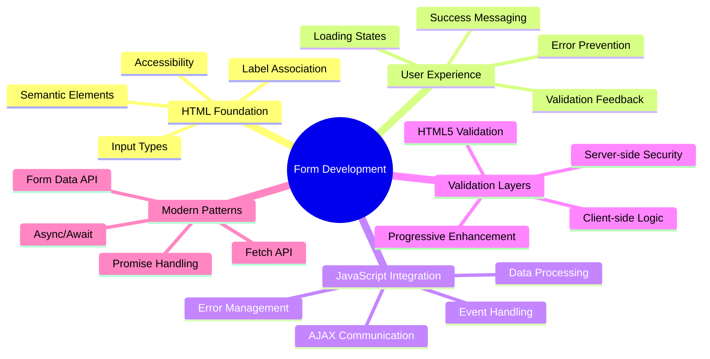
```mermaid
mindmap
  root((Form Development))
    HTML Foundation
      Semantic Elements
      Input Types
      Accessibility
      Label Association
    User Experience
      Validation Feedback
      Error Prevention
      Loading States
      Success Messaging
    JavaScript Integration
      Event Handling
      AJAX Communication
      Data Processing
      Error Management
    Validation Layers
      HTML5 Validation
      Client-side Logic
      Server-side Security
      Progressive Enhancement
    Modern Patterns
      Fetch API
      Async/Await
      Form Data API
      Promise Handling
```

## Ön Koşullar

Formlar oluşturmaya başlamadan önce, her şeyin doğru bir şekilde ayarlandığından emin olalım. Bu ders, bir önceki derste bıraktığımız yerden devam ediyor, bu yüzden eğer atladıysanız, önce temel bilgileri çalışmak isteyebilirsiniz.

### Gerekli Kurulum

| Bileşen | Durum | Açıklama |
|---------|-------|----------|
| [HTML Şablonları](../1-template-route/README.md) | ✅ Gerekli | Temel bankacılık uygulaması yapısı |
| [Node.js](https://nodejs.org) | ✅ Gerekli | Sunucu için JavaScript çalışma zamanı |
| [Bank API Sunucusu](../api/README.md) | ✅ Gerekli | Veri depolama için arka uç hizmeti |

> 💡 **Geliştirme İpucu**: Ön uç bankacılık uygulamanız için bir sunucu ve arka uç API için başka bir sunucu olmak üzere iki ayrı sunucuyu aynı anda çalıştıracaksınız. Bu kurulum, ön uç ve arka uç hizmetlerinin bağımsız olarak çalıştığı gerçek dünya geliştirme ortamını yansıtır.

### Sunucu Yapılandırması

**Geliştirme ortamınız şunları içerecek:**
- **Ön uç sunucusu**: Bankacılık uygulamanızı sunar (genellikle `3000` portu)
- **Arka uç API sunucusu**: Veri depolama ve alma işlemlerini yönetir (`5000` portu)
- **Her iki sunucu** aynı anda çakışma olmadan çalışabilir

**API bağlantınızı test etme:**
```bash
curl http://localhost:5000/api
# Expected response: "Bank API v1.0.0"
```

**API sürüm yanıtını görüyorsanız, devam etmeye hazırsınız!**

---

## HTML Formlarını ve Kontrollerini Anlama

HTML formları, kullanıcıların web uygulamanızla iletişim kurma yoludur. Bunları, 19. yüzyılda uzak yerleri birbirine bağlayan telgraf sistemi gibi düşünebilirsiniz – kullanıcı niyeti ile uygulama yanıtı arasındaki iletişim protokolüdür. Düşünceli bir şekilde tasarlandığında, hataları yakalar, giriş formatını yönlendirir ve yardımcı öneriler sağlar.

Modern formlar, temel metin girişlerinden çok daha sofistike hale geldi. HTML5, e-posta doğrulama, sayı formatlama ve tarih seçimi gibi işlemleri otomatik olarak gerçekleştiren özel giriş türleri tanıttı. Bu iyileştirmeler hem erişilebilirlik hem de mobil kullanıcı deneyimlerine fayda sağlar.

### Temel Form Elemanları

**Her formun ihtiyaç duyduğu yapı taşları:**

```html
<!-- Basic form structure -->
<form id="userForm" method="POST">
  <label for="username">Username</label>
  <input id="username" name="username" type="text" required>
  
  <button type="submit">Submit</button>
</form>
```

**Bu kodun yaptığı şey:**
- **Bir form konteyneri** oluşturur ve benzersiz bir kimlik atar
- **Veri gönderimi için** HTTP yöntemini belirtir
- **Etiketleri** erişilebilirlik için girişlerle ilişkilendirir
- **Formu işlemek için** bir gönder düğmesi tanımlar

### Modern Giriş Türleri ve Özellikleri

| Giriş Türü | Amaç | Örnek Kullanım |
|------------|------|----------------|
| `text` | Genel metin girişi | `<input type="text" name="username">` |
| `email` | E-posta doğrulama | `<input type="email" name="email">` |
| `password` | Gizli metin girişi | `<input type="password" name="password">` |
| `number` | Sayısal giriş | `<input type="number" name="balance" min="0">` |
| `tel` | Telefon numaraları | `<input type="tel" name="phone">` |

> 💡 **Modern HTML5 Avantajı**: Belirli giriş türlerini kullanmak, ek JavaScript olmadan otomatik doğrulama, uygun mobil klavyeler ve daha iyi erişilebilirlik desteği sağlar!

### Düğme Türleri ve Davranışları

```html
<!-- Different button behaviors -->
<button type="submit">Save Data</button>     <!-- Submits the form -->
<button type="reset">Clear Form</button>    <!-- Resets all fields -->
<button type="button">Custom Action</button> <!-- No default behavior -->
```

**Her düğme türünün yaptığı şey:**
- **Gönder düğmeleri**: Form gönderimini tetikler ve verileri belirtilen uç noktaya gönderir
- **Sıfırla düğmeleri**: Tüm form alanlarını başlangıç durumuna geri döndürür
- **Normal düğmeler**: Varsayılan bir davranış sağlamaz, işlevsellik için özel JavaScript gerektirir

> ⚠️ **Önemli Not**: `<input>` öğesi kendini kapatır ve kapanış etiketi gerektirmez. Modern en iyi uygulama, `<input>` yazmaktır.

### Giriş Formunuzu Oluşturma

Şimdi modern HTML form uygulamalarını gösteren pratik bir giriş formu oluşturalım. Temel bir yapı ile başlayacağız ve erişilebilirlik özellikleri ve doğrulama ile kademeli olarak geliştireceğiz.

```html
<template id="login">
  <h1>Bank App</h1>
  <section>
    <h2>Login</h2>
    <form id="loginForm" novalidate>
      <div class="form-group">
        <label for="username">Username</label>
        <input id="username" name="user" type="text" required 
               autocomplete="username" placeholder="Enter your username">
      </div>
      <button type="submit">Login</button>
    </form>
  </section>
</template>
```

**Burada olanları açıklamak:**
- **Formu** semantik HTML5 öğeleriyle yapılandırır
- **İlgili öğeleri** anlamlı sınıflara sahip `div` konteynerleri kullanarak gruplar
- **Etiketleri** `for` ve `id` özellikleriyle girişlerle ilişkilendirir
- **Daha iyi kullanıcı deneyimi için** `autocomplete` ve `placeholder` gibi modern özellikler ekler
- **Doğrulamayı** tarayıcı varsayılanları yerine JavaScript ile yönetmek için `novalidate` ekler

### Doğru Etiketlerin Gücü

**Modern web geliştirme için etiketlerin önemi:**

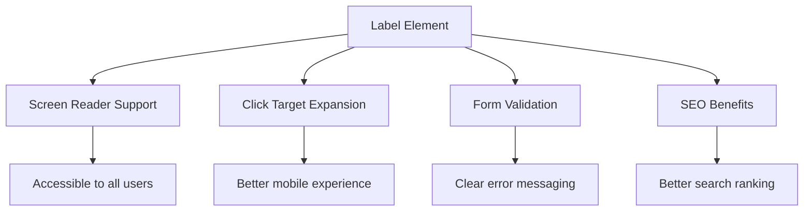
```mermaid
graph TD
    A[Label Element] --> B[Screen Reader Support]
    A --> C[Click Target Expansion]
    A --> D[Form Validation]
    A --> E[SEO Benefits]
    
    B --> F[Accessible to all users]
    C --> G[Better mobile experience]
    D --> H[Clear error messaging]
    E --> I[Better search ranking]
```

**Doğru etiketlerin sağladıkları:**
- **Ekran okuyucuların** form alanlarını net bir şekilde duyurmasını sağlar
- **Tıklanabilir alanı** genişletir (etiketi tıklamak girişi odaklar)
- **Mobil kullanılabilirliği** daha büyük dokunmatik hedeflerle iyileştirir
- **Form doğrulamasını** anlamlı hata mesajlarıyla destekler
- **SEO'yu** form öğelerine semantik anlam sağlayarak geliştirir

> 🎯 **Erişilebilirlik Hedefi**: Her form girişi bir etiketle ilişkilendirilmelidir. Bu basit uygulama, formlarınızı engelli kullanıcılar dahil herkes için kullanılabilir hale getirir ve tüm kullanıcılar için deneyimi iyileştirir.

### Kayıt Formu Oluşturma

Kayıt formu, eksiksiz bir kullanıcı hesabı oluşturmak için daha ayrıntılı bilgi gerektirir. Modern HTML5 özellikleri ve geliştirilmiş erişilebilirlik ile bunu oluşturalım.

```html
<hr/>
<h2>Register</h2>
<form id="registerForm" novalidate>
  <div class="form-group">
    <label for="user">Username</label>
    <input id="user" name="user" type="text" required 
           autocomplete="username" placeholder="Choose a username">
  </div>
  
  <div class="form-group">
    <label for="currency">Currency</label>
    <input id="currency" name="currency" type="text" value="$" 
           required maxlength="3" placeholder="USD, EUR, etc.">
  </div>
  
  <div class="form-group">
    <label for="description">Account Description</label>
    <input id="description" name="description" type="text" 
           maxlength="100" placeholder="Personal savings, checking, etc.">
  </div>
  
  <div class="form-group">
    <label for="balance">Starting Balance</label>
    <input id="balance" name="balance" type="number" value="0" 
           min="0" step="0.01" placeholder="0.00">
  </div>
  
  <button type="submit">Create Account</button>
</form>
```

**Yukarıda şunları yaptık:**
- **Her alanı** daha iyi stil ve düzen için konteyner div'lerde organize ettik
- **Tarayıcı otomatik doldurma desteği için** uygun `autocomplete` özellikleri ekledik
- **Kullanıcı girişini yönlendirmek için** yardımcı placeholder metni ekledik
- **Mantıklı varsayılanlar** ayarlamak için `value` özelliğini kullandık
- **Doğrulama özellikleri** ekledik (`required`, `maxlength`, `min` gibi)
- **Balance alanı için** ondalık destekle `type="number"` kullandık

### Giriş Türlerini ve Davranışlarını Keşfetme

**Modern giriş türleri geliştirilmiş işlevsellik sağlar:**

| Özellik | Faydası | Örnek |
|---------|--------|-------|
| `type="number"` | Mobilde sayısal klavye | Daha kolay bakiye girişi |
| `step="0.01"` | Ondalık hassasiyet kontrolü | Para biriminde kuruşlara izin verir |
| `autocomplete` | Tarayıcı otomatik doldurma | Daha hızlı form doldurma |
| `placeholder` | Bağlamsal ipuçları | Kullanıcı beklentilerini yönlendirir |

> 🎯 **Erişilebilirlik Mücadelesi**: Formları yalnızca klavyenizi kullanarak gezmeyi deneyin! Alanlar arasında geçiş yapmak için `Tab`, kutuları işaretlemek için `Space` ve göndermek için `Enter` kullanın. Bu deneyim, ekran okuyucu kullanıcılarının formlarınızla nasıl etkileşimde bulunduğunu anlamanıza yardımcı olur.

### 🔄 **Pedagojik Kontrol**
**Form Temeli Anlayışı**: JavaScript uygulamadan önce şunları anladığınızdan emin olun:
- ✅ Semantik HTML'nin erişilebilir form yapıları oluşturduğu
- ✅ Giriş türlerinin mobil klavyeler ve doğrulama için neden önemli olduğu
- ✅ Etiketler ile form kontrolleri arasındaki ilişki
- ✅ Form özelliklerinin tarayıcı varsayılan davranışını nasıl etkilediği

**Hızlı Kendini Test Etme**: JavaScript olmadan bir form gönderirseniz ne olur?
*Cevap: Tarayıcı varsayılan gönderimi gerçekleştirir, genellikle action URL'sine yönlendirir*

**HTML5 Form Faydaları**: Modern formlar şunları sağlar:
- **Yerleşik Doğrulama**: Otomatik e-posta ve sayı format kontrolü
- **Mobil Optimizasyon**: Farklı giriş türleri için uygun klavyeler
- **Erişilebilirlik**: Ekran okuyucu desteği ve klavye navigasyonu
- **Kademeli Geliştirme**: JavaScript devre dışı olduğunda bile çalışır

## Form Gönderim Yöntemlerini Anlama

Birisi formunuzu doldurup gönder düğmesine bastığında, bu verilerin bir yere gitmesi gerekir – genellikle bunu kaydedebilecek bir sunucuya. Bunun gerçekleşmesi için birkaç farklı yol vardır ve hangisini kullanacağınızı bilmek, ileride bazı baş ağrılarından kurtulmanızı sağlayabilir.

Birisi gönder düğmesine tıkladığında gerçekte ne olduğunu inceleyelim.

### Varsayılan Form Davranışı

Öncelikle, temel form gönderimiyle ne olduğunu gözlemleyelim:

**Mevcut formlarınızı test edin:**
1. Formunuzdaki *Kayıt Ol* düğmesine tıklayın
2. Tarayıcınızın adres çubuğundaki değişiklikleri gözlemleyin
3. Sayfanın yeniden yüklendiğini ve verilerin URL'de göründüğünü fark edin


### HTTP Yöntemleri Karşılaştırması

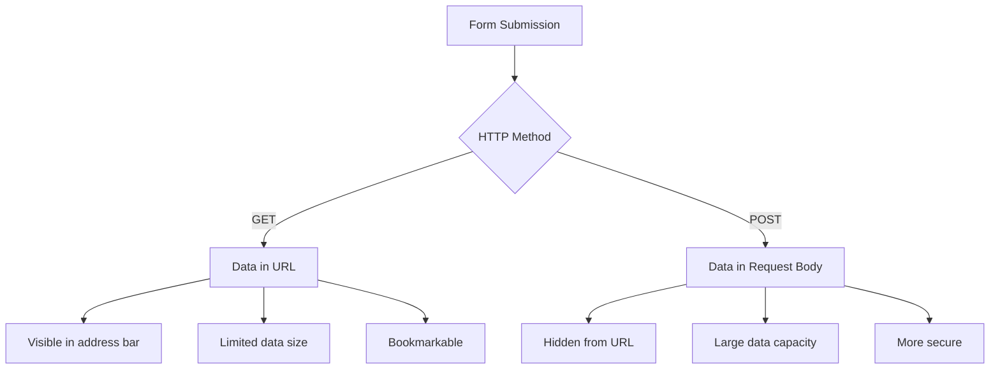
```mermaid
graph TD
    A[Form Submission] --> B{HTTP Method}
    B -->|GET| C[Data in URL]
    B -->|POST| D[Data in Request Body]
    
    C --> E[Visible in address bar]
    C --> F[Limited data size]
    C --> G[Bookmarkable]
    
    D --> H[Hidden from URL]
    D --> I[Large data capacity]
    D --> J[More secure]
```

**Farklılıkları anlamak:**

| Yöntem | Kullanım Durumu | Veri Konumu | Güvenlik Seviyesi | Boyut Sınırı |
|--------|----------------|-------------|-------------------|-------------|
| `GET` | Arama sorguları, filtreler | URL parametreleri | Düşük (görünür) | ~2000 karakter |
| `POST` | Kullanıcı hesapları, hassas veriler | İstek gövdesi | Daha yüksek (gizli) | Pratikte sınır yok |

**Temel farklılıkları anlamak:**
- **GET**: Form verilerini URL'ye sorgu parametreleri olarak ekler (arama işlemleri için uygundur)
- **POST**: Verileri istek gövdesine dahil eder (hassas bilgiler için gereklidir)
- **GET sınırlamaları**: Boyut kısıtlamaları, görünür veriler, kalıcı tarayıcı geçmişi
- **POST avantajları**: Büyük veri kapasitesi, gizlilik koruması, dosya yükleme desteği

> 💡 **En İyi Uygulama**: Arama formları ve filtreler için `GET` kullanın (veri alma), kullanıcı kaydı, giriş ve veri oluşturma için `POST` kullanın.

### Form Gönderimini Yapılandırma

Kayıt formunuzu POST yöntemi kullanarak arka uç API ile doğru şekilde iletişim kuracak şekilde yapılandıralım:

```html
<form id="registerForm" action="//localhost:5000/api/accounts" 
      method="POST" novalidate>
```

**Bu yapılandırmanın yaptığı şey:**
- **Form gönderimini** API uç noktasına yönlendirir
- **Güvenli veri iletimi için** POST yöntemini kullanır
- **Doğrulamayı** tarayıcı varsayılanları yerine JavaScript ile yönetmek için `novalidate` ekler

### Form Gönderimini Test Etme

**Formunuzu test etmek için şu adımları izleyin:**
1. **Kayıt formunu** kendi bilgilerinizle doldurun
2. **"Hesap Oluştur"** düğmesine tıklayın
3. **Sunucu yanıtını** tarayıcınızda gözlemleyin

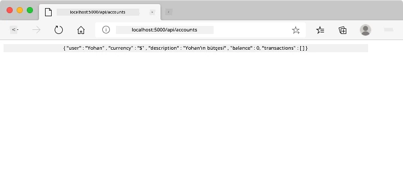

**Görmeniz gerekenler:**
- **Tarayıcı** API uç noktasının URL'sine yönlendirme yapar
- **JSON yanıtı**, yeni oluşturulan hesap verilerinizi içerir
- **Sunucu onayı**, hesabın başarıyla oluşturulduğunu belirtir

> 🧪 **Deney Zamanı**: Aynı kullanıcı adıyla tekrar kayıt olmayı deneyin. Hangi yanıtı alıyorsunuz? Bu, sunucunun yinelenen verileri ve hata koşullarını nasıl ele aldığını anlamanıza yardımcı olur.

### JSON Yanıtlarını Anlama

**Sunucu formunuzu başarıyla işlediğinde:**
```json
{
  "user": "john_doe",
  "currency": "$",
  "description": "Personal savings",
  "balance": 100,
  "id": "unique_account_id"
}
```

**Bu yanıt şunları doğrular:**
- **Belirttiğiniz verilerle** yeni bir hesap oluşturur
- **Gelecekteki referans için** benzersiz bir kimlik atar
- **Tüm hesap bilgilerini** doğrulama için geri döndürür
- **Veritabanı depolamasının** başarılı olduğunu belirtir

## Modern Form İşleme ile JavaScript

Geleneksel form gönderimleri, erken uzay görevlerinin yön düzeltmeleri için tam sistem sıfırlamaları gerektirdiği gibi, tam sayfa yenilemelerine neden olur. Bu yaklaşım kullanıcı deneyimini kesintiye uğratır ve uygulama durumunu kaybeder.

JavaScript form işleme, modern uzay araçlarının sürekli rehberlik sistemleri gibi çalışır – kullanıcı konumunu korurken gerçek zamanlı ayarlamalar yapar. Form gönderimlerini durdurabilir, anında geri bildirim sağlayabilir, hataları zarif bir şekilde ele alabilir ve kullanıcıyı uygulama içinde tutarak sunucu yanıtlarına göre arayüzü güncelleyebiliriz.

### Sayfa Yenilemelerinden Kaçınmanın Önemi

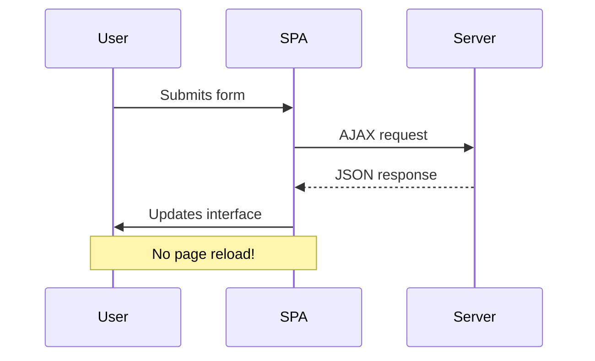
```mermaid
sequenceDiagram
    participant User
    participant SPA
    participant Server
    
    User->>SPA: Submits form
    SPA->>Server: AJAX request
    Server-->>SPA: JSON response
    SPA->>User: Updates interface
    
    Note over User,SPA: No page reload!
```

**JavaScript form işleme avantajları:**
- **Uygulama durumunu ve kullanıcı bağlamını korur**
- **Anında geri bildirim ve yükleme göstergeleri sağlar**
- **Dinamik hata işleme ve doğrulama sağlar**
- **Sorunsuz, uygulama benzeri kullanıcı deneyimleri oluşturur**
- **Sunucu yanıtlarına dayalı koşullu mantık sağlar**

### Gelenekselden Moderne Formlara Geçiş

**Geleneksel yaklaşımın zorlukları:**
- **Kullanıcıları** uygulamanızdan uzaklaştırır
- **Mevcut uygulama durumunu ve bağlamını kaybeder**
- **Basit işlemler için tam sayfa yenilemeler gerektirir**
- **Kullanıcı geri bildirimi üzerinde sınırlı kontrol sağlar**

**Modern JavaScript yaklaşımının avantajları:**
- **Kullanıcıları** uygulamanızda tutar
- **Tüm uygulama durumunu ve verilerini korur**
- **Gerçek zamanlı doğrulama ve geri bildirim sağlar**
- **Kademeli geliştirme ve erişilebilirliği destekler**

### JavaScript Form İşleme Uygulama

Geleneksel form gönderimini modern JavaScript olay işleme ile değiştirelim:

```html
<!-- Remove the action attribute and add event handling -->
<form id="registerForm" method="POST" novalidate>
```

**`app.js` dosyanıza kayıt mantığını ekleyin:**

```javascript
// Modern event-driven form handling
function register() {
  const registerForm = document.getElementById('registerForm');
  const formData = new FormData(registerForm);
  const data = Object.fromEntries(formData);
  const jsonData = JSON.stringify(data);
  
  console.log('Form data prepared:', data);
}

// Attach event listener when the page loads
document.addEventListener('DOMContentLoaded', () => {
  const registerForm = document.getElementById('registerForm');
  registerForm.addEventListener('submit', (event) => {
    event.preventDefault(); // Prevent default form submission
    register();
  });
});
```

**Burada olanları açıklamak:**
- **Varsayılan form gönderimini** `event.preventDefault()` ile durdurur
- **Form öğesini** modern DOM seçimi ile alır
- **Form verilerini** güçlü `FormData` API'si ile çıkarır
- **FormData'yı** `Object.fromEntries()` ile düz bir nesneye dönüştürür
- **Verileri** sunucu iletişimi için JSON formatına dönüştürür
- **İşlenmiş verileri** hata ayıklama ve doğrulama için kaydeder

### FormData API'sini Anlama

**FormData API
```javascript
// Example of what FormData captures
const formData = new FormData(registerForm);

// FormData automatically captures:
// {
//   "user": "john_doe",
//   "currency": "$", 
//   "description": "Personal account",
//   "balance": "100"
// }
```

**FormData API avantajları:**
- **Kapsamlı koleksiyon**: Metin, dosyalar ve karmaşık girdiler dahil tüm form öğelerini yakalar
- **Tür farkındalığı**: Farklı giriş türlerini otomatik olarak özel kodlama gerektirmeden işler
- **Verimlilik**: Tek bir API çağrısıyla manuel alan toplama işlemini ortadan kaldırır
- **Uyarlanabilirlik**: Form yapısı değiştikçe işlevselliği korur

### Sunucu İletişim Fonksiyonunu Oluşturma

Şimdi modern JavaScript desenlerini kullanarak API sunucunuzla iletişim kurmak için sağlam bir fonksiyon oluşturalım:

```javascript
async function createAccount(account) {
  try {
    const response = await fetch('//localhost:5000/api/accounts', {
      method: 'POST',
      headers: { 
        'Content-Type': 'application/json',
        'Accept': 'application/json'
      },
      body: account
    });
    
    // Check if the response was successful
    if (!response.ok) {
      throw new Error(`HTTP error! status: ${response.status}`);
    }
    
    return await response.json();
  } catch (error) {
    console.error('Account creation failed:', error);
    return { error: error.message || 'Network error occurred' };
  }
}
```

**Asenkron JavaScript'i Anlamak:**

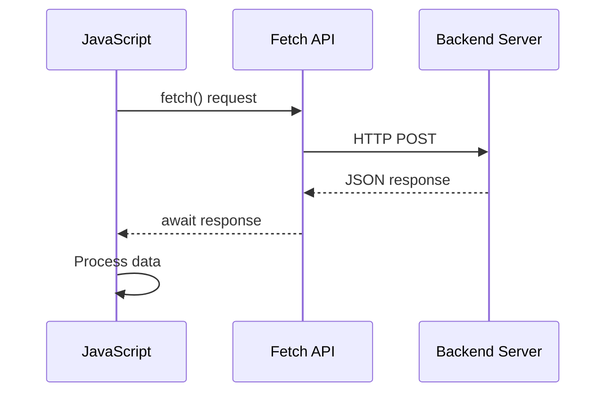
```mermaid
sequenceDiagram
    participant JS as JavaScript
    participant Fetch as Fetch API
    participant Server as Backend Server
    
    JS->>Fetch: fetch() request
    Fetch->>Server: HTTP POST
    Server-->>Fetch: JSON response
    Fetch-->>JS: await response
    JS->>JS: Process data
```

**Bu modern uygulamanın sağladıkları:**
- **Kullanır** `async/await` ile okunabilir asenkron kod
- **Doğru hata yönetimi** için try/catch bloklarını içerir
- **Yanıt durumunu kontrol eder** veriyi işlemeye başlamadan önce
- **JSON iletişimi için uygun başlıklar ayarlar**
- **Hata ayıklama için ayrıntılı hata mesajları sağlar**
- **Başarı ve hata durumları için tutarlı veri yapısı döndürür**

### Modern Fetch API'nin Gücü

**Fetch API'nin eski yöntemlere göre avantajları:**

| Özellik | Faydası | Uygulama |
|---------|---------|----------|
| Promise tabanlı | Temiz asenkron kod | `await fetch()` |
| İstek özelleştirme | Tam HTTP kontrolü | Başlıklar, yöntemler, gövde |
| Yanıt işleme | Esnek veri ayrıştırma | `.json()`, `.text()`, `.blob()` |
| Hata yönetimi | Kapsamlı hata yakalama | Try/catch blokları |

> 🎥 **Daha Fazla Öğrenin**: [Async/Await Eğitimi](https://youtube.com/watch?v=YwmlRkrxvkk) - Modern web geliştirme için asenkron JavaScript desenlerini anlamak.

**Sunucu iletişimi için temel kavramlar:**
- **Asenkron fonksiyonlar** sunucu yanıtlarını beklemek için yürütmeyi durdurmanıza olanak tanır
- **Await anahtar kelimesi** asenkron kodun senkron kod gibi okunmasını sağlar
- **Fetch API** modern, promise tabanlı HTTP istekleri sağlar
- **Hata yönetimi** uygulamanızın ağ sorunlarına karşı zarif bir şekilde yanıt vermesini sağlar

### Kayıt Fonksiyonunu Tamamlama

Her şeyi bir araya getirerek eksiksiz, üretime hazır bir kayıt fonksiyonu oluşturalım:

```javascript
async function register() {
  const registerForm = document.getElementById('registerForm');
  const submitButton = registerForm.querySelector('button[type="submit"]');
  
  try {
    // Show loading state
    submitButton.disabled = true;
    submitButton.textContent = 'Creating Account...';
    
    // Process form data
    const formData = new FormData(registerForm);
    const jsonData = JSON.stringify(Object.fromEntries(formData));
    
    // Send to server
    const result = await createAccount(jsonData);
    
    if (result.error) {
      console.error('Registration failed:', result.error);
      alert(`Registration failed: ${result.error}`);
      return;
    }
    
    console.log('Account created successfully!', result);
    alert(`Welcome, ${result.user}! Your account has been created.`);
    
    // Reset form after successful registration
    registerForm.reset();
    
  } catch (error) {
    console.error('Unexpected error:', error);
    alert('An unexpected error occurred. Please try again.');
  } finally {
    // Restore button state
    submitButton.disabled = false;
    submitButton.textContent = 'Create Account';
  }
}
```

**Bu geliştirilmiş uygulama şunları içerir:**
- **Form gönderimi sırasında görsel geri bildirim sağlar**
- **Tekrarlayan gönderimleri önlemek için gönder düğmesini devre dışı bırakır**
- **Beklenen ve beklenmeyen hataları zarif bir şekilde yönetir**
- **Kullanıcı dostu başarı ve hata mesajları gösterir**
- **Başarılı kayıt işleminden sonra formu sıfırlar**
- **Sonuç ne olursa olsun kullanıcı arayüzü durumunu geri yükler**

### Uygulamanızı Test Etme

**Tarayıcı geliştirici araçlarını açın ve kayıt işlemini test edin:**

1. **Tarayıcı konsolunu açın** (F12 → Konsol sekmesi)
2. **Kayıt formunu doldurun**
3. **"Hesap Oluştur" düğmesine tıklayın**
4. **Konsol mesajlarını ve kullanıcı geri bildirimlerini gözlemleyin**

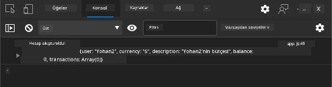

**Görmeniz gerekenler:**
- **Gönder düğmesinde** yükleme durumu görünür
- **Konsol günlükleri** işlemle ilgili ayrıntılı bilgiler gösterir
- **Başarı mesajı** hesap oluşturma başarılı olduğunda görünür
- **Form** başarılı gönderimden sonra otomatik olarak sıfırlanır

> 🔒 **Güvenlik Düşüncesi**: Şu anda veriler üretim için güvenli olmayan HTTP üzerinden iletiliyor. Gerçek uygulamalarda, veri iletimini şifrelemek için her zaman HTTPS kullanın. [HTTPS güvenliği](https://en.wikipedia.org/wiki/HTTPS) hakkında daha fazla bilgi edinin ve kullanıcı verilerini korumanın neden önemli olduğunu öğrenin.

### 🔄 **Pedagojik Kontrol**
**Modern JavaScript Entegrasyonu**: Asenkron form işleme anlayışınızı doğrulayın:
- ✅ `event.preventDefault()` varsayılan form davranışını nasıl değiştirir?
- ✅ FormData API manuel alan toplamaya göre neden daha verimlidir?
- ✅ Async/await desenleri kod okunabilirliğini nasıl artırır?
- ✅ Hata yönetimi kullanıcı deneyiminde nasıl bir rol oynar?

**Sistem Mimarisi**: Form işleme şunları gösterir:
- **Olay Tabanlı Programlama**: Formlar, sayfa yenileme olmadan kullanıcı eylemlerine yanıt verir
- **Asenkron İletişim**: Sunucu istekleri kullanıcı arayüzünü engellemez
- **Hata Yönetimi**: Ağ istekleri başarısız olduğunda zarif bir şekilde bozulma
- **Durum Yönetimi**: Kullanıcı arayüzü güncellemeleri sunucu yanıtlarını uygun şekilde yansıtır
- **Aşamalı Geliştirme**: Temel işlevsellik çalışır, JavaScript bunu geliştirir

**Profesyonel Desenler**: Şunları uyguladınız:
- **Tek Sorumluluk**: Fonksiyonlar net ve odaklanmış amaçlara sahiptir
- **Hata Sınırları**: Try/catch blokları uygulama çökmesini önler
- **Kullanıcı Geri Bildirimi**: Yükleme durumları ve başarı/hata mesajları
- **Veri Dönüşümü**: FormData'dan JSON'a sunucu iletişimi için

## Kapsamlı Form Doğrulama

Form doğrulama, yalnızca gönderimden sonra hataları keşfetmenin sinir bozucu deneyimini önler. Uluslararası Uzay İstasyonu'ndaki birden fazla yedek sistem gibi, etkili doğrulama birden fazla güvenlik kontrol katmanı kullanır.

En iyi yaklaşım, anında geri bildirim için tarayıcı düzeyinde doğrulama, geliştirilmiş kullanıcı deneyimi için JavaScript doğrulaması ve güvenlik ve veri bütünlüğü için sunucu tarafı doğrulama kombinasyonunu içerir. Bu yedeklilik hem kullanıcı memnuniyetini hem de sistem korumasını sağlar.

### Doğrulama Katmanlarını Anlamak

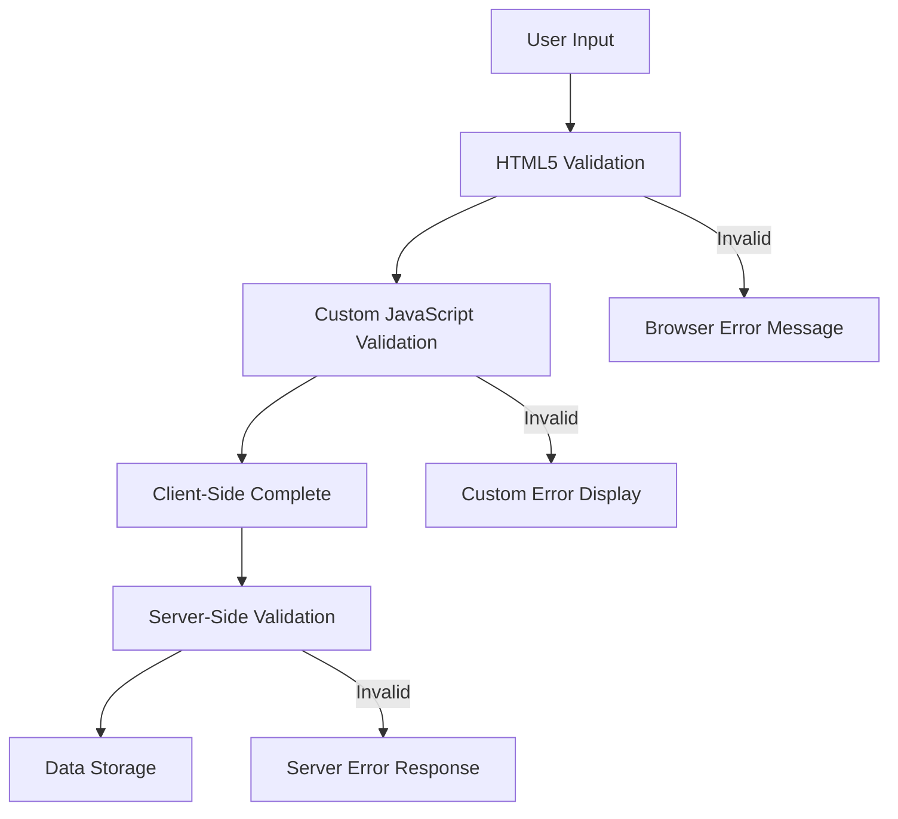
```mermaid
graph TD
    A[User Input] --> B[HTML5 Validation]
    B --> C[Custom JavaScript Validation]
    C --> D[Client-Side Complete]
    D --> E[Server-Side Validation]
    E --> F[Data Storage]
    
    B -->|Invalid| G[Browser Error Message]
    C -->|Invalid| H[Custom Error Display]
    E -->|Invalid| I[Server Error Response]
```

**Çok katmanlı doğrulama stratejisi:**
- **HTML5 doğrulama**: Anında tarayıcı tabanlı kontroller
- **JavaScript doğrulama**: Özel mantık ve kullanıcı deneyimi
- **Sunucu doğrulama**: Nihai güvenlik ve veri bütünlüğü kontrolleri
- **Aşamalı geliştirme**: JavaScript devre dışı olsa bile çalışır

### HTML5 Doğrulama Özellikleri

**Kullanımınıza sunulan modern doğrulama araçları:**

| Özellik | Amacı | Örnek Kullanım | Tarayıcı Davranışı |
|---------|-------|----------------|--------------------|
| `required` | Zorunlu alanlar | `<input required>` | Boş gönderimi önler |
| `minlength`/`maxlength` | Metin uzunluğu sınırları | `<input maxlength="20">` | Karakter sınırlarını uygular |
| `min`/`max` | Sayısal aralıklar | `<input min="0" max="1000">` | Sayı sınırlarını doğrular |
| `pattern` | Özel regex kuralları | `<input pattern="[A-Za-z]+">` | Belirli formatları eşleştirir |
| `type` | Veri türü doğrulama | `<input type="email">` | Format spesifik doğrulama |

### CSS Doğrulama Stili

**Doğrulama durumları için görsel geri bildirim oluşturun:**

```css
/* Valid input styling */
input:valid {
  border-color: #28a745;
  background-color: #f8fff9;
}

/* Invalid input styling */
input:invalid {
  border-color: #dc3545;
  background-color: #fff5f5;
}

/* Focus states for better accessibility */
input:focus:valid {
  box-shadow: 0 0 0 0.2rem rgba(40, 167, 69, 0.25);
}

input:focus:invalid {
  box-shadow: 0 0 0 0.2rem rgba(220, 53, 69, 0.25);
}
```

**Bu görsel ipuçlarının sağladıkları:**
- **Yeşil kenarlıklar**: Başarılı doğrulamayı gösterir, tıpkı kontrol merkezindeki yeşil ışıklar gibi
- **Kırmızı kenarlıklar**: Dikkat gerektiren doğrulama hatalarını işaret eder
- **Odak vurguları**: Mevcut giriş konumu için net görsel bağlam sağlar
- **Tutarlı stil**: Kullanıcıların öğrenebileceği öngörülebilir arayüz desenleri oluşturur

> 💡 **Profesyonel İpucu**: Kullanıcılar yazarken anında görsel geri bildirim sağlamak için `:valid` ve `:invalid` CSS pseudo-class'larını kullanın, böylece duyarlı ve yardımcı bir arayüz oluşturun.

### Kapsamlı Doğrulama Uygulaması

Kayıt formunuzu mükemmel bir kullanıcı deneyimi ve veri kalitesi sağlayan sağlam doğrulama ile geliştirelim:

```html
<form id="registerForm" method="POST" novalidate>
  <div class="form-group">
    <label for="user">Username <span class="required">*</span></label>
    <input id="user" name="user" type="text" required 
           minlength="3" maxlength="20" 
           pattern="[a-zA-Z0-9_]+" 
           autocomplete="username"
           title="Username must be 3-20 characters, letters, numbers, and underscores only">
    <small class="form-text">Choose a unique username (3-20 characters)</small>
  </div>
  
  <div class="form-group">
    <label for="currency">Currency <span class="required">*</span></label>
    <input id="currency" name="currency" type="text" required 
           value="$" maxlength="3" 
           pattern="[A-Z$€£¥₹]+" 
           title="Enter a valid currency symbol or code">
    <small class="form-text">Currency symbol (e.g., $, €, £)</small>
  </div>
  
  <div class="form-group">
    <label for="description">Account Description</label>
    <input id="description" name="description" type="text" 
           maxlength="100" 
           placeholder="Personal savings, checking, etc.">
    <small class="form-text">Optional description (up to 100 characters)</small>
  </div>
  
  <div class="form-group">
    <label for="balance">Starting Balance</label>
    <input id="balance" name="balance" type="number" 
           value="0" min="0" step="0.01" 
           title="Enter a positive number for your starting balance">
    <small class="form-text">Initial account balance (minimum $0.00)</small>
  </div>
  
  <button type="submit">Create Account</button>
</form>
```

**Geliştirilmiş doğrulamayı anlamak:**
- **Zorunlu alan göstergelerini** yardımcı açıklamalarla birleştirir
- **Format doğrulama için** `pattern` özelliklerini içerir
- **Erişilebilirlik ve ipuçları için** `title` özellikleri sağlar
- **Kullanıcı girişini yönlendirmek için** yardımcı metin ekler
- **Daha iyi erişilebilirlik için** semantik HTML yapısı kullanır

### Gelişmiş Doğrulama Kuralları

**Her doğrulama kuralının sağladıkları:**

| Alan | Doğrulama Kuralları | Kullanıcı Faydası |
|------|---------------------|------------------|
| Kullanıcı Adı | `required`, `minlength="3"`, `maxlength="20"`, `pattern="[a-zA-Z0-9_]+"` | Geçerli, benzersiz tanımlayıcılar sağlar |
| Para Birimi | `required`, `maxlength="3"`, `pattern="[A-Z$€£¥₹]+"` | Yaygın para birimi sembollerini kabul eder |
| Bakiye | `min="0"`, `step="0.01"`, `type="number"` | Negatif bakiyeleri önler |
| Açıklama | `maxlength="100"` | Makul uzunluk sınırları |

### Doğrulama Davranışını Test Etme

**Bu doğrulama senaryolarını deneyin:**
1. **Boş zorunlu alanlarla** formu gönderin
2. **3 karakterden kısa bir kullanıcı adı girin**
3. **Kullanıcı adı alanına özel karakterler deneyin**
4. **Negatif bir bakiye miktarı girin**

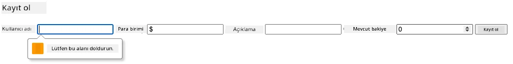

**Gözlemleyecekleriniz:**
- **Tarayıcı** yerel doğrulama mesajlarını gösterir
- **Stil değişiklikleri** `:valid` ve `:invalid` durumlarına göre değişir
- **Form gönderimi** tüm doğrulamalar geçene kadar engellenir
- **Odak otomatik olarak** ilk geçersiz alana taşınır

### İstemci Tarafı ve Sunucu Tarafı Doğrulama

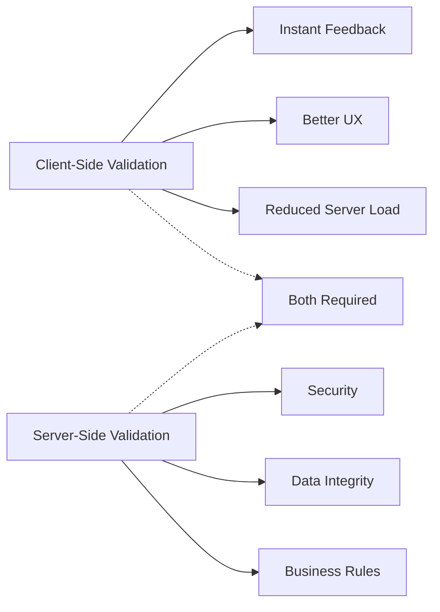
```mermaid
graph LR
    A[Client-Side Validation] --> B[Instant Feedback]
    A --> C[Better UX]
    A --> D[Reduced Server Load]
    
    E[Server-Side Validation] --> F[Security]
    E --> G[Data Integrity]
    E --> H[Business Rules]
    
    A -.-> I[Both Required]
    E -.-> I
```

**Neden her iki katmana ihtiyacınız var:**
- **İstemci tarafı doğrulama**: Anında geri bildirim sağlar ve kullanıcı deneyimini iyileştirir
- **Sunucu tarafı doğrulama**: Güvenliği sağlar ve karmaşık iş kurallarını işler
- **Kombine yaklaşım**: Sağlam, kullanıcı dostu ve güvenli uygulamalar oluşturur
- **Aşamalı geliştirme**: JavaScript devre dışı olsa bile çalışır

> 🛡️ **Güvenlik Hatırlatması**: Yalnızca istemci tarafı doğrulamaya güvenmeyin! Kötü niyetli kullanıcılar istemci tarafı kontrollerini atlayabilir, bu nedenle sunucu tarafı doğrulama güvenlik ve veri bütünlüğü için gereklidir.

### ⚡ **Sonraki 5 Dakikada Yapabilecekleriniz**
- [ ] Geçersiz verilerle formunuzu test edin ve doğrulama mesajlarını görün
- [ ] HTML5 doğrulamayı görmek için formu JavaScript devre dışı bırakılmış şekilde gönderin
- [ ] Tarayıcı geliştirici araçlarını açın ve sunucuya gönderilen form verilerini inceleyin
- [ ] Mobil klavye değişikliklerini görmek için farklı giriş türlerini deneyin

### 🎯 **Bu Saatte Başarabilecekleriniz**
- [ ] Ders sonrası testi tamamlayın ve form işleme kavramlarını anlayın
- [ ] Gerçek zamanlı geri bildirimle kapsamlı doğrulama zorluğunu uygulayın
- [ ] Profesyonel görünümlü formlar oluşturmak için CSS stilini ekleyin
- [ ] Çift kullanıcı adları ve sunucu hataları için hata yönetimi ekleyin
- [ ] Eşleşen doğrulama ile şifre onay alanları ekleyin

### 📅 **Bir Haftalık Form Ustalığı Yolculuğunuz**
- [ ] Gelişmiş form özellikleriyle tam bir bankacılık uygulaması tamamlayın
- [ ] Profil resimleri veya belgeler için dosya yükleme yetenekleri ekleyin
- [ ] İlerleme göstergeleri ve durum yönetimi ile çok adımlı formlar ekleyin
- [ ] Kullanıcı seçimlerine göre uyarlanan dinamik formlar oluşturun
- [ ] Daha iyi kullanıcı deneyimi için form otomatik kaydetme ve kurtarma ekleyin
- [ ] E-posta doğrulama ve telefon numarası formatlama gibi gelişmiş doğrulama ekleyin

### 🌟 **Bir Aylık Frontend Geliştirme Ustalığı**
- [ ] Koşullu mantık ve iş akışları ile karmaşık form uygulamaları oluşturun
- [ ] Hızlı geliştirme için form kütüphanelerini ve çerçevelerini öğrenin
- [ ] Erişilebilirlik yönergeleri ve kapsayıcı tasarım ilkelerini öğrenin
- [ ] Küresel formlar için uluslararasılaştırma ve yerelleştirme uygulayın
- [ ] Yeniden kullanılabilir form bileşen kütüphaneleri ve tasarım sistemleri oluşturun
- [ ] Açık kaynak form projelerine katkıda bulunun ve en iyi uygulamaları paylaşın

## 🎯 Form Geliştirme Ustalığı Zaman Çizelgeniz

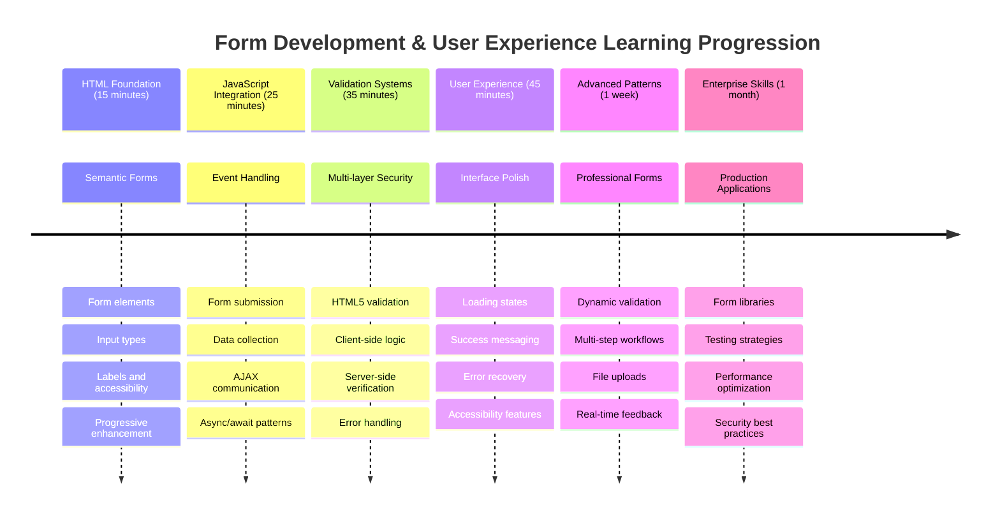
```mermaid
timeline
    title Form Development & User Experience Learning Progression
    
    section HTML Foundation (15 minutes)
        Semantic Forms: Form elements
                      : Input types
                      : Labels and accessibility
                      : Progressive enhancement
        
    section JavaScript Integration (25 minutes)
        Event Handling: Form submission
                      : Data collection
                      : AJAX communication
                      : Async/await patterns
        
    section Validation Systems (35 minutes)
        Multi-layer Security: HTML5 validation
                            : Client-side logic
                            : Server-side verification
                            : Error handling
        
    section User Experience (45 minutes)
        Interface Polish: Loading states
                        : Success messaging
                        : Error recovery
                        : Accessibility features
        
    section Advanced Patterns (1 week)
        Professional Forms: Dynamic validation
                          : Multi-step workflows
                          : File uploads
                          : Real-time feedback
        
    section Enterprise Skills (1 month)
        Production Applications: Form libraries
                               : Testing strategies
                               : Performance optimization
                               : Security best practices
```

### 🛠️ Form Geliştirme Araç Seti Özeti

Bu dersi tamamladıktan sonra şunları ustalıkla yapabilirsiniz:
- **HTML5 Formlar**: Anlamsal yapı, giriş türleri ve erişilebilirlik özellikleri
- **JavaScript Form İşleme**: Olay yönetimi, veri toplama ve AJAX iletişimi
- **Doğrulama Mimarisi**: Güvenlik ve kullanıcı deneyimi için çok katmanlı doğrulama
- **Asenkron Programlama**: Modern fetch API ve async/await desenleri
- **Hata Yönetimi**: Kapsamlı hata yönetimi ve kullanıcı geri bildirim sistemleri
- **Kullanıcı Deneyimi Tasarımı**: Yükleme durumları, başarı mesajları ve hata kurtarma
- **Aşamalı Geliştirme**: Tüm tarayıcılar ve yetenekler için çalışan formlar

**Gerçek Dünya Uygulamaları**: Form geliştirme becerileriniz doğrudan şunlara uygulanabilir:
- **E-ticaret Uygulamaları**: Ödeme süreçleri, hesap kaydı ve ödeme formları
- **Kurumsal Yazılım**: Veri giriş sistemleri, raporlama arayüzleri ve iş akışı uygulamaları
- **İçerik Yönetimi**: Yayın platformları, kullanıcı tarafından oluşturulan içerik ve yönetim arayüzleri
- **Finansal Uygulamalar**: Bankacılık arayüzleri, yatırım platformları ve işlem sistemleri
- **Sağlık Sistemleri**: Hasta portalları, randevu planlama ve tıbbi kayıt formları
- **Eğitim Platformları**: Kurs kaydı, değerlendirme araçları ve öğrenme yönetimi

**Kazanılan Profesyonel Beceriler**: Artık şunları yapabilirsiniz:
- **Erişilebilir formlar tasarlayın**: Engelli kullanıcılar dahil tüm kullanıcılar için çalışan formlar
- **Güvenli form doğrulama uygulayın**: Veri bozulmasını ve güvenlik açıklarını önler
- **Duyarlı kullanıcı arayüzleri oluşturun**: Net geri bildirim ve rehberlik sağlar
- **Karmaşık form etkileşimlerini hata ayıklayın**: Tarayıcı geliştirici araçları ve ağ analizi kullanarak
- **Form performansını optimize edin**: Verimli veri işleme ve doğrulama stratejileri ile

**Frontend Geliştirme Kavramlarında Ustalık**:
- **Olay Tabanlı Mimari**: Kullanıcı etkileşim yönetimi ve yanıt sistemleri
- **Asenkron Programlama**: Bloklamayan sunucu iletişimi ve hata yönetimi
- **Veri Doğrulama**: İstemci tarafı ve sunucu tarafı güvenlik ve bütünlük kontrolleri
- **Kullanıcı Deneyimi Tasarımı**: Kullanıcıları başarıya yönlendiren sezgisel arayüzler
- **Erişilebilirlik Mühendisliği**: Çeşitli kullanıcı ihtiyaçları için kapsayıcı tasarım

**Bir Sonraki Seviye**: Gelişmiş form kütü
**İstek:** Kayıt formu için eksiksiz bir form doğrulama sistemi oluşturun. Bu sistem şunları içermelidir: 1) Kullanıcı yazarken her alan için gerçek zamanlı doğrulama geri bildirimi, 2) Her giriş alanının altında görünen özel doğrulama mesajları, 3) Şifre doğrulama alanı ve eşleşme doğrulaması, 4) Geçerli alanlar için yeşil onay işaretleri ve geçersiz alanlar için kırmızı uyarılar gibi görsel göstergeler, 5) Tüm doğrulamalar geçtiğinde etkinleşen bir gönderme düğmesi. HTML5 doğrulama özelliklerini, doğrulama durumlarını stilize etmek için CSS'yi ve etkileşimli davranış için JavaScript'i kullanın.

[agent mode](https://code.visualstudio.com/blogs/2025/02/24/introducing-copilot-agent-mode) hakkında daha fazla bilgi edinin.

## 🚀 Zorluk

Kullanıcı zaten varsa HTML'de bir hata mesajı gösterin.

İşte biraz stil ekledikten sonra son giriş sayfasının nasıl görünebileceğine dair bir örnek:

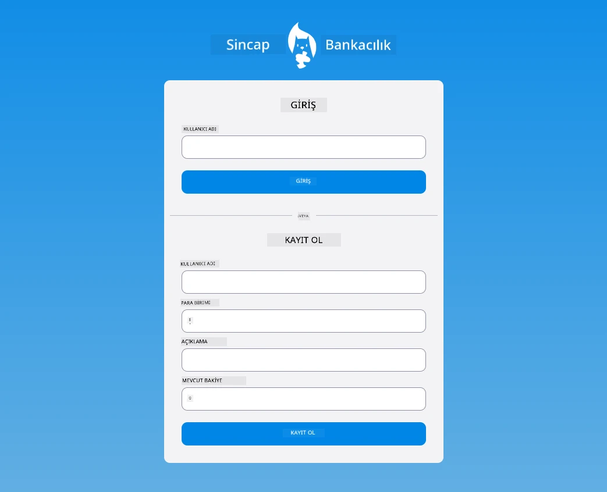

## Ders Sonrası Test

[Ders sonrası test](https://ff-quizzes.netlify.app/web/quiz/44)

## İnceleme ve Kendi Kendine Çalışma

Geliştiriciler, özellikle doğrulama stratejileri konusunda form oluşturma çabalarında oldukça yaratıcı hale geldiler. [CodePen](https://codepen.io/) üzerinden farklı form akışlarını inceleyerek bilgi edinin; ilginç ve ilham verici formlar bulabilir misiniz?

## Ödev

[Bankacılık uygulamanızı stilize edin](assignment.md)

---

**Feragatname**:  
Bu belge, AI çeviri hizmeti [Co-op Translator](https://github.com/Azure/co-op-translator) kullanılarak çevrilmiştir. Doğruluk için çaba göstersek de, otomatik çevirilerin hata veya yanlışlıklar içerebileceğini lütfen unutmayın. Belgenin orijinal dili, yetkili kaynak olarak kabul edilmelidir. Kritik bilgiler için profesyonel insan çevirisi önerilir. Bu çevirinin kullanımından kaynaklanan yanlış anlamalar veya yanlış yorumlamalar için sorumluluk kabul etmiyoruz.