<!--
CO_OP_TRANSLATOR_METADATA:
{
  "original_hash": "86ee5069f27ea3151389d8687c95fac9",
  "translation_date": "2025-11-04T00:57:40+00:00",
  "source_file": "7-bank-project/3-data/README.md",
  "language_code": "tr"
}
-->
# Bankacılık Uygulaması Geliştirme Bölüm 3: Verileri Alma ve Kullanma Yöntemleri

Star Trek'teki Enterprise'ın bilgisayarını düşünün - Kaptan Picard geminin durumunu sorduğunda, bilgi anında görünür ve tüm arayüz kapanıp yeniden inşa edilmez. İşte burada, dinamik veri alma ile bu kesintisiz bilgi akışını oluşturuyoruz.

Şu anda bankacılık uygulamanız basılı bir gazete gibi - bilgilendirici ama statik. Bunu NASA'nın görev kontrol merkezi gibi bir şeye dönüştüreceğiz; burada veriler sürekli akar ve gerçek zamanlı olarak güncellenir, kullanıcıların iş akışını kesintiye uğratmadan.

Sunucularla asenkron olarak nasıl iletişim kuracağınızı, farklı zamanlarda gelen verileri nasıl yöneteceğinizi ve ham bilgileri kullanıcılarınız için anlamlı bir şeye nasıl dönüştüreceğinizi öğreneceksiniz. Bu, bir demo ile üretime hazır bir yazılım arasındaki farktır.

## ⚡ Sonraki 5 Dakikada Yapabilecekleriniz

**Yoğun Geliştiriciler için Hızlı Başlangıç Yolu**

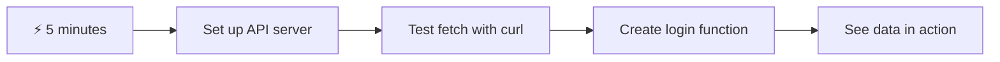

- **Dakika 1-2**: API sunucunuzu başlatın (`cd api && npm start`) ve bağlantıyı test edin
- **Dakika 3**: `getAccount()` adlı temel bir işlev oluşturun ve fetch kullanın
- **Dakika 4**: Giriş formunu `action="javascript:login()"` ile bağlayın
- **Dakika 5**: Girişi test edin ve hesap verilerinin konsolda göründüğünü izleyin

**Hızlı Test Komutları**:
```bash
# Verify API is running
curl http://localhost:5000/api

# Test account data fetch
curl http://localhost:5000/api/accounts/test
```

**Neden Önemli**: 5 dakika içinde, modern web uygulamalarını canlı ve duyarlı hissettiren asenkron veri almanın büyüsünü göreceksiniz. Bu, uygulamaları profesyonel ve kullanıcı dostu yapan temeldir.

## 🗺️ Veri Odaklı Web Uygulamaları Öğrenme Yolculuğunuz

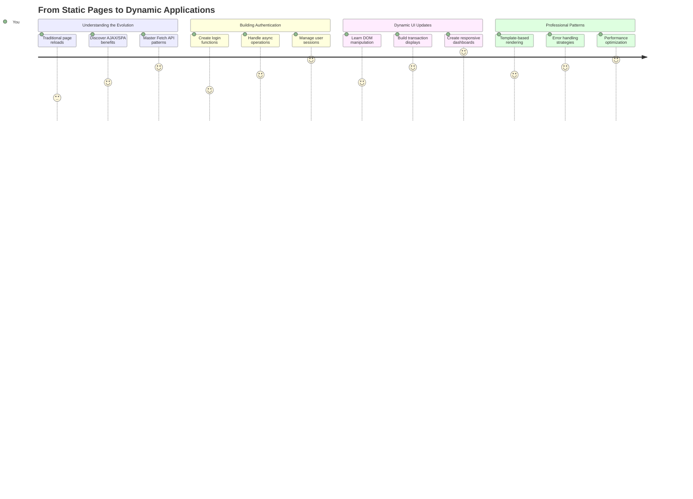

**Hedefiniz**: Bu dersin sonunda, modern web uygulamalarının verileri nasıl aldığını, işlediğini ve dinamik olarak görüntülediğini anlayacaksınız. Bu, profesyonel uygulamalardan beklediğimiz kesintisiz kullanıcı deneyimlerini yaratır.

## Ön Ders Testi

[Ön ders testi](https://ff-quizzes.netlify.app/web/quiz/45)

### Ön Koşullar

Veri alma işlemine başlamadan önce, şu bileşenlerin hazır olduğundan emin olun:

- **Önceki Ders**: [Giriş ve Kayıt Formu](../2-forms/README.md) dersini tamamlayın - bu temelin üzerine inşa edeceğiz
- **Yerel Sunucu**: [Node.js](https://nodejs.org) yükleyin ve [sunucu API'sini çalıştırın](../api/README.md) hesap verilerini sağlamak için
- **API Bağlantısı**: Sunucu bağlantınızı şu komutla test edin:

```bash
curl http://localhost:5000/api
# Expected response: "Bank API v1.0.0"
```

Bu hızlı test, tüm bileşenlerin düzgün iletişim kurduğunu doğrular:
- Node.js'in sisteminizde doğru çalıştığını doğrular
- API sunucunuzun aktif ve yanıt verdiğini onaylar
- Uygulamanızın sunucuya ulaşabildiğini doğrular (bir görev öncesi radyo iletişimini kontrol etmek gibi)

## 🧠 Veri Yönetimi Ekosistemi Genel Bakış

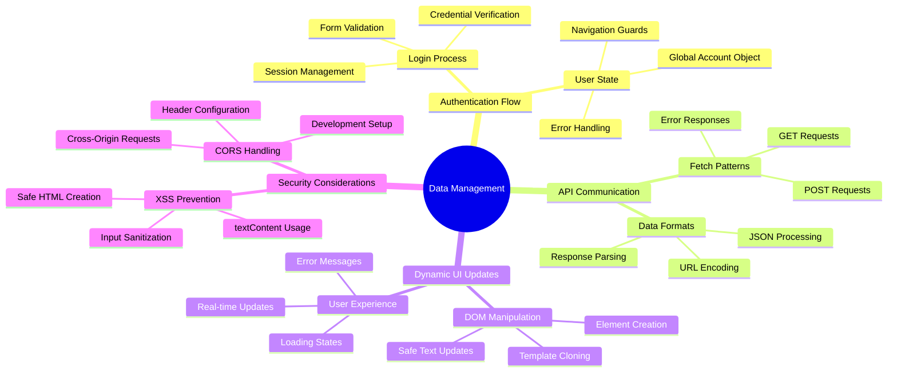

**Temel İlke**: Modern web uygulamaları, kullanıcı arayüzleri, sunucu API'leri ve tarayıcı güvenlik modelleri arasında koordinasyon sağlayan veri orkestrasyon sistemleridir. Bu, kesintisiz ve duyarlı deneyimler yaratır.

---

## Modern Web Uygulamalarında Veri Alma Sürecini Anlamak

Web uygulamalarının verileri işleme şekli son yirmi yılda dramatik bir şekilde değişti. Bu evrimi anlamak, modern tekniklerin neden bu kadar güçlü olduğunu ve neden web geliştiricileri için vazgeçilmez araçlar haline geldiğini anlamanıza yardımcı olacaktır.

Geleneksel web sitelerinin nasıl çalıştığını, bugün oluşturduğumuz dinamik ve duyarlı uygulamalarla karşılaştırarak inceleyelim.

### Geleneksel Çoklu Sayfa Uygulamaları (MPA)

Web'in ilk günlerinde, her tıklama eski bir televizyon kanalını değiştirmek gibiydi - ekran boşalır, ardından yeni içerik yavaşça yüklenirdi. Bu, her etkileşimin tüm sayfayı baştan sona yeniden inşa etmek anlamına geldiği erken web uygulamalarının gerçekliğiydi.

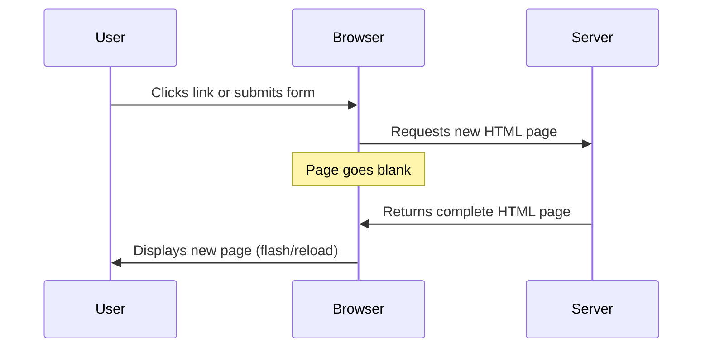

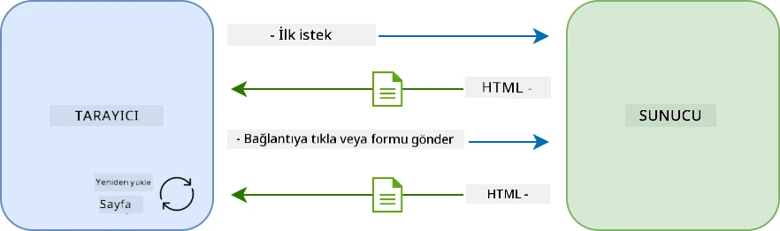

**Bu yaklaşım neden hantal hissettiriyordu:**
- Her tıklama tüm sayfanın baştan sona yeniden inşa edilmesi anlamına geliyordu
- Kullanıcılar, bu rahatsız edici sayfa yanıp sönmeleriyle düşüncelerinin ortasında kesintiye uğruyordu
- İnternet bağlantınız aynı başlık ve altbilgiyi tekrar tekrar indirerek fazla çalışıyordu
- Uygulamalar, bir dosya dolabında gezinmekten çok yazılım kullanmak gibi hissettiriyordu

### Modern Tek Sayfa Uygulamaları (SPA)

AJAX (Asenkron JavaScript ve XML) bu paradigmayı tamamen değiştirdi. Uluslararası Uzay İstasyonu'nun modüler tasarımı gibi, astronotlar tüm yapıyı yeniden inşa etmek zorunda kalmadan bireysel bileşenleri değiştirebilirler. AJAX, bir web sayfasının belirli bölümlerini yeniden yüklemeden güncellememize olanak tanır. İsmi XML'den bahsetse de, bugün çoğunlukla JSON kullanıyoruz, ancak temel ilke aynı: yalnızca değişmesi gerekeni güncellemek.

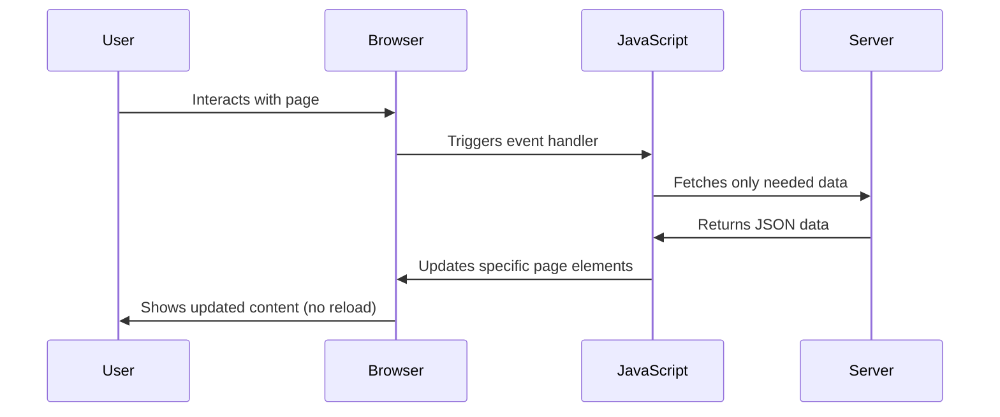


**SPA'lar neden daha iyi hissettiriyor:**
- Sadece gerçekten değişen bölümler güncellenir (akıllıca, değil mi?)
- Artık rahatsız edici kesintiler yok - kullanıcılar akışlarında kalır
- Daha az veri aktarımı daha hızlı yükleme anlamına gelir
- Her şey telefonunuzdaki uygulamalar gibi hızlı ve duyarlı hissedilir

### Modern Fetch API'ye Evrim

Modern tarayıcılar, eski [`XMLHttpRequest`](https://developer.mozilla.org/docs/Web/API/XMLHttpRequest/Using_XMLHttpRequest) yerine [`Fetch` API'sini](https://developer.mozilla.org/docs/Web/API/Fetch_API) sağlar. Telgraf kullanmak ile e-posta göndermek arasındaki fark gibi, Fetch API, temiz asenkron kod için sözler kullanır ve JSON'u doğal olarak işler.

| Özellik | XMLHttpRequest | Fetch API |
|---------|----------------|----------|
| **Sözdizimi** | Karmaşık geri çağrı tabanlı | Temiz söz tabanlı |
| **JSON İşleme** | Manuel ayrıştırma gerekli | Dahili `.json()` yöntemi |
| **Hata Yönetimi** | Sınırlı hata bilgisi | Kapsamlı hata detayları |
| **Modern Destek** | Eski uyumluluk | ES6+ sözler ve async/await |

> 💡 **Tarayıcı Uyumluluğu**: İyi haber - Fetch API tüm modern tarayıcılarda çalışır! Belirli sürümler hakkında merak ediyorsanız, [caniuse.com](https://caniuse.com/fetch) tam uyumluluk hikayesini sunar.
> 
**Sonuç:**
- Chrome, Firefox, Safari ve Edge'de harika çalışır (temelde kullanıcılarınızın olduğu her yerde)
- Sadece Internet Explorer ek yardıma ihtiyaç duyar (ve dürüst olmak gerekirse, IE'yi bırakmanın zamanı geldi)
- Daha sonra kullanacağımız zarif async/await desenleri için sizi mükemmel bir şekilde hazırlar

### Kullanıcı Girişi ve Veri Alma İşlemini Uygulama

Şimdi bankacılık uygulamanızı statik bir ekrandan işlevsel bir uygulamaya dönüştüren giriş sistemini uygulayalım. Güvenli askeri tesislerde kullanılan kimlik doğrulama protokolleri gibi, kullanıcı kimlik bilgilerini doğrulayacağız ve ardından belirli verilerine erişim sağlayacağız.

Bunu temel kimlik doğrulama ile başlayarak ve ardından veri alma yeteneklerini ekleyerek kademeli olarak oluşturacağız.

#### Adım 1: Giriş Fonksiyonu Temeli Oluşturma

`app.js` dosyanızı açın ve yeni bir `login` fonksiyonu ekleyin. Bu, kullanıcı kimlik doğrulama sürecini yönetecek:

```javascript
async function login() {
  const loginForm = document.getElementById('loginForm');
  const user = loginForm.user.value;
}
```

**Bunu açıklayalım:**
- `async` anahtar kelimesi, JavaScript'e "hey, bu işlevin bazı şeyler için beklemesi gerekebilir" diyor
- Sayfadan formumuzu alıyoruz (sadece ID'sine göre buluyoruz)
- Ardından, kullanıcının kullanıcı adı olarak yazdığı şeyi alıyoruz
- İşte güzel bir numara: Herhangi bir form girdisine `name` özelliğiyle erişebilirsiniz - ekstra getElementById çağrılarına gerek yok!

> 💡 **Form Erişim Deseni**: Her form kontrolüne, HTML'de `name` özelliği kullanılarak form öğesinin bir özelliği olarak erişilebilir. Bu, form verilerini almak için temiz ve okunabilir bir yol sağlar.

#### Adım 2: Hesap Verilerini Alma Fonksiyonu Oluşturma

Sonraki adımda, sunucudan hesap verilerini almak için özel bir işlev oluşturacağız. Bu, kayıt işlevinizle aynı deseni takip eder ancak veri alımına odaklanır:

```javascript
async function getAccount(user) {
  try {
    const response = await fetch('//localhost:5000/api/accounts/' + encodeURIComponent(user));
    return await response.json();
  } catch (error) {
    return { error: error.message || 'Unknown error' };
  }
}
```

**Bu kodun başardıkları:**
- Modern `fetch` API'sini kullanarak verileri asenkron olarak talep eder
- Kullanıcı adı parametresiyle bir GET isteği URL'si oluşturur
- URL'deki özel karakterleri güvenli bir şekilde işlemek için `encodeURIComponent()` uygular
- Yanıtı JSON formatına dönüştürür ve verileri kolayca işler
- Hataları zarif bir şekilde ele alır ve çökme yerine bir hata nesnesi döndürür

> ⚠️ **Güvenlik Notu**: `encodeURIComponent()` işlevi, URL'lerdeki özel karakterleri işler. Denizcilik iletişim sistemlerinde kullanılan kodlama sistemleri gibi, mesajınızın tam olarak amaçlandığı şekilde ulaşmasını sağlar ve "#" veya "&" gibi karakterlerin yanlış yorumlanmasını önler.
> 
**Neden önemli:**
- Özel karakterlerin URL'leri bozmasını önler
- URL manipülasyon saldırılarına karşı korur
- Sunucunuzun amaçlanan verileri almasını sağlar
- Güvenli kodlama uygulamalarını takip eder

#### HTTP GET İsteklerini Anlamak

Şaşırtıcı gelebilir: `fetch`i herhangi bir ek seçenek olmadan kullandığınızda, otomatik olarak bir [`GET`](https://developer.mozilla.org/docs/Web/HTTP/Methods/GET) isteği oluşturur. Bu, "hey, bu kullanıcının hesap verilerini görebilir miyim?" diye sunucuya sormak için mükemmeldir.

GET isteklerini bir kütüphaneden ödünç kitap istemek gibi düşünün - zaten var olan bir şeyi görmek istiyorsunuz. POST istekleri (kayıt için kullandığımız) ise koleksiyona eklenmesi için yeni bir kitap göndermek gibidir.

| GET İsteği | POST İsteği |
|------------|-------------|
| **Amaç** | Mevcut verileri almak | Sunucuya yeni veri göndermek |
| **Parametreler** | URL yolu/sorgu dizesinde | İstek gövdesinde |
| **Önbellekleme** | Tarayıcılar tarafından önbelleğe alınabilir | Genellikle önbelleğe alınmaz |
| **Güvenlik** | URL/günlüklerde görünür | İstek gövdesinde gizli |

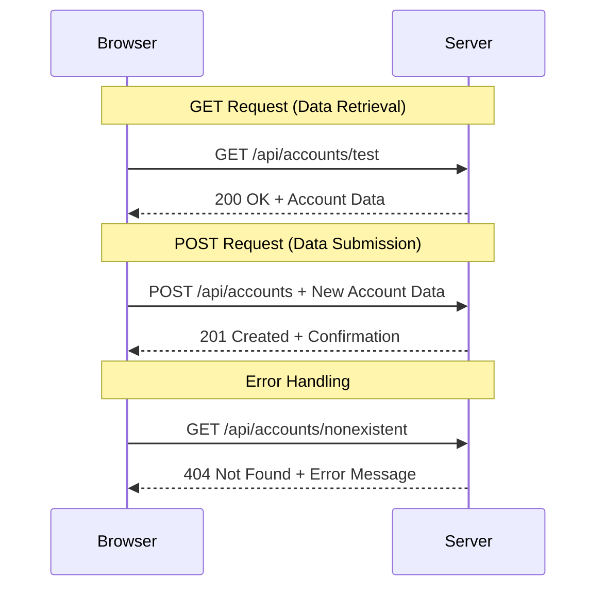

#### Adım 3: Her Şeyi Bir Araya Getirme

Şimdi tatmin edici kısma geldik - hesap alma işlevinizi giriş sürecine bağlayalım. İşte her şeyin yerine oturduğu yer:

```javascript
async function login() {
  const loginForm = document.getElementById('loginForm');
  const user = loginForm.user.value;
  const data = await getAccount(user);

  if (data.error) {
    return console.log('loginError', data.error);
  }

  account = data;
  navigate('/dashboard');
}
```

Bu işlev açık bir sırayı takip eder:
- Form girişinden kullanıcı adını çıkarır
- Sunucudan kullanıcının hesap verilerini talep eder
- İşlem sırasında meydana gelen hataları ele alır
- Hesap verilerini saklar ve başarı durumunda kontrol paneline yönlendirir

> 🎯 **Async/Await Deseni**: `getAccount` asenkron bir işlev olduğundan, kodun sunucudan yanıt alana kadar duraklaması için `await` anahtar kelimesini kullanıyoruz. Bu, kodun tanımsız verilerle devam etmesini önler.

#### Adım 4: Verileriniz İçin Bir Alan Oluşturma

Uygulamanız, yüklendikten sonra hesap bilgilerini hatırlayacak bir yere ihtiyaç duyar. Bunu uygulamanızın kısa süreli belleği gibi düşünün - mevcut kullanıcının verilerini elinizin altında tutmak için bir yer. `app.js` dosyanızın en üstüne şu satırı ekleyin:

```javascript
// This holds the current user's account data
let account = null;
```

**Neden buna ihtiyacımız var:**
- Hesap verilerini uygulamanızın herhangi bir yerinden erişilebilir tutar
- `null` ile başlamak "henüz kimse giriş yapmadı" anlamına gelir
- Birisi başarıyla giriş yaptığında veya kaydolduğunda güncellenir
- Tek bir doğru kaynak gibi davranır - kimin giriş yaptığını anlamada karışıklık olmaz

#### Adım 5: Formunuzu Bağlayın

Şimdi yeni giriş işlevinizi HTML formunuza bağlayalım. Form etiketinizi şu şekilde güncelleyin:

```html
<form id="loginForm" action="javascript:login()">
  <!-- Your existing form inputs -->
</form>
```

**Bu küçük değişiklik ne yapar:**
- Formun varsayılan "tüm sayfayı yeniden yükleme" davranışını durdurur
- Bunun yerine özel JavaScript işlevinizi çağırır
- Her şeyi sorunsuz ve tek sayfa uygulaması gibi tutar
- Kullanıcılar "Giriş Yap" düğmesine bastığında ne olacağı üzerinde tam kontrol sağlar

#### Adım 6: Kayıt Fonksiyonunuzu Geliştirin

Tutarlılık için, kayıt fonksiyonunuzu da hesap verilerini saklayacak ve kontrol paneline yönlendirecek şekilde güncelleyin:

```javascript
// Add these lines at the end of your register function
account = result;
navigate('/dashboard');
```

**Bu geliştirme şunları sağlar:**
- **Kesintisiz** bir geçiş sağlar: kayıttan kontrol paneline
- **Tutarlı** bir kullanıcı deneyimi sunar: giriş ve kayıt akışları arasında
- **Anında** erişim sağlar: başarılı bir kayıttan sonra hesap verilerine

#### Uygulamanızı Test Etme

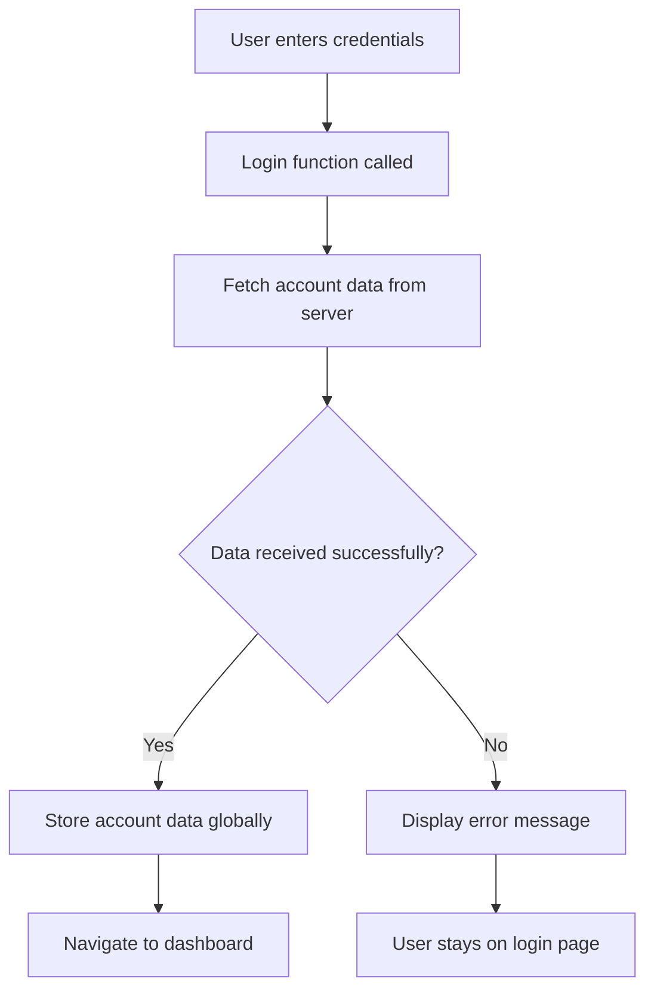

**Şimdi bir deneme yapma zamanı:**
1. Her şeyin çalıştığından emin olmak için yeni bir hesap oluşturun
2. Aynı kimlik bilgileriyle giriş yapmayı deneyin
3. Bir şeyler ters gidiyorsa tarayıcınızın konsoluna (F12) göz atın
4. Başarılı bir girişten sonra kontrol paneline ulaştığınızdan emin olun

Bir şeyler çalışmıyorsa, panik yapmayın! Çoğu sorun, yazım hataları veya API sunucusunu başlatmayı unutmak gibi basit düzeltmelerdir.

#### Farklı Köken Sihri Hakkında Kısa Bir Not

Şunu merak ediyor olabilirsiniz: "Web uygulamam bu API sunucusuyla farklı portlarda çalışırken nasıl iletişim kuruyor?" Harika bir soru! Bu, her web geliştiricisinin eninde sonunda karşılaştığı bir konudur.

> 🔒 **Farklı Köken Güvenliği**: Tarayıcılar, farklı alanlar arasında yetkisiz iletişimi önlemek için "aynı köken politikası" uygular. Pentagon'daki kontrol noktası sistemi gibi, veri aktarımına izin vermeden önce iletişimin yetkilendirildiğini doğrular.
> 
**Bizim kurulumumuzda:**
- Web uygulamanız `localhost:3000` üzerinde çalışıyor (geliştirme sunucusu)
- API sunucunuz `localhost:5000` üzerinde çalışıyor (arka uç sunucusu)
- API sunucusu, [CORS başlıkları](https://developer.mozilla.org/docs/Web/HTTP/CORS) içerir ve web uygulamanızdan iletişimi açıkça yetkilendirir

Bu yapılandırma, genellikle ön uç ve arka uç uygulamalarının ayrı sunucularda çalıştığı gerçek dünya geliştirme ortamını yansıtır.

> 📚 **Daha Fazla Bilgi Edinin**: API'ler ve veri alma hakkında daha fazla bilgi edinmek için bu kapsamlı [Microsoft Learn modülüne](https://docs.microsoft.com/learn/modules/use-apis-discover-museum-art/?WT.mc_id=academic-77807-sagibbon) göz atın.

## Verilerinizi HTML'de Hayata Geçirme

Şimdi alınan verileri, kullanıcıların görebileceği ve etkileşimde bulunabileceği şekilde DOM manipülasyonu ile görselleştireceğiz. Bir karanlık odada fotoğraf geliştirme süreci gibi, görünmez verileri alıp kullanıcıların görebileceği ve etkileşimde bulunabileceği bir şeye dönüştüreceğiz.
DOM manipülasyonu, statik web sayfalarını kullanıcı etkileşimleri ve sunucu yanıtlarına göre içeriklerini güncelleyen dinamik uygulamalara dönüştüren bir tekniktir.

### İş İçin Doğru Aracı Seçmek

HTML'inizi JavaScript ile güncellemek söz konusu olduğunda, birkaç seçeneğiniz var. Bunları bir alet çantasında farklı araçlar gibi düşünün - her biri belirli işler için mükemmel:

| Yöntem | Harika olduğu alan | Ne zaman kullanılır | Güvenlik seviyesi |
|--------|---------------------|--------------------|-------------------|
| `textContent` | Kullanıcı verilerini güvenli bir şekilde göstermek | Metin gösterdiğiniz her zaman | ✅ Çok güvenli |
| `createElement()` + `append()` | Karmaşık düzenler oluşturmak | Yeni bölümler/listeler oluşturmak | ✅ Çok güvenli |
| `innerHTML` | HTML içeriği ayarlamak | ⚠️ Bundan kaçınmaya çalışın | ❌ Riskli iş |

#### Metni Güvenli Bir Şekilde Gösterme: textContent

[`textContent`](https://developer.mozilla.org/docs/Web/API/Node/textContent) özelliği, kullanıcı verilerini gösterirken en iyi dostunuzdur. Bu, web sayfanız için bir güvenlik görevlisi gibidir - zararlı hiçbir şey geçemez:

```javascript
// The safe, reliable way to update text
const balanceElement = document.getElementById('balance');
balanceElement.textContent = account.balance;
```

**textContent'in Faydaları:**
- Her şeyi düz metin olarak işler (script çalıştırmayı önler)
- Mevcut içeriği otomatik olarak temizler
- Basit metin güncellemeleri için verimli
- Zararlı içeriklere karşı yerleşik güvenlik sağlar

#### Dinamik HTML Elemanları Oluşturma

Daha karmaşık içerikler için [`document.createElement()`](https://developer.mozilla.org/docs/Web/API/Document/createElement) ile [`append()`](https://developer.mozilla.org/docs/Web/API/ParentNode/append) yöntemini birleştirin:

```javascript
// Safe way to create new elements
const transactionItem = document.createElement('div');
transactionItem.className = 'transaction-item';
transactionItem.textContent = `${transaction.date}: ${transaction.description}`;
container.append(transactionItem);
```

**Bu yaklaşımı anlamak:**
- **Yeni** DOM elemanlarını programlı olarak oluşturur
- **Eleman** özellikleri ve içerik üzerinde tam kontrol sağlar
- **Karmaşık**, iç içe geçmiş eleman yapıları oluşturmanıza olanak tanır
- **Güvenliği** korur, yapıyı içerikten ayırır

> ⚠️ **Güvenlik Düşüncesi**: [`innerHTML`](https://developer.mozilla.org/docs/Web/API/Element/innerHTML) birçok öğreticide yer alsa da, gömülü scriptleri çalıştırabilir. CERN'deki güvenlik protokolleri gibi, yetkisiz kod çalıştırmayı önler. `textContent` ve `createElement` kullanımı daha güvenli alternatifler sunar.
> 
**innerHTML'nin Riskleri:**
- Kullanıcı verisindeki `<script>` etiketlerini çalıştırır
- Kod enjeksiyon saldırılarına karşı savunmasızdır
- Potansiyel güvenlik açıkları oluşturur
- Kullandığımız güvenli alternatifler eşdeğer işlevsellik sağlar

### Hataları Kullanıcı Dostu Hale Getirme

Şu anda, giriş hataları yalnızca kullanıcılar tarafından görünmeyen tarayıcı konsolunda görünüyor. Pilotun iç tanı sistemi ile yolcu bilgi sistemi arasındaki fark gibi, önemli bilgileri uygun kanal aracılığıyla iletmemiz gerekiyor.

Görünür hata mesajları uygulayarak, kullanıcıların neyin yanlış gittiğini ve nasıl devam edeceklerini hemen anlamalarını sağlayabilirsiniz.

#### Adım 1: Hata Mesajları İçin Bir Alan Ekleyin

Öncelikle, hata mesajlarına HTML'nizde bir yer açalım. Bunu giriş düğmenizin hemen önüne ekleyin, böylece kullanıcılar doğal olarak görebilir:

```html
<!-- This is where error messages will appear -->
<div id="loginError" role="alert"></div>
<button>Login</button>
```

**Burada olanlar:**
- Görünmez bir şekilde kalan boş bir konteyner oluşturuyoruz
- "Giriş" düğmesine tıkladıktan sonra kullanıcıların doğal olarak baktığı yere yerleştiriliyor
- `role="alert"` ekran okuyucular için güzel bir dokunuş - yardımcı teknolojilere "hey, bu önemli!" diyor
- Benzersiz `id`, JavaScript'imize kolay bir hedef sağlıyor

#### Adım 2: Kullanışlı Bir Yardımcı Fonksiyon Oluşturun

Herhangi bir elemanın metnini güncelleyebilecek küçük bir yardımcı fonksiyon yapalım. Bu, "bir kez yaz, her yerde kullan" türünden bir fonksiyon olacak ve size zaman kazandıracak:

```javascript
function updateElement(id, text) {
  const element = document.getElementById(id);
  element.textContent = text;
}
```

**Fonksiyonun faydaları:**
- Sadece bir eleman ID'si ve metin içeriği gerektiren basit bir arayüz
- DOM elemanlarını güvenli bir şekilde bulur ve günceller
- Kod tekrarını azaltan yeniden kullanılabilir bir model
- Uygulama genelinde tutarlı güncelleme davranışını korur

#### Adım 3: Hataları Kullanıcıların Görebileceği Yerde Gösterin

Şimdi gizli konsol mesajını kullanıcıların gerçekten görebileceği bir şeyle değiştirelim. Giriş fonksiyonunuzu güncelleyin:

```javascript
// Instead of just logging to console, show the user what's wrong
if (data.error) {
  return updateElement('loginError', data.error);
}
```

**Bu küçük değişiklik büyük bir fark yaratır:**
- Hata mesajları kullanıcıların baktığı yerde görünür
- Artık gizemli sessiz hatalar yok
- Kullanıcılar anında, uygulanabilir geri bildirim alır
- Uygulamanız profesyonel ve düşünceli hissettirmeye başlar

Şimdi geçersiz bir hesapla test ettiğinizde, sayfada yardımcı bir hata mesajı göreceksiniz!


#### Adım 4: Erişilebilirlik ile Kapsayıcı Olmak

Daha önce eklediğimiz `role="alert"` hakkında ilginç bir şey var - bu sadece bir süs değil! Bu küçük özellik, ekran okuyuculara değişiklikleri hemen duyuran bir [Canlı Bölge](https://developer.mozilla.org/docs/Web/Accessibility/ARIA/ARIA_Live_Regions) oluşturur:

```html
<div id="loginError" role="alert"></div>
```

**Neden önemli:**
- Ekran okuyucu kullanıcıları hata mesajını hemen duyabilir
- Herkes, nasıl gezindiğine bakılmaksızın aynı önemli bilgiyi alır
- Uygulamanızın daha fazla kişi için çalışmasını sağlamak için basit bir yol
- Kapsayıcı deneyimler yaratmaya önem verdiğinizi gösterir

Bu tür küçük dokunuşlar, iyi geliştiricileri harika olanlardan ayırır!

### 🎯 Pedagojik Kontrol: Kimlik Doğrulama Modelleri

**Dur ve Düşün**: Tam bir kimlik doğrulama akışı uyguladınız. Bu, web geliştirmede temel bir modeldir.

**Hızlı Öz Değerlendirme**:
- API çağrıları için neden async/await kullandığımızı açıklayabilir misiniz?
- `encodeURIComponent()` fonksiyonunu unutursak ne olurdu?
- Hata yönetimimiz kullanıcı deneyimini nasıl iyileştiriyor?

**Gerçek Dünya Bağlantısı**: Burada öğrendiğiniz modeller (asenkron veri alma, hata yönetimi, kullanıcı geri bildirimi), sosyal medya platformlarından e-ticaret sitelerine kadar her büyük web uygulamasında kullanılır. Üretim seviyesinde beceriler geliştiriyorsunuz!

**Zorluk Sorusu**: Bu kimlik doğrulama sistemini birden fazla kullanıcı rolünü (müşteri, yönetici, veznedar) ele alacak şekilde nasıl değiştirebilirsiniz? Gerekli veri yapısı ve UI değişikliklerini düşünün.

#### Adım 5: Aynı Modeli Kayıt İşlemine Uygulama

Tutarlılık için, kayıt formunuzda aynı hata yönetimini uygulayın:

1. **Kayıt** HTML'nize bir hata gösterim elemanı ekleyin:
```html
<div id="registerError" role="alert"></div>
```

2. **Kayıt** fonksiyonunuzu aynı hata gösterim modelini kullanacak şekilde güncelleyin:
```javascript
if (data.error) {
  return updateElement('registerError', data.error);
}
```

**Tutarlı hata yönetiminin faydaları:**
- **Tüm formlarda** tutarlı kullanıcı deneyimi sağlar
- **Tanıdık** modeller kullanarak bilişsel yükü azaltır
- **Bakımı** yeniden kullanılabilir kodla basitleştirir
- **Erişilebilirlik** standartlarının uygulama genelinde karşılanmasını sağlar

## Dinamik Kontrol Panelinizi Oluşturma

Şimdi statik kontrol panelinizi, gerçek hesap verilerini gösteren dinamik bir arayüze dönüştüreceğiz. Basılı bir uçuş programı ile havaalanlarındaki canlı kalkış panoları arasındaki fark gibi, statik bilgiden gerçek zamanlı, duyarlı ekranlara geçiyoruz.

Öğrendiğiniz DOM manipülasyon tekniklerini kullanarak, mevcut hesap bilgileriyle otomatik olarak güncellenen bir kontrol paneli oluşturacağız.

### Verilerinizi Tanımak

Başlamadan önce, sunucunuzun geri gönderdiği veri türüne bir göz atalım. Bir kişi başarılı bir şekilde giriş yaptığında, işte çalışabileceğiniz bilgi hazinesi:

```json
{
  "user": "test",
  "currency": "$",
  "description": "Test account",
  "balance": 75,
  "transactions": [
    { "id": "1", "date": "2020-10-01", "object": "Pocket money", "amount": 50 },
    { "id": "2", "date": "2020-10-03", "object": "Book", "amount": -10 },
    { "id": "3", "date": "2020-10-04", "object": "Sandwich", "amount": -5 }
  ]
}
```

**Bu veri yapısı şunları sağlar:**
- **`user`**: Deneyimi kişiselleştirmek için mükemmel ("Tekrar hoş geldin, Sarah!")
- **`currency`**: Para miktarlarını doğru şekilde göstermenizi sağlar
- **`description`**: Hesap için dostça bir ad
- **`balance`**: En önemli mevcut bakiye
- **`transactions`**: Tüm detaylarıyla tam işlem geçmişi

Profesyonel görünümlü bir banka kontrol paneli oluşturmak için ihtiyacınız olan her şey!

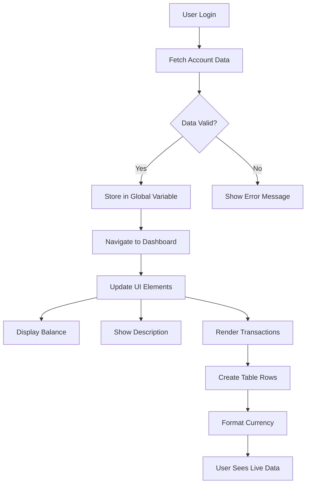

> 💡 **İpucu**: Kontrol panelinizi hemen çalışırken görmek ister misiniz? Giriş yaparken `test` kullanıcı adını kullanın - önceden yüklenmiş örnek verilerle gelir, böylece her şeyi ilk önce işlem oluşturmadan görebilirsiniz.
> 
**Test hesabının neden kullanışlı olduğu:**
- Gerçekçi örnek verilerle önceden yüklenmiştir
- İşlemlerin nasıl görüntülendiğini görmek için mükemmel
- Kontrol paneli özelliklerinizi test etmek için harika
- Sahte veri oluşturma zahmetinden kurtarır

### Kontrol Paneli Görüntü Elemanlarını Oluşturma

Hesap özet bilgileriyle başlayarak, ardından işlem listeleri gibi daha karmaşık özelliklere geçerek kontrol paneli arayüzünüzü adım adım oluşturalım.

#### Adım 1: HTML Yapınızı Güncelleyin

Öncelikle, statik "Bakiye" bölümünü JavaScript'in doldurabileceği dinamik yer tutucu elemanlarla değiştirin:

```html
<section>
  Balance: <span id="balance"></span><span id="currency"></span>
</section>
```

Sonra, hesap açıklaması için bir bölüm ekleyin. Bu, kontrol paneli içeriği için bir başlık görevi gördüğünden, semantik HTML kullanın:

```html
<h2 id="description"></h2>
```

**HTML yapısını anlama:**
- **Ayrı** `<span>` elemanlarını bakiye ve para birimi için bireysel kontrol sağlar
- **Benzersiz** ID'ler her bir elemanı JavaScript ile hedeflemek için uygulanır
- **Semantik HTML** kullanarak hesap açıklaması için `<h2>` kullanılır
- **Ekran okuyucular ve SEO** için mantıklı bir hiyerarşi oluşturur

> ✅ **Erişilebilirlik Bilgisi**: Hesap açıklaması, kontrol paneli içeriği için bir başlık işlevi görür, bu nedenle semantik olarak bir başlık olarak işaretlenmiştir. [Başlık yapısının](https://www.nomensa.com/blog/2017/how-structure-headings-web-accessibility) erişilebilirliği nasıl etkilediği hakkında daha fazla bilgi edinin. Sayfanızdaki diğer elemanların başlık etiketlerinden faydalanabileceğini belirleyebilir misiniz?

#### Adım 2: Kontrol Paneli Güncelleme Fonksiyonunu Oluşturun

Şimdi kontrol panelinizi gerçek hesap verileriyle dolduran bir fonksiyon oluşturun:

```javascript
function updateDashboard() {
  if (!account) {
    return navigate('/login');
  }

  updateElement('description', account.description);
  updateElement('balance', account.balance.toFixed(2));
  updateElement('currency', account.currency);
}
```

**Adım adım bu fonksiyonun yaptığı:**
- **Hesap** verilerinin mevcut olduğunu doğrular
- **Kimliği doğrulanmamış** kullanıcıları giriş sayfasına yönlendirir
- **Hesap** açıklamasını yeniden kullanılabilir `updateElement` fonksiyonunu kullanarak günceller
- **Bakiyeyi** her zaman iki ondalık basamak gösterecek şekilde biçimlendirir
- **Uygun** para birimi simgesini gösterir

> 💰 **Para Biçimlendirme**: [`toFixed(2)`](https://developer.mozilla.org/docs/Web/JavaScript/Reference/Global_Objects/Number/toFixed) yöntemi hayat kurtarıcıdır! Bakiyenizin her zaman gerçek para gibi görünmesini sağlar - "75.00" yerine sadece "75". Kullanıcılarınız tanıdık para biçimlendirmesini görmeyi takdir edecektir.

#### Adım 3: Kontrol Panelinizin Güncellendiğinden Emin Olun

Birinin kontrol panelini her ziyaret ettiğinde güncel verilerle yenilenmesini sağlamak için navigasyon sisteminize bağlanmamız gerekiyor. [Ders 1 ödevini](../1-template-route/assignment.md) tamamladıysanız, bu tanıdık gelecektir. Eğer değilse, endişelenmeyin - ihtiyacınız olan şey burada:

`updateRoute()` fonksiyonunuzun sonuna bunu ekleyin:

```javascript
if (typeof route.init === 'function') {
  route.init();
}
```

Sonra rotalarınızı kontrol paneli başlatma kodunu içerecek şekilde güncelleyin:

```javascript
const routes = {
  '/login': { templateId: 'login' },
  '/dashboard': { templateId: 'dashboard', init: updateDashboard }
};
```

**Bu akıllı kurulumun yaptığı:**
- Bir rotanın özel başlatma kodu olup olmadığını kontrol eder
- Rota yüklendiğinde bu kodu otomatik olarak çalıştırır
- Kontrol panelinizin her zaman güncel, mevcut verileri göstermesini sağlar
- Yönlendirme mantığınızı temiz ve düzenli tutar

#### Kontrol Panelinizi Test Etme

Bu değişiklikleri uyguladıktan sonra kontrol panelinizi test edin:

1. **Test hesabıyla giriş yapın**
2. **Kontrol paneline yönlendirildiğinizi doğrulayın**
3. **Hesap açıklaması, bakiye ve para biriminin doğru şekilde görüntülendiğini kontrol edin**
4. **Çıkış yapıp tekrar giriş yapmayı deneyin** ve verilerin düzgün şekilde yenilendiğinden emin olun

Kontrol paneliniz artık giriş yapan kullanıcının verilerine dayalı olarak dinamik hesap bilgilerini göstermelidir!

## Şablonlarla Akıllı İşlem Listeleri Oluşturma

Her işlem için manuel olarak HTML oluşturmak yerine, tutarlı biçimlendirmeyi otomatik olarak oluşturmak için şablonları kullanacağız. Uzay aracı üretiminde kullanılan standart bileşenler gibi, şablonlar her işlem satırının aynı yapıyı ve görünümü takip etmesini sağlar.

Bu teknik, birkaç işlemden binlerce işleme kadar verimli bir şekilde ölçeklenir ve tutarlı performans ve sunum sağlar.

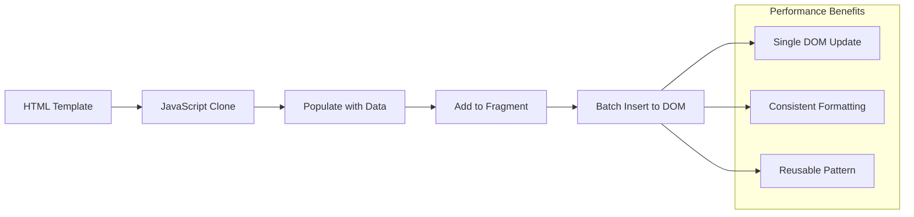

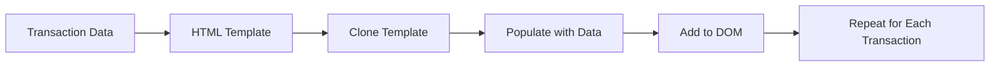

### Adım 1: İşlem Şablonunu Oluşturun

Öncelikle, HTML `<body>` içinde işlem satırları için yeniden kullanılabilir bir şablon ekleyin:

```html
<template id="transaction">
  <tr>
    <td></td>
    <td></td>
    <td></td>
  </tr>
</template>
```

**HTML şablonlarını anlama:**
- **Tek bir tablo satırı** için yapıyı tanımlar
- **JavaScript ile klonlanıp doldurulana kadar** görünmez kalır
- **Tarih, açıklama ve miktar için** üç hücre içerir
- **Tutarlı biçimlendirme için** yeniden kullanılabilir bir model sağlar

### Adım 2: Tabloyu Dinamik İçerik İçin Hazırlayın

Sonra, JavaScript'in kolayca hedef alabilmesi için tablo gövdesine bir `id` ekleyin:

```html
<tbody id="transactions"></tbody>
```

**Bu ne sağlar:**
- **İşlem satırlarını eklemek için** net bir hedef oluşturur
- **Tablo yapısını dinamik içerikten** ayırır
- **İşlem verilerini temizleme ve yeniden doldurma** işlemini kolaylaştırır

### Adım 3: İşlem Satırı Fabrika Fonksiyonunu Oluşturun

Şimdi işlem verilerini HTML elemanlarına dönüştüren bir fonksiyon oluşturun:

```javascript
function createTransactionRow(transaction) {
  const template = document.getElementById('transaction');
  const transactionRow = template.content.cloneNode(true);
  const tr = transactionRow.querySelector('tr');
  tr.children[0].textContent = transaction.date;
  tr.children[1].textContent = transaction.object;
  tr.children[2].textContent = transaction.amount.toFixed(2);
  return transactionRow;
}
```

**Bu fabrika fonksiyonunun ayrıntıları:**
- **Şablon elemanını** ID'sine göre alır
- **Şablon içeriğini** güvenli bir şekilde klonlar
- **Klonlanmış içerikteki** tablo satırını seçer
- **Her hücreyi** işlem verileriyle doldurur
- **Miktarı** doğru ondalık basamakları gösterecek şekilde biçimlendirir
- **Tamamlanmış satırı** eklemeye hazır şekilde döndürür

### Adım 4: Birden Fazla İşlem Satırını Verimli Bir Şekilde Oluşturun

Tüm işlemleri göstermek için `updateDashboard()` fonksiyonunuza şu kodu ekleyin:

```javascript
const transactionsRows = document.createDocumentFragment();
for (const transaction of account.transactions) {
  const transactionRow = createTransactionRow(transaction);
  transactionsRows.appendChild(transactionRow);
}
updateElement('transactions', transactionsRows);
```

**Bu verimli yaklaşımı anlama:**
- **DOM işlemlerini toplamak için** bir belge parçası oluşturur
- **Hesap verilerindeki tüm işlemleri** döngüyle iter
- **Fabrika fonksiyonunu kullanarak** her işlem için bir satır oluşturur
- **Tüm satırları** DOM'a eklemeden önce parçada toplar
- **Birden fazla bireysel ekleme yerine** tek bir DOM güncellemesi gerçekleştirir
> ⚡ **Performans Optimizasyonu**: [`document.createDocumentFragment()`](https://developer.mozilla.org/docs/Web/API/Document/createDocumentFragment), Boeing'deki montaj süreci gibi çalışır - bileşenler ana hattın dışında hazırlanır ve ardından tam bir birim olarak monte edilir. Bu toplu işlem yaklaşımı, birden fazla bireysel işlem yerine tek bir ekleme yaparak DOM yeniden akışlarını en aza indirir.

### Adım 5: Karışık İçerik için Güncelleme Fonksiyonunu Geliştirin

`updateElement()` fonksiyonunuz şu anda yalnızca metin içeriğini işliyor. Bunu hem metin hem de DOM düğümleriyle çalışacak şekilde güncelleyin:

```javascript
function updateElement(id, textOrNode) {
  const element = document.getElementById(id);
  element.textContent = ''; // Removes all children
  element.append(textOrNode);
}
```

**Bu güncellemedeki önemli iyileştirmeler:**
- **Mevcut içeriği temizler** ve yeni içerik ekler
- **Metin dizelerini veya DOM düğümlerini** parametre olarak kabul eder
- Esneklik için [`append()`](https://developer.mozilla.org/docs/Web/API/ParentNode/append) yöntemini kullanır
- Mevcut metin tabanlı kullanım ile **geriye dönük uyumluluğu korur**

### Panonuzu Test Etme Zamanı

Gerçek an geldi! Dinamik panonuzu çalışırken görelim:

1. Örnek verilerle hazır olan `test` hesabıyla giriş yapın
2. Panonuza gidin
3. İşlem satırlarının doğru formatta göründüğünden emin olun
4. Tarihlerin, açıklamaların ve tutarların düzgün göründüğünden emin olun

Her şey çalışıyorsa, panonuzda tamamen işlevsel bir işlem listesi görmelisiniz! 🎉

**Başardıklarınız:**
- Herhangi bir miktarda veriyle ölçeklenebilen bir pano oluşturmak
- Tutarlı formatlama için yeniden kullanılabilir şablonlar oluşturmak
- Verimli DOM manipülasyon tekniklerini uygulamak
- Üretim bankacılık uygulamalarıyla karşılaştırılabilir işlevsellik geliştirmek

Statik bir web sayfasını dinamik bir web uygulamasına başarıyla dönüştürdünüz.

### 🎯 Pedagojik Kontrol: Dinamik İçerik Üretimi

**Mimari Anlayış**: React, Vue ve Angular gibi çerçevelerde kullanılan desenleri yansıtan sofistike bir veri-UI hattı uyguladınız.

**Öğrenilen Temel Kavramlar**:
- **Şablon tabanlı render**: Yeniden kullanılabilir UI bileşenleri oluşturma
- **Belge parçacıkları**: DOM performansını optimize etme
- **Güvenli DOM manipülasyonu**: Güvenlik açıklarını önleme
- **Veri dönüşümü**: Sunucu verilerini kullanıcı arayüzlerine dönüştürme

**Sektör Bağlantısı**: Bu teknikler modern frontend çerçevelerinin temelini oluşturur. React'ın sanal DOM'u, Vue'nun şablon sistemi ve Angular'ın bileşen mimarisi bu temel kavramlar üzerine inşa edilmiştir.

**Düşünme Sorusu**: Bu sistemi gerçek zamanlı güncellemeleri (örneğin, yeni işlemlerin otomatik olarak görünmesi) işlemek için nasıl genişletirsiniz? WebSockets veya Server-Sent Events'i düşünün.

---

## 📈 Veri Yönetimi Uzmanlık Zaman Çizelgeniz

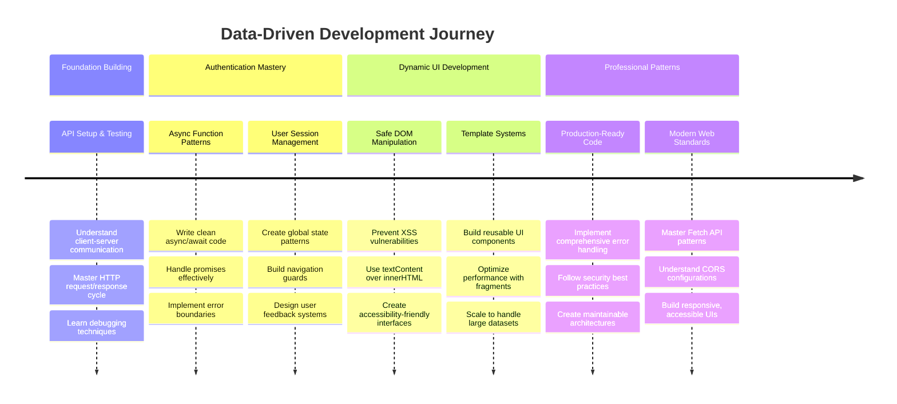

**🎓 Mezuniyet Dönüm Noktası**: Modern JavaScript desenlerini kullanarak eksiksiz bir veri odaklı web uygulaması başarıyla oluşturdunuz. Bu beceriler, React, Vue veya Angular gibi çerçevelerle çalışmaya doğrudan çevrilebilir.

**🔄 Bir Sonraki Seviye Yetkinlikler**:
- Bu kavramlar üzerine inşa edilen frontend çerçevelerini keşfetmeye hazır
- WebSockets ile gerçek zamanlı özellikler uygulamaya hazır
- Çevrimdışı özelliklere sahip Progressive Web Apps oluşturmaya hazır
- Gelişmiş durum yönetimi desenlerini öğrenmek için temel oluşturuldu

## GitHub Copilot Agent Challenge 🚀

Agent modunu kullanarak aşağıdaki meydan okumayı tamamlayın:

**Açıklama:** Kullanıcıların tarih aralığı, tutar veya açıklama ile belirli işlemleri bulmasını sağlayan bir işlem arama ve filtreleme özelliği ekleyerek bankacılık uygulamasını geliştirin.

**İstek:** Bankacılık uygulaması için şu özellikleri içeren bir arama işlevi oluşturun: 1) Tarih aralığı (başlangıç/bitiş), minimum/maksimum tutar ve işlem açıklama anahtar kelimeleri için giriş alanlarına sahip bir arama formu, 2) Arama kriterlerine göre account.transactions dizisini filtreleyen bir `filterTransactions()` fonksiyonu, 3) Filtrelenmiş sonuçları göstermek için `updateDashboard()` fonksiyonunu güncelleyin ve 4) Görünümü sıfırlamak için bir "Filtreleri Temizle" düğmesi ekleyin. Modern JavaScript dizi yöntemlerini, örneğin `filter()` kullanın ve boş arama kriterleri için kenar durumları ele alın.

[Agent modunu](https://code.visualstudio.com/blogs/2025/02/24/introducing-copilot-agent-mode) burada öğrenin.

## 🚀 Meydan Okuma

Bankacılık uygulamanızı bir üst seviyeye taşımaya hazır mısınız? İşte uygulamanızı gerçekten kullanmak isteyeceğiniz bir şeye dönüştürmek için bazı fikirler:

**Güzel hale getirin**: İşlevsel panonuzu görsel olarak çekici bir şeye dönüştürmek için CSS stil ekleyin. Temiz çizgiler, iyi boşluklar ve belki de bazı ince animasyonlar düşünün.

**Duyarlı hale getirin**: [Medya sorgularını](https://developer.mozilla.org/docs/Web/CSS/Media_Queries) kullanarak telefonlarda, tabletlerde ve masaüstlerinde harika çalışan bir [duyarlı tasarım](https://developer.mozilla.org/docs/Web/Progressive_web_apps/Responsive/responsive_design_building_blocks) oluşturmayı deneyin. Kullanıcılarınız size teşekkür edecek!

**Biraz renk katın**: İşlemleri renklendirmeyi düşünün (gelir için yeşil, giderler için kırmızı), simgeler ekleyin veya arayüzü daha etkileşimli hale getiren üzerine gelme efektleri oluşturun.

İşte cilalanmış bir pano böyle görünebilir:

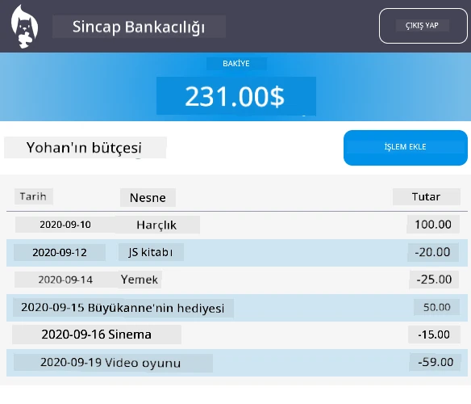

Bunu tam olarak eşleştirmek zorunda hissetmeyin - ilham kaynağı olarak kullanın ve kendi tarzınızı yaratın!

## Ders Sonrası Test

[Ders sonrası test](https://ff-quizzes.netlify.app/web/quiz/46)

## Ödev

[Kodunuzu yeniden düzenleyin ve yorumlayın](assignment.md)

---

**Feragatname**:  
Bu belge, AI çeviri hizmeti [Co-op Translator](https://github.com/Azure/co-op-translator) kullanılarak çevrilmiştir. Doğruluk için çaba göstersek de, otomatik çevirilerin hata veya yanlışlıklar içerebileceğini lütfen unutmayın. Belgenin orijinal dili, yetkili kaynak olarak kabul edilmelidir. Kritik bilgiler için profesyonel insan çevirisi önerilir. Bu çevirinin kullanımından kaynaklanan yanlış anlamalar veya yanlış yorumlamalar için sorumluluk kabul etmiyoruz.