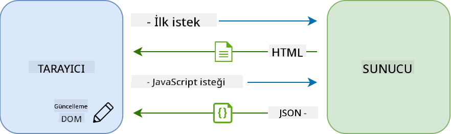

<!--
CO_OP_TRANSLATOR_METADATA:
{
  "original_hash": "f587e913e3f7c0b1c549a05dd74ee8e5",
  "translation_date": "2025-08-26T00:27:14+00:00",
  "source_file": "7-bank-project/3-data/README.md",
  "language_code": "tr"
}
-->
# Bir Bankacılık Uygulaması Geliştirme Bölüm 3: Verileri Getirme ve Kullanma Yöntemleri

## Ders Öncesi Test

[Ders öncesi testi](https://ff-quizzes.netlify.app/web/quiz/45)

### Giriş

Her web uygulamasının temelinde *veri* bulunur. Veriler birçok biçimde olabilir, ancak temel amacı her zaman kullanıcıya bilgi sunmaktır. Web uygulamaları giderek daha etkileşimli ve karmaşık hale geldikçe, kullanıcının bilgiye nasıl eriştiği ve bu bilgilerle nasıl etkileşimde bulunduğu, web geliştirme sürecinin önemli bir parçası haline gelmiştir.

Bu derste, bir sunucudan verileri eşzamansız olarak nasıl getireceğimizi ve bu verileri HTML'yi yeniden yüklemeden bir web sayfasında nasıl görüntüleyeceğimizi göreceğiz.

### Ön Koşul

Bu ders için web uygulamasının [Giriş ve Kayıt Formu](../2-forms/README.md) bölümünü oluşturmuş olmanız gerekiyor. Ayrıca [Node.js](https://nodejs.org) kurmalı ve [sunucu API'sini](../api/README.md) yerel olarak çalıştırmalısınız, böylece hesap verilerini alabilirsiniz.

Sunucunun düzgün çalıştığını test etmek için bir terminalde şu komutu çalıştırabilirsiniz:

```sh
curl http://localhost:5000/api
# -> should return "Bank API v1.0.0" as a result
```

---

## AJAX ve Veri Getirme

Geleneksel web siteleri, kullanıcı bir bağlantıyı seçtiğinde veya bir form aracılığıyla veri gönderdiğinde, tam HTML sayfasını yeniden yükleyerek görüntülenen içeriği günceller. Yeni veriler yüklendiğinde, web sunucusu tarayıcı tarafından işlenmesi gereken tamamen yeni bir HTML sayfası döndürür. Bu işlem, mevcut kullanıcı eylemini kesintiye uğratır ve yeniden yükleme sırasında etkileşimleri sınırlar. Bu iş akışı, *Çok Sayfalı Uygulama* veya *MPA* olarak adlandırılır.


Web uygulamaları daha karmaşık ve etkileşimli hale gelmeye başladığında, [AJAX (Asynchronous JavaScript and XML)](https://en.wikipedia.org/wiki/Ajax_(programming)) adı verilen yeni bir teknik ortaya çıktı. Bu teknik, web uygulamalarının JavaScript kullanarak sunucudan eşzamansız olarak veri göndermesine ve almasına olanak tanır; bu da HTML sayfasını yeniden yüklemeye gerek kalmadan daha hızlı güncellemeler ve daha akıcı kullanıcı etkileşimleri sağlar. Sunucudan yeni veriler alındığında, mevcut HTML sayfası [DOM](https://developer.mozilla.org/docs/Web/API/Document_Object_Model) API'si kullanılarak JavaScript ile güncellenebilir. Zamanla, bu yaklaşım [*Tek Sayfalı Uygulama* veya *SPA*](https://en.wikipedia.org/wiki/Single-page_application) olarak adlandırılan bir yapıya evrilmiştir.



AJAX ilk tanıtıldığında, verileri eşzamansız olarak getirmek için mevcut olan tek API [`XMLHttpRequest`](https://developer.mozilla.org/docs/Web/API/XMLHttpRequest/Using_XMLHttpRequest) idi. Ancak modern tarayıcılar artık daha kullanışlı ve güçlü olan [`Fetch` API](https://developer.mozilla.org/docs/Web/API/Fetch_API)'sini de desteklemektedir. Bu API, sözler (promises) kullanır ve JSON verilerini işlemek için daha uygundur.

> Modern tarayıcıların tümü `Fetch API`'yi desteklese de, web uygulamanızın eski veya eski tarayıcılarda çalışmasını istiyorsanız, önce [caniuse.com'daki uyumluluk tablosunu](https://caniuse.com/fetch) kontrol etmek her zaman iyi bir fikirdir.

### Görev

[Önceki derste](../2-forms/README.md) bir hesap oluşturmak için kayıt formunu uygulamıştık. Şimdi mevcut bir hesapla giriş yapmak ve verilerini getirmek için kod ekleyeceğiz. `app.js` dosyasını açın ve yeni bir `login` fonksiyonu ekleyin:

```js
async function login() {
  const loginForm = document.getElementById('loginForm')
  const user = loginForm.user.value;
}
```

Burada, `getElementById()` ile form öğesini alarak başlıyoruz ve ardından `loginForm.user.value` ile giriş formundaki kullanıcı adını alıyoruz. Her form kontrolüne, formun bir özelliği olarak (HTML'de `name` özelliği kullanılarak ayarlanır) adıyla erişilebilir.

Kayıt işlemi için yaptığımız gibi, bu sefer hesap verilerini almak için bir sunucu isteği gerçekleştiren başka bir fonksiyon oluşturacağız:

```js
async function getAccount(user) {
  try {
    const response = await fetch('//localhost:5000/api/accounts/' + encodeURIComponent(user));
    return await response.json();
  } catch (error) {
    return { error: error.message || 'Unknown error' };
  }
}
```

`fetch` API'sini kullanarak sunucudan verileri eşzamansız olarak talep ediyoruz, ancak bu sefer yalnızca veri sorguladığımız için URL dışında başka bir parametreye ihtiyacımız yok. Varsayılan olarak, `fetch` bir [`GET`](https://developer.mozilla.org/docs/Web/HTTP/Methods/GET) HTTP isteği oluşturur ve bu bizim burada istediğimiz şeydir.

✅ `encodeURIComponent()` özel karakterleri URL için kaçış karakterine dönüştüren bir fonksiyondur. Bu fonksiyonu çağırmaz ve `user` değerini doğrudan URL'de kullanırsak ne gibi sorunlarla karşılaşabiliriz?

Şimdi `login` fonksiyonumuzu `getAccount` fonksiyonunu kullanacak şekilde güncelleyelim:

```js
async function login() {
  const loginForm = document.getElementById('loginForm')
  const user = loginForm.user.value;
  const data = await getAccount(user);

  if (data.error) {
    return console.log('loginError', data.error);
  }

  account = data;
  navigate('/dashboard');
}
```

Öncelikle, `getAccount` eşzamansız bir fonksiyon olduğu için, sunucu sonucunu beklemek için `await` anahtar kelimesini kullanmamız gerekiyor. Herhangi bir sunucu isteğinde olduğu gibi, hata durumlarıyla da başa çıkmamız gerekiyor. Şimdilik yalnızca bir log mesajı ekleyerek hatayı göstereceğiz ve buna daha sonra geri döneceğiz.

Daha sonra, verileri daha sonra gösterge tablosu bilgilerini görüntülemek için kullanabilmek adına bir yerde saklamamız gerekiyor. `account` değişkeni henüz mevcut olmadığından, dosyamızın en üstünde bir global değişken oluşturacağız:

```js
let account = null;
```

Kullanıcı verileri bir değişkene kaydedildikten sonra, *giriş* sayfasından *gösterge tablosu* sayfasına `navigate()` fonksiyonunu kullanarak geçiş yapabiliriz.

Son olarak, giriş formu gönderildiğinde `login` fonksiyonumuzu çağırmamız gerekiyor. Bunun için HTML'yi şu şekilde değiştirelim:

```html
<form id="loginForm" action="javascript:login()">
```

Her şeyin düzgün çalıştığını, yeni bir hesap kaydederek ve aynı hesapla giriş yapmayı deneyerek test edin.

Bir sonraki bölüme geçmeden önce, `register` fonksiyonunu şu kodu fonksiyonun altına ekleyerek tamamlayabiliriz:

```js
account = result;
navigate('/dashboard');
```

✅ Varsayılan olarak, yalnızca görüntülediğiniz web sayfasıyla aynı alan adı ve porttan sunucu API'lerini çağırabilirsiniz. Bu, tarayıcılar tarafından uygulanan bir güvenlik mekanizmasıdır. Ama bekleyin, web uygulamamız `localhost:3000` üzerinde çalışırken sunucu API'si `localhost:5000` üzerinde çalışıyor, neden işe yarıyor? [Cross-Origin Resource Sharing (CORS)](https://developer.mozilla.org/docs/Web/HTTP/CORS) adı verilen bir teknik kullanılarak, sunucu yanıtına özel başlıklar eklenirse belirli alan adları için istisnalar yapılabilir.

> API'ler hakkında daha fazla bilgi edinmek için bu [dersi](https://docs.microsoft.com/learn/modules/use-apis-discover-museum-art/?WT.mc_id=academic-77807-sagibbon) alın.

## HTML'yi Verileri Görüntüleyecek Şekilde Güncelleme

Artık kullanıcı verilerine sahibiz, mevcut HTML'yi bu verileri görüntüleyecek şekilde güncellememiz gerekiyor. Örneğin, `document.getElementById()` kullanarak bir öğeyi DOM'dan nasıl alacağımızı zaten biliyoruz. Bir temel öğeye sahip olduktan sonra, onu değiştirmek veya alt öğeler eklemek için kullanabileceğiniz bazı API'ler şunlardır:

- [`textContent`](https://developer.mozilla.org/docs/Web/API/Node/textContent) özelliğini kullanarak bir öğenin metnini değiştirebilirsiniz. Bu değeri değiştirmek, öğenin mevcut tüm alt öğelerini (varsa) kaldırır ve sağlanan metinle değiştirir. Bu nedenle, belirli bir öğenin tüm alt öğelerini kaldırmak için bu özelliğe boş bir dize `''` atamak da etkili bir yöntemdir.

- [`document.createElement()`](https://developer.mozilla.org/docs/Web/API/Document/createElement) ve [`append()`](https://developer.mozilla.org/docs/Web/API/ParentNode/append) yöntemlerini kullanarak bir veya daha fazla yeni alt öğe oluşturabilir ve ekleyebilirsiniz.

✅ Bir öğenin [`innerHTML`](https://developer.mozilla.org/docs/Web/API/Element/innerHTML) özelliğini kullanarak HTML içeriğini değiştirmek de mümkündür, ancak bu yöntem [cross-site scripting (XSS)](https://developer.mozilla.org/docs/Glossary/Cross-site_scripting) saldırılarına karşı savunmasız olduğu için kaçınılmalıdır.

### Görev

Gösterge tablosu ekranına geçmeden önce, *giriş* sayfasında yapmamız gereken bir şey daha var. Şu anda, var olmayan bir kullanıcı adıyla giriş yapmaya çalışırsanız, konsolda bir mesaj görüntülenir, ancak normal bir kullanıcı için hiçbir şey değişmez ve ne olduğunu anlamazsınız.

Giriş formunda, gerektiğinde bir hata mesajı görüntüleyebileceğimiz bir yer tutucu öğe ekleyelim. İyi bir yer, giriş `<button>` öğesinin hemen öncesi olacaktır:

```html
...
<div id="loginError"></div>
<button>Login</button>
...
```

Bu `<div>` öğesi boştur, yani içine bir içerik eklenene kadar ekranda hiçbir şey görüntülenmeyecektir. Ayrıca, JavaScript ile kolayca alabilmek için bir `id` veriyoruz.

`app.js` dosyasına geri dönün ve yeni bir yardımcı fonksiyon `updateElement` oluşturun:

```js
function updateElement(id, text) {
  const element = document.getElementById(id);
  element.textContent = text;
}
```

Bu fonksiyon oldukça basittir: bir öğe *id*'si ve *metin* verildiğinde, eşleşen `id`'ye sahip DOM öğesinin metin içeriğini günceller. Bu yöntemi `login` fonksiyonundaki önceki hata mesajının yerine kullanalım:

```js
if (data.error) {
  return updateElement('loginError', data.error);
}
```

Şimdi geçersiz bir hesapla giriş yapmaya çalışırsanız, şu şekilde bir şey görmelisiniz:


Artık görsel olarak bir hata metni görüntüleniyor, ancak bunu bir ekran okuyucuyla denerseniz hiçbir şeyin duyurulmadığını fark edeceksiniz. Bir sayfaya dinamik olarak eklenen metnin ekran okuyucular tarafından duyurulabilmesi için, [Canlı Bölge](https://developer.mozilla.org/docs/Web/Accessibility/ARIA/ARIA_Live_Regions) adı verilen bir şey kullanılması gerekir. Burada, bir uyarı adı verilen özel bir canlı bölge türü kullanacağız:

```html
<div id="loginError" role="alert"></div>
```

Aynı davranışı `register` fonksiyonundaki hatalar için de uygulayın (HTML'yi güncellemeyi unutmayın).

## Gösterge Tablosunda Bilgi Görüntüleme

Az önce gördüğümüz teknikleri kullanarak, gösterge tablosu sayfasında hesap bilgilerini görüntüleme işini de halledeceğiz.

Sunucudan alınan bir hesap nesnesi şu şekilde görünür:

```json
{
  "user": "test",
  "currency": "$",
  "description": "Test account",
  "balance": 75,
  "transactions": [
    { "id": "1", "date": "2020-10-01", "object": "Pocket money", "amount": 50 },
    { "id": "2", "date": "2020-10-03", "object": "Book", "amount": -10 },
    { "id": "3", "date": "2020-10-04", "object": "Sandwich", "amount": -5 }
  ],
}
```

> Not: İşinizi kolaylaştırmak için, önceden doldurulmuş verilerle birlikte gelen `test` hesabını kullanabilirsiniz.

### Görev

HTML'deki "Bakiye" bölümünü yer tutucu öğeler eklemek için değiştirmekle başlayalım:

```html
<section>
  Balance: <span id="balance"></span><span id="currency"></span>
</section>
```

Ayrıca, hesap açıklamasını görüntülemek için hemen altına yeni bir bölüm ekleyelim:

```html
<h2 id="description"></h2>
```

✅ Hesap açıklaması, altındaki içerik için bir başlık işlevi gördüğünden, semantik olarak bir başlık olarak işaretlenmiştir. [Başlık yapısının](https://www.nomensa.com/blog/2017/how-structure-headings-web-accessibility) erişilebilirlik için neden önemli olduğunu öğrenin ve sayfayı eleştirel bir gözle inceleyerek başka nelerin başlık olabileceğini belirleyin.

Şimdi, `app.js` dosyasında yer tutucuyu doldurmak için yeni bir fonksiyon oluşturalım:

```js
function updateDashboard() {
  if (!account) {
    return navigate('/login');
  }

  updateElement('description', account.description);
  updateElement('balance', account.balance.toFixed(2));
  updateElement('currency', account.currency);
}
```

Öncelikle, devam etmeden önce ihtiyacımız olan hesap verilerine sahip olduğumuzu kontrol ediyoruz. Daha sonra, daha önce oluşturduğumuz `updateElement()` fonksiyonunu kullanarak HTML'yi güncelliyoruz.

> Bakiyeyi daha güzel bir şekilde görüntülemek için, değeri ondalık noktadan sonra 2 basamakla zorlamak için [`toFixed(2)`](https://developer.mozilla.org/docs/Web/JavaScript/Reference/Global_Objects/Number/toFixed) yöntemini kullanıyoruz.

Şimdi, gösterge tablosu her yüklendiğinde `updateDashboard()` fonksiyonumuzu çağırmamız gerekiyor. Eğer [ders 1 ödevini](../1-template-route/assignment.md) zaten tamamladıysanız, bu oldukça basit olmalı, aksi takdirde aşağıdaki uygulamayı kullanabilirsiniz.

`updateRoute()` fonksiyonunun sonuna şu kodu ekleyin:

```js
if (typeof route.init === 'function') {
  route.init();
}
```

Ve rota tanımını şu şekilde güncelleyin:

```js
const routes = {
  '/login': { templateId: 'login' },
  '/dashboard': { templateId: 'dashboard', init: updateDashboard }
};
```

Bu değişiklikle, gösterge tablosu sayfası her görüntülendiğinde `updateDashboard()` fonksiyonu çağrılır. Bir girişten sonra, hesap bakiyesini, para birimini ve açıklamayı görebilmelisiniz.

## HTML Şablonlarıyla Dinamik Olarak Tablo Satırları Oluşturma

[İlk derste](../1-template-route/README.md), uygulamamızdaki gezinmeyi uygulamak için HTML şablonlarını ve [`appendChild()`](https://developer.mozilla.org/docs/Web/API/Node/appendChild) yöntemini kullandık. Şablonlar daha küçük olabilir ve bir sayfanın tekrarlayan bölümlerini dinamik olarak doldurmak için kullanılabilir.

Aynı yaklaşımı, HTML tablosundaki işlem listesini görüntülemek için kullanacağız.

### Görev

HTML `<body>` bölümüne yeni bir şablon ekleyin:

```html
<template id="transaction">
  <tr>
    <td></td>
    <td></td>
    <td></td>
  </tr>
</template>
```

Bu şablon, bir işlem için *tarih*, *nesne* ve *tutar* sütunlarını doldurmak üzere kullanacağımız tek bir tablo satırını temsil eder.

Ardından, JavaScript ile daha kolay bulabilmek için gösterge tablosundaki tablonun `<tbody>` öğesine şu `id` özelliğini ekleyin:

```html
<tbody id="transactions"></tbody>
```

HTML'miz hazır, şimdi JavaScript koduna geçelim ve yeni bir `createTransactionRow` fonksiyonu oluşturalım:

```js
function createTransactionRow(transaction) {
  const template = document.getElementById('transaction');
  const transactionRow = template.content.cloneNode(true);
  const tr = transactionRow.querySelector('tr');
  tr.children[0].textContent = transaction.date;
  tr.children[1].textContent = transaction.object;
  tr.children[2].textContent = transaction.amount.toFixed(2);
  return transactionRow;
}
```

Bu fonksiyon, adından da anlaşılacağı gibi, daha önce oluşturduğumuz şablonu kullanarak yeni bir tablo satırı oluşturur ve işlem verilerini kullanarak içeriğini doldurur. Bunu, tabloyu doldurmak için `updateDashboard()` fonksiyonumuzda kullanacağız:

```js
const transactionsRows = document.createDocumentFragment();
for (const transaction of account.transactions) {
  const transactionRow = createTransactionRow(transaction);
  transactionsRows.appendChild(transactionRow);
}
updateElement('transactions', transactionsRows);
```

Burada, üzerinde çalışabileceğimiz yeni bir DOM parçası oluşturan [`document.createDocumentFragment()`](https://developer.mozilla.org/docs/Web/API/Document/createDocumentFragment) yöntemini kullanıyoruz ve sonunda bunu HTML tablomuzla iliştiriyoruz.

Bu kodun çalışabilmesi için hala yapmamız gereken bir şey var, çünkü `updateElement()` fonksiyonumuz şu anda yalnızca metin içeriğini destekliyor. Kodunu biraz değiştirelim:

```js
function updateElement(id, textOrNode) {
  const element = document.getElementById(id);
  element.textContent = ''; // Removes all children
  element.append(textOrNode);
}
```

[`append()`](https://developer.mozilla.org/docs/Web/API/ParentNode/append) yöntemini kullanıyoruz çünkü bu yöntem, bir üst öğeye hem metin hem de [DOM Düğümleri](https://developer.mozilla.org/docs/Web/API/Node) eklememize olanak tanır, bu da tüm kullanım durumlarımız için mükemmeldir.
Eğer `test` hesabını kullanarak giriş yapmayı denerseniz, artık kontrol panelinde bir işlem listesi görmelisiniz 🎉.

---

## 🚀 Meydan Okuma

Birlikte çalışarak kontrol paneli sayfasını gerçek bir bankacılık uygulaması gibi görünmesini sağlayın. Eğer uygulamanızı zaten tasarladıysanız, [media queries](https://developer.mozilla.org/docs/Web/CSS/Media_Queries) kullanarak hem masaüstü hem de mobil cihazlarda güzel çalışan bir [duyarlı tasarım](https://developer.mozilla.org/docs/Web/Progressive_web_apps/Responsive/responsive_design_building_blocks) oluşturmayı deneyin.

İşte tasarlanmış bir kontrol paneli sayfasının örneği:


## Ders Sonrası Test

[Ders sonrası test](https://ff-quizzes.netlify.app/web/quiz/46)

## Ödev

[Kodunuzu yeniden düzenleyin ve yorumlayın](assignment.md)

**Feragatname**:  
Bu belge, AI çeviri hizmeti [Co-op Translator](https://github.com/Azure/co-op-translator) kullanılarak çevrilmiştir. Doğruluk için çaba göstersek de, otomatik çevirilerin hata veya yanlışlık içerebileceğini lütfen unutmayın. Belgenin orijinal dili, yetkili kaynak olarak kabul edilmelidir. Kritik bilgiler için profesyonel insan çevirisi önerilir. Bu çevirinin kullanımından kaynaklanan yanlış anlamalar veya yanlış yorumlamalar için sorumluluk kabul etmiyoruz.