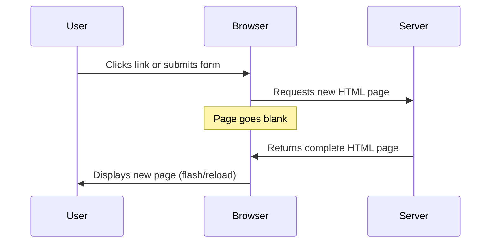
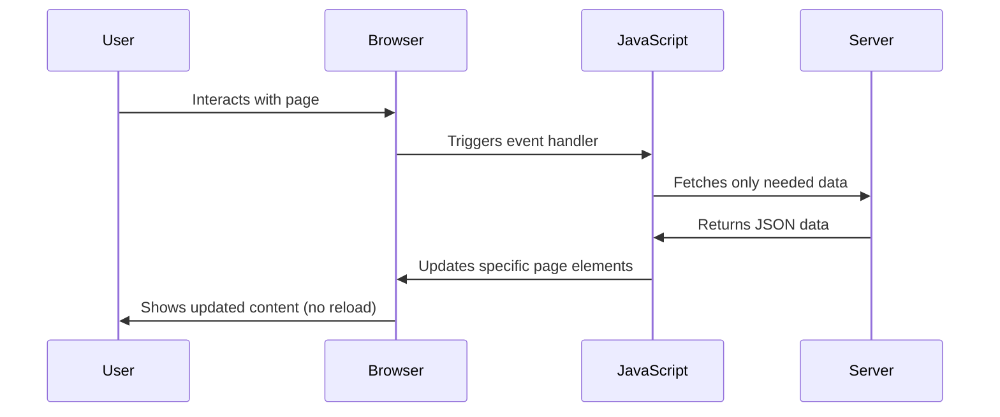
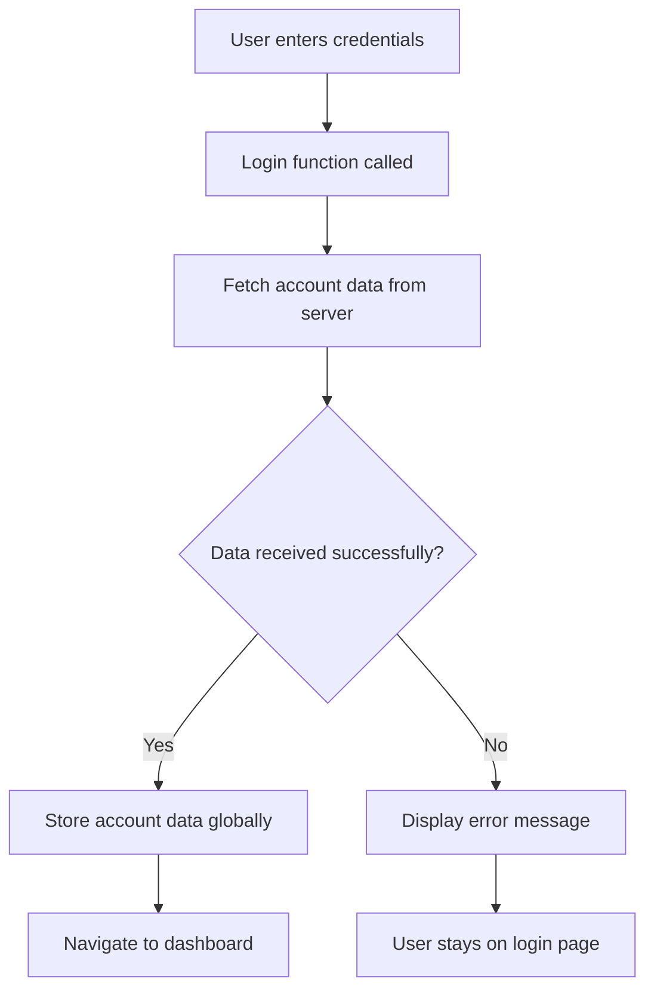
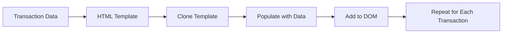

<!--
CO_OP_TRANSLATOR_METADATA:
{
  "original_hash": "2c1164912414820c8efd699b43f64954",
  "translation_date": "2025-10-23T00:01:01+00:00",
  "source_file": "7-bank-project/3-data/README.md",
  "language_code": "tr"
}
-->
# Bankacılık Uygulaması Geliştirme Bölüm 3: Verileri Alma ve Kullanma Yöntemleri

Star Trek'teki Enterprise'ın bilgisayarını düşünün - Kaptan Picard geminin durumunu sorduğunda, bilgiler anında ekranda belirir ve tüm arayüz kapanıp yeniden yüklenmez. İşte burada, dinamik veri alma ile tam olarak bu kesintisiz bilgi akışını oluşturuyoruz.

Şu anda bankacılık uygulamanız basılı bir gazete gibi - bilgilendirici ama statik. Bunu NASA'nın görev kontrol merkezi gibi bir şeye dönüştüreceğiz; burada veriler sürekli olarak akar ve kullanıcıların iş akışını kesintiye uğratmadan gerçek zamanlı olarak güncellenir.

Sunucularla asenkron olarak nasıl iletişim kuracağınızı, farklı zamanlarda gelen verileri nasıl yöneteceğinizi ve ham bilgileri kullanıcılarınız için anlamlı bir şeye nasıl dönüştüreceğinizi öğreneceksiniz. Bu, bir demo ile üretime hazır yazılım arasındaki farktır.

## Ders Öncesi Test

[Ders öncesi test](https://ff-quizzes.netlify.app/web/quiz/45)

### Ön Koşullar

Veri alma işlemine başlamadan önce şu bileşenlerin hazır olduğundan emin olun:

- **Önceki Ders**: [Giriş ve Kayıt Formu](../2-forms/README.md) dersini tamamlayın - bu temelin üzerine inşa edeceğiz.
- **Yerel Sunucu**: [Node.js](https://nodejs.org) yükleyin ve [sunucu API'sini çalıştırın](../api/README.md) hesap verilerini sağlamak için.
- **API Bağlantısı**: Sunucu bağlantınızı şu komutla test edin:

```bash
curl http://localhost:5000/api
# Expected response: "Bank API v1.0.0"
```

Bu hızlı test, tüm bileşenlerin düzgün bir şekilde iletişim kurduğunu doğrular:
- Node.js'in sisteminizde doğru çalıştığını doğrular.
- API sunucunuzun aktif ve yanıt verdiğini onaylar.
- Uygulamanızın sunucuya ulaşabildiğini doğrular (bir görevden önce radyo iletişimini kontrol etmek gibi).

---

## Modern Web Uygulamalarında Veri Alma İşlemini Anlama

Web uygulamalarının veri işleme şekli son yirmi yılda dramatik bir şekilde değişti. Bu evrimi anlamak, neden modern tekniklerin (AJAX ve Fetch API gibi) bu kadar güçlü olduğunu ve neden web geliştiricileri için vazgeçilmez araçlar haline geldiğini anlamanıza yardımcı olacaktır.

Geleneksel web sitelerinin nasıl çalıştığını, bugün oluşturduğumuz dinamik ve duyarlı uygulamalarla karşılaştırarak inceleyelim.

### Geleneksel Çok Sayfalı Uygulamalar (MPA)

Web'in ilk günlerinde, her tıklama eski bir televizyon kanalını değiştirmek gibiydi - ekran boşalır, ardından yeni içerik yavaşça yüklenirdi. Bu, her etkileşimin tüm sayfanın baştan sona yeniden oluşturulması anlamına geldiği erken web uygulamalarının gerçekliğiydi.




**Bu yaklaşım neden hantal hissettiriyordu:**
- Her tıklama, tüm sayfanın baştan sona yeniden oluşturulması anlamına geliyordu.
- Kullanıcılar, bu rahatsız edici sayfa yanıp sönmeleriyle düşüncelerinin ortasında kesintiye uğruyordu.
- İnternet bağlantınız, aynı başlık ve altbilgiyi tekrar tekrar indirerek fazla mesai yapıyordu.
- Uygulamalar, bir dosya dolabında gezinmek gibi hissediliyordu, yazılım kullanmak gibi değil.

### Modern Tek Sayfa Uygulamaları (SPA)

AJAX (Asenkron JavaScript ve XML) bu paradigmayı tamamen değiştirdi. Uluslararası Uzay İstasyonu'nun modüler tasarımı gibi, astronotların tüm yapıyı yeniden inşa etmeden bireysel bileşenleri değiştirebilmesi gibi, AJAX, bir web sayfasının belirli bölümlerini yeniden yüklemeden güncellememize olanak tanır. İsmi XML'den bahsetse de, bugün çoğunlukla JSON kullanıyoruz, ancak temel ilke aynı: yalnızca değişmesi gerekeni güncelleyin.




**SPA'lar neden daha iyi hissettiriyor:**
- Sadece gerçekten değişen bölümler güncellenir (akıllıca, değil mi?).
- Artık rahatsız edici kesintiler yok - kullanıcılar akışlarında kalır.
- Daha az veri kablo üzerinden taşınır, bu da daha hızlı yükleme sağlar.
- Her şey telefonunuzdaki uygulamalar gibi hızlı ve duyarlı hissedilir.

### Modern Fetch API'ye Evrim

Modern tarayıcılar, eski [`XMLHttpRequest`](https://developer.mozilla.org/docs/Web/API/XMLHttpRequest/Using_XMLHttpRequest) yerine [`Fetch` API](https://developer.mozilla.org/docs/Web/API/Fetch_API) sağlar. Telgraf kullanmak ile e-posta kullanmak arasındaki fark gibi, Fetch API, temiz asenkron kod için sözler kullanır ve JSON'u doğal olarak işler.

| Özellik | XMLHttpRequest | Fetch API |
|---------|----------------|----------|
| **Sözdizimi** | Karmaşık geri çağrı tabanlı | Temiz söz tabanlı |
| **JSON İşleme** | Manuel ayrıştırma gerekli | Dahili `.json()` yöntemi |
| **Hata Yönetimi** | Sınırlı hata bilgisi | Kapsamlı hata detayları |
| **Modern Destek** | Eski uyumluluk | ES6+ sözler ve async/await |

> 💡 **Tarayıcı Uyumluluğu**: İyi haber - Fetch API tüm modern tarayıcılarda çalışır! Belirli sürümler hakkında merak ediyorsanız, [caniuse.com](https://caniuse.com/fetch) tam uyumluluk hikayesini sunar.
> 
**Sonuç:**
- Chrome, Firefox, Safari ve Edge'de harika çalışır (temelde kullanıcılarınızın olduğu her yerde).
- Sadece Internet Explorer ekstra yardıma ihtiyaç duyar (ve dürüst olmak gerekirse, IE'yi bırakmanın zamanı geldi).
- Daha sonra kullanacağımız zarif async/await desenleri için sizi mükemmel bir şekilde hazırlar.

### Kullanıcı Girişi ve Veri Alma İşlemini Uygulama

Şimdi bankacılık uygulamanızı statik bir ekrandan işlevsel bir uygulamaya dönüştüren giriş sistemini uygulayalım. Güvenli askeri tesislerde kullanılan kimlik doğrulama protokolleri gibi, kullanıcı kimlik bilgilerini doğrulayacağız ve ardından belirli verilerine erişim sağlayacağız.

Bunu temel kimlik doğrulama ile başlayarak ve ardından veri alma yeteneklerini ekleyerek kademeli olarak oluşturacağız.

#### Adım 1: Giriş Fonksiyonu Temelini Oluşturma

`app.js` dosyanızı açın ve yeni bir `login` fonksiyonu ekleyin. Bu, kullanıcı kimlik doğrulama işlemini yönetecek:

```javascript
async function login() {
  const loginForm = document.getElementById('loginForm');
  const user = loginForm.user.value;
}
```

**Bunu parçalayalım:**
- `async` anahtar kelimesi, JavaScript'e "hey, bu fonksiyonun beklemesi gerekebilir" diyor.
- Sayfadaki formu alıyoruz (sadece ID'sine göre buluyoruz).
- Ardından, kullanıcının kullanıcı adı olarak yazdığı şeyi alıyoruz.
- İşte güzel bir numara: Herhangi bir form girdisine `name` özelliğiyle erişebilirsiniz - ekstra getElementById çağrılarına gerek yok!

> 💡 **Form Erişim Deseni**: Her form kontrolüne, HTML'de `name` özelliği kullanılarak ayarlanan bir form elemanının özelliği olarak erişilebilir. Bu, form verilerini almak için temiz ve okunabilir bir yol sağlar.

#### Adım 2: Hesap Verilerini Alma Fonksiyonu Oluşturma

Sonraki adımda, sunucudan hesap verilerini almak için özel bir fonksiyon oluşturacağız. Bu, kayıt fonksiyonunuzla aynı deseni takip eder ancak veri alımına odaklanır:

```javascript
async function getAccount(user) {
  try {
    const response = await fetch('//localhost:5000/api/accounts/' + encodeURIComponent(user));
    return await response.json();
  } catch (error) {
    return { error: error.message || 'Unknown error' };
  }
}
```

**Bu kodun başardıkları:**
- Modern `fetch` API'yi kullanarak verileri asenkron olarak talep eder.
- Kullanıcı adı parametresiyle bir GET isteği URL'si oluşturur.
- URL'deki özel karakterleri güvenli bir şekilde işlemek için `encodeURIComponent()` uygular.
- Yanıtı JSON formatına dönüştürür, böylece veriler kolayca işlenebilir.
- Hataları zarif bir şekilde yönetir ve çökme yerine bir hata nesnesi döndürür.

> ⚠️ **Güvenlik Notu**: `encodeURIComponent()` fonksiyonu, URL'lerdeki özel karakterleri işler. Denizcilik iletişimlerinde kullanılan kodlama sistemleri gibi, mesajınızın tam olarak amaçlandığı şekilde ulaşmasını sağlar ve "#" veya "&" gibi karakterlerin yanlış yorumlanmasını önler.
> 
**Neden önemli:**
- Özel karakterlerin URL'leri bozmasını önler.
- URL manipülasyon saldırılarına karşı korur.
- Sunucunuzun amaçlanan verileri almasını sağlar.
- Güvenli kodlama uygulamalarını takip eder.

#### HTTP GET İsteklerini Anlama

Şaşırtıcı bir şey: `fetch` ekstra seçenekler olmadan kullanıldığında, otomatik olarak bir [`GET`](https://developer.mozilla.org/docs/Web/HTTP/Methods/GET) isteği oluşturur. Bu, yaptığımız şey için mükemmel - sunucuya "hey, bu kullanıcının hesap verilerini görebilir miyim?" diye sormak.

GET isteklerini bir kütüphaneden ödünç almak gibi düşünün - zaten var olan bir şeyi görmeyi talep ediyorsunuz. Kayıt için kullandığımız POST istekleri ise daha çok koleksiyona eklenmesi için yeni bir kitap göndermek gibidir.

| GET İsteği | POST İsteği |
|-------------|-------------|
| **Amaç** | Mevcut verileri almak | Sunucuya yeni veri göndermek |
| **Parametreler** | URL yolunda/sorgu dizesinde | İstek gövdesinde |
| **Önbellekleme** | Tarayıcılar tarafından önbelleğe alınabilir | Genellikle önbelleğe alınmaz |
| **Güvenlik** | URL'de/günlüklerde görünür | İstek gövdesinde gizli |

#### Adım 3: Her Şeyi Bir Araya Getirme

Şimdi tatmin edici kısım - hesap alma fonksiyonunuzu giriş sürecine bağlayalım. İşte her şeyin yerine oturduğu yer:

```javascript
async function login() {
  const loginForm = document.getElementById('loginForm');
  const user = loginForm.user.value;
  const data = await getAccount(user);

  if (data.error) {
    return console.log('loginError', data.error);
  }

  account = data;
  navigate('/dashboard');
}
```

Bu fonksiyon açık bir sırayı takip eder:
- Form girişinden kullanıcı adını çıkarır.
- Sunucudan kullanıcının hesap verilerini talep eder.
- İşlem sırasında meydana gelen hataları yönetir.
- Hesap verilerini saklar ve başarı durumunda kontrol paneline yönlendirir.

> 🎯 **Async/Await Deseni**: `getAccount` asenkron bir fonksiyon olduğundan, sunucunun yanıt vermesini beklemek için `await` anahtar kelimesini kullanıyoruz. Bu, kodun tanımsız verilerle devam etmesini önler.

#### Adım 4: Verileriniz İçin Bir Alan Oluşturma

Uygulamanız, yüklendikten sonra hesap bilgilerini hatırlayacak bir yere ihtiyaç duyar. Bunu uygulamanızın kısa süreli belleği gibi düşünün - mevcut kullanıcının verilerini elinizin altında tutmak için bir yer. `app.js` dosyanızın en üstüne şu satırı ekleyin:

```javascript
// This holds the current user's account data
let account = null;
```

**Neden buna ihtiyacımız var:**
- Hesap verilerini uygulamanızın herhangi bir yerinden erişilebilir tutar.
- `null` ile başlamak "henüz kimse giriş yapmadı" anlamına gelir.
- Birisi başarıyla giriş yaptığında veya kaydolduğunda güncellenir.
- Tek bir doğru kaynak gibi davranır - kimin giriş yaptığı konusunda kafa karışıklığı olmaz.

#### Adım 5: Formunuzu Bağlayın

Şimdi yeni giriş fonksiyonunuzu HTML formunuza bağlayalım. Form etiketinizi şu şekilde güncelleyin:

```html
<form id="loginForm" action="javascript:login()">
  <!-- Your existing form inputs -->
</form>
```

**Bu küçük değişiklik ne yapar:**
- Formun varsayılan "tüm sayfayı yeniden yükle" davranışını durdurur.
- Bunun yerine özel JavaScript fonksiyonunuzu çağırır.
- Her şeyi sorunsuz ve tek sayfa uygulaması gibi tutar.
- Kullanıcılar "Giriş Yap" düğmesine bastığında ne olacağı üzerinde tam kontrol sağlar.

#### Adım 6: Kayıt Fonksiyonunuzu Geliştirin

Tutarlılık için, `register` fonksiyonunuzu da hesap verilerini saklayacak ve kontrol paneline yönlendirecek şekilde güncelleyin:

```javascript
// Add these lines at the end of your register function
account = result;
navigate('/dashboard');
```

**Bu geliştirme şunları sağlar:**
- **Sorunsuz** bir geçiş sağlar, kayıttan kontrol paneline.
- **Tutarlı** bir kullanıcı deneyimi sunar, giriş ve kayıt akışları arasında.
- **Anında** hesap verilerine erişim sağlar, başarılı bir kayıttan sonra.

#### Uygulamanızı Test Etme



**Şimdi bir deneme yapma zamanı:**
1. Her şeyin çalıştığından emin olmak için yeni bir hesap oluşturun.
2. Aynı kimlik bilgileriyle giriş yapmayı deneyin.
3. Bir şeyler ters giderse tarayıcınızın konsoluna (F12) göz atın.
4. Başarılı bir girişten sonra kontrol paneline ulaştığınızdan emin olun.

Bir şeyler çalışmıyorsa, panik yapmayın! Çoğu sorun, yazım hataları veya API sunucusunu başlatmayı unutmak gibi basit düzeltmelerdir.

#### Çapraz Kaynak Sihri Hakkında Kısa Bir Not

Merak ediyor olabilirsiniz: "Web uygulamam bu API sunucusuyla farklı portlarda çalışırken nasıl iletişim kuruyor?" Harika bir soru! Bu, her web geliştiricisinin eninde sonunda karşılaştığı bir konu.

> 🔒 **Çapraz Kaynak Güvenliği**: Tarayıcılar, farklı alanlar arasında yetkisiz iletişimi önlemek için "aynı kaynak politikası" uygular. Pentagon'daki kontrol noktası sistemi gibi, veri aktarımına izin vermeden önce iletişimin yetkilendirildiğini doğrular.
> 
**Bizim kurulumumuzda:**
- Web uygulamanız `localhost:3000` üzerinde çalışıyor (geliştirme sunucusu).
- API sunucunuz `localhost:5000` üzerinde çalışıyor (arka uç sunucusu).
- API sunucusu, web uygulamanızdan iletişimi açıkça yetkilendiren [CORS başlıkları](https://developer.mozilla.org/docs/Web/HTTP/CORS) içerir.

Bu yapılandırma, ön uç ve arka uç uygulamalarının genellikle ayrı sunucularda çalıştığı gerçek dünya geliştirme ortamını yansıtır.

> 📚 **Daha Fazla Bilgi Edinin**: API'ler ve veri alma işlemleri hakkında daha fazla bilgi edinmek için bu kapsamlı [Microsoft Learn modülüne](https://docs.microsoft.com/learn/modules/use-apis-discover-museum-art/?WT.mc_id=academic-77807-sagibbon) göz atın.

## Verilerinizi HTML'de Hayata Geçirme

Şimdi alınan verileri, kullanıcıların görebileceği ve etkileşimde bulunabileceği şekilde DOM manipülasyonu aracılığıyla görselleştireceğiz. Tıpkı bir karanlık odada fotoğrafları geliştirme süreci gibi, görünmez verileri alıp kullanıcıların görebileceği ve etkileşimde bulunabileceği bir şeye dönüştürüyoruz.

DOM manipülasyonu, statik web sayfalarını kullanıcı etkileşimlerine ve sunucu yanıtlarına dayalı olarak içeriklerini güncelleyen dinamik uygulamalara dönüştüren tekniktir.

### İş İçin Doğru Aracı Seçmek

HTML'inizi JavaScript ile güncellemek söz konusu olduğunda, birkaç seçeneğiniz var. Bunları bir alet çantasında farklı araçlar gibi düşünün - her biri belirli işler için mükemmel:

| Yöntem | Harika olduğu şey | Ne zaman kullanılır | Güvenlik seviyesi |
|--------|---------------------|----------------|--------------|
| `textContent` | Kullanıcı verilerini güvenli bir şekilde göstermek | Herhangi bir zamanda metin gösterirken | ✅ Sağlam |
| `createElement()` + `append()` | Karmaşık düzenler oluşturmak | Yeni bölümler/listeler oluşturmak | ✅ Güvenilir |
| `innerHTML` | HTML içeriği ayarlamak | ⚠️ Bunu kullanmaktan kaçının | ❌ Riskli işler |

#### Metni Güvenli Bir Şekilde Gösterme: textContent

[`textContent`](https://developer.mozilla.org/docs/Web/API/Node/textContent) özelliği, kullanıcı verilerini gösterirken en iyi arkadaşınızdır. Web sayfanız için bir güvenlik görevlisi gibi - zararlı hiçbir şey geçemez:

```javascript
// The safe, reliable way to update text
const balanceElement = document.getElementById('balance');
balanceElement.textContent = account.balance;
```

**textContent'in faydaları:**
- Her şeyi düz metin olarak işler (komut dosyası çalıştırılmasını önler).
- Mevcut içeriği otomatik olarak temizler.
- Basit metin güncellemeleri için verimli.
- Zararlı içeriklere karşı yerleşik güvenlik sağlar.

#### Dinamik HTML Elemanları Oluşturma
Daha karmaşık içerikler için [`document.createElement()`](https://developer.mozilla.org/docs/Web/API/Document/createElement) yöntemini [`append()`](https://developer.mozilla.org/docs/Web/API/ParentNode/append) yöntemiyle birleştirin:

```javascript
// Safe way to create new elements
const transactionItem = document.createElement('div');
transactionItem.className = 'transaction-item';
transactionItem.textContent = `${transaction.date}: ${transaction.description}`;
container.append(transactionItem);
```

**Bu yaklaşımı anlamak:**
- **Yeni** DOM öğelerini programlı olarak oluşturur
- **Öğelerin** özellikleri ve içeriği üzerinde tam kontrol sağlar
- **Karmaşık** ve iç içe geçmiş öğe yapıları oluşturmanıza olanak tanır
- **Güvenliği** korur, yapıyı içerikten ayırır

> ⚠️ **Güvenlik Dikkati**: [`innerHTML`](https://developer.mozilla.org/docs/Web/API/Element/innerHTML) birçok öğreticide yer alsa da, gömülü komut dosyalarını çalıştırabilir. CERN'deki yetkisiz kod çalıştırmayı önleyen güvenlik protokolleri gibi, `textContent` ve `createElement` kullanımı daha güvenli alternatifler sunar.
> 
**innerHTML'nin riskleri:**
- Kullanıcı verilerindeki `<script>` etiketlerini çalıştırır
- Kod enjeksiyon saldırılarına karşı savunmasızdır
- Potansiyel güvenlik açıkları oluşturur
- Kullandığımız güvenli alternatifler eşdeğer işlevsellik sağlar

### Hataları Kullanıcı Dostu Hale Getirme

Şu anda, giriş hataları yalnızca kullanıcıların göremediği tarayıcı konsolunda görünüyor. Bir pilotun iç tanılamaları ile yolcu bilgi sistemi arasındaki fark gibi, önemli bilgileri uygun kanal aracılığıyla iletmemiz gerekiyor.

Görünür hata mesajları uygulamak, kullanıcılara neyin yanlış gittiği ve nasıl devam edecekleri hakkında anında geri bildirim sağlar.

#### Adım 1: Hata Mesajları İçin Bir Alan Ekleyin

Öncelikle, HTML'nize hata mesajları için bir alan ekleyelim. Bunu giriş düğmenizin hemen önüne ekleyin, böylece kullanıcılar doğal olarak görebilir:

```html
<!-- This is where error messages will appear -->
<div id="loginError" role="alert"></div>
<button>Login</button>
```

**Burada olanlar:**
- Gerekene kadar görünmez kalan boş bir konteyner oluşturuyoruz
- "Giriş Yap" düğmesine tıkladıktan sonra kullanıcıların doğal olarak baktığı yere yerleştirilmiştir
- Ekran okuyucular için `role="alert"` güzel bir dokunuş - bu, yardımcı teknolojilere "hey, bu önemli!" der
- Benzersiz `id`, JavaScript'imize kolay bir hedef sağlar

#### Adım 2: Kullanışlı Bir Yardımcı Fonksiyon Oluşturun

Herhangi bir öğenin metnini güncelleyebilecek küçük bir yardımcı fonksiyon yapalım. Bu, "bir kez yaz, her yerde kullan" türünden bir fonksiyon olacak ve size zaman kazandıracak:

```javascript
function updateElement(id, text) {
  const element = document.getElementById(id);
  element.textContent = text;
}
```

**Fonksiyonun faydaları:**
- Sadece bir öğe ID'si ve metin içeriği gerektiren basit bir arayüz
- DOM öğelerini güvenli bir şekilde bulur ve günceller
- Kod tekrarını azaltan yeniden kullanılabilir bir model
- Uygulama genelinde tutarlı güncelleme davranışını korur

#### Adım 3: Hataları Kullanıcıların Görebileceği Yerde Gösterin

Şimdi, gizli konsol mesajını kullanıcıların gerçekten görebileceği bir şeyle değiştirelim. Giriş fonksiyonunuzu güncelleyin:

```javascript
// Instead of just logging to console, show the user what's wrong
if (data.error) {
  return updateElement('loginError', data.error);
}
```

**Bu küçük değişiklik büyük bir fark yaratır:**
- Hata mesajları kullanıcıların baktığı yerde görünür
- Artık gizemli sessiz hatalar yok
- Kullanıcılar anında, uygulanabilir geri bildirim alır
- Uygulamanız profesyonel ve düşünceli hissettirmeye başlar

Şimdi geçersiz bir hesapla test ettiğinizde, sayfanın hemen üzerinde yardımcı bir hata mesajı göreceksiniz!


#### Adım 4: Erişilebilirlik ile Kapsayıcı Olmak

Daha önce eklediğimiz `role="alert"` hakkında ilginç bir şey var - sadece süsleme değil! Bu küçük özellik, ekran okuyuculara değişiklikleri hemen duyuran bir [Canlı Bölge](https://developer.mozilla.org/docs/Web/Accessibility/ARIA/ARIA_Live_Regions) oluşturur:

```html
<div id="loginError" role="alert"></div>
```

**Neden önemli:**
- Ekran okuyucu kullanıcıları hata mesajını görünür olur olmaz duyar
- Herkes, nasıl gezindiğine bakılmaksızın aynı önemli bilgiyi alır
- Uygulamanızın daha fazla kişi için çalışmasını sağlamak için basit bir yol
- Kapsayıcı deneyimler yaratmaya önem verdiğinizi gösterir

Bu tür küçük dokunuşlar, iyi geliştiricileri harika olanlardan ayırır!

#### Adım 5: Aynı Deseni Kayıt İşlemine Uygulama

Tutarlılık için, kayıt formunuzda aynı hata işleme yöntemini uygulayın:

1. **Kayıt** HTML'nize bir hata gösterim öğesi ekleyin:
```html
<div id="registerError" role="alert"></div>
```

2. **Kayıt** fonksiyonunuzu aynı hata gösterim modelini kullanacak şekilde güncelleyin:
```javascript
if (data.error) {
  return updateElement('registerError', data.error);
}
```

**Tutarlı hata işleme faydaları:**
- **Tüm** formlarda tutarlı bir kullanıcı deneyimi sağlar
- **Tanıdık** desenler kullanarak bilişsel yükü azaltır
- **Bakımı** yeniden kullanılabilir kodla basitleştirir
- **Erişilebilirlik** standartlarının uygulama genelinde karşılanmasını sağlar

## Dinamik Panelinizi Oluşturma

Şimdi statik panelinizi gerçek hesap verilerini gösteren dinamik bir arayüze dönüştüreceğiz. Basılı bir uçuş programı ile havaalanlarındaki canlı kalkış panoları arasındaki fark gibi, statik bilgiden gerçek zamanlı, duyarlı ekranlara geçiyoruz.

Öğrendiğiniz DOM manipülasyon tekniklerini kullanarak, mevcut hesap bilgileriyle otomatik olarak güncellenen bir panel oluşturacağız.

### Verilerinizi Tanımak

Başlamadan önce, sunucunuzun geri gönderdiği veri türüne bir göz atalım. Birisi başarılı bir şekilde giriş yaptığında, işleyebileceğiniz bilgi hazinesi şunları içerir:

```json
{
  "user": "test",
  "currency": "$",
  "description": "Test account",
  "balance": 75,
  "transactions": [
    { "id": "1", "date": "2020-10-01", "object": "Pocket money", "amount": 50 },
    { "id": "2", "date": "2020-10-03", "object": "Book", "amount": -10 },
    { "id": "3", "date": "2020-10-04", "object": "Sandwich", "amount": -5 }
  ]
}
```

**Bu veri yapısı şunları sağlar:**
- **`user`**: Deneyimi kişiselleştirmek için mükemmel ("Tekrar hoş geldiniz, Sarah!")
- **`currency`**: Para miktarlarını doğru şekilde görüntülememizi sağlar
- **`description`**: Hesap için dostça bir ad
- **`balance`**: En önemli mevcut bakiye
- **`transactions`**: Tüm detaylarıyla eksiksiz işlem geçmişi

Profesyonel görünümlü bir bankacılık paneli oluşturmak için ihtiyacınız olan her şey!

> 💡 **İpucu**: Panelinizi hemen çalışır durumda görmek mi istiyorsunuz? Giriş yaparken `test` kullanıcı adını kullanın - önceden yüklenmiş örnek verilerle gelir, böylece önce işlem oluşturmak zorunda kalmadan her şeyin çalıştığını görebilirsiniz.
> 
**Test hesabının faydaları:**
- Gerçekçi örnek verilerle önceden yüklenmiştir
- İşlemlerin nasıl görüntülendiğini görmek için mükemmel
- Panel özelliklerinizi test etmek için harika
- Sahte veriler oluşturmak zorunda kalmaktan kurtarır

### Panel Görüntüleme Öğelerini Oluşturma

Hesap özet bilgileriyle başlayarak, ardından işlem listeleri gibi daha karmaşık özelliklere geçerek panel arayüzünüzü adım adım oluşturalım.

#### Adım 1: HTML Yapınızı Güncelleyin

Öncelikle, statik "Bakiye" bölümünü JavaScript'in doldurabileceği dinamik yer tutucu öğelerle değiştirin:

```html
<section>
  Balance: <span id="balance"></span><span id="currency"></span>
</section>
```

Sonra, hesap açıklaması için bir bölüm ekleyin. Bu, panel içeriği için bir başlık görevi gördüğünden, semantik HTML kullanın:

```html
<h2 id="description"></h2>
```

**HTML yapısını anlamak:**
- **Bakiye** ve para birimi için ayrı `<span>` öğeleri kullanır, bireysel kontrol sağlar
- **Her** öğeye JavaScript hedeflemesi için benzersiz ID'ler uygular
- **Semantik** HTML'yi takip ederek hesap açıklaması için `<h2>` kullanır
- **Ekran okuyucular ve SEO için** mantıklı bir hiyerarşi oluşturur

> ✅ **Erişilebilirlik Bilgisi**: Hesap açıklaması, panel içeriği için bir başlık işlevi görür, bu nedenle semantik olarak bir başlık olarak işaretlenmiştir. [Başlık yapısının](https://www.nomensa.com/blog/2017/how-structure-headings-web-accessibility) erişilebilirliği nasıl etkilediği hakkında daha fazla bilgi edinin. Sayfanızdaki başlık etiketlerinden faydalanabilecek diğer öğeleri tanımlayabilir misiniz?

#### Adım 2: Panel Güncelleme Fonksiyonunu Oluşturun

Şimdi, panelinizi gerçek hesap verileriyle dolduran bir fonksiyon oluşturun:

```javascript
function updateDashboard() {
  if (!account) {
    return navigate('/login');
  }

  updateElement('description', account.description);
  updateElement('balance', account.balance.toFixed(2));
  updateElement('currency', account.currency);
}
```

**Bu fonksiyonun adım adım yaptığı işlemler:**
- **Hesap** verilerinin mevcut olduğunu doğrular
- **Kimlik doğrulaması yapılmamış** kullanıcıları giriş sayfasına yönlendirir
- **Hesap** açıklamasını yeniden kullanılabilir `updateElement` fonksiyonunu kullanarak günceller
- **Bakiyeyi** her zaman iki ondalık basamak gösterecek şekilde biçimlendirir
- **Uygun** para birimi simgesini görüntüler

> 💰 **Para Biçimlendirme**: [`toFixed(2)`](https://developer.mozilla.org/docs/Web/JavaScript/Reference/Global_Objects/Number/toFixed) yöntemi hayat kurtarıcıdır! Bakiyenizin her zaman gerçek para gibi görünmesini sağlar - "75.00" yerine sadece "75". Kullanıcılarınız tanıdık para birimi biçimlendirmesini görmeyi takdir edecektir.

#### Adım 3: Panelinizin Güncellendiğinden Emin Olun

Birisi her ziyaret ettiğinde panelinizin güncel verilerle yenilenmesini sağlamak için gezinme sisteminize bağlanmamız gerekiyor. Eğer [ders 1 ödevini](../1-template-route/assignment.md) tamamladıysanız, bu tanıdık gelecektir. Eğer tamamlamadıysanız endişelenmeyin - işte ihtiyacınız olanlar:

`updateRoute()` fonksiyonunuzun sonuna şunu ekleyin:

```javascript
if (typeof route.init === 'function') {
  route.init();
}
```

Sonra rotalarınızı panel başlatma kodunu içerecek şekilde güncelleyin:

```javascript
const routes = {
  '/login': { templateId: 'login' },
  '/dashboard': { templateId: 'dashboard', init: updateDashboard }
};
```

**Bu akıllı kurulumun yaptığı şey:**
- Bir rotanın özel başlatma kodu olup olmadığını kontrol eder
- Rota yüklendiğinde bu kodu otomatik olarak çalıştırır
- Panelinizin her zaman taze, güncel verileri göstermesini sağlar
- Gezinme mantığınızı temiz ve düzenli tutar

#### Panelinizi Test Etme

Bu değişiklikleri uyguladıktan sonra panelinizi test edin:

1. **Test hesabıyla giriş yapın**
2. **Panelinize yönlendirildiğinizi doğrulayın**
3. **Hesap açıklaması, bakiye ve para biriminin doğru şekilde görüntülendiğini kontrol edin**
4. **Çıkış yapıp tekrar giriş yapmayı deneyin** ve verilerin düzgün şekilde yenilendiğinden emin olun

Paneliniz artık giriş yapan kullanıcının verilerine göre güncellenen dinamik hesap bilgilerini göstermelidir!

## Şablonlarla Akıllı İşlem Listeleri Oluşturma

Her işlem için manuel olarak HTML oluşturmak yerine, tutarlı biçimlendirmeyi otomatik olarak oluşturmak için şablonları kullanacağız. Uzay aracı üretiminde kullanılan standart bileşenler gibi, şablonlar her işlem satırının aynı yapıyı ve görünümü takip etmesini sağlar.

Bu teknik, birkaç işlemden binlerce işlem ölçeğine kadar verimli bir şekilde çalışır ve tutarlı performans ve sunum sağlar.



### Adım 1: İşlem Şablonunu Oluşturun

Öncelikle, HTML `<body>` içinde işlem satırları için yeniden kullanılabilir bir şablon ekleyin:

```html
<template id="transaction">
  <tr>
    <td></td>
    <td></td>
    <td></td>
  </tr>
</template>
```

**HTML şablonlarını anlamak:**
- **Tek** bir tablo satırı için yapıyı tanımlar
- **Görünmez** kalır, JavaScript ile kopyalanıp doldurulana kadar
- **Tarih**, açıklama ve miktar için üç hücre içerir
- **Tutarlı** biçimlendirme için yeniden kullanılabilir bir model sağlar

### Adım 2: Tabloyu Dinamik İçerik İçin Hazırlayın

Sonra, JavaScript'in kolayca hedef alabilmesi için tablo gövdesine bir `id` ekleyin:

```html
<tbody id="transactions"></tbody>
```

**Bunun sağladıkları:**
- **İşlem** satırlarını eklemek için net bir hedef oluşturur
- **Tablo** yapısını dinamik içerikten ayırır
- **İşlem** verilerini kolayca temizleme ve yeniden doldurma olanağı sağlar

### Adım 3: İşlem Satırı Üretim Fonksiyonunu Oluşturun

Şimdi işlem verilerini HTML öğelerine dönüştüren bir fonksiyon oluşturun:

```javascript
function createTransactionRow(transaction) {
  const template = document.getElementById('transaction');
  const transactionRow = template.content.cloneNode(true);
  const tr = transactionRow.querySelector('tr');
  tr.children[0].textContent = transaction.date;
  tr.children[1].textContent = transaction.object;
  tr.children[2].textContent = transaction.amount.toFixed(2);
  return transactionRow;
}
```

**Bu üretim fonksiyonunun ayrıntıları:**
- **Şablon** öğesini ID'sine göre alır
- **Şablon** içeriğini güvenli bir şekilde kopyalar
- **Kopyalanan** içerikteki tablo satırını seçer
- **Her** hücreyi işlem verileriyle doldurur
- **Miktarı** doğru ondalık basamakları gösterecek şekilde biçimlendirir
- **Tamamlanmış** satırı eklemeye hazır olarak döndürür

### Adım 4: Birden Fazla İşlem Satırını Verimli Bir Şekilde Oluşturma

Tüm işlemleri göstermek için `updateDashboard()` fonksiyonunuza şu kodu ekleyin:

```javascript
const transactionsRows = document.createDocumentFragment();
for (const transaction of account.transactions) {
  const transactionRow = createTransactionRow(transaction);
  transactionsRows.appendChild(transactionRow);
}
updateElement('transactions', transactionsRows);
```

**Bu verimli yaklaşımı anlamak:**
- **DOM** işlemlerini toplu olarak yapmak için bir belge parçası oluşturur
- **Hesap** verilerindeki tüm işlemleri döngüye alır
- **Her** işlem için üretim fonksiyonunu kullanarak bir satır oluşturur
- **Tüm** satırları DOM'a eklemeden önce parçada toplar
- **Bir** kerelik DOM güncellemesi yapar, birden fazla bireysel ekleme yerine

> ⚡ **Performans Optimizasyonu**: [`document.createDocumentFragment()`](https://developer.mozilla.org/docs/Web/API/Document/createDocumentFragment), Boeing'deki montaj süreci gibi çalışır - bileşenler ana hat dışında hazırlanır, ardından tamamlanmış bir birim olarak kurulur. Bu toplu yaklaşım, birden fazla bireysel işlem yerine tek bir ekleme yaparak DOM yeniden akışlarını en aza indirir.

### Adım 5: Karışık İçerik İçin Güncelleme Fonksiyonunu Geliştirme

`updateElement()` fonksiyonunuz şu anda yalnızca metin içeriğiyle çalışıyor. Bunu hem metin hem de DOM düğümleriyle çalışacak şekilde güncelleyin:

```javascript
function updateElement(id, textOrNode) {
  const element = document.getElementById(id);
  element.textContent = ''; // Removes all children
  element.append(textOrNode);
}
```

**Bu güncellemedeki önemli iyileştirmeler:**
- **Mevcut** içeriği yeni içerik eklemeden önce temizler
- **Metin** dizeleri veya DOM düğümlerini parametre olarak kabul eder
- **Esneklik** için [`append()`](https://developer.mozilla.org/docs/Web/API/ParentNode/append) yöntemini kullanır
- **Mevcut** metin tabanlı kullanım ile geriye dönük uyumluluğu korur

### Panelinizi Test Etmek

Gerçek an geldi! Dinamik panelinizi çalışırken görelim:

1. `test` hesabını kullanarak giriş yapın (örnek veriler hazır)
2. Panelinize gidin
3. İşlem satırlarının doğru biçimlendirme ile göründüğünü kontrol edin
4. Tarihlerin, açıklamaların ve miktarların düzgün göründüğünden emin olun

Her şey çalışıyorsa, panelinizde tamamen işlevsel bir işlem listesi görmelisiniz! 🎉

**Başardıklarınız:**
- Her miktarda veriyle ölçeklenen bir panel oluşturmak
- Tutarlı biçimlendirme için yeniden kullanılabilir şablonlar oluşturmak
- Verimli DOM manipülasyon tekniklerini uygulamak
- Üretim bankacılık uygulamalarına benzer işlevsellik geliştirmek

Statik bir web sayfasını dinamik bir web uygulamasına başarıyla dönüştürdünüz.

---

## GitHub Copilot Agent Challenge 🚀

Agent modunu kullanarak aşağıdaki meydan okumayı tamamlayın:

**Açıklama:** Kullanıcıların tarih aralığı, miktar veya açıklamaya göre belirli işlemleri bulmasına olanak tanıyan bir işlem arama ve filtreleme özelliği ekleyerek bankacılık uygulamasını geliştirin.
**İpucu:** Bankacılık uygulaması için aşağıdaki özellikleri içeren bir arama işlevi oluşturun: 1) Tarih aralığı (başlangıç/bitiş), minimum/maksimum tutar ve işlem açıklama anahtar kelimeleri için giriş alanları içeren bir arama formu, 2) Arama kriterlerine göre account.transactions dizisini filtreleyen bir `filterTransactions()` fonksiyonu, 3) Filtrelenmiş sonuçları göstermek için `updateDashboard()` fonksiyonunu güncelleme, ve 4) Görünümü sıfırlamak için bir "Filtreleri Temizle" düğmesi ekleme. Modern JavaScript dizi yöntemlerini, örneğin `filter()` kullanın ve boş arama kriterleri için kenar durumlarını ele alın.

[agent mode](https://code.visualstudio.com/blogs/2025/02/24/introducing-copilot-agent-mode) hakkında daha fazla bilgi edinin.

## 🚀 Zorluk

Bankacılık uygulamanızı bir üst seviyeye taşımaya hazır mısınız? İşte uygulamanızı gerçekten kullanmak isteyeceğiniz bir şeye dönüştürmek için bazı fikirler:

**Görsel olarak güzel yapın**: İşlevsel kontrol panelinizi görsel olarak çekici bir şeye dönüştürmek için CSS stilleri ekleyin. Temiz çizgiler, iyi boşluklar ve belki de bazı hafif animasyonlar düşünün.

**Duyarlı yapın**: Telefonlar, tabletler ve masaüstlerinde harika çalışan bir [duyarlı tasarım](https://developer.mozilla.org/docs/Web/Progressive_web_apps/Responsive/responsive_design_building_blocks) oluşturmak için [media queries](https://developer.mozilla.org/docs/Web/CSS/Media_Queries) kullanmayı deneyin. Kullanıcılarınız size teşekkür edecek!

**Biraz renk katın**: İşlemleri renk kodlarıyla ayırmayı düşünün (gelir için yeşil, giderler için kırmızı), simgeler ekleyin veya arayüzü etkileşimli hissettiren hover efektleri oluşturun.

İşte cilalı bir kontrol panelinin nasıl görünebileceğine dair bir örnek:


Bunu tam olarak eşleştirmek zorunda hissetmeyin - ilham kaynağı olarak kullanın ve kendi tarzınızı yaratın!

## Ders Sonrası Test

[Ders sonrası test](https://ff-quizzes.netlify.app/web/quiz/46)

## Ödev

[Kodunuzu yeniden düzenleyin ve yorumlayın](assignment.md)

---

**Feragatname**:  
Bu belge, AI çeviri hizmeti [Co-op Translator](https://github.com/Azure/co-op-translator) kullanılarak çevrilmiştir. Doğruluk için çaba göstersek de, otomatik çevirilerin hata veya yanlışlıklar içerebileceğini lütfen unutmayın. Belgenin orijinal dili, yetkili kaynak olarak kabul edilmelidir. Kritik bilgiler için profesyonel insan çevirisi önerilir. Bu çevirinin kullanımından kaynaklanan yanlış anlamalar veya yanlış yorumlamalar için sorumluluk kabul etmiyoruz.