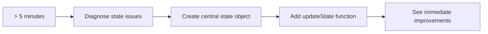
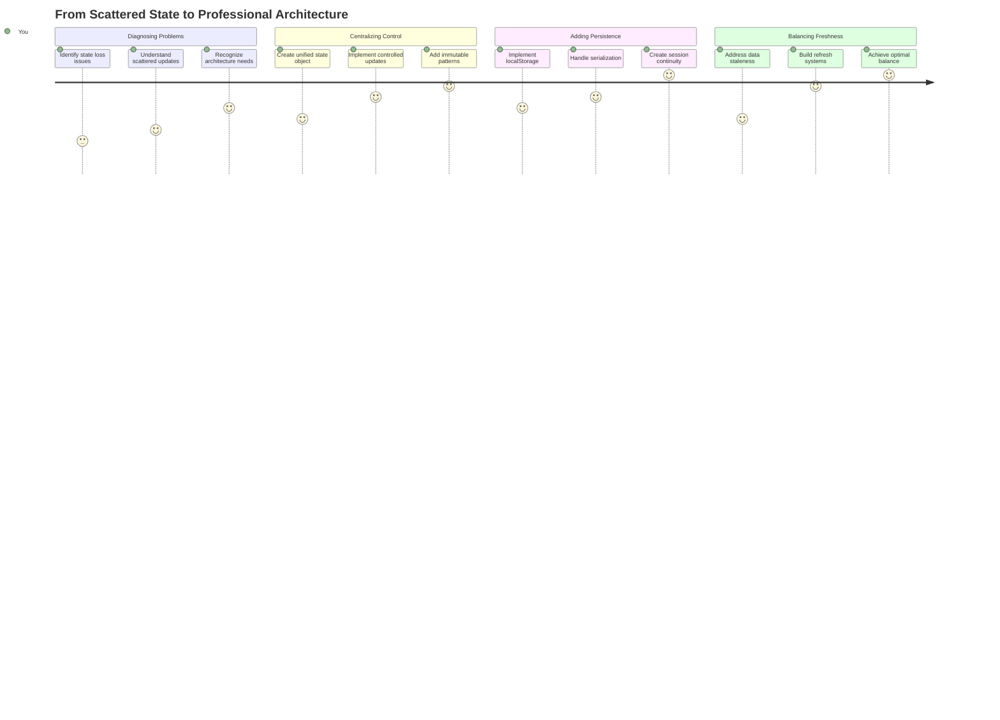
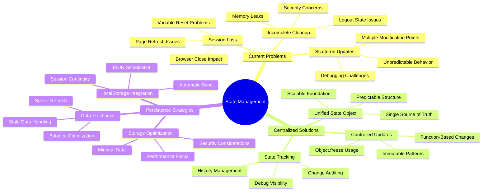
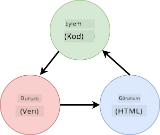
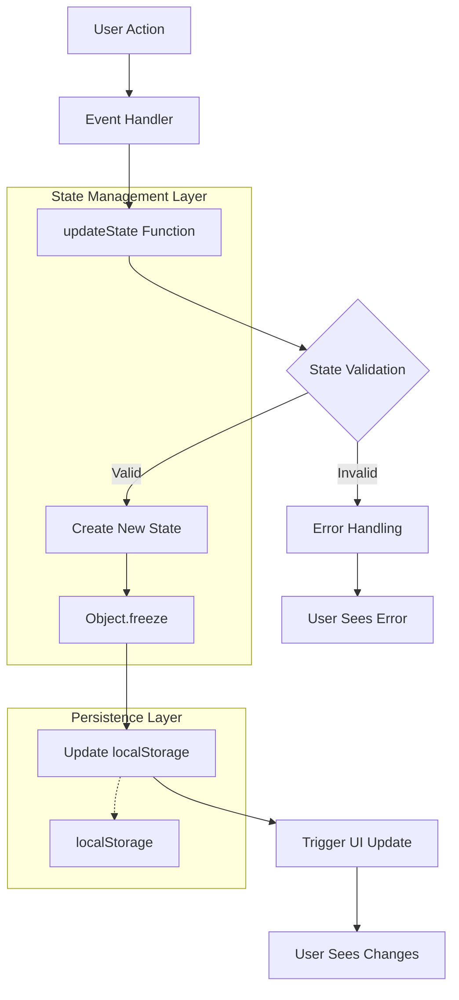
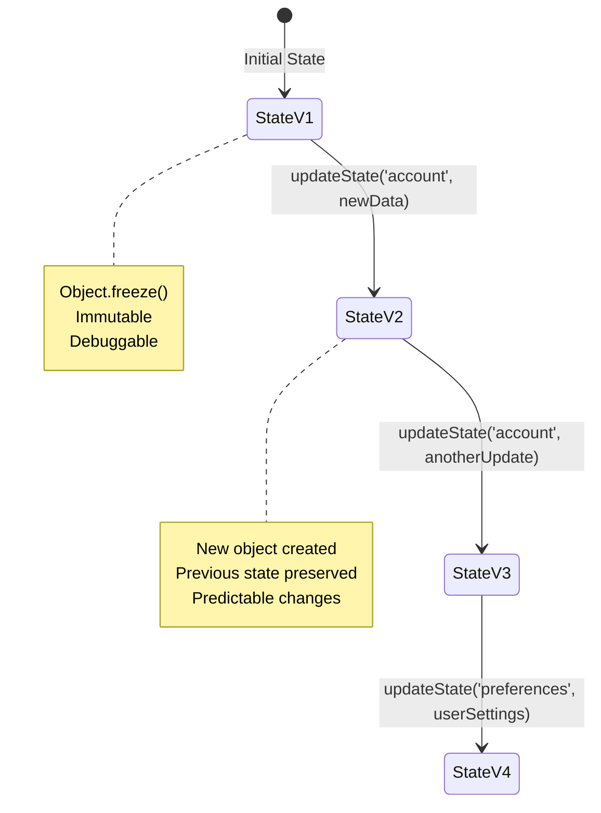
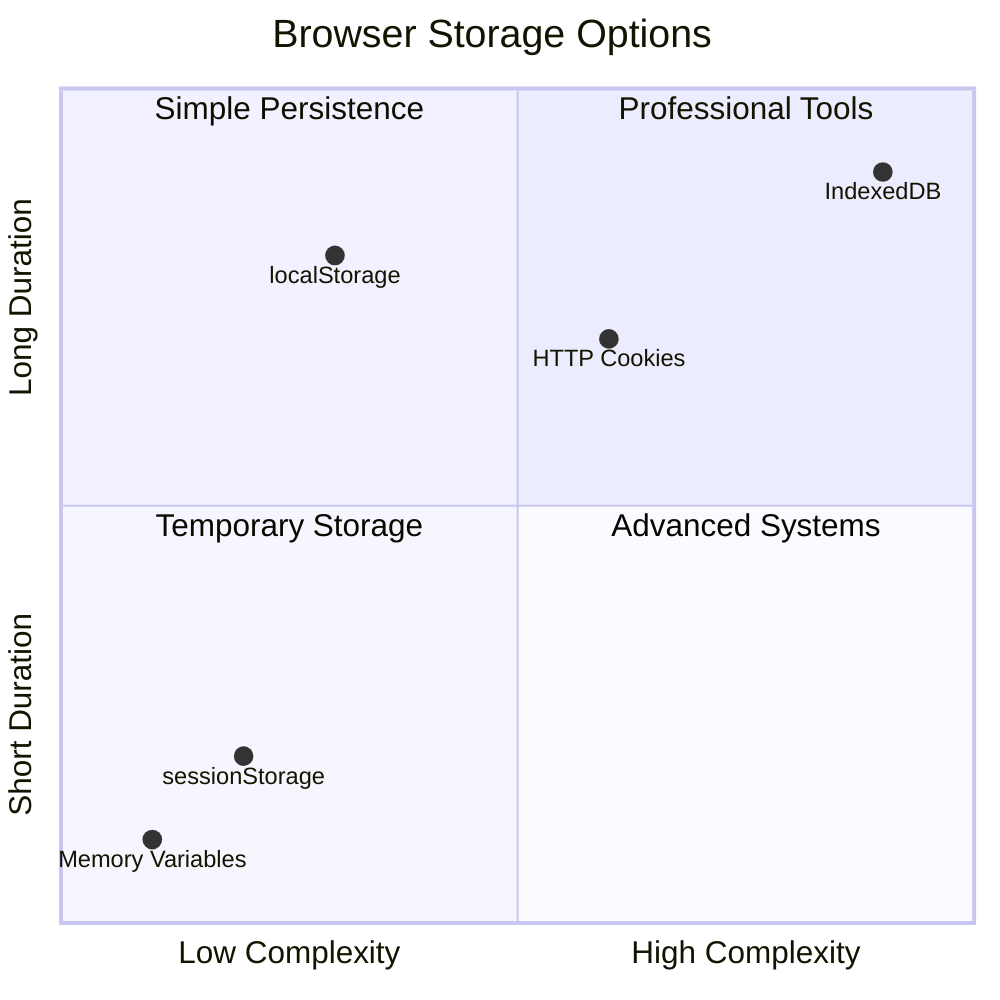
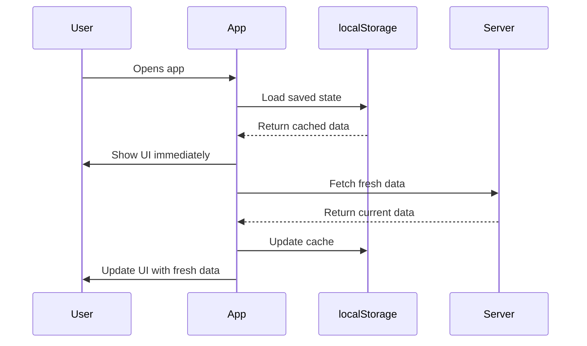
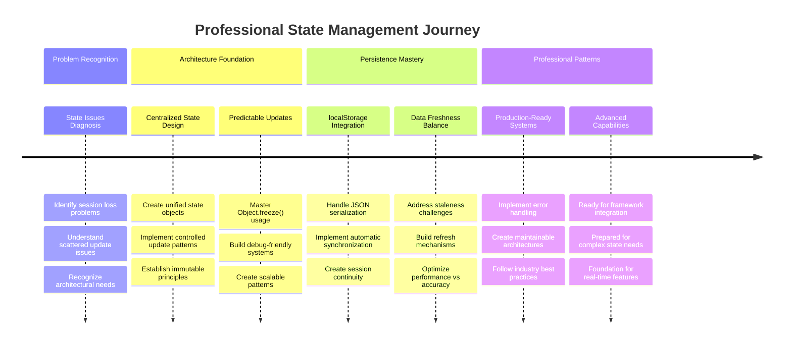
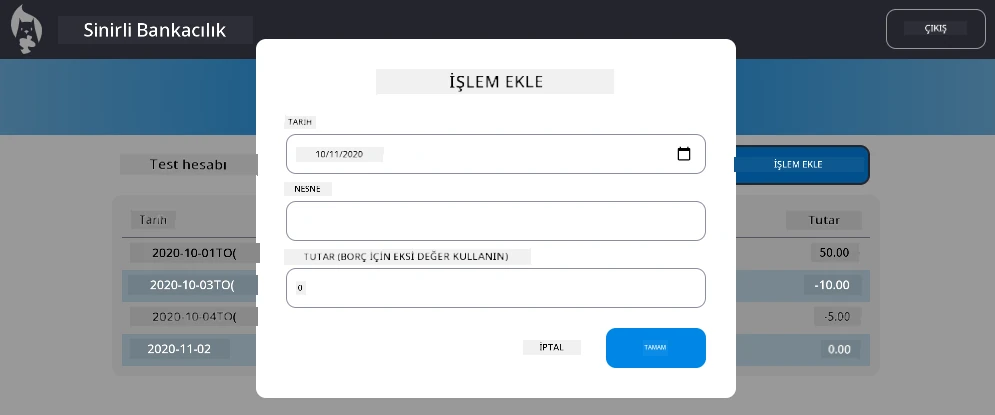

<!--
CO_OP_TRANSLATOR_METADATA:
{
  "original_hash": "b807b09df716dc48a2b750835bf8e933",
  "translation_date": "2025-11-04T00:56:44+00:00",
  "source_file": "7-bank-project/4-state-management/README.md",
  "language_code": "tr"
}
-->
# Bankacılık Uygulaması Yapımı Bölüm 4: Durum Yönetimi Kavramları

## ⚡ Sonraki 5 Dakikada Yapabilecekleriniz

**Yoğun Geliştiriciler için Hızlı Başlangıç Yolu**



- **1. Dakika**: Mevcut durum sorununu test edin - giriş yapın, sayfayı yenileyin, çıkış yapmayı gözlemleyin
- **2. Dakika**: `let account = null` ifadesini `let state = { account: null }` ile değiştirin
- **3. Dakika**: Kontrollü güncellemeler için basit bir `updateState()` fonksiyonu oluşturun
- **4. Dakika**: Yeni deseni kullanmak için bir fonksiyonu güncelleyin
- **5. Dakika**: Geliştirilmiş öngörülebilirlik ve hata ayıklama yeteneğini test edin

**Hızlı Tanı Testi**:
```javascript
// Before: Scattered state
let account = null; // Lost on refresh!

// After: Centralized state
let state = Object.freeze({ account: null }); // Controlled and trackable!
```

**Neden Önemli**: 5 dakika içinde, kaotik durum yönetiminden öngörülebilir ve hata ayıklanabilir desenlere dönüşümü deneyimleyeceksiniz. Bu, karmaşık uygulamaları sürdürülebilir kılan temeldir.

## 🗺️ Durum Yönetimi Ustalığı Öğrenme Yolculuğunuz



**Yolculuğunuzun Hedefi**: Bu dersin sonunda, kalıcılığı, veri tazeliğini ve öngörülebilir güncellemeleri ele alan profesyonel bir durum yönetimi sistemi oluşturmuş olacaksınız - üretim uygulamalarında kullanılan aynı desenler.

## Ders Öncesi Test

[Ders öncesi test](https://ff-quizzes.netlify.app/web/quiz/47)

## Giriş

Durum yönetimi, Voyager uzay aracındaki navigasyon sistemi gibidir – her şey sorunsuz çalıştığında, orada olduğunu bile fark etmezsiniz. Ancak işler ters gittiğinde, yıldızlararası uzaya ulaşmak ile kozmik boşlukta kaybolmak arasındaki farkı yaratır. Web geliştirmede, durum, uygulamanızın hatırlaması gereken her şeyi temsil eder: kullanıcı giriş durumu, form verileri, gezinme geçmişi ve geçici arayüz durumları.

Bankacılık uygulamanız basit bir giriş formundan daha sofistike bir uygulamaya dönüştükçe, muhtemelen bazı yaygın zorluklarla karşılaşmışsınızdır. Sayfayı yenileyin ve kullanıcılar beklenmedik bir şekilde çıkış yapar. Tarayıcıyı kapatın ve tüm ilerleme kaybolur. Bir sorunu hata ayıklayın ve aynı veriyi farklı şekillerde değiştiren birden fazla işlev arasında dolaşırsınız.

Bunlar kötü kodlamanın işaretleri değil – uygulamalar belirli bir karmaşıklık eşiğine ulaştığında ortaya çıkan doğal büyüme sancılarıdır. Her geliştirici, uygulamaları "konsept kanıtı"ndan "üretime hazır" hale geçerken bu zorluklarla karşılaşır.

Bu derste, bankacılık uygulamanızı güvenilir, profesyonel bir uygulamaya dönüştüren merkezi bir durum yönetim sistemi uygulayacağız. Verilerin akışını öngörülebilir bir şekilde yönetmeyi, kullanıcı oturumlarını uygun şekilde sürdürmeyi ve modern web uygulamalarının gerektirdiği akıcı kullanıcı deneyimini oluşturmayı öğreneceksiniz.

## Ön Koşullar

Durum yönetimi kavramlarına dalmadan önce, geliştirme ortamınızın düzgün bir şekilde ayarlandığından ve bankacılık uygulamanızın temelinin hazır olduğundan emin olmanız gerekir. Bu ders, bu serinin önceki bölümlerindeki kavramlar ve kodlar üzerine inşa edilmiştir.

Devam etmeden önce aşağıdaki bileşenlerin hazır olduğundan emin olun:

**Gerekli Kurulum:**
- [Veri alma dersi](../3-data/README.md) tamamlanmış olmalı - uygulamanız hesap verilerini başarıyla yükleyip görüntüleyebilmelidir
- [Node.js](https://nodejs.org) sisteminize yüklenmiş olmalı, böylece arka uç API'sini çalıştırabilirsiniz
- Hesap veri işlemleri için [sunucu API'sini](../api/README.md) yerel olarak başlatın

**Ortamınızı Test Etme:**

API sunucunuzun doğru çalıştığını aşağıdaki komutu bir terminalde çalıştırarak doğrulayın:

```sh
curl http://localhost:5000/api
# -> should return "Bank API v1.0.0" as a result
```

**Bu komut ne yapar:**
- **GET isteği gönderir** yerel API sunucunuza
- **Bağlantıyı test eder** ve sunucunun yanıt verdiğini doğrular
- **API sürüm bilgilerini döndürür** her şey düzgün çalışıyorsa

## 🧠 Durum Yönetimi Mimari Genel Bakış



**Temel İlke**: Profesyonel durum yönetimi, basit etkileşimlerden karmaşık uygulama iş akışlarına kadar ölçeklenen güvenilir kullanıcı deneyimleri oluşturmak için öngörülebilirlik, kalıcılık ve performans arasında denge kurar.

---

## Mevcut Durum Sorunlarını Teşhis Etme

Bir suç mahallini inceleyen Sherlock Holmes gibi, kullanıcı oturumlarının kaybolması gizemini çözmeden önce mevcut uygulamamızda tam olarak neler olduğunu anlamamız gerekiyor.

Mevcut durum yönetimi zorluklarını ortaya çıkaran basit bir deney yapalım:

**🧪 Bu Tanı Testini Deneyin:**
1. Bankacılık uygulamanıza giriş yapın ve kontrol paneline gidin
2. Tarayıcı sayfasını yenileyin
3. Giriş durumunuza ne olduğunu gözlemleyin

Eğer giriş ekranına geri yönlendirildiyseniz, klasik bir durum kalıcılığı sorununu keşfettiniz. Bu davranış, mevcut uygulamamızın kullanıcı verilerini her sayfa yüklemesinde sıfırlanan JavaScript değişkenlerinde saklamasından kaynaklanır.

**Mevcut Uygulama Sorunları:**

[Önceki dersten](../3-data/README.md) basit `account` değişkeni, hem kullanıcı deneyimini hem de kodun sürdürülebilirliğini etkileyen üç önemli soruna neden olur:

| Sorun | Teknik Sebep | Kullanıcı Etkisi |
|-------|--------------|------------------|
| **Oturum Kaybı** | Sayfa yenileme JavaScript değişkenlerini temizler | Kullanıcılar sık sık yeniden kimlik doğrulaması yapmak zorunda kalır |
| **Dağınık Güncellemeler** | Birden fazla işlev durumu doğrudan değiştirir | Hata ayıklama giderek zorlaşır |
| **Eksik Temizlik** | Çıkış, tüm durum referanslarını temizlemez | Potansiyel güvenlik ve gizlilik endişeleri |

**Mimari Zorluk:**

Titanik'in bölümlere ayrılmış tasarımı gibi, bu sorunları tek tek çözmek, altta yatan mimari sorunu ele almayacaktır. Kapsamlı bir durum yönetimi çözümüne ihtiyacımız var.

> 💡 **Burada aslında neyi başarmaya çalışıyoruz?**

[Durum yönetimi](https://en.wikipedia.org/wiki/State_management) aslında iki temel bulmacayı çözmekle ilgilidir:

1. **Verilerim Nerede?**: Hangi bilgilere sahip olduğumuzu ve nereden geldiğini takip etmek
2. **Herkes Aynı Sayfada mı?**: Kullanıcıların gördüklerinin gerçekte olanlarla eşleştiğinden emin olmak

**Planımız:**

Kendi etrafımızda dönmek yerine, **merkezi bir durum yönetim sistemi** oluşturacağız. Bunu, tüm önemli şeylerin sorumluluğunu üstlenen gerçekten organize bir kişi gibi düşünün:





**Bu veri akışını anlamak:**
- **Merkezi hale getirir** tüm uygulama durumunu tek bir yerde
- **Yönlendirir** tüm durum değişikliklerini kontrollü işlevler aracılığıyla
- **Sağlar** UI'nin mevcut durumla senkronize kalmasını
- **Sunar** veri yönetimi için açık, öngörülebilir bir model

> 💡 **Profesyonel İçgörü**: Bu ders temel kavramlara odaklanmaktadır. Karmaşık uygulamalar için [Redux](https://redux.js.org) gibi kütüphaneler daha gelişmiş durum yönetimi özellikleri sunar. Bu temel ilkeleri anlamak, herhangi bir durum yönetimi kütüphanesini ustalıkla kullanmanıza yardımcı olacaktır.

> ⚠️ **İleri Seviye Konu**: Durum değişiklikleri tarafından tetiklenen otomatik UI güncellemelerini ele almayacağız, çünkü bu [Reaktif Programlama](https://en.wikipedia.org/wiki/Reactive_programming) kavramlarını içerir. Bunu öğrenme yolculuğunuz için mükemmel bir sonraki adım olarak düşünün!

### Görev: Durum Yapısını Merkezileştirme

Dağınık durum yönetimimizi merkezi bir sisteme dönüştürmeye başlayalım. Bu ilk adım, takip eden tüm iyileştirmeler için temeli oluşturur.

**Adım 1: Merkezi Bir Durum Nesnesi Oluşturun**

Basit `account` tanımını değiştirin:

```js
let account = null;
```

Yapılandırılmış bir durum nesnesi ile değiştirin:

```js
let state = {
  account: null
};
```

**Bu değişikliğin önemi:**
- **Merkezi hale getirir** tüm uygulama verilerini tek bir yerde
- **Hazırlar** daha sonra daha fazla durum özelliği eklemek için yapıyı
- **Oluşturur** durum ve diğer değişkenler arasında net bir sınır
- **Kurallar** uygulamanız büyüdükçe ölçeklenen bir model

**Adım 2: Durum Erişim Desenlerini Güncelleme**

Fonksiyonlarınızı yeni durum yapısını kullanacak şekilde güncelleyin:

**`register()` ve `login()` fonksiyonlarında**, şu ifadeyi değiştirin:
```js
account = ...
```

Şununla:
```js
state.account = ...
```

**`updateDashboard()` fonksiyonunda**, şu satırı en üste ekleyin:
```js
const account = state.account;
```

**Bu güncellemelerin sağladıkları:**
- **Mevcut işlevselliği korur** yapıyı geliştirirken
- **Kodunuzu** daha sofistike durum yönetimi için hazırlar
- **Tutarlı desenler oluşturur** durum verilerine erişim için
- **Merkezi durum güncellemeleri için temel oluşturur**

> 💡 **Not**: Bu yeniden yapılandırma, sorunlarımızı hemen çözmez, ancak güçlü iyileştirmeler için gerekli temeli oluşturur!

### 🎯 Pedagojik Kontrol: Merkezileştirme İlkeleri

**Dur ve Düşün**: Az önce merkezi bir durum yönetimi temelini uyguladınız. Bu, kritik bir mimari karardır.

**Hızlı Öz Değerlendirme**:
- Durumu tek bir nesnede merkezileştirmenin neden dağınık değişkenlerden daha iyi olduğunu açıklayabilir misiniz?
- Bir fonksiyonu `state.account` kullanacak şekilde güncellemeyi unutursanız ne olurdu?
- Bu model kodunuzu daha gelişmiş özellikler için nasıl hazırlar?

**Gerçek Dünya Bağlantısı**: Öğrendiğiniz merkezileştirme modeli, Redux, Vuex ve React Context gibi modern çerçevelerin temelidir. Büyük uygulamalarda kullanılan aynı mimari düşünceyi oluşturuyorsunuz.

**Zorluk Sorusu**: Uygulamanıza kullanıcı tercihlerini (tema, dil) eklemeniz gerekseydi, bunları durum yapısına nerede eklerdiniz? Bu nasıl ölçeklenirdi?

## Kontrollü Durum Güncellemelerini Uygulama

Durumumuzu merkezileştirdikten sonra, bir sonraki adım, veri değişiklikleri için kontrollü mekanizmalar oluşturmayı içerir. Bu yaklaşım, öngörülebilir durum değişikliklerini ve daha kolay hata ayıklamayı sağlar.

Temel ilke hava trafik kontrolüne benzer: birden fazla işlevin durumu bağımsız olarak değiştirmesine izin vermek yerine, tüm değişiklikleri tek bir kontrollü işlev aracılığıyla yönlendireceğiz. Bu model, verilerin ne zaman ve nasıl değiştiğine dair net bir gözetim sağlar.

**Değişmez Durum Yönetimi:**

`state` nesnemizi [*değişmez*](https://en.wikipedia.org/wiki/Immutable_object) olarak ele alacağız, yani onu doğrudan değiştirmeyeceğiz. Bunun yerine, her değişiklik, güncellenmiş verilerle yeni bir durum nesnesi oluşturur.

Bu yaklaşım, doğrudan değişikliklere kıyasla başlangıçta verimsiz görünebilir, ancak hata ayıklama, test etme ve uygulama öngörülebilirliğini sürdürme açısından önemli avantajlar sağlar.

**Değişmez durum yönetiminin faydaları:**

| Fayda | Açıklama | Etki |
|-------|----------|------|
| **Öngörülebilirlik** | Değişiklikler yalnızca kontrollü işlevler aracılığıyla gerçekleşir | Hata ayıklama ve test daha kolay |
| **Geçmiş Takibi** | Her durum değişikliği yeni bir nesne oluşturur | Geri al/yeniden yap işlevselliğini etkinleştirir |
| **Yan Etki Önleme** | Kazara değişiklikler olmaz | Gizemli hataları önler |
| **Performans Optimizasyonu** | Durumun gerçekten değiştiğini tespit etmek kolaydır | Verimli UI güncellemelerini sağlar |

**JavaScript'te `Object.freeze()` ile Değişmezlik:**

JavaScript, [`Object.freeze()`](https://developer.mozilla.org/docs/Web/JavaScript/Reference/Global_Objects/Object/freeze) ile nesne değişikliklerini önler:

```js
const immutableState = Object.freeze({ account: userData });
// Any attempt to modify immutableState will throw an error
```

**Burada olanları açıklamak:**
- **Engeller** doğrudan özellik atamalarını veya silmelerini
- **Hata verir** değişiklik girişimleri yapılırsa
- **Sağlar** durum değişikliklerinin kontrollü işlevler aracılığıyla yapılmasını
- **Oluşturur** durumun nasıl güncellenebileceğine dair net bir sözleşme

> 💡 **Derinlemesine İnceleme**: [MDN belgelerinde](https://developer.mozilla.org/docs/Web/JavaScript/Reference/Global_Objects/Object/freeze#What_is_shallow_freeze) *yüzeysel* ve *derin* değişmez nesneler arasındaki farkı öğrenin. Bu ayrımı anlamak, karmaşık durum yapıları için çok önemlidir.



### Görev

Yeni bir `updateState()` fonksiyonu oluşturalım:

```js
function updateState(property, newData) {
  state = Object.freeze({
    ...state,
    [property]: newData
  });
}
```

Bu fonksiyonda, yeni bir durum nesnesi oluşturuyoruz ve önceki durumdan verileri [*spread (`...`) operatörü*](https://developer.mozilla.org/docs/Web/JavaScript/Reference/Operators/Spread_syntax#Spread_in_object_literals) kullanarak kopyalıyoruz. Ardından, durum nesnesinin belirli bir özelliğini yeni verilerle [köşeli parantez notasyonu](https://developer.mozilla.org/docs/Web/JavaScript/Guide/Working_with_Objects#Objects_and_properties) `[property]` kullanarak değiştiriyoruz. Son olarak, `Object.freeze()` kullanarak nesneyi değişikliklere karşı kilitliyoruz. Şu anda yalnızca `account` özelliği duruma kaydedilmiş durumda, ancak bu yaklaşımla duruma istediğiniz kadar özellik ekleyebilirsiniz.

Durum başlatmasını, başlangıç durumunun da dondurulduğundan emin olmak için güncelleyeceğiz:

```js
let state = Object.freeze({
  account: null
});
```

Ardından, `register` fonksiyonunda `state.account = result;` atamasını şu şekilde değiştirin:

```js
updateState('account', result);
```

Aynısını `login` fonksiyonunda yapın, `state.account = data;` ifadesini şu şekilde değiştirin:

```js
updateState('account', data);
```

Artık kullanıcı *Çıkış Yap* düğmesine tıkladığında hesap verilerinin temizlenmesi sorununu düzeltme fırsatını değerlendireceğiz.

Yeni bir `logout()` fonksiyonu oluşturun:

```js
function logout() {
  updateState('account', null);
  navigate('/login');
}
```

`updateDashboard()` içinde, yönlendirme `return navigate('/login');` ifadesini `return logout();` ile değiştirin.

Yeni bir hesap oluşturmayı, çıkış yapmayı ve tekrar giriş yapmayı deneyerek her şeyin hala doğru çalıştığını kontrol edin.

> İpucu: Tüm durum değişikliklerini görmek için `updateState()` fonksiyonunun altına `console.log(state)` ekleyebilir ve tarayıcınızın geliştirme araçlarındaki konsolu açabilirsiniz.

## Veri Kalıcılığını Uygulama

Daha önce belirlediğimiz oturum kaybı sorunu, kullanıcı durumunu tarayıcı oturumları arasında koruyan bir kalıcılık çözümü gerektirir. Bu, uygulamamızı geçici bir deneyimden güvenilir, profesyonel bir araca dönüştürür.

Atomik saatlerin, güç kesintileri sırasında bile hassas zamanı korumak için kritik durumu uçucu olmayan bellekte saklamasını düşünün. Benzer şekilde, web uygulamaları, temel kullanıcı verilerini tarayıcı oturumları ve sayfa yenilemeleri arasında korumak için kalıcı depolama mekanizmalarına ihtiyaç duyar.

**Veri Kalıcılığı için Stratejik Sorular:**

Kalıcılığı uygulamadan önce, şu kritik faktörleri göz önünde bulundurun:

| Soru | Bankacılık Uygulaması Bağlamı | Karar Etkisi |
|------|-------------------------------|--------------|
| **Veriler hassas mı?** | Hesap bakiyesi, işlem geçmişi | Güvenli depolama yöntemlerini seçin |
| **Ne kadar süreyle saklanmalı?** | Giriş durumu vs. geçici UI tercihleri | Uygun saklama süresini seçin |
| **Sunucuya gerekli mi?** | Kimlik doğrulama jetonları vs. UI ayarları | Paylaşım gereksinimlerini belirleyin |

**Tarayıcı Depolama Seçenekleri:**

Modern tarayıcılar, farklı kullanım senaryoları için tasarlanmış birkaç depolama mekanizması sunar:

**Birincil Depolama API'leri:**

1. **[`localStorage`](https://developer.mozilla.org/docs/Web/API/Window/localStorage)**: Kalıcı [Anahtar/Değer depolama](https://en.wikipedia.org/wiki/Key%E2%80%93value_database)
   - **Verileri** tarayıcı oturumları arasında süresiz olarak saklar  
   - **Tarayıcı yeniden başlatmalarından** ve bilgisayar yeniden başlatmalarından etkilenmez
   - **Belirli bir web sitesi alanına** özgüdür
   - **Kullanıcı tercihleri** ve giriş durumları için mükemmeldir

2. **[`sessionStorage`](https://developer.mozilla.org/docs/Web/API/Window/sessionStorage)**: Geçici oturum depolama
   - **localStorage ile** aktif oturumlar sırasında aynı şekilde çalışır
   - **Tarayıcı sekmesi kapandığında** otomatik olarak temizlenir
   - **Kalıcı olmaması gereken geçici veriler** için idealdir

3. **[HTTP Çerezleri](https://developer.mozilla.org/docs/Web/HTTP/Cookies)**: Sunucu ile paylaşılan depolama
   - **Her sunucu isteğiyle** otomatik olarak gönderilir
   - **Kimlik doğrulama** jetonları için mükemmeldir
   - **Boyut olarak sınırlıdır** ve performansı etkileyebilir

**Veri Serileştirme Gereksinimi:**

Hem `localStorage` hem de `sessionStorage` yalnızca [string](https://developer.mozilla.org/docs/Web/JavaScript/Reference/Global_Objects/String) depolar:

```js
// Convert objects to JSON strings for storage
const accountData = { user: 'john', balance: 150 };
localStorage.setItem('account', JSON.stringify(accountData));

// Parse JSON strings back to objects when retrieving
const savedAccount = JSON.parse(localStorage.getItem('account'));
```

**Serileştirmeyi anlamak:**
- **JavaScript nesnelerini** JSON stringlerine dönüştürür [`JSON.stringify()`](https://developer.mozilla.org/docs/Web/JavaScript/Reference/Global_Objects/JSON/stringify) kullanarak
- **JSON'dan nesneleri** yeniden oluşturur [`JSON.parse()`](https://developer.mozilla.org/docs/Web/JavaScript/Reference/Global_Objects/JSON/parse) kullanarak
- **Karmaşık iç içe nesneleri ve dizileri** otomatik olarak işler
- **Fonksiyonlar, tanımsız değerler ve döngüsel referanslarda** başarısız olur

> 💡 **Gelişmiş Seçenek**: Büyük veri setleriyle karmaşık çevrimdışı uygulamalar için [`IndexedDB` API'sini](https://developer.mozilla.org/docs/Web/API/IndexedDB_API) düşünün. Bu, tam bir istemci tarafı veritabanı sağlar ancak daha karmaşık bir uygulama gerektirir.



### Görev: localStorage Kalıcılığını Uygulama

Kullanıcıların açıkça çıkış yapana kadar oturumda kalmasını sağlamak için kalıcı depolama uygulayalım. Hesap verilerini tarayıcı oturumları arasında saklamak için `localStorage` kullanacağız.

**Adım 1: Depolama Yapılandırmasını Tanımlayın**

```js
const storageKey = 'savedAccount';
```

**Bu sabit ne sağlar:**
- **Saklanan veriler için** tutarlı bir tanımlayıcı oluşturur
- **Depolama anahtarı referanslarındaki yazım hatalarını** önler
- **Depolama anahtarını değiştirmeyi** kolaylaştırır
- **Bakımı kolay kod için** en iyi uygulamaları takip eder

**Adım 2: Otomatik Kalıcılık Ekleme**

`updateState()` fonksiyonunun sonuna şu satırı ekleyin:

```js
localStorage.setItem(storageKey, JSON.stringify(state.account));
```

**Burada olanları açıklamak:**
- **Hesap nesnesini** depolama için bir JSON stringine dönüştürür
- **Veriyi** tutarlı depolama anahtarımızı kullanarak kaydeder
- **Durum değişiklikleri olduğunda** otomatik olarak çalışır
- **Saklanan verilerin** her zaman mevcut durumla senkronize olmasını sağlar

> 💡 **Mimari Avantaj**: Tüm durum güncellemelerini `updateState()` üzerinden merkezileştirdiğimiz için, kalıcılık eklemek yalnızca bir satır kod gerektirdi. Bu, iyi mimari kararların gücünü gösterir!

**Adım 3: Uygulama Yüklemesinde Durumu Geri Yükleme**

Kaydedilen verileri geri yüklemek için bir başlatma fonksiyonu oluşturun:

```js
function init() {
  const savedAccount = localStorage.getItem(storageKey);
  if (savedAccount) {
    updateState('account', JSON.parse(savedAccount));
  }

  // Our previous initialization code
  window.onpopstate = () => updateRoute();
  updateRoute();
}

init();
```

**Başlatma sürecini anlamak:**
- **Daha önce kaydedilmiş hesap verilerini** localStorage'dan alır
- **JSON stringini** tekrar bir JavaScript nesnesine dönüştürür
- **Durumu** kontrol edilen güncelleme fonksiyonumuzu kullanarak günceller
- **Kullanıcının oturumunu** sayfa yüklemesinde otomatik olarak geri yükler
- **Durumun mevcut olmasını sağlamak için** rota güncellemelerinden önce çalışır

**Adım 4: Varsayılan Rotayı Optimize Etme**

Varsayılan rotayı kalıcılıktan yararlanacak şekilde güncelleyin:

`updateRoute()` içinde şu satırı değiştirin:
```js
// Replace: return navigate('/login');
return navigate('/dashboard');
```

**Bu değişikliğin mantıklı olmasının nedeni:**
- **Yeni kalıcılık sistemimizden** etkili bir şekilde yararlanır
- **Gösterge tablosunun** kimlik doğrulama kontrollerini yapmasına izin verir
- **Kaydedilmiş bir oturum yoksa** otomatik olarak girişe yönlendirir
- **Daha sorunsuz bir kullanıcı deneyimi oluşturur**

**Uygulamanızı Test Etme:**

1. Bankacılık uygulamanıza giriş yapın
2. Tarayıcı sayfasını yenileyin
3. Giriş yapmış ve gösterge tablosunda olduğunuzu doğrulayın
4. Tarayıcınızı kapatıp yeniden açın
5. Uygulamanıza geri dönün ve hala giriş yapmış olduğunuzu doğrulayın

🎉 **Başarı Kilidi Açıldı**: Kalıcı durum yönetimini başarıyla uyguladınız! Uygulamanız artık profesyonel bir web uygulaması gibi davranıyor.

### 🎯 Pedagojik Kontrol: Kalıcılık Mimarisi

**Mimari Anlayış**: Kullanıcı deneyimini veri yönetimi karmaşıklığıyla dengeleyen sofistike bir kalıcılık katmanı uyguladınız.

**Öğrenilen Temel Kavramlar**:
- **JSON Serileştirme**: Karmaşık nesneleri saklanabilir stringlere dönüştürme
- **Otomatik Senkronizasyon**: Durum değişiklikleri kalıcı depolamayı tetikler
- **Oturum Kurtarma**: Uygulamalar kesintilerden sonra kullanıcı bağlamını geri yükleyebilir
- **Merkezi Kalıcılık**: Tüm depolama işlemlerini bir güncelleme fonksiyonu yönetir

**Endüstri Bağlantısı**: Bu kalıcılık modeli, İleri Düzey Web Uygulamaları (PWA'lar), çevrimdışı öncelikli uygulamalar ve modern mobil web deneyimleri için temel bir unsurdur. Üretim seviyesinde yetenekler oluşturuyorsunuz.

**Düşünme Sorusu**: Bu sistemi aynı cihazda birden fazla kullanıcı hesabını yönetmek için nasıl değiştirirdiniz? Gizlilik ve güvenlik etkilerini göz önünde bulundurun.

## Kalıcılığı Veri Tazeliği ile Dengelemek

Kalıcılık sistemimiz kullanıcı oturumlarını başarıyla koruyor, ancak yeni bir zorluk ortaya çıkıyor: veri bayatlığı. Birden fazla kullanıcı veya uygulama aynı sunucu verisini değiştirdiğinde, yerel önbellek bilgileri güncelliğini yitiriyor.

Bu durum, hem saklanan yıldız haritalarına hem de mevcut göksel gözlemlere güvenen Viking denizcilerine benzer. Haritalar tutarlılık sağlarken, denizciler değişen koşulları hesaba katmak için taze gözlemlere ihtiyaç duyuyordu. Benzer şekilde, uygulamamız hem kalıcı kullanıcı durumuna hem de güncel sunucu verisine ihtiyaç duyuyor.

**🧪 Veri Bayatlığı Sorununu Keşfetmek:**

1. `test` hesabıyla gösterge tablosuna giriş yapın
2. Başka bir kaynaktan işlem simüle etmek için terminalde şu komutu çalıştırın:

```sh
curl --request POST \
     --header "Content-Type: application/json" \
     --data "{ \"date\": \"2020-07-24\", \"object\": \"Bought book\", \"amount\": -20 }" \
     http://localhost:5000/api/accounts/test/transactions
```

3. Tarayıcı sayfasını yenileyin
4. Yeni işlemi görüp görmediğinizi gözlemleyin

**Bu test neyi gösteriyor:**
- **Yerel depolamanın** "bayat" (güncel olmayan) olabileceğini gösterir
- **Gerçek dünya senaryolarını** simüle eder, burada veriler uygulamanız dışında değişir
- **Kalıcılık ve veri tazeliği arasındaki gerilimi** ortaya çıkarır

**Veri Bayatlığı Sorunu:**

| Sorun | Sebep | Kullanıcı Etkisi |
|-------|-------|------------------|
| **Bayat Veri** | localStorage otomatik olarak süresi dolmaz | Kullanıcılar güncel olmayan bilgi görür |
| **Sunucu Değişiklikleri** | Diğer uygulamalar/kullanıcılar aynı veriyi değiştirir | Platformlar arasında tutarsız görünümler |
| **Önbellek vs. Gerçeklik** | Yerel önbellek sunucu durumu ile eşleşmez | Kötü kullanıcı deneyimi ve kafa karışıklığı |

**Çözüm Stratejisi:**

Kalıcılığın faydalarını veri doğruluğuyla dengeleyen bir "yüklemede yenileme" modeli uygulayacağız. Bu yaklaşım, kullanıcı deneyimini korurken veri doğruluğunu sağlar.



### Görev: Veri Yenileme Sistemi Uygulama

Kalıcı durum yönetiminin faydalarını korurken, sunucudan otomatik olarak taze veri alacak bir sistem oluşturacağız.

**Adım 1: Hesap Verisi Güncelleyici Oluşturma**

```js
async function updateAccountData() {
  const account = state.account;
  if (!account) {
    return logout();
  }

  const data = await getAccount(account.user);
  if (data.error) {
    return logout();
  }

  updateState('account', data);
}
```

**Bu fonksiyonun mantığını anlamak:**
- **Kullanıcının** şu anda giriş yapıp yapmadığını kontrol eder (state.account mevcut mu)
- **Geçerli bir oturum bulunmazsa** çıkışa yönlendirir
- **Sunucudan** mevcut `getAccount()` fonksiyonunu kullanarak taze hesap verisi alır
- **Sunucu hatalarını** geçersiz oturumları kapatarak zarif bir şekilde yönetir
- **Kontrollü güncelleme sistemimizi** kullanarak durumu taze verilerle günceller
- **updateState() fonksiyonu aracılığıyla** otomatik localStorage kalıcılığını tetikler

**Adım 2: Gösterge Tablosu Yenileme İşleyicisi Oluşturma**

```js
async function refresh() {
  await updateAccountData();
  updateDashboard();
}
```

**Bu yenileme fonksiyonunun sağladıkları:**
- **Veri yenileme ve UI güncelleme sürecini** koordine eder
- **Taze verilerin yüklenmesini bekler** ve ardından ekranı günceller
- **Gösterge tablosunun** en güncel bilgiyi göstermesini sağlar
- **Veri yönetimi ve UI güncellemeleri arasında** temiz bir ayrım korur

**Adım 3: Rota Sistemiyle Entegrasyon**

Rota yapılandırmanızı otomatik yenilemeyi tetikleyecek şekilde güncelleyin:

```js
const routes = {
  '/login': { templateId: 'login' },
  '/dashboard': { templateId: 'dashboard', init: refresh }
};
```

**Bu entegrasyon nasıl çalışır:**
- **Gösterge tablosu rotası her yüklendiğinde** yenileme fonksiyonunu çalıştırır
- **Kullanıcılar gösterge tablosuna yöneldiğinde** her zaman taze verilerin gösterilmesini sağlar
- **Mevcut rota yapısını korurken** veri tazeliği ekler
- **Rota bazlı başlatma için** tutarlı bir model sağlar

**Veri Yenileme Sisteminizi Test Etme:**

1. Bankacılık uygulamanıza giriş yapın
2. Daha önceki curl komutunu çalıştırarak yeni bir işlem oluşturun
3. Tarayıcı sayfasını yenileyin veya başka bir yere gidip geri dönün
4. Yeni işlemin hemen göründüğünü doğrulayın

🎉 **Mükemmel Denge Sağlandı**: Uygulamanız artık kalıcı durumun sorunsuz deneyimini, taze sunucu verilerinin doğruluğuyla birleştiriyor!

## 📈 Durum Yönetimi Uzmanlık Zaman Çizelgeniz



**🎓 Mezuniyet Dönüm Noktası**: Redux, Vuex ve diğer profesyonel durum kütüphanelerini güçlendiren aynı ilkeleri kullanarak eksiksiz bir durum yönetimi sistemi oluşturdunuz. Bu desenler basit uygulamalardan kurumsal uygulamalara kadar ölçeklenebilir.

**🔄 Bir Sonraki Seviye Yetkinlikler**:
- Durum yönetimi çerçevelerini (Redux, Zustand, Pinia) öğrenmeye hazır
- WebSockets ile gerçek zamanlı özellikler uygulamaya hazır
- Çevrimdışı öncelikli İleri Düzey Web Uygulamaları oluşturmak için donanımlı
- Durum makineleri ve gözlemciler gibi gelişmiş desenler için temel oluşturuldu

## GitHub Copilot Agent Challenge 🚀

Agent modunu kullanarak aşağıdaki meydan okumayı tamamlayın:

**Açıklama:** Bankacılık uygulaması için geri alma/yineleme işlevselliği içeren kapsamlı bir durum yönetimi sistemi uygulayın. Bu meydan okuma, durum geçmişi takibi, değişmez güncellemeler ve kullanıcı arayüzü senkronizasyonu gibi gelişmiş durum yönetimi kavramlarını uygulamanıza yardımcı olacaktır.

**Talimat:** Bankacılık uygulaması için şunları içeren geliştirilmiş bir durum yönetimi sistemi oluşturun: 1) Tüm önceki durumları takip eden bir durum geçmişi dizisi, 2) Önceki durumlara geri dönebilen geri alma ve yineleme işlevleri, 3) Gösterge tablosunda geri alma/yineleme işlemleri için UI düğmeleri, 4) Bellek sorunlarını önlemek için maksimum 10 durum geçmişi sınırı ve 5) Kullanıcı çıkış yaptığında geçmişin düzgün bir şekilde temizlenmesi. Geri alma/yineleme işlevselliğinin hesap bakiyesi değişiklikleriyle çalıştığından ve tarayıcı yenilemeleri arasında kalıcı olduğundan emin olun.

Daha fazla bilgi için [agent mode](https://code.visualstudio.com/blogs/2025/02/24/introducing-copilot-agent-mode) adresini ziyaret edin.

## 🚀 Meydan Okuma: Depolama Optimizasyonu

Uygulamanız artık kullanıcı oturumlarını, veri yenilemeyi ve durum yönetimini etkili bir şekilde ele alıyor. Ancak, mevcut yaklaşımımızın depolama verimliliğini işlevsellikle ne kadar iyi dengelediğini düşünün.

Satranç ustalarının temel taşlar ile feda edilebilir piyonlar arasındaki farkı ayırt etmesi gibi, etkili durum yönetimi hangi verilerin kalıcı olması gerektiğini ve hangilerinin her zaman sunucudan taze alınması gerektiğini belirlemeyi gerektirir.

**Optimizasyon Analizi:**

Mevcut localStorage uygulamanızı değerlendirin ve şu stratejik soruları düşünün:
- Kullanıcı kimlik doğrulamasını sürdürmek için gereken minimum bilgi nedir?
- Hangi veriler o kadar sık değişiyor ki, yerel önbellekleme çok az fayda sağlıyor?
- Depolama optimizasyonu, kullanıcı deneyimini bozmadan performansı nasıl artırabilir?

**Uygulama Stratejisi:**
- **Kalıcı olması gereken** temel verileri belirleyin (muhtemelen sadece kullanıcı kimliği)
- **localStorage uygulamanızı** yalnızca kritik oturum verilerini saklayacak şekilde değiştirin
- **Gösterge tablosu ziyaretlerinde** her zaman sunucudan taze verilerin yüklendiğinden emin olun
- **Optimize edilmiş yaklaşımınızın** aynı kullanıcı deneyimini koruduğunu test edin

**Gelişmiş Düşünce:**
- **Tam hesap verilerini saklamak ile sadece kimlik doğrulama jetonlarını saklamak arasındaki** ödünleşimleri karşılaştırın
- **Kararlarınızı ve gerekçelerinizi** gelecekteki ekip üyeleri için belgeleyin

Bu meydan okuma, hem kullanıcı deneyimini hem de uygulama verimliliğini düşünen profesyonel bir geliştirici gibi düşünmenize yardımcı olacaktır. Farklı yaklaşımları denemek için zaman ayırın!

## Ders Sonrası Test

[Ders sonrası test](https://ff-quizzes.netlify.app/web/quiz/48)

## Ödev

["İşlem ekleme" diyalog kutusunu uygulayın](assignment.md)

İşte ödevi tamamladıktan sonra ortaya çıkan bir örnek:



---

**Feragatname**:  
Bu belge, AI çeviri hizmeti [Co-op Translator](https://github.com/Azure/co-op-translator) kullanılarak çevrilmiştir. Doğruluk için çaba göstersek de, otomatik çevirilerin hata veya yanlışlık içerebileceğini lütfen unutmayın. Belgenin orijinal dili, yetkili kaynak olarak kabul edilmelidir. Kritik bilgiler için profesyonel insan çevirisi önerilir. Bu çevirinin kullanımından kaynaklanan yanlış anlamalar veya yanlış yorumlamalar için sorumluluk kabul etmiyoruz.