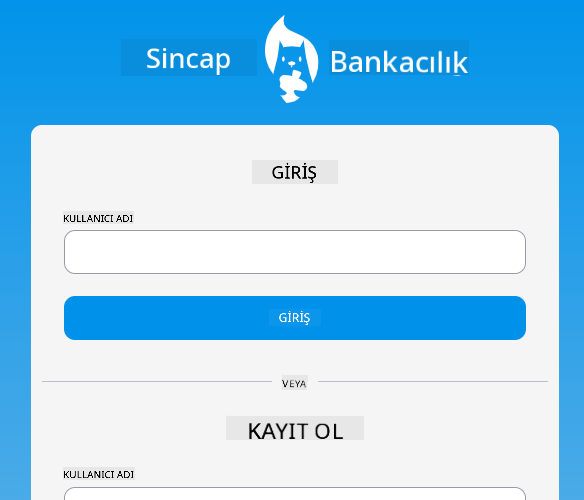
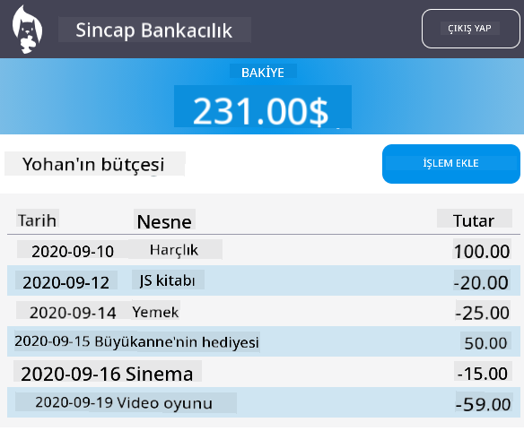

<!--
CO_OP_TRANSLATOR_METADATA:
{
  "original_hash": "830359535306594b448db6575ce5cdee",
  "translation_date": "2025-08-26T00:03:46+00:00",
  "source_file": "7-bank-project/README.md",
  "language_code": "tr"
}
-->
# :dollar: Bir Banka Kur

Bu projede, hayali bir banka nasıl kurulur öğreneceksiniz. Bu dersler, bir web uygulamasının nasıl tasarlanacağı ve yönlendirmelerin nasıl sağlanacağı, formların nasıl oluşturulacağı, durumun nasıl yönetileceği ve bir API'den banka verilerini nasıl çekeceğiniz gibi konularda talimatlar içerir.

|  |  |
|--------------------------------|--------------------------------|

## Dersler

1. [Bir Web Uygulamasında HTML Şablonları ve Yönlendirmeler](1-template-route/README.md)
2. [Giriş ve Kayıt Formu Oluşturma](2-forms/README.md)
3. [Veri Çekme ve Kullanma Yöntemleri](3-data/README.md)
4. [Durum Yönetimi Kavramları](4-state-management/README.md)

### Katkıda Bulunanlar

Bu dersler, [Yohan Lasorsa](https://twitter.com/sinedied) tarafından :hearts: ile yazılmıştır.

Bu derslerde kullanılan [sunucu API'sini](/7-bank-project/api/README.md) nasıl oluşturacağınızı öğrenmekle ilgileniyorsanız, [bu video serisini](https://aka.ms/NodeBeginner) (özellikle 17'den 21'e kadar olan videoları) takip edebilirsiniz.

Ayrıca [bu interaktif Learn eğitimine](https://aka.ms/learn/express-api) göz atabilirsiniz.

**Feragatname**:  
Bu belge, AI çeviri hizmeti [Co-op Translator](https://github.com/Azure/co-op-translator) kullanılarak çevrilmiştir. Doğruluk için çaba göstersek de, otomatik çevirilerin hata veya yanlışlık içerebileceğini lütfen unutmayın. Belgenin orijinal dili, yetkili kaynak olarak kabul edilmelidir. Kritik bilgiler için profesyonel insan çevirisi önerilir. Bu çevirinin kullanımından kaynaklanan yanlış anlamalar veya yanlış yorumlamalar için sorumluluk kabul etmiyoruz.