<!--
CO_OP_TRANSLATOR_METADATA:
{
  "original_hash": "a9a3bcc037a447e2d8994d99e871cd9f",
  "translation_date": "2025-11-04T00:44:00+00:00",
  "source_file": "8-code-editor/1-using-a-code-editor/README.md",
  "language_code": "tr"
}
-->
# Bir Kod Editörü Kullanmak: VSCode.dev'i Ustalaşmak

*Matrix* filminde Neo'nun dijital dünyaya erişmek için devasa bir bilgisayar terminaline bağlanması gerektiğini hatırlıyor musunuz? Günümüzün web geliştirme araçları tam tersi bir hikaye sunuyor – her yerden erişilebilen inanılmaz güçlü yetenekler. VSCode.dev, internet bağlantısı olan herhangi bir cihazda profesyonel geliştirme araçlarını sunan tarayıcı tabanlı bir kod editörüdür.

Tıpkı matbaanın kitapları sadece manastırlardaki yazıcılara değil, herkese erişilebilir hale getirmesi gibi, VSCode.dev de kod yazmayı demokratikleştiriyor. Bir kütüphane bilgisayarında, bir okul laboratuvarında veya tarayıcı erişiminizin olduğu herhangi bir yerde projeler üzerinde çalışabilirsiniz. Kurulum yok, "Kendi özel ayarlarıma ihtiyacım var" sınırlamaları yok.

Bu dersin sonunda, VSCode.dev'de nasıl gezineceğinizi, GitHub depolarını doğrudan tarayıcınızda nasıl açacağınızı ve sürüm kontrolü için Git'i nasıl kullanacağınızı anlayacaksınız – profesyonel geliştiricilerin günlük olarak güvendiği tüm beceriler.

## ⚡ Sonraki 5 Dakikada Yapabilecekleriniz

**Yoğun Geliştiriciler İçin Hızlı Başlangıç Yolu**


- **1. Dakika**: [vscode.dev](https://vscode.dev) adresine gidin - kurulum gerekmez
- **2. Dakika**: Depolarınızı bağlamak için GitHub ile oturum açın
- **3. Dakika**: URL hilesini deneyin: herhangi bir depo URL'sinde `github.com`'u `vscode.dev/github` ile değiştirin
- **4. Dakika**: Yeni bir dosya oluşturun ve sözdizimi vurgulamasının otomatik olarak çalışmasını izleyin
- **5. Dakika**: Bir değişiklik yapın ve Kaynak Kontrol paneli aracılığıyla kaydedin

**Hızlı Test URL'si**:
```
# Transform this:
github.com/microsoft/Web-Dev-For-Beginners

# Into this:
vscode.dev/github/microsoft/Web-Dev-For-Beginners
```

**Neden Önemli**: 5 dakika içinde, profesyonel araçlarla her yerde kod yazmanın özgürlüğünü deneyimleyeceksiniz. Bu, gelişimin geleceğini temsil ediyor - erişilebilir, güçlü ve anında.

## 🗺️ Bulut Tabanlı Geliştirme Yolculuğunuz

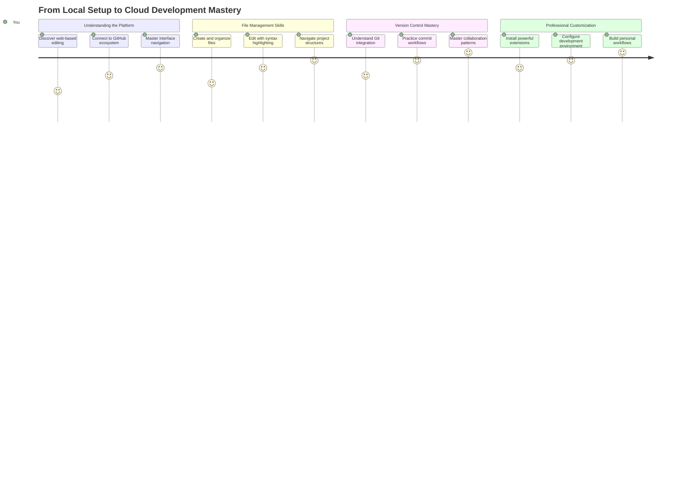

**Yolculuğunuzun Hedefi**: Bu dersin sonunda, büyük teknoloji şirketlerindeki geliştiriciler tarafından kullanılan aynı araçlarla herhangi bir cihazdan çalışmanıza olanak tanıyan profesyonel bir bulut geliştirme ortamında ustalaşmış olacaksınız.

## Öğrenecekleriniz

Bu dersi birlikte tamamladıktan sonra şunları yapabileceksiniz:

- VSCode.dev'de kaybolmadan ihtiyacınız olan her şeyi bulabileceğiniz bir şekilde gezinmek
- Herhangi bir GitHub deposunu tarayıcınızda açmak ve hemen düzenlemeye başlamak (bu gerçekten büyüleyici!)
- Git'i kullanarak değişikliklerinizi takip etmek ve ilerlemenizi bir profesyonel gibi kaydetmek
- Kod yazmayı daha hızlı ve eğlenceli hale getiren uzantılarla editörünüzü güçlendirmek
- Proje dosyalarını güvenle oluşturmak ve düzenlemek

## İhtiyacınız Olanlar

Gereksinimler oldukça basit:

- Ücretsiz bir [GitHub hesabı](https://github.com) (gerekirse oluşturmanız için size rehberlik edeceğiz)
- Web tarayıcıları hakkında temel bilgi
- GitHub Temelleri dersi faydalı bir arka plan sağlar, ancak zorunlu değildir

> 💡 **GitHub'da yeni misiniz?** Bir hesap oluşturmak ücretsizdir ve sadece birkaç dakikanızı alır. Tıpkı bir kütüphane kartının dünya çapında kitaplara erişim sağlaması gibi, bir GitHub hesabı da internet üzerindeki kod depolarına kapı açar.

## 🧠 Bulut Geliştirme Ekosistemi Genel Bakış

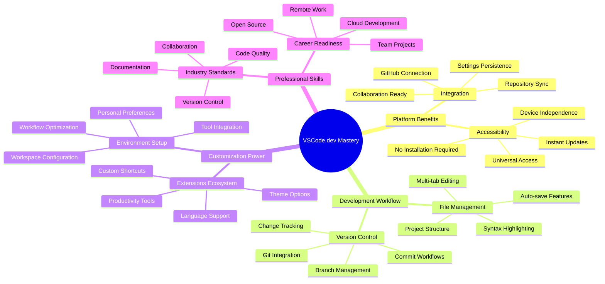

**Temel İlke**: Bulut tabanlı geliştirme ortamları, profesyonel düzeyde araçlar sağlayarak kodlamanın geleceğini temsil eder – erişilebilir, iş birliğine açık ve platformdan bağımsız.

## Web Tabanlı Kod Editörleri Neden Önemlidir?

İnternet öncesinde, farklı üniversitelerdeki bilim insanları araştırmalarını kolayca paylaşamazlardı. Sonra 1960'larda ARPANET geldi ve bilgisayarları mesafeler boyunca birbirine bağladı. Web tabanlı kod editörleri de aynı prensibi takip eder – güçlü araçları fiziksel konumunuzdan veya cihazınızdan bağımsız olarak erişilebilir hale getirir.

Bir kod editörü, kod dosyalarını yazdığınız, düzenlediğiniz ve organize ettiğiniz geliştirme çalışma alanınızdır. Basit metin editörlerinden farklı olarak, profesyonel kod editörleri sözdizimi vurgulama, hata tespiti ve proje yönetimi özellikleri sunar.

VSCode.dev bu özellikleri tarayıcınıza getiriyor:

**Web tabanlı düzenlemenin avantajları:**

| Özellik | Açıklama | Pratik Faydası |
|---------|-------------|----------|
| **Platform Bağımsızlığı** | Tarayıcıya sahip herhangi bir cihazda çalışır | Farklı bilgisayarlarda sorunsuz çalışın |
| **Kurulum Gerekmez** | Bir web URL'si üzerinden erişim | Yazılım kurulum kısıtlamalarını aşın |
| **Otomatik Güncellemeler** | Her zaman en son sürümde çalışır | Manuel güncelleme olmadan yeni özelliklere erişim |
| **Depo Entegrasyonu** | GitHub'a doğrudan bağlantı | Yerel dosya yönetimi olmadan kod düzenleyin |

**Pratik sonuçlar:**
- Farklı ortamlarda çalışma sürekliliği
- İşletim sisteminden bağımsız tutarlı arayüz
- Anında iş birliği yetenekleri
- Azaltılmış yerel depolama gereksinimleri

## VSCode.dev'i Keşfetmek

Tıpkı Marie Curie'nin laboratuvarının nispeten basit bir alanda sofistike ekipmanlar içermesi gibi, VSCode.dev profesyonel geliştirme araçlarını bir tarayıcı arayüzüne sığdırır. Bu web uygulaması, masaüstü kod editörleriyle aynı temel işlevselliği sağlar.

Tarayıcınızda [vscode.dev](https://vscode.dev) adresine giderek başlayın. Arayüz, indirme veya sistem kurulumu olmadan yüklenir – bulut bilişim ilkelerinin doğrudan bir uygulaması.

### GitHub Hesabınızı Bağlama

Alexander Graham Bell'in telefonu uzak yerleri nasıl birbirine bağladıysa, GitHub hesabınızı bağlamak da VSCode.dev ile kod depolarınız arasında bir köprü kurar. GitHub ile oturum açmanız istendiğinde, bu bağlantıyı kabul etmeniz önerilir.

**GitHub entegrasyonu şunları sağlar:**
- Editör içinde depolarınıza doğrudan erişim
- Cihazlar arasında senkronize ayarlar ve uzantılar
- GitHub'a kaydetme iş akışının kolaylaştırılması
- Kişiselleştirilmiş geliştirme ortamı

### Yeni Çalışma Alanınızı Tanımak

Her şey yüklendikten sonra, odaklanmanızı sağlayacak şekilde tasarlanmış, güzel ve temiz bir çalışma alanı göreceksiniz – kodunuza!


**İşte mahallenizin turu:**
- **Etkinlik Çubuğu** (soldaki şerit): Gezgini 📁, Aramayı 🔍, Kaynak Kontrolünü 🌿, Uzantıları 🧩 ve Ayarları ⚙️ içeren ana gezinme alanınız
- **Kenar Çubuğu** (yanındaki panel): Seçtiğiniz şeye bağlı olarak ilgili bilgileri gösterir
- **Editör Alanı** (ortadaki büyük alan): İşte sihrin gerçekleştiği yer – ana kodlama alanınız

**Biraz keşif yapın:**
- Bu Etkinlik Çubuğu simgelerine tıklayın ve her birinin ne yaptığını görün
- Kenar çubuğunun farklı bilgileri göstermek için nasıl güncellendiğine dikkat edin – oldukça havalı, değil mi?
- Gezgini görüntüleme (📁) muhtemelen en çok zaman geçireceğiniz yerdir, bu yüzden onunla rahat olun

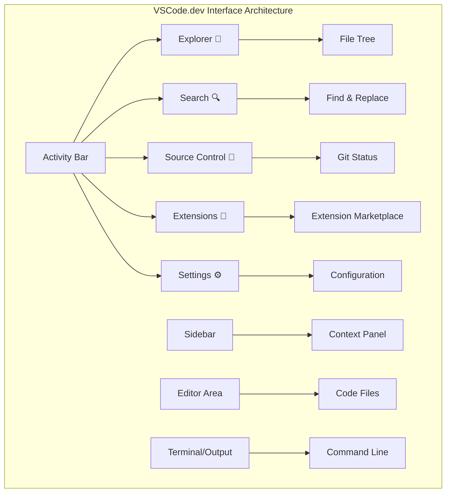

## GitHub Depolarını Açmak

İnternet öncesinde, araştırmacılar belgeleri incelemek için fiziksel olarak kütüphanelere gitmek zorundaydı. GitHub depoları benzer şekilde çalışır – uzaktan depolanan kod koleksiyonlarıdır. VSCode.dev, depoları yerel makinenize indirme adımını ortadan kaldırarak doğrudan düzenleme imkanı sunar.

Bu özellik, herhangi bir genel depoya anında erişim sağlar; görüntüleme, düzenleme veya katkıda bulunma için. İşte depoları açmanın iki yöntemi:

### Yöntem 1: Tıklama Yöntemi

Bu yöntem, VSCode.dev'de yeni başlıyorsanız ve belirli bir depoyu açmak istiyorsanız idealdir. Basit ve başlangıç dostudur:

**Nasıl yapılır:**

1. [vscode.dev](https://vscode.dev) adresine gidin (henüz orada değilseniz)
2. Karşılama ekranında "Open Remote Repository" (Uzak Depo Aç) düğmesini arayın ve tıklayın

   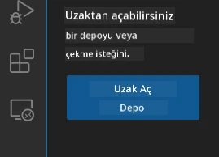

3. Herhangi bir GitHub depo URL'sini yapıştırın (bunu deneyin: `https://github.com/microsoft/Web-Dev-For-Beginners`)
4. Enter tuşuna basın ve sihri izleyin!

**Profesyonel ipucu - Komut Paleti kısayolu:**

Kendinizi bir kodlama sihirbazı gibi hissetmek ister misiniz? Şu klavye kısayolunu deneyin: Ctrl+Shift+P (veya Mac'te Cmd+Shift+P) ile Komut Paletini açın:

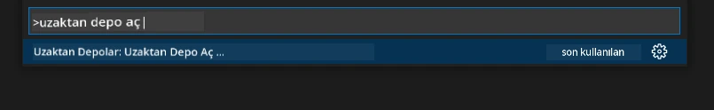

**Komut Paleti, yapabileceğiniz her şey için bir arama motoru gibidir:**
- "open remote" yazın ve sizin için depo açıcıyı bulacaktır
- Daha önce açtığınız depoları hatırlar (çok kullanışlı!)
- Alıştıktan sonra, kendinizi ışık hızında kod yazıyormuş gibi hissedeceksiniz
- Bu, VSCode.dev'in "Hey Siri"si ama kodlama için

### Yöntem 2: URL Değiştirme Tekniği

HTTP ve HTTPS'in aynı alan yapısını korurken farklı protokoller kullanması gibi, VSCode.dev de GitHub'ın adresleme sistemini yansıtan bir URL deseni kullanır. Herhangi bir GitHub depo URL'si, doğrudan VSCode.dev'de açılacak şekilde değiştirilebilir.

**URL dönüştürme deseni:**

| Depo Türü | GitHub URL'si | VSCode.dev URL'si |
|----------------|---------------------|----------------|
| **Genel Depo** | `github.com/microsoft/Web-Dev-For-Beginners` | `vscode.dev/github/microsoft/Web-Dev-For-Beginners` |
| **Kişisel Proje** | `github.com/your-username/my-project` | `vscode.dev/github/your-username/my-project` |
| **Herhangi Bir Erişilebilir Depo** | `github.com/their-username/awesome-repo` | `vscode.dev/github/their-username/awesome-repo` |

**Uygulama:**
- `github.com`'u `vscode.dev/github` ile değiştirin
- Diğer tüm URL bileşenlerini değiştirmeden koruyun
- Herhangi bir genel erişilebilir depo ile çalışır
- Anında düzenleme erişimi sağlar

> 💡 **Hayat değiştiren ipucu**: Favori depolarınızın VSCode.dev sürümlerini yer imlerine ekleyin. "Portföyümü Düzenle" ve "Belgeleri Düzelt" gibi doğrudan düzenleme moduna götüren yer imlerim var!

**Hangi yöntemi kullanmalısınız?**
- **Arayüz yöntemi**: Keşif yaparken veya tam depo adlarını hatırlayamadığınızda harika
- **URL hilesi**: Nereye gideceğinizi tam olarak bildiğinizde ışık hızında erişim için mükemmel

### 🎯 Pedagojik Kontrol: Bulut Geliştirme Erişimi

**Duraklayın ve Düşünün**: Kod depolarına bir web tarayıcısı aracılığıyla erişmenin iki yöntemini öğrendiniz. Bu, geliştirme şeklinin temel bir değişimini temsil eder.

**Hızlı Öz Değerlendirme**:
- Web tabanlı düzenlemenin geleneksel "geliştirme ortamı kurulumunu" neden ortadan kaldırdığını açıklayabilir misiniz?
- URL değiştirme tekniğinin yerel git klonlamasına göre sağladığı avantajlar nelerdir?
- Bu yaklaşım, açık kaynak projelerine katkıda bulunma şeklinizi nasıl değiştirebilir?

**Gerçek Dünya Bağlantısı**: GitHub, GitLab ve Replit gibi büyük şirketler, geliştirme platformlarını bu bulut öncelikli ilkeler etrafında inşa etmiştir. Dünya çapındaki profesyonel geliştirme ekipleri tarafından kullanılan aynı iş akışlarını öğreniyorsunuz.

**Zorluk Sorusu**: Bulut tabanlı geliştirme, kodlamanın okullarda öğretilme şeklini nasıl değiştirebilir? Cihaz gereksinimlerini, yazılım yönetimini ve iş birliği olanaklarını düşünün.

## Dosyalar ve Projelerle Çalışmak

Artık bir depo açtığınıza göre, hadi bir şeyler oluşturmaya başlayalım! VSCode.dev, kod dosyalarınızı oluşturmak, düzenlemek ve organize etmek için ihtiyacınız olan her şeyi size sunar. Bunu dijital atölyeniz olarak düşünün – her araç tam da ihtiyacınız olan yerde.

Günlük kodlama iş akışınızın çoğunu oluşturacak temel görevleri inceleyelim.

### Yeni Dosyalar Oluşturmak

Bir mimarın ofisinde planları düzenlemesi gibi, VSCode.dev'de dosya oluşturma da yapılandırılmış bir yaklaşımı takip eder. Sistem, tüm standart web geliştirme dosya türlerini destekler.

**Dosya oluşturma süreci:**

1. Gezgindeki hedef klasöre gidin
2. Klasör adının üzerine gelerek "Yeni Dosya" simgesini (📄+) açın
3. Uygun uzantıyı içeren dosya adını girin (`style.css`, `script.js`, `index.html`)
4. Dosyayı oluşturmak için Enter tuşuna basın

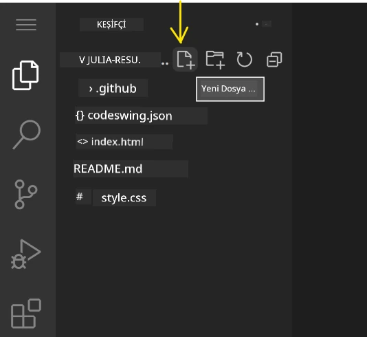

**Adlandırma kuralları:**
- Dosyanın amacını belirten açıklayıcı adlar kullanın
- Doğru sözdizimi vurgulaması için dosya uzantılarını ekleyin
- Projeler boyunca tutarlı adlandırma desenleri izleyin
- Boşluk yerine küçük harfler ve tireler kullanın

### Dosyaları Düzenlemek ve Kaydetmek

Asıl eğlence burada başlıyor! VSCode.dev'in editörü, kod yazmayı pürüzsüz ve sezgisel hale getiren birçok kullanışlı özellikle doludur. Bu, kod için gerçekten akıllı bir yazma asistanına sahip olmak gibidir.

**Düzenleme iş akışınız:**

1. Gezginde herhangi bir dosyaya tıklayarak ana alanda açın
2. Yazmaya başlayın ve VSCode.dev'in renkler, öneriler ve hata tespiti ile size nasıl yardımcı olduğunu izleyin
3. Çalışmanızı Ctrl+S (Windows/Linux) veya Cmd+S (Mac) ile kaydedin – ancak otomatik kaydetme de mevcut!


**Kod yazarken olan harika şeyler:**
- Kodunuz güzelce renklendirilir, böylece okunması kolaylaşır
- VSCode.dev yazarken size önerilerde bulunur (otomatik düzeltme gibi, ama çok daha akıllı)
- Hataları ve yazım yanlışlarını kaydetmeden önce yakalar
- Bir tarayıcıdaki sekmeler gibi birden fazla dosyayı açık tutabilirsiniz
- Her şey arka planda otomatik olarak kaydedilir

> ⚠️ **Hızlı ipucu**: Otomatik kaydetme işinizi garanti altına alsa da, Ctrl+S veya Cmd+S tuşlarına basmak hala iyi bir alışkanlıktır. Bu, her şeyi hemen kaydeder ve hata kontrolü gibi ekstra yardımcı özellikleri tetikler.

### Git ile Sürüm Kontrolü

Arkeologların kazı katmanlarının ayrıntılı kayıtlarını oluşturması gibi, Git de kodunuzdaki değişiklikleri zamanla takip eder. Bu sistem, proje geçmişini korur ve gerektiğinde önceki sürümlere dönmenizi sağlar. VSCode.dev, entegre Git işlevselliği içerir.

**Kaynak Kontrolü arayüzü:**

1. Etkinlik Çubuğundaki 🌿 simgesi aracılığıyla Kaynak Kontrolü paneline erişin
2. Değiştirilen dosyalar "Değişiklikler" bölümünde görünür
3. Renk kodlaması değişiklik türlerini belirtir: eklemeler için yeşil, silmeler için kırmızı

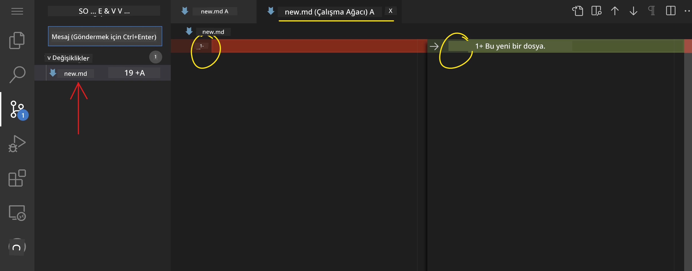

**Çalışmanızı kaydetme (commit iş akışı):**

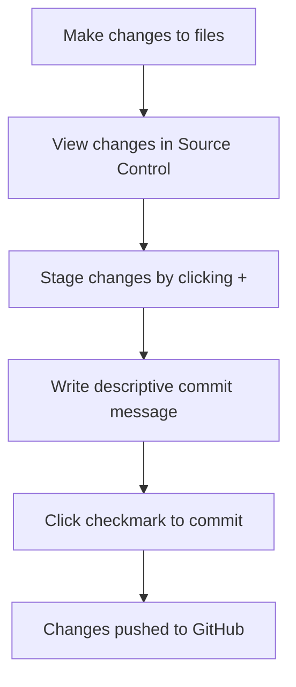

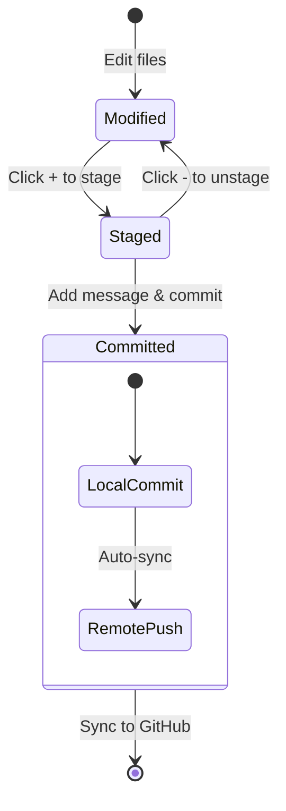


- Tüm aşamalı değişikliklerinizden memnun olduğunuzdan emin olun  
- Ne yaptığınızı açıklayan kısa bir not yazın (bu sizin "commit mesajınız" olacak)  
- Her şeyi GitHub'a kaydetmek için onay işareti düğmesine tıklayın  
- Bir şeyden vazgeçerseniz, geri al simgesiyle değişiklikleri iptal edebilirsiniz  

**İyi commit mesajları yazmak (düşündüğünüzden daha kolay!):**  
- Sadece ne yaptığınızı açıklayın, örneğin "İletişim formu ekle" veya "Bozuk navigasyonu düzelt"  
- Kısa ve öz tutun – tweet uzunluğunda düşünün, makale değil  
- "Ekle", "Düzelt", "Güncelle" veya "Kaldır" gibi eylem kelimeleriyle başlayın  
- **İyi örnekler**: "Duyarlı navigasyon menüsü ekle", "Mobil düzen sorunlarını düzelt", "Daha iyi erişilebilirlik için renkleri güncelle"  

> 💡 **Hızlı gezinme ipucu**: GitHub deposuna geri dönmek ve çevrimiçi olarak commit edilmiş değişikliklerinizi görmek için sol üstteki hamburger menüsünü (☰) kullanın. Bu, düzenleme ortamınız ile GitHub'daki projenizin ana sayfası arasında bir portal gibidir!

## Uzantılarla İşlevselliği Geliştirme  

Bir zanaatkarın atölyesinde farklı görevler için özel araçlar bulunduğu gibi, VSCode.dev de belirli yetenekler ekleyen uzantılarla özelleştirilebilir. Bu topluluk tarafından geliştirilen eklentiler, kod biçimlendirme, canlı önizleme ve gelişmiş Git entegrasyonu gibi yaygın geliştirme ihtiyaçlarını karşılar.  

Uzantı pazarı, dünya çapındaki geliştiriciler tarafından oluşturulan binlerce ücretsiz araca ev sahipliği yapar. Her uzantı belirli iş akışı zorluklarını çözer ve size özel ihtiyaçlarınıza ve tercihlerine uygun kişiselleştirilmiş bir geliştirme ortamı oluşturma imkanı sunar.  

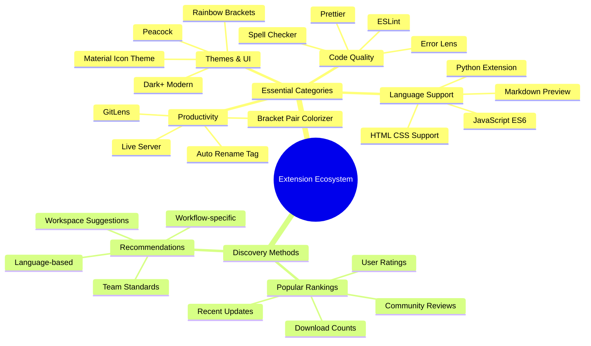
  
### Mükemmel Uzantılarınızı Bulma  

Uzantı pazarı gerçekten iyi organize edilmiştir, bu yüzden ihtiyacınız olanı bulmaya çalışırken kaybolmazsınız. Hem belirli araçları hem de varlığından haberdar olmadığınız harika şeyleri keşfetmenize yardımcı olacak şekilde tasarlanmıştır!  

**Pazara ulaşmak için:**  

1. Etkinlik Çubuğundaki Uzantılar simgesine (🧩) tıklayın  
2. Etrafı dolaşın veya belirli bir şey arayın  
3. İlginç görünen bir şeye tıklayın ve daha fazla bilgi edinin  

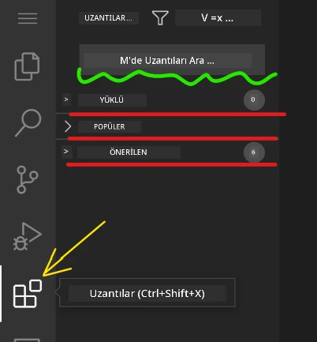  

**Orada görecekleriniz:**  

| Bölüm | İçindekiler | Neden Faydalı? |  
|----------|---------|----------|  
| **Yüklü** | Zaten eklediğiniz uzantılar | Kişisel kodlama araç setiniz |  
| **Popüler** | En çok tercih edilenler | Çoğu geliştiricinin önerdiği şeyler |  
| **Önerilen** | Projeniz için akıllı öneriler | VSCode.dev'in faydalı önerileri |  

**Gezinmeyi kolaylaştıran şeyler:**  
- Her uzantı, derecelendirmeler, indirme sayıları ve gerçek kullanıcı yorumlarını gösterir  
- Her birinin ne yaptığına dair ekran görüntüleri ve net açıklamalar alırsınız  
- Her şey uyumluluk bilgileriyle açıkça işaretlenmiştir  
- Benzer uzantılar önerilir, böylece seçenekleri karşılaştırabilirsiniz  

### Uzantıları Yüklemek (Çok Kolay!)  

Editörünüze yeni özellikler eklemek bir düğmeye tıklamak kadar basittir. Uzantılar saniyeler içinde yüklenir ve hemen çalışmaya başlar – yeniden başlatma yok, bekleme yok.  

**Yapmanız gerekenler:**  

1. İstediğiniz şeyi arayın (örneğin "live server" veya "prettier" aramayı deneyin)  
2. İyi görünen birine tıklayın ve daha fazla ayrıntı görün  
3. Ne yaptığını okuyun ve derecelendirmelere göz atın  
4. O mavi "Yükle" düğmesine tıklayın ve işte bu kadar!  

  

**Arka planda neler oluyor:**  
- Uzantı indirilir ve otomatik olarak kurulur  
- Yeni özellikler hemen arayüzünüzde görünür  
- Her şey anında çalışmaya başlar (cidden, bu kadar hızlı!)  
- Giriş yaptıysanız, uzantı tüm cihazlarınıza senkronize edilir  

**Başlangıç için önerdiğim bazı uzantılar:**  
- **Live Server**: Kod yazarken web sitenizin gerçek zamanlı olarak güncellenmesini izleyin (bu gerçekten büyüleyici!)  
- **Prettier**: Kodunuzu otomatik olarak temiz ve profesyonel gösterir  
- **Auto Rename Tag**: Bir HTML etiketini değiştirin, eşleşen etiketi de otomatik olarak günceller  
- **Bracket Pair Colorizer**: Parantezlerinizi renk kodlarıyla işaretler, böylece kaybolmazsınız  
- **GitLens**: Git özelliklerinizi tonlarca faydalı bilgiyle güçlendirir  

### Uzantılarınızı Özelleştirme  

Çoğu uzantı, tam olarak istediğiniz gibi çalışmasını sağlamak için ayarlayabileceğiniz seçeneklerle birlikte gelir. Bunu, bir arabada koltuğu ve aynaları ayarlamak gibi düşünün – herkesin kendi tercihleri vardır!  

**Uzantı ayarlarını düzenleme:**  

1. Uzantılar panelinde yüklü uzantınızı bulun  
2. Adının yanındaki küçük dişli simgesine (⚙️) tıklayın  
3. Açılır menüden "Uzantı Ayarları"nı seçin  
4. İş akışınıza tam uyacak şekilde ayarları düzenleyin  

  

**Düzenlemek isteyebileceğiniz yaygın şeyler:**  
- Kodunuzun nasıl biçimlendirileceği (sekme mi boşluk mu, satır uzunluğu vb.)  
- Farklı eylemleri tetikleyen klavye kısayolları  
- Uzantının hangi dosya türleriyle çalışması gerektiği  
- Her şeyi düzenli tutmak için belirli özellikleri açma veya kapatma  

### Uzantılarınızı Düzenli Tutma  

Daha fazla harika uzantı keşfettikçe, koleksiyonunuzu düzenli ve sorunsuz bir şekilde çalışır durumda tutmak isteyeceksiniz. VSCode.dev bunu yönetmeyi gerçekten kolaylaştırır.  

**Uzantı yönetim seçenekleriniz:**  

| Yapabileceğiniz Şey | Ne Zaman Faydalı? | İpucu |  
|--------|---------|----------|  
| **Devre Dışı Bırak** | Bir uzantının sorunlara neden olup olmadığını test etmek için | Geri almak isteyebileceğiniz bir şey için kaldırmaktan daha iyidir |  
| **Kaldır** | İhtiyacınız olmayan uzantıları tamamen kaldırmak için | Ortamınızı temiz ve hızlı tutar |  
| **Güncelle** | En son özellikleri ve hata düzeltmelerini almak için | Genellikle otomatik olarak yapılır, ancak kontrol etmeye değer |  

**Uzantıları yönetme şeklim:**  
- Her birkaç ayda bir, yüklediğim şeyleri gözden geçirir ve kullanmadıklarımı kaldırırım  
- Uzantıları güncel tutarım, böylece en son iyileştirmeleri ve güvenlik düzeltmelerini alırım  
- Bir şey yavaş görünüyorsa, hangisinin suçlu olduğunu görmek için geçici olarak uzantıları devre dışı bırakırım  
- Uzantılar büyük güncellemeler aldığında güncelleme notlarını okurum – bazen harika yeni özellikler olur!  

> ⚠️ **Performans ipucu**: Uzantılar harikadır, ancak çok fazla olması işleri yavaşlatabilir. Gerçekten hayatınızı kolaylaştıranlara odaklanın ve hiç kullanmadıklarınızı kaldırmaktan çekinmeyin.  

### 🎯 Pedagojik Kontrol: Geliştirme Ortamı Özelleştirme  

**Mimari Anlayış**: Topluluk tarafından oluşturulan uzantıları kullanarak profesyonel bir geliştirme ortamını nasıl özelleştireceğinizi öğrendiniz. Bu, kurumsal geliştirme ekiplerinin standart araç zincirleri oluşturma yöntemlerini yansıtır.  

**Kavranan Temel Kavramlar**:  
- **Uzantı Keşfi**: Belirli geliştirme zorluklarını çözen araçları bulma  
- **Ortam Yapılandırması**: Araçları kişisel veya ekip tercihlerine göre özelleştirme  
- **Performans Optimizasyonu**: İşlevsellik ile sistem performansı arasında denge kurma  
- **Topluluk İşbirliği**: Küresel geliştirici topluluğu tarafından oluşturulan araçlardan yararlanma  

**Sektör Bağlantısı**: Uzantı ekosistemleri, VS Code, Chrome DevTools ve modern IDE'ler gibi büyük geliştirme platformlarını destekler. Uzantıları değerlendirme, yükleme ve yapılandırma becerisi, profesyonel geliştirme iş akışları için gereklidir.  

**Düşünme Sorusu**: 10 kişilik bir ekip için standart bir geliştirme ortamı kurmaya nasıl yaklaşırdınız? Tutarlılık, performans ve bireysel tercihler açısından düşünün.  

## 📈 Bulut Tabanlı Geliştirme Ustalık Zaman Çizelgeniz  

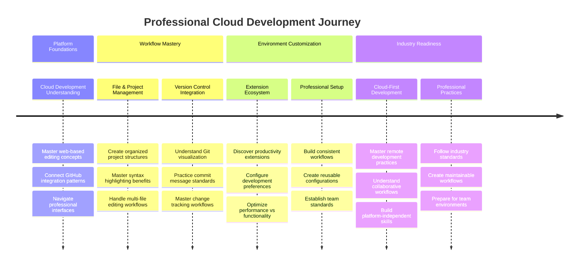
  
**🎓 Mezuniyet Dönüm Noktası**: Büyük teknoloji şirketlerindeki profesyonel geliştiriciler tarafından kullanılan aynı araçlar ve iş akışlarıyla bulut tabanlı geliştirmeyi başarıyla öğrendiniz. Bu beceriler, yazılım geliştirme geleceğini temsil eder.  

**🔄 Bir Sonraki Seviye Yetenekler**:  
- Gelişmiş bulut geliştirme platformlarını (Codespaces, GitPod) keşfetmeye hazır  
- Dağıtılmış geliştirme ekiplerinde çalışmaya hazırlıklı  
- Küresel açık kaynak projelerine katkıda bulunmaya hazır  
- Modern DevOps ve sürekli entegrasyon uygulamaları için temel oluşturuldu  

## GitHub Copilot Agent Challenge 🚀  

NASA'nın uzay görevleri için kullandığı yapılandırılmış yaklaşım gibi, bu meydan okuma, VSCode.dev becerilerinin eksiksiz bir iş akışı senaryosunda sistematik olarak uygulanmasını içerir.  

**Amaç:** VSCode.dev'de kapsamlı bir web geliştirme iş akışı oluşturarak yetkinliğinizi kanıtlayın.  

**Proje gereksinimleri:** Agent modunu kullanarak şu görevleri tamamlayın:  
1. Mevcut bir depoyu fork edin veya yeni bir tane oluşturun  
2. HTML, CSS ve JavaScript dosyalarıyla işlevsel bir proje yapısı oluşturun  
3. Geliştirmeyi kolaylaştıran üç uzantı yükleyin ve yapılandırın  
4. Açıklayıcı commit mesajlarıyla sürüm kontrolü uygulayın  
5. Özellik dalı oluşturma ve değiştirme işlemlerini deneyin  
6. Süreci ve öğrendiklerinizi bir README.md dosyasında belgeleyin  

Bu alıştırma, tüm VSCode.dev kavramlarını gelecekteki geliştirme projelerine uygulanabilecek pratik bir iş akışında birleştirir.  

[Agent mode](https://code.visualstudio.com/blogs/2025/02/24/introducing-copilot-agent-mode) hakkında daha fazla bilgi edinin.  

## Ödev  

Bu becerileri gerçek bir test sürüşüne çıkarmanın zamanı geldi! İşte şimdiye kadar öğrendiklerinizi uygulamanıza olanak tanıyacak bir uygulamalı proje: [VSCode.dev kullanarak bir özgeçmiş web sitesi oluşturun](./assignment.md)  

Bu ödev, tamamen tarayıcınızda profesyonel bir özgeçmiş web sitesi oluşturma sürecinde size rehberlik eder. Keşfettiğimiz tüm VSCode.dev özelliklerini kullanacaksınız ve sonunda hem harika bir görünüme sahip bir web sitesi hem de yeni iş akışınıza olan güveniniz olacak.  

## Keşfetmeye ve Becerilerinizi Geliştirmeye Devam Edin  

Artık sağlam bir temele sahipsiniz, ancak keşfedilecek daha birçok harika şey var! İşte VSCode.dev becerilerinizi bir sonraki seviyeye taşımak için bazı kaynaklar ve fikirler:  

**Yer imlerine eklemeye değer resmi belgeler:**  
- [VSCode Web Documentation](https://code.visualstudio.com/docs/editor/vscode-web?WT.mc_id=academic-0000-alfredodeza) – Tarayıcı tabanlı düzenleme için tam kılavuz  
- [GitHub Codespaces](https://docs.github.com/en/codespaces) – Bulutta daha fazla güç istediğinizde  

**Sonraki denemeler için harika özellikler:**  
- **Klavye Kısayolları**: Sizi bir kodlama ninja'sı gibi hissettirecek tuş kombinasyonlarını öğrenin  
- **Çalışma Alanı Ayarları**: Farklı proje türleri için farklı ortamlar ayarlayın  
- **Çoklu Kök Çalışma Alanları**: Aynı anda birden fazla depo üzerinde çalışın (çok kullanışlı!)  
- **Terminal Entegrasyonu**: Komut satırı araçlarına doğrudan tarayıcınızdan erişin  

**Pratik yapmak için fikirler:**  
- Bazı açık kaynak projelerine dalın ve VSCode.dev kullanarak katkıda bulunun – bu, geri vermenin harika bir yoludur!  
- Mükemmel kurulumunuzu bulmak için farklı uzantıları deneyin  
- En sık oluşturduğunuz site türleri için proje şablonları oluşturun  
- Dallanma ve birleştirme gibi Git iş akışlarını uygulayın – bu beceriler ekip projelerinde altın değerindedir!  

---  

**Tarayıcı tabanlı geliştirmeyi ustalıkla öğrendiniz!** 🎉 Taşınabilir aletlerin icadı, bilim insanlarının uzak yerlerde araştırma yapmasına nasıl olanak sağladıysa, VSCode.dev de herhangi bir internet bağlantılı cihazdan profesyonel kodlama yapmanızı sağlar.  

Bu beceriler, mevcut endüstri uygulamalarını yansıtır – birçok profesyonel geliştirici, esneklik ve erişilebilirlik için bulut tabanlı geliştirme ortamlarını kullanır. Ölçeklenebilir bir iş akışı öğrendiniz; bu, bireysel projelerden büyük ekip işbirliklerine kadar her şeye uyum sağlar.  

Bu teknikleri bir sonraki geliştirme projenizde uygulayın! 🚀  

---

**Feragatname**:  
Bu belge, AI çeviri hizmeti [Co-op Translator](https://github.com/Azure/co-op-translator) kullanılarak çevrilmiştir. Doğruluk için çaba göstersek de, otomatik çevirilerin hata veya yanlışlıklar içerebileceğini lütfen unutmayın. Belgenin orijinal dili, yetkili kaynak olarak kabul edilmelidir. Kritik bilgiler için profesyonel insan çevirisi önerilir. Bu çevirinin kullanımından kaynaklanan yanlış anlamalar veya yanlış yorumlamalar için sorumluluk kabul etmiyoruz.