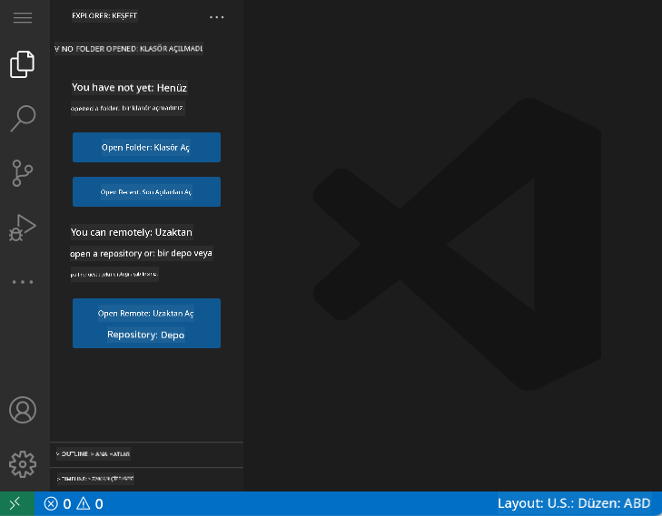
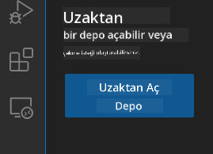
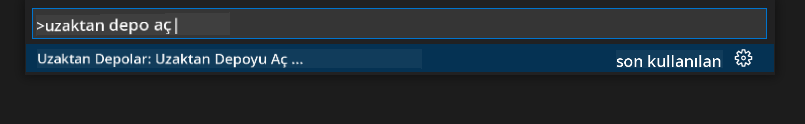
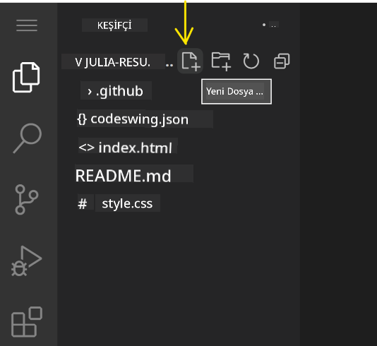
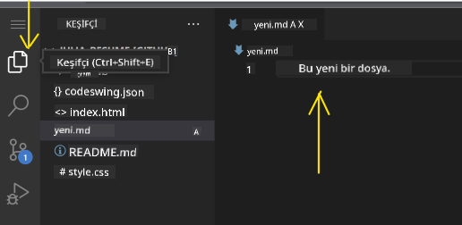
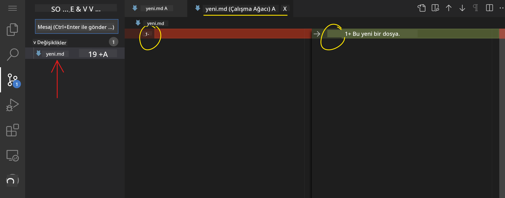
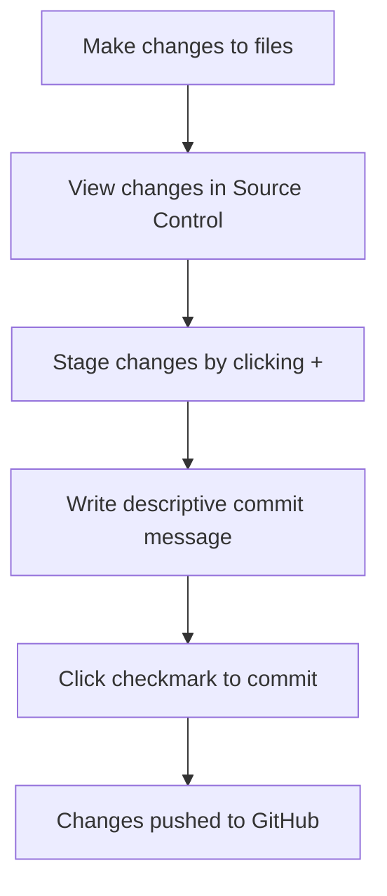

<!--
CO_OP_TRANSLATOR_METADATA:
{
  "original_hash": "cfd4a15974168ca426d50c67682ab9d4",
  "translation_date": "2025-10-22T23:46:29+00:00",
  "source_file": "8-code-editor/1-using-a-code-editor/README.md",
  "language_code": "tr"
}
-->
# Bir Kod Editörü Kullanmak: VSCode.dev'i Ustaca Kullanma

*Matrix* filminde Neo'nun dijital dünyaya erişmek için devasa bir bilgisayar terminaline bağlanması gerektiğini hatırlıyor musunuz? Günümüzün web geliştirme araçları tam tersini anlatıyor – her yerden erişilebilen inanılmaz güçlü yetenekler. VSCode.dev, profesyonel geliştirme araçlarını internet bağlantısı olan herhangi bir cihazda kullanmanıza olanak tanıyan tarayıcı tabanlı bir kod editörüdür.

Tıpkı matbaanın kitapları sadece manastırlardaki yazıcılar için değil, herkes için erişilebilir hale getirmesi gibi, VSCode.dev de kodlamayı demokratikleştiriyor. Kütüphane bilgisayarında, okul laboratuvarında veya tarayıcı erişiminizin olduğu herhangi bir yerde projeler üzerinde çalışabilirsiniz. Kurulum yok, "Kendi özel ayarlarıma ihtiyacım var" sınırlamaları yok.

Bu dersin sonunda, VSCode.dev'i nasıl kullanacağınızı, GitHub depolarını doğrudan tarayıcınızda nasıl açacağınızı ve Git'i sürüm kontrolü için nasıl kullanacağınızı öğreneceksiniz – profesyonel geliştiricilerin günlük olarak güvendiği tüm beceriler.

## Öğrenecekleriniz

Bu konuyu birlikte ele aldıktan sonra şunları yapabileceksiniz:

- VSCode.dev'i ikinci eviniz gibi kullanmak – ihtiyacınız olan her şeyi bulmak ve kaybolmamak
- Herhangi bir GitHub deposunu tarayıcınızda açıp hemen düzenlemeye başlamak (bu gerçekten büyüleyici!)
- Git'i değişikliklerinizi takip etmek ve ilerlemenizi profesyonelce kaydetmek için kullanmak
- Kodlamayı daha hızlı ve eğlenceli hale getiren uzantılarla editörünüzü güçlendirmek
- Proje dosyalarını güvenle oluşturmak ve düzenlemek

## İhtiyacınız Olanlar

Gereksinimler oldukça basit:

- Ücretsiz bir [GitHub hesabı](https://github.com) (gerekirse oluşturma konusunda size rehberlik edeceğiz)
- Web tarayıcıları hakkında temel bilgi
- GitHub Temelleri dersi faydalı bir arka plan sağlar, ancak zorunlu değildir

> 💡 **GitHub'da yeni misiniz?** Hesap oluşturmak ücretsizdir ve sadece birkaç dakika sürer. Tıpkı bir kütüphane kartının dünya çapındaki kitaplara erişim sağlaması gibi, bir GitHub hesabı internet üzerindeki kod depolarına kapılar açar.

## Web Tabanlı Kod Editörlerinin Önemi

İnternet öncesinde, farklı üniversitelerdeki bilim insanları araştırmalarını kolayca paylaşamıyordu. Sonra 1960'larda ARPANET geldi ve bilgisayarları mesafeler arasında bağladı. Web tabanlı kod editörleri aynı prensibi takip ediyor – güçlü araçları fiziksel konumunuz veya cihazınız ne olursa olsun erişilebilir hale getiriyor.

Bir kod editörü, kod dosyalarını yazdığınız, düzenlediğiniz ve organize ettiğiniz geliştirme çalışma alanınız olarak hizmet eder. Basit metin editörlerinden farklı olarak, profesyonel kod editörleri sözdizimi vurgulama, hata tespiti ve proje yönetimi özellikleri sunar.

VSCode.dev bu yetenekleri tarayıcınıza getiriyor:

**Web tabanlı düzenleme avantajları:**

| Özellik | Açıklama | Pratik Faydası |
|---------|-------------|----------|
| **Platform Bağımsızlığı** | Tarayıcıya sahip herhangi bir cihazda çalışır | Farklı bilgisayarlarda sorunsuz çalışın |
| **Kurulum Gerektirmez** | Web URL'si üzerinden erişim | Yazılım kurulum kısıtlamalarını aşın |
| **Otomatik Güncellemeler** | Her zaman en son sürümde çalışır | Manuel güncelleme olmadan yeni özelliklere erişim |
| **Depo Entegrasyonu** | GitHub'a doğrudan bağlantı | Yerel dosya yönetimi olmadan kod düzenleme |

**Pratik sonuçlar:**
- Farklı ortamlarda çalışma sürekliliği
- İşletim sisteminden bağımsız tutarlı arayüz
- Anında iş birliği yapabilme
- Azaltılmış yerel depolama gereksinimleri

## VSCode.dev'i Keşfetmek

Tıpkı Marie Curie'nin laboratuvarının nispeten basit bir alanda sofistike ekipmanlar içermesi gibi, VSCode.dev profesyonel geliştirme araçlarını bir tarayıcı arayüzüne sığdırıyor. Bu web uygulaması, masaüstü kod editörlerinin aynı temel işlevselliğini sunar.

Tarayıcınızda [vscode.dev](https://vscode.dev) adresine giderek başlayın. Arayüz, indirme veya sistem kurulumları olmadan yüklenir – bulut bilişim prensiplerinin doğrudan bir uygulaması.

### GitHub Hesabınızı Bağlama

Alexander Graham Bell'in telefonu uzak konumları birbirine bağladığı gibi, GitHub hesabınızı bağlamak VSCode.dev ile kod depolarınızı birleştirir. GitHub ile oturum açmanız istendiğinde, bu bağlantıyı kabul etmeniz önerilir.

**GitHub entegrasyonu şunları sağlar:**
- Editör içinde depolarınıza doğrudan erişim
- Cihazlar arasında senkronize ayarlar ve uzantılar
- GitHub'a kaydetme iş akışını kolaylaştırma
- Kişiselleştirilmiş geliştirme ortamı

### Yeni Çalışma Alanınızı Tanıma

Her şey yüklendikten sonra, odaklanmanızı sağlayacak şekilde tasarlanmış, güzel ve temiz bir çalışma alanı göreceksiniz – kodunuz!

**İşte çevrenizin turu:**
- **Etkinlik Çubuğu** (sol şerit): Gezgini 📁, Aramayı 🔍, Kaynak Kontrolünü 🌿, Uzantıları 🧩 ve Ayarları ⚙️ içeren ana gezinme alanınız
- **Yan Panel** (yanındaki panel): Seçtiğiniz şeye bağlı olarak ilgili bilgileri gösterir
- **Editör Alanı** (ortadaki büyük alan): İşte sihrin gerçekleştiği yer – ana kodlama alanınız

**Biraz keşfetmek için zaman ayırın:**
- Etkinlik Çubuğu simgelerine tıklayın ve her birinin ne yaptığını görün
- Yan panelin farklı bilgileri nasıl gösterdiğini fark edin – oldukça havalı, değil mi?
- Gezgini (📁) muhtemelen en çok zaman geçireceğiniz yer olacak, bu yüzden onunla rahat olun

## GitHub Depolarını Açma

İnternet öncesinde, araştırmacılar belgeleri erişmek için fiziksel olarak kütüphanelere gitmek zorundaydı. GitHub depoları benzer şekilde çalışır – uzaktan saklanan kod koleksiyonlarıdır. VSCode.dev, depoları yerel makinenize indirme adımını ortadan kaldırarak düzenleme öncesi anında erişim sağlar.

Bu özellik, herhangi bir genel depoya anında erişim sağlayarak görüntüleme, düzenleme veya katkıda bulunma imkanı sunar. Depoları açmanın iki yöntemi vardır:

### Yöntem 1: Tıklama ve Seçme Yöntemi

VSCode.dev'de yeni başlıyorsanız ve belirli bir depoyu açmak istiyorsanız bu yöntem mükemmeldir. Basit ve başlangıç dostudur:

**Nasıl yapılır:**

1. [vscode.dev](https://vscode.dev) adresine gidin (henüz orada değilseniz)
2. Karşılama ekranında "Open Remote Repository" düğmesini bulun ve tıklayın

   

3. Herhangi bir GitHub depo URL'sini yapıştırın (şunu deneyin: `https://github.com/microsoft/Web-Dev-For-Beginners`)
4. Enter tuşuna basın ve sihri izleyin!

**Profesyonel ipucu - Komut Paleti kısayolu:**

Kendinizi bir kodlama sihirbazı gibi hissetmek ister misiniz? Şu klavye kısayolunu deneyin: Ctrl+Shift+P (Mac'te Cmd+Shift+P) ile Komut Paletini açın:

**Komut Paleti, yapabileceğiniz her şey için bir arama motoru gibidir:**
- "open remote" yazın ve depo açıcıyı sizin için bulur
- Daha önce açtığınız depoları hatırlar (çok kullanışlı!)
- Alıştığınızda, ışık hızında kodlama yapıyormuş gibi hissedersiniz
- Temelde VSCode.dev'in "Hey Siri, ama kodlama için" versiyonu

### Yöntem 2: URL Değiştirme Tekniği

HTTP ve HTTPS'in farklı protokoller kullanırken aynı alan yapısını koruduğu gibi, VSCode.dev GitHub'ın adresleme sistemini yansıtan bir URL deseni kullanır. Herhangi bir GitHub depo URL'si, doğrudan VSCode.dev'de açılacak şekilde değiştirilebilir.

**URL dönüşüm deseni:**

| Depo Türü | GitHub URL | VSCode.dev URL |
|----------------|---------------------|----------------|
| **Genel Depo** | `github.com/microsoft/Web-Dev-For-Beginners` | `vscode.dev/github/microsoft/Web-Dev-For-Beginners` |
| **Kişisel Proje** | `github.com/your-username/my-project` | `vscode.dev/github/your-username/my-project` |
| **Erişilebilir Herhangi Bir Depo** | `github.com/their-username/awesome-repo` | `vscode.dev/github/their-username/awesome-repo` |

**Uygulama:**
- `github.com` yerine `vscode.dev/github` yazın
- Diğer tüm URL bileşenlerini değiştirmeden koruyun
- Herhangi bir genel erişilebilir depo ile çalışır
- Anında düzenleme erişimi sağlar

> 💡 **Hayat değiştiren ipucu**: Favori depolarınızın VSCode.dev versiyonlarını yer imlerine ekleyin. "Portföyümü Düzenle" ve "Dokümantasyonu Düzelt" gibi yer imlerim var ve beni doğrudan düzenleme moduna götürüyor!

**Hangi yöntemi kullanmalısınız?**
- **Arayüz yöntemi**: Keşif yaparken veya tam depo adlarını hatırlayamadığınızda harika
- **URL hilesi**: Nereye gideceğinizi tam olarak bildiğinizde ışık hızında erişim için mükemmel

## Dosyalar ve Projelerle Çalışmak

Artık bir depo açtığınıza göre, haydi inşa etmeye başlayalım! VSCode.dev, kod dosyalarınızı oluşturmak, düzenlemek ve organize etmek için ihtiyacınız olan her şeyi size sunar. Bunu dijital atölyeniz olarak düşünün – her araç tam ihtiyacınız olan yerde.

Günlük kodlama iş akışınızı oluşturacak temel görevleri inceleyelim.

### Yeni Dosyalar Oluşturma

Bir mimarın ofisinde planları düzenlemesi gibi, VSCode.dev'de dosya oluşturma da yapılandırılmış bir yaklaşımı takip eder. Sistem, tüm standart web geliştirme dosya türlerini destekler.

**Dosya oluşturma süreci:**

1. Gezgindeki hedef klasöre gidin
2. Klasör adının üzerine gelerek "Yeni Dosya" simgesini (📄+) açın
3. Uygun uzantıyı içeren dosya adını girin (`style.css`, `script.js`, `index.html`)
4. Dosyayı oluşturmak için Enter tuşuna basın

**Adlandırma kuralları:**
- Dosyanın amacını belirten açıklayıcı adlar kullanın
- Doğru sözdizimi vurgulama için dosya uzantılarını ekleyin
- Projeler boyunca tutarlı adlandırma desenleri izleyin
- Boşluk yerine küçük harfler ve tireler kullanın

### Dosyaları Düzenleme ve Kaydetme

İşte gerçek eğlencenin başladığı yer! VSCode.dev'in editörü, kodlamayı pürüzsüz ve sezgisel hissettiren yardımcı özelliklerle doludur. Kod yazmak için gerçekten akıllı bir asistanınız varmış gibi.

**Düzenleme iş akışınız:**

1. Gezgindeki herhangi bir dosyaya tıklayarak ana alanda açın
2. Yazmaya başlayın ve VSCode.dev'in renkler, öneriler ve hata tespiti ile size yardımcı olmasını izleyin
3. Çalışmanızı Ctrl+S (Windows/Linux) veya Cmd+S (Mac) ile kaydedin – ancak otomatik kaydetme de mevcut!

**Kod yazarken olan harika şeyler:**
- Kodunuz güzelce renklendirilir, böylece okunması kolay olur
- VSCode.dev yazarken tamamlamalar önerir (otomatik düzeltme gibi, ama çok daha akıllı)
- Hataları ve yazım yanlışlarını kaydetmeden önce yakalar
- Birden fazla dosyayı sekmelerde açabilirsiniz, tıpkı bir tarayıcıda olduğu gibi
- Her şey arka planda otomatik olarak kaydedilir

> ⚠️ **Hızlı ipucu**: Otomatik kaydetme size destek olsa da, Ctrl+S veya Cmd+S tuşlarına basmak hala iyi bir alışkanlıktır. Her şeyi hemen kaydeder ve hata kontrolü gibi ekstra yardımcı özellikleri tetikler.

### Git ile Sürüm Kontrolü

Arkeologların kazı katmanlarının ayrıntılı kayıtlarını oluşturduğu gibi, Git de zaman içinde kodunuzdaki değişiklikleri takip eder. Bu sistem, proje geçmişini korur ve gerektiğinde önceki sürümlere dönmenizi sağlar. VSCode.dev, entegre Git işlevselliği içerir.

**Kaynak Kontrol arayüzü:**

1. Etkinlik Çubuğundaki 🌿 simgesi aracılığıyla Kaynak Kontrol paneline erişin
2. Değiştirilen dosyalar "Changes" bölümünde görünür
3. Renk kodlaması değişiklik türlerini gösterir: eklemeler için yeşil, silmeler için kırmızı

**Çalışmanızı kaydetme (commit iş akışı):**

**Adım adım süreç:**
- Kaydetmek istediğiniz dosyaların yanındaki "+" simgesine tıklayın (bu, onları "aşamalı" hale getirir)
- Tüm aşamalı değişikliklerden memnun olduğunuzdan emin olun
- Ne yaptığınızı açıklayan kısa bir not yazın (bu sizin "commit mesajınız")
- Her şeyi GitHub'a kaydetmek için onay işaretine tıklayın
- Bir şeyden vazgeçmek isterseniz, geri al simgesi değişiklikleri iptal etmenizi sağlar

**İyi commit mesajları yazmak (düşündüğünüzden daha kolay!):**
- Sadece ne yaptığınızı açıklayın, örneğin "İletişim formu eklendi" veya "Bozuk navigasyon düzeltildi"
- Kısa ve öz tutun – tweet uzunluğu gibi, makale değil
- "Ekle", "Düzelt", "Güncelle" veya "Kaldır" gibi eylem kelimeleriyle başlayın
- **İyi örnekler**: "Duyarlı navigasyon menüsü eklendi", "Mobil düzen sorunları düzeltildi", "Daha iyi erişilebilirlik için renkler güncellendi"

> 💡 **Hızlı gezinme ipucu**: Sol üstteki hamburger menüsünü (☰) kullanarak GitHub deponuza geri dönün ve çevrimiçi olarak kaydedilen değişikliklerinizi görün. Bu, düzenleme ortamınız ile GitHub'daki projenizin ana sayfası arasında bir portal gibidir!

## Uzantılarla İşlevselliği Artırma

Bir zanaatkarın atölyesi, farklı görevler için özel araçlar içerdiği gibi, VSCode.dev de belirli yetenekler ekleyen uzantılarla özelleştirilebilir. Bu topluluk tarafından geliştirilen eklentiler, kod biçimlendirme, canlı önizleme ve gelişmiş Git entegrasyonu gibi yaygın geliştirme ihtiyaçlarını karşılar.

Uzantı pazarı, dünya çapındaki geliştiriciler tarafından oluşturulan binlerce ücretsiz araç sunar. Her bir uzantı, belirli iş akışı zorluklarını çözer ve size özel ihtiyaçlarınıza ve tercihlerine uygun bir geliştirme ortamı oluşturma imkanı tanır.

### Mükemmel Uzantılarınızı Bulma

Uzantı pazarı gerçekten iyi organize edilmiştir, bu yüzden ihtiyacınız olan şeyi bulmaya çalışırken kaybolmazsınız. Hem belirli araçları hem de varlığından haberdar olmadığınız harika şeyleri keşfetmenize yardımcı olacak şekilde tasarlanmıştır!

**Pazara erişim:**

1. Etkinlik Çubuğundaki Uzantılar simgesine (🧩) tıklayın
2. Etrafında gezinin veya belirli bir şey arayın
3. İlginç görünen bir şeye tıklayarak daha fazla bilgi edinin

**Orada görecekleriniz:**

| Bölüm | İçerik | Neden Faydalı? |
|----------|---------|----------|
| **Yüklü** | Zaten eklediğiniz uzantılar | Kişisel kodlama araç setiniz |
| **Popüler** | En çok sevilenler | Çoğu geliştiricinin önerdiği şeyler |
| **Önerilen** | Projeniz için akıllı öneriler | VSCode.dev'in yardımcı önerileri |

**
- Her bir uzantı, derecelendirmeleri, indirme sayılarını ve gerçek kullanıcı yorumlarını gösterir.
- Her birinin ne yaptığını açıklayan ekran görüntüleri ve net açıklamalar alırsınız.
- Her şey uyumluluk bilgileriyle açıkça işaretlenmiştir.
- Benzer uzantılar önerilir, böylece seçenekleri karşılaştırabilirsiniz.

### Uzantıları Yüklemek (Çok Kolay!)

Editörünüze yeni özellikler eklemek bir düğmeye tıklamak kadar basit. Uzantılar saniyeler içinde yüklenir ve hemen çalışmaya başlar – yeniden başlatma yok, bekleme yok.

**Yapmanız gerekenler:**

1. İstediğiniz şeyi arayın (örneğin "live server" veya "prettier" aramayı deneyin)
2. İyi görünen birine tıklayın ve daha fazla ayrıntıya bakın
3. Ne yaptığını okuyun ve derecelendirmelere göz atın
4. Mavi "Install" (Yükle) düğmesine tıklayın ve işte bu kadar!

**Arka planda neler oluyor:**
- Uzantı otomatik olarak indirilir ve kendini kurar
- Yeni özellikler hemen arayüzünüzde görünür
- Her şey anında çalışmaya başlar (cidden, bu kadar hızlı!)
- Eğer oturum açtıysanız, uzantı tüm cihazlarınıza senkronize edilir

**Başlangıç için önerdiğim bazı uzantılar:**
- **Live Server**: Kod yazarken web sitenizin gerçek zamanlı olarak güncellenmesini görün (bu gerçekten büyüleyici!)
- **Prettier**: Kodunuzu otomatik olarak temiz ve profesyonel bir görünüme kavuşturur
- **Auto Rename Tag**: Bir HTML etiketini değiştirin, eşleşen etiketi de otomatik olarak güncellenir
- **Bracket Pair Colorizer**: Parantezlerinizi renk kodlarıyla işaretler, böylece kaybolmazsınız
- **GitLens**: Git özelliklerinizi tonlarca faydalı bilgiyle güçlendirir

### Uzantılarınızı Özelleştirme

Çoğu uzantı, tam olarak istediğiniz gibi çalışması için ayarlayabileceğiniz seçeneklerle gelir. Bunu, bir arabada koltuğu ve aynaları ayarlamak gibi düşünün – herkesin kendi tercihleri vardır!

**Uzantı ayarlarını düzenleme:**

1. Yüklü uzantınızı Uzantılar panelinde bulun
2. Adının yanındaki küçük dişli simgesini (⚙️) arayın ve tıklayın
3. Açılır menüden "Extension Settings" (Uzantı Ayarları) seçeneğini seçin
4. İş akışınıza tam olarak uyacak şekilde ayarları düzenleyin

**Düzenlemek isteyebileceğiniz yaygın şeyler:**
- Kodunuzun nasıl biçimlendirileceği (sekme vs boşluk, satır uzunluğu vb.)
- Farklı eylemleri tetikleyen klavye kısayolları
- Uzantının hangi dosya türleriyle çalışması gerektiği
- Belirli özellikleri açıp kapatarak düzeni koruma

### Uzantılarınızı Düzenli Tutma

Daha fazla harika uzantı keşfettikçe, koleksiyonunuzu düzenli ve sorunsuz bir şekilde çalışır durumda tutmak isteyeceksiniz. VSCode.dev bunu yönetmeyi oldukça kolaylaştırır.

**Uzantı yönetimi seçenekleriniz:**

| Yapabilecekleriniz | Ne Zaman Faydalı | İpucu |
|--------|---------|----------|
| **Devre Dışı Bırak** | Bir uzantının sorunlara neden olup olmadığını test etmek için | Geri almak isteyebileceğiniz bir şeyse kaldırmaktan daha iyidir |
| **Kaldır** | İhtiyacınız olmayan uzantıları tamamen kaldırmak için | Ortamınızı temiz ve hızlı tutar |
| **Güncelle** | En son özellikleri ve hata düzeltmelerini almak için | Genellikle otomatik olarak gerçekleşir, ancak kontrol etmekte fayda var |

**Uzantıları nasıl yönetiyorum:**
- Her birkaç ayda bir, yüklediğim şeyleri gözden geçirir ve kullanmadıklarımı kaldırırım
- Uzantıları güncel tutarım, böylece en son iyileştirmeleri ve güvenlik düzeltmelerini alırım
- Bir şey yavaş görünüyorsa, hangisinin suçlu olduğunu görmek için geçici olarak uzantıları devre dışı bırakırım
- Uzantılar büyük güncellemeler aldığında güncelleme notlarını okurum – bazen harika yeni özellikler olur!

> ⚠️ **Performans ipucu**: Uzantılar harika, ancak çok fazla olması işleri yavaşlatabilir. Hayatınızı gerçekten kolaylaştıranlara odaklanın ve hiç kullanmadıklarınızı kaldırmaktan çekinmeyin.

## GitHub Copilot Agent Challenge 🚀

NASA'nın uzay görevleri için kullandığı yapılandırılmış yaklaşım gibi, bu meydan okuma, VSCode.dev becerilerinin tam bir iş akışı senaryosunda sistematik olarak uygulanmasını içerir.

**Amaç:** VSCode.dev'de kapsamlı bir web geliştirme iş akışı oluşturarak yetkinliğinizi gösterin.

**Proje gereksinimleri:** Agent modunu kullanarak şu görevleri tamamlayın:
1. Mevcut bir depoyu çatallayın veya yeni bir tane oluşturun
2. HTML, CSS ve JavaScript dosyalarıyla işlevsel bir proje yapısı oluşturun
3. Geliştirmeyi kolaylaştıran üç uzantıyı yükleyin ve yapılandırın
4. Açıklayıcı commit mesajlarıyla sürüm kontrolü yapın
5. Özellik dalı oluşturma ve değiştirme işlemlerini deneyin
6. Süreci ve öğrenimlerinizi README.md dosyasında belgeleyin

Bu egzersiz, tüm VSCode.dev kavramlarını gelecekteki geliştirme projelerine uygulanabilecek pratik bir iş akışında birleştirir.

[Agent modunu](https://code.visualstudio.com/blogs/2025/02/24/introducing-copilot-agent-mode) burada daha fazla öğrenin.

## Ödev

Bu becerileri gerçek bir test sürüşüne çıkarmanın zamanı geldi! İşte öğrendiklerinizin hepsini uygulayabileceğiniz pratik bir proje: [VSCode.dev kullanarak bir özgeçmiş web sitesi oluşturun](./assignment.md)

Bu ödev, tamamen tarayıcınızda profesyonel bir özgeçmiş web sitesi oluşturmayı adım adım anlatıyor. Keşfettiğimiz tüm VSCode.dev özelliklerini kullanacaksınız ve sonunda hem harika görünümlü bir web sitesi hem de yeni iş akışınıza olan güveniniz olacak.

## Keşfetmeye ve Becerilerinizi Geliştirmeye Devam Edin

Artık sağlam bir temeliniz var, ancak keşfedilecek daha birçok harika şey var! VSCode.dev becerilerinizi bir sonraki seviyeye taşımak için bazı kaynaklar ve fikirler:

**Kaydetmeye değer resmi belgeler:**
- [VSCode Web Belgeleri](https://code.visualstudio.com/docs/editor/vscode-web?WT.mc_id=academic-0000-alfredodeza) – Tarayıcı tabanlı düzenleme için eksiksiz rehber
- [GitHub Codespaces](https://docs.github.com/en/codespaces) – Bulutta daha fazla güç istediğinizde

**Denemek için harika özellikler:**
- **Klavye Kısayolları**: Sizi bir kodlama ninjası gibi hissettirecek tuş kombinasyonlarını öğrenin
- **Çalışma Alanı Ayarları**: Farklı türdeki projeler için farklı ortamlar ayarlayın
- **Çoklu Kök Çalışma Alanları**: Aynı anda birden fazla depo üzerinde çalışın (çok kullanışlı!)
- **Terminal Entegrasyonu**: Komut satırı araçlarına doğrudan tarayıcınızdan erişin

**Pratik yapmak için fikirler:**
- Bazı açık kaynak projelerine dalın ve VSCode.dev kullanarak katkıda bulunun – bu, geri vermenin harika bir yoludur!
- Farklı uzantıları deneyerek mükemmel kurulumunuzu bulun
- En sık oluşturduğunuz site türleri için proje şablonları oluşturun
- Dallama ve birleştirme gibi Git iş akışlarını pratik yapın – bu beceriler ekip projelerinde altın değerindedir

---

**Tarayıcı tabanlı geliştirmeyi ustalıkla öğrendiniz!** 🎉 Taşınabilir araçların icadı, bilim insanlarının uzak yerlerde araştırma yapmasına nasıl olanak sağladıysa, VSCode.dev de internet bağlantısı olan herhangi bir cihazdan profesyonel kodlama yapmanıza olanak tanır.

Bu beceriler, mevcut endüstri uygulamalarını yansıtır – birçok profesyonel geliştirici, esneklik ve erişilebilirlik için bulut tabanlı geliştirme ortamlarını kullanır. Ölçeklenebilir bir iş akışı öğrendiniz; bu, bireysel projelerden büyük ekip işbirliklerine kadar her şeyde kullanılabilir.

Bu teknikleri bir sonraki geliştirme projenizde uygulayın! 🚀

---

**Feragatname**:  
Bu belge, AI çeviri hizmeti [Co-op Translator](https://github.com/Azure/co-op-translator) kullanılarak çevrilmiştir. Doğruluk için çaba göstersek de, otomatik çeviriler hata veya yanlışlıklar içerebilir. Belgenin orijinal dili, yetkili kaynak olarak kabul edilmelidir. Kritik bilgiler için profesyonel insan çevirisi önerilir. Bu çevirinin kullanımından kaynaklanan yanlış anlamalar veya yanlış yorumlamalardan sorumlu değiliz.