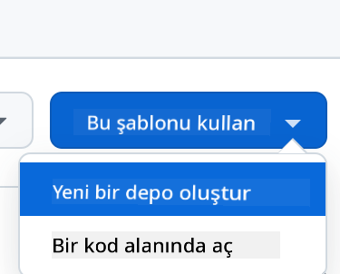
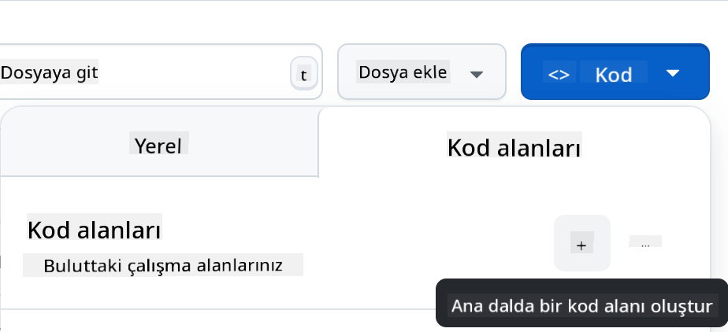

<!--
CO_OP_TRANSLATOR_METADATA:
{
  "original_hash": "cf15ff7770c5a484349383bb27d1131f",
  "translation_date": "2025-08-29T01:26:18+00:00",
  "source_file": "9-chat-project/README.md",
  "language_code": "tr"
}
-->
# Sohbet Projesi

Bu sohbet projesi, GitHub Modelleri kullanarak bir Sohbet Asistanı oluşturmayı gösterir.

İşte bitmiş projenin nasıl göründüğü:

<div>
  
</div>

Biraz bağlam vermek gerekirse, üretken yapay zeka kullanarak Sohbet asistanları oluşturmak, yapay zeka hakkında öğrenmeye başlamak için harika bir yoldur. Bu derste, üretken yapay zekayı bir web uygulamasına entegre etmeyi öğreneceksiniz. Hadi başlayalım.

## Üretken Yapay Zekaya Bağlanma

Backend için GitHub Modellerini kullanıyoruz. Bu, yapay zekayı ücretsiz olarak kullanmanıza olanak tanıyan harika bir hizmettir. Oyun alanına gidin ve seçtiğiniz backend diline karşılık gelen kodu alın. İşte [GitHub Modelleri Oyun Alanı](https://github.com/marketplace/models/azure-openai/gpt-4o-mini/playground) böyle görünüyor:

<div>
  
</div>

Dediğimiz gibi, "Kod" sekmesini ve seçtiğiniz çalışma zamanını seçin.

<div>
  
</div>

Bu durumda Python'u seçiyoruz, bu da şu kodu alacağımız anlamına geliyor:

```python
"""Run this model in Python

> pip install openai
"""
import os
from openai import OpenAI

# To authenticate with the model you will need to generate a personal access token (PAT) in your GitHub settings. 
# Create your PAT token by following instructions here: https://docs.github.com/en/authentication/keeping-your-account-and-data-secure/managing-your-personal-access-tokens
client = OpenAI(
    base_url="https://models.github.ai/inference",
    api_key=os.environ["GITHUB_TOKEN"],
)

response = client.chat.completions.create(
    messages=[
        {
            "role": "system",
            "content": "",
        },
        {
            "role": "user",
            "content": "What is the capital of France?",
        }
    ],
    model="openai/gpt-4o-mini",
    temperature=1,
    max_tokens=4096,
    top_p=1
)

print(response.choices[0].message.content)
```

Bu kodu biraz temizleyelim, böylece yeniden kullanılabilir hale gelsin:

```python
def call_llm(prompt: str, system_message: str):
    response = client.chat.completions.create(
        messages=[
            {
                "role": "system",
                "content": system_message,
            },
            {
                "role": "user",
                "content": prompt,
            }
        ],
        model="openai/gpt-4o-mini",
        temperature=1,
        max_tokens=4096,
        top_p=1
    )

    return response.choices[0].message.content
```

Bu `call_llm` fonksiyonu ile artık bir istem ve bir sistem istemi alabilir ve fonksiyon sonucu döndürebilir.

### Yapay Zeka Asistanını Özelleştirme

Yapay zeka asistanını özelleştirmek isterseniz, sistem istemini şu şekilde doldurarak nasıl davranmasını istediğinizi belirtebilirsiniz:

```python
call_llm("Tell me about you", "You're Albert Einstein, you only know of things in the time you were alive")
```

## Bir Web API'si Üzerinden Sunma

Harika, yapay zeka kısmını tamamladık, şimdi bunu bir Web API'sine nasıl entegre edebileceğimize bakalım. Web API'si için Flask kullanmayı seçiyoruz, ancak herhangi bir web çerçevesi uygun olacaktır. İşte bunun için kod:

```python
# api.py
from flask import Flask, request, jsonify
from llm import call_llm
from flask_cors import CORS

app = Flask(__name__)
CORS(app)   # *   example.com

@app.route("/", methods=["GET"])
def index():
    return "Welcome to this API. Call POST /hello with 'message': 'my message' as JSON payload"


@app.route("/hello", methods=["POST"])
def hello():
    # get message from request body  { "message": "do this taks for me" }
    data = request.get_json()
    message = data.get("message", "")

    response = call_llm(message, "You are a helpful assistant.")
    return jsonify({
        "response": response
    })

if __name__ == "__main__":
    app.run(host="0.0.0.0", port=5000)
```

Burada bir Flask API'si oluşturuyoruz ve "/" ve "/chat" olmak üzere iki rota tanımlıyoruz. İkincisi, frontendimizin soruları backend'e iletmesi için tasarlanmıştır.

*llm.py* dosyasını entegre etmek için yapmamız gerekenler şunlardır:

- `call_llm` fonksiyonunu içe aktarın:

   ```python
   from llm import call_llm
   from flask import Flask, request
   ```

- "/chat" rotasından çağırın:

   ```python
   @app.route("/hello", methods=["POST"])
   def hello():
      # get message from request body  { "message": "do this taks for me" }
      data = request.get_json()
      message = data.get("message", "")

      response = call_llm(message, "You are a helpful assistant.")
      return jsonify({
         "response": response
      })
   ```

   Burada gelen isteği ayrıştırarak JSON gövdesindeki `message` özelliğini alıyoruz. Daha sonra bu çağrıyı LLM ile yapıyoruz:

   ```python
   response = call_llm(message, "You are a helpful assistant")

   # return the response as JSON
   return jsonify({
      "response": response 
   })
   ```

Harika, şimdi ihtiyacımız olan her şeyi yaptık.

### Cors'u Yapılandırma

Backend ve frontend farklı portlarda çalışacağı için, frontend'in backend'e çağrı yapmasına izin vermek için CORS (çapraz kaynak paylaşımı) gibi bir şey ayarlamamız gerektiğini belirtmeliyiz. *api.py* dosyasında bunu ayarlayan bir kod parçası var:

```python
from flask_cors import CORS

app = Flask(__name__)
CORS(app)   # *   example.com
```

Şu anda "*" yani tüm kaynaklara izin verecek şekilde ayarlandı ve bu biraz güvensiz. Üretime geçtiğimizde bunu sınırlamalıyız.

## Projenizi Çalıştırma

Tamam, elimizde *llm.py* ve *api.py* var, bunu bir backend ile nasıl çalıştırabiliriz? İki şey yapmamız gerekiyor:

- Bağımlılıkları yükleyin:

   ```sh
   cd backend
   python -m venv venv
   source ./venv/bin/activate

   pip install openai flask flask-cors openai
   ```

- API'yi başlatın:

   ```sh
   python api.py
   ```

   Eğer Codespaces kullanıyorsanız, editörün alt kısmındaki Portlar bölümüne gidin, sağ tıklayın ve "Port Visibility" seçeneğini seçerek "Public" yapın.

### Bir Frontend Üzerinde Çalışma

Artık bir API'miz çalışıyor, bunun için bir frontend oluşturalım. Adım adım geliştireceğimiz minimum bir frontend ile başlayacağız. *frontend* klasöründe şu dosyaları oluşturun:

```text
backend/
frontend/
index.html
app.js
styles.css
```

**index.html** ile başlayalım:

```html
<html>
    <head>
        <link rel="stylesheet" href="styles.css">
    </head>
    <body>
      <form>
        <textarea id="messages"></textarea>
        <input id="input" type="text" />
        <button type="submit" id="sendBtn">Send</button>  
      </form>  
      <script src="app.js" />
    </body>
</html>    
```

Yukarıdaki, bir sohbet penceresini desteklemek için gereken minimum yapıdır. Bir textarea, mesajların görüntüleneceği bir alan, bir giriş alanı ve mesajınızı backend'e göndermek için bir düğme içerir. Şimdi *app.js* içindeki JavaScript'e bakalım.

**app.js**

```js
// app.js

(function(){
  // 1. set up elements  
  const messages = document.getElementById("messages");
  const form = document.getElementById("form");
  const input = document.getElementById("input");

  const BASE_URL = "change this";
  const API_ENDPOINT = `${BASE_URL}/hello`;

  // 2. create a function that talks to our backend
  async function callApi(text) {
    const response = await fetch(API_ENDPOINT, {
      method: "POST",
      headers: { "Content-Type": "application/json" },
      body: JSON.stringify({ message: text })
    });
    let json = await response.json();
    return json.response;
  }

  // 3. add response to our textarea
  function appendMessage(text, role) {
    const el = document.createElement("div");
    el.className = `message ${role}`;
    el.innerHTML = text;
    messages.appendChild(el);
  }

  // 4. listen to submit events
  form.addEventListener("submit", async(e) => {
    e.preventDefault();
   // someone clicked the button in the form
   
   // get input
   const text = input.value.trim();

   appendMessage(text, "user")

   // reset it
   input.value = '';

   const reply = await callApi(text);

   // add to messages
   appendMessage(reply, "assistant");

  })
})();
```

Kodu bölüm bölüm inceleyelim:

- 1) Burada, daha sonra kodda başvuracağımız tüm öğelere bir referans alıyoruz.
- 2) Bu bölümde, yerleşik `fetch` yöntemini kullanarak backend'e çağrı yapan bir fonksiyon oluşturuyoruz.
- 3) `appendMessage`, hem kullanıcı olarak yazdığınız mesajları hem de yanıtları eklemeye yardımcı olur.
- 4) Burada, gönderme olayını dinliyoruz ve giriş alanını okuyarak, kullanıcının mesajını textarea'ya yerleştiriyoruz, API'yi çağırıyoruz ve yanıtı textarea'da görüntülüyoruz.

Şimdi stil kısmına bakalım. Burada tamamen özgürsünüz ve istediğiniz gibi tasarlayabilirsiniz, ancak işte bazı öneriler:

**styles.css**

```
.message {
    background: #222;
    box-shadow: 0 0 0 10px orange;
    padding: 10px:
    margin: 5px;
}

.message.user {
    background: blue;
}

.message.assistant {
    background: grey;
} 
```

Bu üç sınıf ile, mesajları bir asistandan mı yoksa bir kullanıcıdan mı geldiğine bağlı olarak farklı şekilde stillendirebilirsiniz. İlham almak isterseniz, `solution/frontend/styles.css` klasörüne göz atabilirsiniz.

### Base URL'yi Değiştirme

Burada ayarlamadığımız bir şey vardı, o da `BASE_URL`. Backend başlatılana kadar bu bilinmez. Bunu ayarlamak için:

- API'yi yerel olarak çalıştırıyorsanız, `http://localhost:5000` gibi bir şey olmalıdır.
- Codespaces'te çalıştırıyorsanız, "[name]app.github.dev" gibi bir şey olmalıdır.

## Ödev

*project* adında kendi klasörünüzü oluşturun ve şu şekilde içerik ekleyin:

```text
project/
  frontend/
    index.html
    app.js
    styles.css
  backend/
    api.py
    llm.py
```

Yukarıda talimat verilen içerikleri kopyalayın, ancak istediğiniz gibi özelleştirmekten çekinmeyin.

## Çözüm

[Çözüm](./solution/README.md)

## Bonus

Yapay zeka asistanının kişiliğini değiştirmeyi deneyin. *api.py* dosyasında `call_llm` fonksiyonunu çağırırken ikinci argümanı istediğiniz gibi değiştirebilirsiniz, örneğin:

```python
call_llm(message, "You are Captain Picard")
```

Ayrıca CSS ve metni istediğiniz gibi değiştirin, bu nedenle *index.html* ve *styles.css* dosyalarında değişiklik yapın.

## Özet

Harika, sıfırdan bir yapay zeka kullanarak kişisel bir asistan oluşturmayı öğrendiniz. Bunu GitHub Modelleri, Python'da bir backend ve HTML, CSS ve JavaScript'te bir frontend kullanarak yaptık.

## Codespaces ile Kurulum

- Şuraya gidin: [Web Dev For Beginners repo](https://github.com/microsoft/Web-Dev-For-Beginners)
- Bir şablondan oluşturun (GitHub'da oturum açtığınızdan emin olun) sağ üst köşede:

    

- Kendi deponuzda, bir Codespace oluşturun:

    

    Bu, artık üzerinde çalışabileceğiniz bir ortam başlatacaktır.

---

**Feragatname**:  
Bu belge, [Co-op Translator](https://github.com/Azure/co-op-translator) adlı yapay zeka çeviri hizmeti kullanılarak çevrilmiştir. Doğruluk için çaba göstersek de, otomatik çevirilerin hata veya yanlışlıklar içerebileceğini lütfen unutmayın. Belgenin orijinal dili, yetkili kaynak olarak kabul edilmelidir. Kritik bilgiler için profesyonel insan çevirisi önerilir. Bu çevirinin kullanımından kaynaklanan yanlış anlama veya yanlış yorumlamalardan sorumlu değiliz.