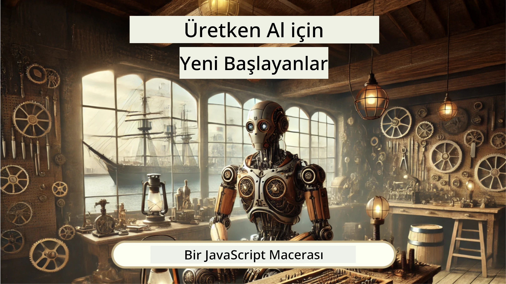
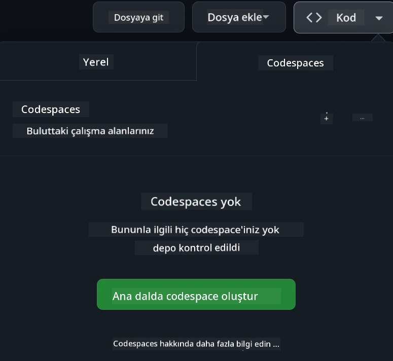

<!--
CO_OP_TRANSLATOR_METADATA:
{
  "original_hash": "fea3a0fceb8ad86fd640c09cf63a2aac",
  "translation_date": "2026-01-06T20:05:17+00:00",
  "source_file": "README.md",
  "language_code": "tr"
}
-->
# Yeni Başlayanlar İçin Web Geliştirme - Bir Müfredat

Microsoft Bulut Savunucuları tarafından sunulan 12 haftalık kapsamlı kursumuz ile web geliştirme temellerini öğrenin. 24 dersin her biri, terrariumlar, tarayıcı uzantıları ve uzay oyunları gibi uygulamalı projelerle JavaScript, CSS ve HTML'i derinlemesine ele alır. Quizler, tartışmalar ve pratik ödevlerle katılım sağlayın. Becerilerinizi geliştirin ve etkili proje tabanlı pedagojimizle bilgi tutmanızı optimize edin. Kodlama yolculuğunuza bugün başlayın!

Azure AI Foundry Discord Topluluğuna Katılın

Bu kaynakları kullanmaya başlamak için şu adımları izleyin:
1. **Depoyu Forklayın**: Tıklayın [](https://GitHub.com/microsoft/Web-Dev-For-Beginners/fork)
2. **Depoyu Klonlayın**:   `git clone https://github.com/microsoft/Web-Dev-For-Beginners.git`
3. [**Azure AI Foundry Discord'a Katılın ve uzmanlar ve diğer geliştiricilerle tanışın**](https://discord.com/invite/ByRwuEEgH4)

### 🌐 Çok Dilli Destek

#### GitHub Action ile Destekleniyor (Otomatik ve Her Zaman Güncel)

<!-- CO-OP TRANSLATOR LANGUAGES TABLE START -->
[Arapça](../ar/README.md) | [Bengalce](../bn/README.md) | [Bulgarca](../bg/README.md) | [Burmaca (Myanmar)](../my/README.md) | [Çince (Basitleştirilmiş)](../zh/README.md) | [Çince (Geleneksel, Hong Kong)](../hk/README.md) | [Çince (Geleneksel, Makao)](../mo/README.md) | [Çince (Geleneksel, Tayvan)](../tw/README.md) | [Hırvatça](../hr/README.md) | [Çekçe](../cs/README.md) | [Danca](../da/README.md) | [Flemenkçe](../nl/README.md) | [Estonca](../et/README.md) | [Fince](../fi/README.md) | [Fransızca](../fr/README.md) | [Almanca](../de/README.md) | [Yunanca](../el/README.md) | [İbranice](../he/README.md) | [Hintçe](../hi/README.md) | [Macarca](../hu/README.md) | [Endonezce](../id/README.md) | [İtalyanca](../it/README.md) | [Japonca](../ja/README.md) | [Kannada](../kn/README.md) | [Korece](../ko/README.md) | [Litvanca](../lt/README.md) | [Malayca](../ms/README.md) | [Malayalam](../ml/README.md) | [Marathi](../mr/README.md) | [Nepalce](../ne/README.md) | [Nijerya Pidgin](../pcm/README.md) | [Norveççe](../no/README.md) | [Farsça (Farsi)](../fa/README.md) | [Lehçe](../pl/README.md) | [Portekizce (Brezilya)](../br/README.md) | [Portekizce (Portekiz)](../pt/README.md) | [Pencapça (Gurmukhi)](../pa/README.md) | [Romence](../ro/README.md) | [Rusça](../ru/README.md) | [Sırpça (Kiril)](../sr/README.md) | [Slovakça](../sk/README.md) | [Slovence](../sl/README.md) | [İspanyolca](../es/README.md) | [Svahili](../sw/README.md) | [İsveççe](../sv/README.md) | [Tagalog (Filipinler)](../tl/README.md) | [Tamilce](../ta/README.md) | [Telugu](../te/README.md) | [Tayca](../th/README.md) | [Türkçe](./README.md) | [Ukraynaca](../uk/README.md) | [Urduca](../ur/README.md) | [Vietnamca](../vi/README.md)

> **Yerelde Klonlamayı mı Tercih Ediyorsunuz?**

> Bu depo 50'den fazla dil çevirisi içerir, bu da indirme boyutunu önemli ölçüde artırır. Çeviriler olmadan klonlamak için sparse checkout kullanın:
> ```bash
> git clone --filter=blob:none --sparse https://github.com/microsoft/Web-Dev-For-Beginners.git
> cd Web-Dev-For-Beginners
> git sparse-checkout set --no-cone '/*' '!translations' '!translated_images'
> ```
> Bu, kursu tamamlamak için ihtiyacınız olan her şeyi çok daha hızlı indirebilmenizi sağlar.
<!-- CO-OP TRANSLATOR LANGUAGES TABLE END -->

**Ek çeviri dilleri istenirse, desteklenenler [burada](https://github.com/Azure/co-op-translator/blob/main/getting_started/supported-languages.md) listelenmiştir**

#### 🧑‍🎓 _Öğrenci misiniz?_

Başlangıç kaynakları, Öğrenci paketleri ve hatta ücretsiz bir sertifika kuponu kazanma yollarını bulabileceğiniz [**Öğrenci Merkezi sayfasını**](https://docs.microsoft.com/learn/student-hub/?WT.mc_id=academic-77807-sagibbon) ziyaret edin. Bu sayfayı yer imlerinize ekleyin ve ayda bir içerik değişikliklerini kontrol edin.

### 📣 Duyuru - Tamamlanması Gereken Yeni GitHub Copilot Agent modu zorlukları!

Yeni zorluk eklendi, çoğu bölümde "GitHub Copilot Agent Challenge 🚀" arayın. Bu, GitHub Copilot ve Agent modu kullanarak tamamlayabileceğiniz yeni bir zorluk. Daha önce Agent modunu kullanmadıysanız, sadece metin üretmekle kalmaz, aynı zamanda dosyalar oluşturup düzenleyebilir, komutlar çalıştırabilir ve daha fazlasını yapabilir.

### 📣 Duyuru - _Generative AI kullanarak oluşturulacak Yeni Proje_

Yeni AI Asistan projesi eklendi, kontrol edin [proje](./9-chat-project/README.md)

### 📣 Duyuru - _JavaScript için yeni Generative AI Müfredatı_ yayınlandı

Yeni Generative AI müfredatımızı kaçırmayın!

Başlamak için ziyaret edin [https://aka.ms/genai-js-course](https://aka.ms/genai-js-course)!



- Temelden RAG'a kadar her şeyi kapsayan dersler.
- GenAI ve yardımcı uygulamamızla tarihi karakterlerle etkileşim kurun.
- Eğlenceli ve ilgi çekici anlatım, zamanda yolculuk yapacaksınız!


Her ders; tamamlanacak bir ödev, bilgi kontrolü ve şu konulara rehberlik eden bir zorluk içerir:
- Promptlama ve prompt mühendisliği
- Metin ve görsel uygulama üretimi
- Arama uygulamaları

Başlamak için ziyaret edin [https://aka.ms/genai-js-course](https://aka.ms/genai-js-course)!


## 🌱 Başlarken

> **Öğretmenler**, bu müfredatı nasıl kullanacağınıza dair [bazı öneriler](for-teachers.md) ekledik. Geri bildiriminizi [tartışma forumumuzda](https://github.com/microsoft/Web-Dev-For-Beginners/discussions/categories/teacher-corner) duymak isteriz!

**[Öğrenciler](https://aka.ms/student-page/?WT.mc_id=academic-77807-sagibbon)**, her ders için bir ön-ders quiz’i ile başlayın, ardından ders materyalini okuyun, çeşitli etkinlikleri tamamlayın ve ders sonrası quiz ile anlayışınızı kontrol edin.

Öğrenme deneyiminizi geliştirmek için projeler üzerinde birlikte çalışmak üzere arkadaşlarınızla bağlantı kurun! Tartışmalar, moderatör ekibimizin sorularınızı yanıtlamak için mevcut olduğu [tartışma forumumuzda](https://github.com/microsoft/Web-Dev-For-Beginners/discussions) teşvik edilmektedir.

Eğitiminizi ilerletmek için ek çalışma materyalleri için [Microsoft Learn](https://learn.microsoft.com/users/wirelesslife/collections/p1ddcy5jwy0jkm?WT.mc_id=academic-77807-sagibbon) platformunu keşfetmenizi şiddetle tavsiye ederiz.

### 📋 Ortamınızı Kurmak

Bu müfredat hazır bir geliştirme ortamına sahiptir! Başlarken, müfredatı [Codespace](https://github.com/features/codespaces/) (_tarayıcı tabanlı, kuruluma gerek olmayan ortam_) üzerinde ya da bilgisayarınızda [Visual Studio Code](https://code.visualstudio.com/?WT.mc_id=academic-77807-sagibbon) gibi bir metin düzenleyicisi kullanarak çalıştırabilirsiniz.

#### Depo oluşturun
Çalışmanızı kolayca kaydedebilmeniz için, bu deponun kendi kopyanızı oluşturmanız önerilir. Sayfanın üstündeki **Use this template** (Bu şablonu kullan) düğmesine tıklayarak bunu yapabilirsiniz. Bu, GitHub hesabınızda müfredatın bir kopyasıyla yeni bir depo oluşturur.

Şu adımları izleyin:
1. **Depoyu Forklayın**: Bu sayfanın sağ üst köşesindeki "Fork" düğmesine tıklayın.
2. **Depoyu Klonlayın**:   `git clone https://github.com/microsoft/Web-Dev-For-Beginners.git`

#### Müfredatı Codespace üzerinde çalıştırma

Oluşturduğunuz deponuzda **Code** (Kod) düğmesine tıklayın ve **Open with Codespaces** (Codespaces ile Aç) seçeneğini seçin. Bu, üzerinde çalışmanız için yeni bir Codespace oluşturacaktır.



#### Müfredatı bilgisayarınızda yerel olarak çalıştırma

Bu müfredatı bilgisayarınızda yerel olarak çalıştırmak için bir metin düzenleyiciye, bir tarayıcıya ve bir komut satırı aracına ihtiyacınız olacak. İlk dersimiz [Programlama Dillerine ve Ticaret Araçlarına Giriş](../../1-getting-started-lessons/1-intro-to-programming-languages), seçiminize yardımcı olacak bu araçlar için çeşitli seçenekleri tanıtacaktır.

Önerimiz, ayrıca yerleşik bir [Terminal](https://code.visualstudio.com/docs/terminal/basics/?WT.mc_id=academic-77807-sagibbon) içeren [Visual Studio Code](https://code.visualstudio.com/?WT.mc_id=academic-77807-sagibbon) editörünü kullanmanızdır. Visual Studio Code'u [buradan](https://code.visualstudio.com/?WT.mc_id=academic-77807-sagibbon) indirebilirsiniz.

1. Depoyu bilgisayarınıza klonlayın. Bunu, **Code** düğmesine tıklayarak URL'yi kopyalayarak yapabilirsiniz:

    [CodeSpace](./images/createcodespace.png)
Sonra, [Visual Studio Code](https://code.visualstudio.com/?WT.mc_id=academic-77807-sagibbon) içinde [Terminal](https://code.visualstudio.com/docs/terminal/basics/?WT.mc_id=academic-77807-sagibbon) bölümünü açın ve `<your-repository-url>` yerine az önce kopyaladığınız URL'yi koyarak aşağıdaki komutu çalıştırın:

    ```bash 
    git clone <your-repository-url>
    ```

2. Klasörü Visual Studio Code'da açın. Bunu **Dosya** > **Klasör Aç** seçeneğine tıklayarak ve az önce klonladığınız klasörü seçerek yapabilirsiniz.


>  Önerilen Visual Studio Code uzantıları:
>
> * [Live Server](https://marketplace.visualstudio.com/items?itemName=ritwickdey.LiveServer&WT.mc_id=academic-77807-sagibbon) - Visual Studio Code içinde HTML sayfalarını önizlemek için
> * [Copilot](https://marketplace.visualstudio.com/items?itemName=GitHub.copilot&WT.mc_id=academic-77807-sagibbon) - kod yazmanızı hızlandırmak için

## 📂 Her ders şunları içerir:

- isteğe bağlı skeç notu
- isteğe bağlı ek video
- ders öncesi ısınma testi
- yazılı ders
- proje tabanlı dersler için projenin nasıl oluşturulacağına dair adım adım rehberler
- bilgi kontrolü
- bir meydan okuma
- ek okuma materyali
- görev
- [ders sonrası sınav](https://ff-quizzes.netlify.app/web/)

> **Testler hakkında bir not**: Tüm testler, her biri üç sorudan oluşan toplam 48 test olmak üzere Quiz-app klasöründe yer almaktadır. Testlere [buradan](https://ff-quizzes.netlify.app/web/) erişebilirsiniz; quiz uygulaması yerel olarak çalıştırılabilir veya Azure'da dağıtılabilir; `quiz-app` klasöründeki talimatları izleyin.

## 🗃️ Dersler

|     |                       Proje Adı                       |                            Öğretilen Kavramlar                             | Öğrenme Hedefleri                                                                                                                 |                                                         Bağlantılı Ders                                                          |         Yazar          |
| :-: | :------------------------------------------------------: | :--------------------------------------------------------------------: | ----------------------------------------------------------------------------------------------------------------------------------- | :----------------------------------------------------------------------------------------------------------------------------: | :---------------------: |
| 01  |                     Başlarken                      |           Programlamaya Giriş ve Araçlar           | Çoğu programlama dilinin temel prensiplerini ve profesyonel geliştiricilerin işlerini yapmalarına yardımcı olan yazılımları öğrenin | [Programlama Dillerine ve Araçlarına Giriş](./1-getting-started-lessons/1-intro-to-programming-languages/README.md) |         Jasmine         |
| 02  |                     Başlarken                      |             GitHub Temelleri, takım ile çalışma             | Projenizde GitHub'ı nasıl kullanacağınızı, kod tabanında başkalarıyla nasıl iş birliği yapacağınızı öğrenin                                                    |                            [GitHub'a Giriş](./1-getting-started-lessons/2-github-basics/README.md)                             |          Floor          |
| 03  |                     Başlarken                      |                             Erişilebilirlik                              | Web erişilebilirliğinin temellerini öğrenin                                                                                                |                       [Erişilebilirlik Temelleri](./1-getting-started-lessons/3-accessibility/README.md)                       |       Christopher       |
| 04  |                        JS Temelleri                         |                         JavaScript Veri Tipleri                          | JavaScript veri tiplerinin temelleri                                                                                                 |                                       [Veri Tipleri](./2-js-basics/1-data-types/README.md)                                        |         Jasmine         |
| 05  |                        JS Temelleri                         |                         Fonksiyonlar ve Metodlar                          | Bir uygulamanın mantık akışını yönetmek için fonksiyonlar ve metodlar hakkında bilgi edinin                                                             |                              [Fonksiyonlar ve Metodlar](./2-js-basics/2-functions-methods/README.md)                               | Jasmine ve Christopher |
| 06  |                        JS Temelleri                         |                        JS ile Karar Verme                        | Kodunuzda karar verme yöntemlerini kullanarak koşullar oluşturmayı öğrenin                                                           |                                 [Karar Verme](./2-js-basics/3-making-decisions/README.md)                                  |         Jasmine         |
| 07  |                        JS Temelleri                         |                            Diziler ve Döngüler                            | JavaScript'te diziler ve döngülerle veriyle çalışma                                                                                 |                                   [Diziler ve Döngüler](./2-js-basics/4-arrays-loops/README.md)                                    |         Jasmine         |
| 08  |       [Terrarium](./3-terrarium/solution/README.md)       |                            HTML Uygulaması                            | Bir çevrimiçi terraryum oluşturmak için HTML inşa edin, özellikle bir düzen oluşturmaya odaklanın                                                         |                                 [HTML'ye Giriş](./3-terrarium/1-intro-to-html/README.md)                                 |           Jen           |
| 09  |       [Terrarium](./3-terrarium/solution/README.md)       |                            CSS Uygulaması                             | Çevrimiçi terraryumu stilize etmek için CSS oluşturun, sayfayı duyarlı yapmak dahil CSS temellerine odaklanın                     |                                  [CSS'ye Giriş](./3-terrarium/2-intro-to-css/README.md)                                  |           Jen           |
| 10  |            [Terrarium](./3-terrarium/solution/README.md)            |                 JavaScript Closures, DOM manipülasyonu                  | Terraryumun sürükle/bırak arayüzü olarak işlev görmesi için JavaScript oluşturun, closures ve DOM manipülasyonuna odaklanın             |                  [JavaScript Closures, DOM Manipülasyonu](./3-terrarium/3-intro-to-DOM-and-closures/README.md)                   |           Jen           |
| 11  |          [Yazma Oyunu](./4-typing-game/solution/README.md)          |                          Yazma Oyunu Oluşturma                           | JavaScript uygulamanızın mantığını sürdürmek için klavye olaylarını nasıl kullanacağınızı öğrenin                                                          |                                [Olay Tabanlı Programlama](./4-typing-game/typing-game/README.md)                                |       Christopher       |
| 12  | [Yeşil Tarayıcı Uzantısı](./5-browser-extension/solution/README.md) |                         Tarayıcılarla Çalışmak                          | Tarayıcıların nasıl çalıştığını, tarihçesini ve bir tarayıcı uzantısının ilk elemanlarını nasıl iskeletini oluşturacağınızı öğrenin                               |                               [Tarayıcılar Hakkında](./5-browser-extension/1-about-browsers/README.md)                                |           Jen           |
| 13  | [Yeşil Tarayıcı Uzantısı](./5-browser-extension/solution/README.md) | Form oluşturma, API çağırma ve yerel depolamada değişken saklama | Yerel depolamada saklanan değişkenleri kullanarak bir API çağırmak için tarayıcı uzantınızın JavaScript öğelerini oluşturun                      |                [API'ler, Formlar ve Yerel Depolama](./5-browser-extension/2-forms-browsers-local-storage/README.md)                 |           Jen           |
| 14  | [Yeşil Tarayıcı Uzantısı](./5-browser-extension/solution/README.md) |          Tarayıcıdaki arka plan işlemleri, web performansı          | Uzantının simgesini yönetmek için tarayıcı arka plan işlemlerini kullanın; web performansı ve bazı optimizasyonlar hakkında bilgi edinin   |             [Arka Plan Görevleri ve Performans](./5-browser-extension/3-background-tasks-and-performance/README.md)              |           Jen           |
| 15  |           [Uzay Oyunu](./6-space-game/solution/README.md)           |             JavaScript ile Daha Gelişmiş Oyun Geliştirme             | Bir oyun geliştirmeye hazırlık olarak Sınıflar ve Kompozisyon kullanarak Tür mirası ve Yayıncı/Abone (Pub/Sub) desenini öğrenin              |                      [Gelişmiş Oyun Geliştirmeye Giriş](./6-space-game/1-introduction/README.md)                       |          Chris          |
| 16  |           [Uzay Oyunu](./6-space-game/solution/README.md)           |                           Canvas'a Çizim                            | Ekrana eleman çizmek için kullanılan Canvas API hakkında bilgi edinin                                                                       |                                [Canvas'a Çizim](./6-space-game/2-drawing-to-canvas/README.md)                                |          Chris          |
| 17  |           [Uzay Oyunu](./6-space-game/solution/README.md)           |                   Ekrandaki elemanları hareket ettirme                    | Kartezyen koordinatları ve Canvas API kullanarak elemanların hareket kazanmasını keşfedin                                            |                           [Elemanları Hareket Ettirme](./6-space-game/3-moving-elements-around/README.md)                           |          Chris          |
| 18  |           [Uzay Oyunu](./6-space-game/solution/README.md)           |                          Çarpışma algılama                           | Elemanların birbirine çarpmasını ve tepki vermesini klavye basışlarıyla sağlayın; oyunun performansı için bir dinlenme fonksiyonu oluşturun    |                              [Çarpışma Algılama](./6-space-game/4-collision-detection/README.md)                              |          Chris          |
| 19  |           [Uzay Oyunu](./6-space-game/solution/README.md)           |                             Skor Tutma                              | Oyunun durumu ve performansına bağlı matematiksel hesaplamalar yapın                                                                |                                    [Skor Tutma](./6-space-game/5-keeping-score/README.md)                                    |          Chris          |
| 20  |           [Uzay Oyunu](./6-space-game/solution/README.md)           |                     Oyunu bitirme ve yeniden başlatma                     | Oyunun bitirilmesi ve yeniden başlatılması hakkında bilgi edinin, varlıkların temizlenmesi ve değişken değerlerinin sıfırlanması dahil                              |                                [Bitiş Koşulu](./6-space-game/6-end-condition/README.md)                                 |          Chris          |
| 21  |         [Bankacılık Uygulaması](./7-bank-project/solution/README.md)          |                 Bir Web Uygulamasında HTML Şablonları ve Rotalar                 | Çok sayfalı bir web sitesinin mimarisinin iskeletini oluşturmak için routing ve HTML şablonlarını kullanmayı öğrenin                             |                            [HTML Şablonları ve Rotalar](./7-bank-project/1-template-route/README.md)                             |          Yohan          |
| 22  |         [Bankacılık Uygulaması](./7-bank-project/solution/README.md)          |                  Giriş ve Kayıt Formu Oluşturma                   | Formlar oluşturma ve doğrulama işlemlerini nasıl yapacağınızı öğrenin                                                                          |                                           [Formlar](./7-bank-project/2-forms/README.md)                                           |          Yohan          |
| 23  |         [Bankacılık Uygulaması](./7-bank-project/solution/README.md)          |                   Veri Alma ve Kullanma Yöntemleri                   | Verinin uygulamanıza nasıl giriş ve çıkış yaptığını, nasıl alındığını, saklandığını ve atıldığını öğrenin                                                 |                                            [Veri](./7-bank-project/3-data/README.md)                                            |          Yohan          |
| 24  |         [Bankacılık Uygulaması](./7-bank-project/solution/README.md)          |                      Durum Yönetimi Kavramları                      | Uygulamanızın durumu nasıl koruduğunu ve bunu programatik olarak nasıl yönettiğinizi öğrenin                                                              |                                [Durum Yönetimi](./7-bank-project/4-state-management/README.md)                                |          Yohan          |
| 25 | [Tarayıcı/VScode Kodu](../../8-code-editor) | VScode ile Çalışmak | Bir kod editörü nasıl kullanılır öğrenin| [VScode Kod Editörü Kullanımı](./8-code-editor/1-using-a-code-editor/README.md) | Chris |
| 26 | [Yapay Zeka Asistanları](./9-chat-project/README.md) | Yapay Zeka ile Çalışmak | Kendi Yapay Zeka asistanınızı nasıl oluşturacağınızı öğrenin | [Yapay Zeka Asistanı projesi](./9-chat-project/README.md) | Chris |

## 🏫 Pedagoji

Müfredatımız iki temel pedagojik ilke göz önünde bulundurularak tasarlanmıştır:
* proje tabanlı öğrenme
* sık sık yapılan testler

Program, JavaScript, HTML ve CSS'nin temellerini, ayrıca günümüz web geliştiricilerinin kullandığı en son araç ve teknikleri öğretir. Öğrenciler, bir yazma oyunu, sanal terraryum, çevre dostu tarayıcı uzantısı, uzay istilacı tarzı oyun ve iş için bankacılık uygulaması inşa ederek pratik deneyim elde etme fırsatı bulacaklar. Serinin sonunda öğrenciler web geliştirme konusunda sağlam bir anlayışa sahip olacaklar.

> 🎓 Bu müfredattaki ilk birkaç dersi Microsoft Learn üzerinden bir [Öğrenme Yolu](https://docs.microsoft.com/learn/paths/web-development-101/?WT.mc_id=academic-77807-sagibbon) olarak alabilirsiniz!

İçeriğin projelerle uyumlu olmasını sağlayarak süreç öğrenciler için daha ilgi çekici hale getirilmiş ve kavramların akılda kalıcılığı artırılmıştır. Ayrıca, kavramların tanıtılması için JavaScript temellerinde birkaç başlangıç dersleri yazdık ve bunları, yazarlarından bazıları bu müfredatın oluşturulmasına katkı sağlamış olan "[JavaScript’e Yeni Başlayanlar Serisi](https://channel9.msdn.com/Series/Beginners-Series-to-JavaScript/?WT.mc_id=academic-77807-sagibbon)" video eğitimi koleksiyonundan bir video ile eşleştirdik.

Ek olarak, sınıftan önce yapılan düşük baskılı bir test öğrencinin bir konuyu öğrenme niyetini belirlerken, sınıftan sonra yapılan ikinci test öğrendiklerinin korunmasını sağlar. Bu müfredat esnek ve eğlenceli olacak şekilde tasarlanmış olup tamamen veya kısmen alınabilir. Projeler küçük başlar ve 12 haftalık döngünün sonunda giderek karmaşıklaşır.

Bir framework’e geçmeden önce bir web geliştiricisi için gerekli temel becerilere odaklanmak amacıyla JavaScript frameworklerini bilinçli olarak tanıtmaktan kaçındık, ancak bu müfredatı tamamlamak için iyi bir sonraki adım başka bir video koleksiyonu olan "[Node.js’e Yeni Başlayanlar Serisi](https://channel9.msdn.com/Series/Beginners-Series-to-Nodejs/?WT.mc_id=academic-77807-sagibbon)" aracılığıyla Node.js öğrenmek olur.

> [Davranış Kurallarımız](CODE_OF_CONDUCT.md) ve [Katılım](CONTRIBUTING.md) rehberlerimizi ziyaret edin. Yapıcı geri bildirimlerinizi bekliyoruz!


## 🧭 Çevrimdışı erişim

Bu dokümantasyonu çevrimdışı olarak [Docsify](https://docsify.js.org/#/) kullanarak çalıştırabilirsiniz. Bu repoyu çatallayın, local makinenize [Docsify](https://docsify.js.org/#/quickstart) kurun ve ardından bu repoyu içeren kök klasörde `docsify serve` yazın. Web sitesi, yerel sunucunuzda 3000 portundan sunulacaktır: `localhost:3000`.

## 📘 PDF

Tüm derslerin PDF hali [burada](https://microsoft.github.io/Web-Dev-For-Beginners/pdf/readme.pdf) bulunabilir.


## 🎒 Diğer Kurslar
Ekibimiz başka kurslar da üretiyor! Göz atın:

<!-- CO-OP TRANSLATOR OTHER COURSES START -->
### LangChain
[](https://aka.ms/langchain4j-for-beginners)
[](https://aka.ms/langchainjs-for-beginners?WT.mc_id=m365-94501-dwahlin)

---

### Azure / Edge / MCP / Agents
[](https://github.com/microsoft/AZD-for-beginners?WT.mc_id=academic-105485-koreyst)
[](https://github.com/microsoft/edgeai-for-beginners?WT.mc_id=academic-105485-koreyst)
[](https://github.com/microsoft/mcp-for-beginners?WT.mc_id=academic-105485-koreyst)
[](https://github.com/microsoft/ai-agents-for-beginners?WT.mc_id=academic-105485-koreyst)

---
 
### Üretken Yapay Zeka Serisi
[](https://github.com/microsoft/generative-ai-for-beginners?WT.mc_id=academic-105485-koreyst)
[-9333EA?style=for-the-badge&labelColor=E5E7EB&color=9333EA)](https://github.com/microsoft/Generative-AI-for-beginners-dotnet?WT.mc_id=academic-105485-koreyst)
[-C084FC?style=for-the-badge&labelColor=E5E7EB&color=C084FC)](https://github.com/microsoft/generative-ai-for-beginners-java?WT.mc_id=academic-105485-koreyst)
[-E879F9?style=for-the-badge&labelColor=E5E7EB&color=E879F9)](https://github.com/microsoft/generative-ai-with-javascript?WT.mc_id=academic-105485-koreyst)

---
 
### Temel Öğrenme
[](https://aka.ms/ml-beginners?WT.mc_id=academic-105485-koreyst)
[](https://aka.ms/datascience-beginners?WT.mc_id=academic-105485-koreyst)
[](https://aka.ms/ai-beginners?WT.mc_id=academic-105485-koreyst)
[](https://github.com/microsoft/Security-101?WT.mc_id=academic-96948-sayoung)
[](https://aka.ms/webdev-beginners?WT.mc_id=academic-105485-koreyst)
[](https://aka.ms/iot-beginners?WT.mc_id=academic-105485-koreyst)
[](https://github.com/microsoft/xr-development-for-beginners?WT.mc_id=academic-105485-koreyst)

---
 
### Copilot Serisi
[](https://aka.ms/GitHubCopilotAI?WT.mc_id=academic-105485-koreyst)
[](https://github.com/microsoft/mastering-github-copilot-for-dotnet-csharp-developers?WT.mc_id=academic-105485-koreyst)
[](https://github.com/microsoft/CopilotAdventures?WT.mc_id=academic-105485-koreyst)
<!-- CO-OP TRANSLATOR OTHER COURSES END -->

## Yardım Alma

Yapay zeka uygulamaları geliştirme konusunda takılırsanız veya herhangi bir sorunuz olursa, MCP hakkında tartışmalara katılmak için diğer öğrenenlerle ve deneyimli geliştiricilerle buluşun. Soruların hoş karşılandığı ve bilginin özgürce paylaşıldığı destekleyici bir topluluktur.

[](https://discord.gg/nTYy5BXMWG)

Ürün geri bildiriminiz veya geliştirme sırasında karşılaştığınız hatalar için ziyaret edin:

[](https://aka.ms/foundry/forum)

## Lisans

Bu depo MIT lisansı ile lisanslanmıştır. Daha fazla bilgi için [LICENSE](../../LICENSE) dosyasına bakınız.

---

<!-- CO-OP TRANSLATOR DISCLAIMER START -->
**Feragatname**:  
Bu belge, AI çeviri servisi [Co-op Translator](https://github.com/Azure/co-op-translator) kullanılarak çevrilmiştir. Doğruluk için çaba gösterilse de, otomatik çevirilerin hatalar veya yanlışlıklar içerebileceğini lütfen unutmayın. Orijinal belge, kendi dilinde otoriter kaynak olarak değerlendirilmelidir. Kritik bilgiler için profesyonel insan çevirisi tavsiye edilir. Bu çevirinin kullanımıyla ortaya çıkabilecek yanlış anlamalar veya yanlış yorumlamalar nedeniyle sorumluluk kabul edilmemektedir.
<!-- CO-OP TRANSLATOR DISCLAIMER END -->