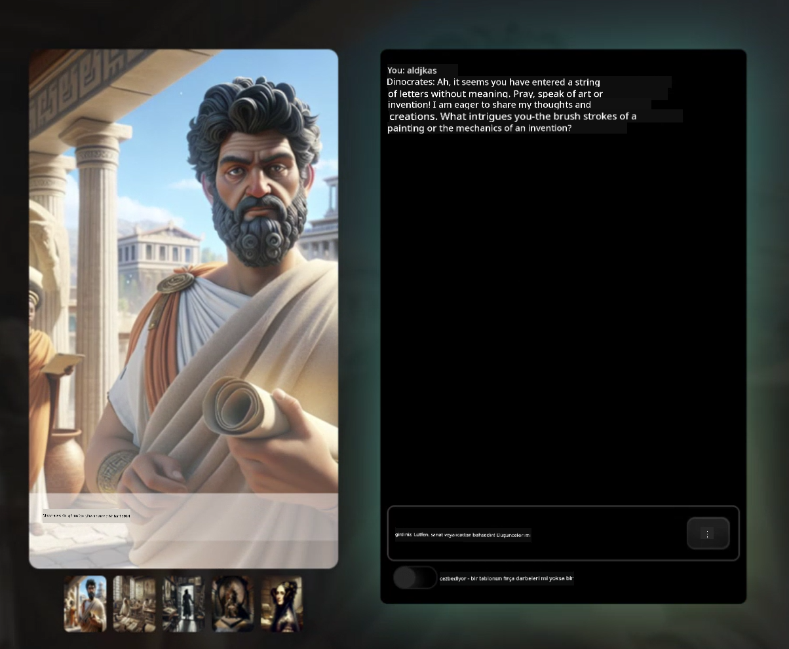

<!--
CO_OP_TRANSLATOR_METADATA:
{
  "original_hash": "caf2ca695e9d259153d24a5cf3e07ef5",
  "translation_date": "2025-10-11T11:07:20+00:00",
  "source_file": "README.md",
  "language_code": "tr"
}
-->
[](https://github.com/microsoft/Web-Dev-For-Beginners/blob/master/LICENSE)
[](https://GitHub.com/microsoft/Web-Dev-For-Beginners/graphs/contributors/)
[](https://GitHub.com/microsoft/Web-Dev-For-Beginners/issues/)
[](https://GitHub.com/microsoft/Web-Dev-For-Beginners/pulls/)
[](http://makeapullrequest.com)

[](https://GitHub.com/microsoft/Web-Dev-For-Beginners/watchers/)
[](https://GitHub.com/microsoft/Web-Dev-For-Beginners/network/)
[](https://GitHub.com/microsoft/Web-Dev-For-Beginners/stargazers/)

[](https://discord.gg/zxKYvhSnVp?WT.mc_id=academic-000002-leestott)

# Yeni Başlayanlar için Web Geliştirme - Bir Müfredat

Microsoft Cloud Advocates tarafından hazırlanan 12 haftalık kapsamlı kursumuzla web geliştirme temellerini öğrenin. 24 dersin her biri, teraryumlar, tarayıcı uzantıları ve uzay oyunları gibi uygulamalı projeler aracılığıyla JavaScript, CSS ve HTML'e odaklanır. Quizler, tartışmalar ve pratik ödevlerle öğreniminizi pekiştirin. Proje tabanlı pedagojimizle becerilerinizi geliştirin ve bilgilerinizi optimize edin. Kodlama yolculuğunuza bugün başlayın!

Azure AI Foundry Discord Topluluğuna Katılın

[](https://discord.com/invite/ByRwuEEgH4)

Bu kaynakları kullanmaya başlamak için şu adımları izleyin:
1. **Depoyu Çatallayın**: [](https://GitHub.com/microsoft/Web-Dev-For-Beginners/fork) düğmesine tıklayın.
2. **Depoyu Klonlayın**:   `git clone https://github.com/microsoft/Web-Dev-For-Beginners.git`
3. [**Azure AI Foundry Discord'a katılın ve uzmanlarla ve diğer geliştiricilerle tanışın**](https://discord.com/invite/ByRwuEEgH4)

### 🌐 Çok Dilli Destek

#### GitHub Action ile Destekleniyor (Otomatik ve Her Zaman Güncel)

<!-- CO-OP TRANSLATOR LANGUAGES TABLE START -->
[Arabic](../ar/README.md) | [Bengali](../bn/README.md) | [Bulgarian](../bg/README.md) | [Burmese (Myanmar)](../my/README.md) | [Chinese (Simplified)](../zh/README.md) | [Chinese (Traditional, Hong Kong)](../hk/README.md) | [Chinese (Traditional, Macau)](../mo/README.md) | [Chinese (Traditional, Taiwan)](../tw/README.md) | [Croatian](../hr/README.md) | [Czech](../cs/README.md) | [Danish](../da/README.md) | [Dutch](../nl/README.md) | [Estonian](../et/README.md) | [Finnish](../fi/README.md) | [French](../fr/README.md) | [German](../de/README.md) | [Greek](../el/README.md) | [Hebrew](../he/README.md) | [Hindi](../hi/README.md) | [Hungarian](../hu/README.md) | [Indonesian](../id/README.md) | [Italian](../it/README.md) | [Japanese](../ja/README.md) | [Korean](../ko/README.md) | [Lithuanian](../lt/README.md) | [Malay](../ms/README.md) | [Marathi](../mr/README.md) | [Nepali](../ne/README.md) | [Norwegian](../no/README.md) | [Persian (Farsi)](../fa/README.md) | [Polish](../pl/README.md) | [Portuguese (Brazil)](../br/README.md) | [Portuguese (Portugal)](../pt/README.md) | [Punjabi (Gurmukhi)](../pa/README.md) | [Romanian](../ro/README.md) | [Russian](../ru/README.md) | [Serbian (Cyrillic)](../sr/README.md) | [Slovak](../sk/README.md) | [Slovenian](../sl/README.md) | [Spanish](../es/README.md) | [Swahili](../sw/README.md) | [Swedish](../sv/README.md) | [Tagalog (Filipino)](../tl/README.md) | [Tamil](../ta/README.md) | [Thai](../th/README.md) | [Turkish](./README.md) | [Ukrainian](../uk/README.md) | [Urdu](../ur/README.md) | [Vietnamese](../vi/README.md)
<!-- CO-OP TRANSLATOR LANGUAGES TABLE END -->

**Ek dil çevirileri istiyorsanız, desteklenen diller [burada](https://github.com/Azure/co-op-translator/blob/main/getting_started/supported-languages.md) listelenmiştir.**

[](https://open.vscode.dev/microsoft/Web-Dev-For-Beginners)

#### 🧑‍🎓 _Öğrenci misiniz?_

[**Öğrenci Merkezi sayfasını**](https://docs.microsoft.com/learn/student-hub/?WT.mc_id=academic-77807-sagibbon) ziyaret edin. Burada başlangıç kaynakları, öğrenci paketleri ve hatta ücretsiz sertifika kuponu alma yollarını bulabilirsiniz. Bu sayfayı yer imlerine ekleyin ve içeriklerin aylık olarak değiştiği için zaman zaman kontrol edin.

### 📣 Duyuru - _Yeni Proje: Üretken Yapay Zeka ile İnşa Edin_

Yeni AI Asistan projesi eklendi, [projeye](./09-chat-project/README.md) göz atın.

### 📣 Duyuru - _Yeni Müfredat_ JavaScript için Üretken Yapay Zeka

Yeni Üretken Yapay Zeka müfredatımızı kaçırmayın!

Başlamak için [https://aka.ms/genai-js-course](https://aka.ms/genai-js-course) adresini ziyaret edin!


- Temellerden RAG'a kadar her şeyi kapsayan dersler.
- GenAI ve yardımcı uygulamamızla tarihi karakterlerle etkileşim kurun.
- Eğlenceli ve ilgi çekici bir anlatım, zamanda yolculuk yapacaksınız!



Her ders, tamamlanması gereken bir ödev, bilgi kontrolü ve aşağıdaki gibi konuları öğrenmenize rehberlik edecek bir meydan okuma içerir:
- İstek oluşturma ve istek mühendisliği
- Metin ve görsel uygulama oluşturma
- Arama uygulamaları

Başlamak için [https://aka.ms/genai-js-course](https://aka.ms/genai-js-course) adresini ziyaret edin!

## 🌱 Başlarken

> **Öğretmenler**, bu müfredatı nasıl kullanabileceğinize dair [bazı öneriler](for-teachers.md) ekledik. Görüşlerinizi [tartışma forumumuzda](https://github.com/microsoft/Web-Dev-For-Beginners/discussions/categories/teacher-corner) paylaşmanızı çok isteriz!

**[Öğrenciler](https://aka.ms/student-page/?WT.mc_id=academic-77807-sagibbon)**, her ders için bir ön ders sınavıyla başlayın ve ders materyalini okuyarak, çeşitli etkinlikleri tamamlayarak ve son ders sınavıyla anlayışınızı kontrol ederek devam edin.

Öğrenme deneyiminizi geliştirmek için projeler üzerinde birlikte çalışmak üzere akranlarınızla bağlantı kurun! Tartışmalar, [tartışma forumumuzda](https://github.com/microsoft/Web-Dev-For-Beginners/discussions) teşvik edilir. Moderatör ekibimiz sorularınızı yanıtlamak için hazır olacak.

Eğitiminizi ilerletmek için [Microsoft Learn](https://learn.microsoft.com/users/wirelesslife/collections/p1ddcy5jwy0jkm?WT.mc_id=academic-77807-sagibbon) platformunu ek çalışma materyalleri için keşfetmenizi şiddetle tavsiye ederiz.

### 📋 Ortamınızı Ayarlama

Bu müfredat, kullanıma hazır bir geliştirme ortamına sahiptir! Başlarken, müfredatı [Codespace](https://github.com/features/codespaces/) (_tarayıcı tabanlı, kurulum gerektirmeyen bir ortam_) veya bilgisayarınızda [Visual Studio Code](https://code.visualstudio.com/?WT.mc_id=academic-77807-sagibbon) gibi bir metin editörü kullanarak yerel olarak çalıştırmayı seçebilirsiniz.

#### Depo Oluşturun
Çalışmanızı kolayca kaydedebilmeniz için bu depoyu kendi kopyanızı oluşturmanız önerilir. Bunu, sayfanın üst kısmındaki **Bu şablonu kullan** düğmesine tıklayarak yapabilirsiniz. Bu, müfredatın bir kopyasıyla GitHub hesabınızda yeni bir depo oluşturacaktır.

Şu adımları izleyin:
1. **Depoyu Çatallayın**: Bu sayfanın sağ üst köşesindeki "Fork" düğmesine tıklayın.
2. **Depoyu Klonlayın**:   `git clone https://github.com/microsoft/Web-Dev-For-Beginners.git`

#### Müfredatı Codespace'de Çalıştırma

Oluşturduğunuz bu deponun kopyasında, **Code** düğmesine tıklayın ve **Open with Codespaces** seçeneğini seçin. Bu, çalışmanız için yeni bir Codespace oluşturacaktır.


#### Müfredatı Bilgisayarınızda Yerel Olarak Çalıştırma

Bu müfredatı bilgisayarınızda yerel olarak çalıştırmak için bir metin editörüne, bir tarayıcıya ve bir komut satırı aracına ihtiyacınız olacak. İlk dersimiz, [Programlama Dillerine ve Araçlarına Giriş](../../1-getting-started-lessons/1-intro-to-programming-languages), bu araçların her biri için çeşitli seçenekleri incelemenize ve size en uygun olanı seçmenize yardımcı olacaktır.

Önerimiz, [Visual Studio Code](https://code.visualstudio.com/?WT.mc_id=academic-77807-sagibbon) kullanmanızdır. Bu editör, aynı zamanda yerleşik bir [Terminal](https://code.visualstudio.com/docs/terminal/basics/?WT.mc_id=academic-77807-sagibbon) içerir. Visual Studio Code'u [buradan](https://code.visualstudio.com/?WT.mc_id=academic-77807-sagibbon) indirebilirsiniz.

1. Depoyu bilgisayarınıza klonlayın. Bunu, **Code** düğmesine tıklayıp URL'yi kopyalayarak yapabilirsiniz:

    [CodeSpace](./images/createcodespace.png)

    Ardından, [Visual Studio Code](https://code.visualstudio.com/?WT.mc_id=academic-77807-sagibbon) içindeki [Terminal](https://code.visualstudio.com/docs/terminal/basics/?WT.mc_id=academic-77807-sagibbon) açın ve aşağıdaki komutu çalıştırın. `<your-repository-url>` kısmını kopyaladığınız URL ile değiştirin:

    ```bash 
    git clone <your-repository-url>
    ```

2. Visual Studio Code'da klasörü açın. Bunu, **File** > **Open Folder** seçeneğine tıklayarak ve klonladığınız klasörü seçerek yapabilirsiniz.

>  Önerilen Visual Studio Code eklentileri:
>
> * [Live Server](https://marketplace.visualstudio.com/items?itemName=ritwickdey.LiveServer&WT.mc_id=academic-77807-sagibbon) - HTML sayfalarını Visual Studio Code içinde önizlemek için
> * [Copilot](https://marketplace.visualstudio.com/items?itemName=GitHub.copilot&WT.mc_id=academic-77807-sagibbon) - kod yazmanızı hızlandırmak için

## 📂 Her ders şunları içerir:

- isteğe bağlı çizim notları
- isteğe bağlı ek video
- ders öncesi ısınma sınavı
- yazılı ders
- proje tabanlı dersler için, projeyi nasıl oluşturacağınızı adım adım anlatan rehberler
- bilgi kontrolleri
- bir meydan okuma
- ek okuma materyalleri
- ödev
- [ders sonrası test](https://ff-quizzes.netlify.app/web/)

> **Testler hakkında bir not**: Tüm testler Quiz-app klasöründe yer alır, her biri üç sorudan oluşan toplam 48 test bulunmaktadır. Testlere [buradan](https://ff-quizzes.netlify.app/web/) ulaşabilirsiniz. Quiz uygulaması yerel olarak çalıştırılabilir veya Azure'a dağıtılabilir; `quiz-app` klasöründeki talimatları takip edin.

## 🗃️ Dersler

|     |                       Proje Adı                       |                            Öğretilen Kavramlar                             | Öğrenme Hedefleri                                                                                                                 |                                                         Bağlantılı Ders                                                          |         Yazar          |
| :-: | :----------------------------------------------------: | :------------------------------------------------------------------------: | --------------------------------------------------------------------------------------------------------------------------------- | :----------------------------------------------------------------------------------------------------------------------------: | :-------------------: |
| 01  |                     Başlangıç                         |           Programlamaya Giriş ve Kullanılan Araçlar                        | Çoğu programlama dilinin temel prensiplerini ve profesyonel geliştiricilerin işlerini yapmalarına yardımcı olan yazılımları öğrenin | [Programlama Dillerine ve Araçlara Giriş](./1-getting-started-lessons/1-intro-to-programming-languages/README.md)               |         Jasmine       |
| 02  |                     Başlangıç                         |             GitHub Temelleri, ekip çalışması dahil                         | Projenizde GitHub'ı nasıl kullanacağınızı, bir kod tabanında başkalarıyla nasıl iş birliği yapacağınızı öğrenin                    |                            [GitHub'a Giriş](./1-getting-started-lessons/2-github-basics/README.md)                              |          Floor         |
| 03  |                     Başlangıç                         |                             Erişilebilirlik                               | Web erişilebilirliğinin temellerini öğrenin                                                                                       |                       [Erişilebilirlik Temelleri](./1-getting-started-lessons/3-accessibility/README.md)                        |       Christopher      |
| 04  |                        JS Temelleri                   |                         JavaScript Veri Türleri                           | JavaScript veri türlerinin temellerini öğrenin                                                                                     |                                       [Veri Türleri](./2-js-basics/1-data-types/README.md)                                       |         Jasmine       |
| 05  |                        JS Temelleri                   |                         Fonksiyonlar ve Metotlar                          | Bir uygulamanın mantık akışını yönetmek için fonksiyonlar ve metotlar hakkında bilgi edinin                                        |                              [Fonksiyonlar ve Metotlar](./2-js-basics/2-functions-methods/README.md)                            | Jasmine ve Christopher |
| 06  |                        JS Temelleri                   |                        JS ile Karar Verme                                 | Kodunuzda karar verme yöntemlerini kullanarak koşullar oluşturmayı öğrenin                                                        |                                 [Karar Verme](./2-js-basics/3-making-decisions/README.md)                                       |         Jasmine       |
| 07  |                        JS Temelleri                   |                            Diziler ve Döngüler                            | JavaScript'te diziler ve döngüler kullanarak verilerle çalışın                                                                    |                                   [Diziler ve Döngüler](./2-js-basics/4-arrays-loops/README.md)                                  |         Jasmine       |
| 08  |       [Terrarium](./3-terrarium/solution/README.md)   |                            HTML Uygulamada                               | Çevrimiçi bir terrarium oluşturmak için HTML yapısını oluşturun, bir düzen oluşturma üzerine odaklanın                            |                                 [HTML'ye Giriş](./3-terrarium/1-intro-to-html/README.md)                                        |           Jen         |
| 09  |       [Terrarium](./3-terrarium/solution/README.md)   |                            CSS Uygulamada                                | Çevrimiçi terrarium'u stilize etmek için CSS oluşturun, CSS'in temellerine ve sayfayı duyarlı hale getirmeye odaklanın             |                                  [CSS'ye Giriş](./3-terrarium/2-intro-to-css/README.md)                                         |           Jen         |
| 10  |            [Terrarium](./3-terrarium/solution/README.md)            |                 JavaScript Kapanışlar, DOM Manipülasyonu                  | Terrarium'u bir sürükle/bırak arayüzü olarak işlevsel hale getirmek için JavaScript oluşturun, kapanışlar ve DOM manipülasyonu üzerine odaklanın |                  [JavaScript Kapanışlar, DOM Manipülasyonu](./3-terrarium/3-intro-to-DOM-and-closures/README.md)                |           Jen         |
| 11  |          [Yazma Oyunu](./4-typing-game/solution/README.md)          |                          Bir Yazma Oyunu Oluşturma                        | JavaScript uygulamanızın mantığını yönlendirmek için klavye olaylarını nasıl kullanacağınızı öğrenin                               |                                [Olay Tabanlı Programlama](./4-typing-game/typing-game/README.md)                                |       Christopher      |
| 12  | [Yeşil Tarayıcı Uzantısı](./5-browser-extension/solution/README.md) |                         Tarayıcılarla Çalışma                             | Tarayıcıların nasıl çalıştığını, tarihçesini ve bir tarayıcı uzantısının ilk öğelerini nasıl oluşturacağınızı öğrenin              |                               [Tarayıcılar Hakkında](./5-browser-extension/1-about-browsers/README.md)                          |           Jen         |
| 13  | [Yeşil Tarayıcı Uzantısı](./5-browser-extension/solution/README.md) | Form oluşturma, bir API çağırma ve değişkenleri yerel depolamada saklama  | Yerel depolamada saklanan değişkenleri kullanarak bir API çağırmak için tarayıcı uzantınızın JavaScript öğelerini oluşturun        |                [API'ler, Formlar ve Yerel Depolama](./5-browser-extension/2-forms-browsers-local-storage/README.md)             |           Jen         |
| 14  | [Yeşil Tarayıcı Uzantısı](./5-browser-extension/solution/README.md) |          Tarayıcıda arka plan işlemleri, web performansı                  | Uzantının simgesini yönetmek için tarayıcının arka plan işlemlerini kullanın; web performansı ve bazı optimizasyonlar hakkında bilgi edinin |             [Arka Plan Görevleri ve Performans](./5-browser-extension/3-background-tasks-and-performance/README.md)             |           Jen         |
| 15  |           [Uzay Oyunu](./6-space-game/solution/README.md)           |             JavaScript ile Daha İleri Düzey Oyun Geliştirme              | Bir oyun oluşturma hazırlığında, hem Sınıflar hem de Kompozisyon kullanarak Kalıtım ve Pub/Sub modelini öğrenin                   |                      [İleri Düzey Oyun Geliştirmeye Giriş](./6-space-game/1-introduction/README.md)                             |          Chris         |
| 16  |           [Uzay Oyunu](./6-space-game/solution/README.md)           |                           Tuval Üzerine Çizim                            | Ekrana öğeler çizmek için kullanılan Canvas API'sini öğrenin                                                                      |                                [Tuval Üzerine Çizim](./6-space-game/2-drawing-to-canvas/README.md)                              |          Chris         |
| 17  |           [Uzay Oyunu](./6-space-game/solution/README.md)           |                   Ekranda öğeleri hareket ettirme                        | Öğelerin kartesyen koordinatları ve Canvas API'si kullanılarak nasıl hareket kazandığını keşfedin                                 |                           [Öğeleri Hareket Ettirme](./6-space-game/3-moving-elements-around/README.md)                          |          Chris         |
| 18  |           [Uzay Oyunu](./6-space-game/solution/README.md)           |                          Çarpışma Algılama                               | Öğelerin birbirleriyle çarpışmasını ve tepki vermesini sağlayın, tuş vuruşlarını kullanarak performansı artırmak için bir soğuma fonksiyonu ekleyin |                              [Çarpışma Algılama](./6-space-game/4-collision-detection/README.md)                                |          Chris         |
| 19  |           [Uzay Oyunu](./6-space-game/solution/README.md)           |                             Puan Tutma                                   | Oyunun durumu ve performansına göre matematiksel hesaplamalar yapın                                                               |                                    [Puan Tutma](./6-space-game/5-keeping-score/README.md)                                       |          Chris         |
| 20  |           [Uzay Oyunu](./6-space-game/solution/README.md)           |                     Oyunu Bitirme ve Yeniden Başlatma                    | Oyunu bitirme ve yeniden başlatma, varlıkları temizleme ve değişken değerlerini sıfırlama hakkında bilgi edinin                   |                                [Bitirme Koşulu](./6-space-game/6-end-condition/README.md)                                       |          Chris         |
| 21  |         [Bankacılık Uygulaması](./7-bank-project/solution/README.md) |                 HTML Şablonları ve Web Uygulamasında Yönlendirme          | Çok sayfalı bir web sitesinin mimarisini yönlendirme ve HTML şablonları kullanarak oluşturmayı öğrenin                            |                            [HTML Şablonları ve Yönlendirme](./7-bank-project/1-template-route/README.md)                        |          Yohan         |
| 22  |         [Bankacılık Uygulaması](./7-bank-project/solution/README.md) |                  Giriş ve Kayıt Formu Oluşturma                          | Formlar oluşturma ve doğrulama rutinlerini yönetme hakkında bilgi edinin                                                           |                                           [Formlar](./7-bank-project/2-forms/README.md)                                         |          Yohan         |
| 23  |         [Bankacılık Uygulaması](./7-bank-project/solution/README.md) |                   Veri Alma ve Kullanma Yöntemleri                       | Verilerin uygulamanıza nasıl girip çıktığını, nasıl alınacağını, saklanacağını ve atılacağını öğrenin                              |                                            [Veri](./7-bank-project/3-data/README.md)                                            |          Yohan         |
| 24  |         [Bankacılık Uygulaması](./7-bank-project/solution/README.md) |                      Durum Yönetimi Kavramları                           | Uygulamanızın durumu nasıl koruduğunu ve bunu programlı olarak nasıl yöneteceğinizi öğrenin                                        |                                [Durum Yönetimi](./7-bank-project/4-state-management/README.md)                                  |          Yohan         |
| 25 | [Tarayıcı/VScode Kod](../../8-code-editor) | VScode ile Çalışma | Bir kod editörü kullanmayı öğrenin | [VScode Kod Editörü Kullanımı](./8-code-editor/1-using-a-code-editor/README.md) | Chris |
| 26 | [AI Asistanları](./9-chat-project/README.md) | AI ile Çalışma | Kendi AI asistanınızı nasıl oluşturacağınızı öğrenin | [AI Asistanı Projesi](./9-chat-project/README.md) | Chris |

## 🏫 Pedagoji

Müfredatımız iki temel pedagojik prensip üzerine tasarlanmıştır:
* proje tabanlı öğrenme
* sık sık yapılan testler

Program, JavaScript, HTML ve CSS'in temellerini, ayrıca günümüz web geliştiricilerinin kullandığı en son araç ve teknikleri öğretir. Öğrenciler, yazma oyunu, sanal terrarium, çevre dostu tarayıcı uzantısı, uzay istilacı tarzı oyun ve işletmeler için bir bankacılık uygulaması oluşturarak pratik deneyim kazanma fırsatına sahip olacaklar. Serinin sonunda, öğrenciler web geliştirme konusunda sağlam bir anlayışa sahip olacaklar.

> 🎓 Bu müfredattaki ilk birkaç dersi Microsoft Learn'de bir [Öğrenme Yolu](https://docs.microsoft.com/learn/paths/web-development-101/?WT.mc_id=academic-77807-sagibbon) olarak alabilirsiniz!

İçeriğin projelerle uyumlu olmasını sağlayarak, süreç öğrenciler için daha ilgi çekici hale getirilir ve kavramların kalıcılığı artırılır. Ayrıca, JavaScript temellerini tanıtan birkaç başlangıç dersi yazdık ve bunları "[JavaScript'e Başlangıç Serisi](https://channel9.msdn.com/Series/Beginners-Series-to-JavaScript/?WT.mc_id=academic-77807-sagibbon)" video koleksiyonundan bir video ile eşleştirdik; bu koleksiyonun bazı yazarları bu müfredata katkıda bulunmuştur.

Ek olarak, bir sınıftan önce yapılan düşük riskli bir test, öğrencinin bir konuyu öğrenmeye yönelik niyetini belirlerken, sınıf sonrası yapılan ikinci bir test daha fazla kalıcılığı sağlar. Bu müfredat esnek ve eğlenceli olacak şekilde tasarlanmıştır ve tamamı veya bir kısmı alınabilir. Projeler küçük başlar ve 12 haftalık döngünün sonunda giderek karmaşıklaşır.

JavaScript çerçevelerini tanıtmaktan özellikle kaçınarak, bir çerçeve benimsemeden önce bir web geliştirici olarak ihtiyaç duyulan temel becerilere odaklandık. Bu müfredatı tamamladıktan sonra iyi bir sonraki adım, başka bir video koleksiyonu aracılığıyla Node.js hakkında bilgi edinmek olacaktır: "[Node.js'e Başlangıç Serisi](https://channel9.msdn.com/Series/Beginners-Series-to-Nodejs/?WT.mc_id=academic-77807-sagibbon)".

> [Davranış Kuralları](CODE_OF_CONDUCT.md) ve [Katkı Sağlama](CONTRIBUTING.md) yönergelerimizi ziyaret edin. Yapıcı geri bildirimlerinizi memnuniyetle karşılıyoruz!

## 🧭 Çevrimdışı erişim

Bu dokümantasyonu [Docsify](https://docsify.js.org/#/) kullanarak çevrimdışı çalıştırabilirsiniz. Bu depoyu çatallayın, [Docsify'i yükleyin](https://docsify.js.org/#/quickstart) yerel makinenize ve ardından bu deponun kök klasöründe `docsify serve` yazın. Web sitesi localhost'unuzda 3000 numaralı portta sunulacaktır: `localhost:3000`.

## 📘 PDF

Tüm derslerin PDF'sine [buradan](https://microsoft.github.io/Web-Dev-For-Beginners/pdf/readme.pdf) ulaşabilirsiniz.

## 🎒 Diğer Kurslar

Ekibimiz başka kurslar da üretiyor! Şunlara göz atın:

- [MCP for Beginners](https://aka.ms/mcp-for-beginners)
- [Edge AI for Beginners](https://aka.ms/edgeai-for-beginners)
- [AI Agents for Beginners](https://aka.ms/ai-agents-beginners)
- [Generative AI for Beginners .NET](https://github.com/microsoft/Generative-AI-for-beginners-dotnet)
- [Generative AI with JavaScript](https://github.com/microsoft/generative-ai-with-javascript)
- [Generative AI with Java](https://github.com/microsoft/Generative-AI-for-beginners-java)
- [AI for Beginners](https://aka.ms/ai-beginners)
- [Data Science for Beginners](https://aka.ms/datascience-beginners)
- [ML for Beginners](https://aka.ms/ml-beginners)
- [Cybersecurity for Beginners](https://github.com/microsoft/Security-101)
- [Web Dev for Beginners](https://aka.ms/webdev-beginners)
- [IoT for Beginners](https://aka.ms/iot-beginners)
- [Yeni Başlayanlar için XR Geliştirme](https://github.com/microsoft/xr-development-for-beginners)
- [GitHub Copilot'u Etkili Kullanım için Uzmanlaşma](https://github.com/microsoft/Mastering-GitHub-Copilot-for-Paired-Programming)
- [C#/.NET Geliştiricileri için GitHub Copilot'u Uzmanlaşma](https://github.com/microsoft/mastering-github-copilot-for-dotnet-csharp-developers)
- [Kendi Copilot Maceranı Seç](https://github.com/microsoft/CopilotAdventures)

## Yardım Alma

Eğer takılırsanız veya AI uygulamaları oluşturma konusunda sorularınız olursa, şu topluluğa katılabilirsiniz:

[](https://aka.ms/foundry/discord)

Ürünle ilgili geri bildirimde bulunmak veya hata yaşarsanız şu adresi ziyaret edin:

[](https://aka.ms/foundry/forum)

## Lisans

Bu depo MIT lisansı altında lisanslanmıştır. Daha fazla bilgi için [LICENSE](../../LICENSE) dosyasına bakabilirsiniz.

---

**Feragatname**:  
Bu belge, AI çeviri hizmeti [Co-op Translator](https://github.com/Azure/co-op-translator) kullanılarak çevrilmiştir. Doğruluk için çaba göstersek de, otomatik çevirilerin hata veya yanlışlık içerebileceğini lütfen unutmayın. Belgenin orijinal dili, yetkili kaynak olarak kabul edilmelidir. Kritik bilgiler için profesyonel insan çevirisi önerilir. Bu çevirinin kullanımından kaynaklanan yanlış anlamalar veya yanlış yorumlamalar için sorumluluk kabul edilmez.