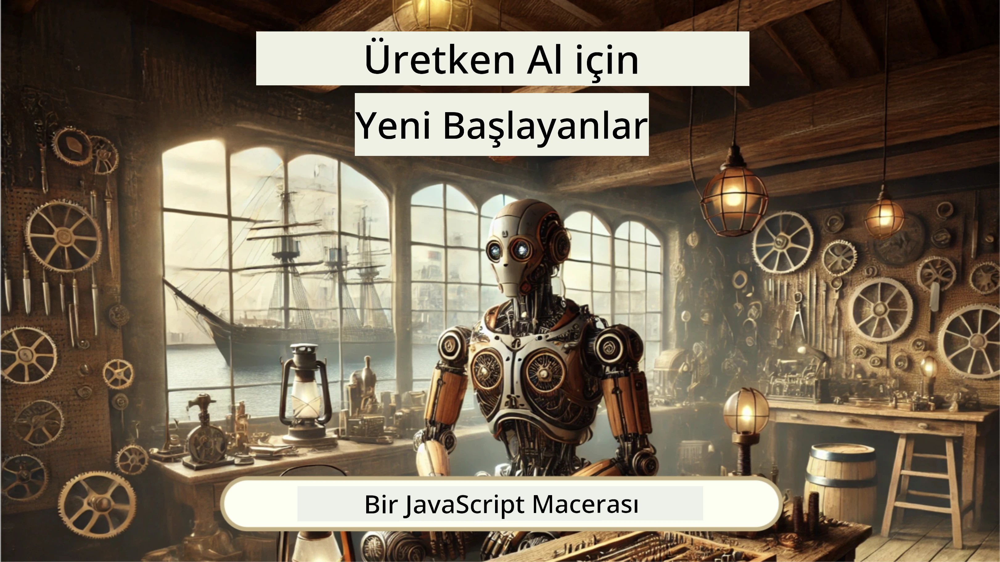
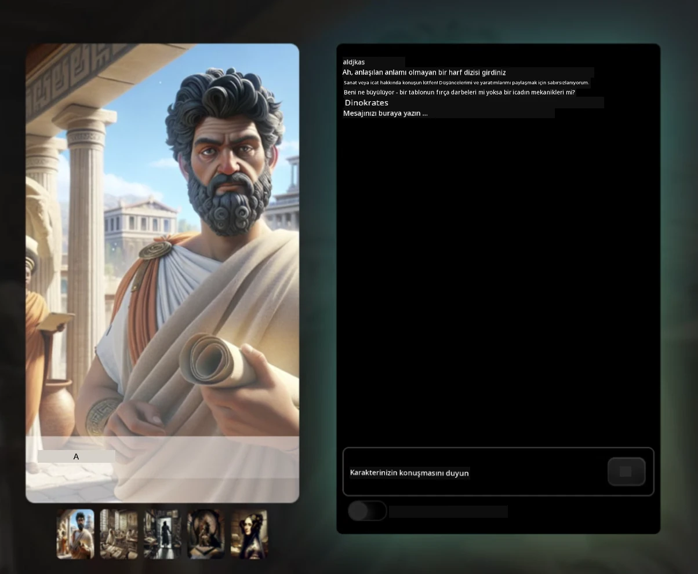
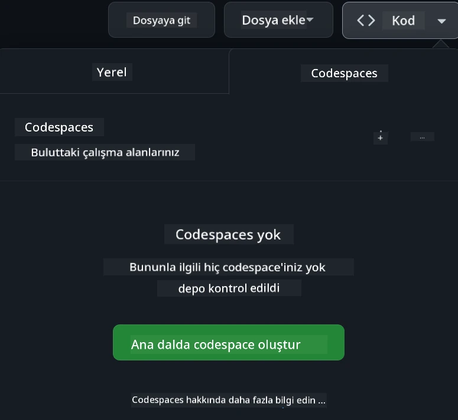

[](https://github.com/microsoft/Web-Dev-For-Beginners/blob/master/LICENSE)
[](https://GitHub.com/microsoft/Web-Dev-For-Beginners/graphs/contributors/)
[](https://GitHub.com/microsoft/Web-Dev-For-Beginners/issues/)
[](https://GitHub.com/microsoft/Web-Dev-For-Beginners/pulls/)
[](http://makeapullrequest.com) 

[](https://GitHub.com/microsoft/Web-Dev-For-Beginners/watchers/)
[](https://GitHub.com/microsoft/Web-Dev-For-Beginners/network/)
[](https://GitHub.com/microsoft/Web-Dev-For-Beginners/stargazers/)

[](https://discord.gg/nTYy5BXMWG)

# Yeni Başlayanlar İçin Web Geliştirme - Bir Müfredat

Microsoft Cloud Advocates tarafından sunulan 12 haftalık kapsamlı kursumuzla web geliştirme temellerini öğrenin. 24 dersin her biri terraryumlar, tarayıcı uzantıları ve uzay oyunları gibi uygulamalı projelerle JavaScript, CSS ve HTML konularına dalıyor. Quizler, tartışmalar ve pratik ödevlerle etkileşimde bulunun. Yeteneklerinizi geliştirip bilginizin kalıcılığını artırmak için etkili proje tabanlı öğretim yöntemimizi kullanın. Kodlama yolculuğunuza bugün başlayın!

Azure AI Foundry Discord Topluluğuna Katılın

[](https://discord.gg/nTYy5BXMWG)

Bu kaynakları kullanmaya başlamak için şu adımları izleyin:
1. **Depoyu Forklayın**: Tıklayın [](https://GitHub.com/microsoft/Web-Dev-For-Beginners/fork)
2. **Depoyu Klonlayın**:   `git clone https://github.com/microsoft/Web-Dev-For-Beginners.git`
3. [**Azure AI Foundry Discord'a katılın ve uzmanlar ile diğer geliştiricilerle tanışın**](https://discord.com/invite/ByRwuEEgH4)

### 🌐 Çoklu Dil Desteği

#### GitHub Action ile Desteklenmektedir (Otomatik ve Her Zaman Güncel)

<!-- CO-OP TRANSLATOR LANGUAGES TABLE START -->
[Arabic](../ar/README.md) | [Bengali](../bn/README.md) | [Bulgarian](../bg/README.md) | [Burmese (Myanmar)](../my/README.md) | [Chinese (Simplified)](../zh-CN/README.md) | [Chinese (Traditional, Hong Kong)](../zh-HK/README.md) | [Chinese (Traditional, Macau)](../zh-MO/README.md) | [Chinese (Traditional, Taiwan)](../zh-TW/README.md) | [Croatian](../hr/README.md) | [Czech](../cs/README.md) | [Danish](../da/README.md) | [Dutch](../nl/README.md) | [Estonian](../et/README.md) | [Finnish](../fi/README.md) | [French](../fr/README.md) | [German](../de/README.md) | [Greek](../el/README.md) | [Hebrew](../he/README.md) | [Hindi](../hi/README.md) | [Hungarian](../hu/README.md) | [Indonesian](../id/README.md) | [Italian](../it/README.md) | [Japanese](../ja/README.md) | [Kannada](../kn/README.md) | [Khmer](../km/README.md) | [Korean](../ko/README.md) | [Lithuanian](../lt/README.md) | [Malay](../ms/README.md) | [Malayalam](../ml/README.md) | [Marathi](../mr/README.md) | [Nepali](../ne/README.md) | [Nigerian Pidgin](../pcm/README.md) | [Norwegian](../no/README.md) | [Persian (Farsi)](../fa/README.md) | [Polish](../pl/README.md) | [Portuguese (Brazil)](../pt-BR/README.md) | [Portuguese (Portugal)](../pt-PT/README.md) | [Punjabi (Gurmukhi)](../pa/README.md) | [Romanian](../ro/README.md) | [Russian](../ru/README.md) | [Serbian (Cyrillic)](../sr/README.md) | [Slovak](../sk/README.md) | [Slovenian](../sl/README.md) | [Spanish](../es/README.md) | [Swahili](../sw/README.md) | [Swedish](../sv/README.md) | [Tagalog (Filipino)](../tl/README.md) | [Tamil](../ta/README.md) | [Telugu](../te/README.md) | [Thai](../th/README.md) | [Turkish](./README.md) | [Ukrainian](../uk/README.md) | [Urdu](../ur/README.md) | [Vietnamese](../vi/README.md)

> **Yerelde Klonlamayı mı Tercih Ediyorsunuz?**
>
> Bu depo 50'den fazla dil çevirisi içeriyor ve bu da indirme boyutunu önemli ölçüde artırıyor. Çeviriler olmadan klonlamak için seyrek kontrolü (sparse checkout) kullanın:
>
> **Bash / macOS / Linux:**
> ```bash
> git clone --filter=blob:none --sparse https://github.com/microsoft/Web-Dev-For-Beginners.git
> cd Web-Dev-For-Beginners
> git sparse-checkout set --no-cone '/*' '!translations' '!translated_images'
> ```
>
> **CMD (Windows):**
> ```cmd
> git clone --filter=blob:none --sparse https://github.com/microsoft/Web-Dev-For-Beginners.git
> cd Web-Dev-For-Beginners
> git sparse-checkout set --no-cone "/*" "!translations" "!translated_images"
> ```
>
> Bu, kursu tamamlamanız için ihtiyacınız olan her şeyi çok daha hızlı bir indirme ile size sağlar.
<!-- CO-OP TRANSLATOR LANGUAGES TABLE END -->

**Ek dil çevirileri istiyorsanız desteklenen diller [burada](https://github.com/Azure/co-op-translator/blob/main/getting_started/supported-languages.md) listelenmiştir**

[](https://open.vscode.dev/microsoft/Web-Dev-For-Beginners)

#### 🧑‍🎓 _Öğrenci misiniz?_

Başlangıç kaynakları, Öğrenci paketleri ve hatta ücretsiz sertifika kuponu almanın yollarını bulacağınız [**Öğrenci Merkezi sayfasını**](https://docs.microsoft.com/learn/student-hub/?WT.mc_id=academic-77807-sagibbon) ziyaret edin. Bu sayfa, içeriği aylık olarak değiştirdiğimiz için zaman zaman kaydetmek ve kontrol etmek isteyeceğiniz bir sayfadır.

### 📣 Duyuru - Tamamlanacak Yeni GitHub Copilot Agent modu meydan okumaları!

Yeni Meydan Okuma eklendi, çoğu bölümde "GitHub Copilot Agent Challenge 🚀" arayın. Bu, GitHub Copilot ve Agent modu kullanarak tamamlayacağınız yeni bir meydan okumadır. Daha önce Agent modunu kullanmadıysanız, sadece metin üretmekle kalmaz, dosya oluşturabilir ve düzenleyebilir, komutlar çalıştırabilir ve daha fazlasını yapabilir.

### 📣 Duyuru - _Generatif AI kullanarak oluşturulacak Yeni Proje_ 

Yeni AI Asistan projesi eklendi, inceleyin [proje](./9-chat-project/README.md)

### 📣 Duyuru - _JavaScript için yeni Generatif AI Müfredatı_ yeni yayınlandı

Yeni Generatif AI müfredatımızı kaçırmayın!

Başlamak için [https://aka.ms/genai-js-course](https://aka.ms/genai-js-course) adresini ziyaret edin!



- Temellerden RAG'e kadar her şeyi kapsayan dersler.
- GenAI ve yardımcı uygulamamız ile tarihi karakterlerle etkileşim.
- Eğlenceli ve sürükleyici bir anlatım, zamanda yolculuk yapacaksınız!




Her ders, tamamlanacak bir ödev, bilgi kontrolü ve şu konular gibi öğrenmenizi yönlendirecek bir meydan okuma içerir:
- Prompt kullanımı ve prompt mühendisliği
- Metin ve görsel uygulama üretimi
- Arama uygulamaları

Başlamak için [https://aka.ms/genai-js-course](https://aka.ms/genai-js-course) adresini ziyaret edin!


## 🌱 Başlarken

> **Öğretmenler**, bu müfredatı nasıl kullanacağınıza dair bazı [öneriler](for-teachers.md) ekledik. Geri bildirimlerinizi [tartışma forumumuzda](https://github.com/microsoft/Web-Dev-For-Beginners/discussions/categories/teacher-corner) duymak isteriz!

**[Öğrenenler](https://aka.ms/student-page/?WT.mc_id=academic-77807-sagibbon)**, her ders için, bir ders öncesi quiz ile başlayın, ardından ders materyalini okuyun, çeşitli etkinlikleri tamamlayın ve ders sonrası quiz ile anlayışınızı kontrol edin.

Öğrenme deneyiminizi artırmak için, projeler üzerinde birlikte çalışmak için akranlarınızla bağlantı kurun! Tartışmalar [tartışma forumumuzda](https://github.com/microsoft/Web-Dev-For-Beginners/discussions) teşvik edilmektedir ve moderatörlerimiz sorularınızı cevaplamak için orada olacaktır.

Eğitiminizi ilerletmek için ek çalışma materyalleri için [Microsoft Learn](https://learn.microsoft.com/users/wirelesslife/collections/p1ddcy5jwy0jkm?WT.mc_id=academic-77807-sagibbon) keşfetmenizi şiddetle tavsiye ederiz.

### 📋 Ortamınızı kurma

Bu müfredat, kullanıma hazır bir geliştirme ortamına sahiptir! Başlarken, müfredatı [Codespace](https://github.com/features/codespaces/) içinde (_tarayıcı tabanlı, kurulum gerektirmeyen ortam_), ya da bilgisayarınızda [Visual Studio Code](https://code.visualstudio.com/?WT.mc_id=academic-77807-sagibbon) gibi bir metin düzenleyici kullanarak çalıştırmayı tercih edebilirsiniz.

#### Depo oluşturun
Çalışmanızı kolayca kaydedebilmeniz için, bu deponun kendi kopyanızı oluşturmanız önerilir. Bunu yapmak için sayfanın üstündeki **Use this template** butonuna tıklayın. Bu, GitHub hesabınızda müfredatın bir kopyasını içeren yeni bir depo oluşturacaktır.

Şu adımları izleyin:
1. **Depoyu Forklayın**: Sayfanın sağ üst köşesindeki "Fork" butonuna tıklayın.
2. **Depoyu Klonlayın**:   `git clone https://github.com/microsoft/Web-Dev-For-Beginners.git`

#### Müfredatı Codespace içinde çalıştırma

Oluşturduğunuz deponuzda **Code** butonuna tıklayın ve **Open with Codespaces** seçeneğini seçin. Bu, sizin için yeni bir Codespace oluşturacaktır.



#### Müfredatı bilgisayarınızda yerel olarak çalıştırma

Bu müfredatı bilgisayarınızda yerel olarak çalıştırmak için bir metin editörü, bir tarayıcı ve bir komut satırı aracına ihtiyacınız olacak. İlk dersimiz olan, [Programlama Dilleri ve Ticaret Araçlarına Giriş](../../1-getting-started-lessons/1-intro-to-programming-languages), size bunlar için çeşitli seçenekleri sunacak ve sizin için en uygun olanı seçmenize yardımcı olacaktır.

Önerimiz, editör olarak [Visual Studio Code](https://code.visualstudio.com/?WT.mc_id=academic-77807-sagibbon) kullanmanızdır; bu editör ayrıca yerleşik bir [Terminal](https://code.visualstudio.com/docs/terminal/basics/?WT.mc_id=academic-77807-sagibbon) içerir. Visual Studio Code'u [buradan](https://code.visualstudio.com/?WT.mc_id=academic-77807-sagibbon) indirebilirsiniz.
1. Depo'nuzu bilgisayarınıza klonlayın. Bunu yapmak için **Code** düğmesine tıklayıp URL'yi kopyalayabilirsiniz:

    [CodeSpace](./images/createcodespace.png)

    Ardından, [Visual Studio Code](https://code.visualstudio.com/?WT.mc_id=academic-77807-sagibbon) içinde [Terminal](https://code.visualstudio.com/docs/terminal/basics/?WT.mc_id=academic-77807-sagibbon) uygulamasını açın ve `<your-repository-url>` yerine az önce kopyaladığınız URL'yi koyarak aşağıdaki komutu çalıştırın:

    ```bash 
    git clone <your-repository-url>
    ```

2. Visual Studio Code’da klasörü açın. Bunu yapmak için **File** > **Open Folder** seçeneğine tıklayıp klonladığınız klasörü seçin.


>  Önerilen Visual Studio Code uzantıları:
>
> * [Live Server](https://marketplace.visualstudio.com/items?itemName=ritwickdey.LiveServer&WT.mc_id=academic-77807-sagibbon) - Visual Studio Code içinde HTML sayfalarını önizlemek için
> * [Copilot](https://marketplace.visualstudio.com/items?itemName=GitHub.copilot&WT.mc_id=academic-77807-sagibbon) - kod yazmayı hızlandırmak için yardımcı

## 📂 Her ders şunları içerir:

- isteğe bağlı çizim notu
- isteğe bağlı destekleyici video
- derse hazırlık sınavı
- yazılı ders
- proje tabanlı derslerde projeyi adım adım nasıl oluşturacağınıza dair rehberler
- bilgi kontrolü
- bir meydan okuma
- destekleyici okuma
- ödev
- [ders sonrası sınav](https://ff-quizzes.netlify.app/web/)

> **Sınavlar hakkında not**: Tüm sınavlar Quiz-app klasöründe bulunur, toplam 48 sınav vardır ve her biri üç sorudan oluşur. Bunlar [burada](https://ff-quizzes.netlify.app/web/) mevcuttur; quiz uygulaması yerel olarak çalıştırılabilir veya Azure’a dağıtılabilir; talimatlar `quiz-app` klasöründedir.

## 🗃️ Dersler

|     |                       Proje Adı                       |                            Öğretilen Konseptler                             | Öğrenme Hedefleri                                                                                                                 |                                                         Bağlantılı Ders                                                          |         Yazar          |
| :-: | :---------------------------------------------------: | :-------------------------------------------------------------------: | -------------------------------------------------------------------------------------------------------------------------------- | :----------------------------------------------------------------------------------------------------------------------------: | :--------------------: |
| 01  |                     Başlarken                         |           Programlamaya Giriş ve Kullanılan Araçlar                     | Çoğu programlama dilinin temel yapıtaşlarını ve profesyonel geliştiricilerin işlerini yapmasına yardımcı yazılımları öğrenin | [Programlama Dilleri ve Araçlarına Giriş](./1-getting-started-lessons/1-intro-to-programming-languages/README.md)               |         Jasmine        |
| 02  |                     Başlarken                         |             GitHub Temelleri, takım ile çalışma                       | Projenizde GitHub kullanımı, kod tabanı üzerinde başkalarıyla işbirliği yapmak                                                |                            [GitHub’a Giriş](./1-getting-started-lessons/2-github-basics/README.md)                               |          Floor         |
| 03  |                     Başlarken                         |                             Erişilebilirlik                            | İnternet erişilebilirliğinin temellerini öğrenin                                                                         |                       [Erişilebilirlik Temelleri](./1-getting-started-lessons/3-accessibility/README.md)                          |       Christopher      |
| 04  |                        JS Temelleri                   |                         JavaScript Veri Tipleri                      | JavaScript veri tiplerinin temellerini öğrenin                                                                             |                                       [Veri Tipleri](./2-js-basics/1-data-types/README.md)                                        |         Jasmine        |
| 05  |                        JS Temelleri                   |                         Fonksiyonlar ve Metodlar                     | Uygulama mantığı akışını yönetmek için fonksiyonlar ve metodları öğrenin                                                  |                              [Fonksiyonlar ve Metodlar](./2-js-basics/2-functions-methods/README.md)                               | Jasmine ve Christopher |
| 06  |                        JS Temelleri                   |                        JS ile Karar Vermek                           | Kodunuzda karar verme yöntemleri kullanarak koşullar oluşturmayı öğrenin                                                  |                                 [Karar Verme](./2-js-basics/3-making-decisions/README.md)                                        |         Jasmine        |
| 07  |                        JS Temelleri                   |                          Dizi ve Döngüler                            | JavaScript'te diziler ve döngülerle veri üzerinde çalışın                                                                 |                                   [Diziler ve Döngüler](./2-js-basics/4-arrays-loops/README.md)                                  |         Jasmine        |
| 08  |       [Terrarium](./3-terrarium/solution/README.md)  |                            HTML Uygulaması                            | Çevrimiçi terrarium oluşturmak için HTML yapısı geliştirin, odak nokta düzen kurmak                                         |                                 [HTML'ye Giriş](./3-terrarium/1-intro-to-html/README.md)                                         |           Jen          |
| 09  |       [Terrarium](./3-terrarium/solution/README.md)  |                           CSS Uygulaması                             | Çevrimiçi terrarium’u stilize etmek için CSS yazın, temel CSS ve sayfanın duyarlı hale getirilmesine odaklanın             |                                  [CSS'ye Giriş](./3-terrarium/2-intro-to-css/README.md)                                          |           Jen          |
| 10  |            [Terrarium](./3-terrarium/solution/README.md)           |               JavaScript Kapanışları, DOM manipülasyonu               | Terrarium’u sürükle/bırak arayüzü yapacak JavaScript’i oluşturun; kapanışlar ve DOM manipülasyonuna odaklanın                  |                  [JavaScript Kapanışları, DOM Manipülasyonu](./3-terrarium/3-intro-to-DOM-and-closures/README.md)                 |           Jen          |
| 11  |          [Yazma Oyunu](./4-typing-game/solution/README.md)         |                          Yazma Oyunu Tasarlama                        | Klavye olaylarını kullanarak JavaScript uygulamanızın mantığını yönetin                                                     |                                [Olay Tabanlı Programlama](./4-typing-game/typing-game/README.md)                                |       Christopher      |
| 12  | [Green Tarayıcı Uzantısı](./5-browser-extension/solution/README.md) |                           Tarayıcılarla Çalışmak                      | Tarayıcıların nasıl çalıştığını, tarihçesini ve tarayıcı uzantısının ilk öğelerinin iskeletini oluşturmayı öğrenin           |                               [Tarayıcılar Hakkında](./5-browser-extension/1-about-browsers/README.md)                            |           Jen          |
| 13  | [Green Tarayıcı Uzantısı](./5-browser-extension/solution/README.md) |           Form oluşturma, API çağırma ve yerel depolama kullanımı      | Yerel depolamada tutulan değişkenleri kullanarak API çağıran tarayıcı uzantınızın JavaScript parçalarını oluşturun          |                [API'ler, Formlar ve Yerel Depolama](./5-browser-extension/2-forms-browsers-local-storage/README.md)              |           Jen          |
| 14  | [Green Tarayıcı Uzantısı](./5-browser-extension/solution/README.md) |               Tarayıcı arka plan işlemleri, web performansı            | Uzantının ikonu için tarayıcı arka plan işlemlerini kullanın; web performansı ve bazı optimizasyonları öğrenin                |             [Arka Plan Görevleri ve Performans](./5-browser-extension/3-background-tasks-and-performance/README.md)             |           Jen          |
| 15  |           [Uzay Oyunu](./6-space-game/solution/README.md)          |              JavaScript ile Daha İleri Seviye Oyun Geliştirme         | Kalıtım konusunu hem Sınıflar hem Bileşim ile ve Yayıncı/Abone (Pub/Sub) desenini öğrenerek oyun geliştirmeye hazırlanın     |                      [İleri Seviye Oyun Geliştirmeye Giriş](./6-space-game/1-introduction/README.md)                             |          Chris         |
| 16  |           [Uzay Oyunu](./6-space-game/solution/README.md)          |                            Canvas’a Çizim                             | Ekrana öğeler çizmek için kullanılan Canvas API’sini öğrenin                                                                |                                [Canvas’a Çizim](./6-space-game/2-drawing-to-canvas/README.md)                                   |          Chris         |
| 17  |           [Uzay Oyunu](./6-space-game/solution/README.md)          |                       Ekranda Ögeleri Hareket Ettirme                 | Öğelerin Kartezyen koordinatları ve Canvas API’si kullanılarak hareket kazanmasını keşfedin                                   |                           [Öğeleri Hareket Ettirme](./6-space-game/3-moving-elements-around/README.md)                         |          Chris         |
| 18  |           [Uzay Oyunu](./6-space-game/solution/README.md)          |                          Çarpışma Algılama                            | Öğelerin birbirine çarpmasını ve tepki vermesini tuş vuruşları kullanarak sağlayın, oyunun performansını garanti eden soğuma fonksiyonu ekleyin |                              [Çarpışma Algılama](./6-space-game/4-collision-detection/README.md)                               |          Chris         |
| 19  |           [Uzay Oyunu](./6-space-game/solution/README.md)          |                             Skor Tutma                                | Oyunun durumu ve performansına dayalı matematiksel hesaplamalar yapın                                                       |                                    [Skor Tutma](./6-space-game/5-keeping-score/README.md)                                      |          Chris         |
| 20  |           [Uzay Oyunu](./6-space-game/solution/README.md)          |                          Oyunu Bitirme ve Yeniden Başlatma           | Oyunu bitirme ve yeniden başlatma, varlıkları temizleme ve değişken değerlerini sıfırlama konularını öğrenin                |                                [Bitiş Koşulu](./6-space-game/6-end-condition/README.md)                                        |          Chris         |
| 21  |         [Bankacılık Uygulaması](./7-bank-project/solution/README.md) |                 Web Uygulamasında HTML Şablonları ve Rotalar           | Çok sayfalı bir web sitesinin iskeletini rota ve HTML şablonları kullanarak oluşturmayı öğrenin                               |                            [HTML Şablonları ve Rotalar](./7-bank-project/1-template-route/README.md)                            |          Yohan         |
| 22  |         [Bankacılık Uygulaması](./7-bank-project/solution/README.md) |                  Giriş ve Kayıt Formu Oluşturma                      | Form oluşturma ve doğrulama süreçlerini öğrenin                                                                               |                                           [Formlar](./7-bank-project/2-forms/README.md)                                         |          Yohan         |
| 23  |         [Bankacılık Uygulaması](./7-bank-project/solution/README.md) |                     Veri Alma ve Kullanma Yöntemleri                  | Uygulamanızdaki verilerin akışı, nasıl alınacağı, depolanacağı ve atılacağı hakkında bilgi edin                               |                                            [Veri](./7-bank-project/3-data/README.md)                                          |          Yohan         |
| 24  |         [Bankacılık Uygulaması](./7-bank-project/solution/README.md) |                      Durum Yönetimi Kavramları                       | Uygulamanızın durumunu nasıl tutacağını ve programlı olarak nasıl yöneteceğinizi öğrenin                                      |                                [Durum Yönetimi](./7-bank-project/4-state-management/README.md)                                  |          Yohan         |
| 25 | [Tarayıcı/VScode Kodu](../../8-code-editor) | VScode ile Çalışma | Bir kod editörü kullanmayı öğrenin | [VScode Kod Editörünü Kullanma](./8-code-editor/1-using-a-code-editor/README.md) | Chris |
| 26 | [Yapay Zeka Asistanları](./9-chat-project/README.md) | Yapay Zeka ile Çalışma | Kendi yapay zeka asistanınızı nasıl oluşturacağınızı öğrenin | [Yapay Zeka Asistanı projesi](./9-chat-project/README.md) | Chris |

## 🏫 Öğretim Metodu

Müfredatımız iki temel pedagojik ilke üzerine tasarlanmıştır:
* proje tabanlı öğrenme
* sık tekrarlanan sınavlar

Program, JavaScript, HTML ve CSS’nin temellerini, ayrıca günümüz web geliştiricileri tarafından kullanılan en yeni araç ve teknikleri öğretir. Öğrenciler, yazma oyunu, sanal terrarium, çevre dostu tarayıcı uzantısı, uzay işgalcisi tarzı oyun ve işletmelere yönelik bankacılık uygulaması gibi projeler yaparak uygulamalı deneyim kazanacaklar. Seri sonunda öğrenciler web geliştirme hakkında sağlam bir anlayış kazanacaklar.

> 🎓 Bu müfredatın ilk birkaç dersini Microsoft Learn üzerinden bir [Öğrenme Yolu](https://docs.microsoft.com/learn/paths/web-development-101/?WT.mc_id=academic-77807-sagibbon) olarak alabilirsiniz!

İçeriğin projelerle uyumlu olmasını sağlayarak süreç öğrenciler için daha ilgi çekici hale gelir ve kavramların akılda kalıcılığı artar. Ayrıca JavaScript temellerini tanıtmak için birkaç başlangıç dersi yazdık; bunlar, bazı yazarları bu müfredata katkıda bulunan "[Başlangıç Serisi: JavaScript](https://channel9.msdn.com/Series/Beginners-Series-to-JavaScript/?WT.mc_id=academic-77807-sagibbon)" video koleksiyonuyla eşleştirildi.

Ek olarak, dersten önce yapılan düşük riskli bir sınav öğrencinin öğrenme niyetini belirlerken, dersten sonra yapılan ikinci sınav ise bilgilerin pekişmesini sağlar. Bu müfredat esnek ve eğlenceli olacak şekilde tasarlanmıştır ve tamamıyla veya parça parça alınabilir. Projeler küçük başlar ve 12 haftalık döngünün sonunda giderek karmaşıklaşır.

JavaScript çerçeveleri tanıtmayarak web geliştirici olarak temel becerilere odaklanmayı amaçladık; bu yüzden müfredatı tamamladıktan sonra iyi bir sonraki adım başka bir video koleksiyonu olan "[Başlangıç Serisi: Node.js](https://channel9.msdn.com/Series/Beginners-Series-to-Nodejs/?WT.mc_id=academic-77807-sagibbon)" üzerinden Node.js öğrenmek olabilir.

> [Davranış Kurallarımıza](CODE_OF_CONDUCT.md) ve [Katkı Sağlama Rehberimize](CONTRIBUTING.md) göz atın. Yapıcı geri bildirimlerinizi memnuniyetle karşılıyoruz!


## 🧭 Çevrimdışı erişim

Bu dökümantasyonu çevrimdışı olarak [Docsify](https://docsify.js.org/#/) kullanarak çalıştırabilirsiniz. Bu repoyu çatallayın, yerel makinenize [Docsify’ı kurun](https://docsify.js.org/#/quickstart) ve daha sonra bu repoda kök klasörde `docsify serve` yazın. Web sitesi localhost’ta 3000 portunda çalışacaktır: `localhost:3000`.

## 📘 PDF
Tüm derslerin PDF’sine [buradan](https://microsoft.github.io/Web-Dev-For-Beginners/pdf/readme.pdf) ulaşabilirsiniz.


## 🎒 Diğer Kurslar

Ekibimiz başka kurslar da üretiyor! Göz atın:

<!-- CO-OP TRANSLATOR OTHER COURSES START -->
### LangChain
[](https://aka.ms/langchain4j-for-beginners)
[](https://aka.ms/langchainjs-for-beginners?WT.mc_id=m365-94501-dwahlin)
[](https://github.com/microsoft/langchain-for-beginners?WT.mc_id=m365-94501-dwahlin)
---

### Azure / Edge / MCP / Agents
[](https://github.com/microsoft/AZD-for-beginners?WT.mc_id=academic-105485-koreyst)
[](https://github.com/microsoft/edgeai-for-beginners?WT.mc_id=academic-105485-koreyst)
[](https://github.com/microsoft/mcp-for-beginners?WT.mc_id=academic-105485-koreyst)
[](https://github.com/microsoft/ai-agents-for-beginners?WT.mc_id=academic-105485-koreyst)

---
 
### Üretken AI Serisi
[](https://github.com/microsoft/generative-ai-for-beginners?WT.mc_id=academic-105485-koreyst)
[-9333EA?style=for-the-badge&labelColor=E5E7EB&color=9333EA)](https://github.com/microsoft/Generative-AI-for-beginners-dotnet?WT.mc_id=academic-105485-koreyst)
[-C084FC?style=for-the-badge&labelColor=E5E7EB&color=C084FC)](https://github.com/microsoft/generative-ai-for-beginners-java?WT.mc_id=academic-105485-koreyst)
[-E879F9?style=for-the-badge&labelColor=E5E7EB&color=E879F9)](https://github.com/microsoft/generative-ai-with-javascript?WT.mc_id=academic-105485-koreyst)

---
 
### Temel Öğrenme
[](https://aka.ms/ml-beginners?WT.mc_id=academic-105485-koreyst)
[](https://aka.ms/datascience-beginners?WT.mc_id=academic-105485-koreyst)
[](https://aka.ms/ai-beginners?WT.mc_id=academic-105485-koreyst)
[](https://github.com/microsoft/Security-101?WT.mc_id=academic-96948-sayoung)
[](https://aka.ms/webdev-beginners?WT.mc_id=academic-105485-koreyst)
[](https://aka.ms/iot-beginners?WT.mc_id=academic-105485-koreyst)
[](https://github.com/microsoft/xr-development-for-beginners?WT.mc_id=academic-105485-koreyst)

---
 
### Copilot Serisi
[](https://aka.ms/GitHubCopilotAI?WT.mc_id=academic-105485-koreyst)
[](https://github.com/microsoft/mastering-github-copilot-for-dotnet-csharp-developers?WT.mc_id=academic-105485-koreyst)
[](https://github.com/microsoft/CopilotAdventures?WT.mc_id=academic-105485-koreyst)
<!-- CO-OP TRANSLATOR OTHER COURSES END -->

## Yardım Alma

Tıkandığınızda veya AI uygulamaları geliştirmekle ilgili sorularınız olduğunda, MCP hakkında tartışmalara katılın. Soruların memnuniyetle karşılandığı ve bilginin özgürce paylaşıldığı destekleyici bir topluluktur.

[](https://discord.gg/nTYy5BXMWG)

Ürün geri bildirimi veya hatalarınız varsa şu adresi ziyaret edin:

[](https://aka.ms/foundry/forum)

## Lisans

Bu depo MIT lisansı altındadır. Daha fazla bilgi için [LICENSE](../../LICENSE) dosyasına bakınız.

---

<!-- CO-OP TRANSLATOR DISCLAIMER START -->
**Feragatname**:  
Bu belge, AI çeviri hizmeti [Co-op Translator](https://github.com/Azure/co-op-translator) kullanılarak çevrilmiştir. Doğruluk için çaba göstersek de, otomatik çevirilerin hata veya yanlışlık içerebileceğini lütfen unutmayın. Orijinal belge, kendi ana dilinde resmi kaynak olarak kabul edilmelidir. Kritik bilgiler için profesyonel insan çevirisi önerilir. Bu çevirinin kullanımı sonucunda ortaya çıkabilecek yanlış anlamalar veya yorum hatalarından sorumlu tutulamayız.
<!-- CO-OP TRANSLATOR DISCLAIMER END -->