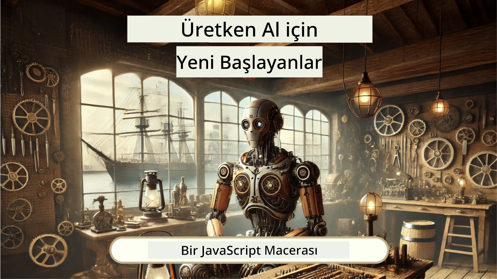
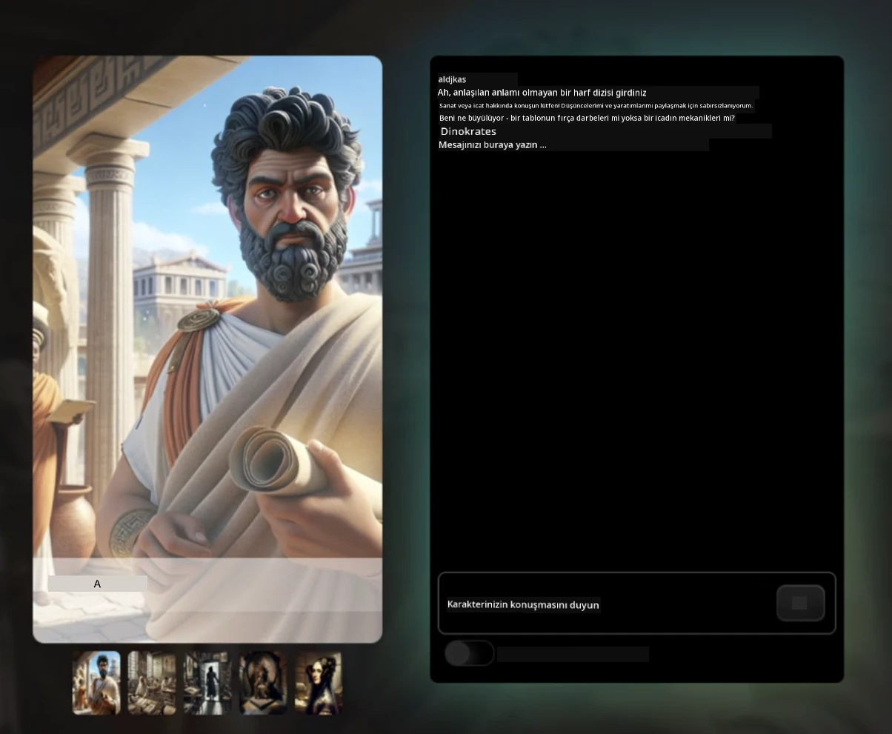
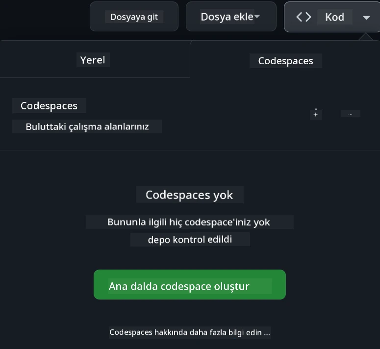

[](https://github.com/microsoft/Web-Dev-For-Beginners/blob/master/LICENSE)
[](https://GitHub.com/microsoft/Web-Dev-For-Beginners/graphs/contributors/)
[](https://GitHub.com/microsoft/Web-Dev-For-Beginners/issues/)
[](https://GitHub.com/microsoft/Web-Dev-For-Beginners/pulls/)
[](http://makeapullrequest.com) 

[](https://GitHub.com/microsoft/Web-Dev-For-Beginners/watchers/)
[](https://GitHub.com/microsoft/Web-Dev-For-Beginners/network/)
[](https://GitHub.com/microsoft/Web-Dev-For-Beginners/stargazers/)

[](https://discord.gg/nTYy5BXMWG)

# Yeni Başlayanlar için Web Geliştirme - Bir Müfredat

Microsoft Cloud Advocates tarafından sunulan 12 haftalık kapsamlı kursumuzla web geliştirme temellerini öğrenin. 24 dersin her biri, terraryumlar, tarayıcı uzantıları ve uzay oyunları gibi uygulamalı projeler aracılığıyla JavaScript, CSS ve HTML konularına derinlemesine dalıyor. Quizlere, tartışmalara ve pratik ödevlere katılın. Yeteneklerinizi geliştirin ve etkili proje tabanlı pedagojimizle bilgi tutma becerinizi optimize edin. Kodlama yolculuğunuza bugün başlayın!

Azure AI Foundry Discord'a katılın ve uzmanlar ile diğer geliştiricilerle tanışın.

[](https://discord.gg/nTYy5BXMWG)

Bu kaynakları kullanmaya başlamak için şu adımları izleyin:
1. **Depoyu Forklayın**: Tıklayın [](https://GitHub.com/microsoft/Web-Dev-For-Beginners/fork)
2. **Depoyu Klonlayın**:   `git clone https://github.com/microsoft/Web-Dev-For-Beginners.git`
3. [**Azure AI Foundry Discord'a Katılın ve uzmanlar ile diğer geliştiricilerle tanışın**](https://discord.com/invite/ByRwuEEgH4)

### 🌐 Çok Dilli Destek

#### GitHub Action ile Desteklenmektedir (Otomatik ve Her Zaman Güncel)

<!-- CO-OP TRANSLATOR LANGUAGES TABLE START -->
[Arabic](../ar/README.md) | [Bengali](../bn/README.md) | [Bulgarian](../bg/README.md) | [Burmese (Myanmar)](../my/README.md) | [Chinese (Simplified)](../zh-CN/README.md) | [Chinese (Traditional, Hong Kong)](../zh-HK/README.md) | [Chinese (Traditional, Macau)](../zh-MO/README.md) | [Chinese (Traditional, Taiwan)](../zh-TW/README.md) | [Croatian](../hr/README.md) | [Czech](../cs/README.md) | [Danish](../da/README.md) | [Dutch](../nl/README.md) | [Estonian](../et/README.md) | [Finnish](../fi/README.md) | [French](../fr/README.md) | [German](../de/README.md) | [Greek](../el/README.md) | [Hebrew](../he/README.md) | [Hindi](../hi/README.md) | [Hungarian](../hu/README.md) | [Indonesian](../id/README.md) | [Italian](../it/README.md) | [Japanese](../ja/README.md) | [Kannada](../kn/README.md) | [Khmer](../km/README.md) | [Korean](../ko/README.md) | [Lithuanian](../lt/README.md) | [Malay](../ms/README.md) | [Malayalam](../ml/README.md) | [Marathi](../mr/README.md) | [Nepali](../ne/README.md) | [Nigerian Pidgin](../pcm/README.md) | [Norwegian](../no/README.md) | [Persian (Farsi)](../fa/README.md) | [Polish](../pl/README.md) | [Portuguese (Brazil)](../pt-BR/README.md) | [Portuguese (Portugal)](../pt-PT/README.md) | [Punjabi (Gurmukhi)](../pa/README.md) | [Romanian](../ro/README.md) | [Russian](../ru/README.md) | [Serbian (Cyrillic)](../sr/README.md) | [Slovak](../sk/README.md) | [Slovenian](../sl/README.md) | [Spanish](../es/README.md) | [Swahili](../sw/README.md) | [Swedish](../sv/README.md) | [Tagalog (Filipino)](../tl/README.md) | [Tamil](../ta/README.md) | [Telugu](../te/README.md) | [Thai](../th/README.md) | [Turkish](./README.md) | [Ukrainian](../uk/README.md) | [Urdu](../ur/README.md) | [Vietnamese](../vi/README.md)

> **Yerel olarak Klonlamayı Tercih Ediyor musunuz?**
>
> Bu depo, indirme boyutunu önemli ölçüde artıran 50'den fazla dil çevirisini içerir. Çeviri olmadan klonlamak için sparse checkout kullanın:
>
> **Bash / macOS / Linux:**
> ```bash
> git clone --filter=blob:none --sparse https://github.com/microsoft/Web-Dev-For-Beginners.git
> cd Web-Dev-For-Beginners
> git sparse-checkout set --no-cone '/*' '!translations' '!translated_images'
> ```
>
> **CMD (Windows):**
> ```cmd
> git clone --filter=blob:none --sparse https://github.com/microsoft/Web-Dev-For-Beginners.git
> cd Web-Dev-For-Beginners
> git sparse-checkout set --no-cone "/*" "!translations" "!translated_images"
> ```
>
> Bu size kursu tamamlamak için ihtiyacınız olan her şeyi çok daha hızlı bir indirme ile sağlar.
<!-- CO-OP TRANSLATOR LANGUAGES TABLE END -->

**Ek çeviriler isterseniz, desteklenen diller burada listelenmiştir. [here](https://github.com/Azure/co-op-translator/blob/main/getting_started/supported-languages.md)**

[](https://open.vscode.dev/microsoft/Web-Dev-For-Beginners)

#### 🧑‍🎓 _Öğrenci misiniz?_

Yeni başlayan kaynakları, Öğrenci paketlerini ve hatta ücretsiz sertifika kuponu almanın yollarını bulabileceğiniz [**Öğrenci Merkezi sayfasını**](https://docs.microsoft.com/learn/student-hub/?WT.mc_id=academic-77807-sagibbon) ziyaret edin. Bu sayfayı yer imlerinize eklemenizi ve içeriği aylık olarak yenilediğimiz için zaman zaman kontrol etmenizi öneririz.

### 📣 Duyuru - Yeni GitHub Copilot Agent modlu tamamlanacak zorluklar!

Yeni Zorluk eklendi, çoğu bölümde "GitHub Copilot Agent Challenge 🚀" arayın. Bu, GitHub Copilot ve Agent modu kullanarak tamamlayacağınız yeni bir zorluk. Agent modunu daha önce kullanmadıysanız, yalnızca metin oluşturmakla kalmayıp, dosyalar oluşturabilir, düzenleyebilir, komutlar çalıştırabilir ve daha fazlasını yapabilir.

### 📣 Duyuru - _Generative AI kullanarak yeni proje_

Yeni AI Asistan projesi eklendi, buradan inceleyin [project](./9-chat-project/README.md)

### 📣 Duyuru - _Generative AI için yeni Müfredat_ JavaScript

Yeni Generative AI müfredatımızı kaçırmayın!

Başlamak için ziyaret edin: [https://aka.ms/genai-js-course](https://aka.ms/genai-js-course)



- Temelden RAG'e kadar her şeyi kapsayan dersler.
- GenAI ve eşlik eden uygulamamızla tarihi karakterlerle etkileşimde bulunun.
- Eğlenceli ve sürükleyici anlatı, zaman yolculuğu yapacaksınız!




Her ders tamamlamanız için bir ödev, bir bilgi kontrolü ve şu konuları öğrenirken size rehberlik edecek bir zorluk içerir:
- Prompt oluşturma ve prompt mühendisliği
- Metin ve görsel uygulama üretimi
- Arama uygulamaları

Başlamak için ziyaret edin: [https://aka.ms/genai-js-course](https://aka.ms/genai-js-course)


## 🌱 Başlarken

> **Öğretmenler**, bu müfredatı nasıl kullanacağınıza dair [bazı önerileri](for-teachers.md) dahil ettik. Geri bildirimlerinizi [tartışma forumumuzda](https://github.com/microsoft/Web-Dev-For-Beginners/discussions/categories/teacher-corner) bekliyoruz!

**[Öğrenciler](https://aka.ms/student-page/?WT.mc_id=academic-77807-sagibbon)**, her ders için önce ön ders quizine başlayın, ardından ders materyalini okuyup çeşitli aktiviteleri tamamlayın ve ders sonrası quizle anlama seviyenizi kontrol edin.

Öğrenme deneyiminizi geliştirmek için, projeler üzerinde birlikte çalışmak üzere akranlarınızla bağlantı kurun! Tartışmalar, moderatör ekibimizin sorularınızı yanıtlamak için hazır olduğu [tartışma forumumuzda](https://github.com/microsoft/Web-Dev-For-Beginners/discussions) teşvik edilir.

Eğitiminizi daha da ilerletmek için, ek çalışma materyalleri için [Microsoft Learn'i](https://learn.microsoft.com/users/wirelesslife/collections/p1ddcy5jwy0jkm?WT.mc_id=academic-77807-sagibbon) keşfetmenizi şiddetle tavsiye ederiz.

### 📋 Ortamınızı Kurma

Bu müfredat için hazır bir geliştirme ortamı bulunmaktadır! Başlarken kursu [Codespace](https://github.com/features/codespaces/) (tarayıcı tabanlı, kurulum gerektirmeyen bir ortam) içinde veya bir metin editörü kullanarak yerel bilgisayarınızda örneğin [Visual Studio Code](https://code.visualstudio.com/?WT.mc_id=academic-77807-sagibbon) üzerinde çalıştırmayı seçebilirsiniz.

#### Depo oluşturun
Çalışmanızı kolayca kaydedebilmeniz için, bu deponun kendi kopyanızı oluşturmanız önerilir. Bunu sayfanın üstündeki **Use this template** butonuna tıklayarak yapabilirsiniz. Bu, GitHub hesabınızda müfredatın bir kopyasıyla yeni bir depo oluşturur.

Şu adımları izleyin:
1. **Depoyu Forklayın**: Bu sayfanın sağ üst köşesindeki "Fork" butonuna tıklayın.
2. **Depoyu Klonlayın**:   `git clone https://github.com/microsoft/Web-Dev-For-Beginners.git`

#### Müfredatı bir Codespace içinde çalıştırmak

Oluşturduğunuz bu deponuzda, **Code** butonuna tıklayın ve **Open with Codespaces**'i seçin. Bu, üzerinde çalışmanız için yeni bir Codespace oluşturacaktır.



#### Müfredatı bilgisayarınızda yerel olarak çalıştırmak

Bu müfredatı yerel bilgisayarınızda çalıştırmak için bir metin editörü, bir tarayıcı ve bir komut satırı aracına ihtiyacınız olacak. İlk dersimiz, [Programlama Dillerine ve Ticaret Araçlarına Giriş](../../1-getting-started-lessons/1-intro-to-programming-languages), size her bir araç için çeşitli seçenekleri tanıtacak ve sizin için en iyisini seçmenize yardımcı olacak.

Önerimiz, editör olarak entegre bir [Terminal](https://code.visualstudio.com/docs/terminal/basics/?WT.mc_id=academic-77807-sagibbon) de sunan [Visual Studio Code](https://code.visualstudio.com/?WT.mc_id=academic-77807-sagibbon) kullanmanızdır. Visual Studio Code'u [buradan](https://code.visualstudio.com/?WT.mc_id=academic-77807-sagibbon) indirebilirsiniz.
1. Depo'nuzu bilgisayarınıza klonlayın. Bunu yapmak için **Code** butonuna tıklayıp URL'yi kopyalayabilirsiniz:

    [CodeSpace](./images/createcodespace.png)

    Ardından, [Visual Studio Code](https://code.visualstudio.com/?WT.mc_id=academic-77807-sagibbon) içinde [Terminal](https://code.visualstudio.com/docs/terminal/basics/?WT.mc_id=academic-77807-sagibbon) açın ve şu komutu, `<your-repository-url>` kısmını az önce kopyaladığınız URL ile değiştirerek çalıştırın:

    ```bash 
    git clone <your-repository-url>
    ```

2. Klasörü Visual Studio Code'da açın. Bunu yapmak için **File** > **Open Folder** seçeneğine tıklayıp az önce klonladığınız klasörü seçin.


>  Önerilen Visual Studio Code eklentileri:
>
> * [Live Server](https://marketplace.visualstudio.com/items?itemName=ritwickdey.LiveServer&WT.mc_id=academic-77807-sagibbon) - HTML sayfalarını Visual Studio Code içinde önizlemek için
> * [Copilot](https://marketplace.visualstudio.com/items?itemName=GitHub.copilot&WT.mc_id=academic-77807-sagibbon) - kod yazmanızı hızlandırmak için yardımcı

## 📂 Her ders şunları içerir:

- isteğe bağlı sketchnote (not alma görseli)
- isteğe bağlı destekleyici video
- derse hazırlık testi
- yazılı ders
- proje tabanlı derslerde, projeyi adım adım oluşturma rehberleri
- bilgi kontrolü
- bir meydan okuma
- destekleyici okumalar
- ödev
- [ders sonrası quiz](https://ff-quizzes.netlify.app/web/)

> **Quizler hakkında bir not**: Tüm quizler Quiz-app klasöründe yer almakta olup, toplam 48 tane, her biri üç sorudan oluşur. [Buradan](https://ff-quizzes.netlify.app/web/) erişilebilir. Quiz uygulaması yerelde çalıştırılabilir veya Azure üzerine dağıtılabilir; `quiz-app` klasöründeki talimatları izleyin.

## 🗃️ Dersler

|     |                       Proje Adı                        |                           Öğretilen Kavramlar                             | Öğrenme Hedefleri                                                                                                                   |                                                         İlgili Ders                                                          |         Yazar          |
| :-: | :----------------------------------------------------: | :-------------------------------------------------------------------------: | ---------------------------------------------------------------------------------------------------------------------------------- | :----------------------------------------------------------------------------------------------------------------------------: | :--------------------: |
| 01  |                     Başlarken                          |           Programlamaya ve Araçlara Giriş                                  | Çoğu programlama dilinin temelini öğrenmek ve profesyonel geliştiricilere yardımcı olan yazılımlar hakkında bilgi edinmek          | [Programlama Dilleri ve Araçlarına Giriş](./1-getting-started-lessons/1-intro-to-programming-languages/README.md)              |         Jasmine        |
| 02  |                     Başlarken                          |             GitHub Temelleri, ekip ile çalışma                            | Projede GitHub nasıl kullanılır, kod tabanında başkalarıyla nasıl iş birliği yapılır                                              |                            [GitHub'a Giriş](./1-getting-started-lessons/2-github-basics/README.md)                              |          Floor         |
| 03  |                     Başlarken                          |                             Erişilebilirlik                                | Web erişilebilirliğinin temellerini öğrenmek                                                                                        |                       [Erişilebilirlik Temelleri](./1-getting-started-lessons/3-accessibility/README.md)                       |       Christopher      |
| 04  |                      JS Temelleri                      |                         JavaScript Veri Tipleri                           | JavaScript veri tiplerinin temelleri                                                                                               |                                       [Veri Tipleri](./2-js-basics/1-data-types/README.md)                                        |         Jasmine        |
| 05  |                      JS Temelleri                      |                         Fonksiyonlar ve Metodlar                          | Uygulamanın mantık akışını yönetmek için fonksiyonlar ve metodlar hakkında bilgi edinmek                                          |                              [Fonksiyonlar ve Metodlar](./2-js-basics/2-functions-methods/README.md)                             | Jasmine ve Christopher |
| 06  |                      JS Temelleri                      |                        JS ile Karar Verme                                 | Kodunuzda karar verme yöntemleri kullanarak koşullar oluşturmayı öğrenmek                                                         |                                 [Karar Verme](./2-js-basics/3-making-decisions/README.md)                                     |         Jasmine        |
| 07  |                      JS Temelleri                      |                         Diziler ve Döngüler                              | JavaScript'te diziler ve döngülerle veri üzerinde çalışma                                                                         |                                   [Diziler ve Döngüler](./2-js-basics/4-arrays-loops/README.md)                                |         Jasmine        |
| 08  |       [Terrarium](./3-terrarium/solution/README.md)   |                           HTML Uygulaması                                | Çevrimiçi bir teraryum oluşturmak için HTML oluşturma; düzen yapmaya odaklanma                                                    |                                 [HTML Tanıtımı](./3-terrarium/1-intro-to-html/README.md)                                      |           Jen          |
| 09  |       [Terrarium](./3-terrarium/solution/README.md)   |                            CSS Uygulaması                                 | Çevrimiçi teraryumu stilize etmek için CSS oluşturma; temel CSS ve sayfanın duyarlı olmasına odaklanma                             |                                  [CSS Tanıtımı](./3-terrarium/2-intro-to-css/README.md)                                       |           Jen          |
| 10  |            [Terrarium](./3-terrarium/solution/README.md) |                 JavaScript Kapanışları, DOM manipülasyonu               | Teraryumun sürükle-bırak arayüzü oluşturmak için JavaScript yazma; kapanışlar ve DOM manipülasyonuna odaklanma                     |                       [JavaScript Kapanışları, DOM manipülasyonu](./3-terrarium/3-intro-to-DOM-and-closures/README.md)         |           Jen          |
| 11  |          [Yazma Oyunu](./4-typing-game/solution/README.md) |                        Yazma Oyunu Geliştirme                            | Klavye olaylarını kullanarak JavaScript uygulamanızın mantığını sürdürmeyi öğrenin                                               |                                [Olay Tabanlı Programlama](./4-typing-game/typing-game/README.md)                               |       Christopher      |
| 12  | [Yeşil Tarayıcı Eklentisi](./5-browser-extension/solution/README.md) |                       Tarayıcılarla Çalışma                               | Tarayıcıların nasıl çalıştığını, tarihçesini öğrenmek ve bir tarayıcı eklentisi ilk öğelerini oluşturmak                           |                               [Tarayıcılar Hakkında](./5-browser-extension/1-about-browsers/README.md)                        |           Jen          |
| 13  | [Yeşil Tarayıcı Eklentisi](./5-browser-extension/solution/README.md) | Form oluşturma, API çağrısı ve yerel depolamada değişkenler             | Tarayıcı eklentinizde API çağırmak için JavaScript ile yerel depolamada değişken kullanımı                                         |               [API'ler, Formlar ve Yerel Depolama](./5-browser-extension/2-forms-browsers-local-storage/README.md)             |           Jen          |
| 14  | [Yeşil Tarayıcı Eklentisi](./5-browser-extension/solution/README.md) | Tarayıcıda arka plan işlemleri, web performansı                         | Eklentinin simgesi için tarayıcı arka plan işlemlerini kullanmak; web performansı ve bazı optimizasyonları öğrenmek                 |             [Arka Plan Görevleri ve Performans](./5-browser-extension/3-background-tasks-and-performance/README.md)            |           Jen          |
| 15  |           [Uzay Oyunu](./6-space-game/solution/README.md) |              JavaScript ile Daha İleri Oyun Geliştirme                  | Kalıtım, Sınıflar ve Kompozisyon ile Pub/Sub desenini öğrenmek; oyun oluşturma hazırlığı                                            |                      [İleri Seviye Oyun Geliştirmeye Giriş](./6-space-game/1-introduction/README.md)                           |          Chris         |
| 16  |           [Uzay Oyunu](./6-space-game/solution/README.md) |                                 Canvas ile Çizim                         | Ekrana çizim yapmak için kullanılan Canvas API'si hakkında bilgi edinmek                                                          |                                [Canvas üzerine çizim](./6-space-game/2-drawing-to-canvas/README.md)                              |          Chris         |
| 17  |           [Uzay Oyunu](./6-space-game/solution/README.md) |                             Ekranda öğeleri hareket ettirme              | Katı merkezli koordinatlar ve Canvas API kullanarak öğeleri hareket ettirmeyi keşfetme                                             |                           [Öğeleri hareket ettirme](./6-space-game/3-moving-elements-around/README.md)                         |          Chris         |
| 18  |           [Uzay Oyunu](./6-space-game/solution/README.md) |                              Çarpışma tespiti                           | Öğelerin birbirine çarpmasını ve tepki vermesini sağlama; performans için bir bekleme fonksiyonu ekleme                            |                              [Çarpışma Tespiti](./6-space-game/4-collision-detection/README.md)                              |          Chris         |
| 19  |           [Uzay Oyunu](./6-space-game/solution/README.md) |                              Skor Tutma                                 | Oyunun durumu ve performansına göre matematiksel hesaplamalar yapmak                                                               |                                    [Skor Tutma](./6-space-game/5-keeping-score/README.md)                                  |          Chris         |
| 20  |           [Uzay Oyunu](./6-space-game/solution/README.md) |                         Oyunu bitirme ve yeniden başlatma               | Oyunu bitirme ve yeniden başlatma, varlıkları temizleme ve değişken değerlerini sıfırlama hakkında bilgi edinmek                   |                                [Bitiş Koşulu](./6-space-game/6-end-condition/README.md)                                    |          Chris         |
| 21  |         [Banka Uygulaması](./7-bank-project/solution/README.md) |                 Web Uygulamasında HTML Şablonları ve Yönlendirmeler      | Çok sayfalı bir web sitesinin iskeletini oluşturmayı, yönlendirme ve HTML şablonları kullanmayı öğrenmek                           |                            [HTML Şablonları ve Yönlendirme](./7-bank-project/1-template-route/README.md)                       |          Yohan         |
| 22  |         [Banka Uygulaması](./7-bank-project/solution/README.md) |                  Giriş ve Kayıt Formu Oluşturma                         | Form oluşturma ve doğrulama işlemleri hakkında bilgi edinmek                                                                        |                                           [Formlar](./7-bank-project/2-forms/README.md)                                       |          Yohan         |
| 23  |         [Banka Uygulaması](./7-bank-project/solution/README.md) |                   Veri Alma ve Kullanma Yöntemleri                      | Uygulamanıza veri akışı, veriyi alma, saklama ve atma hakkında bilgi edinmek                                                       |                                            [Veri](./7-bank-project/3-data/README.md)                                        |          Yohan         |
| 24  |         [Banka Uygulaması](./7-bank-project/solution/README.md) |                      Durum Yönetimi Kavramları                         | Uygulamanızın durumu nasıl tuttuğunu ve programatik olarak nasıl yönetildiğini öğrenmek                                            |                                [Durum Yönetimi](./7-bank-project/4-state-management/README.md)                                |          Yohan         |
| 25  | [Tarayıcı / VScode Kodu](../../8-code-editor)              | VScode ile Çalışma                                                      | Bir kod editörü kullanmayı öğrenin                                                                                                | [VScode Kodu Editörü Kullanımı](./8-code-editor/1-using-a-code-editor/README.md)                                            | Chris                  |
| 26  | [AI Asistanları](./9-chat-project/README.md)           | AI ile Çalışma                                                         | Kendi AI asistanınızı nasıl oluşturacağınızı öğrenin                                                                               | [AI Asistan Projesi](./9-chat-project/README.md)                                                                            | Chris                  |

## 🏫 Eğitim Yaklaşımı

Müfredatımız, iki temel pedagojik ilke üzerine tasarlanmıştır:
* proje tabanlı öğrenme
* sık quizler

Program, JavaScript, HTML ve CSS temellerinin yanı sıra çağdaş web geliştiricilerinin kullandığı en yeni araçlar ve teknikleri öğretir. Öğrenciler, yazma oyunu, sanal teraryum, çevre dostu tarayıcı eklentisi, uzay istilacı tarzı oyun ve işletmeler için banka uygulaması geliştirme gibi pratik deneyim kazanma fırsatı bulacaklar. Serinin sonunda öğrenciler web geliştirme konusunda sağlam bir anlayışa sahip olacaklar.

> 🎓 Bu müfredatın ilk birkaç dersini Microsoft Learn üzerinde bir [Öğrenme Yolu](https://docs.microsoft.com/learn/paths/web-development-101/?WT.mc_id=academic-77807-sagibbon) olarak alabilirsiniz!

İçeriğin projelerle uyumlu olması, öğrencilerin sürece daha fazla dahil olmasını sağlar ve kavramların kalıcılığı artırılır. Ayrıca kavramları tanıtmak için JavaScript temellerinde birkaç başlangıç dersi yazdık ve video tutorial koleksiyonu "[Beginners Series to: JavaScript](https://channel9.msdn.com/Series/Beginners-Series-to-JavaScript/?WT.mc_id=academic-77807-sagibbon)" ile eşleştirdik; bazı yazarları bu müfredata katkıda bulunmuştur.

Ek olarak, sınıftan önce düşük riskli bir quiz öğrencinin konuyu öğrenmeye niyetini belirlerken, sınıftan sonra ikinci quiz kavramların daha iyi pekişmesini sağlar. Bu müfredat esnek ve eğlenceli olacak şekilde tasarlanmıştır ve tamamen veya kısmen alınabilir. Projeler küçük başlar ve 12 haftalık döngü sonunda giderek karmaşık hale gelir.

JavaScript frameworkleri tanıtmayı bilinçli olarak erteledik çünkü temel web geliştirici becerilerini edinmek framework kullanmadan önce önemlidir. Bu müfredatı tamamlamak için iyi bir sonraki adım, "[Beginner Series to: Node.js](https://channel9.msdn.com/Series/Beginners-Series-to-Nodejs/?WT.mc_id=academic-77807-sagibbon)" video koleksiyonu ile Node.js öğrenmek olacaktır.

> [Davranış Kurallarımızı](CODE_OF_CONDUCT.md) ve [Katkıda Bulunma](CONTRIBUTING.md) yönergelerimizi ziyaret edin. Yapıcı geri bildirimlerinizi memnuniyetle karşılıyoruz!


## 🧭 Çevrimdışı erişim

Bu dökümantasyonu çevrimdışı kullanmak için [Docsify](https://docsify.js.org/#/) kullanabilirsiniz. Bu repoyu çatallayın, yerel makinenize [Docsify yükleyin](https://docsify.js.org/#/quickstart) ve ardından bu repodaki ana klasörde `docsify serve` komutunu yazın. Site localhost üzerinde 3000 portundan erişilebilir olacaktır: `localhost:3000`.

## 📘 PDF
Tüm derslerin PDF'sine [buradan](https://microsoft.github.io/Web-Dev-For-Beginners/pdf/readme.pdf) ulaşılabilir.


## 🎒 Diğer Kurslar

Ekibimiz diğer kurslar da üretiyor! Göz atın:

<!-- CO-OP TRANSLATOR OTHER COURSES START -->
### LangChain
[](https://aka.ms/langchain4j-for-beginners)
[](https://aka.ms/langchainjs-for-beginners?WT.mc_id=m365-94501-dwahlin)
[](https://github.com/microsoft/langchain-for-beginners?WT.mc_id=m365-94501-dwahlin)
---

### Azure / Edge / MCP / Agents
[](https://github.com/microsoft/AZD-for-beginners?WT.mc_id=academic-105485-koreyst)
[](https://github.com/microsoft/edgeai-for-beginners?WT.mc_id=academic-105485-koreyst)
[](https://github.com/microsoft/mcp-for-beginners?WT.mc_id=academic-105485-koreyst)
[](https://github.com/microsoft/ai-agents-for-beginners?WT.mc_id=academic-105485-koreyst)

---
 
### Generative AI Serisi
[](https://github.com/microsoft/generative-ai-for-beginners?WT.mc_id=academic-105485-koreyst)
[-9333EA?style=for-the-badge&labelColor=E5E7EB&color=9333EA)](https://github.com/microsoft/Generative-AI-for-beginners-dotnet?WT.mc_id=academic-105485-koreyst)
[-C084FC?style=for-the-badge&labelColor=E5E7EB&color=C084FC)](https://github.com/microsoft/generative-ai-for-beginners-java?WT.mc_id=academic-105485-koreyst)
[-E879F9?style=for-the-badge&labelColor=E5E7EB&color=E879F9)](https://github.com/microsoft/generative-ai-with-javascript?WT.mc_id=academic-105485-koreyst)

---
 
### Temel Öğrenme
[](https://aka.ms/ml-beginners?WT.mc_id=academic-105485-koreyst)
[](https://aka.ms/datascience-beginners?WT.mc_id=academic-105485-koreyst)
[](https://aka.ms/ai-beginners?WT.mc_id=academic-105485-koreyst)
[](https://github.com/microsoft/Security-101?WT.mc_id=academic-96948-sayoung)
[](https://aka.ms/webdev-beginners?WT.mc_id=academic-105485-koreyst)
[](https://aka.ms/iot-beginners?WT.mc_id=academic-105485-koreyst)
[](https://github.com/microsoft/xr-development-for-beginners?WT.mc_id=academic-105485-koreyst)

---
 
### Copilot Serisi
[](https://aka.ms/GitHubCopilotAI?WT.mc_id=academic-105485-koreyst)
[](https://github.com/microsoft/mastering-github-copilot-for-dotnet-csharp-developers?WT.mc_id=academic-105485-koreyst)
[](https://github.com/microsoft/CopilotAdventures?WT.mc_id=academic-105485-koreyst)
<!-- CO-OP TRANSLATOR OTHER COURSES END -->

## Yardım Alma

Eğer takılırsanız ya da AI uygulamaları geliştirme konusunda sorularınız olursa. MCP hakkında tartışmalara katılmak için diğer öğrenenlerle ve deneyimli geliştiricilerle buluşun. Soruların hoş karşılandığı ve bilginin özgürce paylaşıldığı destekleyici bir topluluktur.

[](https://discord.gg/nTYy5BXMWG)

Ürün geri bildiriminiz veya oluşan hatalar için lütfen ziyaret edin:

[](https://aka.ms/foundry/forum)

## Lisans

Bu depo MIT lisansı altında lisanslanmıştır. Daha fazla bilgi için [LICENSE](../../LICENSE) dosyasına bakın.

---

<!-- CO-OP TRANSLATOR DISCLAIMER START -->
**Feragatname**:  
Bu belge, AI çeviri hizmeti [Co-op Translator](https://github.com/Azure/co-op-translator) kullanılarak çevrilmiştir. Doğruluk için çaba göstersek de, otomatik çevirilerin hata veya yanlışlık içerebileceğini lütfen unutmayın. Orijinal belge, kendi dilinde yetkili kaynak olarak kabul edilmelidir. Kritik bilgiler için profesyonel insan çevirisi tavsiye edilir. Bu çevirinin kullanımı sonucu ortaya çıkabilecek yanlış anlamalar veya hatalı yorumlamalar için sorumluluk kabul edilmemektedir.
<!-- CO-OP TRANSLATOR DISCLAIMER END -->