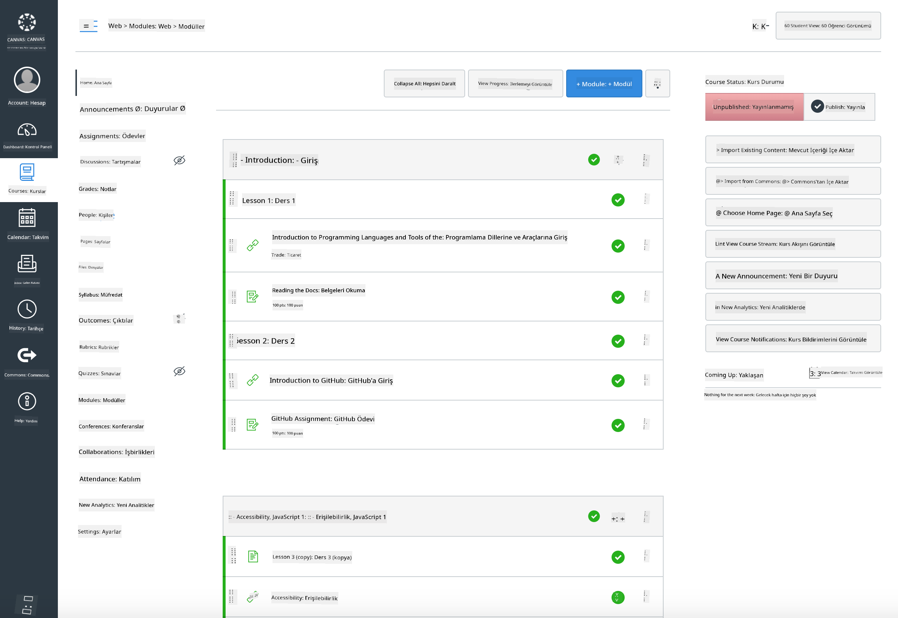

<!--
CO_OP_TRANSLATOR_METADATA:
{
  "original_hash": "71009af209f81cc01a1f2d324200375f",
  "translation_date": "2025-10-03T09:41:56+00:00",
  "source_file": "for-teachers.md",
  "language_code": "tr"
}
-->
### Eğitimciler İçin

Bu müfredatı sınıfınızda kullanabilirsiniz. GitHub Classroom ve önde gelen LMS platformlarıyla sorunsuz bir şekilde çalışır ve öğrencilerinizle bağımsız bir depo olarak da kullanılabilir.

### GitHub Classroom ile Kullanım

Dersleri ve ödevleri her grup için yönetmek için, her ders için bir depo oluşturun, böylece GitHub Classroom her ödevi bağımsız olarak bağlayabilir.

- Bu depoyu organizasyonunuza çatallayın.
- Her ders için ayrı bir depo oluşturun; her ders klasörünü kendi deposuna ayırın.
  - Seçenek A: Her ders için boş depolar oluşturun ve ders klasörü içeriğini her birine kopyalayın.
  - Seçenek B: Geçmişi koruyan bir Git yaklaşımı kullanın (örneğin, bir klasörü yeni bir depoya ayırmak) eğer geçmişe ihtiyacınız varsa.
- GitHub Classroom'da, her ders için bir ödev oluşturun ve ilgili ders deposuna yönlendirin.
- Önerilen ayarlar:
  - Depo görünürlüğü: Öğrenci çalışmaları için özel.
  - Ders deposunun varsayılan dalından başlangıç kodu kullanın.
  - Quizler ve gönderimler için sorun ve çekme isteği şablonları ekleyin.
  - Derslerinizde otomatik değerlendirme ve testler varsa, isteğe bağlı olarak yapılandırın.
- Yardımcı olabilecek kurallar:
  - Depo adları: lesson-01-intro, lesson-02-html, vb.
  - Etiketler: quiz, assignment, needs-review, late, resubmission.
  - Her grup için etiketler/sürümler (örneğin, v2025-term1).

İpucu: Git çatışmalarını önlemek için depoları senkronize edilmiş klasörlerde (örneğin, OneDrive/Google Drive) saklamaktan kaçının.

### Moodle, Canvas veya Blackboard ile Kullanım

Bu müfredat, yaygın LMS iş akışları için içe aktarılabilir paketler içerir.

- Moodle: Tam kursu yüklemek için [Moodle yükleme dosyasını](../../../../../../../teaching-files/webdev-moodle.mbz) kullanın.
- Common Cartridge: Daha geniş LMS uyumluluğu için [Common Cartridge dosyasını](../../../../../../../teaching-files/webdev-common-cartridge.imscc) kullanın.
- Notlar:
  - Moodle Cloud, Common Cartridge desteği sınırlıdır. Yukarıdaki Moodle dosyasını tercih edin; bu dosya ayrıca Canvas'a da yüklenebilir.
  - İçe aktarma işleminden sonra modülleri, teslim tarihlerini ve quiz ayarlarını dönem programınıza uygun şekilde gözden geçirin.

> Moodle sınıfında müfredat

> Canvas'ta müfredat

### Depoyu Doğrudan Kullanma (Classroom Olmadan)

GitHub Classroom kullanmamayı tercih ederseniz, kursu doğrudan bu depodan yürütebilirsiniz.

- Senkron/çevrimiçi formatlar (Zoom/Teams):
  - Kısa mentor liderliğinde ısınma oturumları düzenleyin; quizler için breakout odaları kullanın.
  - Quizler için bir zaman aralığı duyurun; öğrenciler yanıtlarını GitHub Issues olarak gönderir.
  - İşbirlikçi ödevler için, öğrenciler halka açık ders depolarında çalışır ve çekme istekleri açar.
- Özel/asenkron formatlar:
  - Öğrenciler her dersi kendi **özel** depolarına çatallayıp sizi işbirlikçi olarak ekler.
  - Quizler (Issues) ve ödevler (Pull Requests) için gönderimlerini sınıf deponuzda veya özel çatallarında yaparlar.

### En İyi Uygulamalar

- Git/GitHub temelleri, Issues ve PR'lar hakkında bir tanıtım dersi sağlayın.
- Çok adımlı quizler/ödevler için Issues içinde kontrol listeleri kullanın.
- Sınıf normlarını belirlemek için CONTRIBUTING.md ve CODE_OF_CONDUCT.md ekleyin.
- Erişilebilirlik notları (alt metin, altyazılar) ekleyin ve yazdırılabilir PDF'ler sunun.
- İçeriğinizi dönem bazında sürümleyin ve yayınlandıktan sonra ders depolarını dondurun.

### Geri Bildirim ve Destek

Bu müfredatın sizin ve öğrencileriniz için işe yaramasını istiyoruz. Hatalar, talepler veya iyileştirmeler için bu depoda yeni bir Issue açabilir veya Öğretmen Köşesi'nde bir tartışma başlatabilirsiniz.

---

**Feragatname**:  
Bu belge, AI çeviri hizmeti [Co-op Translator](https://github.com/Azure/co-op-translator) kullanılarak çevrilmiştir. Doğruluk için çaba göstersek de, otomatik çevirilerin hata veya yanlışlıklar içerebileceğini lütfen unutmayın. Belgenin orijinal dili, yetkili kaynak olarak kabul edilmelidir. Kritik bilgiler için profesyonel insan çevirisi önerilir. Bu çevirinin kullanımından kaynaklanan yanlış anlamalar veya yanlış yorumlamalar için sorumluluk kabul etmiyoruz.