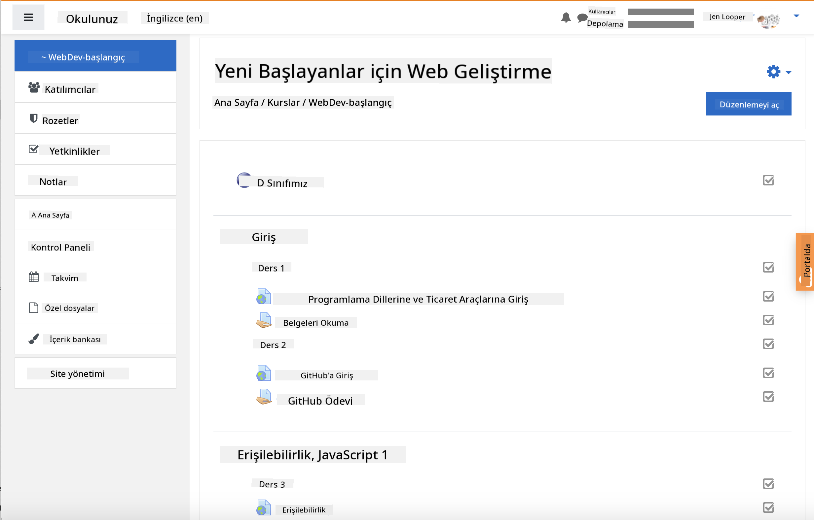

<!--
CO_OP_TRANSLATOR_METADATA:
{
  "original_hash": "75cb51f7ca9ea0b097ef4a1287e9290c",
  "translation_date": "2025-08-25T20:57:34+00:00",
  "source_file": "for-teachers.md",
  "language_code": "tr"
}
-->
## Eğitimciler İçin

Bu müfredatı sınıfınızda kullanmak ister misiniz? Lütfen çekinmeden kullanın!

Aslında, GitHub Classroom kullanarak bu müfredatı doğrudan GitHub üzerinde kullanabilirsiniz.

Bunu yapmak için, bu depoyu çatallayın. Her ders için ayrı bir depo oluşturmanız gerekecek, bu yüzden her klasörü ayrı bir depoya çıkarmanız gerekecek. Böylece, [GitHub Classroom](https://classroom.github.com/classrooms) her dersi ayrı ayrı algılayabilir.

Bu [detaylı talimatlar](https://github.blog/2020-03-18-set-up-your-digital-classroom-with-github-classroom/) sınıfınızı nasıl kuracağınız konusunda size bir fikir verecektir.

## Moodle, Canvas veya Blackboard'da Kullanımı

Bu müfredat, bu Öğrenim Yönetim Sistemlerinde gayet iyi çalışır! Tüm içerik için [Moodle yükleme dosyasını](../../../../../../../teaching-files/webdev-moodle.mbz) kullanabilir veya bazı içerikleri içeren [Common Cartridge dosyasını](../../../../../../../teaching-files/webdev-common-cartridge.imscc) deneyebilirsiniz. Moodle Cloud, tam Common Cartridge dışa aktarımlarını desteklemez, bu yüzden Canvas'a yüklenebilecek Moodle indirme dosyasını kullanmak daha uygundur. Bu deneyimi nasıl geliştirebileceğimizi bize bildirin.

> Moodle sınıfında müfredat

> Canvas'ta müfredat

## Depoyu Olduğu Gibi Kullanma

Eğer bu depoyu şu anki haliyle, GitHub Classroom kullanmadan kullanmak isterseniz, bu da mümkündür. Öğrencilerinizle hangi dersi birlikte işleyeceğinizi iletişim kurmanız gerekecek.

Çevrimiçi bir formatta (Zoom, Teams veya başka bir platform) sınavlar için gruplar oluşturabilir ve öğrencileri öğrenmeye hazırlanmaları için yönlendirebilirsiniz. Daha sonra öğrencileri sınavlara davet edebilir ve cevaplarını belirli bir zamanda 'issue' olarak göndermelerini isteyebilirsiniz. Aynı yöntemi, öğrencilerin açık bir şekilde iş birliği yapmasını istediğiniz ödevler için de uygulayabilirsiniz.

Daha özel bir format tercih ediyorsanız, öğrencilerinizden müfredatı ders ders kendi GitHub depolarına, özel depolar olarak çatallamalarını ve size erişim vermelerini isteyin. Daha sonra sınavları ve ödevleri özel olarak tamamlayabilir ve bunları sınıf deponuzdaki 'issue'lar aracılığıyla size gönderebilirler.

Çevrimiçi bir sınıf formatında bunu çalıştırmanın birçok yolu vardır. Sizin için en iyi neyin işe yaradığını bize bildirin!

## Lütfen Görüşlerinizi Bizimle Paylaşın!

Bu müfredatı sizin ve öğrencileriniz için işe yarar hale getirmek istiyoruz. [Öğretmen köşesi](https://github.com/microsoft/Web-Dev-For-Beginners/discussions/categories/teacher-corner) üzerinden bizimle iletişime geçin ve herhangi bir talep, hata veya geri bildirim için [**yeni bir issue**](https://github.com/microsoft/Web-Dev-For-Beginners/issues/new/choose) açın.

**Feragatname**:  
Bu belge, AI çeviri hizmeti [Co-op Translator](https://github.com/Azure/co-op-translator) kullanılarak çevrilmiştir. Doğruluk için çaba göstersek de, otomatik çevirilerin hata veya yanlışlıklar içerebileceğini lütfen unutmayın. Belgenin orijinal dilindeki hali, yetkili kaynak olarak kabul edilmelidir. Kritik bilgiler için profesyonel insan çevirisi önerilir. Bu çevirinin kullanımından kaynaklanan yanlış anlamalar veya yanlış yorumlamalar için sorumluluk kabul etmiyoruz.