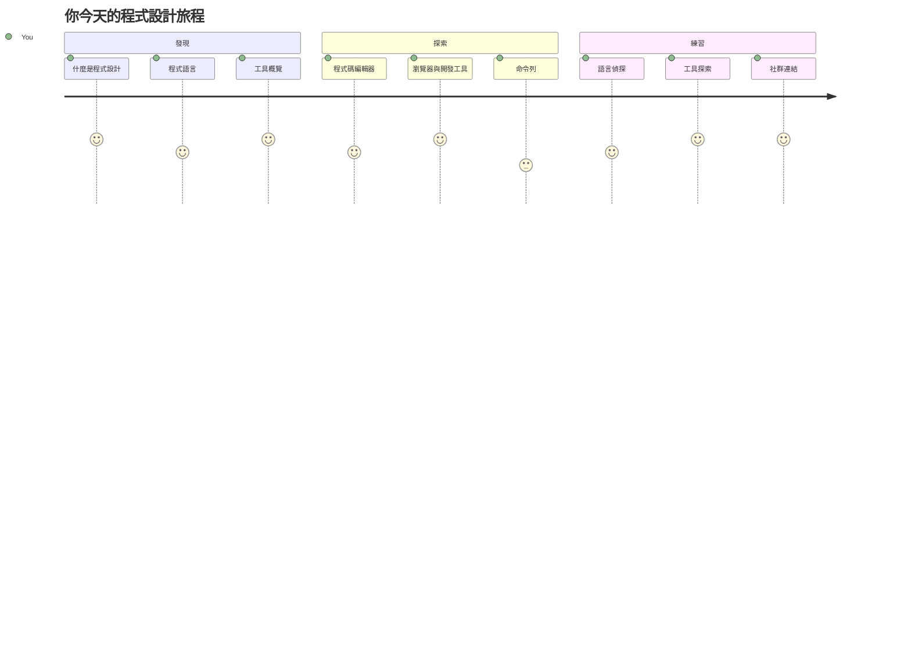
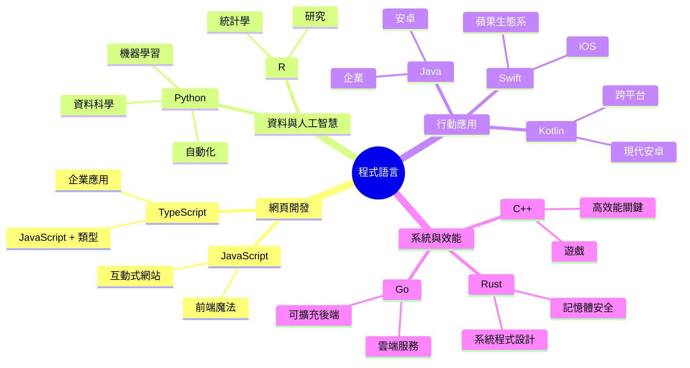
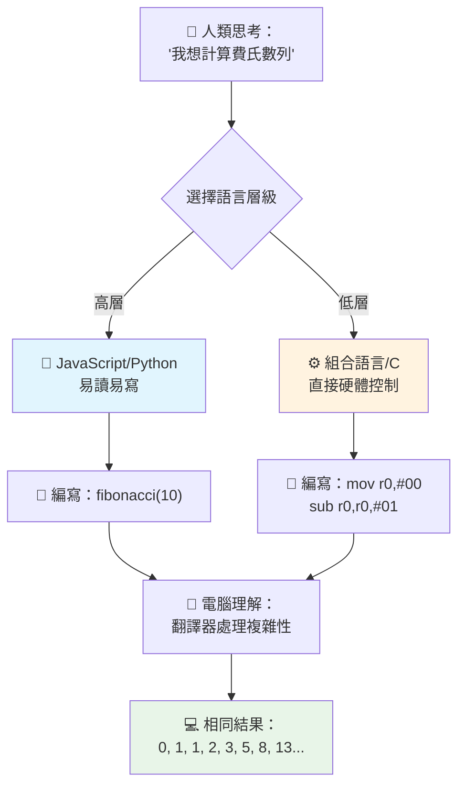
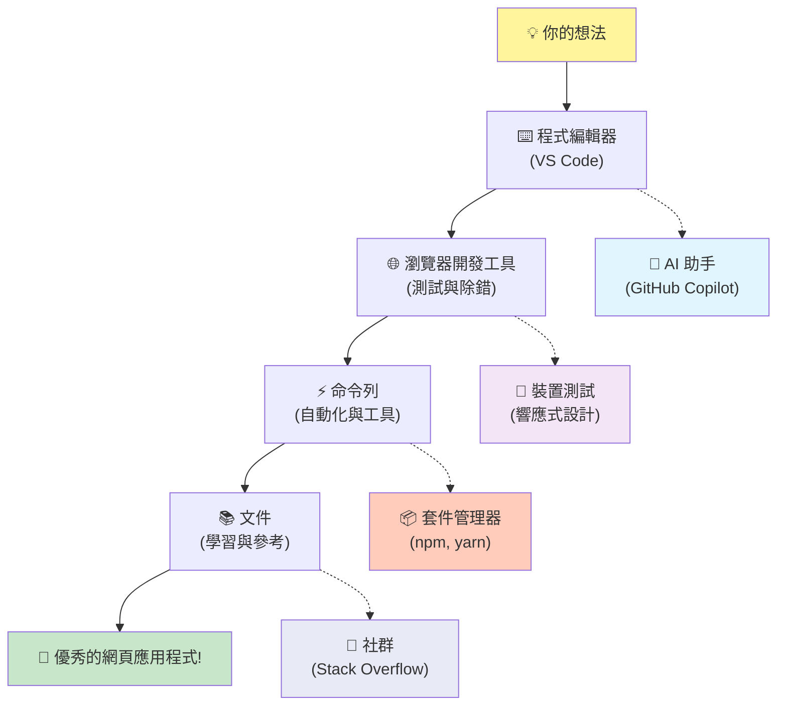
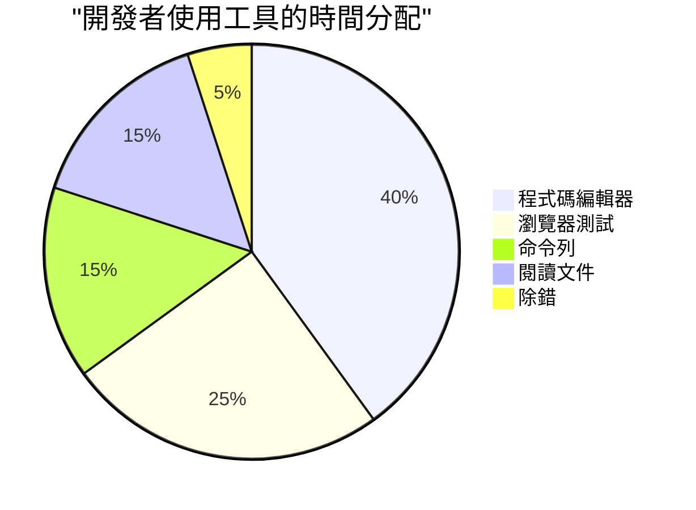
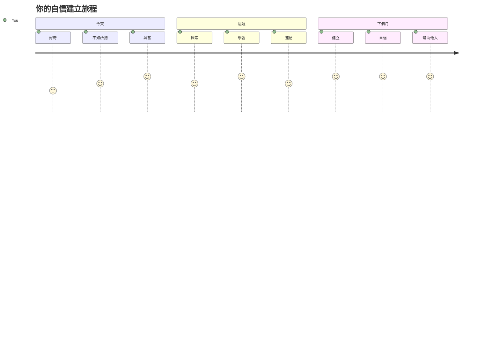

<!--
CO_OP_TRANSLATOR_METADATA:
{
  "original_hash": "d45ddcc54eb9232a76d08328b09d792e",
  "translation_date": "2026-01-06T14:23:14+00:00",
  "source_file": "1-getting-started-lessons/1-intro-to-programming-languages/README.md",
  "language_code": "tw"
}
-->
# 程式語言與現代開發者工具介紹
 
嗨，未來的開發者！👋 可以跟你說一件每天都讓我熱血沸騰的事情嗎？你將會發現程式設計不只是關於電腦，而是擁有真正超能力，把你最狂野的想法變成現實！

你知道那種使用你最喜歡的應用程式，畫面跟操作都剛剛好的時刻嗎？當你點一下按鈕，發生了某種完全神奇的事情，讓你忍不住想說「哇，他們到底是怎麼做到的？」那就是跟你一樣的人，可能凌晨兩點坐在他們最愛的咖啡店，喝著第三杯濃縮咖啡，寫下那段創造魔法的程式碼。而且，這裡要讓你大吃一驚的是：課程結束時，你不只會理解他們怎麼做到的，還會迫不及待想自己試試看！

我完全理解現在如果覺得程式設計有點可怕。剛開始學時，我真的以為必須是數學天才，或者從五歲就開始寫程式。但真正改變我想法的是：程式設計就像學習用新語言聊天。你先學「你好」和「謝謝」，接著學會點咖啡，然後突然就能討論哲學了！不過這次，對象是電腦，老實說，它們是你見過最有耐心的聊天夥伴—從不批評你的錯誤，還總是樂於再試一次！

今天，我們要探討一些令人驚嘆的工具，讓現代網頁開發不僅可能且讓人上癮。我說的正是Netflix、Spotify以及你最愛的獨立應用工作室每天使用的編輯器、瀏覽器和工作流程。這裡最酷的部分是：大多數這些專業級、業界標準的工具完全免費！


> 筆記圖由 [Tomomi Imura](https://twitter.com/girlie_mac) 製作


## 讓我們看看你已經知道什麼！

在進入精彩的內容前，我很好奇—你對這個程式設計世界已經知道什麼呢？而且聽我說，如果你看到這些問題覺得「我完全不懂」，這不只沒問題，還非常完美！這代表你就在正確的地方。把這個測驗當作運動前的暖身而已—我們只是在熱身大腦肌肉！

[參加課前測驗](https://forms.office.com/r/dru4TE0U9n?origin=lprLink)


## 我們即將一起展開的冒險

好啦，我真的超興奮要跟你一起探索今天的內容！說真的，我真希望能看到你的表情，當某些概念突然明白時，那種感覺。以下是我們一起踏上的精彩旅程：

- **甚麼是程式設計（以及為什麼它超酷！）**— 我們會發現程式碼其實就是看不見的魔法，驅動你周圍的一切，從某個鬧鐘突然知道是週一早晨，到推薦你最完美的Netflix節目演算法
- **程式語言及其令人驚豔的個性**— 想像你參加一場派對，每個人都有截然不同的超能力和解決問題的方法。這就是程式語言世界的樣子，你會愛上認識它們！
- **促成數位魔法的基本建構塊**— 把這些當作終極創意樂高組合。當你理解這些積木怎麼拼合，就會發現你真的能打造出任何你想像得到的東西
- **專業工具讓你感覺像拿到魔法師的魔杖**— 我不是在誇張，這些工具真的會讓你感覺擁有超能力，而最棒的是，它們就是專業人士每天使用的！

> 💡 **重點是**：別想著今天要全部記住！現在我只想讓你感受到這個領域的無限可能。細節會隨著我們一起練習自然吸收—這才是真正的學習！

> 你也可以在 [Microsoft Learn](https://docs.microsoft.com/learn/modules/web-development-101/introduction-programming/?WT.mc_id=academic-77807-sagibbon) 上學習這堂課！

## 那麼，什麼是程式設計？

好，讓我們來解決這個百萬美元問題：到底什麼是程式設計？

我來說一個徹底改變我想法的故事。上週，我試著教媽媽如何使用我們的新智慧電視遙控器。結果我發現自己一直說：「按紅色按鈕，不是大紅色，是左邊小紅色…不，不，是你的另一個左邊…好，現在按住兩秒，不是一秒，也不是三秒…」聽過這種情況嗎？😅

這就是程式設計！它是給出超級詳盡、逐步指令的藝術，目標是讓一個非常強大卻需要每個步驟都表達清楚的對象理解。可不同的是，你不是跟媽媽講（媽媽還能問「哪個紅色按鈕？！」），而是跟電腦講（它完全照你說的做，哪怕你說得不完全是你想表達的意思）。

當我第一次了解這件事時讓我驚訝的是：電腦其實在本質上相當簡單。它們真的只懂兩個東西—1和0，基本上就是「是」和「否」或「開」和「關」。就這樣！但神奇就在這裡—我們不用像電影《駭客任務》那樣，一直講1和0。這時候，**程式語言**跳出來救場。它們就像全世界最棒的翻譯員，能把你人類思考過程的語言完美轉換成電腦懂的語言。

更讓我每天早上起床還雞皮疙瘩的是：你生活中所有的數位東西，都是從跟你一樣的人開始的，那些人可能穿著睡衣、手握咖啡，坐在電腦前敲程式碼。那個讓你看起來完美無瑕的Instagram濾鏡？有人寫的。讓你找到新歌的推薦演算法？也是有人寫的。幫助你跟朋友分帳的應用程式？沒錯，就是有人想著「太麻煩了，我肯定能改變它」，然後就真的做到了！

當你學會程式設計，你不只是學到一項新技能—你成為一群不可思議的問題解決者社群一部份，他們每天都在想：「如果我能打造一個讓別人日子更好一點的東西該多好？」說真的，有比這更酷的事嗎？

✅ **趣味知識獵人**：有空的時候，試著查查世界上第一位電腦程式設計師是誰？給你個提示：可能不是你期待的那個人！這個人的故事非常吸引人，也說明程式設計一直是關於創意解決問題和跳脫框架的思考。

### 🧠 **檢查時間：你感覺如何？**

**花點時間反思：**
- 「對電腦下指令」這個想法，你現在懂了嗎？
- 你能想到哪些日常任務可以用程式自動化嗎？
- 有哪些問題讓你對整個程式設計有更多好奇？

> **記住**：現在如果有些概念還模糊，是完全正常的。學程式就像學語言—大腦需要時間建構神經連結，你做得非常棒！

## 程式語言就像不同的魔法風格

好，這聽起來有點怪，但請跟我一起想—程式語言很像不同種類的音樂。想想看：你有爵士，柔和且即興；搖滾，強而有力且直接；古典，優雅且結構完整；還有嘻哈，創意且表達力強。每種風格都有它的氛圍和熱情粉絲社群，並且適合不同心情與場合。

程式語言也是如此！你不會用同一種語言去寫一款有趣的手機遊戲，又用它來處理大量氣候資料，就像你不會在瑜珈課放死亡金屬音樂一樣（嗯，大多數瑜珈課啦😄）。

但每次想到這點，我都覺得超神奇：這些語言就像世界上最有耐心且聰明的翻譯官坐在你旁邊。你可以用自然的人類思維表達想法，它們負責處理複雜的轉換，把它變成電腦聽得懂的1和0。就像有個朋友，兩種語言都流利—「人類創意」與「電腦邏輯」—而且永遠不會累、永遠不需要咖啡休息，也不會因為你問同個問題兩次而生氣！

### 受歡迎的程式語言及用途


| 語言 | 最適合 | 為什麼受歡迎 |
|----------|----------|------------------|
| **JavaScript** | 網頁開發、使用者介面 | 在瀏覽器中執行，推動互動式網站 |
| **Python** | 資料科學、自動化、人工智慧 | 易讀易學，強大函式庫支援 |
| **Java** | 企業應用、Android 應用程式 | 跨平台，適合大型系統 |
| **C#** | Windows 應用、遊戲開發 | 微軟生態系強大支援 |
| **Go** | 雲端服務、後端系統 | 快速簡潔，專為現代運算設計 |

### 高階語言 vs 低階語言

說真的，這一點剛開始學時讓我一度崩潰，所以我想分享一個讓我終於理解的比喻—希望你也覺得有用！

想像你去了一個不會說當地語言的國家，急著找最近的廁所（我們都經歷過吧😅）：

- **低階程式設計**就像你學會當地方言，能用文化引喻、當地俚語和只有本地人懂的暗號跟街角賣水果的老太太聊天。超厲害且效率超高...如果你真精通的話！但要是你只是想找廁所，可能會覺得超困難。

- **高階程式設計**就像你有個超棒的當地朋友懂你。你只要用簡單英文說「我需要找廁所」，然後他幫你用當地語言翻譯，還給你清楚的指引，簡單又明瞭。

用程式語言來說：
- **低階語言**（像是組合語言或 C 語言）可以讓你跟電腦硬體非常細節化溝通，但你必須像機器一樣思考，那是個巨大的心智轉換！
- **高階語言**（像 JavaScript、Python 或 C#）讓你用人類思維講話，背後處理所有機器語言轉換。而且它們的社群非常歡迎新手，大家都記得自己剛開始時的感受，且真心想幫忙！

猜猜我會建議你從哪邊開始？😉 高階語言就像有輔助輪的腳踏車，雖然你有時會想砍掉它，但其實它讓整個過程更愉快！


### 讓我向你展示為什麼高階語言更友善

好，我要給你看一個完美展示我為什麼愛上高階語言的範例，但首先—請答應我，不要看到第一個程式碼例子就慌張！它故意看起來很嚇人，這就是我要說的重點！

我們將看兩種完全不同風格的程式碼，完成同一個任務：產生費波那契數列—一個美麗的數學模式，每個數字是前兩個數字相加：0, 1, 1, 2, 3, 5, 8, 13...（趣味小知識：你大自然會到處看到這個模式—向日葵籽的螺旋、松果的形狀，甚至星系的形成！）

準備好看差異了嗎？走吧！

**高階語言（JavaScript）—人類友善版：**

```javascript
// 第一步：基本費波那契設置
const fibonacciCount = 10;
let current = 0;
let next = 1;

console.log('Fibonacci sequence:');
```

**這段程式碼做了什麼：**
- **宣告**一個常數，指定要產生多少個費波那契數
- **初始化**兩個變數，追蹤數列中目前和下一個數字
- **設定**起始值（0 和 1），定義費波那契模式
- **顯示**標題訊息，說明輸出內容

```javascript
// 步驟 2：使用迴圈產生序列
for (let i = 0; i < fibonacciCount; i++) {
  console.log(`Position ${i + 1}: ${current}`);
  
  // 計算序列中的下一個數字
  const sum = current + next;
  current = next;
  next = sum;
}
```

**解析這裡發生的事：**
- **用 `for` 迴圈**依序走訪數列各位置
- **顯示**每個數字及其位置，使用模板字串格式化
- **計算**下一個費波那契數字，將目前與下一個相加
- **更新**追蹤變數，移動到下一次迭代

```javascript
// 第三步：現代函式式方法
const generateFibonacci = (count) => {
  const sequence = [0, 1];
  
  for (let i = 2; i < count; i++) {
    sequence[i] = sequence[i - 1] + sequence[i - 2];
  }
  
  return sequence;
};

// 使用範例
const fibSequence = generateFibonacci(10);
console.log(fibSequence);
```

**這上面程式碼，我們：**
- **使用**現代箭頭函式語法，創建可重複使用的函式
- **建立**陣列來存完整數列，而不是一個個顯示
- **用**陣列索引計算每個新數字
- **回傳**完整數列，方便程式其他部分使用

**低階語言（ARM 組合語言）—電腦友善版：**

```assembly
 area ascen,code,readonly
 entry
 code32
 adr r0,thumb+1
 bx r0
 code16
thumb
 mov r0,#00
 sub r0,r0,#01
 mov r1,#01
 mov r4,#10
 ldr r2,=0x40000000
back add r0,r1
 str r0,[r2]
 add r2,#04
 mov r3,r0
 mov r0,r1
 mov r1,r3
 sub r4,#01
 cmp r4,#00
 bne back
 end
```

注意 JavaScript 版幾乎像英文指令，而組合語言版是直接控制電腦處理器的神秘指令。兩者完成同樣任務，但高階語言對人而言更容易理解、撰寫與維護。

**你會注意到的關鍵差異：**
- **可讀性**：JavaScript 使用像 `fibonacciCount` 這樣描述性的名稱，而組合語言用像 `r0`、`r1` 的代號
- **註解**：高階語言鼓勵撰寫說明性註解，使程式碼具備自我說明能力
- **結構**：JavaScript 的邏輯流程符合人類逐步思考問題的方式
- **維護**：針對不同需求更新 JavaScript 版本簡單明瞭

✅ **關於費波那契數列**：這個絕美的數字模式（每個數字等於之前兩個數字的和：0、1、1、2、3、5、8...）在自然界中隨處可見！你會發現在向日葵的螺旋花序、松果的排列、鸚鵡螺的殼形曲線，甚至是樹枝的生長方式中都有它。數學與程式碼怎麼能幫助我們理解並重現大自然用於創造美麗的模式，實在令人讚嘆！


## 造就魔法的基礎構件

好了，現在你已經看過程式語言的實際運作，讓我們來拆解組成每一個程式的基本單元。把它們想像成你最愛食譜中必不可少的材料 — 一旦理解每個材料的作用，你就能閱讀與撰寫幾乎任何語言的程式碼！

這有點像是在學習程式設計的文法。還記得你小時候學名詞、動詞以及如何組句子嗎？程式設計有自己的語法，老實說，它比英語文法更合邏輯也更寬容！😄

### 陳述句：逐步指令

先從**陳述句**開始 — 它們就像你與電腦之間交流的句子。每條陳述句告訴電腦做一件特定的事，就像給方向：「這裡左轉」、「紅燈停」，「停到那個車位」。

我喜歡陳述句之處在於它通常非常易讀。看這個：

```javascript
// 執行單一動作的基本敘述
const userName = "Alex";                    
console.log("Hello, world!");              
const sum = 5 + 3;                         
```

**這段程式碼做了什麼：**
- **宣告**一個以儲存使用者姓名的常數變數
- **顯示**一條問候訊息到主控台輸出
- **計算**並儲存一個數學運算結果

```javascript
// 與網頁互動的語句
document.title = "My Awesome Website";      
document.body.style.backgroundColor = "lightblue";
```

**逐步來看，發生了什麼：**
- **修改**網頁標題（瀏覽器分頁上顯示）
- **變更**整個網頁主體的背景顏色

### 變數：程式的記憶系統

好啦，**變數**老實說是我最喜歡教的概念之一，因為它們很像你每天都用到的東西！

想想你手機的聯絡人列表。你不會背起每個電話號碼，而是儲存「媽媽」、「摯友」，或「凌晨兩點還送餐的披薩店」，讓手機幫你記住真正的號碼。變數也是如此！它們像有標籤的容器，你的程式可以塞進資訊，並用有意義的名稱隨時取出。

更酷的是：變數可以隨程式運行改變（這就是「變數」名稱的由來 — 你懂的！）。就像你發現更好吃的披薩店會更新聯絡資訊一樣，變數也能隨程式學習新資訊或情況改變而更新！

讓我示範它有多簡單美妙：

```javascript
// 第一步：建立基本變數
const siteName = "Weather Dashboard";        
let currentWeather = "sunny";               
let temperature = 75;                       
let isRaining = false;                      
```

**理解這些概念：**
- **儲存**不變的值於 `const` 變數（例如網站名稱）
- **使用** `let` 來存放會變動的值
- **指派**不同資料型別：字串（文字）、數字、布林值（true/false）
- **選擇**具描述性的名稱解釋變數內容

```javascript
// 第2步：使用物件來群組相關資料
const weatherData = {                       
  location: "San Francisco",
  humidity: 65,
  windSpeed: 12
};
```

**以上我們：**
- **建立**一個物件來整理相關的天氣資訊
- **把多個資料彙整**到一個變數名稱下
- **用**鍵值組清楚標記每一筆資料

```javascript
// 步驟 3：使用及更新變數
console.log(`${siteName}: Today is ${currentWeather} and ${temperature}°F`);
console.log(`Wind speed: ${weatherData.windSpeed} mph`);

// 更新可變動的變數
currentWeather = "cloudy";                  
temperature = 68;                          
```

**來看每個部分：**
- **使用**模板字面量和 `${}` 語法顯示資訊
- **用**點記法存取物件屬性（`weatherData.windSpeed`）
- **更新**以 `let` 宣告的變數反映變化狀況
- **結合**多個變數產生有意義的訊息

```javascript
// 第4步：現代解構賦值使代碼更清晰
const { location, humidity } = weatherData; 
console.log(`${location} humidity: ${humidity}%`);
```

**你需要知道：**
- **透過解構賦值**擷取物件中特定屬性
- **自動建立**與物件鍵同名的新變數
- **簡化**程式碼，避免重复的點記法

### 控制流程：教你的程式思考

好了，這裡是程式設計最令人驚嘆的部分！**控制流程**基本上是在教你的程式如何做聰明的判斷，就像你每天不假思索地做的事情一樣。

想像一下：今天早上你可能過程是「如果下雨，我會帶傘；如果冷，我會穿外套；如果要遲到了，我會跳過早餐路上買咖啡」。你的大腦每天自然就按照這種 if-then 邏輯運作數十次！

這讓程式感覺聰明、有生命力，不再只是照著無聊、可預測的劇本行事。它們可以觀察情況，評估正在發生的事，並做出合適反應。就像給程式一顆能因應情況做選擇的大腦！

想看看這有多美妙？讓我示範：

```javascript
// 第一步：基本條件邏輯
const userAge = 17;

if (userAge >= 18) {
  console.log("You can vote!");
} else {
  const yearsToWait = 18 - userAge;
  console.log(`You'll be able to vote in ${yearsToWait} year(s).`);
}
```

**程式碼做了什麼：**
- **檢查**使用者的年齡是否符合投票資格
- **依條件結果**執行不同程式區塊
- **計算並顯示**未滿18歲還需多久才可投票
- **提供**針對每種情況的具體有用回饋

```javascript
// 步驟2：多個條件與邏輯運算子
const userAge = 17;
const hasPermission = true;

if (userAge >= 18 && hasPermission) {
  console.log("Access granted: You can enter the venue.");
} else if (userAge >= 16) {
  console.log("You need parent permission to enter.");
} else {
  console.log("Sorry, you must be at least 16 years old.");
}
```

**拆解過程：**
- **用 `&&`（且）運算符**組合多重條件
- **用 `else if`**建立多層條件判斷架構
- **用最後 `else`**涵蓋所有可能情況
- **提供**每種不同狀況清楚明確的反饋

```javascript
// 第三步：使用三元運算子的簡潔條件判斷
const votingStatus = userAge >= 18 ? "Can vote" : "Cannot vote yet";
console.log(`Status: ${votingStatus}`);
```

**記住：**
- **用三元運算子 (`? :`)**快速處理簡單兩選一條件
- **先寫判斷式**，接著是 `?`，接著是條件為真時的結果，再來是 `:`，最後是條件為假的結果
- **適用於根據條件賦值**

```javascript
// 第4步：處理多個特定情況
const dayOfWeek = "Tuesday";

switch (dayOfWeek) {
  case "Monday":
  case "Tuesday":
  case "Wednesday":
  case "Thursday":
  case "Friday":
    console.log("It's a weekday - time to work!");
    break;
  case "Saturday":
  case "Sunday":
    console.log("It's the weekend - time to relax!");
    break;
  default:
    console.log("Invalid day of the week");
}
```

**這段程式碼完成：**
- **對變數值比對多個特定案例**
- **將相似案例歸類（平日與週末）**
- **找到符合時執行對應程式碼塊**
- **用 `default` 處理不預期的值**
- **用 `break` 防止繼續執行下一案例**

> 💡 **現實類比**：想像控制流程就像世界上最有耐心的 GPS 指示路線。它可能說「如果主街塞車，就走高速公路。如果高速公路施工封路，試試風景線路。」程式正是用這種條件邏輯聰明回應不同情況，且永遠給使用者最佳體驗。

### 🎯 **概念檢測：基礎構件掌握**

**來看看你對基礎的掌握：**
- 你能用自己的話解釋變數和陳述句的差別嗎？
- 想出一個現實生活中會用到 if-then 判斷的例子（像投票例子）
- 有哪些程式邏輯讓你感到驚訝？

**快速提振信心：**

✅ **接下來是什麼**：我們將會非常盡興地深入這些概念，繼續這段奇妙旅程！此刻先專注感受那種對未來無限可能的興奮吧。隨著練習，具體技巧自然會牢牢記住 — 我保證你會比預期還要享受這過程！

## 工具裝備介紹

老實說，到了這裡我已經興奮到快控制不住了！🚀 我們將談談那些令人讚嘆的工具，讓你感覺像是剛拿到一架數位太空船的鑰匙。

你知道廚師的刀具平衡得恰到好處，好像手臂的延伸嗎？或是音樂家有把只要一彈就唱的吉他？開發者們也有自己版本的魔法工具，而接下來要說的絕對令你瞠目結舌 — 這些大部分全都是免費的！

我幾乎坐立難安想跟你分享，因為這些工具徹底改變了我們建立軟體的方式。像是 AI 助手可以幫忙寫程式碼（不是開玩笑！）、雲端環境讓你能在任何有 Wi-Fi 的地方開發完整應用程式，還有那種進階到像透視眼一樣的除錯工具。

更令人起雞皮疙瘩的是：這些不是「初學者工具」用膩就丟的喔。這些正是 Google、Netflix、你愛的獨立 App 工作室的開發者現在就正用的專業級工具。你用它們會感覺自己超級專業！


### 程式碼編輯器與 IDE：你新的數位最佳夥伴

談談程式碼編輯器 — 它們真的會成為你最愛待著的地方！把它們想成你個人的程式創作聖地，你會花大量時間在這裡打造你的數位作品。

現代編輯器的魔法在於：它們不只是華麗的純文字編輯器。就像有位最聰明、最支持你的程式教練全天候陪你坐在旁邊。它們在你察覺錯誤前就幫你抓出來，給你建議讓你看起來像個天才，幫你理解每段程式碼在做什麼，有些甚至能預測你下一秒想打什麼，主動幫你補全！

我記得第一次發現自動完成時的感覺 — 就像活在未來。你開始打字，編輯器說：「嘿，你是不是想用這個功能，它正好做你需要的事？」彷彿有個讀心術高手當你程式夥伴！

**這些編輯器厲害在哪裡？**

現代程式碼編輯器提供一系列設計來提升工作效率的功能：

| 功能 | 作用 | 為何有用 |
|---------|--------------|--------------|
| **語法高亮** | 為程式碼不同部分上色 | 讓程式碼更易讀、易發現錯誤 |
| **自動完成** | 打字時建議程式碼 | 加快寫程式速度、減少錯字 |
| **除錯工具** | 幫你找出並修正錯誤 | 省下大量問題排查時間 |
| **擴充套件** | 新增專門功能 | 客製化編輯器符合各種技術需求 |
| **AI 助手** | 建議程式碼與解釋 | 加速學習與提升生產力 |

> 🎥 **影片資源**：想看這些工具實戰嗎？請查看這支[工具裝備介紹影片](https://youtube.com/watch?v=69WJeXGBdxg)獲得完整概覽。

#### 推薦網頁開發用編輯器

**[Visual Studio Code](https://code.visualstudio.com/?WT.mc_id=academic-77807-sagibbon)**（免費）
- 網頁開發者最愛
- 卓越的擴充生態系
- 內建終端機與 Git 整合
- **必裝擴充套件**：
  - [GitHub Copilot](https://marketplace.visualstudio.com/items?itemName=GitHub.copilot) — AI 驅動的程式碼建議
  - [Live Share](https://marketplace.visualstudio.com/items?itemName=MS-vsliveshare.vsliveshare) — 即時協作
  - [Prettier](https://marketplace.visualstudio.com/items?itemName=esbenp.prettier-vscode) — 自動格式化程式碼
  - [Code Spell Checker](https://marketplace.visualstudio.com/items?itemName=streetsidesoftware.code-spell-checker) — 幫你抓拼字錯誤

**[JetBrains WebStorm](https://www.jetbrains.com/webstorm/)**（付費，學生免費）
- 進階除錯與測試工具
- 智慧化程式碼補全
- 內建版本控制

**雲端 IDE**（不同收費方案）
- [GitHub Codespaces](https://github.com/features/codespaces) — 瀏覽器中的完整 VS Code
- [Replit](https://replit.com/) — 很適合學習與分享程式碼
- [StackBlitz](https://stackblitz.com/) — 立即啟用全端網頁開發

> 💡 **初學者建議**：從 Visual Studio Code 開始 — 它免費、產業廣泛使用，加上強大的社群與豐富教學與擴充套件。


### 網頁瀏覽器：你的秘密開發實驗室

好了，準備好被徹底震撼吧！你知道你平常用瀏覽器滑社群媒體、看影片？其實它們一直藏著個令人難以置信的祕密開發實驗室，等著你發掘！

每次你在網頁上右鍵點選「檢查元素」，你就打開了一個隱藏的開發者工具世界，誠實說它比我過去花大錢買的部分軟體還強大。就像發現你平常用的廚房後面藏著一座專業主廚實驗室！
第一次有人給我看瀏覽器開發者工具 (DevTools) 時，我花了大概三個小時瘋狂點擊，然後驚呼：「等等，這個功能它也有？！」你真的可以即時編輯任何網站，精準看到載入速度，測試網站在不同裝置上的呈現，甚至像專家一樣除錯 JavaScript。這真的超神奇！

**這就是瀏覽器成為你秘密武器的原因：**

當你建立一個網站或網頁應用程式時，你需要知道它在真實世界中的樣子和行為。瀏覽器不僅負責呈現你的作品，還會提供性能、無障礙和潛在問題的詳細反饋。

#### 瀏覽器開發者工具 (DevTools)

現代瀏覽器包含完整的開發套件：

| 工具類別 | 功能說明 | 範例用途 |
|----------|----------|----------|
| **元素檢查器** | 即時檢視和編輯 HTML/CSS | 調整樣式立刻看到效果 |
| **主控台** | 查看錯誤訊息和測試 JavaScript | 除錯問題並嘗試程式碼 |
| **網路監視器** | 追蹤資源載入情形 | 優化效能和載入時間 |
| **無障礙檢查器** | 測試包容性設計 | 確保網站適合所有用戶 |
| **裝置模擬器** | 預覽不同螢幕尺寸 | 測試響應式設計不需多台裝置 |

#### 推薦開發用瀏覽器

- **[Chrome](https://developers.google.com/web/tools/chrome-devtools/)** － 業界標準的 DevTools，附有豐富文件
- **[Firefox](https://developer.mozilla.org/docs/Tools)** － 優秀的 CSS Grid 及無障礙工具
- **[Edge](https://docs.microsoft.com/microsoft-edge/devtools-guide-chromium/?WT.mc_id=academic-77807-sagibbon)** － 建構於 Chromium，搭配微軟開發資源

> ⚠️ **重要測試提示**：務必在多個瀏覽器中測試你的網站！Chrome 完美運作的東西，可能在 Safari 或 Firefox 看起來不同。專業開發者會跨主要瀏覽器測試，確保用戶體驗一致。


### 指令列工具：帶你開啟開發者超能力之門

好了，讓我們來一個完全坦白的小時刻講講指令列，因為我想讓你聽聽來自真正懂它的人的說法。剛看到指令列那個黑黑的、閃爍著文字的螢幕時，我腦中只有一句話：「絕對不行！這看起來像是 80 年代駭客電影裡的東西，我肯定不夠聰明用！」😅

但其實我當時最想有人告訴我，也是我現在想跟你說的：指令列一點也不可怕，它就像是直接跟你的電腦對話。想像你點餐時，用有圖片選單的漂亮 App 很輕鬆，但如果你直接走進你最愛的餐廳，廚師一聽你說「驚喜幫我做個超讚的菜」，馬上就給你完美料理，那指令列就像是廚師，聽你的話立刻做出結果。

指令列是讓開發者感覺自己像超級巫師的地方。你打出幾個看似神奇的字（好啦，他們只是命令，但感覺很神奇！）然後按下 Enter，砰－－你建立了整個專案架構、安裝全球強大的工具，甚至把應用部署上線讓千萬人看。嘗到這種力量後，真的會上癮！

**為什麼你會喜歡指令列：**

雖然圖形介面很適合多種任務，指令列在自動化、精準度和速度上更勝一籌。很多開發工具主要透過指令列操作，學會有效使用可以大幅提升生產力。

```bash
# 第一步：建立並切換到專案目錄
mkdir my-awesome-website
cd my-awesome-website
```

**這段程式碼的功能：**
- **建立** 一個叫做 "my-awesome-website" 的新資料夾當作專案
- **進入** 新建資料夾開始工作

```bash
# 第2步：使用 package.json 初始化專案
npm init -y

# 安裝現代開發工具
npm install --save-dev vite prettier eslint
npm install --save-dev @eslint/js
```

**逐步說明如下：**
- **初始化** 一個帶預設設定的 Node.js 專案，使用 `npm init -y`
- **安裝** Vite，作為快速開發與生產環境建置的現代化工具
- **加入** Prettier 進行自動格式化，ESLint 確保程式碼品質
- **使用** `--save-dev` 標明這些為開發階段的依賴

```bash
# 第3步：建立專案結構與檔案
mkdir src assets
echo '<!DOCTYPE html><html><head><title>My Site</title></head><body><h1>Hello World</h1></body></html>' > index.html

# 啟動開發伺服器
npx vite
```

**上面我們做了：**
- **整理** 專案架構，分出原始碼與資源資料夾
- **產生** 基本 HTML 檔案，符合文件結構標準
- **啟動** Vite 開發伺服器，支援即時重新載入和熱模組替換

#### 網頁開發必備指令列工具

| 工具 | 用途 | 為什麼需要它 |
|------|------|---------------|
| **[Git](https://git-scm.com/)** | 版本控制 | 追蹤變更、團隊協作、備份工作 |
| **[Node.js & npm](https://nodejs.org/)** | JavaScript 執行環境及套件管理 | 執行瀏覽器外的 JavaScript，安裝現代引擎 |
| **[Vite](https://vitejs.dev/)** | 建置工具與開發伺服器 | 極速開發搭配熱模組替換 |
| **[ESLint](https://eslint.org/)** | 程式碼品質檢查 | 自動偵測並修正 JS 問題 |
| **[Prettier](https://prettier.io/)** | 程式碼格式化 | 保持程式碼風格一致且易讀 |

#### 平台專屬選項

**Windows：**
- **[Windows Terminal](https://docs.microsoft.com/windows/terminal/?WT.mc_id=academic-77807-sagibbon)** － 現代功能齊全的終端機
- **[PowerShell](https://docs.microsoft.com/powershell/?WT.mc_id=academic-77807-sagibbon)** 💻 － 強大的腳本環境
- **[Command Prompt](https://docs.microsoft.com/windows-server/administration/windows-commands/?WT.mc_id=academic-77807-sagibbon)** 💻 － 傳統 Windows 指令列

**macOS：**
- **[Terminal](https://support.apple.com/guide/terminal/)** 💻 － 內建終端機應用程式
- **[iTerm2](https://iterm2.com/)** － 進階功能的終端機模擬器

**Linux：**
- **[Bash](https://www.gnu.org/software/bash/)** 💻 － 標準 Linux 殼層
- **[KDE Konsole](https://docs.kde.org/trunk5/en/konsole/konsole/index.html)** － 進階終端機模擬器

> 💻 = 作業系統預裝

> 🎯 **學習路徑**：從基礎指令如 `cd`（切換目錄）、`ls` 或 `dir`（列出檔案）、`mkdir`（建立資料夾）開始操作。練習現代工作流程命令如 `npm install`、`git status`、`code .`（在 VS Code 開啟目前資料夾）。熟悉後，自然會掌握更進階與自動化技巧。


### 文件說明：你全天候的學習導師

好，讓我告訴你一個小祕密，讓你作為初學者時感覺好很多：就算是經驗最老練的開發者，也花大量時間在閱讀文件。這並不是他們不懂，而是一種智慧的象徵！

把文件想像成擁有世界上最耐心、最博學老師的全天候資源。凌晨兩點卡關？文件像溫暖的虛擬擁抱，給你正確答案。想學大家都在用的新功能？文件裡有一步步範例。想搞懂為什麼要用，怎麼運作？沒錯，文件會用讓你終於明白的方式解釋！

有件事徹底改變我看法的：網頁開發更新太快，沒有人（真的沒有）能把一切記在腦子裡。我看到有 15 年資深的開發大佬也會查基本語法，你知道嗎？這不尷尬，這是聰明！不是記憶力完美，而是知道怎麼快速找到可靠答案，並懂得應用。

**真正關鍵的地方在這裡：**

專業開發者花大量時間看文檔，不是因為不懂，而是因為網頁開發環境變化如此快速，必須不斷學習才能跟上。好的文件幫你理解不只是 *怎麼用*，還有 *為什麼* 跟 *何時* 使用。

#### 重要文件資源

**[Mozilla Developer Network (MDN)](https://developer.mozilla.org/docs/Web)**
- 網頁技術文件的黃金標準
- HTML、CSS、JavaScript 全面指南
- 包含瀏覽器相容性資訊
- 實例範例與互動演示

**[Web.dev](https://web.dev)** (由 Google 提供)
- 現代網頁開發最佳實踐
- 效能優化指引
- 無障礙及包容性設計原則
- 真實案例分享

**[Microsoft Developer Documentation](https://docs.microsoft.com/microsoft-edge/#microsoft-edge-for-developers)**
- Edge 瀏覽器開發資源
- 漸進式網頁應用程式指南
- 跨平台開發洞察

**[Frontend Masters Learning Paths](https://frontendmasters.com/learn/)**
- 系統化課程規劃
- 業界專家影片課程
- 實作編碼練習

> 📚 **學習策略**：別嘗試死記文件內容，學會有效快速瀏覽才是王道。收藏常用參考資源，練習用搜尋找到特定資訊。


### 🔧 **工具掌握測試：哪個最吸引你？**

**請花一點時間想想：**
- 你第一個最想嘗試的工具是什麼？（無所謂正錯！）
- 指令列還是覺得害怕，或是開始想試試看了？
- 你能想像用瀏覽器 DevTools 來窺探你最愛網站的「幕後秘辛」嗎？


> **有趣洞見**：大多數開發者約 40% 時間待在編輯器，但請注意花多少時間在測試、學習和解決問題。編程不只是寫程式碼－而是在打造體驗！

✅ **思考題**：想想看建立網站的工具 (開發) 跟設計網站外觀的工具 (設計) 有什麼不同？就像是蓋房子的建築師和實際施工的承包商。兩者都很重要，但工具箱不同！這樣的思維幫你看清網站如何誕生的全貌。

## GitHub Copilot Agent 挑戰 🚀

使用 Agent 模式完成以下挑戰：

**描述：** 探索現代程式碼編輯器或 IDE 的功能，並示範它如何提升你作為網頁開發者的工作流程。

**提示：** 選擇一款程式碼編輯器或 IDE（像 Visual Studio Code、WebStorm，或雲端 IDE）。列出三個功能或擴充套件說明它們如何幫助你更有效率地撰寫、除錯或維護程式碼。對每一項提供簡短說明其對工作流程的好處。

---

## 🚀 挑戰任務

**破案者，準備好了嗎？**

你已經打下堅實基礎，現在有個冒險任務要讓你見識程式世界有多麼多元迷人。別擔心，這還不是寫程式碼的時候！把自己當成一名編程語言偵探，開始你的首宗刺激案件！

**你的任務，如果你願意接受：**
1. **成為語言探索者**：從截然不同的三個編程語言挑選出來──可能一個用於網站，另一個開發手機 App，還有一個用於科學資料分析。找相同簡單任務的各語言範例。保證你會驚訝它們看起來多不同，卻完成同一件事！

2. **挖掘起源故事**：每種語言的特別之處是什麼？有趣的是，每種語言都是有人想：「該死，我一定可以用更好的方法解決這個問題！」才誕生的。你能找出它們當初解決的問題嗎？這些故事超好玩！

3. **認識社群**：看看各語言社群如何包容熱情。某些有百萬開發者互相分享、支援；有些較小但非常團結密切。你會愛上他們不同的個性！

4. **聽從直覺**：哪個語言現在對你來說最友善？別強迫「完美選擇」──相信你的直覺！沒有錯答案，日後還可以再多探索。

**額外偵探任務**：試找出這些語言用在哪些知名網站或 App。保證會讓你震驚 Instagram、Netflix 或你玩不膩的手機遊戲背後的技術！

> 💡 **記住**：今天你不用成為任何語言專家。只是先認識街區，決定想在哪裡落腳。慢慢來，玩得開心，讓好奇心帶路！

## 讓我們一起慶祝你的發現！

哇靠，今天你吸收了好多令人驚奇的資訊！我非常期待看到這趟精彩旅程在你心中留下多少痕跡。記得──這不是要你考試或要完美表現。更像是在慶祝你已經了解這個即將踏入的奇妙世界！

[前往課後測驗](https://ff-quizzes.netlify.app/web/)
## Review & Self Study

**花點時間探索並享受其中的樂趣！**

你今天已經學了很多，這真的是值得驕傲的事！現在來到有趣的部分——探索激發你好奇心的主題。記得，這不是作業，而是一場冒險！

**深入探究讓你感興趣的內容：**

**親自動手玩程式語言：**
- 造訪吸引你目光的 2-3 種程式語言官方網站。每種語言都有它獨特的個性與故事！
- 嘗試一些線上編碼平台，如 [CodePen](https://codepen.io/)、[JSFiddle](https://jsfiddle.net/) 或 [Replit](https://replit.com/)。別害怕嘗試——你不會破壞任何東西！
- 閱讀你喜愛語言的誕生故事。真的，有些起源故事非常迷人，能幫助你理解語言設計背後的原因。

**熟悉你的新工具：**
- 如果還沒下載過 Visual Studio Code，快去下載吧——它是免費的，你一定會喜歡！
- 花幾分鐘瀏覽 Extensions 市集。它就像你的程式碼編輯器的應用程式商店！
- 打開瀏覽器的開發者工具，點點看各種功能。別擔心一次全部懂，只要熟悉環境即可。

**參與社群：**
- 追蹤一些開發者社群，如 [Dev.to](https://dev.to/)、[Stack Overflow](https://stackoverflow.com/) 或 [GitHub](https://github.com/)。程式社群對新手非常友善！
- 在 YouTube 上觀看一些入門程式教學影片。許多優質創作者都記得初學時的心情。
- 考慮參加本地聚會或線上社群。相信我，開發者都很樂於幫助新手！

> 🎯 **記住，我希望你牢記的是**：你不需要一夜之間成為程式高手！現在，你只是開始認識這個即將成為你生活一部分的精彩新世界。慢慢來，享受這趟旅程，並記得——你所敬佩的每位開發者，都曾經坐在你現在的位置，滿心期待也可能帶著些許不安。那是完全正常的，這也代表你正在走在正確的道路上！


## Assignment

[Reading the Docs](assignment.md)

> 💡 **關於作業的小提醒**：我真的很想看到你去探索我們還沒提過的工具！跳過我們已經談過的編輯器、瀏覽器和命令列工具——外面有個令人驚嘆的開發工具世界正等待你發掘。找尋活躍維護且擁有充滿活力、熱心社群的工具（這類工具通常擁有最好的教學，當你遇到困難需要幫助時，社群也會熱情支持你）。


---

## 🚀 Your Programming Journey Timeline

### ⚡ **你接下來 5 分鐘可以做的事**
- [ ] 書籤標記 2-3 個讓你感興趣的程式語言網站
- [ ] 如果還沒下載 Visual Studio Code，立即下載
- [ ] 開啟瀏覽器的開發者工具 (F12) 並在任何網站隨意點擊
- [ ] 加入一個程式社群（Dev.to、Reddit r/webdev，或 Stack Overflow）

### ⏰ **你這小時能完成的目標**
- [ ] 完成課後測驗並反思你的答案
- [ ] 使用 GitHub Copilot 擴充套件設定 VS Code
- [ ] 線上嘗試 2 種不同程式語言的「Hello World」範例
- [ ] 觀看一支 YouTube 上的「開發者的一天」影片
- [ ] 開始執行你程式語言偵探任務（挑戰內容）

### 📅 **你這週的冒險計畫**
- [ ] 完成作業並探索 3 種新的開發工具
- [ ] 在社群媒體追蹤 5 位開發者或程式帳號
- [ ] 嘗試在 CodePen 或 Replit 中做一個簡單作品（至少是「Hello, [你的名字]！」）
- [ ] 閱讀一篇開發者分享他們程式旅程的部落格文章
- [ ] 參加線上聚會或觀看程式演講
- [ ] 開始用線上教程學習你選定的程式語言

### 🗓️ **你這月的轉變**
- [ ] 建立你的第一個小專案（即使只是簡單的網頁也算！）
- [ ] 貢獻於開源專案（從文件修正開始）
- [ ] 指導剛開始學程式的人
- [ ] 建立你的開發者個人作品集網站
- [ ] 與本地開發者社群或學習小組聯繫
- [ ] 開始規劃下一個學習里程碑

### 🎯 **最後的反思檢查點**

**在繼續前，花點時間慶祝：**
- 今天程式中讓你最興奮的是什麼？
- 你最想先探索哪個工具或概念？
- 對於剛開始的程式旅程，你有什麼感覺？
- 現在你最想問開發者的一個問題是什麼？


> 🌟 **記住**：每位專家都曾是初學者。每位資深開發者也曾像你現在一樣興奮、可能有點不知所措，卻充滿好奇想知道未來的可能性。你正在與了不起的人同行，這趟旅程將會非常精彩。歡迎來到美妙的程式世界！🎉

---

<!-- CO-OP TRANSLATOR DISCLAIMER START -->
**免責聲明**：  
本文件使用 AI 翻譯服務 [Co-op Translator](https://github.com/Azure/co-op-translator) 進行翻譯。雖然我們致力於準確性，但請注意，機器翻譯可能包含錯誤或不準確之處。文件原文應視為權威資料。對於重要資訊，建議採用專業人工翻譯。我們不對因使用本翻譯所產生的任何誤解或誤用承擔責任。
<!-- CO-OP TRANSLATOR DISCLAIMER END -->