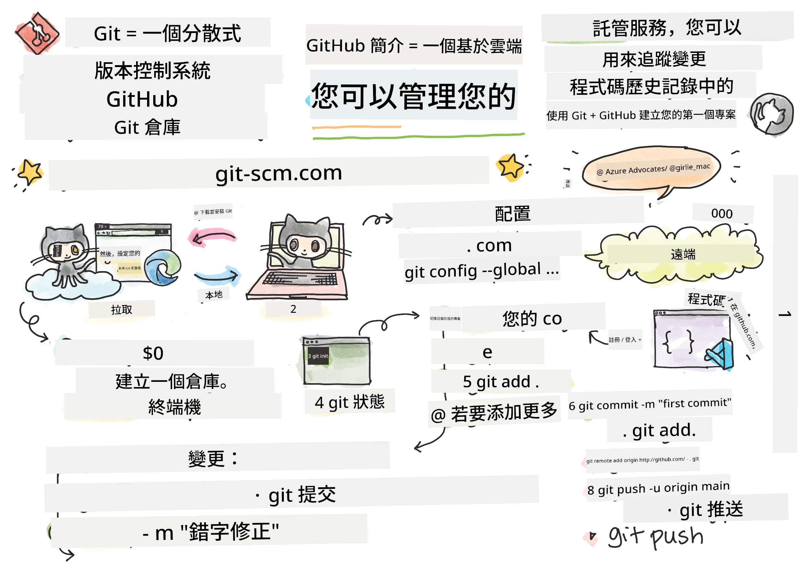
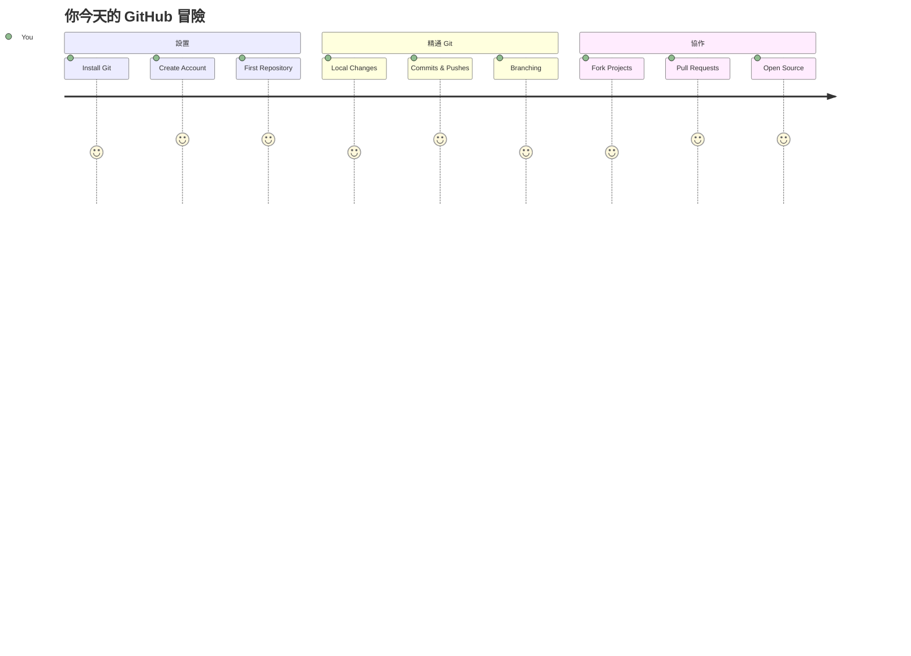
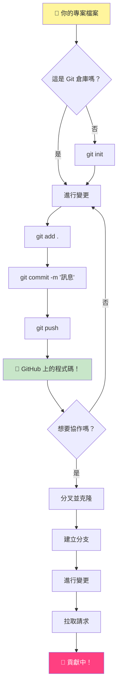
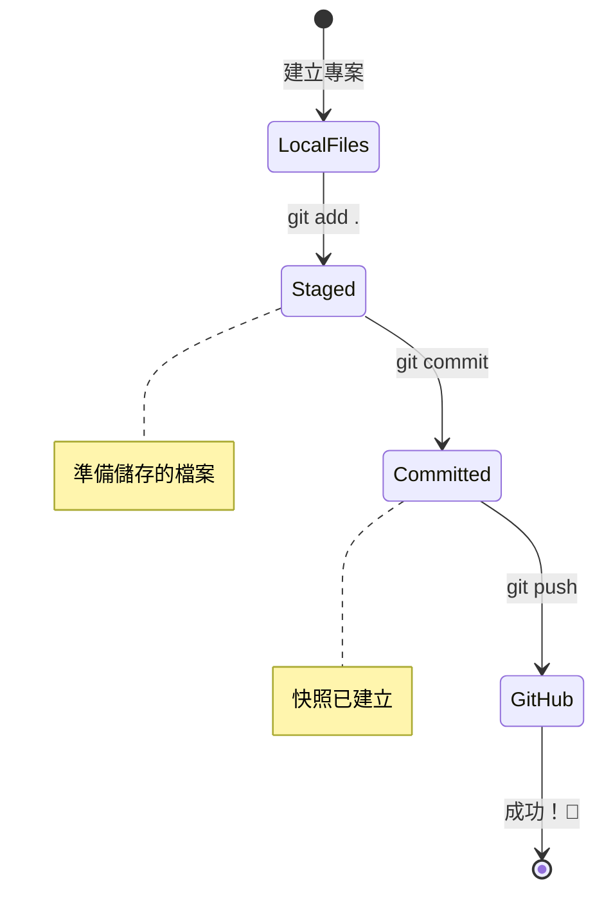
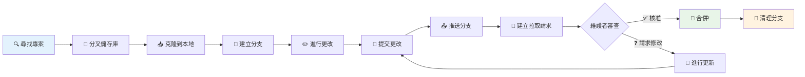
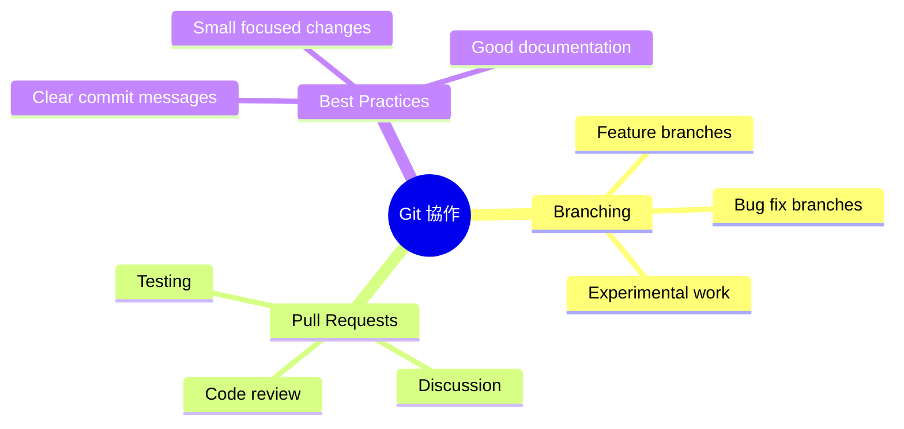
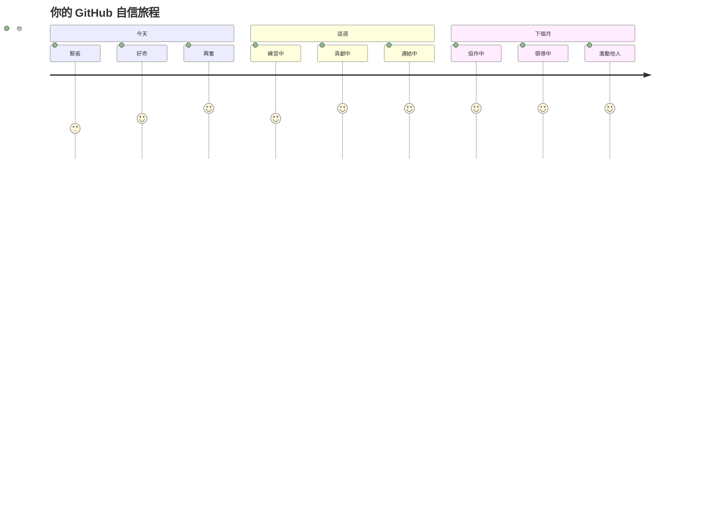

<!--
CO_OP_TRANSLATOR_METADATA:
{
  "original_hash": "5c383cc2cc23bb164b06417d1c107a44",
  "translation_date": "2026-01-06T14:26:49+00:00",
  "source_file": "1-getting-started-lessons/2-github-basics/README.md",
  "language_code": "tw"
}
-->
# Introduction to GitHub

嘿，未來的開發者！👋 準備好加入全球數百萬程式碼撰寫者的行列了嗎？我真心很興奮地要向你介紹 GitHub－把它想像成程式設計師的社群媒體平台，不同的是我們不是分享午餐照片，而是分享程式碼，一起打造超讚的東西！

讓我覺得超震撼的是：你手機上的每個應用程式、你造訪的每個網站，以及你將學會使用的大部分工具，都是由像 GitHub 這樣的平台上團隊合作的開發者所建立的。你喜歡的音樂APP？有人像你一樣參與過它的開發。那款讓你愛不釋手的遊戲？沒錯，很可能就是用 GitHub 協作打造的。而現在，你也會學會如何成為這個超棒社群的一員！

我知道一開始可能會覺得很複雜－天啊，我還記得第一次看 GitHub 頁面時心想：「這到底是什麼？」但重點是：每一位開發者起點都是你現在的這個位置。課程結束後，你會擁有自己的 GitHub 倉庫（想像成雲端裡的個人專案展示區），並且知道怎麼儲存你的工作、分享給別人，甚至參與數百萬用戶都在使用的專案。

我們將一起逐步踏上這趟旅程。不要急，不要緊張－只有你我，還有一些即將成為你新好朋友的超酷工具！


> Sketchnote by [Tomomi Imura](https://twitter.com/girlie_mac)


## 課前測驗
[課前測驗](https://ff-quizzes.netlify.app)

## 介紹

在深入精彩內容之前，先來準備好你的電腦，讓 GitHub 魔法發揮作用吧！想像你在創作一件藝術品之前先安排好畫具－擁有正確工具會讓一切順暢又有趣很多。

我會帶你一步步設定，我保證它沒你想像的那麼可怕。如果一開始沒馬上理解也完全沒關係！我記得剛設置開發環境時，感覺自己像在看古老的象形文字一樣。每位開發者都曾經和你一樣，心想自己是不是搞錯了。小劇透：只要你願意學，你已經走在正確的路上了！🌟

這堂課我們會學：

- 如何追蹤你在電腦上的工作
- 如何與他人合作專案
- 如何為開源軟體做出貢獻

### 預備條件

讓我們先準備好你的電腦，讓 GitHub 魔法開始發動！別擔心－這個設定只要做一次，就能陪你整個程式碼旅程。

好，從基礎開始！首先，我們要看看 Git 是否已經安裝在你的電腦上。Git 就像一位超厲害的助理，會記住你對程式碼的每個變更－比你每兩秒瘋狂按 Ctrl+S 好太多了（大家都有過這種經驗！）

打開終端機（Terminal）輸入下面這個神奇指令，來看看 Git 是否存在：
`git --version`

如果沒有安裝 Git，不用擔心！立刻前往 [download Git](https://git-scm.com/downloads) 下載安裝。安裝好後，我們要讓 Git 知道你是誰：

> 💡 **首次設定**：這些指令會告訴 Git 你的身分。這些資訊會附加在你每次提交的紀錄上，所以請用你樂意公開分享的姓名和電子郵件。

```bash
git config --global user.name "your-name"
git config --global user.email "your-email"
```

要確認 Git 是否已配置，可以輸入：
```bash
git config --list
```

你還需要有一個 GitHub 帳號、程式碼編輯器（像是 Visual Studio Code），並且打開你的終端機（或命令提示字元）。

前往 [github.com](https://github.com/) 註冊帳號，或是登入並完善你的個人資料。

💡 **現代小技巧**：考慮設定 [SSH 金鑰](https://docs.github.com/en/authentication/connecting-to-github-with-ssh) 或使用 [GitHub CLI](https://cli.github.com/) 來方便無密碼登入。

✅ GitHub 並非唯一的程式碼儲存庫平台，但它是最廣為人知的。

### 準備工作

你需要在本機（筆電或桌機）有一個專案資料夾，還要有一個 GitHub 上的公開倉庫，當作示範用來學習如何貢獻他人的專案。

### 保護你的程式碼安全

談談安全性－別擔心，不會嚇到你！把這些安全習慣想像成鎖車門或家門－簡單的習慣，保護你的心血結晶。

我們會從一開始就示範使用安全、現代的 GitHub 使用方式，助你養成良好習慣，未來程式人生都用得上。

使用 GitHub 時，請務必遵守安全最佳實踐：

| 安全領域 | 最佳做法 | 為什麼重要 |
|----------|-----------|------------|
| **身份驗證** | 使用 SSH 金鑰或個人存取權杖 | 密碼安全性較差，且逐漸被淘汰 |
| **雙重驗證** | 啟用 GitHub 帳號雙重驗證(2FA) | 增加帳號額外保護層 |
| **倉庫安全** | 千萬不要提交敏感資訊 | API 金鑰及密碼絕不應出現在公開倉庫 |
| **相依更新管理** | 啟用 Dependabot 自動更新相依套件 | 保持套件安全且最新 |

> ⚠️ **重要安全提醒**：切勿將 API 金鑰、密碼或其他敏感資訊推送到任何倉庫。請使用環境變數和 `.gitignore` 檔案保護敏感資料。

**現代身份驗證設定：**

```bash
# 產生 SSH 金鑰（現代 ed25519 演算法）
ssh-keygen -t ed25519 -C "your_email@example.com"

# 設定 Git 使用 SSH
git remote set-url origin git@github.com:username/repository.git
```

> 💡 **專家秘訣**：SSH 金鑰可以免除重複輸入密碼，更加安全。

---

## 像專家一樣管理你的程式碼

好啦，接下來才是真正令人興奮的部分！🎉 我們即將學會怎麼像專家一樣追蹤和管理你的程式碼。說實話，這是我最喜歡教的事，因為它真的能徹底改變遊戲規則。

想像你在寫一個精彩故事，你想記錄每個草稿、每次巧妙修改和所有「哇，這點子真棒！」的時刻。Git 就幫你做到這件事！它像是能穿越時空的筆記本，記得一切－每次按鍵、每個改動、每次「糟糕，這壞掉了」的時刻，讓你馬上回到從前修正錯誤。

老實說－一開始會覺得難懂。當年我也想「為什麼不直接用一般方式存檔呢？」但相信我：當你理解 Git（肯定會的！）時，你會有那種頓悟：「以前怎麼能沒有它寫程式？」就像發現你其實能飛，而不是一輩子都走路一樣！

假設你本機有一個專案資料夾，想用 git（版本控制系統）開始追蹤你的進度。有些人形容用 git 就像寫信給未來的自己。幾天、幾週甚至幾個月後讀回你的提交訊息，就能回想起你為什麼做決定，或者「回溯」之前的改動－當然這全賴你寫的「提交訊息」好不好。


### 任務：建立你的第一個倉庫！

> 🎯 **你的任務（我超級期待你成功！）**：我們一起創建你的第一個 GitHub 倉庫！完成後，你會擁有網路上的一個小角落來存放你的程式碼，而且你會做出你的第一個「commit」（專業講法，即用聰明的方式儲存你的工作）。
>
> 這真的是個特別時刻－你即將正式加入全球開發者社群！我還記得自己第一次建立倉庫時，心情超激動，心想「哇，我真的在做這件事！」

讓我們一起一步步完成這趟探索旅程。慢慢來，每個步驟都會讓你越來越懂。記住，每個你尊敬的程式碼巨星都曾經如你現在這般，準備寫下第一個倉庫。是不是很酷？

> 觀看影片
> 
> [](https://www.youtube.com/watch?v=9R31OUPpxU4)

**一起來做：**

1. **在 GitHub 建立你的倉庫**。前往 GitHub.com，找到那個鮮綠色的 **New** 按鈕（或右上角的 **+** 符號），點擊後選擇 **New repository**。

   這樣做：
   1. 給你的倉庫取個名字－選一個有意義的名稱！
   1. 想的話，可以加上描述（幫助別人了解專案內容）
   1. 決定倉庫是公開（所有人可見）還是私人（只有你看得到）
   1. 建議勾選新增 README 檔案－它就像專案的門面首頁
   1. 按下 **Create repository**，慶祝吧－你已建立第一個倉庫！🎉

2. **打開你的專案資料夾**。現在打開終端機（別怕，它沒你想像的複雜！）。我們要告訴電腦專案檔案在那裡，輸入：

   ```bash
   cd [name of your folder]
   ```

   **我們在做什麼：**
   - 基本上是對電腦說「嘿，帶我去我的專案資料夾」
   - 就像用滑鼠打開桌面的特定資料夾，不過用指令文字指示
   - 把 `[name of your folder]` 換成你專案資料夾的實際名稱

3. **把資料夾變成 Git 倉庫**。魔法的部分來了！輸入：

   ```bash
   git init
   ```

   **剛剛發生了什麼（超酷！）：**
   - Git 在你的專案裡建立一個隱藏的 `.git` 資料夾－你看不到它，但它存在！
   - 你的普通資料夾現在變成一個能追蹤所有改動的「倉庫」
   - 想像你的資料夾獲得了超能力，能記住一切

4. **查看現況**。看看 Git 現在對你的專案有什麼看法：

   ```bash
   git status
   ```

   **解讀 Git 的回應：**
   
   你可能會看到像這樣的訊息：

   ```output
   Changes not staged for commit:
   (use "git add <file>..." to update what will be committed)
   (use "git restore <file>..." to discard changes in working directory)

        modified:   file.txt
        modified:   file2.txt
   ```

   **別慌！這代表什麼：**
   - **紅色** 的檔案代表改過但還沒準備好存檔
   - **綠色** （如果出現）代表檔案已準備好儲存
   - Git 很貼心地告訴你下一步該怎麼做

   > 💡 **專家小提示**：`git status` 是你最好的朋友！任何時候疑惑，都能問它「Hey，情況怎麼樣？」。

5. **準備你的檔案以儲存**（這叫做「暫存」）：

   ```bash
   git add .
   ```

   **剛剛做了啥：**
   - 我們告訴 Git「嘿，下一次存檔要包含所有檔案」
   - `.` 代表資料夾中「全部內容」
   - 現在你的檔案都已被「暫存」，準備好進行下一步

   **想挑選性暫存嗎？** 你可以只暫存指定檔案：

   ```bash
   git add [file or folder name]
   ```

   **為什麼想這樣做？**
   - 有時你想把相關改動一次存成一組
   - 有助分類你的工作成有意義的單元
   - 方便將來理解什麼時候變動了什麼

   **想取消暫存？** 沒問題！用這個指令：

   ```bash
   # 取消所有檔案的暫存
   git reset
   
   # 只取消一個檔案的暫存
   git reset [file name]
   ```

   不用怕－這不會刪除你工作內容，只是把檔案從「準備存」區移除。

6. **永久保存你的工作**（開始你的第一次 commit！）：

   ```bash
   git commit -m "first commit"
   ```

   **🎉 恭喜！你完成了第一個 commit！**
   
   **發生了什麼事：**
   - Git 在此刻對所有暫存檔案拍了一張「快照」
   - 你寫下的 commit 訊息「first commit」說明這個存檔的意義
   - Git 給了這快照一個獨特識別碼，日後可以輕鬆找到
   - 你正式開始追蹤專案歷史了！

   > 💡 **未來的 commit 訊息**：下次提交時試著更具描述性！不要只寫「updated stuff」，改成「Add contact form to homepage」或「Fix navigation menu bug」。你的未來自己會非常感謝你！

7. **連結本機專案到 GitHub**。現在你的專案只存在電腦裡，我們要把它連結到 GitHub 倉庫，這樣才能分享給世界！

   先到你的 GitHub 倉庫頁面，複製它的 URL。回來終端機，輸入：

   ```bash
   git remote add origin https://github.com/username/repository_name.git
   ```
   
   （把這個 URL 換成你的專案網址！）

   **我們剛剛做了什麼：**
   - 我們建立了您本地專案和 GitHub 儲存庫之間的連結
   - 「Origin」只是您 GitHub 儲存庫的一個暱稱——就像將連絡人加到您的手機一樣
   - 現在您的本地 Git 知道在您準備分享時要將代碼傳送到哪裡

   💡 **更簡易的方法**：如果您已安裝 GitHub CLI，可以用一條命令完成這個動作：
   ```bash
   gh repo create my-repo --public --push --source=.
   ```

8. **將代碼傳送到 GitHub**（重頭戲來了！）：

   ```bash
   git push -u origin main
   ```

   **🚀 就是現在！您正在將代碼上傳到 GitHub！**
   
   **正在發生的事情：**
   - 您的 commit 正從您的電腦傳送至 GitHub
   - `-u` 參數設置了永久連接，讓以後推送更簡單
   - 「main」是您主要分支的名稱（就像主要資料夾）
   - 這之後，您只需輸入 `git push` 即可上傳！

   💡 **快速提醒**：如果您的分支叫別的名字（例如「master」），請改用那個名稱。您可用 `git branch --show-current` 查看。

9. **您的新日常程式編寫節奏**（開始上癮的地方！）：

   從現在開始，每當您改動專案時，就有這樣簡單的三步舞：

   ```bash
   git add .
   git commit -m "describe what you changed"
   git push
   ```

   **這將成為您的編碼心跳：**
   - 為代碼做出精彩更改 ✨
   - 用 `git add` 將它們階段化（「嘿 Git，注意這些更改！」）
   - 用 `git commit` 和描述訊息保存它們（未來的您會感謝現在的自己！）
   - 用 `git push` 分享給世界 🚀
   - 反覆如此——說真的，這將變得跟呼吸一樣自然！

   我喜歡這個工作流程，因為它就像遊戲裡的多個儲存點。喜歡剛剛做的改動？就 commit 它！想嘗試冒險？沒問題──如果出錯了，隨時可以回到最後一次 commit！

   > 💡 **小提示**：您也可能想用 `.gitignore` 檔案防止某些不想被追蹤的檔案出現在 GitHub 上，例如同資料夾裡您用來記錄筆記的檔案。您可從 [.gitignore templates](https://github.com/github/gitignore) 找範本，或使用 [gitignore.io](https://www.toptal.com/developers/gitignore) 製作。

### 🧠 **第一次提交：感覺如何？**

**請花點時間慶祝並反思：**
- 第一次看到代碼出現在 GitHub 上感覺如何？
- 哪個步驟讓您最困惑，哪個步驟反而出乎意料地簡單？
- 您能用自己的話解釋 `git add`、`git commit` 和 `git push` 的不同嗎？


> **記得**：即使是經驗豐富的開發者也有時會忘記確切指令。讓這套流程成為肌肉記憶需要練習——您做得很棒！

#### 現代 Git 工作流程

考慮採用以下現代實務：

- **慣例性提交（Conventional Commits）**：使用規範化的提交訊息格式，如 `feat:`、`fix:`、`docs:` 等。詳情請見 [conventionalcommits.org](https://www.conventionalcommits.org/)
- **原子性提交（Atomic commits）**：讓每次提交代表單一邏輯變更
- **頻繁提交**：經常用描述性訊息提交，而非少量但龐大的提交

#### 提交訊息

優秀的 Git 提交主題行會完成這個句子：
如果套用，這次提交將會 <在這裡寫您的主題行>

主題請使用祈使句和現在式：「change」而非「changed」或「changes」。 
在主題中如此，正文（可選）也以祈使句現在式呈現。正文應說明變更的動機，並與先前行為對比。您在解釋的是「為什麼」，不是「怎麼做」。

✅ 花幾分鐘逛逛 GitHub。能找到特別棒的提交訊息嗎？能找到特別簡潔的嗎？您認為提交訊息中什麼資訊最重要且實用？

## 與他人協作（最好玩的部分！）

請戴好帽子，因為這裡是 GitHub 變得魔幻的時刻！🪄 你已學會管理自己的代碼，現在我們將深入我最愛的部分——與世界各地了不起的人合作。

想像一下：明天醒來發現有人在東京睡覺時優化了你代碼；接著有人在柏林修正了你卡住的錯誤。下午時候，聖保羅的開發者加上你從未想過的功能。這不是科幻，而是 GitHub 世界裡的平常星期二！

讓我真正振奮的是，你即將學到的協作技巧，正是 Google、微軟和你喜愛的初創公司每天都在用的工作流。你不只是學會了一個酷工具——你學會了讓整個軟體世界無縫合作的祕密語言。

說真的，一旦你體驗到有人合併你的第一個拉取請求（Pull Request）的興奮，你就會理解為什麼開發者對開源那麼熱衷。這就像成為世界上最大、最有創意的團隊專案一份子！

> 請看影片
>
> [](https://www.youtube.com/watch?v=bFCM-PC3cu8)

把東西放到 GitHub 的主要原因，是為了讓與其他開發者協作成為可能。


在您的儲存庫裡，導航至 `Insights > Community`，查看您的專案如何與建議的社群標準比較。

想讓您的儲存庫看起來專業且受歡迎嗎？前往您的儲存庫，點選 `Insights > Community`。這個很棒的功能會告訴您專案如何與 GitHub 社群認為的「優秀儲存庫實踐」對比。

> 🎯 **讓您的專案閃耀**：一個有良好文件的井然有序儲存庫就像擁有乾淨且熱情的店面。讓人知道您在意您的工作，也讓其他人想要參與！

**一個出色儲存庫的特點有：**

| 欄位 | 重要性 | 給您的好處 |
|-------------|-------------------|---------------------|
| **描述（Description）** | 第一印象很重要！ | 讓人立刻知道您的專案做什麼 |
| **README** | 您專案的首頁 | 像友善的導覽員給新訪客介紹 |
| **貢獻指南（Contributing Guidelines）** | 展現歡迎協助 | 讓人知道如何能幫您忙 |
| **行為準則（Code of Conduct）** | 創造友善空間 | 讓大家都感到歡迎參與 |
| **授權條款（License）** | 法律明確 | 讓其他人知道如何使用您的代碼 |
| **安全政策（Security Policy）** | 展現專業 | 表明您對安全負責 |

> 💡 **專家祕訣**：GitHub 提供這些文件的範本。建立新儲存庫時，勾選對應框即可自動生成。

**探索現代 GitHub 功能：**

🤖 **自動化與 CI/CD：**
- 用 **GitHub Actions** 進行自動化測試和部署
- 用 **Dependabot** 自動更新相依套件

💬 **社群與專案管理：**
- 用 **GitHub Discussions** 進行超越議題的社群對話
- 用 **GitHub Projects** 做看板式專案管理
- 用 **分支保護規則** 強制執行程式碼品質標準


這些資源對於新團隊成員入職特別有幫助。而這些正是新貢獻者在看您的程式碼前，先用來判斷專案是否值得投入時間的資訊。

✅ README 檔案雖然準備時間不少，但經常被繁忙的維護者忽略。能找到特別詳盡的 README 範例嗎？另外，有些 [工具可以幫助製作好 README](https://www.makeareadme.com/) 您也可以試試。

### 任務：合併部分代碼

貢獻文件幫助人們貢獻到專案。它說明了您期待哪類貢獻以及流程如何。在 GitHub 上，貢獻者需要通過一系列步驟才能向您的 repo 做出貢獻：

1. **Fork 您的儲存庫** 您大概會希望大家「fork」您的專案。Fork 是在他們的 GitHub 帳號建立您儲存庫的副本。
1. **Clone** 然後他們會把專案 clone 到電腦本地。
1. **建立分支** 您會想要求他們建立一個分支來工作。
1. **專注於單一改動點** 請貢獻者一次專注修改一件事——這樣您合併（merge）的可能性才高。想像他們寫了一個 bug 修正、新增一個功能並更新了幾個測試——如果您只想、或只能接受三個改動中的兩個或一個怎麼辦？

✅ 想想在寫作和交付好代碼時，分支特別重要的情境有哪些？

> 記得，自身想見的改變要來自自己，也要替自己的工作建立分支。您所做的任何 commit 都會在當前「切換到」（checked out）分支上。用 `git status` 看看您在哪個分支。

接下來走一遍貢獻者的工作流程。假設貢獻者已經 fork 及 clone 了儲存庫，在他們本機已有可用的 Git repo：

1. **建立分支** 用指令 `git branch` 建立要做貢獻的分支：

   ```bash
   git branch [branch-name]
   ```

   > 💡 **現代方法**：您也可以用一條命令同時建立並切換到這個新分支：
   ```bash
   git switch -c [branch-name]
   ```

1. **切換到工作分支** 用 `git switch` 切換指定分支並更新工作目錄：

   ```bash
   git switch [branch-name]
   ```

   > 💡 **現代提醒**：`git switch` 是改變分支時的現代替代指令，比 `git checkout` 清楚且更安全，適合新手。

1. **開始工作** 這時您要加入改動。別忘了用以下指令告訴 Git：

   ```bash
   git add .
   git commit -m "my changes"
   ```

   > ⚠️ **提交訊息品質**：確保 commit 起個好名字，為您自己也為您協助的 repo 維護者。具體說明您改了什麼！

1. **與 `main` 分支整合** 某個時刻您工作完成，想與 `main` 分支整合。於此之前，先用以下指令確保 `main` 是最新的：

   ```bash
   git switch main
   git pull
   ```

   接著，您要確保所有 _衝突_ ，也就是 Git 無法輕易 _合併_ 的情況，都在您的工作分支裡解決。因而請執行：

   ```bash
   git switch [branch_name]
   git merge main
   ```

   `git merge main` 指令會將 `main` 的所有變更帶入您的分支。希望您可以直接繼續。如果不能，VS Code 會告訴您 Git 到底卡在哪裡，只要修改影響檔案來決定哪部分內容是正確的。

   💡 **現代替代方案**：考慮用 `git rebase` 取得較乾淨的歷史紀錄：
   ```bash
   git rebase main
   ```
   這會將您的提交重播在最新 main 之上，形成一條絕對線性歷史。

1. **將工作推送到 GitHub** 推送工作到 GitHub 意味著兩件事。將分支推送到您的儲存庫，然後開啟 PR（拉取請求）。

   ```bash
   git push --set-upstream origin [branch-name]
   ```

   上述指令會在您分叉的儲存庫中建立分支。

### 🤝 **協作技能測試：準備好與他人合作了嗎？**

**看看您對協作的感覺如何：**
- 現在您了解 fork 和 pull request 的概念了嗎？
- 工作中關於分支的哪個部分您想多練習？
- 您對於貢獻他人專案感覺自在嗎？


> **信心加強**：每位您欣賞的開發者，首次拉取請求時都曾緊張。GitHub 社群對新手非常友善！

1. **開啟 PR** 接著，您想開啟 PR。方法是到 fork 的儲存庫 GitHub 頁面。GitHub 會提示您是否要建立新的 PR，點擊後進入介面，可調整 commit 訊息標題，給它更合理描述。這時您 fork 的原始專案維護者就會看到這個 PR，_祈禱_ 他們會欣賞並 _合併_ 您的 PR。您現在成為貢獻者了，耶 :)

   💡 **現代技巧**：您也可以使用 GitHub CLI 建立 PR：
   ```bash
   gh pr create --title "Your PR title" --body "Description of changes"
   ```

   🔧 **PR 最佳實務：**
   - 用像是「Fixes #123」的關鍵字連結相關 issue
   - UI 改動附上截圖
   - 指定想要審查的特定人員
   - 使用草稿 PR 進行開發中工作
   - 確保所有 CI 檢查通過後再請求審查
1. **清理**。成功合併 Pull Request 後，_清理_ 是一個被認為良好的習慣。你要清理你的本地分支以及你推送到 GitHub 的分支。首先使用以下指令在本地刪除它：

   ```bash
   git branch -d [branch-name]
   ```

   接著請到 Fork 的 GitHub 頁面，移除你剛剛推送的遠端分支。

`Pull request`（拉取請求）這名稱聽起來有些奇怪，因為你真正想做的是將你的修改推送到專案中。但維護者（專案擁有者）或核心團隊需要在合併至專案的「主」分支前，審核你的修改，所以你實際上是在向維護者請求更改的決定。

Pull request 是用來比較並討論分支上的差異的地方，包含審查、意見回饋、整合測試等等。一份好的 Pull request 大致遵守和提交訊息相同的規範。當你的工作修復了一個問題時，可以加入對議題追蹤器(issue tracker)中議題的參考，做法是使用 `#` 後面接你的議題編號。例如 `#97`。

🤞祈禱所有檢查都通過，專案擁有者們會將你的更改合併進專案🤞

使用 `git pull` 將你目前本地工作分支與 GitHub 對應遠端分支的所有新提交同步更新：

`git pull`

## 參與開源專案（你改變世界的機會！）

準備好被震撼了嗎？🤯 讓我們來談談參與開源專案吧—說實話，一想到要和你分享這些，我都起雞皮疙瘩了！

這是你成為真正非凡事物一部分的機會。想像一下改進每天數百萬開發者都在使用的工具，或修復你朋友喜愛的應用程式中的錯誤。這不只是一個夢想——這就是開源貢獻的全部意義！

讓我總是激動不已的是：你用來學習的每個工具——你的程式編輯器、我們要探索的框架、甚至你用來閱讀這篇文章的瀏覽器——其實都是由一位跟你一樣的人，做出了他們的第一次貢獻開始。那位打造你最愛 VS Code 擴充功能的天才開發者？他們也曾是初學者，用著顫抖的手點擊「建立拉取請求（create pull request）」按鈕，就像你現在要做的。

最美好的部分是：開源社群就像互聯網上最大的集體擁抱。大多數專案積極尋找新手，還有標示了「good first issue（適合初學者）」的議題，專門為像你這樣的人準備！維護者看到新貢獻者時會真心感到興奮，因為他們還記得自己的第一步。

```mermaid
flowchart TD
    A[🔍 探索 GitHub] --> B[🏷️ 找到 "good first issue"]
    B --> C[📖 閱讀貢獻指南]
    C --> D[🍴 分叉倉庫]
    D --> E[💻 設置本地環境]
    E --> F[🌿 創建功能分支]
    F --> G[✨ 做出你的貢獻]
    G --> H[🧪 測試你的更改]
    H --> I[📝 撰寫清晰的提交訊息]
    I --> J[📤 推送並創建 PR]
    J --> K[💬 參與反饋討論]
    K --> L[🎉 合併！你是貢獻者了！]
    L --> M[🌟 找下一個問題]
    
    style A fill:#e1f5fe
    style L fill:#c8e6c9
    style M fill:#fff59d
```
你不是僅僅在學習編寫程式碼——你正在準備加入一個全球建造者的大家庭，他們每天醒來都在想：「我們怎麼讓數位世界變得更好一點？」歡迎加入這個俱樂部！🌟

首先，讓我們在 GitHub 找到一個你感興趣、且想要貢獻修改的程式碼庫（repo）。你會想把它的內容複製到你的機器上。

✅ 找尋「適合新手」的優良程式碼庫的好方法是 [透過 'good-first-issue' 標籤搜尋](https://github.blog/2020-01-22-browse-good-first-issues-to-start-contributing-to-open-source/)。


複製程式碼有多種方式。常見的一種是使用 HTTPS、SSH 或 GitHub CLI（命令列介面）來「克隆」整個程式庫內容。

打開終端機，像這樣克隆儲存庫：
```bash
# 使用 HTTPS
git clone https://github.com/ProjectURL

# 使用 SSH（需要設定 SSH 金鑰）
git clone git@github.com:username/repository.git

# 使用 GitHub CLI
gh repo clone username/repository
```

要開始專案，切換到正確的目錄：
`cd ProjectURL`

你也可以使用以下方式打開整個專案：
- **[GitHub Codespaces](https://github.com/features/codespaces)** - 透過瀏覽器使用 VS Code 的 GitHub 雲端開發環境
- **[GitHub Desktop](https://desktop.github.com/)** - 針對 Git 操作的圖形介面應用程式
- **[GitHub.dev](https://github.dev)** - 在任何 GitHub 儲存庫按下 `.` 鍵，於瀏覽器打開 VS Code
- 安裝 GitHub Pull Requests 擴充功能的 **VS Code**

最後也可以下載壓縮檔的程式碼。

### 關於 GitHub 的一些有趣資訊

你可以收藏（star）、關注（watch）和／或「派生」（fork） GitHub 上任何公開程式庫。你可以在右上方的下拉選單中找到你收藏的儲存庫。這就像為程式碼做書籤一樣。

專案有議題追蹤系統，大多數位於 GitHub 的「Issues」標籤頁，除非另有標示，在這裡大家討論專案相關問題。拉取請求（Pull Requests）標籤頁則是大家討論及審查進行中修改的地方。

有些專案也會在論壇、郵件列表或 Slack、Discord、IRC 等聊天室中討論。

🔧 **現代 GitHub 功能**：
- **GitHub Discussions** - 內建的社群討論區
- **GitHub Sponsors** - 金錢支持維護者
- **Security tab（安全標籤）** - 漏洞報告與資安公告
- **Actions tab（工作流程標籤）** - 查看自動化流程與 CI/CD 管線
- **Insights tab（洞察標籤）** - 關於貢獻者、提交與專案健康狀況的分析
- **Projects tab（專案標籤）** - GitHub 內建的專案管理工具

✅ 到你的新儲存庫四處看看，嘗試設定、編輯資料、建立專案（例如看板），及設定 GitHub Actions 自動化。有很多事情你可以做！

---

## 🚀 挑戰

好了，是時候測試你閃亮的新 GitHub 超能力了！🚀 這個挑戰會讓一切在最令人滿意的方式中連結起來：

找一個朋友（或者那位總問你「你到底在搞什麼電腦東西」的家人）一起開始合作編碼冒險！真正的魔法從這裡開始——創建一個專案，讓對方 fork，建立一些分支，並像專家一樣合併變更。

我不騙你——你們過程中可能會笑翻（尤其是同時改到同一行時）、也可能摸不著頭緒，但你們一定會有那些「啊哈！」的精彩時刻，讓學習之旅都值回票價。而且跟別人分享第一次成功合併的感覺很特別——就像慶祝你走了多遠！

還沒有編程夥伴？完全不用擔心！GitHub 社群非常熱情友善，他們還記得新手時的感覺。找尋標示有「good first issue」的儲存庫——這些就是在說：「嘿，新手，來跟我們一起學習吧！」多棒啊！

## 課後測驗
[Post-lecture quiz](https://ff-quizzes.netlify.app/web/en/)

## 回顧與持續學習

呼！🎉 看看你——你剛剛像冠軍一樣征服了 GitHub 基礎！如果你現在腦袋覺得有點滿，那是很正常的，甚至是好現象。你學到的工具，我剛開始時花了好幾週才能熟悉。

Git 和 GitHub 非常強大（真的很強大），我認識的每位開發者——包括那些看起來像巫師的高手們——都得碰撞、練習、走彎路才終於能掌握。你完成這課代表你已經踏上了精通開發者最重要工具之一的路。

以下都是極佳的資源，幫你練習並變得更厲害：

- [參與開源軟體指南](https://opensource.guide/how-to-contribute/#how-to-submit-a-contribution) – 引導你如何有所作為
- [Git 快捷清單](https://training.github.com/downloads/github-git-cheat-sheet/) – 隨手可用的速查表！

記得：練習造就進步，不是完美！你越用 Git 和 GitHub，就會越自然。GitHub 也推出了非常棒的互動課程，讓你在安全的環境中練習：

- [GitHub 入門](https://github.com/skills/introduction-to-github)
- [使用 Markdown 進行溝通](https://github.com/skills/communicate-using-markdown)  
- [GitHub Pages](https://github.com/skills/github-pages)
- [管理合併衝突](https://github.com/skills/resolve-merge-conflicts)

**想挑戰更進階工具？試試這些現代化工具：**
- [GitHub CLI 文件](https://cli.github.com/manual/) – 想感受命令列魔法就用它
- [GitHub Codespaces 文件](https://docs.github.com/en/codespaces) – 在雲端編碼！
- [GitHub Actions 文件](https://docs.github.com/en/actions) – 自動化所有工作
- [Git 最佳實踐](https://www.atlassian.com/git/tutorials/comparing-workflows) – 提升你的工作流程

## GitHub Copilot Agent 挑戰 🚀

使用 Agent 模式完成以下挑戰：

**描述：** 建立一個協作網頁開發專案，展示本課程中學到的完整 GitHub 工作流程。此挑戰將幫助你在真實情境中練習儲存庫創建、協作功能與現代 Git 工作流程。

**提示：** 建立一個公共 GitHub 儲存庫，主題為簡單的「網頁開發資源」專案。此儲存庫應包含結構良好的 README.md 檔，列出實用的網頁開發工具和資源，並依類別（HTML、CSS、JavaScript 等）組織。設定儲存庫以符合社群標準，包括授權條款、貢獻指引與行為準則。建立至少兩個功能分支：一個用來新增 CSS 資源，另一個用來新增 JavaScript 資源。對每個分支進行有描述性提交訊息的 commit，然後建立 Pull Request 將變更合併回 main。啟用 Issues、Discussions 等 GitHub 功能，並且設定基本的 GitHub Actions 工作流程自動檢查。

## 作業

你的任務，如果你願意接受：完成 GitHub Skills 的 [Introduction to GitHub](https://github.com/skills/introduction-to-github) 課程。這個互動課程會讓你在安全、有引導的環境中練習你所學的一切。完成後還能獲得一個炫酷的徽章！🏅

**準備好接受更多挑戰了嗎？**
- 設定 GitHub 帳號的 SSH 認證（不再需要密碼！）
- 嘗試使用 GitHub CLI 進行日常 Git 操作
- 建立一個帶有 GitHub Actions 工作流程的儲存庫
- 用 GitHub Codespaces 開啟此儲存庫，體驗雲端編輯器

---

## 🚀 你的 GitHub 精通時間表

### ⚡ **接下來 5 分鐘能做到的事情**
- [ ] 收藏此儲存庫及另 3 個你感興趣的專案
- [ ] 在 GitHub 帳號設定雙重身份驗證
- [ ] 為你的第一個儲存庫建立簡單的 README
- [ ] 追蹤 5 位讓你感覺受啟發的開發者

### 🎯 **這一小時可以完成的目標**
- [ ] 完成課後測驗，並反思你的 GitHub 旅程
- [ ] 設定 SSH 金鑰以免密碼驗證
- [ ] 做出你的第一個具意義的 commit，並寫好提交訊息
- [ ] 探索 GitHub 的「探索」標籤，發現熱門專案
- [ ] 練習 fork 一個儲存庫並做些小修改

### 📅 **本周的 GitHub 探險**
- [ ] 完成 GitHub Skills 課程（入門 GitHub、Markdown）
- [ ] 向一個開源專案發送你的第一個 pull request
- [ ] 設置 GitHub Pages 來展示你的成果
- [ ] 參與你感興趣專案的 GitHub Discussions
- [ ] 建立一個符合社群標準（README、授權等）的儲存庫
- [ ] 嘗試使用 GitHub Codespaces 進行雲端開發

### 🌟 **本月的蛻變目標**
- [ ] 向 3 個不同的開源專案貢獻程式碼
- [ ] 指導一位 GitHub 新手（回饋社群！）
- [ ] 設置 GitHub Actions 自動工作流程
- [ ] 建立展示你 GitHub 貢獻的作品集
- [ ] 參加 Hacktoberfest 或類似社群活動
- [ ] 成為你自己專案的維護者，並邀請其他人貢獻

### 🎓 **最終 GitHub 精通檢查**

**慶祝你走了多遠：**
- 你最喜歡 GitHub 的哪一點？
- 哪個協作功能讓你最感興趣？
- 你對貢獻開源的信心有多少？
- 你第一個想貢獻的專案是什麼？


> 🌍 **歡迎加入全球開發者社群！** 你現在擁有與全球數百萬開發者協作的工具。你的第一筆貢獻可能看似微小，但請記住——每個重要的開源專案都是從有人做出第一次提交開始。問題不在於你是否會有所影響，而是第一個因你的獨特觀點而受益的神奇專案會是什麼！🚀

記住：每個專家也曾是初學者。你可以的！💪

---

<!-- CO-OP TRANSLATOR DISCLAIMER START -->
**免責聲明**：  
本文件係使用 AI 翻譯服務 [Co-op Translator](https://github.com/Azure/co-op-translator) 進行翻譯。雖然我們致力於達到準確性，但請注意，自動翻譯可能包含錯誤或不準確之處。原文文件的母語版本應視為權威來源。對於重要資訊，建議聘請專業人工翻譯。我們不對因使用本翻譯所產生之任何誤解或錯誤解釋承擔責任。
<!-- CO-OP TRANSLATOR DISCLAIMER END -->