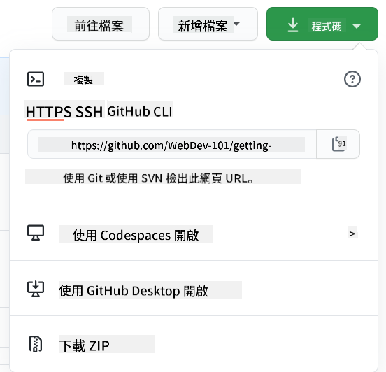

<!--
CO_OP_TRANSLATOR_METADATA:
{
  "original_hash": "361249da70432ddfd4741c917d1a6f50",
  "translation_date": "2025-08-29T15:30:39+00:00",
  "source_file": "1-getting-started-lessons/2-github-basics/README.md",
  "language_code": "tw"
}
-->
# GitHub 簡介

本課程介紹 GitHub 的基礎知識，這是一個用於托管和管理程式碼變更的平台。


> [Tomomi Imura](https://twitter.com/girlie_mac) 的手繪筆記

## 課前測驗
[課前測驗](https://ff-quizzes.netlify.app)

## 簡介

在本課程中，我們將學習：

- 如何追蹤你在電腦上的工作
- 如何與他人合作完成專案
- 如何為開源軟體做出貢獻

### 先決條件

在開始之前，你需要檢查是否已安裝 Git。在終端機輸入：  
`git --version`

如果尚未安裝 Git，請[下載 Git](https://git-scm.com/downloads)。然後，在終端機中設定你的本地 Git 配置檔案：
* `git config --global user.name "your-name"`
* `git config --global user.email "your-email"`

要檢查 Git 是否已配置，可以輸入：
`git config --list`

你還需要一個 GitHub 帳戶、一個程式碼編輯器（例如 Visual Studio Code），並打開你的終端機（或命令提示符）。

前往 [github.com](https://github.com/) 註冊帳戶（如果尚未註冊），或登入並填寫你的個人資料。

✅ GitHub 不是世界上唯一的程式碼儲存庫；還有其他選擇，但 GitHub 是最知名的。

### 準備工作

你需要在本地電腦（筆記型電腦或 PC）上準備一個包含程式碼專案的資料夾，以及 GitHub 上的一個公共儲存庫，作為如何為他人專案做出貢獻的示例。

---

## 程式碼管理

假設你在本地有一個包含程式碼專案的資料夾，並希望使用 Git（版本控制系統）來追蹤你的進度。有些人將使用 Git 比喻為寫給未來自己的情書。幾天、幾週或幾個月後閱讀你的提交訊息時，你可以回憶起為什麼做出某個決定，或者「回滾」某個更改——前提是你寫了好的「提交訊息」。

### 任務：建立儲存庫並提交程式碼  

> 查看影片
> 
> [](https://www.youtube.com/watch?v=9R31OUPpxU4)

1. **在 GitHub 上建立儲存庫**。在 GitHub.com 的儲存庫標籤中，或從右上角的導航欄找到 **new repo** 按鈕。

   1. 為你的儲存庫（資料夾）命名
   1. 選擇 **create repository**。

1. **導航到你的工作資料夾**。在終端機中，切換到你想開始追蹤的資料夾（也稱為目錄）。輸入：

   ```bash
   cd [name of your folder]
   ```

1. **初始化 Git 儲存庫**。在你的專案中輸入：

   ```bash
   git init
   ```

1. **檢查狀態**。要檢查儲存庫的狀態，輸入：

   ```bash
   git status
   ```

   輸出的內容可能如下所示：

   ```output
   Changes not staged for commit:
   (use "git add <file>..." to update what will be committed)
   (use "git checkout -- <file>..." to discard changes in working directory)

        modified:   file.txt
        modified:   file2.txt
   ```

   通常，`git status` 命令會告訴你哪些檔案已準備好保存到儲存庫，或者哪些檔案有更改需要持久化。

1. **添加所有檔案進行追蹤**  
   這也稱為暫存檔案/將檔案添加到暫存區。

   ```bash
   git add .
   ```

   `git add` 加上 `.` 參數表示所有檔案和更改都將被追蹤。

1. **添加選定檔案進行追蹤**

   ```bash
   git add [file or folder name]
   ```

   當你不想一次提交所有檔案時，這可以幫助我們只添加選定的檔案到暫存區。

1. **取消暫存所有檔案**

   ```bash
   git reset
   ```

   此命令幫助我們一次取消暫存所有檔案。

1. **取消暫存特定檔案**

   ```bash
   git reset [file or folder name]
   ```

   此命令幫助我們一次取消暫存特定檔案，該檔案不希望包含在下一次提交中。

1. **持久化你的工作**。此時你已將檔案添加到所謂的暫存區，Git 正在追蹤你的檔案。要使更改永久化，你需要提交檔案。提交代表儲存庫歷史中的一個保存點。輸入以下命令來建立提交：

   ```bash
   git commit -m "first commit"
   ```

   此命令提交所有檔案，並添加訊息「first commit」。未來的提交訊息應更具描述性，以傳達你所做的更改類型。

1. **將本地 Git 儲存庫連接到 GitHub**。本地的 Git 儲存庫很好，但某些時候你可能希望將檔案備份到某個地方，並邀請其他人與你合作。一個很好的地方就是 GitHub。記住，我們已經在 GitHub 上建立了一個儲存庫，因此唯一需要做的就是將本地 Git 儲存庫與 GitHub 連接。`git remote add` 命令可以做到這一點。輸入以下命令：

   > 注意，在輸入命令之前，前往你的 GitHub 儲存庫頁面以找到儲存庫 URL。你將在以下命令中使用它。將 ```https://github.com/username/repository_name.git``` 替換為你的 GitHub URL。

   ```bash
   git remote add origin https://github.com/username/repository_name.git
   ```

   此命令建立了一個名為「origin」的遠端連接，指向你之前建立的 GitHub 儲存庫。

1. **將本地檔案發送到 GitHub**。到目前為止，你已建立本地儲存庫與 GitHub 儲存庫之間的連接。接下來使用 `git push` 命令將檔案發送到 GitHub，如下所示：

   > 注意，你的分支名稱可能與 ```main``` 不同。

   ```bash
   git push -u origin main
   ```

   此命令將你的「main」分支中的提交發送到 GitHub。

2. **添加更多更改**。如果你想繼續進行更改並將它們推送到 GitHub，你只需使用以下三個命令：

   ```bash
   git add .
   git commit -m "type your commit message here"
   git push
   ```

   > 提示，你可能還希望採用 `.gitignore` 檔案，以防止你不想追蹤的檔案出現在 GitHub 上——例如存放在同一資料夾中的筆記檔案，但不適合放在公共儲存庫中。你可以在 [.gitignore templates](https://github.com/github/gitignore) 找到 `.gitignore` 檔案的模板。

#### 提交訊息

一個好的 Git 提交主題行應完成以下句子：
如果應用，這次提交將 <你的主題行>

主題行使用命令式現在時態：「change」而不是「changed」或「changes」。  
在主題行中，以及在正文（可選）中，也使用命令式現在時態。正文應包括更改的動機，並與之前的行為形成對比。你是在解釋「為什麼」，而不是「如何」。

✅ 花幾分鐘瀏覽 GitHub。你能找到一個非常好的提交訊息嗎？你能找到一個非常簡略的嗎？你認為在提交訊息中最重要和最有用的信息是什麼？

### 任務：合作

將內容放到 GitHub 上的主要原因是使得與其他開發者合作成為可能。

## 與他人合作專案

> 查看影片
>
> [](https://www.youtube.com/watch?v=bFCM-PC3cu8)

在你的儲存庫中，導航到 `Insights > Community`，查看你的專案如何符合推薦的社群標準。

以下是一些可以改善你的 GitHub 儲存庫的事項：
- **描述**。你是否為你的專案添加了描述？
- **README**。你是否添加了 README？GitHub 提供了撰寫 [README](https://docs.github.com/articles/about-readmes/?WT.mc_id=academic-77807-sagibbon) 的指導。
- **貢獻指南**。你的專案是否有 [貢獻指南](https://docs.github.com/articles/setting-guidelines-for-repository-contributors/?WT.mc_id=academic-77807-sagibbon)？
- **行為準則**。是否有 [行為準則](https://docs.github.com/articles/adding-a-code-of-conduct-to-your-project/)？
- **授權條款**。或許最重要的是，是否有 [授權條款](https://docs.github.com/articles/adding-a-license-to-a-repository/)？

所有這些資源都將有助於新團隊成員的入門。而這些通常是新貢獻者在查看你的程式碼之前會先查看的內容，以了解你的專案是否值得他們投入時間。

✅ README 檔案雖然需要時間準備，但經常被忙碌的維護者忽略。你能找到一個特別詳細的 README 示例嗎？注意：有一些[工具可以幫助建立好的 README](https://www.makeareadme.com/)，你可能會想試試。

### 任務：合併一些程式碼

貢獻文件幫助人們為專案做出貢獻。它解釋了你正在尋找的貢獻類型以及流程如何運作。貢獻者需要完成一系列步驟才能為你的 GitHub 儲存庫做出貢獻：

1. **分叉你的儲存庫**。你可能希望人們 _分叉_ 你的專案。分叉意味著在他們的 GitHub 個人檔案中建立你的儲存庫的副本。
1. **克隆**。接著他們會將專案克隆到本地電腦。
1. **建立分支**。你會希望他們為自己的工作建立一個 _分支_。
1. **專注於一個區域的更改**。請求貢獻者一次專注於一件事——這樣你能夠合併他們工作的機率會更高。想像他們修復了一個錯誤、添加了一個新功能並更新了幾個測試——如果你只想實施其中的 2 個或 1 個更改，該怎麼辦？

✅ 想像一個情境，分支對於撰寫和交付良好的程式碼特別重要。你能想到哪些使用案例？

> 注意，成為你希望看到的改變，為自己的工作也建立分支。你所做的任何提交都將在你目前「檢出」的分支上進行。使用 `git status` 查看當前的分支。

讓我們來看看貢獻者的工作流程。假設貢獻者已經 _分叉_ 並 _克隆_ 儲存庫，因此他們在本地電腦上有一個準備工作的 Git 儲存庫：

1. **建立分支**。使用 `git branch` 命令建立一個分支，該分支將包含他們打算貢獻的更改：

   ```bash
   git branch [branch-name]
   ```

1. **切換到工作分支**。切換到指定分支並使用 `git switch` 更新工作目錄：

   ```bash
   git switch [branch-name]
   ```

1. **進行工作**。此時你可以添加更改。不要忘記使用以下命令告訴 Git：

   ```bash
   git add .
   git commit -m "my changes"
   ```

   確保你為提交命名良好，這對你自己以及你正在幫助的儲存庫維護者都很重要。

1. **將你的工作與 `main` 分支合併**。某個時候你完成了工作，並希望將你的工作與 `main` 分支的工作合併。`main` 分支可能已經改變，因此請確保首先使用以下命令更新它：

   ```bash
   git switch main
   git pull
   ```

   此時你需要確保任何 _衝突_（Git 無法輕易合併更改的情況）發生在你的工作分支中。因此，執行以下命令：

   ```bash
   git switch [branch_name]
   git merge main
   ```

   這將把 `main` 中的所有更改帶入你的分支，希望你可以繼續。如果不能，VS Code 會告訴你 Git _困惑_ 的地方，你只需更改受影響的檔案以指示哪個內容最準確。

1. **將你的工作發送到 GitHub**。將你的工作發送到 GitHub 意味著兩件事。將你的分支推送到你的儲存庫，然後開啟一個 PR（拉取請求）。

   ```bash
   git push --set-upstream origin [branch-name]
   ```

   上述命令會在你的分叉儲存庫中建立分支。

1. **開啟 PR**。接下來，你需要開啟一個 PR。你可以前往 GitHub 上的分叉儲存庫。你會看到 GitHub 上的提示，詢問是否要建立新的 PR，點擊它後你會進入一個介面，可以更改提交訊息標題，並給出更合適的描述。現在你分叉的儲存庫的維護者會看到這個 PR，_希望_ 他們會欣賞並 _合併_ 你的 PR。你現在是一名貢獻者，恭喜！

1. **清理**。成功合併 PR 後，清理工作被認為是良好的做法。你需要清理本地分支以及推送到 GitHub 的分支。首先使用以下命令在本地刪除分支：

   ```bash
   git branch -d [branch-name]
   ```

   接著前往分叉儲存庫的 GitHub 頁面，刪除你剛剛推送到它的遠端分支。
`Pull request` 似乎是一個有點奇怪的術語，因為實際上你是想將你的更改推送到專案中。但專案的維護者（專案擁有者）或核心團隊需要在合併到專案的「主」分支之前考慮你的更改，因此你實際上是在向維護者請求更改的決策。

`Pull request` 是一個用來比較和討論分支中引入的差異的地方，包含審查、評論、整合測試等功能。一個好的 `pull request` 大致遵循與提交訊息相同的規則。例如，當你的工作解決了一個問題時，你可以在問題追蹤器中添加對該問題的引用。這可以通過使用 `#` 後接問題編號來完成，例如 `#97`。

🤞希望所有檢查都通過，並且專案擁有者合併你的更改到專案中🤞

更新你目前的本地工作分支，將 GitHub 上對應的遠端分支中的所有新提交拉取下來：

`git pull`

## 如何貢獻開源專案

首先，找到一個你感興趣並希望貢獻更改的 GitHub 儲存庫（或 **repo**）。你需要將其內容複製到你的電腦上。

✅ 找到「適合初學者」的儲存庫的一個好方法是[透過標籤 'good-first-issue' 進行搜尋](https://github.blog/2020-01-22-browse-good-first-issues-to-start-contributing-to-open-source/)。



有幾種複製程式碼的方法。一種方法是使用 HTTPS、SSH 或 GitHub CLI（命令列介面）「克隆」儲存庫的內容。

打開你的終端機並像這樣克隆儲存庫：
`git clone https://github.com/ProjectURL`

要開始處理專案，切換到正確的資料夾：
`cd ProjectURL`

你也可以使用 [Codespaces](https://github.com/features/codespaces)（GitHub 的嵌入式程式碼編輯器/雲端開發環境）或 [GitHub Desktop](https://desktop.github.com/) 打開整個專案。

最後，你也可以下載壓縮檔案形式的程式碼。

### 關於 GitHub 的一些有趣事

你可以對 GitHub 上的任何公共儲存庫進行加星、關注或「fork」。你可以在右上角的下拉選單中找到你加星的儲存庫。這就像為程式碼加書籤。

專案通常有一個問題追蹤器，大多數情況下在 GitHub 的「Issues」標籤中，除非另有說明，人們在這裡討論與專案相關的問題。而「Pull Requests」標籤則是人們討論和審查正在進行的更改的地方。

專案可能還有論壇、郵件列表或像 Slack、Discord 或 IRC 這樣的聊天頻道進行討論。

✅ 瀏覽一下你的新 GitHub 儲存庫，嘗試一些操作，例如編輯設定、向儲存庫添加資訊，以及創建專案（例如看板）。你可以做很多事情！

---

## 🚀 挑戰

與朋友合作處理彼此的程式碼。共同創建一個專案，fork 程式碼，創建分支並合併更改。

## 課後測驗
[課後測驗](https://ff-quizzes.netlify.app/web/en/)

## 回顧與自學

閱讀更多關於[如何貢獻開源軟體](https://opensource.guide/how-to-contribute/#how-to-submit-a-contribution)。

[Git 速查表](https://training.github.com/downloads/github-git-cheat-sheet/)。

多練習，多嘗試。GitHub 提供了很棒的學習路徑：[skills.github.com](https://skills.github.com):

- [GitHub 的第一週](https://skills.github.com/#first-week-on-github)

你還可以找到更多進階課程。

## 作業

完成 [GitHub 的第一週課程](https://skills.github.com/#first-week-on-github)。

---

**免責聲明**：  
本文件使用 AI 翻譯服務 [Co-op Translator](https://github.com/Azure/co-op-translator) 進行翻譯。我們致力於提供準確的翻譯，但請注意，自動翻譯可能包含錯誤或不準確之處。應以原始語言的文件作為權威來源。對於關鍵資訊，建議尋求專業人工翻譯。我們對因使用此翻譯而產生的任何誤解或錯誤解讀概不負責。