<!--
CO_OP_TRANSLATOR_METADATA:
{
  "original_hash": "672b0bb6e8b431075f3bdb7130590d2d",
  "translation_date": "2026-01-06T13:28:48+00:00",
  "source_file": "2-js-basics/1-data-types/README.md",
  "language_code": "tw"
}
-->
# JavaScript 基礎：資料型別


> 手繪筆記作者：[Tomomi Imura](https://twitter.com/girlie_mac)

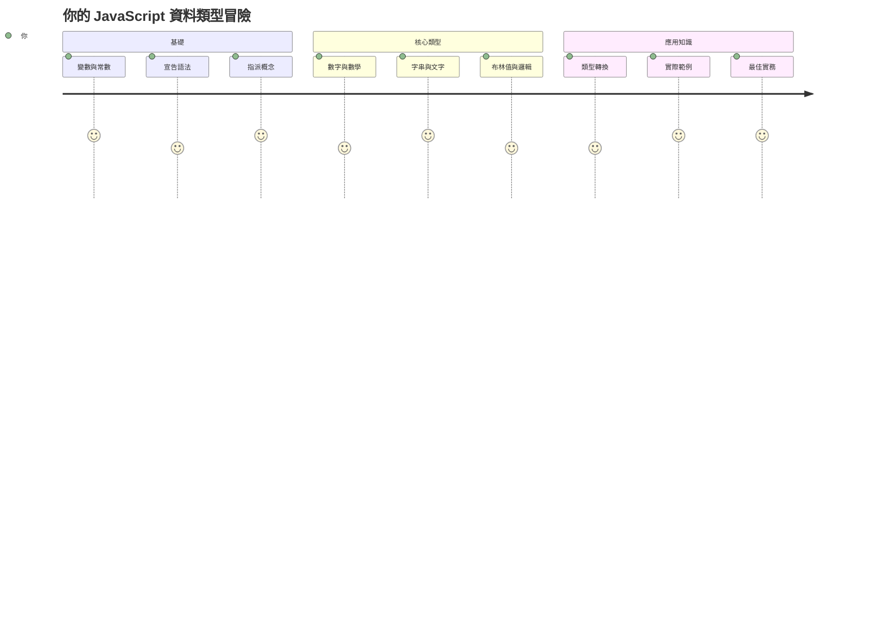
資料型別是 JavaScript 中的基本概念之一，您在每個撰寫的程式中都會遇到它。可以將資料型別想像成亞歷山卓圖書館古代圖書館員使用的歸檔系統——他們有特定的地方放置包含詩歌、數學和歷史記錄的捲軸。JavaScript 以類似的方式組織資訊，為不同種類的資料設立不同的類別。

在本課程中，我們將探討使 JavaScript 運作的核心資料型別。您將學習如何處理數字、文字、真假值，以及了解為什麼選擇正確的型別對您的程式至關重要。這些概念起初可能看起來抽象，但透過練習，它們將成為您的第二天性。

理解資料型別會讓 JavaScript 的其他部分更清晰。正如建築師需要了解不同的建築材料，才能建造一座大教堂，這些基礎知識將支持您將來的每一個建設。

## 課前測驗
[課前測驗](https://ff-quizzes.netlify.app/web/)

本課程涵蓋 JavaScript 的基本知識，JavaScript 是提供網頁互動功能的語言。

> 您可以在 [Microsoft Learn](https://docs.microsoft.com/learn/modules/web-development-101-variables/?WT.mc_id=academic-77807-sagibbon) 上參加此課程！

[](https://youtube.com/watch?v=JNIXfGiDWM8 "JavaScript 中的變數")

[](https://youtube.com/watch?v=AWfA95eLdq8 "JavaScript 中的資料型別")

> 🎥 點擊上方圖片觀看關於變數和資料型別的影片

讓我們從變數和填充它們的資料型別開始吧！

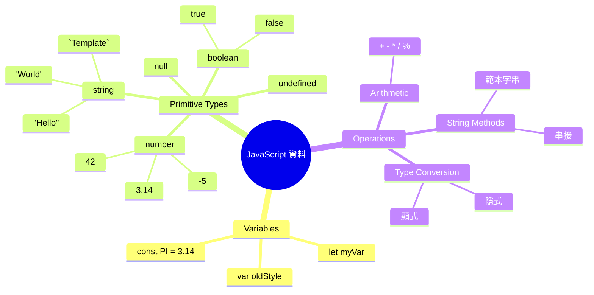
## 變數

變數是程式設計中的基本建構塊。就像中世紀煉金術士用來存放不同物質的標籤罐，變數讓您能儲存資訊，並賦予具描述性的名稱，以便後續參考。需要記住某人的年齡嗎？將它存放在名為 `age` 的變數中。想追蹤使用者名稱？把它放在名為 `userName` 的變數中。

我們將專注於 JavaScript 中建立變數的現代方法。您在這裡學到的技術是多年語言演變及程式社群最佳實踐的結晶。

建立和**宣告**變數的語法為 **[關鍵字] [名稱]**，由兩部分組成：

- **關鍵字**。使用 `let` 表示可以變更的變數，或 `const` 表示不會改變的值。
- **變數名稱**，由您自行選擇的具描述性名稱。

✅ `let` 關鍵字於 ES6 中引入，賦予變數所謂的 _區塊作用域_。建議使用 `let` 或 `const` 替代舊的 `var` 關鍵字。我們會在後續章節更深入探討區塊作用域。

### 任務 - 操作變數

1. **宣告一個變數**。讓我們從建立第一個變數開始：

    ```javascript
    let myVariable;
    ```

   **這段程式的意義：**
   - 這告訴 JavaScript 建立一個名為 `myVariable` 的儲存空間
   - JavaScript 為此變數在記憶體中分配空間
   - 該變數目前沒有值（undefined）

2. **賦值給它**。現在讓我們將內容放入變數中：

    ```javascript
    myVariable = 123;
    ```

   **賦值的運作方式：**
   - `=` 運算子將 123 指派給我們的變數
   - 變數現在包含這個值，不再是未定義
   - 您可以在程式中以 `myVariable` 參考此值

   > 注意：本課程中 `=` 的用法是「指派運算子」，用於設定變數的值，而非代表相等。

3. **聰明地操作**。實際上，我們可以將這兩個步驟合併：

    ```javascript
    let myVariable = 123;
    ```

    **這種方式更有效率：**
    - 您同時宣告變數並賦值於一個語句中
    - 這是開發者的標準作法
    - 縮短程式碼長度，同時保持清晰度

4. **改變想法**。如果想儲存不同的數字怎麼辦？

   ```javascript
   myVariable = 321;
   ```

   **理解重新賦值：**
   - 變數現在包含 321，取代了 123
   - 先前的值被覆蓋—變數一次只能存一個值
   - 這種可變性是使用 `let` 宣告的關鍵特性

   ✅ 試試看！您可以直接在瀏覽器中撰寫 JavaScript。打開瀏覽器並進入開發者工具。在主控台中，輸入 `let myVariable = 123`，按下 Enter，接著輸入 `myVariable`。結果是什麼？注意，您會在後續課程中進一步學習這些概念。

### 🧠 **變數掌握檢測：養成熟練感**

**來看看您對變數的理解程度：**
- 您能解釋宣告和賦值變數的差別嗎？
- 如果嘗試在宣告之前使用變數會發生什麼？
- 什麼時候會選用 `let` 代替 `const`？

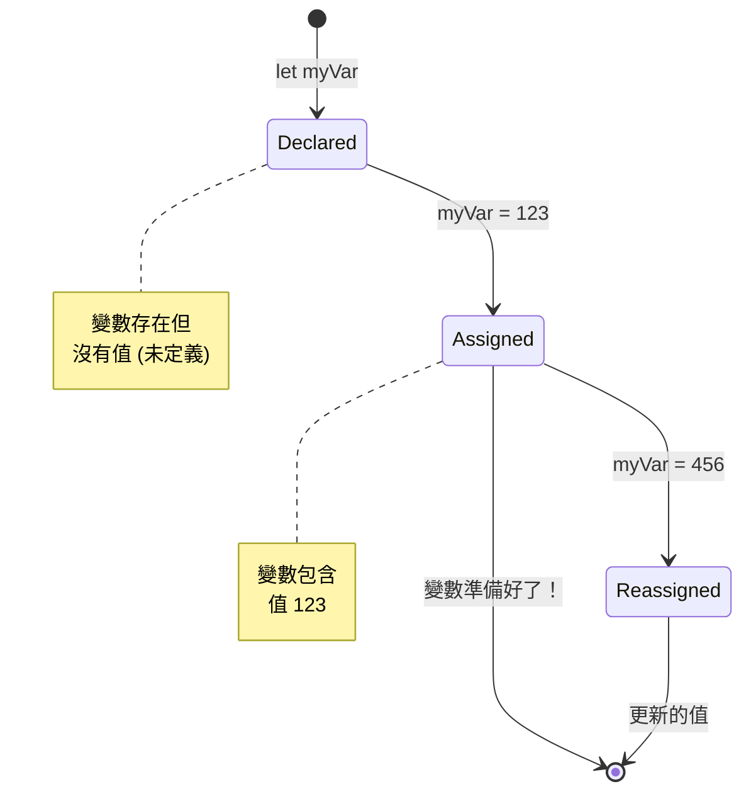
> **快速提示**：想像變數是貼有標籤的儲存箱。您建立箱子（`let`）、放入內容（`=`），如有需要，之後還可以更換內容！

## 常數

有時您需要儲存執行期間絕對不會改變的資訊。想像常數就像古希臘歐幾里得制定的數學原理——一旦被證明與記載，將固定不變成為永遠參考的標準。

常數與變數相似，但有個重要限制：一旦賦值，值就不能被更改。這種不可變性有助於避免程式中重要值的意外修改。

宣告與初始化常數與變數的概念相同，但使用 `const` 關鍵字。常數通常以全大寫字母命名。

```javascript
const MY_VARIABLE = 123;
```

**此段程式做了什麼：**
- **建立**名為 `MY_VARIABLE` 的常數，值為 123
- **採用**常數的全大寫命名慣例
- **防止**未來對該值的任何修改

常數有兩大規則：

- **必須立刻賦值**——不允許空的常數！
- **值不能更改**——若嘗試更改，JavaScript 會報錯。看看範例：

   **簡單值** - 以下寫法不被允許：
   
      ```javascript
      const PI = 3;
      PI = 4; // 不被允許
      ```

   **要記得：**
   - **嘗試**重新指派常數會發生錯誤
   - **保護**重要值不被意外更動
   - **確保**整個程式中數值保持一致
 
   **物件參考不可變** - 以下寫法也不被允許：
   
      ```javascript
      const obj = { a: 3 };
      obj = { b: 5 } // 不被允許
      ```

   **這裡的概念是：**
   - **防止**整個物件被替換成另一個新物件
   - **保護**原始物件的參考
   - **維持**記憶體中物件的唯一身份

    **物件的內容值可變** - 以下寫法是被允許的：
    
      ```javascript
      const obj = { a: 3 };
      obj.a = 5;  // 被允許
      ```

      **說明發生了什麼：**
      - **更改**物件內屬性的值
      - **保留**相同的物件參考
      - **展示**物件的內容可變，但參考不可變

   > 注意，`const` 是指參考不可被重新指定。但是值不一定是「不可變」的，特別是在複雜結構如物件的情況。

## 資料型別

JavaScript 將資訊分門別類，稱為資料型別。這個概念類似古代學者歸納知識的方法——亞里斯多德區分不同推理類型，知道邏輯原則不能一視同仁地套用於詩歌、數學和自然哲學。

資料型別很重要，因為不同運算適用於不同類型的資訊。就如同您無法對人名進行算術運算，或對數學方程式排序，JavaScript 也需要適合每個運算的資料型別。理解這點可避免錯誤並讓程式更穩健。

變數可以存放多種不同類型的值，例如數字與文字。這些不同的值類型稱為**資料型別**。資料型別是軟體開發的重要部分，它幫助開發者決定程式如何撰寫以及軟體如何執行。此外，某些資料型別具有獨特特性，能幫助轉換或擷取值中的額外資訊。

✅ 資料型別亦稱為 JavaScript 原始資料型別，因為它們是語言提供的最基礎的資料型別。共有七種原始型別：string、number、bigint、boolean、undefined、null 與 symbol。花點時間想像這些原始型別代表什麼。`zebra` 是什麼？`0` 呢？`true` 是什麼？

### 數字

數字是 JavaScript 中最直觀的資料型別。不論是整數如 42、帶小數點的 3.14，或是負數如 -5，JavaScript 都以統一方式處理。

還記得先前的變數嗎？我們儲存的 123 實際上是數字型別：

```javascript
let myVariable = 123;
```

**主要特性：**
- JavaScript 會自動識別數值
- 您可用這些變數做數學運算
- 不需要明確宣告型別

變數能儲存所有類型的數字，包括小數和負數。數字也可以搭配算術運算子使用，下一節會介紹此主題。

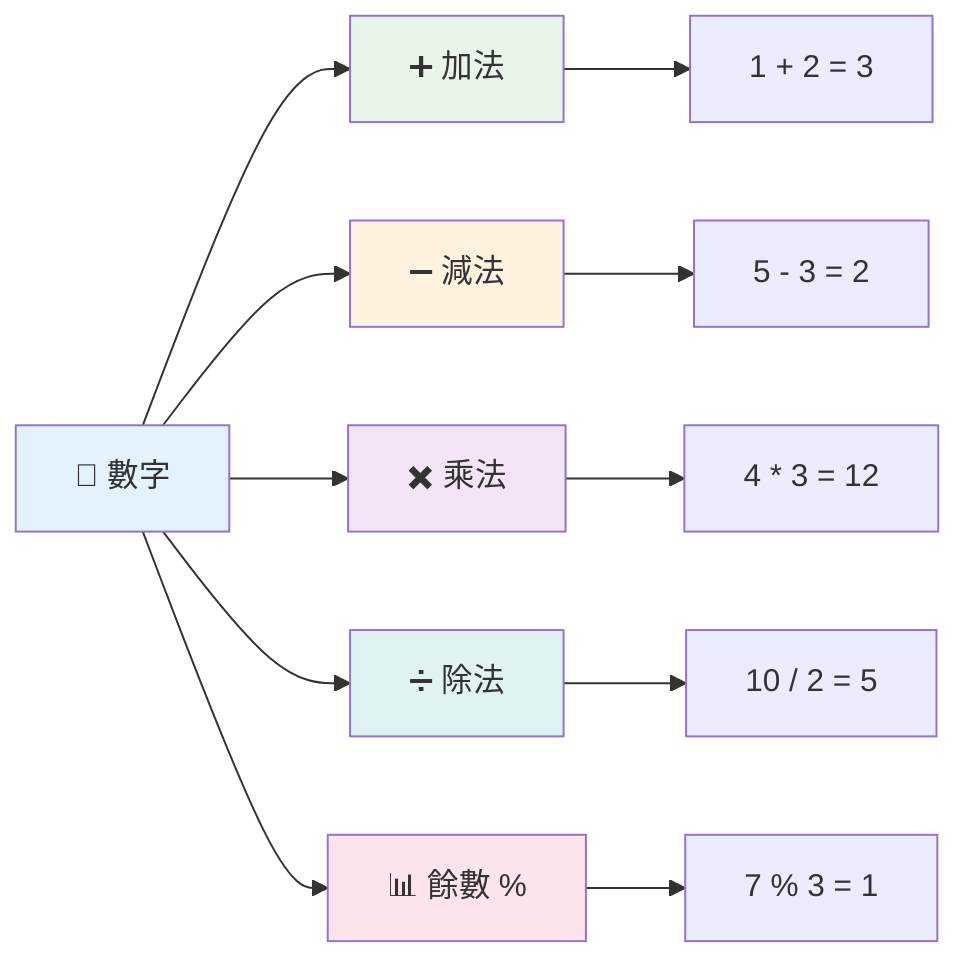
### 算術運算子

算術運算子允許您在 JavaScript 中進行數學計算。這些運算符與數學家世世代代使用的符號相同——類似阿爾花剌子密發展代數符號的方式。

這些運算符的運作方式與傳統算術一致：`+` 表加法，`-` 表減法，以此類推。

以下是幾種常見的算術運算子：

| 符號   | 說明                                                                    | 範例                             |
| ------ | ---------------------------------------------------------------------- | -------------------------------- |
| `+`    | **加法**：計算兩數字的和                                                | `1 + 2 //預期結果是 3`            |
| `-`    | **減法**：計算兩數字的差                                                | `1 - 2 //預期結果是 -1`           |
| `*`    | **乘法**：計算兩數字的積                                                | `1 * 2 //預期結果是 2`            |
| `/`    | **除法**：計算兩數字的商                                                | `1 / 2 //預期結果是 0.5`          |
| `%`    | **餘數**：計算兩數字相除後的餘數                                        | `1 % 2 //預期結果是 1`            |

✅ 試試看！在瀏覽器主控台試做一個算術運算。結果讓您驚訝嗎？

### 🧮 **數學技能檢測：自信計算**

**測試您的算術理解：**
- `/`（除法）與 `%`（餘數）的差異是什麼？
- 您能預測 `10 % 3` 等於多少嗎？（提示：不是 3.33...）
- 餘數運算子在程式設計中可能有什麼用途？

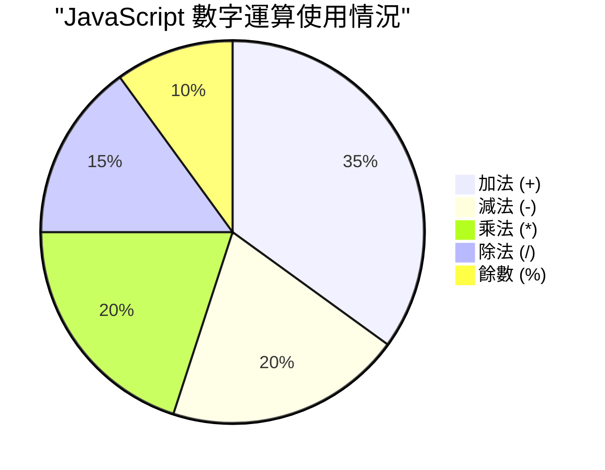
> **實務洞察**：餘數運算子（%）非常適合檢查數字是奇數還是偶數、創造模式，或在陣列中循環！

### 字串

在 JavaScript 中，文字資料用字串表示。字串這個詞源自將字元串連的概念，就像中世紀修道院抄寫員將字母串連成詞句和句子一樣。

字串是網頁開發的基礎。網站上顯示的每一段文字——使用者名稱、按鈕標籤、錯誤訊息、內容——都以字串形式處理。理解字串是建立功能性使用者介面的關鍵。

字串是套在單引號或雙引號之間的一組字元。

```javascript
'This is a string'
"This is also a string"
let myString = 'This is a string value stored in a variable';
```

**理解這些概念：**
- **使用**單引號 `'` 或雙引號 `"` 定義字串
- **儲存**可包含字母、數字與符號的文字資料
- **賦值**字串給變數以便後續使用
- **需要**用引號區別字串與變數名稱

記得在撰寫字串時使用引號，否則 JavaScript 會把它當成變數名。

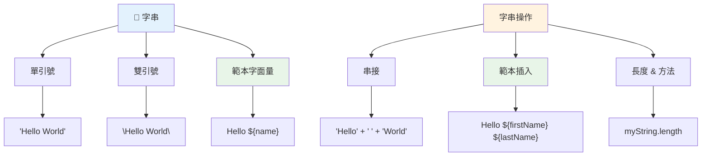
### 字串格式化

字串操作讓您合併文字、結合變數，並創造會隨程式狀態變化的動態內容。此技巧使您能以程式化方式建構文字。

常常需要將多個字串串接在一起——這個過程稱為連接（concatenation）。
要**串接**兩個或多個字串，或將它們連接在一起，使用 `+` 運算子。

```javascript
let myString1 = "Hello";
let myString2 = "World";

myString1 + myString2 + "!"; //哈囉世界！
myString1 + " " + myString2 + "!"; //哈囉 世界！
myString1 + ", " + myString2 + "!"; //哈囉，世界！
```

**一步步來，以下是發生了什麼事情：**
- **使用** `+` 運算子將多個字串 **結合**
- **直接** 將字串連接在一起，第一個範例沒有空格
- **在字串間加入** 空白字元 `" "` 以增進可讀性
- **插入** 標點符號如逗號，來創造適當的格式

✅ 為什麼在 JavaScript 之中 `1 + 1 = 2`，但是 `'1' + '1' = 11` 呢？想一想。那 `'1' + 1` 呢？

**範本字串**是另一種格式化字串的方法，只是用的是反引號（backtick）而非引號。任何不是純文字的內容必須放在 `${ }` 佔位符裡面。這包括任何可能是字串的變數。

```javascript
let myString1 = "Hello";
let myString2 = "World";

`${myString1} ${myString2}!` //哈囉，世界！
`${myString1}, ${myString2}!` //哈囉，世界！
```

**讓我們理解各個部分：**
- **使用** 反引號 `` ` `` 代替一般引號來建立範本字串
- **直接嵌入** 變數，利用 `${}` 佔位符語法
- **保持** 空格和格式與原文一致
- **提供** 一種更乾淨的方式來建立包含變數的複雜字串

你可以使用任一方式達成格式化目的，但範本字串會尊重所有空格和換行。

✅ 何時會使用範本字串而非普通字串？

### 🔤 **字串熟練度檢查：文字操作信心**

**評估你的字串技能：**
- 你能解釋為什麼 `'1' + '1'` 等於 `'11'` 而不是 `2` 嗎？
- 你覺得哪種字串方法較具可讀性：串接還是範本字串？
- 如果忘記在字串周圍加引號會發生什麼事情？

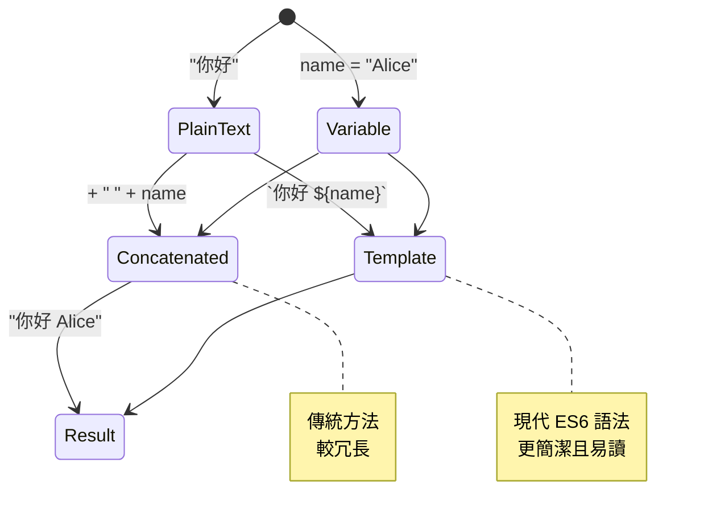
> **專家秘訣**：範本字串通常在建構複雜字串時更受青睞，因為它們更為可讀且能完美處理多行字串！

### 布林值

布林值代表最簡單的資料形式：它只能有兩種值之一 —— `true` 或 `false`。這個二元邏輯系統可追溯自 19 世紀數學家 George Boole 的布林代數。

儘管它們很簡單，布林值對於程式邏輯至關重要。它們讓程式能根據條件做出決策——用戶是否登入、按鈕是否被點擊、或是否符合某些條件。

布林值只能是 `true` 或 `false`。布林值可以協助判斷當特定條件成立時，哪些程式碼行應該執行。許多情況下，[運算子](../../../../2-js-basics/1-data-types)協助設定布林值的內容，你也會常見到變數被初始化或其值透過運算子被更新。

```javascript
let myTrueBool = true;
let myFalseBool = false;
```

**如上所示，我們：**
- **建立** 一個變數來儲存布林值 `true`
- **示範** 如何儲存布林值 `false`
- **使用** 正確的關鍵字 `true` 和 `false`（不需要引號）
- **準備** 這些變數以供條件判斷使用

✅ 如果變數評估為布林 `true`，就可視為“truthy”。有趣的是，在 JavaScript 中，[所有值都是 truthy，除非被定義為 falsy](https://developer.mozilla.org/docs/Glossary/Truthy)。

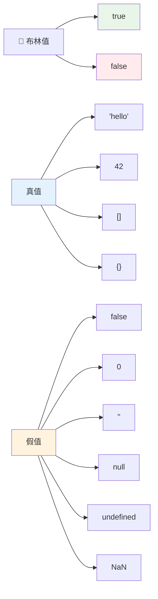
### 🎯 **布林邏輯檢查：決策能力**

**測試你的布林理解：**
- 你認為為什麼 JavaScript 除了 `true` 和 `false` 外，還有 "truthy" 和 "falsy" 的概念？
- 你能判斷以下哪個是假值 (falsy) 嗎：`0`、`"0"`、`[]`、`"false"`？
- 布林值如何幫助控制程式流程？

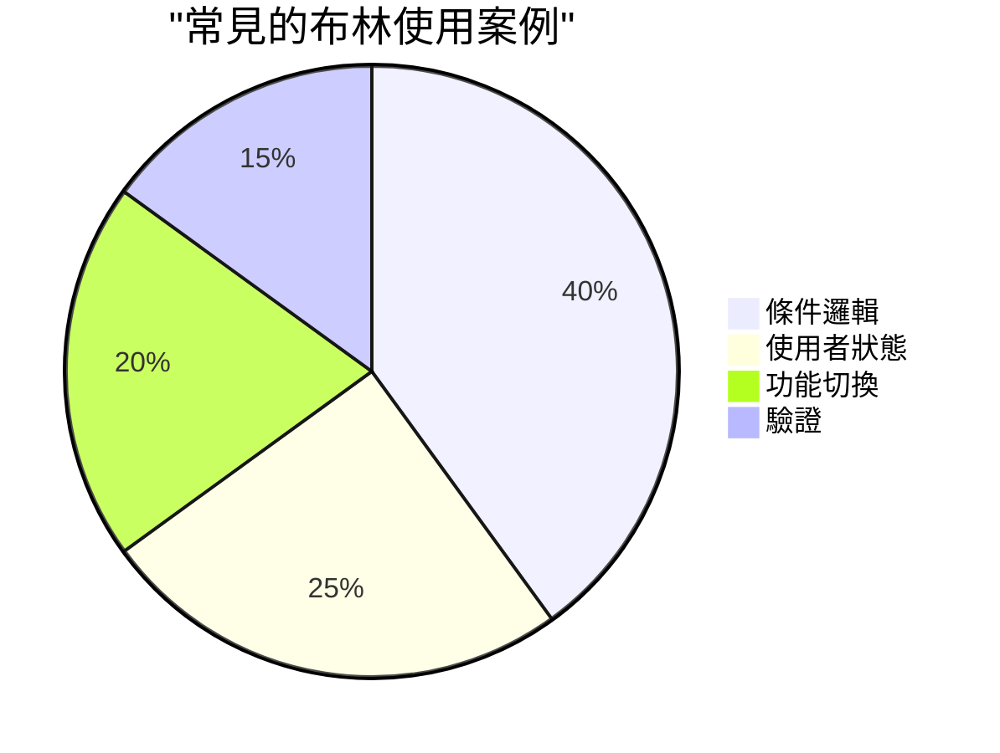
> **記住**：在 JavaScript 中，只有 6 個 falsy 值：`false`、`0`、`""`、`null`、`undefined` 和 `NaN`。其它全是 truthy！

---

## 📊 **你的資料型別工具包總結**

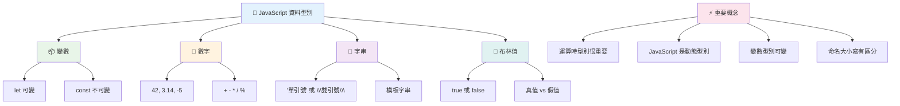
## GitHub Copilot Agent 挑戰 🚀

利用 Agent 模式完成以下挑戰：

**描述：** 創建一個個人資訊管理器，展現本課程中學到的所有 JavaScript 資料型別，同時處理真實世界的資料場景。

**提示：** 建立一個 JavaScript 程式，創建一個使用者資料物件，包含：姓名（字串）、年齡（數字）、是否為學生（布林值）、喜愛顏色陣列，以及含有街道、城市和郵遞區號的地址物件。包含函式來顯示個人資料資訊及更新各欄位。確保示範字串串接、範本字串、使用年齡進行的算術運算，以及學生狀態的布林邏輯。

想了解更多 [agent mode](https://code.visualstudio.com/blogs/2025/02/24/introducing-copilot-agent-mode)。

## 🚀 挑戰

JavaScript 有些行為會讓開發者措手不及。以下是經典範例：試著在瀏覽器主控台輸入：`let age = 1; let Age = 2; age == Age` 並觀察結果。它回傳 `false` — 你能判斷為什麼嗎？

這代表許多值得瞭解的 JavaScript 行為之一。熟悉這些細節有助於你寫出更穩健的程式碼，並更有效地除錯。

## 課後小測驗
[課後小測驗](https://ff-quizzes.netlify.app)

## 複習與自學

看看[這份 JavaScript 練習清單](https://css-tricks.com/snippets/javascript/)並嘗試其中一項。你學到了什麼？

## 作業

[資料型別練習](assignment.md)

## 🚀 你的 JavaScript 資料型別精通時間線

### ⚡ **接下來 5 分鐘你可以做什麼**
- [ ] 打開瀏覽器主控台，建立三個不同資料型別的變數
- [ ] 嘗試挑戰：`let age = 1; let Age = 2; age == Age`，並搞懂為什麼會是 false
- [ ] 練習用你的名字和愛好數字做字串串接
- [ ] 試試看數字和字串相加時會發生什麼

### 🎯 **接下來一小時你可以完成什麼**
- [ ] 完成課後小測驗並複習任何不清楚的概念
- [ ] 建立一個迷你計算機，能做加減乘除兩數運算
- [ ] 用範本字串建立一個簡單的姓名格式化程式
- [ ] 探索 `==` 與 `===` 比較運算子之間的差異
- [ ] 練習不同資料型別的互轉

### 📅 **你的一週 JavaScript 基礎**
- [ ] 帶著自信和創意完成作業
- [ ] 建立個人資料物件，使用全部學到的資料型別
- [ ] 練習 [CSS-Tricks 的 JavaScript 練習題](https://css-tricks.com/snippets/javascript/)
- [ ] 用布林邏輯建立簡單的表單驗證器
- [ ] 嘗試陣列和物件資料型別（下一課預告）
- [ ] 加入 JavaScript 社群並詢問關於資料型別的問題

### 🌟 **你的一個月轉變**
- [ ] 將資料型別知識整合到大型程式專案裡
- [ ] 理解在實務中何時、為什麼使用每個資料型別
- [ ] 幫助其他初學者理解 JavaScript 基礎
- [ ] 建立一個管理不同類型使用者資料的小型應用程式
- [ ] 探索進階資料型別概念，如型別強制轉換與嚴格相等
- [ ] 透過文件改善，為開源 JavaScript 專案做出貢獻

### 🧠 **終極資料型別精通檢視**

**慶祝你的 JavaScript 基礎：**
- 哪種資料型別的行為讓你最感意外？
- 你對於向朋友講解變數與常數的舒服程度如何？
- 在 JavaScript 的型別系統裡，你發現最有趣的事情是什麼？
- 你能想像用這些基本概念打造哪種實際應用程式？

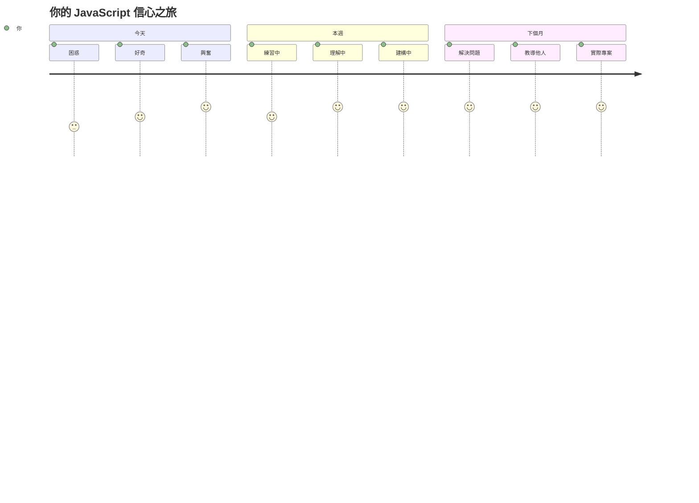
> 💡 **基礎已建立！** 了解資料型別就像學會字母，然後開始寫故事。你未來寫的每個 JavaScript 程式都會用到這些基礎概念。你現在擁有建構互動網站、動態應用，以及以程式解決真實問題的基石。歡迎進入奇妙的 JavaScript 世界！ 🎉

---

<!-- CO-OP TRANSLATOR DISCLAIMER START -->
**免責聲明**：  
本文件係使用 AI 翻譯服務 [Co-op Translator](https://github.com/Azure/co-op-translator) 進行翻譯。雖然我們力求準確，但請注意自動翻譯可能包含錯誤或不準確之處。原始文件的母語版本應被視為權威來源。對於重要資訊，建議採用專業人工翻譯。對於因使用本翻譯而產生的任何誤解或誤譯，我們概不負責。
<!-- CO-OP TRANSLATOR DISCLAIMER END -->