<!--
CO_OP_TRANSLATOR_METADATA:
{
  "original_hash": "c688385d15dd3645e924ea0ffee8967f",
  "translation_date": "2026-01-06T13:30:46+00:00",
  "source_file": "2-js-basics/3-making-decisions/README.md",
  "language_code": "tw"
}
-->
# JavaScript 基礎：做出決策


> 筆記圖示由 [Tomomi Imura](https://twitter.com/girlie_mac) 製作

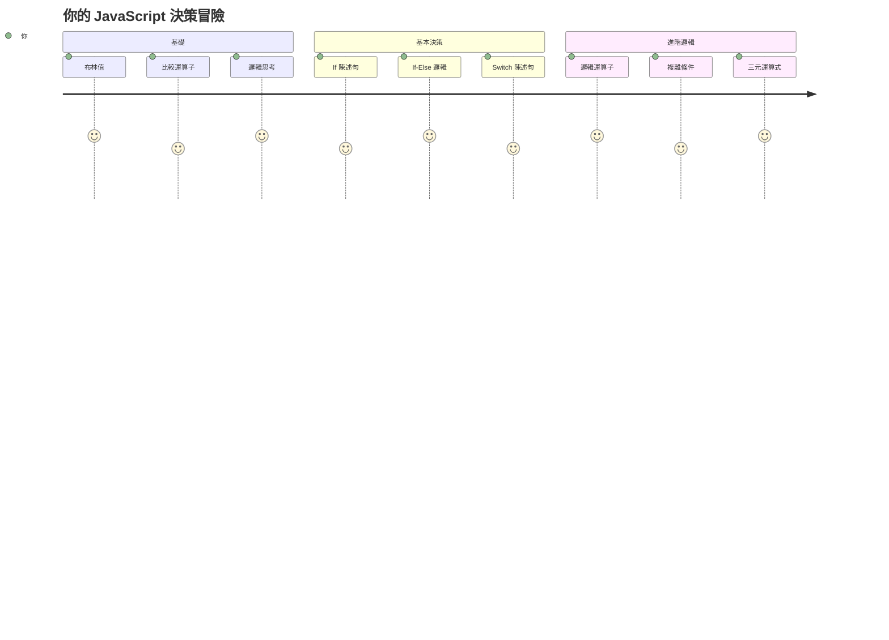
你是否曾好奇應用程式如何做出聰明的決定？例如導航系統如何選擇最快路線，或者恆溫器如何決定何時開啟暖氣？這是程式設計中決策制定的基本概念。

正如查爾斯·巴貝奇的分析機設計用於根據條件執行不同的運算序列，現代 JavaScript 程式也需要根據不同情況做出選擇。這種分支與決策的能力，將靜態代碼轉變為具回應性的智慧型應用程式。

在本課程中，你將學會如何在程式中實作條件邏輯。 我們將探討條件語句、比較運算子和邏輯表達式，讓程式可以評估情況並適當回應。

## 課前小測

[課前小測](https://ff-quizzes.netlify.app/web/quiz/11)

做出決策並控制程式流程的能力是程式撰寫的基本面向。這個章節涵蓋如何使用布林值和條件邏輯控制 JavaScript 程式的執行路徑。

[](https://youtube.com/watch?v=SxTp8j-fMMY "做出決策")

> 🎥 點擊上方圖片觀看關於做出決策的影片。

> 你也可以在 [Microsoft Learn](https://docs.microsoft.com/learn/modules/web-development-101-if-else/?WT.mc_id=academic-77807-sagibbon) 上修習這門課！

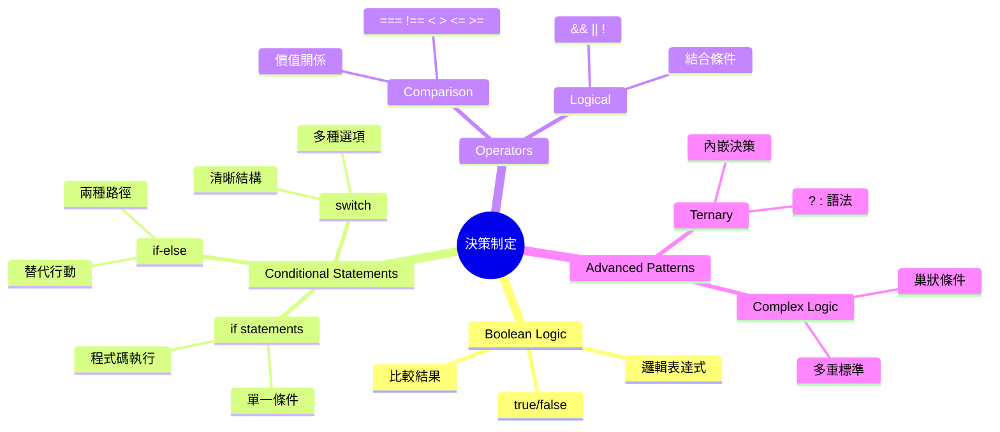
## 布林值簡介回顧

在探討決策之前，讓我們回顧先前課程中的布林值。這個名稱來自數學家喬治·布爾 (George Boole)，表示二元狀態——`true` 或 `false`。沒有模糊地帶，沒有中間值。

這些二元值是所有計算邏輯的基礎。程式所做的每個決策，最終都歸結於布林評估。

建立布林變數非常簡單：

```javascript
let myTrueBool = true;
let myFalseBool = false;
```

這樣會建立兩個具有明確布林值的變數。

✅ 布林值是以英國數學家、哲學家與邏輯學家喬治·布爾 (1815–1864) 的名字命名。

## 比較運算子與布林值

實務上，你很少會手動設置布林值。你會透過評估條件來生成它們：「這個數字是否大於那個？」或是「這些值是否相等？」

比較運算子可用來進行這些評估。它們比較數值，並根據運算元之間的關係回傳布林結果。

| 符號    | 描述                                                                                                                                                       | 範例               |
| ------ | ----------------------------------------------------------------------------------------------------------------------------------------------------------- | ------------------ |
| `<`    | **小於**：比較兩個值，若左側值小於右側則回傳 `true`                                                                                                         | `5 < 6 // true`    |
| `<=`   | **小於或等於**：比較兩個值，若左側值小於或等於右側則回傳 `true`                                                                                             | `5 <= 6 // true`   |
| `>`    | **大於**：比較兩個值，若左側值大於右側則回傳 `true`                                                                                                        | `5 > 6 // false`   |
| `>=`   | **大於或等於**：比較兩個值，若左側值大於或等於右側則回傳 `true`                                                                                             | `5 >= 6 // false`  |
| `===`  | **嚴格相等**：比較兩個值，若左右兩側值相等且資料型態相同，回傳 `true`                                                                                      | `5 === 6 // false` |
| `!==`  | **不等於**：比較兩個值，回傳嚴格相等回傳值的相反布林值                                                                                                   | `5 !== 6 // true`  |

✅ 透過在瀏覽器的主控台撰寫一些比較運算，檢驗你的理解。有回傳結果讓你感到意外嗎？

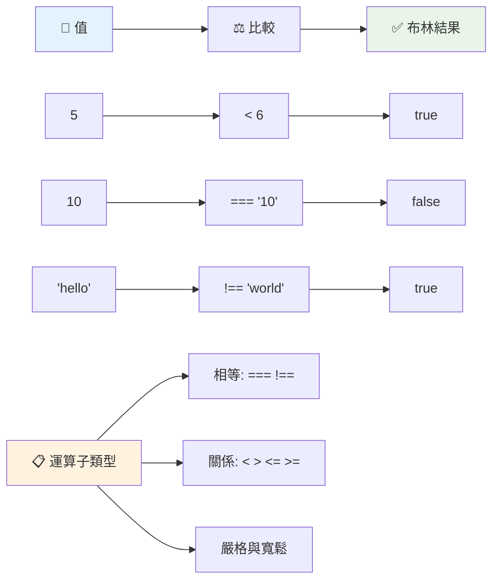
### 🧠 **比較運算理解測試：掌握布林邏輯**

**測試你的比較知識：**
- 為什麼普遍推薦使用 `===`（嚴格相等）而非 `==`（寬鬆相等）？
- 你能預測 `5 === '5'` 會回傳什麼嗎？`5 == '5'` 呢？
- `!==` 與 `!=` 的差別是什麼？

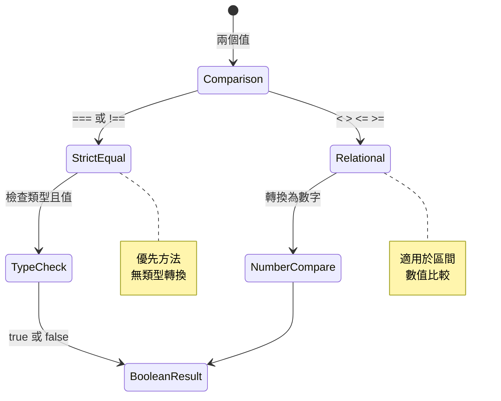
> **專家秘訣**：除非特別需要型別轉換，否則永遠使用 `===` 和 `!==` 來檢查等於與不等於。這可防止意外行為！

## If 陳述式

`if` 陳述式就像向程式問問題。「如果這個條件為真，那就執行這件事。」這很可能是你在 JavaScript 中做決策時最重要的工具。

運作方式如下：

```javascript
if (condition) {
  // 條件為真。此區塊中的程式碼將會執行。
}
```

條件放在括號中，如果結果是 `true`，JavaScript 就會執行大括號裡的程式碼；若是 `false`，JavaScript 則會跳過整個區塊。

你經常會使用比較運算子來建立條件，讓我們來看個實例：

```javascript
let currentMoney = 1000;
let laptopPrice = 800;

if (currentMoney >= laptopPrice) {
  // 條件為真。此區塊中的程式碼將會執行。
  console.log("Getting a new laptop!");
}
```

因為 `1000 >= 800` 評估結果為 `true`，區塊裡的程式執行，在主控台顯示「Getting a new laptop!」。

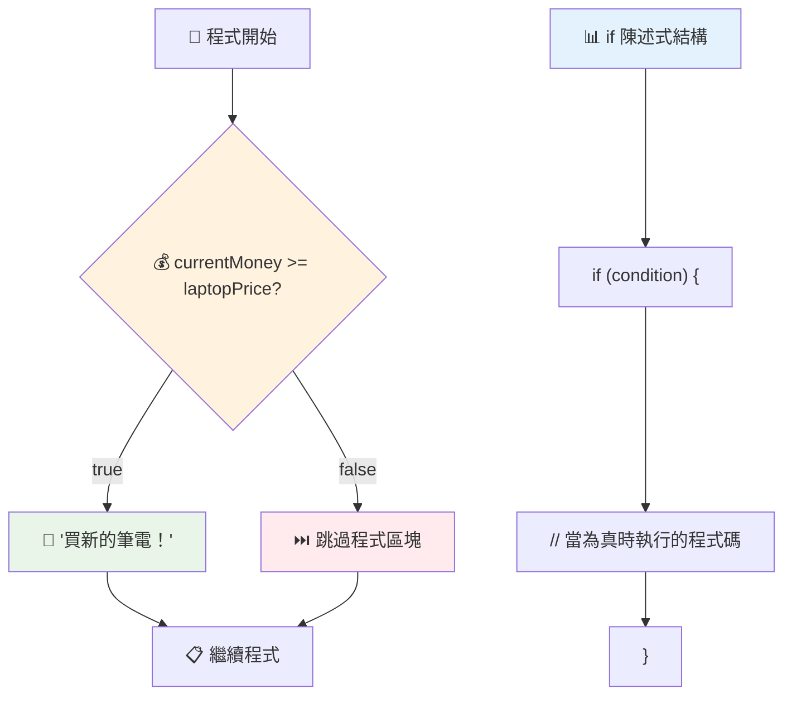
## If..Else 陳述式

那麼，如果你希望條件是 `false` 時執行不同的程式呢？這就是 `else` 的用武之地，有點像預備方案。

`else` 陳述式讓你可以這麼說：「如果這個條件不成立，那就執行另外這件事。」

```javascript
let currentMoney = 500;
let laptopPrice = 800;

if (currentMoney >= laptopPrice) {
  // 條件為真。該區塊中的程式碼將會執行。
  console.log("Getting a new laptop!");
} else {
  // 條件為假。該區塊中的程式碼將會執行。
  console.log("Can't afford a new laptop, yet!");
}
```

現在因為 `500 >= 800` 是 `false`，JavaScript 就會跳過第一個區塊，執行 `else` 裡的程式碼。你會在主控台看到「Can't afford a new laptop, yet!」。

✅ 透過在瀏覽器主控台執行這段程式與以下程式，驗證你是否理解此行為。改變 currentMoney 和 laptopPrice 變數的值，看看 `console.log()` 顯示結果如何變化。

### 🎯 **If-Else 邏輯檢視：分支路徑**

**評估你的條件邏輯理解：**
- 如果 `currentMoney` 等於剛好等於 `laptopPrice`，會發生什麼事？
- 你能想到實際情境中何時會用到 if-else 邏輯嗎？
- 你會如何擴充程式以處理多個價格區間？

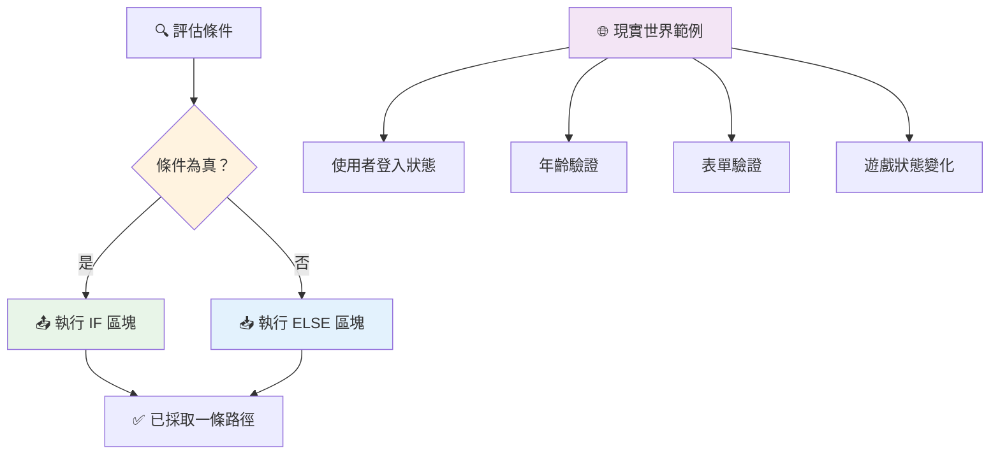
> **重要觀念**：if-else 確保只有一條路徑被選擇。這保證你的程式對任何條件都會有回應！

## Switch 陳述式

有時你需要將一個值與多個選項做比較。雖然可以串接多個 `if..else`，但是這樣寫起來非常繁瑣。`switch` 陳述式提供了更清晰的結構來處理多個離散值。

該概念類似早期電話交換機的機械切換系統——一個輸入值決定執行的特定路徑。

```javascript
switch (expression) {
  case x:
    // 程式碼區塊
    break;
  case y:
    // 程式碼區塊
    break;
  default:
    // 程式碼區塊
}
```

結構如下：
- JavaScript 先評估表達式一次
- 逐一檢查每個 `case` 是否匹配
- 找到匹配時，執行該區塊程式碼
- `break` 告訴 JavaScript 停止並離開 switch
- 若沒有任何 case 匹配，執行 `default` 區塊（如果有的話）

```javascript
// 使用 switch 陳述式判斷星期幾的程式
let dayNumber = 2;
let dayName;

switch (dayNumber) {
  case 1:
    dayName = "Monday";
    break;
  case 2:
    dayName = "Tuesday";
    break;
  case 3:
    dayName = "Wednesday";
    break;
  default:
    dayName = "Unknown day";
    break;
}
console.log(`Today is ${dayName}`);
```

在此例中，JavaScript 看到 `dayNumber` 為 `2`，找到對應的 `case 2`，將 `dayName` 設為「Tuesday」，然後跳出 switch。結果是「Today is Tuesday」被輸出到主控台。

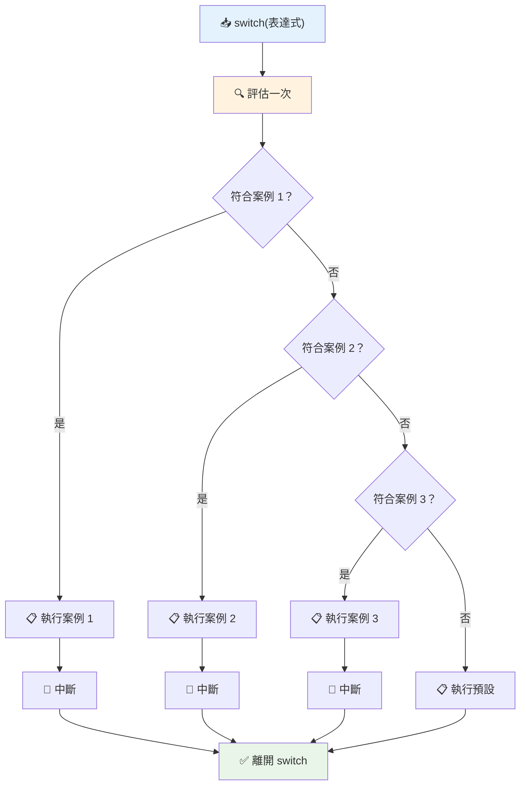
✅ 透過在瀏覽器主控台執行這段程式與以下程式，驗證你是否理解，改變變數 a 的值看看 `console.log()` 顯示結果。

### 🔄 **Switch 陳述式精通：多選項**

**測試你對 switch 的認識：**
- 忘記撰寫 `break` 會怎麼樣？
- 什麼時候你會用 `switch` 而不是多個 `if-else`？
- 為什麼 `default` 案例即使你認為已涵蓋所有可能，也很有用？

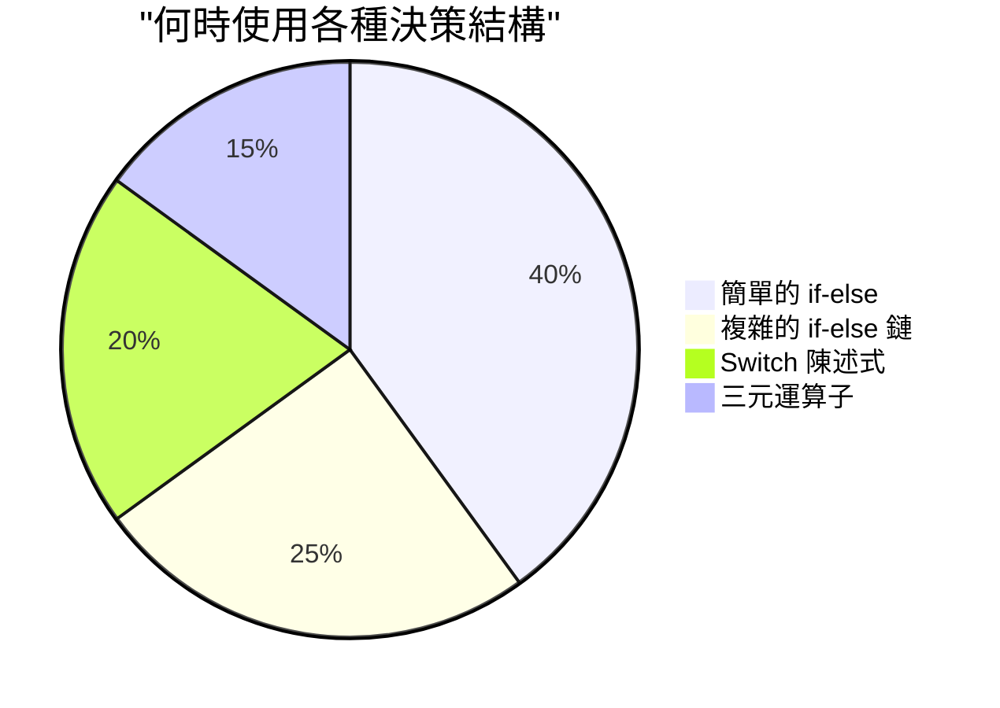
> **最佳實踐**：當比較單一變數與多個特定值時，使用 `switch`。複雜條件或區間檢查則用 `if-else`！

## 邏輯運算子與布林值

複雜決策通常需要同時評估多個條件。正如布林代數協助數學家結合邏輯表達式，程式設計語言提供邏輯運算子來串接多個布林條件。

這些運算子讓你能將簡單的真／假評估組合成複雜的條件邏輯。

| 符號    | 描述                                                                                       | 範例                                                                       |
| ------ | ----------------------------------------------------------------------------------------- | -------------------------------------------------------------------------- |
| `&&`   | **邏輯與**：比較兩個布林表達式。只有當兩側皆為真時才回傳真                               | `(5 > 3) && (5 < 10) // 兩側皆為真，回傳 true`                            |
| `\|\|` | **邏輯或**：比較兩個布林表達式。只要其中至少有一側為真即回傳真                         | `(5 > 10) \|\| (5 < 10) // 一側為假，另一側為真，回傳 true`               |
| `!`    | **邏輯非**：回傳布林表達式的相反值                                                     | `!(5 > 10) // 5 不大於 10，"!" 使結果為 true`                             |

這些運算子讓你可以以實用的方式結合條件：
- AND (`&&`) 表示兩條件都必須為真
- OR (`||`) 表示至少一條件為真  
- NOT (`!`) 將真變假（反之亦然）

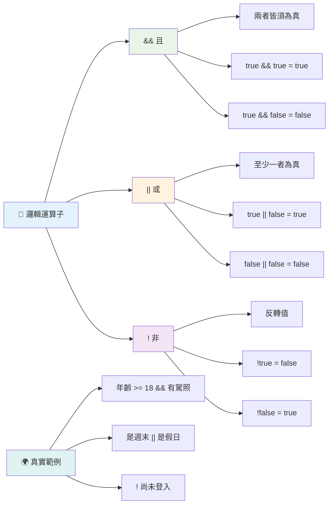
## 使用邏輯運算子做條件和決策

用更實際的範例看看邏輯運算子的運作：

```javascript
let currentMoney = 600;
let laptopPrice = 800;
let laptopDiscountPrice = laptopPrice - (laptopPrice * 0.2); // 筆記型電腦價格打八折

if (currentMoney >= laptopPrice || currentMoney >= laptopDiscountPrice) {
  // 條件為真。此區塊中的程式碼將會執行。
  console.log("Getting a new laptop!");
} else {
  // 條件為假。此區塊中的程式碼將會執行。
  console.log("Can't afford a new laptop, yet!");
}
```

在此範例中：我們計算 20% 折扣後的價格（640），接著評估我們是否有足夠的資金支付全額或折扣價。600 沒有達到折扣價 640 閥值，因此條件評估結果是 `false`。

### 🧮 **邏輯運算子檢視：結合條件**

**測試你的邏輯運算子理解：**
- 在表達式 `A && B` 中，若 A 為假，B 會被執行嗎？
- 你能想到什麼情況需要同時用到三個運算子（&&、||、!）嗎？
- `!user.isActive` 和 `user.isActive !== true` 有何不同？

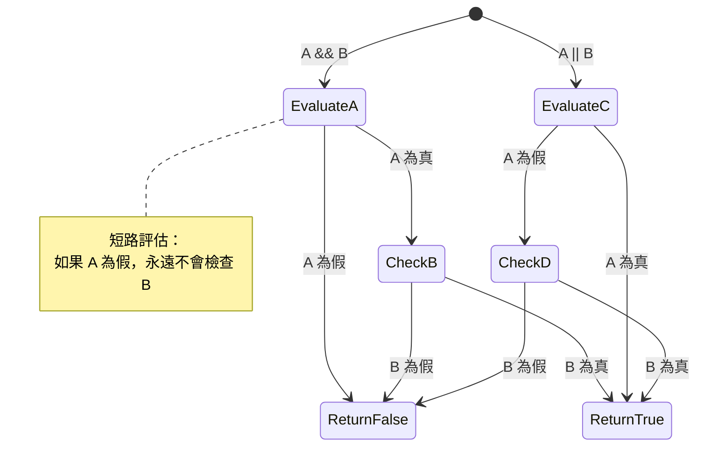
> **效能提示**：JavaScript 使用「短路求值」- 在 `A && B` 中，如果 A 是假，B 甚至不會被執行。善用此特性！

### 否定運算子

有時比較容易思考「某件事不成立的狀態」。譬如不是問「使用者是否已登入？」而是問「使用者是否尚未登入？」感嘆號（`!`）運算子便可幫你反轉邏輯。

```javascript
if (!condition) {
  // 當條件為假時執行
} else {
  // 當條件為真時執行
}
```

`!` 運算子就像說「相反的...」— 若為真，`!` 使其為假，反之亦然。

### 三元運算式

針對簡單條件賦值，JavaScript 提供了**三元運算子**。這精簡的語法可以在一行內寫出條件表達式，在你需要根據條件賦予兩個值中其中一個時非常方便。

```javascript
let variable = condition ? returnThisIfTrue : returnThisIfFalse;
```

它的語意像個問題：「條件成立嗎？如果是，使用這個值。若否，使用那個值。」

下面是比較實際的範例：

```javascript
let firstNumber = 20;
let secondNumber = 10;
let biggestNumber = firstNumber > secondNumber ? firstNumber : secondNumber;
```

✅ 花點時間多讀幾遍這段程式，了解運算子如何運作。

這行的意義在說：「`firstNumber` 是否大於 `secondNumber`？如果成立，將 `firstNumber` 指派給 `biggestNumber`，否則將 `secondNumber` 指派給 `biggestNumber`。」

三元運算子是傳統 `if..else` 陳述式的簡寫：

```javascript
let biggestNumber;
if (firstNumber > secondNumber) {
  biggestNumber = firstNumber;
} else {
  biggestNumber = secondNumber;
}
```

兩者結果相同。三元運算子比較簡潔，而傳統if-else結構在條件複雜時可能較易讀。

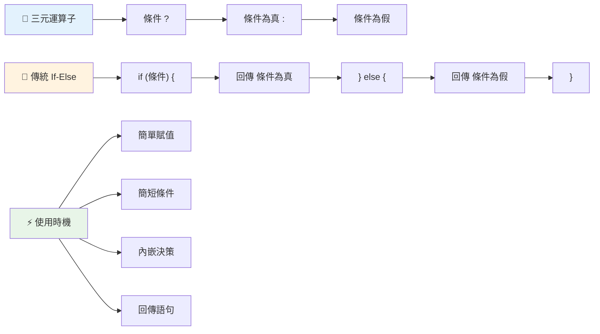
---


## 🚀 挑戰

創建一段程式，先用邏輯運算子撰寫，再用三元運算式改寫。你偏好哪種語法？

---

## GitHub Copilot 代理人挑戰 🚀

使用代理人模式完成以下挑戰：

**描述：** 創建一個完整的成績計算器，展現本課涵蓋的多個決策概念，包括 if-else 陳述式、switch 陳述式、邏輯運算子和三元運算式。

**提示：** 撰寫一個 JavaScript 程式，輸入學生的數值成績（0-100），並依據以下標準判定其等第：
- A：90-100
- B：80-89  
- C：70-79
- D：60-69
- F：60 以下

需求：
1. 使用 if-else 陳述式來判斷等第
2. 使用邏輯運算子檢查學生是否及格（grade >= 60）且有榮譽（grade >= 90）  
3. 使用 switch 陳述式提供每個字母等級的具體反饋  
4. 使用三元運算子判斷學生是否有資格參加下一門課程（grade >= 70）  
5. 包含輸入驗證以確保成績介於 0 至 100 之間  

使用包含邊界值如 59、60、89、90 以及無效輸入的各種分數測試您的程式。  

在此處了解更多關於 [agent mode](https://code.visualstudio.com/blogs/2025/02/24/introducing-copilot-agent-mode) 的資訊。  


## 課後小測驗  

[課後小測驗](https://ff-quizzes.netlify.app/web/quiz/12)  

## 複習與自學  

閱讀更多關於使用者可用的各種運算子，請見 [MDN](https://developer.mozilla.org/docs/Web/JavaScript/Reference/Operators)。  

瀏覽 Josh Comeau 精彩的 [operator lookup](https://joshwcomeau.com/operator-lookup/)！  

## 作業  

[運算子](assignment.md)  

---

## 🧠 **您的決策工具包摘要**  

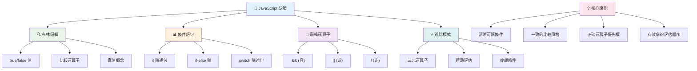
---

## 🚀 您的 JavaScript 決策精通時間表  

### ⚡ **接下來 5 分鐘您可以做的事**  
- [ ] 在瀏覽器主控台練習比較運算子  
- [ ] 撰寫一個簡單的 if-else 陳述式檢查您的年齡  
- [ ] 嘗試挑戰：使用三元運算子重寫 if-else  
- [ ] 測試不同「真值」及「假值」的結果  

### 🎯 **本小時內您可以完成的目標**  
- [ ] 完成課後測驗並複習任何令人困惑的概念  
- [ ] 從 GitHub Copilot 挑戰建立綜合計分計算器  
- [ ] 為真實情境（如選擇穿著）建立簡單決策樹  
- [ ] 練習結合多重條件與邏輯運算子  
- [ ] 嘗試針對不同使用場景使用 switch 陳述式  

### 📅 **您本週的邏輯精通路徑**  
- [ ] 利用創意範例完成運算子作業  
- [ ] 建立使用多種條件結構的迷你測驗應用程式  
- [ ] 建立可檢查多重輸入條件的表單驗證器  
- [ ] 練習 Josh Comeau 的 [operator lookup](https://joshwcomeau.com/operator-lookup/) 練習題  
- [ ] 重構既有程式碼使之使用更合適的條件結構  
- [ ] 研究短路評估與效能影響  

### 🌟 **您本月的轉型目標**  
- [ ] 精通複雜巢狀條件並維持程式碼可讀性  
- [ ] 建立具高度決策邏輯的應用程式  
- [ ] 透過改進既有專案的條件邏輯對開源做出貢獻  
- [ ] 教導他人不同條件結構及使用時機  
- [ ] 探索函式式程式設計方法於條件邏輯  
- [ ] 建立個人條件式最佳實踐參考指南  

### 🏆 **最終決策大師檢視**  

**慶祝您的邏輯思考精通：**  
- 您成功實作過最複雜的決策邏輯是什麼？  
- 哪種條件結構對您來說最自然？為什麼？  
- 學習邏輯運算子如何改變了您的問題解決方式？  
- 哪種真實世界應用會因此受益於複雜的決策邏輯？  

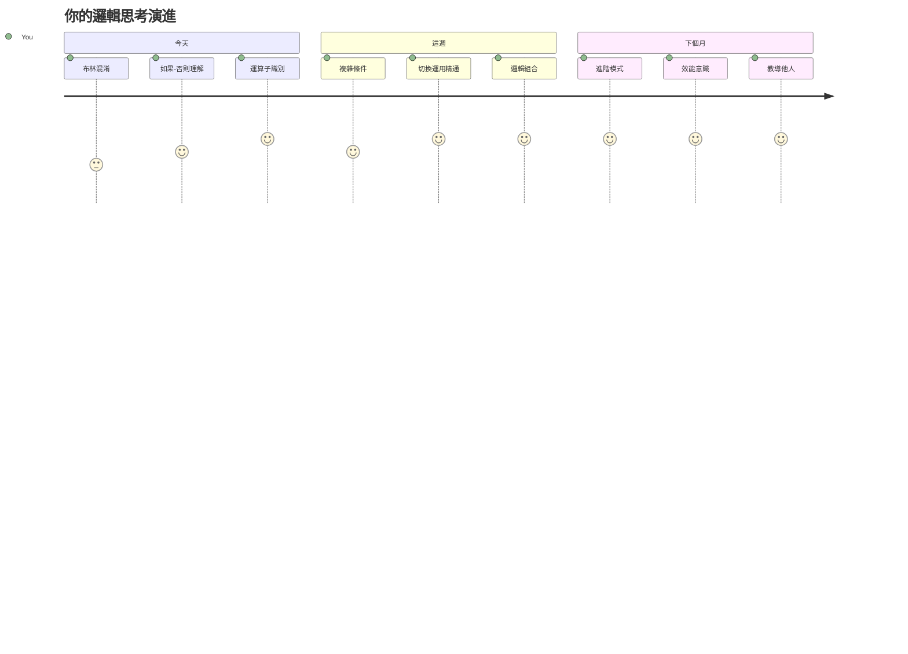
> 🧠 **您已精通數位決策藝術！** 每個互動應用程式都依賴條件邏輯來智能地回應用戶操作與變化的條件。您現在了解如何讓程式思考、評估並選擇適當的反應。這個邏輯基礎將驅動您所建立的每個動態應用程式！ 🎉

---

<!-- CO-OP TRANSLATOR DISCLAIMER START -->
**免責聲明**：  
本文件透過 AI 翻譯服務 [Co-op Translator](https://github.com/Azure/co-op-translator) 進行翻譯。雖然我們力求準確，但請注意自動翻譯可能包含錯誤或不準確之處。原始文件以其母語版本為權威依據。對於重要資訊，建議採用專業人工翻譯。我們不對因使用本翻譯而產生的任何誤解或誤釋負責。
<!-- CO-OP TRANSLATOR DISCLAIMER END -->