<!--
CO_OP_TRANSLATOR_METADATA:
{
  "original_hash": "1710a50a519a6e4a1b40a5638783018d",
  "translation_date": "2026-01-06T13:33:29+00:00",
  "source_file": "2-js-basics/4-arrays-loops/README.md",
  "language_code": "tw"
}
-->
# JavaScript 基礎：陣列與迴圈

  
> Sketchnote 由 [Tomomi Imura](https://twitter.com/girlie_mac) 製作

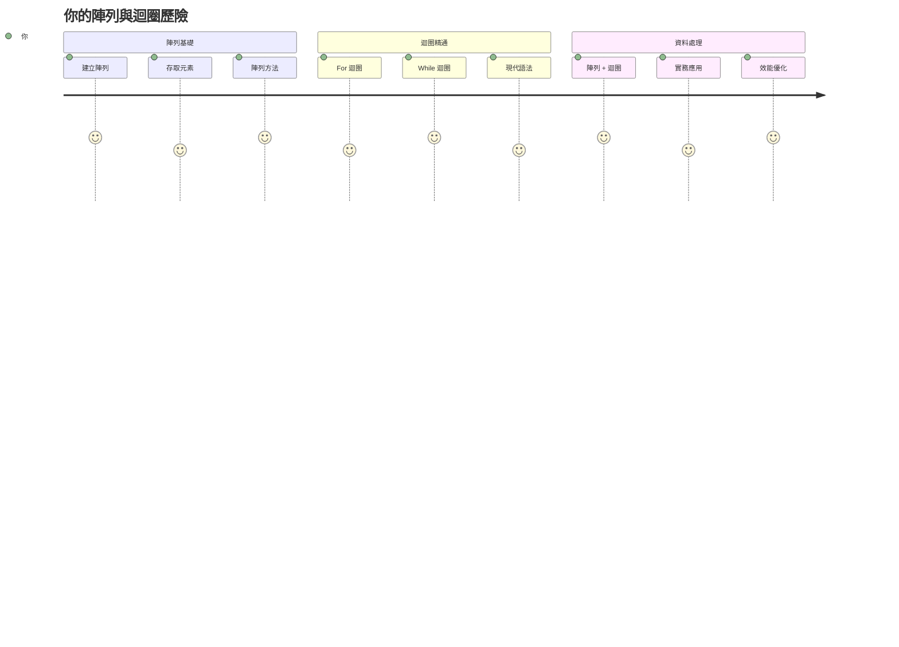
## 課前測驗  
[課前測驗](https://ff-quizzes.netlify.app/web/quiz/13)

你是否曾好奇網站如何追蹤購物車的商品或顯示你的好友列表？這正是陣列與迴圈派上用場的地方。陣列就像數位容器，可以容納多筆資訊；而迴圈則讓你有效率地處理這些資料，無需重複寫出相同的程式碼。

這兩個概念合起來構成了你程式處理資訊的基礎。你將學會如何從手動寫出每個步驟，進化到寫出智慧且高效率的程式碼，能快速處理數百甚至數千個項目。

在本課程結束時，你將明白如何用幾行程式碼完成複雜的資料工作。讓我們一起探索這些程式設計的必備概念。

[](https://youtube.com/watch?v=1U4qTyq02Xw "Arrays")

[](https://www.youtube.com/watch?v=Eeh7pxtTZ3k "Loops")

> 🎥 點擊上方圖片觀看陣列與迴圈相關影片。

> 你也可以在 [Microsoft Learn](https://docs.microsoft.com/learn/modules/web-development-101-arrays/?WT.mc_id=academic-77807-sagibbon) 上學習此課程！

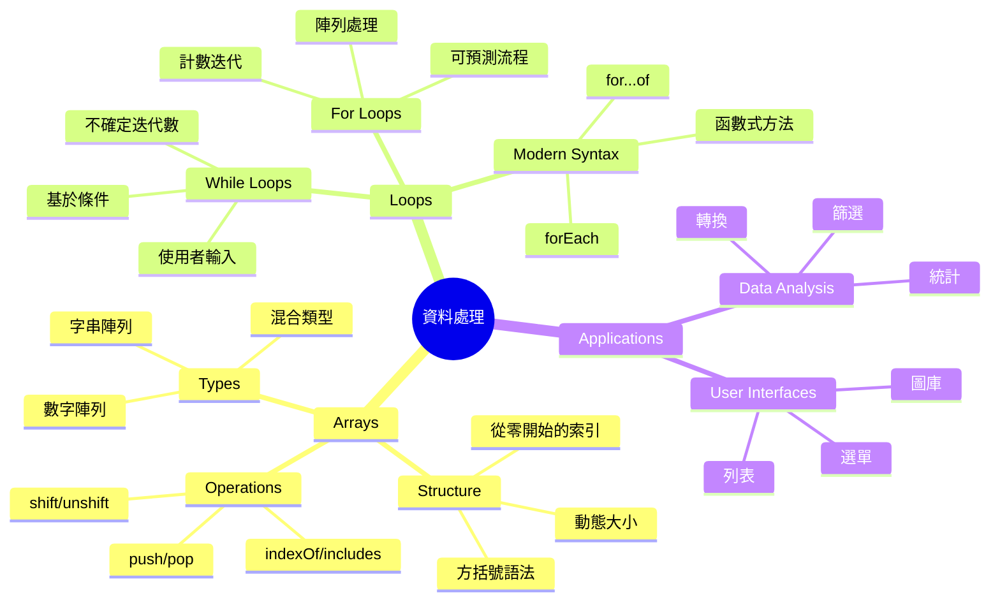
## 陣列

把陣列想像成數位檔案櫃 — 不是每個抽屜放一份文件，而是在一個結構化的容器中組織多個相關項目。用程式語言來說，陣列讓你能將多筆資訊存放在一個有序的整合包中。

無論你是在建立相片集、管理待辦清單，或追蹤遊戲高分，陣列都提供了資料組織的基礎。讓我們看看陣列的運作方式。

✅ 陣列就在你身邊！你能想到一個真實生活中的陣列例子嗎，例如太陽能板陣列？

### 建立陣列

建立陣列超簡單 — 用中括號就搞定！

```javascript
// 空陣列 - 就像一個空的購物車等待放入商品
const myArray = [];
```
  
**這裡發生了什麼？**  
你剛用中括號 `[]` 建立了一個空的容器，就像一個空的圖書架，可以放你想整理的任何書籍。

你也可以從一開始就填入初始值：

```javascript
// 你們冰淇淋店的口味菜單
const iceCreamFlavors = ["Chocolate", "Strawberry", "Vanilla", "Pistachio", "Rocky Road"];

// 使用者的個人資料資訊（混合不同類型的資料）
const userData = ["John", 25, true, "developer"];

// 你最喜歡的課程的考試成績
const scores = [95, 87, 92, 78, 85];
```
  
**注意事項：**  
- 你可以在同一陣列中存放文字、數字甚至真假值  
- 用逗號分隔每個項目 — 超簡單！  
- 陣列非常適合將相關資訊放在一起

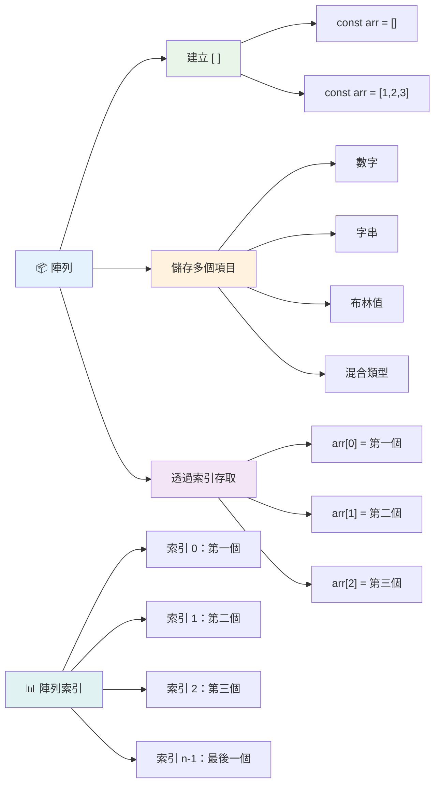
### 陣列索引

這裡有件事一開始可能覺得奇怪：陣列的索引從 0 開始，而不是 1。這種從零開始的索引源自電腦記憶體的運作方式 — 這是從像 C 語言這樣早期程式語言開始的慣例。陣列中每個位置都有一個稱作 **索引** 的地址號。

| 索引 | 值 | 說明 |
|-------|-------|-------------|
| 0 | "Chocolate" | 第一個元素 |
| 1 | "Strawberry" | 第二個元素 |
| 2 | "Vanilla" | 第三個元素 |
| 3 | "Pistachio" | 第四個元素 |
| 4 | "Rocky Road" | 第五個元素 |

✅ 陣列從索引 0 開始讓你驚訝嗎？在有些程式語言裡索引是從 1 開始。這背後有段有趣的歷史，你可以在 [維基百科](https://en.wikipedia.org/wiki/Zero-based_numbering) 詳細閱讀。

**存取陣列元素：**

```javascript
const iceCreamFlavors = ["Chocolate", "Strawberry", "Vanilla", "Pistachio", "Rocky Road"];

// 使用中括號表示法存取單一元素
console.log(iceCreamFlavors[0]); // "巧克力" - 第一個元素
console.log(iceCreamFlavors[2]); // "香草" - 第三個元素
console.log(iceCreamFlavors[4]); // "滿滿堅果冰淇淋" - 最後一個元素
```
  
**拆解下面的流程：**  
- **用** 中括號加索引存取元素  
- **回傳** 該位置存放的值  
- **從** 0 開始計數，第一個元素索引就是 0

**修改陣列元素：**

```javascript
// 更改現有值
iceCreamFlavors[4] = "Butter Pecan";
console.log(iceCreamFlavors[4]); // 「奶油胡桃」

// 在末尾新增元素
iceCreamFlavors[5] = "Cookie Dough";
console.log(iceCreamFlavors[5]); // 「餅乾生麵團」
```
  
**上述程式碼說明：**  
- **將** 索引為 4 的元素從 "Rocky Road" 改為 "Butter Pecan"  
- **新增** 索引為 5 的元素 "Cookie Dough"  
- **陣列長度** 自動擴充以容納新加入的元素

### 陣列長度與常用方法

陣列附帶內建屬性與方法，可以讓資料操作更簡單。

**取得陣列長度：**

```javascript
const iceCreamFlavors = ["Chocolate", "Strawberry", "Vanilla", "Pistachio", "Rocky Road"];
console.log(iceCreamFlavors.length); // 5

// 陣列變化時，長度會自動更新
iceCreamFlavors.push("Mint Chip");
console.log(iceCreamFlavors.length); // 6
```
  
**重點提醒：**  
- **回傳** 陣列中元素總數  
- **會隨** 新增或移除元素自動更新  
- **用於** 迴圈與驗證時提供動態計數

**常用陣列方法：**

```javascript
const fruits = ["apple", "banana", "orange"];

// 新增元素
fruits.push("grape");           // 新增至末尾：["apple", "banana", "orange", "grape"]
fruits.unshift("strawberry");   // 新增至開頭：["strawberry", "apple", "banana", "orange", "grape"]

// 移除元素
const lastFruit = fruits.pop();        // 移除並回傳 "grape"
const firstFruit = fruits.shift();     // 移除並回傳 "strawberry"

// 查找元素
const index = fruits.indexOf("banana"); // 回傳 1（"banana" 的位置）
const hasApple = fruits.includes("apple"); // 回傳 true
```
  
**理解這些方法：**  
- 用 `push()`（尾部）與 `unshift()`（頭部）新增元素  
- 用 `pop()`（尾部）與 `shift()`（頭部）移除元素  
- 用 `indexOf()` 查找元素，用 `includes()` 檢查是否存在  
- 提供移除元素或索引位置等有用資訊

✅ 自己試試看！在瀏覽器的主控台建立並操作你自己的陣列。

### 🧠 **陣列基礎檢測：資料組織**

**考考你對陣列的理解：**  
- 你覺得陣列為何從 0 開始計數，而不是 1？  
- 如果嘗試存取不存在的索引（例如在 5 個元素的陣列中存取 `arr[100]`）會怎樣？  
- 你能想到三個現實生活中會用到陣列的場景嗎？

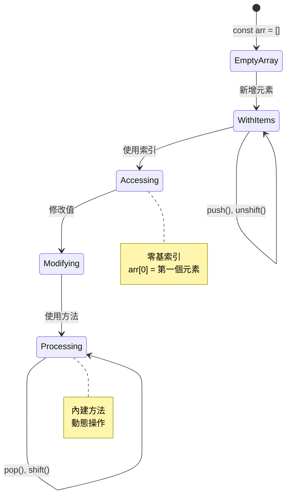
> **真實案例:** 陣列在程式中無處不在！社群媒體動態、購物車、相片集、播放清單歌曲 — 幕後其實都是陣列！

## 迴圈

把迴圈想像成在查爾斯‧狄更斯小說中寫字懲罰的場景，學生得反覆在石板上抄寫字句。想像你可以簡單下指令「寫這句話 100 次」，程式就能自動完成。迴圈就是為你的程式碼做到這點。

迴圈就像有位不知疲倦的助理，可以無誤重複工作。無論你需要檢查購物車每個項目、或是顯示相簿中所有照片，迴圈都能有效率地處理重複動作。

JavaScript 提供多種迴圈供選擇。讓我們逐一檢視，並了解何時使用。

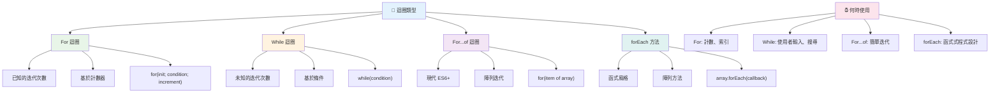
### For 迴圈

`for` 迴圈就像設定計時器 — 你知道確切次數要讓事情發生。結構清楚且可預測，最適合操作陣列或需要計數的場合。

**For 迴圈結構：**

| 元件 | 目的 | 範例 |
|-----------|---------|----------|
| **初始化** | 設定起始點 | `let i = 0` |
| **條件判斷** | 何時繼續 | `i < 10` |
| **遞增** | 如何更新 | `i++` |

```javascript
// 從0數到9
for (let i = 0; i < 10; i++) {
  console.log(`Count: ${i}`);
}

// 更實用的範例：處理分數
const testScores = [85, 92, 78, 96, 88];
for (let i = 0; i < testScores.length; i++) {
  console.log(`Student ${i + 1}: ${testScores[i]}%`);
}
```
  
**逐步說明：**  
- **在一開始** 初始化計數器 `i` 為 0  
- **每次** 執行前檢查條件 `i < 10`  
- **當條件為真時** 執行區塊程式  
- **每次迴圈後** 執行 `i++` 使 `i` 加 1  
- **當條件變假時**（`i` 達 10）停止迴圈

✅ 在瀏覽器主控台執行此程式碼。修改計數器、條件或遞增表達式會怎樣？能讓它倒數運作，變成倒數計時嗎？

### 🗓️ **For 迴圈精熟檢測：可控重複**

**評估你對 for 迴圈的理解：**  
- for 迴圈的三個部分是什麼？每個的功能為何？  
- 如何讓迴圈從陣列尾端往前執行？  
- 如果忘記遞增部分 (`i++`) 會發生什麼？

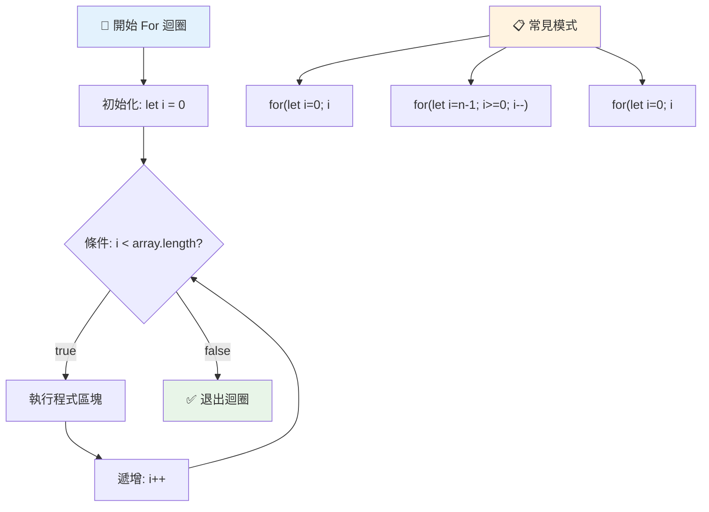
> **迴圈智慧:** 當你知道確切重複次數時，for 迴圈是最佳選擇，也是處理陣列最常用的型態！

### While 迴圈

`while` 迴圈就像說「持續做這件事直到...」— 你或許不知道會執行多少次，但知道何時停止。很適合問使用者輸入直到得到想要的資料，或搜尋資料直到找到目標。

**While 迴圈特色：**  
- **只要條件為真** 就繼續執行  
- **需手動管理** 計數器變數  
- **每次迭代前** 先檢查條件  
- **若條件永遠真** 有無限迴圈風險

```javascript
// 基本計數範例
let i = 0;
while (i < 10) {
  console.log(`While count: ${i}`);
  i++; // 別忘了遞增！
}

// 更實用的範例：處理使用者輸入
let userInput = "";
let attempts = 0;
const maxAttempts = 3;

while (userInput !== "quit" && attempts < maxAttempts) {
  userInput = prompt(`Enter 'quit' to exit (attempt ${attempts + 1}):`);
  attempts++;
}

if (attempts >= maxAttempts) {
  console.log("Maximum attempts reached!");
}
```
  
**解讀範例：**  
- **手動管理** 迴圈內的計數器 `i`  
- **遞增** 計數器避免無限迴圈  
- **展示** 透過使用者輸入與嘗試限制的實際用法  
- **內建** 防止無限執行的安全機制

### ♾️ **While 迴圈智慧檢測：基於條件的重複**

**測試你對 while 迴圈的了解：**  
- 使用 while 迴圈時主要風險是什麼？  
- 何時會選擇 while 迴圈而非 for 迴圈？  
- 如何避免無限迴圈？

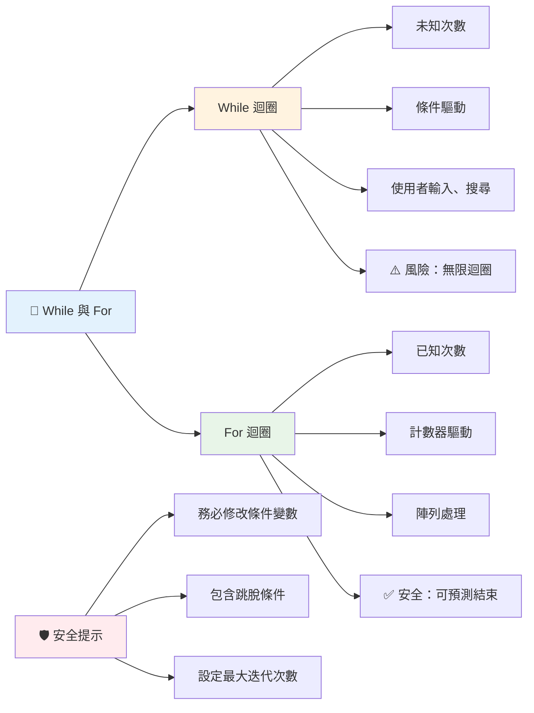
> **安全第一:** While 迴圈功能強大，但需謹慎管理條件。務必確保條件會最終變成假值！

### 現代迴圈替代方案

JavaScript 提供現代迴圈語法，使程式碼更易讀且降低錯誤。

**For...of 迴圈 (ES6+):**

```javascript
const colors = ["red", "green", "blue", "yellow"];

// 現代方法 - 更乾淨且更安全
for (const color of colors) {
  console.log(`Color: ${color}`);
}

// 與傳統的 for 迴圈比較
for (let i = 0; i < colors.length; i++) {
  console.log(`Color: ${colors[i]}`);
}
```
  
**for...of 的主要優點：**  
- **免除** 索引管理，減少 off-by-one 錯誤  
- **直接取得** 陣列元素  
- **提升** 程式碼可讀性，降低語法複雜度

**forEach 方法：**

```javascript
const prices = [9.99, 15.50, 22.75, 8.25];

// 使用 forEach 來實現函數式編程風格
prices.forEach((price, index) => {
  console.log(`Item ${index + 1}: $${price.toFixed(2)}`);
});

// 使用箭頭函數的 forEach 來進行簡單操作
prices.forEach(price => console.log(`Price: $${price}`));
```
  
**關於 forEach 的重點：**  
- **為陣列每個元素** 執行一段函式  
- **提供** 元素值與索引作為參數  
- **無法提前停止**（不同於傳統迴圈）  
- **回傳 undefined**（不會產生新陣列）

✅ 為何會選擇 for 迴圈而非 while 迴圈？在 StackOverflow 上有 1.7 萬人討論這話題，部分意見你可能會覺得有趣 [觀看討論](https://stackoverflow.com/questions/39969145/while-loops-vs-for-loops-in-javascript)。

### 🎨 **現代迴圈語法檢測：擁抱 ES6+**

**評估你對現代 JavaScript 的掌握度：**  
- `for...of` 相較於傳統 for 迴圈有什麼優點？  
- 在什麼時候你仍會偏好用傳統 for 迴圈？  
- `forEach` 與 `map` 有什麼差異？

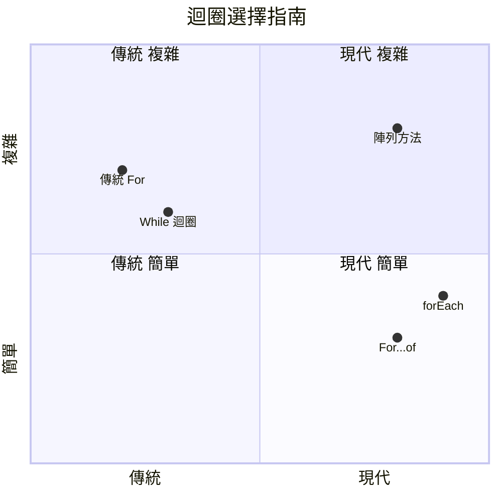
> **現代趨勢:** ES6+ 的 `for...of` 和 `forEach` 逐漸成為陣列遍歷首選，因為語法更簡潔且錯誤更少！

## 迴圈與陣列

陣列與迴圈結合可創造強大的資料處理能力。這對許多程式任務至關重要，從顯示清單到計算統計數據。

**傳統陣列處理：**

```javascript
const iceCreamFlavors = ["Chocolate", "Strawberry", "Vanilla", "Pistachio", "Rocky Road"];

// 經典的 for 迴圈方法
for (let i = 0; i < iceCreamFlavors.length; i++) {
  console.log(`Flavor ${i + 1}: ${iceCreamFlavors[i]}`);
}

// 現代的 for...of 方法
for (const flavor of iceCreamFlavors) {
  console.log(`Available flavor: ${flavor}`);
}
```
  
**理解不同方法：**  
- 用陣列長度屬性決定迴圈界限  
- 傳統 for 迴圈用索引存取元素  
- for...of 迴圈直接取得元素  
- 每個元素只處理一次

**實務資料處理範例：**

```javascript
const studentGrades = [85, 92, 78, 96, 88, 73, 89];
let total = 0;
let highestGrade = studentGrades[0];
let lowestGrade = studentGrades[0];

// 使用單一迴圈處理所有分數
for (let i = 0; i < studentGrades.length; i++) {
  const grade = studentGrades[i];
  total += grade;
  
  if (grade > highestGrade) {
    highestGrade = grade;
  }
  
  if (grade < lowestGrade) {
    lowestGrade = grade;
  }
}

const average = total / studentGrades.length;
console.log(`Average: ${average.toFixed(1)}`);
console.log(`Highest: ${highestGrade}`);
console.log(`Lowest: ${lowestGrade}`);
```
  
**程式碼運作說明：**  
- 初始化統計變數，用於加總與極值追蹤  
- 高效地遍歷每一個成績  
- 累積成績總和計算平均  
- 迴圈中同時記錄最高與最低分  
- 迴圈結束時計算出最終統計數據

✅ 在瀏覽器主控台用自己建立的陣列練習迴圈處理。

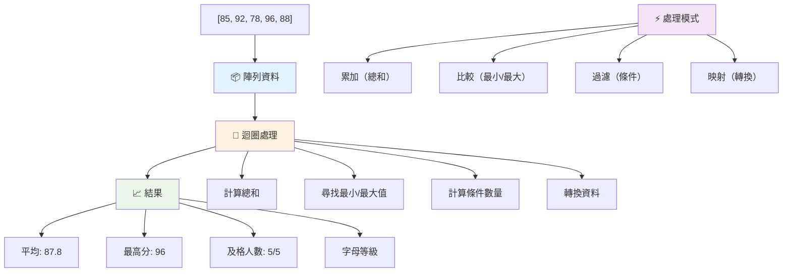
---

## GitHub Copilot Agent 挑戰 🚀

使用 Agent 模式完成下列挑戰：

**說明:** 建立一個結合陣列與迴圈的綜合資料處理函式，分析資料集並產生有意義的洞察。

**提示:** 建立一個名為 `analyzeGrades` 的函式，接受一個學生成績物件陣列（每個物件包含姓名與分數屬性），返回一個統計物件，包含最高分、最低分、平均分、及格人數（分數 >= 70）和高於平均分的學生姓名陣列。你的解決方案中至少要使用兩種不同的迴圈類型。

在此了解更多關於 [Agent 模式](https://code.visualstudio.com/blogs/2025/02/24/introducing-copilot-agent-mode)。

## 🚀 挑戰
JavaScript 提供了幾個現代陣列方法，可以取代特定任務的傳統迴圈。探索 [forEach](https://developer.mozilla.org/docs/Web/JavaScript/Reference/Global_Objects/Array/forEach)、[for-of](https://developer.mozilla.org/docs/Web/JavaScript/Reference/Statements/for...of)、[map](https://developer.mozilla.org/docs/Web/JavaScript/Reference/Global_Objects/Array/map)、[filter](https://developer.mozilla.org/docs/Web/JavaScript/Reference/Global_Objects/Array/filter) 和 [reduce](https://developer.mozilla.org/docs/Web/JavaScript/Reference/Global_Objects/Array/reduce)。

**你的挑戰：** 使用至少三種不同的陣列方法重構學生分數範例。注意隨著現代 JavaScript 語法，程式碼變得更加精簡且易讀。

## 課後小考
[課後小考](https://ff-quizzes.netlify.app/web/quiz/14)


## 複習與自學

JavaScript 的陣列附帶許多方法，在資料操作上非常有用。[閱讀這些方法](https://developer.mozilla.org/docs/Web/JavaScript/Reference/Global_Objects/Array) 並嘗試在你自己建立的陣列上使用它們（例如 push、pop、slice 和 splice）。

## 作業

[陣列迴圈](assignment.md)

---

## 📊 **你的陣列與迴圈工具總結**

```mermaid
graph TD
    A["🎯 陣列與迴圈精通"] --> B["📦 陣列基礎"]
    A --> C["🔄 迴圈類型"]
    A --> D["🔗 資料處理"]
    A --> E["🎨 現代技術"]
    
    B --> B1["建立: [ ]"]
    B --> B2["索引: arr[0]"]
    B --> B3["方法: push, pop"]
    B --> B4["屬性: length"]
    
    C --> C1["For: 已知迭代次數"]
    C --> C2["While: 條件控制"]
    C --> C3["For...of: 直接存取"]
    C --> C4["forEach: 函式式"]
    
    D --> D1["統計計算"]
    D --> D2["資料轉換"]
    D --> D3["篩選與搜尋"]
    D --> D4["即時處理"]
    
    E --> E1["箭頭函式"]
    E --> E2["方法串接"]
    E --> E3["解構賦值"]
    E --> E4["模板字面量"]
    
    F["💡 主要優點"] --> F1["高效資料處理"]
    F --> F2["減少程式碼重複"]
    F --> F3["可擴展的解決方案"]
    F --> F4["更簡潔的語法"]
    
    style A fill:#e3f2fd
    style B fill:#e8f5e8
    style C fill:#fff3e0
    style D fill:#f3e5f5
    style E fill:#e0f2f1
    style F fill:#fce4ec
```
---

## 🚀 你的陣列與迴圈精通時間表

### ⚡ **接下來 5 分鐘你可以做的事**
- [ ] 建立你最喜愛電影的陣列並存取特定元素
- [ ] 寫一個從 1 數到 10 的 for 迴圈
- [ ] 嘗試課程中的現代陣列方法挑戰
- [ ] 在瀏覽器主控台練習陣列索引

### 🎯 **這一小時內你可以完成的目標**
- [ ] 完成課後小考，複習挑戰性的概念
- [ ] 建立來自 GitHub Copilot 挑戰的完整成績分析器
- [ ] 建立一個簡單的購物車，能新增和移除商品
- [ ] 練習不同迴圈類型間的轉換
- [ ] 嘗試使用 `push`、`pop`、`slice` 和 `splice` 等陣列方法

### 📅 **你這週的資料處理旅程**
- [ ] 完成「陣列迴圈」作業並加入創意改良
- [ ] 使用陣列與迴圈建立待辦事項清單應用程式
- [ ] 建立一個簡單的數據統計計算器
- [ ] 練習使用 [MDN 陣列方法](https://developer.mozilla.org/docs/Web/JavaScript/Reference/Global_Objects/Array)
- [ ] 建立圖片庫或音樂播放清單介面
- [ ] 探索使用 `map`、`filter` 和 `reduce` 的函式式程式設計

### 🌟 **你這月的變革**
- [ ] 精通高級陣列操作與效能優化
- [ ] 建立完整的資料視覺化儀表板
- [ ] 參與開源數據處理專案
- [ ] 用實際範例教導他人陣列與迴圈
- [ ] 建立可重用的個人資料處理函式庫
- [ ] 探索以陣列建構的演算法與資料結構

### 🏆 **終極資料處理冠軍自我檢測**

**慶祝你對陣列與迴圈的精通：**
- 你學到的陣列操作中，哪項對真實世界應用最有用？
- 哪種迴圈類型你覺得最自然？為什麼？
- 理解陣列與迴圈後，你對組織資料的思考有何改變？
- 你接下來想挑戰什麼複雜的資料處理任務？

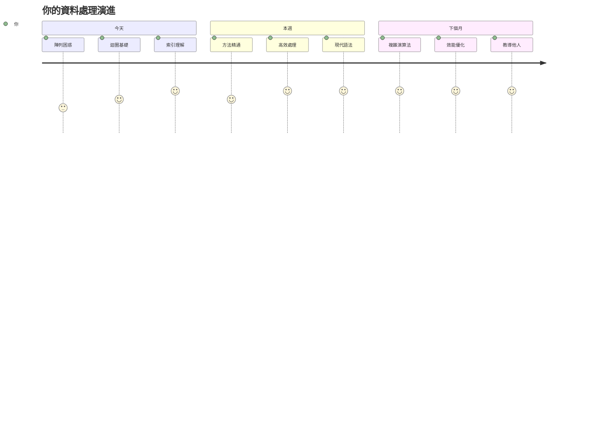
> 📦 **你已經解鎖資料組織與處理的力量！** 陣列與迴圈是你將建立的幾乎所有應用程式的基石。從簡單清單到複雜資料分析，你現在擁有有效且優雅處理資訊的工具。每個動態網站、行動應用和以資料為驅動的應用程式都依賴這些基本概念。歡迎來到可擴展資料處理的世界！🎉

---

<!-- CO-OP TRANSLATOR DISCLAIMER START -->
**免責聲明**：  
本文件由 AI 翻譯服務 [Co-op Translator](https://github.com/Azure/co-op-translator) 翻譯而成。雖然我們致力於確保翻譯的準確性，但請注意自動翻譯可能包含錯誤或不精確之處。原文文件的母語版本應被視為權威來源。對於重要資訊，建議尋求專業人工翻譯。我們不對因使用本翻譯而產生的任何誤解或誤用承擔責任。
<!-- CO-OP TRANSLATOR DISCLAIMER END -->