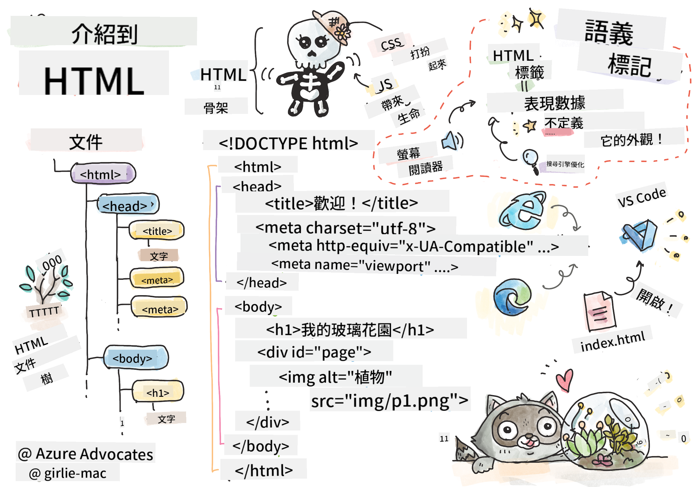
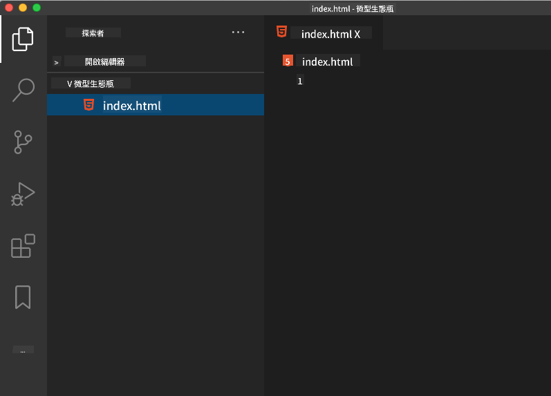

<!--
CO_OP_TRANSLATOR_METADATA:
{
  "original_hash": "89f7f9f800ce7c9f149e98baaae8491a",
  "translation_date": "2025-08-29T15:25:07+00:00",
  "source_file": "3-terrarium/1-intro-to-html/README.md",
  "language_code": "tw"
}
-->
# Terrarium 專案第一部分：HTML 入門


> [Tomomi Imura](https://twitter.com/girlie_mac) 的手繪筆記

## 課前測驗

[課前測驗](https://ff-quizzes.netlify.app/web/quiz/15)

> 觀看影片

> 
> [](https://www.youtube.com/watch?v=1TvxJKBzhyQ)

### 簡介

HTML（超文本標記語言）是網頁的「骨架」。如果說 CSS 是為 HTML「穿衣服」，JavaScript 是讓它「活起來」，那麼 HTML 就是網頁應用的「身體」。HTML 的語法甚至反映了這個概念，因為它包含了「head」、「body」和「footer」標籤。

在這節課中，我們將使用 HTML 來設計虛擬玻璃花園的界面「骨架」。界面將包含一個標題和三個欄位：左右兩側欄位放置可拖曳的植物，中間區域則是玻璃花園的主要部分。完成這節課後，您將能看到植物出現在欄位中，但界面可能看起來有些奇怪；別擔心，下一節課我們會使用 CSS 為界面添加樣式，使其更美觀。

### 任務

在您的電腦上建立一個名為「terrarium」的資料夾，並在其中建立一個名為「index.html」的檔案。您可以在 Visual Studio Code 中完成此操作：打開新的 VS Code 視窗，點擊「開啟資料夾」，導航到新資料夾，然後在 Explorer 面板中點擊小型「檔案」按鈕以建立新檔案：



或者

使用以下指令在 Git Bash 中完成：
* `mkdir terrarium`
* `cd terrarium`
* `touch index.html`
* `code index.html` 或 `nano index.html`

> index.html 檔案告訴瀏覽器它是資料夾中的預設檔案；例如，`https://anysite.com/test` 可能是由包含名為 `test` 的資料夾和其中的 `index.html` 檔案構建的；URL 中不一定會顯示 `index.html`。

---

## DocType 和 html 標籤

HTML 檔案的第一行是它的 DocType。這行需要放在檔案的最頂端，雖然看起來有些奇怪，但它告訴舊版瀏覽器需要以標準模式渲染頁面，遵循當前的 HTML 規範。

> 提示：在 VS Code 中，您可以將滑鼠懸停在標籤上，查看 MDN 參考指南中關於其用途的資訊。

第二行應該是 `<html>` 標籤的開啟標籤，接著是它的關閉標籤 `</html>`。這些標籤是界面的根元素。

### 任務

在您的 `index.html` 檔案頂部添加以下內容：

```HTML
<!DOCTYPE html>
<html></html>
```

✅ DocType 的設定可以通過查詢字串來確定不同的模式：[Quirks Mode 和 Standards Mode](https://developer.mozilla.org/docs/Web/HTML/Quirks_Mode_and_Standards_Mode)。這些模式曾用於支援非常舊的瀏覽器（如 Netscape Navigator 4 和 Internet Explorer 5），但現在通常不再使用。您可以使用標準的 DocType 聲明。

---

## 文件的「head」

HTML 文件的「head」區域包含關於網頁的重要資訊，也稱為[元數據](https://developer.mozilla.org/docs/Web/HTML/Element/meta)。在我們的例子中，我們告訴網頁伺服器以下四件事：

- 網頁的標題
- 頁面元數據，包括：
    - 字符集，告訴頁面使用的字符編碼
    - 瀏覽器資訊，包括 `x-ua-compatible`，指示支援 IE=edge 瀏覽器
    - 關於視窗加載時應如何行為的資訊。將視窗的初始縮放設置為 1 控制頁面首次加載時的縮放級別。

### 任務

在開啟和關閉的 `<html>` 標籤之間添加一個「head」區塊。

```html
<head>
	<title>Welcome to my Virtual Terrarium</title>
	<meta charset="utf-8" />
	<meta http-equiv="X-UA-Compatible" content="IE=edge" />
	<meta name="viewport" content="width=device-width, initial-scale=1" />
</head>
```

✅ 如果您像這樣設置視窗元標籤：`<meta name="viewport" content="width=600">`，會發生什麼？閱讀更多關於[視窗](https://developer.mozilla.org/docs/Web/HTML/Viewport_meta_tag)的資訊。

---

## 文件的 `body`

### HTML 標籤

在 HTML 中，您可以在 .html 檔案中添加標籤以創建網頁元素。每個標籤通常有開啟和關閉標籤，例如 `<p>hello</p>` 表示一段文字。通過在 `<html>` 標籤對內添加一組 `<body>` 標籤來創建界面的主體；您的標記現在看起來像這樣：

### 任務

```html
<!DOCTYPE html>
<html>
	<head>
		<title>Welcome to my Virtual Terrarium</title>
		<meta charset="utf-8" />
		<meta http-equiv="X-UA-Compatible" content="IE=edge" />
		<meta name="viewport" content="width=device-width, initial-scale=1" />
	</head>
	<body></body>
</html>
```

現在，您可以開始構建頁面。通常，您使用 `<div>` 標籤來創建頁面中的各個元素。我們將創建一系列 `<div>` 元素來包含圖片。

### 圖片

一個不需要關閉標籤的 HTML 標籤是 ``，因為它有一個 `src` 元素，包含頁面渲染項目所需的所有資訊。

在您的應用中建立一個名為 `images` 的資料夾，並將 [source code folder](../../../../3-terrarium/solution/images) 中的所有圖片添加到其中；（有 14 張植物圖片）。

### 任務

在 `<body></body>` 標籤之間的兩個欄位中添加這些植物圖片：

```html
<div id="page">
	<div id="left-container" class="container">
		<div class="plant-holder">
			
		</div>
		<div class="plant-holder">
			
		</div>
		<div class="plant-holder">
			
		</div>
		<div class="plant-holder">
			
		</div>
		<div class="plant-holder">
			
		</div>
		<div class="plant-holder">
			
		</div>
		<div class="plant-holder">
			
		</div>
	</div>
	<div id="right-container" class="container">
		<div class="plant-holder">
			
		</div>
		<div class="plant-holder">
			
		</div>
		<div class="plant-holder">
			
		</div>
		<div class="plant-holder">
			
		</div>
		<div class="plant-holder">
			
		</div>
		<div class="plant-holder">
			
		</div>
		<div class="plant-holder">
			
		</div>
	</div>
</div>
```

> 注意：Span 和 Div 的區別。Div 被認為是「區塊」元素，而 Span 是「內聯」元素。如果您將這些 Div 轉換為 Span，會發生什麼？

使用這些標記，植物現在會顯示在螢幕上。它看起來很糟糕，因為尚未使用 CSS 進行樣式設置，我們會在下一節課中完成。

每張圖片都有替代文字，即使您無法看到或渲染圖片，替代文字也會顯示。這是一個重要的屬性，用於提高可訪問性。在未來的課程中，您將了解更多關於可訪問性的內容；目前請記住，alt 屬性為圖片提供了替代資訊，當使用者因某些原因無法查看圖片時（例如網速慢、src 屬性錯誤或使用者使用螢幕閱讀器）。

✅ 您是否注意到每張圖片都有相同的 alt 標籤？這是好的做法嗎？為什麼？您能改進這段程式碼嗎？

---

## 語義化標記

通常，在撰寫 HTML 時最好使用有意義的「語義化」標記。這意味著您使用 HTML 標籤來表示它們設計的數據或交互類型。例如，頁面上的主要標題文字應使用 `<h1>` 標籤。

在開啟的 `<body>` 標籤下方添加以下內容：

```html
<h1>My Terrarium</h1>
```

使用語義化標記，例如將標題設為 `<h1>`，將無序列表渲染為 `<ul>`，有助於螢幕閱讀器導航頁面。通常，按鈕應寫為 `<button>`，列表應寫為 `<li>`。雖然可以使用特別樣式的 `<span>` 元素和點擊處理器來模擬按鈕，但對於殘障使用者來說，使用技術來確定頁面上的按鈕位置並與之交互更方便。如果元素顯示為按鈕，這樣的設計更友好。因此，盡量使用語義化標記。

✅ 查看螢幕閱讀器[如何與網頁交互](https://www.youtube.com/watch?v=OUDV1gqs9GA)。您能理解為什麼非語義化標記可能會讓使用者感到沮喪嗎？

## 玻璃花園

界面的最後部分涉及創建將被樣式化為玻璃花園的標記。

### 任務：

在最後的 `</div>` 標籤上方添加以下標記：

```html
<div id="terrarium">
	<div class="jar-top"></div>
	<div class="jar-walls">
		<div class="jar-glossy-long"></div>
		<div class="jar-glossy-short"></div>
	</div>
	<div class="dirt"></div>
	<div class="jar-bottom"></div>
</div>
```

✅ 即使您將這些標記添加到螢幕上，您仍然看不到任何渲染。為什麼？

---

## 🚀挑戰

HTML 中有一些有趣的「舊」標籤，雖然不應在標記中使用已棄用的標籤，例如[這些標籤](https://developer.mozilla.org/docs/Web/HTML/Element#Obsolete_and_deprecated_elements)，但您可以嘗試使用舊的 `<marquee>` 標籤讓 h1 標題水平滾動。（如果您嘗試了，記得之後移除它）

## 課後測驗

[課後測驗](https://ff-quizzes.netlify.app/web/quiz/16)

## 回顧與自學

HTML 是「久經考驗」的構建系統，幫助網絡發展成今天的樣子。通過研究一些舊標籤和新標籤，了解它的歷史。您能弄清楚為什麼某些標籤被棄用而某些被添加嗎？未來可能會引入哪些標籤？

了解更多關於為網頁和移動設備構建網站的內容：[Microsoft Learn](https://docs.microsoft.com/learn/modules/build-simple-website/?WT.mc_id=academic-77807-sagibbon)。

## 作業

[練習 HTML：構建博客模型](assignment.md)

---

**免責聲明**：  
本文件使用 AI 翻譯服務 [Co-op Translator](https://github.com/Azure/co-op-translator) 進行翻譯。我們致力於提供準確的翻譯，但請注意，自動翻譯可能包含錯誤或不準確之處。應以原始語言的文件作為權威來源。對於關鍵資訊，建議尋求專業人工翻譯。我們對因使用此翻譯而產生的任何誤解或錯誤解讀概不負責。