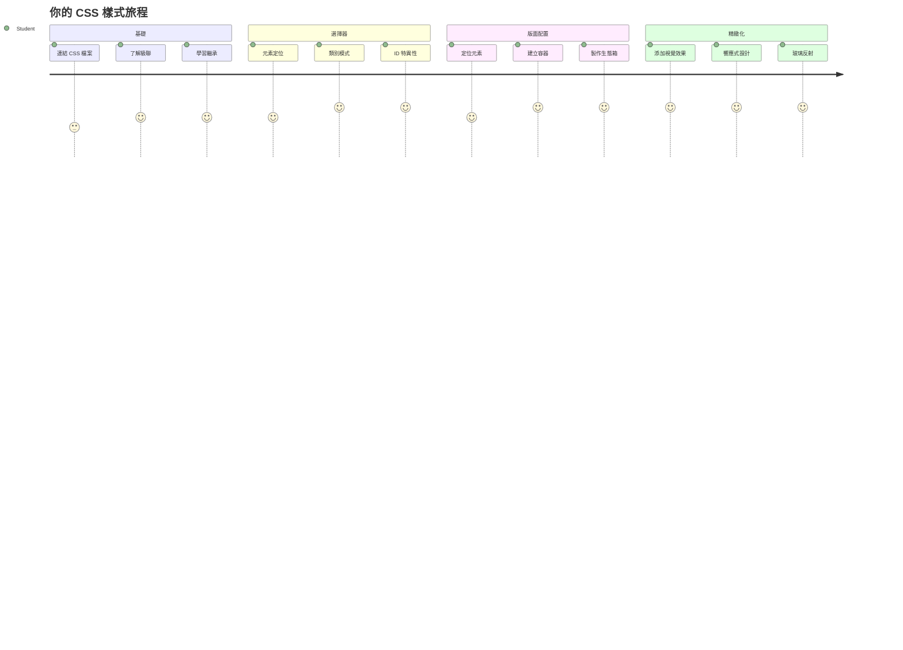
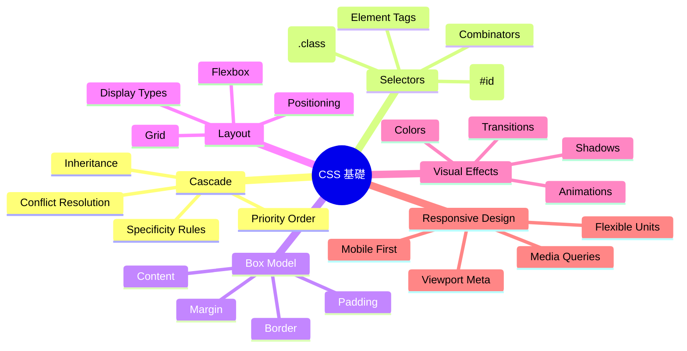
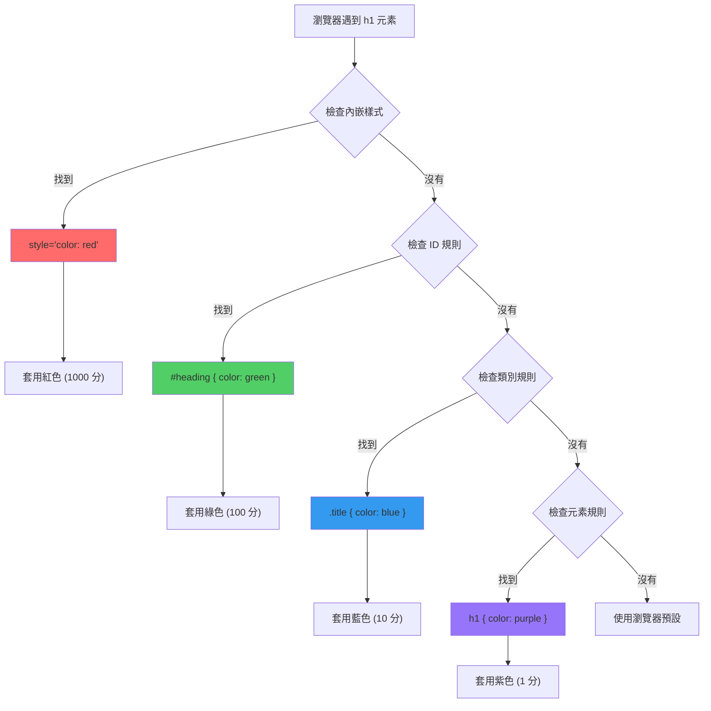
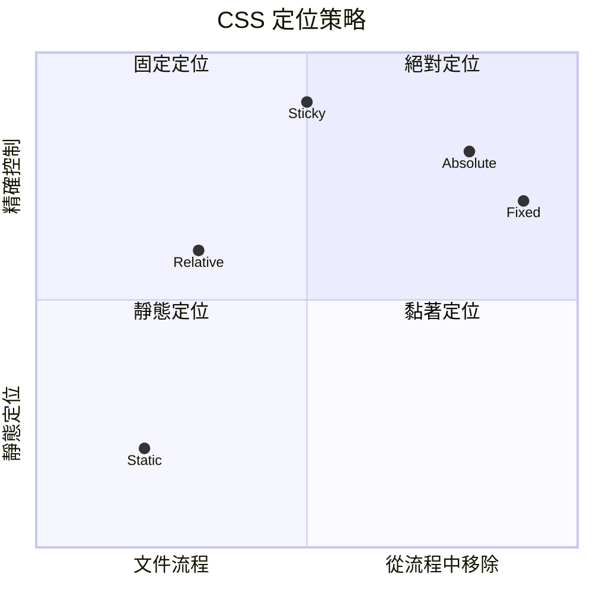
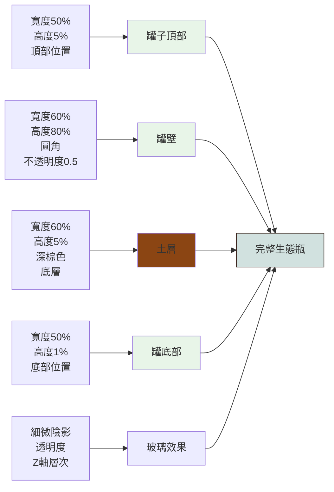
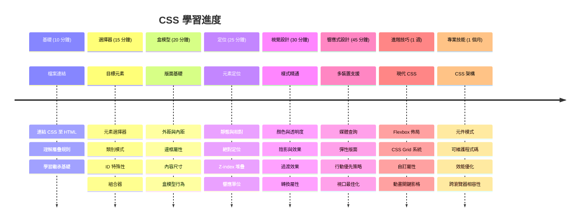

<!--
CO_OP_TRANSLATOR_METADATA:
{
  "original_hash": "e39f3a4e3bcccf94639e3af1248f8a4d",
  "translation_date": "2026-01-06T14:16:37+00:00",
  "source_file": "3-terrarium/2-intro-to-css/README.md",
  "language_code": "tw"
}
-->
# Terrarium Project 第二部分：CSS 入門



> 筆記作者：[Tomomi Imura](https://twitter.com/girlie_mac)

還記得你的 HTML 陸地生態箱看起來相當簡單嗎？CSS 正是我們將這個樸素結構轉變成視覺吸引之物的關鍵所在。

如果 HTML 就像是建造房屋骨架，那麼 CSS 則是讓它有家的感覺的所有元素——油漆顏色、家具擺設、燈光，以及各個房間如何流暢連結。試想凡爾賽宮最初是簡單的狩獵小屋，但經由細心的裝飾和布局規劃，變成了世界上最宏偉的建築之一。

今天，我們將把你的陸地生態箱從功能性提升到精緻完美。你將學會如何精準定位元素、讓版面配置響應不同螢幕尺寸，以及創造令網站動人的視覺魅力。

到這堂課的結束，你會發現策略性的 CSS 樣式設定能大幅提升你的專案。讓我們為陸地生態箱加點風格吧。


## 課前測驗

[課前測驗](https://ff-quizzes.netlify.app/web/quiz/17)

## CSS 入門

CSS 常被認為是「讓東西變漂亮」的工具，但它的用途遠更廣泛。CSS 就像電影導演——你不僅控制畫面呈現，也能操控動態效果，反應使用者互動，並適應各種狀況。

現代 CSS 功能強大。你可以寫程式碼自動調整版面配置，適用於手機、平板與桌面電腦。你也能創造流暢動畫，引導使用者目光焦點。當所有元素協同運作時，效果驚人。

> 💡 **專家建議**：CSS 持續演化，推出新功能與能力。使用新特性時，務必先上 [CanIUse.com](https://caniuse.com) 查詢各瀏覽器支援度。

**本課目標：**
- **建立**陸地生態箱完整視覺設計，採用現代 CSS 技巧
- **探索**關鍵觀念如層疊(cascade)、繼承(inheritance)及 CSS 選擇器
- **實作**響應式定位與布局策略
- **打造**利用 CSS 形狀和樣式的陸地生態箱容器

### 前置條件

請完成上堂課設計的 HTML 結構，並準備好進行樣式設定。

> 📺 **影片資源**：這段詳盡的教學影片值得一看
>
> [](https://www.youtube.com/watch?v=6yIdOIV9p1I)

### 設定你的 CSS 檔案

開始設定樣式前，須先將 CSS 連結到 HTML。這告訴瀏覽器樣式的來源位置。

在你的陸地生態箱資料夾中，建立新的檔案 `style.css`，然後在 HTML 文件的 `<head>` 區段加入連結：

```html
<link rel="stylesheet" href="./style.css" />
```

**這段程式碼說明如下：**
- **建立** HTML 與 CSS 檔案間的連結
- **告訴**瀏覽器載入並套用 `style.css` 內的樣式
- **使用** `rel="stylesheet"` 屬性指明這是 CSS 檔案
- **透過** `href="./style.css"` 指定檔案路徑

## 理解 CSS 層疊機制

你是否好奇為什麼稱為「層疊」樣式表？因為樣式像瀑布一樣連續套用，有時彼此會產生衝突。

就像軍隊命令結構——將軍主令「所有軍隊穿綠制服」，但特定單位命令說「典禮穿藍禮服」，則以較具體指令為準。CSS 也遵循類似原理，理解這種層級結構，讓除錯輕鬆許多。

### 體驗層疊優先順序

讓我們實際演練層疊，先在 `<h1>` 標籤加上內嵌樣式：

```html
<h1 style="color: red">My Terrarium</h1>
```

**這段程式碼做了什麼：**
- **直接套用**紅色字體在 `<h1>` 元素，使用內嵌樣式
- **利用** `style` 屬性，直接在 HTML 中嵌入 CSS
- **建立**該元素最高優先度的樣式規則

接著，在 `style.css` 內增加此規則：

```css
h1 {
  color: blue;
}
```

**以上範例讓我們：**
- **定義**選取所有 `<h1>` 元素的 CSS 規則
- **設定**使用外部樣式表將文字顏色設為藍色
- **優先度**低於內嵌樣式的規則

✅ **知識確認**：在你的網頁中呈現哪個顏色？該顏色為何勝出？你能想到哪些情況會想要覆寫樣式嗎？


> 💡 **CSS 優先順序（由高至低）：**
> 1. **內嵌樣式**（style 屬性）
> 2. **ID 選擇器**（#myId）
> 3. **類別選擇器**（.myClass）及屬性選擇器
> 4. **元素選擇器**（h1, div, p）
> 5. **瀏覽器預設**

## CSS 繼承實例

CSS 繼承猶如遺傳學——子元素會從父元素繼承某些屬性。若你設定 body 的字型，頁面所有文字會自動使用相同字型。就像哈布斯堡王朝的獨特下巴特徵代代相傳，不需個別設定。

但並非所有屬性都會繼承。像文字字型和顏色會，而邊距、邊框等布局屬性則不會。就如同小孩繼承外形特徵，但不一定繼承父母的穿衣打扮。

### 觀察字型繼承

試試將字型設定在 `<body>` 元素上：

```css
body {
  font-family: 'Segoe UI', Tahoma, Geneva, Verdana, sans-serif;
}
```

**說明這段過程：**
- **設定**整個網頁的字型，選取 `<body>` 元素
- **使用**字型堆疊，提供備用方案以提升瀏覽器相容性
- **採用**現代系統字體，美觀適配多平台
- **確保**除非明確覆寫，子元素都會繼承這個字型

打開瀏覽器開發者工具（F12），切換到元素檢視，查看你的 `<h1>` 元素。你會看到它繼承了 body 的字型：


✅ **實驗時間**：試著在 `<body>` 設定其他可繼承屬性，如 `color`、`line-height`、`text-align`。你的標題和其他元素會有什麼變化？

> 📝 **可繼承屬性例**：`color`、`font-family`、`font-size`、`line-height`、`text-align`、`visibility`
>
> **不可繼承屬性例**：`margin`、`padding`、`border`、`width`、`height`、`position`

### 🔄 **學習確認**
**CSS 基礎理解檢核**：開始選擇器前，請確定你能：
- ✅ 述說層疊與繼承的差異
- ✅ 預測特殊規則下哪個樣式會生效
- ✅ 辨識父元素會繼承哪些屬性
- ✅ 正確將 CSS 檔案連結至 HTML

**快速測試**：有以下樣式， `<div class="special">` 內的 `<h1>` 會是什麼顏色？
```css
div { color: blue; }
.special { color: green; }
h1 { color: red; }
```
*答案：紅色（元素選擇器直接針對 h1）*

## 精通 CSS 選擇器

CSS 選擇器是你針對特定元素套用樣式的方式。它們像精確指示——不只是說「那棟房子」，而是說「楓樹街上有紅門的藍色房子」。

CSS 提供多種定義精確度的方式，挑對選擇器就如挑對工具。有時候你要統一規劃一整區大門，有時候想特別裝飾某扇獨門。

### 元素選擇器（標籤）

元素選擇器以標籤名稱選取 HTML 元素，適合制定全頁基礎樣式：

```css
body {
  font-family: 'Segoe UI', Tahoma, Geneva, Verdana, sans-serif;
  margin: 0;
  padding: 0;
}

h1 {
  color: #3a241d;
  text-align: center;
  font-size: 2.5rem;
  margin-bottom: 1rem;
}
```

**理解這些樣式：**
- **採用** `body` 選擇器設定網頁統一字型樣式
- **移除**瀏覽器預設邊距與內距，方便控制排版
- **為**所有標題元素添加文字色彩、對齊與間距
- **運用** `rem` 單位打造可縮放、易讀字體大小

元素選擇器非常適合全面設定，但若要單獨修飾陸地生態箱中的特定植物元件，則需更具體選擇器。

### ID 選擇器用於獨特元素

ID 選擇器以 `#` 開頭，選取帶有指定 `id` 屬性的元素。因為 ID 必須唯一，很適合為個別特殊元素設定樣式，例如我們的左、右兩個植物容器。

建立陸地生態箱側邊植物容器的樣式：

```css
#left-container {
  background-color: #f5f5f5;
  width: 15%;
  left: 0;
  top: 0;
  position: absolute;
  height: 100vh;
  padding: 1rem;
  box-sizing: border-box;
}

#right-container {
  background-color: #f5f5f5;
  width: 15%;
  right: 0;
  top: 0;
  position: absolute;
  height: 100vh;
  padding: 1rem;
  box-sizing: border-box;
}
```

**這段程式碼成果說明：**
- **使用** `absolute` 定位將容器置於左右兩邊邊緣
- **採用** `vh`（視窗高度）單位，隨螢幕尺寸響應高度
- **設定** `box-sizing: border-box`，確保內距包含於寬度內
- **精簡**將零值的 `px` 單位去除，讓程式碼更簡潔乾淨
- **塗上**柔和的背景色，比嚴肅的灰色更舒適

✅ **程式碼質量挑戰**：注意這份 CSS 違反 DRY（不要重複你自己）原則。你能用一組 ID 結合類別重構它嗎？

**改良版方式：**
```html
<div id="left-container" class="container"></div>
<div id="right-container" class="container"></div>
```

```css
.container {
  background-color: #f5f5f5;
  width: 15%;
  top: 0;
  position: absolute;
  height: 100vh;
  padding: 1rem;
  box-sizing: border-box;
}

#left-container {
  left: 0;
}

#right-container {
  right: 0;
}
```

### 類別選擇器用於重複利用樣式

類別選擇器以 `.` 開頭，適合套用同樣樣式給多個元素。相比 ID，類別可多次使用，方便統一風格。

在陸地生態箱中，所有植物需有類似樣式，但每株植物又要獨立定位。用類別管理共有樣式，ID 則負責個別配置。

**植物的 HTML 結構如下：**
```html
<div class="plant-holder">
  
</div>
```

**主要組件解析：**
- **統一容器**使用 `class="plant-holder"` 來套用一致樣式
- **植物圖片**使用 `class="plant"` 管理共通風格與行為
- **獨特定位**用 `id="plant1"` 等作為唯一識別與 JavaScript 互動
- **提供**輔助閱讀器的描述文字以提升無障礙性

接著將這些樣式加入你的 `style.css`：

```css
.plant-holder {
  position: relative;
  height: 13%;
  left: -0.6rem;
}

.plant {
  position: absolute;
  max-width: 150%;
  max-height: 150%;
  z-index: 2;
  transition: transform 0.3s ease;
}

.plant:hover {
  transform: scale(1.05);
}
```

**解析這些樣式：**
- **設定**植物容器為相對定位，建立定位參考框架
- **調整**每個容器高度為 13%，確保所有植物垂直排放不需捲動
- **稍微**將容器左移，讓植物在容器內更靠中間
- **讓**植物圖片可響應縮放，透過 `max-width` 與 `max-height`
- **利用** `z-index` 將植物層級提高，置於其他陸地元素之上
- **新增**平滑過渡的滑鼠懸停效果，增進互動性

✅ **關鍵思考**：為何需要同時用 `.plant-holder` 和 `.plant`？如果只用一個會怎樣？

> 💡 **設計模式**：容器（`.plant-holder`）控制排版和定位，內容（`.plant`）負責外觀和縮放。此分工讓程式碼更易維護及彈性擴充。

## 認識 CSS 定位

CSS 定位如同舞台導演——你決定每個演員站哪裡、如何移動。有些演員遵循標準陣型，有些因戲劇效果需特殊定位。

掌握定位，許多版面挑戰都迎刃而解。想要滾動時導航列固定？定位幫你辦到。想要在特定位置顯示工具提示？也是定位的功勞。

### 五種定位值


| 定位值 | 行為 | 使用範例 |
|--------|------|----------|
| `static` | 預設，忽略 top/left/right/bottom 屬性 | 正常文件流佈局 |
| `relative` | 相對於正常位置定位 | 小幅調整，建立定位上下文 |
| `absolute` | 相對最近定位祖先元素定位 | 精確放置，覆蓋元素 |
| `fixed` | 相對視窗定位 | 導航列、浮動元素 |
| `sticky` | 根據捲動位置在 relative 與 fixed 間切換 | 捲動時黏著的標頭 |

### 我們陸地生態箱的定位策略

我們透過定位組合，打造理想版面配置：

```css
/* Container positioning */
.container {
  position: absolute; /* Removes from normal flow */
  /* ... other styles ... */
}

/* Plant holder positioning */
.plant-holder {
  position: relative; /* Creates positioning context */
  /* ... other styles ... */
}

/* Plant positioning */
.plant {
  position: absolute; /* Allows precise placement within holder */
  /* ... other styles ... */
}
```

**定位策略說明：**
- **絕對定位容器**脫離正常文檔流，固定於畫面邊緣
- **相對定位植物容器**既在文檔流內又建立定位框架
- **絕對定位植物**可在相對容器中精確擺放
- **此組合**允許植物垂直堆疊且可獨立調整位置

> 🎯 **重要關鍵**：植物元素需絕對定位，才能在下一堂課實作拖拉功能。絕對定位把元素從正常佈局中拉出，使拖放交互可行。

✅ **實驗時間**：改變定位值並觀察效果：
- 若將 `.container` 從 `absolute` 改成 `relative` 會怎樣？
- 如果 `.plant-holder` 使用 `absolute` 而非 `relative`，佈局會如何變化？
- 當你將 `.plant` 改成 `relative` 定位時會發生什麼？

### 🔄 **教學檢測**
**CSS 定位掌握**：暫停確認你的理解：
- ✅ 你能解釋為什麼植物需要絕對定位才能拖放嗎？
- ✅ 你了解相對容器如何創建定位上下文嗎？
- ✅ 為什麼側邊容器使用絕對定位？
- ✅ 如果完全移除定位聲明會發生什麼？

**現實世界連結**：想想 CSS 定位如何反映現實佈局：
- **Static**：書架上的書（自然排序）
- **Relative**：稍微移動書但保持位置
- **Absolute**：將書籤放在特定頁碼
- **Fixed**：摺頁時仍保持可見的便利貼

## 使用 CSS 建構玻璃瓶生態缸

現在我們將使用純 CSS 建立玻璃罐—不需要圖片或繪圖軟體。

透過定位和透明度創造逼真的玻璃、陰影和深度效果，展現 CSS 的視覺能力。這種技術類似包浩斯建築師用簡單幾何形狀打造複雜、美麗結構。理解這些原理後，你將能認出許多網頁設計背後的 CSS 技巧。


### 建立玻璃罐元件

讓我們逐部分構建生態缸玻璃罐。每個部分使用絕對定位和百分比尺寸以達到響應式設計：

```css
.jar-walls {
  height: 80%;
  width: 60%;
  background: #d1e1df;
  border-radius: 1rem;
  position: absolute;
  bottom: 0.5%;
  left: 20%;
  opacity: 0.5;
  z-index: 1;
  box-shadow: inset 0 0 2rem rgba(0, 0, 0, 0.1);
}

.jar-top {
  width: 50%;
  height: 5%;
  background: #d1e1df;
  position: absolute;
  bottom: 80.5%;
  left: 25%;
  opacity: 0.7;
  z-index: 1;
  border-radius: 0.5rem 0.5rem 0 0;
}

.jar-bottom {
  width: 50%;
  height: 1%;
  background: #d1e1df;
  position: absolute;
  bottom: 0;
  left: 25%;
  opacity: 0.7;
  border-radius: 0 0 0.5rem 0.5rem;
}

.dirt {
  width: 60%;
  height: 5%;
  background: #3a241d;
  position: absolute;
  border-radius: 0 0 1rem 1rem;
  bottom: 1%;
  left: 20%;
  opacity: 0.7;
  z-index: -1;
}
```

**理解生態缸構造：**
- **使用** 百分比尺寸以適應各種螢幕大小
- **絕對定位** 元素，以精確堆疊和對齊
- **套用** 不同透明度來營造玻璃透明效果
- **實現** `z-index` 分層，使植物出現在罐內
- **添加** 細緻陰影和圓角，提升真實感

### 百分比響應設計

注意所有尺寸均使用百分比而非固定像素：

**為什麼重要：**
- **確保** 生態缸在任何螢幕尺寸上都能等比例縮放
- **維持** 罐內各元件的視覺關係
- **提供** 從手機到大螢幕一貫的使用體驗
- **讓** 設計自適應且不破壞畫面佈局

### CSS 單位實踐

我們使用 `rem` 單位設定邊框圓角，與根字體大小成比例。這讓設計更容易被使用者字型偏好接受。欲了解更多[CSS 相對單位](https://www.w3.org/TR/css-values-3/#font-relative-lengths)的官方規範。

✅ **視覺實驗**：試著修改這些數值並觀察效果：
- 將罐身透明度從 0.5 調高至 0.8 — 玻璃呈現如何改變？
- 將土壤色從 `#3a241d` 換成 `#8B4513` — 視覺效果差異？
- 將土層 `z-index` 調整為 2 — 分層效果如何？

### 🔄 **教學檢測**
**CSS 視覺設計理解**：確認你的視覺 CSS 掌握：
- ✅ 百分比尺寸如何創造響應式設計？
- ✅ 為何透明度產生玻璃透明效果？
- ✅ `z-index` 在元素分層中扮演什麼角色？
- ✅ 邊框圓角如何塑造罐子形狀？

**設計原則**：注意我們如何從簡單形狀打造複雜視覺：
1. **矩形** → **圓角矩形** → **玻璃罐元件**
2. **平面色彩** → **透明度** → **玻璃效果**
3. **單一元素** → **分層組合** → **3D 外觀**

---

## GitHub Copilot Agent 挑戰 🚀

使用 Agent 模式完成以下挑戰：

**描述：** 創造一個 CSS 動畫，使生態缸中的植物輕柔搖擺，模擬自然微風效果。這將幫助你練習 CSS 動畫、轉換與關鍵影格，同時提升生態缸的視覺吸引力。

**提示：** 為 `.plant` 類別新增 CSS 關鍵影格動畫，使植物輕輕從左到右搖擺。動畫旋轉角度約 2-3 度，持續時間 3-4 秒，並無限循環，使用緩動函數模擬自然動作。

在此了解 [agent mode](https://code.visualstudio.com/blogs/2025/02/24/introducing-copilot-agent-mode)。

## 🚀 挑戰：新增玻璃反光

準備好利用真實玻璃反光效果強化生態缸嗎？此技術將為設計增添深度與真實感。

你將製作細膩高光，模擬光線如何在玻璃表面反射。此作法類似文藝復興畫家揚·范艾克運用光與反射使玻璃畫作呈現立體感。目標如下：


**你的挑戰：**
- **製作** 細膩的白色或淺色橢圓形反光
- **將它們置於** 罐子的左側策略性位置
- **套用** 適合的透明度與模糊效果以呈現真實光反射
- **利用** `border-radius` 造出有機泡泡狀形狀
- **嘗試** 漸層或盒陰影效果增加真實感

## 課後小測驗

[課後小測驗](https://ff-quizzes.netlify.app/web/quiz/18)

## 擴充你的 CSS 知識

CSS 初學或許感覺複雜，但理解這些核心概念將提供你扎實基礎以進階技巧。

**你的下一步 CSS 學習領域：**
- **Flexbox** - 簡化元素對齊與分配
- **CSS Grid** - 強大工具製作複雜佈局
- **CSS 變數** - 減少重複提升維護性
- **響應式設計** - 確保網站適用不同螢幕尺寸

### 互動學習資源

透過這些趣味且實際的遊戲練習概念：
- 🐸 [Flexbox Froggy](https://flexboxfroggy.com/) - 透過有趣挑戰精通 Flexbox
- 🌱 [Grid Garden](https://codepip.com/games/grid-garden/) - 透過種胡蘿蔔學習 CSS Grid
- 🎯 [CSS Battle](https://cssbattle.dev/) - 以程式挑戰測試你的 CSS 技能

### 進階學習

欲了解完整 CSS 基礎，請完成微軟學習模組：[用 CSS 風格化你的 HTML 應用](https://docs.microsoft.com/learn/modules/build-simple-website/4-css-basics/?WT.mc_id=academic-77807-sagibbon)

### ⚡ **接下來 5 分鐘你可以做的事**
- [ ] 開啟 DevTools，使用 Elements 面板檢查任一網站的 CSS 樣式
- [ ] 製作簡單 CSS 檔案並連結至 HTML 頁面
- [ ] 嘗試以十六進位、RGB 與命名色彩改變顏色
- [ ] 練習盒模型，為 div 加 padding 與 margin

### 🎯 **這一小時你能完成的目標**
- [ ] 完成課後小測驗，複習 CSS 基礎
- [ ] 使用字體、顏色與間距為 HTML 頁面加上風格
- [ ] 使用 flexbox 或 grid 製作簡易佈局
- [ ] 嘗試 CSS 過渡打造順暢效果
- [ ] 使用 media query 練習響應式設計

### 📅 **你的一週 CSS 冒險**
- [ ] 創意完成生態缸樣式作業
- [ ] 精通 CSS Grid，打造照片畫廊佈局
- [ ] 學習 CSS 動畫，讓設計更生動
- [ ] 探索 Sass 或 Less 預處理器
- [ ] 研究設計原則並融入 CSS
- [ ] 分析並重現網路上有趣的設計

### 🌟 **你的一個月設計大師之路**
- [ ] 建置完整響應式網站設計系統
- [ ] 學習 CSS-in-JS 或 Tailwind 這類實用框架
- [ ] 為開源專案貢獻 CSS 優化
- [ ] 掌握 CSS 進階概念如自訂屬性及 containment
- [ ] 創建可重用的模組化元件庫
- [ ] 指導其他 CSS 學習者並分享設計心得

## 🎯 你的 CSS 精通時間軸


### 🛠️ 你的 CSS 工具箱總結

完成本課後，你具備：
- **繼承與覆寫理解**：樣式如何繼承與覆寫
- **選擇器精通**：元素、類別與 ID 精準選取
- **定位技巧**：策略性元素放置與分層
- **視覺設計**：製作玻璃效果、陰影與透明度
- **響應技術**：百分比佈局適應各種螢幕
- **程式碼組織**：乾淨且易維護的 CSS 結構
- **現代實務**：使用相對單位與無障礙設計模式

**下一步**：你的生態缸現在有結構（HTML）與樣式（CSS）。最後一課將增添 JavaScript 互動功能！

## 作業

[CSS 重構](assignment.md)

---

<!-- CO-OP TRANSLATOR DISCLAIMER START -->
**免責聲明**：  
本文件係使用 AI 翻譯服務 [Co-op Translator](https://github.com/Azure/co-op-translator) 進行翻譯。儘管我們努力追求準確性，請注意自動翻譯可能包含錯誤或不準確之處。原文文件以其母語版本為權威依據。對於重要資訊，建議尋求專業人工翻譯。我們不對因使用本翻譯而導致之任何誤解或曲解負責。
<!-- CO-OP TRANSLATOR DISCLAIMER END -->