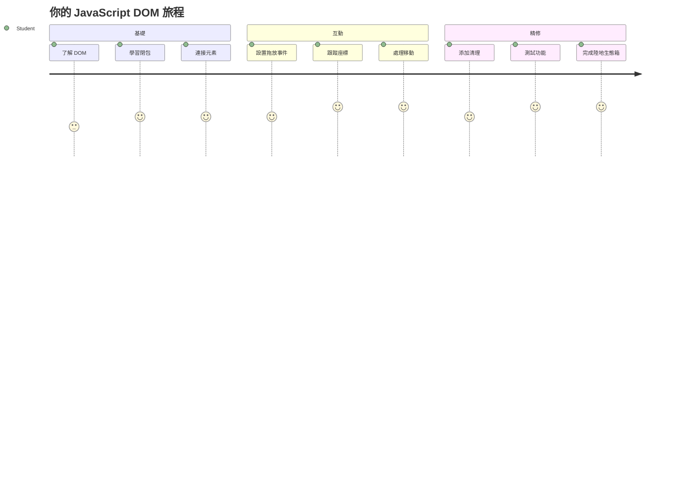
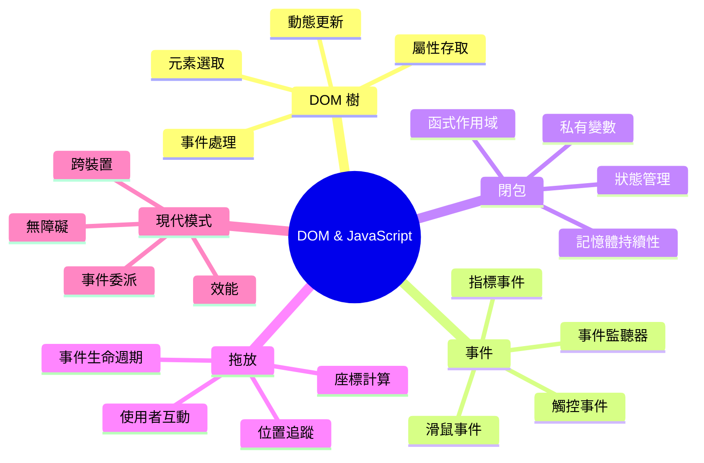
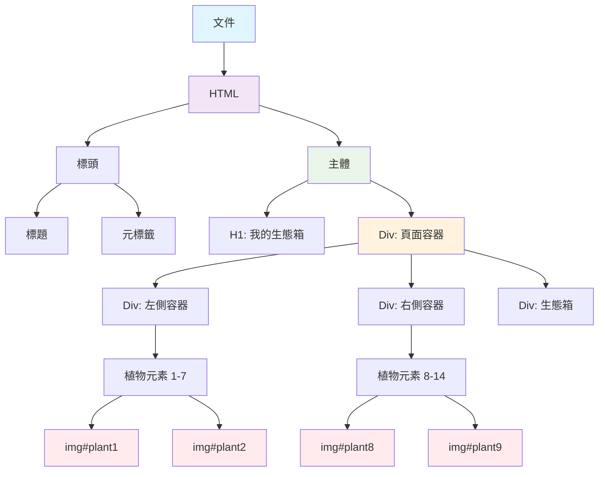
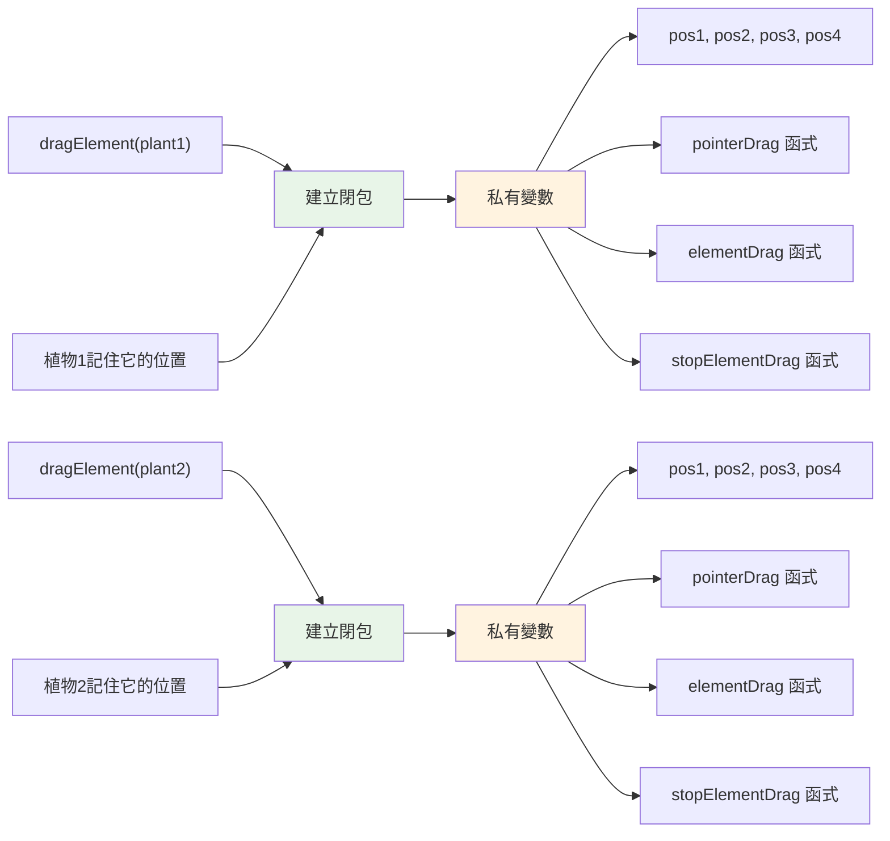
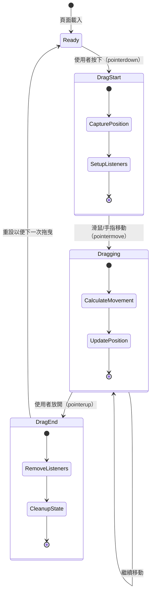
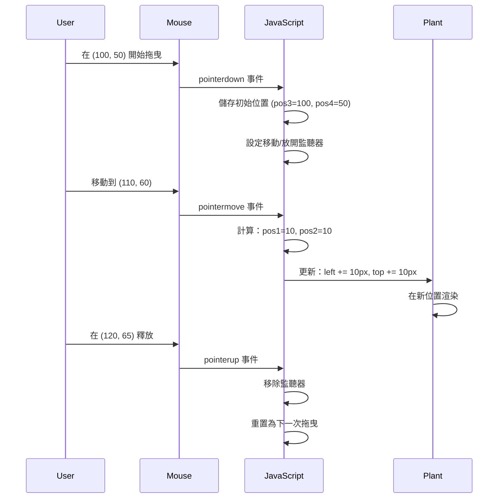
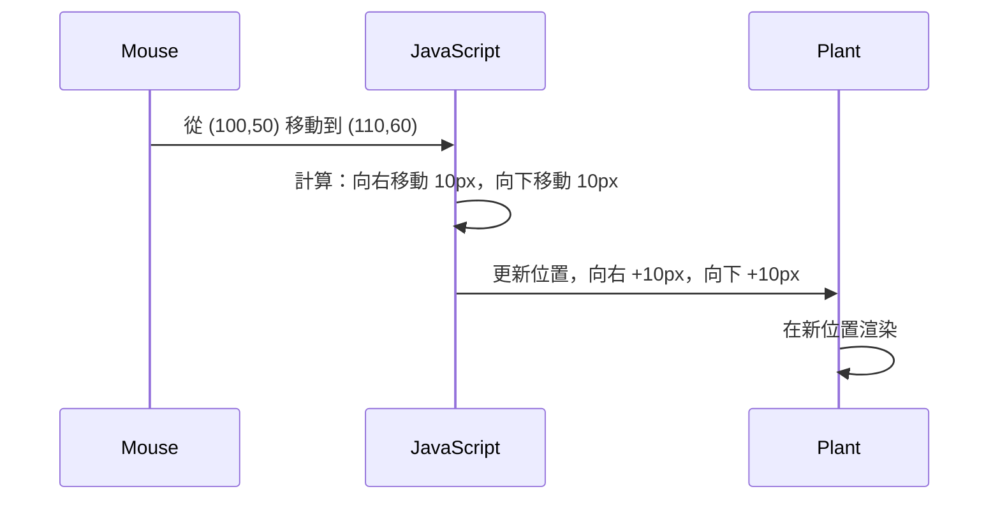
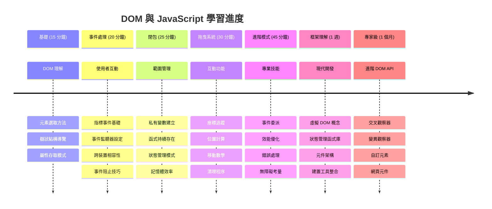

<!--
CO_OP_TRANSLATOR_METADATA:
{
  "original_hash": "973e48ad87d67bf5bb819746c9f8e302",
  "translation_date": "2026-01-06T14:13:53+00:00",
  "source_file": "3-terrarium/3-intro-to-DOM-and-closures/README.md",
  "language_code": "tw"
}
-->
# Terrarium 專案第三部分：DOM 操作與 JavaScript 閉包



> 筆記作者 [Tomomi Imura](https://twitter.com/girlie_mac)

歡迎來到網頁開發中最有趣的部分 —— 讓網頁變得互動！文件物件模型（DOM）就像 HTML 與 JavaScript 之間的橋樑，今天我們將利用它讓你的玻璃花房活起來。當 Tim Berners-Lee 創造第一個瀏覽器時，他設想了一個文件可以是動態且互動的網頁 —— DOM 讓這個願景成真。

我們還會探討 JavaScript 閉包，這個詞一開始可能聽起來嚇人。把閉包想像成幫你的函式製造「記憶口袋」，能記住重要資訊。就像你玻璃花房裡的每株植物都有自己的資料紀錄，追蹤位置。完成這堂課後，你會發現它們是多麼自然且實用。

現在我們要打造的是：一個使用者能自由拖放植物到任何位置的玻璃花房。你會學會 DOM 操作技巧，這些技巧是從拖放檔案上傳到互動遊戲的基礎。讓我們讓你的玻璃花房活起來吧。


## 課前小測驗

[課前小測驗](https://ff-quizzes.netlify.app/web/quiz/19)

## 認識 DOM：你的互動式網頁大門

文件物件模型（DOM）是 JavaScript 與你的 HTML 元素溝通的方式。當瀏覽器載入 HTML 頁面時，它會在記憶體中建立該頁的結構化表示 —— 這就是 DOM。你可以將它想成一棵家譜樹，每個 HTML 元素都是家族成員，JavaScript 能造訪、修改或重排它們。

DOM 操作可以將靜態網頁轉變為互動式網站。你每次看到按鈕在滑鼠懸停時變色、內容更新不需重新整理頁面，或元素可拖曳移動，背後都是 DOM 操作的功勞。




> DOM 與參照它的 HTML 標記的表示圖。取自 [Olfa Nasraoui](https://www.researchgate.net/publication/221417012_Profile-Based_Focused_Crawler_for_Social_Media-Sharing_Websites)

**DOM 強大的原因：**
- **提供**有結構的方式存取頁面上任意元素
- **允許**動態更新內容而不需重新整理頁面
- **支持**對點擊與拖曳等用戶互動即時回應
- **奠定**現代互動網頁應用的根基

## JavaScript 閉包：打造有組織且強大的程式碼

[JavaScript 閉包](https://developer.mozilla.org/docs/Web/JavaScript/Closures)就像給函式一個專屬的私有工作區，擁有持續的記憶能力。設想達爾文的加拉帕戈斯群島雀鳥根據環境發展出專屬的喙 —— 閉包同理，創造專屬功能，即使父函式執行完，仍記住特定上下文。

在我們的玻璃花房中，閉包幫助每株植物獨立記憶自己的位置。這個模式在專業 JavaScript 開發中無處不在，是值得理解的重要概念。


> 💡 **認識閉包**：閉包是 JavaScript 重要議題，許多開發者花好幾年才完全理解其理論面。今天我們重點在實際應用——隨著互動功能開發，閉包會自然出現。理解會隨觀察實際解決問題過程逐漸建立。


> DOM 與參照它的 HTML 標記的表示圖。取自 [Olfa Nasraoui](https://www.researchgate.net/publication/221417012_Profile-Based_Focused_Crawler_for_Social_Media-Sharing_Websites)

這堂課，我們將完成互動玻璃花房專案，撰寫讓使用者能操作頁面中植物的 JavaScript。

## 開始前：做好準備迎接成功

你需要先前玻璃花房課程的 HTML 與 CSS 檔案 —— 我們將讓這個靜態設計變成可互動的。如果你是第一次加入，建議先完成之前的課程以取得重要背景。

我們將打造：
- 所有植物的 **平滑拖放功能**
- 位置的 **座標追蹤** 識別植物記憶位置
- 使用純原生 JavaScript 實作的 **完整互動介面**
- 運用閉包模式維持的 **乾淨有組織程式碼**

## 設定你的 JavaScript 檔案

來建立一個讓玻璃花房可互動的 JavaScript 檔案。

**第一步：建立腳本檔案**

在你的 terrarium 資料夾中，建立一個名為 `script.js` 的新檔案。

**第二步：將 JavaScript 連結至你的 HTML**

在 `index.html` 的 `<head>` 區段加入以下 script 標籤：

```html
<script src="./script.js" defer></script>
```

**為何 `defer` 屬性很重要：**
- **確保**你的 JavaScript 等待全部 HTML 載入完成
- **避免**JavaScript 嘗試取用尚未準備好的元素而產生錯誤
- **確保**所有植物元素都可被互動使用
- **比放在頁尾執行**有更好的效能

> ⚠️ **重要提醒**：`defer` 屬性可避免常見的時間點問題。若沒用它，JavaScript 可能搶先於 HTML 載入前存取元素，導致錯誤。

---

## 將 JavaScript 與 HTML 元素連結

在讓元素可拖放之前，JavaScript 需要先找到它們在 DOM 中的位置。這就像圖書館的分類系統 —— 有了編號，就能精準找到你要的書，並取得其所有內容。

我們會先用 `document.getElementById()` 方法進行對應。這就像有個精準的文件夾編號系統 —— 傳入 ID，即能精準定位 HTML 中的元素。

### 啟用所有植物拖曳功能

在你的 `script.js` 中加入這段程式碼：

```javascript
// 啟用所有14個植物的拖曳功能
dragElement(document.getElementById('plant1'));
dragElement(document.getElementById('plant2'));
dragElement(document.getElementById('plant3'));
dragElement(document.getElementById('plant4'));
dragElement(document.getElementById('plant5'));
dragElement(document.getElementById('plant6'));
dragElement(document.getElementById('plant7'));
dragElement(document.getElementById('plant8'));
dragElement(document.getElementById('plant9'));
dragElement(document.getElementById('plant10'));
dragElement(document.getElementById('plant11'));
dragElement(document.getElementById('plant12'));
dragElement(document.getElementById('plant13'));
dragElement(document.getElementById('plant14'));
```

**這段程式碼的目的：**
- **尋找** DOM 中每個植物元素的獨特 ID
- **取得**每個 HTML 元素的 JavaScript 引用
- **將**元素傳入即將建立的 `dragElement` 函式處理
- **準備**每株植物支援拖放互動
- **連結**你的 HTML 結構與 JavaScript 功能

> 🎯 **為什麼用 ID 而非 Class？** ID 提供每個特定元素獨一無二的識別，CSS Class 則適合用來設計多個元素的樣式。JavaScript 需要精準操控個別元素時，ID 提供了必要的精確性與效能。

> 💡 **專家小提示**：你會注意到程式碼為每株植物單獨呼叫 `dragElement()`。這確保每株植物擁有獨立拖放行為，這對流暢的使用者體驗至關重要。

### 🔄 **教學檢視點**
**DOM 連結理解**：進入拖曳功能前，確保你會：
- ✅ 解釋 `document.getElementById()` 如何定位 HTML 元素
- ✅ 理解為何每株植物要有獨立的唯一 ID
- ✅ 描述 `defer` 屬性的作用
- ✅ 識別 JavaScript 與 HTML 是如何經由 DOM 連結起來的

**快速自我測驗**：如果兩個元素有相同 ID，會發生什麼？為什麼 `getElementById()` 只會回傳一個元素？
*答案：ID 必須唯一，若重複只會回傳第一個*

---

## 建立拖曳元素閉包

現在我們將打造拖曳功能的核心：一個管理拖曳行為的閉包。這個閉包包含多個內部函式，協同監控滑鼠移動並更新元素位置。

閉包非常適合此任務，因為它讓我們能建立「私有」變數，跨多次函式呼叫持續存在，讓每株植物擁有獨立的座標追蹤系統。

### 用簡單例子了解閉包

我用一個簡單例子來示範閉包概念：

```javascript
function createCounter() {
    let count = 0; // 這就像一個私有變數
    
    function increment() {
        count++; // 內部函數記住了外部變數
        return count;
    }
    
    return increment; // 我們回傳內部函數
}

const myCounter = createCounter();
console.log(myCounter()); // 1
console.log(myCounter()); // 2
```

**這個閉包模式的重點：**
- **建立**一個私有的 `count` 變數，只存在於閉包中
- **內部函式**能存取並修改封閉外層的變數（閉包機制）
- **當回傳**內部函式時，它仍然保有對該私有資料的連結
- **即使**`createCounter()` 執行結束，`count` 仍持續存在並記憶值

### 為什麼閉包最適合拖曳功能

每株植物都要記得自己目前位置座標。閉包為我們的專案帶來完美解決方案：

**對我們專案的關鍵優點：**
- **保持**每株植物私有的座標變數
- **保存**拖曳事件間的坐標資料
- **避免**不同可拖曳元素間的變數衝突
- **製造**乾淨且有組織的程式碼結構

> 🎯 **學習目標**：你不需立刻掌握閉包的全部細節。重點是了解閉包怎麼幫助我們組織程式和維持拖曳狀態。


### 建立 dragElement 函式

現在來建立主要處理所有拖曳邏輯的函式。將這個函式放在你的植物元素宣告後面：

```javascript
function dragElement(terrariumElement) {
    // 初始化位置追蹤變數
    let pos1 = 0,  // 先前的滑鼠 X 位置
        pos2 = 0,  // 先前的滑鼠 Y 位置
        pos3 = 0,  // 當前的滑鼠 X 位置
        pos4 = 0;  // 當前的滑鼠 Y 位置
    
    // 設定初始拖曳事件監聽器
    terrariumElement.onpointerdown = pointerDrag;
}
```

**認識位置追蹤系統：**
- **`pos1` 和 `pos2`**：記錄舊滑鼠與新滑鼠位置差異
- **`pos3` 和 `pos4`**：追蹤當前滑鼠座標
- **`terrariumElement`**：該可拖曳的植物元素
- **`onpointerdown`**：使用者開始拖曳時觸發的事件

**閉包模式運作原理：**
- **為每株植物元素建立**私有位置變數
- **維持維護**這些變數於拖曳生命週期中
- **確保**每株植物獨立追蹤各自座標
- **透過 `dragElement` 函式**提供乾淨介面

### 為什麼用 Pointer 事件？

你可能會問為什麼用 `onpointerdown` 而不是熟悉的 `onclick`。原因如下：

| 事件類型 | 適用場景 | 注意事項 |
|----------|---------|----------|
| `onclick` | 簡單按鈕點擊 | 只能處理點擊並放開，無法拖曳 |
| `onpointerdown` | 支援滑鼠與觸控 | 新式，但當前已廣泛支持 |
| `onmousedown` | 僅桌面滑鼠 | 不支援行動裝置觸控 |

**Pointer 事件適合我們的原因：**
- **無論**使用滑鼠、手指或觸控筆都可良好運作
- **在筆電、平板、手機上**有一致操作體驗
- **能處理**真正的拖曳動作，而非僅點擊
- **提供**現代網頁應用期待的流暢體驗

> 💡 **前瞻未來**：Pointer 事件是現代用戶互動處理的標準，無需為滑鼠和觸控編寫兩套程式碼，超方便。

### 🔄 **教學檢視點**
**事件處理理解**：停下來確認你是否懂得：
- ✅ 為什麼用 pointer 事件而非 mouse 事件？
- ✅ 閉包變數如何在函式呼叫間持續存在？
- ✅ `preventDefault()` 在平滑拖曳中扮演什麼角色？
- ✅ 為何事件監聽器綁在 document 而非單一元素？

**實務連結**：想想你每天用的拖放介面：
- **檔案上傳**：把檔案拖進瀏覽器視窗
- **看板系統**：在欄位間移動任務卡
- **圖片庫**：調整照片排序
- **行動介面**：觸控螢幕滑動拖曳

---

## pointerDrag 函式：捕捉拖曳開始

當使用者按下某株植物（無論用滑鼠或手指點擊），`pointerDrag` 函式會啟動。它擷取初始座標並設定拖曳系統。

將這個函式放在你的 `dragElement` 閉包內，位置在這段 `terrariumElement.onpointerdown = pointerDrag;` 行之後：

```javascript
function pointerDrag(e) {
    // 防止預設瀏覽器行為（如文字選取）
    e.preventDefault();
    
    // 捕捉初始滑鼠/觸控位置
    pos3 = e.clientX;  // 拖曳開始時的 X 座標
    pos4 = e.clientY;  // 拖曳開始時的 Y 座標
    
    // 設置拖曳過程的事件監聽器
    document.onpointermove = elementDrag;
    document.onpointerup = stopElementDrag;
}
```

**逐步說明：**
- **阻止**防止瀏覽器默認行為干擾拖曳
- **紀錄**使用者開始拖曳時的精確座標
- **設定**持續拖曳移動的事件監聽器
- **準備**系統追蹤整個文件上的滑鼠／觸控移動

### 了解事件阻止

`e.preventDefault()` 是平滑拖曳的重要一行：

**若不阻止，瀏覽器可能會：**
- **在拖曳時**選取頁面文字
- **在右鍵拖曳時**彈出上下文選單
- **干擾**我們自訂的拖曳行為
- **產生**視覺上的拖曳異常

> 🔍 **實驗**：結束課程後試著移除 `e.preventDefault()`，感受一下拖曳行為的差異。你將會很快體會它的重要性！

### 座標追蹤系統

屬性 `e.clientX` 與 `e.clientY` 提供精確滑鼠／觸控位置：

| 屬性 | 測量內容 | 使用情境 |
|-------|----------|----------|
| `clientX` | 相對視窗的水平位置 | 追蹤左右移動 |
| `clientY` | 相對視窗的垂直位置 | 追蹤上下移動 |
**理解這些座標：**
- **提供** 完美像素的定位資訊
- **隨著** 使用者移動指標即時更新
- **在不同螢幕尺寸和縮放級別下仍保持** 一致性
- **讓** 拖曳操作流暢且反應迅速

### 設置文件級事件監聽器

請注意我們將移動和停止事件附加到整個 `document`，而不僅是植物元素：

```javascript
document.onpointermove = elementDrag;
document.onpointerup = stopElementDrag;
```

**為何附加到 document：**
- **即使滑鼠離開植物元素也繼續** 追蹤
- **防止** 使用者快速移動時拖曳中斷
- **提供** 整個螢幕的平滑拖曳體驗
- **處理** 游標移出瀏覽器視窗的邊緣案例

> ⚡ **效能提醒**：拖曳停止時我們會清除這些文件級監聽器，以避免記憶體洩漏和效能問題。

## 完成拖曳系統：移動與清理

現在我們將新增兩個函式，分別處理真正的拖曳移動和拖曳停止時的清理。這些函式協同工作，創造平滑且靈敏的植物移動體驗。

### elementDrag 函式：追蹤移動

在 `pointerDrag` 函式的結尾大括號後新增 `elementDrag` 函式：

```javascript
function elementDrag(e) {
    // 計算自上次事件以來移動的距離
    pos1 = pos3 - e.clientX;  // 水平方向移動的距離
    pos2 = pos4 - e.clientY;  // 垂直方向移動的距離
    
    // 更新目前位置追蹤
    pos3 = e.clientX;  // 新的目前 X 位置
    pos4 = e.clientY;  // 新的目前 Y 位置
    
    // 將移動套用到元素的位置
    terrariumElement.style.top = (terrariumElement.offsetTop - pos2) + 'px';
    terrariumElement.style.left = (terrariumElement.offsetLeft - pos1) + 'px';
}
```

**理解座標計算：**
- **`pos1` 和 `pos2`**：計算滑鼠自上一更新以來的移動距離
- **`pos3` 和 `pos4`**：儲存當前滑鼠位置以供下次計算
- **`offsetTop` 和 `offsetLeft`**：取得元素當前在頁面上的位置
- **減法邏輯**：依滑鼠移動距離來移動元素


**移動計算說明：**
1. **測量** 舊滑鼠位置與新滑鼠位置的差異
2. **計算** 應移動元素的距離
3. **即時更新** 元素的 CSS 位置屬性
4. **儲存** 新位置作為下一次移動計算基準

### 數學的視覺化表示


### stopElementDrag 函式：進行清理

在 `elementDrag` 函式結尾大括號後新增清理函式：

```javascript
function stopElementDrag() {
    // 移除文件層級的事件監聽器
    document.onpointerup = null;
    document.onpointermove = null;
}
```

**為何清理很重要：**
- **防止** 因事件監聽器未清除而造成記憶體洩漏
- **停止** 使用者放開植物時的拖曳行為
- **允許** 其他元素可獨立進行拖曳
- **重設** 系統為下一次拖曳操作做準備

**不清理會發生什麼：**
- 事件監聽器即使拖曳停止仍持續運行
- 隨著未使用的監聽器累積，效能降低
- 與其他元素互動時行為出錯
- 瀏覽器資源浪費於不必要的事件處理

### 理解 CSS 位置屬性

我們的拖曳系統操作兩個關鍵的 CSS 屬性：

| 屬性 | 控制內容 | 我們如何使用 |
|------|---------|--------------|
| `top` | 與頂部邊界的距離 | 拖曳垂直定位 |
| `left` | 與左側邊界的距離 | 拖曳水平定位 |

**關於 offset 屬性的重點：**
- **`offsetTop`**：相對於最近位置設定的父元素頂部的距離
- **`offsetLeft`**：相對於最近位置設定的父元素左側的距離
- **定位上下文**：這些值相對的參考是最近的有定位祖先元素
- **即時更新**：修改 CSS 屬性時立刻改變

> 🎯 **設計理念**：此拖曳系統故意保持彈性——沒有“放置區域”或限制。使用者可以把植物放在任何位置，讓他們完整掌控植栽設計。

## 整合所有：您的完整拖曳系統

恭喜！您剛剛用純 JavaScript 建立了一個複雜的拖放系統。完整的 `dragElement` 函式現在包含一個強大的閉包，能管理：

**您的閉包達成了什麼：**
- **維持** 每個植物獨立的私有位置變數
- **處理** 從開始到結束的完整拖曳生命週期
- **提供** 全螢幕範圍的平滑、靈敏移動
- **適當清理** 資源避免記憶體洩漏
- **創造** 直覺且具創意的生態箱設計介面

### 測試您的互動生態箱

現在測試您的互動生態箱吧！在瀏覽器打開 `index.html`，試試以下功能：

1. **按住並點擊** 任一植物開始拖曳
2. **移動滑鼠或手指**，觀察植物平滑跟隨移動
3. **放開** 放下植物於新的位置
4. **嘗試** 不同排列方式以探索介面

🥇 **成就獎章**：您已經使用專業開發者每日運用的核心概念，創造出一個完全互動的網頁應用。該拖放功能背後原理也被用於檔案上傳、看板系統與其他許多互動介面。

### 🔄 **教學自我檢測**
**完整系統理解**：驗證你對拖曳系統的掌握：
- ✅ 閉包如何維持每株植物的獨立狀態？
- ✅ 為何座標計算數學對流暢移動很重要？
- ✅ 如果忘記清理事件監聽器會怎樣？
- ✅ 此模式如何擴展到更複雜的互動？

**程式碼品質反思**：回顧您的完整解決方案：
- **模組化設計**：每個植物擁有自己的閉包實例
- **事件效率**：監聽器適當設定與清理
- **跨裝置支援**：同時適用桌面與行動裝置
- **效能意識**：避免記憶體洩漏和重複計算


---

## GitHub Copilot Agent 挑戰 🚀

使用 Agent 模式完成以下挑戰：

**描述：** 為生態箱專案新增重置功能，將所有植物以平滑動畫帶回原始位置。

**提示：** 創建一個重置按鈕，點擊時使用 CSS 過渡效果，將所有植物從側邊欄的原始位置動畫地移回。函式需在頁面載入時儲存原始位置，按下重置時以一秒劃時間平滑移動。

欲了解更多，請參考 [agent mode](https://code.visualstudio.com/blogs/2025/02/24/introducing-copilot-agent-mode) 。

## 🚀 額外挑戰：提升您的技能

準備將生態箱提升到新層級嗎？嘗試實作以下增強功能：

**創意擴展：**
- **雙擊** 植物使其置頂（z-index 操作）
- **添加視覺回饋**，例如滑鼠懸停時微光效果
- **實作邊界限制**，防止植物被拖曳出生態箱外
- **建立儲存功能**，用 localStorage 記錄植物位置
- **新增音效**，在拾起和放下植物時播放

> 💡 **學習機會**：這些挑戰會教你新的 DOM 操控、事件處理與使用體驗設計技術。

## 課後測驗

[課後測驗](https://ff-quizzes.netlify.app/web/quiz/20)

## 複習與自學：深化理解

你已掌握 DOM 操控和閉包基礎，但學無止境！以下是擴展知識與技能的方向。

### 替代拖放方法

我們用 pointer 事件達最大彈性，但網頁開發還有多種選擇：

| 方法 | 適用情境 | 學習價值 |
|------|----------|----------|
| [HTML 拖放 API](https://developer.mozilla.org/docs/Web/API/HTML_Drag_and_Drop_API) | 檔案上傳、正式拖放區域 | 了解瀏覽器原生能力 |
| [觸控事件](https://developer.mozilla.org/docs/Web/API/Touch_events) | 行動專用互動 | 行動先行開發模式 |
| CSS `transform` 屬性 | 平滑動畫 | 效能優化技術 |

### 進階 DOM 操控主題

**學習下一步：**
- **事件代理**：高效管理多元素事件
- **Intersection Observer**：偵測元素出入視口
- **Mutation Observer**：監聽 DOM 結構變更
- **Web Components**：構建可重用封裝式 UI 元件
- **虛擬 DOM 概念**：理解框架如何優化 DOM 更新

### 必備持續學習資源

**技術文件：**
- [MDN Pointer Events 指南](https://developer.mozilla.org/docs/Web/API/Pointer_events) - 全面 pointer 事件參考
- [W3C Pointer Events 規範](https://www.w3.org/TR/pointerevents1/) - 官方標準文件
- [JavaScript 閉包深入](https://developer.mozilla.org/docs/Web/JavaScript/Closures) - 進階閉包模式

**瀏覽器相容性：**
- [CanIUse.com](https://caniuse.com/) - 瀏覽器功能支援狀況
- [MDN Browser Compatibility Data](https://github.com/mdn/browser-compat-data) - 詳細相容性資料

**練習機會：**
- **製作** 類似拖曳機制的拼圖遊戲
- **創建** 支援拖放的看板任務管理
- **設計** 可拖動照片排列的圖庫
- **嘗試** 行動裝置觸控手勢操作

> 🎯 **學習策略**：最佳鞏固方式是多練習。嘗試建造不同變化的拖曳介面——每個專案都會教你更多用戶互動與 DOM 操控技巧。

### ⚡ **您可在接下來 5 分鐘內做些什麼**
- [ ] 開啟瀏覽器開發者工具於主控台輸入 `document.querySelector('body')`
- [ ] 嘗試用 `innerHTML` 或 `textContent` 修改網頁文字
- [ ] 對任何按鈕或連結增加點擊事件監聽器
- [ ] 使用元素面板檢查 DOM 樹結構

### 🎯 **這一小時您可以達成**
- [ ] 完成課後小測驗並複習 DOM 操控概念
- [ ] 建立一個響應使用者點擊的互動網頁
- [ ] 練習各種事件類型的事件處理（click、mouseover、keypress）
- [ ] 打造簡易代辦清單或計數器應用
- [ ] 探索 HTML 元素與 JavaScript 物件關係

### 📅 **您的 JavaScript 一週學習計畫**
- [ ] 完成具拖放功能的互動生態箱專案
- [ ] 精通事件代理以提升事件處理效率
- [ ] 學習事件迴圈與非同步 JavaScript
- [ ] 練習閉包，建立帶有私有狀態的模組
- [ ] 探索最新 DOM API，如 Intersection Observer
- [ ] 不用框架建構互動元件

### 🌟 **您的 JavaScript 一個月精通計畫**
- [ ] 使用純 JavaScript 建置複雜單頁應用程式
- [ ] 學習並比較現代框架（React、Vue、Angular）與純 DOM 操控
- [ ] 參與 JavaScript 開源專案貢獻
- [ ] 精通高級概念如 Web Components 和自訂元素
- [ ] 建構效能優化的網頁應用
- [ ] 教授他人 DOM 操控與 JavaScript 基礎

## 🎯 您的 JavaScript DOM 精通時間軸


### 🛠️ 您的 JavaScript 工具包總結

完成本課後，您已具備：
- **DOM 精通**：元素選取、屬性操作與樹狀結構導覽
- **事件專業**：跨裝置指標事件處理
- **閉包理解**：私有狀態管理與函式持續性
- **互動系統**：完整拖放功能從零開始實作
- **效能意識**：適當事件清理與記憶體管理
- **現代模式**：職業開發中常見程式組織技術
- **用戶體驗**：打造直覺、響應快速的介面

**職業技能收穫**：您已使用與以下同樣技術開發功能：
- **Trello/看板系統**：欄位間拖曳卡片
- **檔案上傳系統**：拖放檔案處理
- **圖庫**：照片排列介面
- **行動應用**：觸控式互動模式

**下一步**：您已準備探索基於這些基礎 DOM 概念的現代框架如 React、Vue 或 Angular！ 

## 作業

[多練習 DOM 操作](assignment.md)

---

<!-- CO-OP TRANSLATOR DISCLAIMER START -->
**免責聲明**：
本文件係使用 AI 翻譯服務 [Co-op Translator](https://github.com/Azure/co-op-translator) 所翻譯。雖然我們致力於確保翻譯的準確性，但請注意自動翻譯可能包含錯誤或不準確之處。原始文件的原文版本應被視為權威來源。對於重要資訊，建議採用專業人工翻譯。我們對於因使用本翻譯所導致的任何誤解或誤釋概不負責。
<!-- CO-OP TRANSLATOR DISCLAIMER END -->