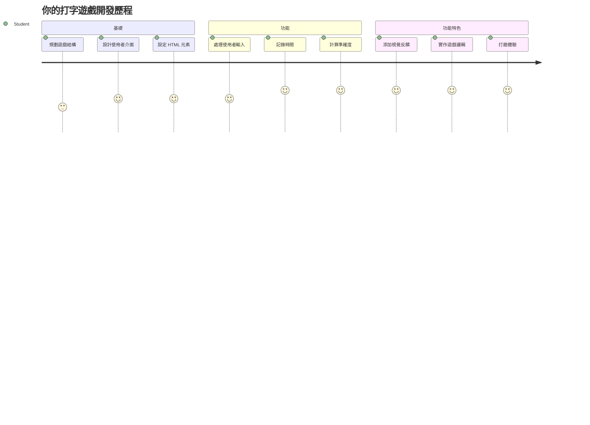
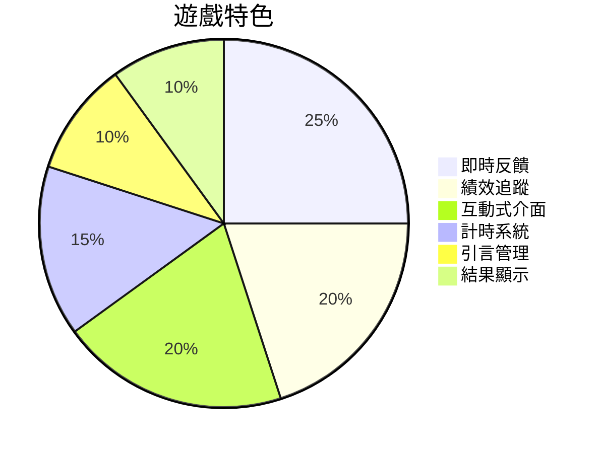
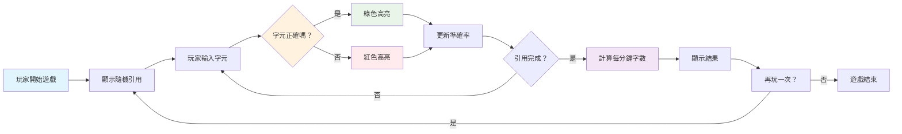
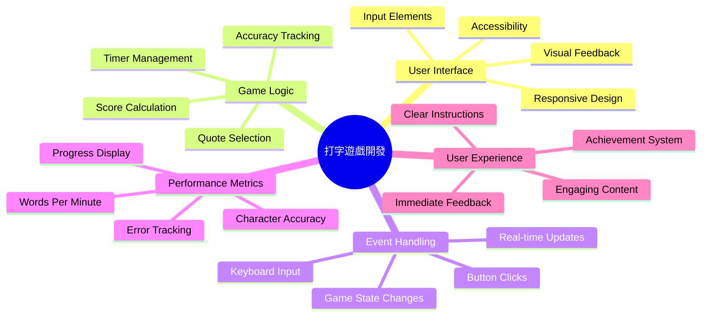
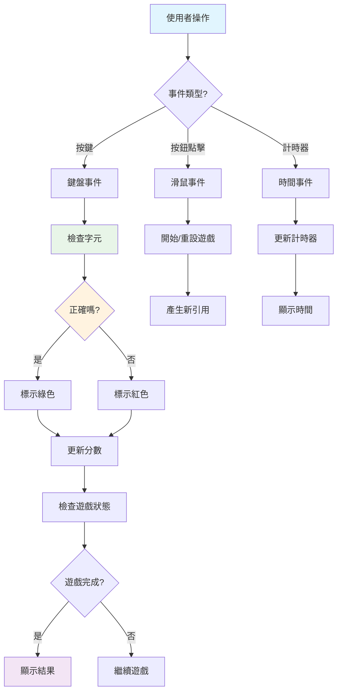
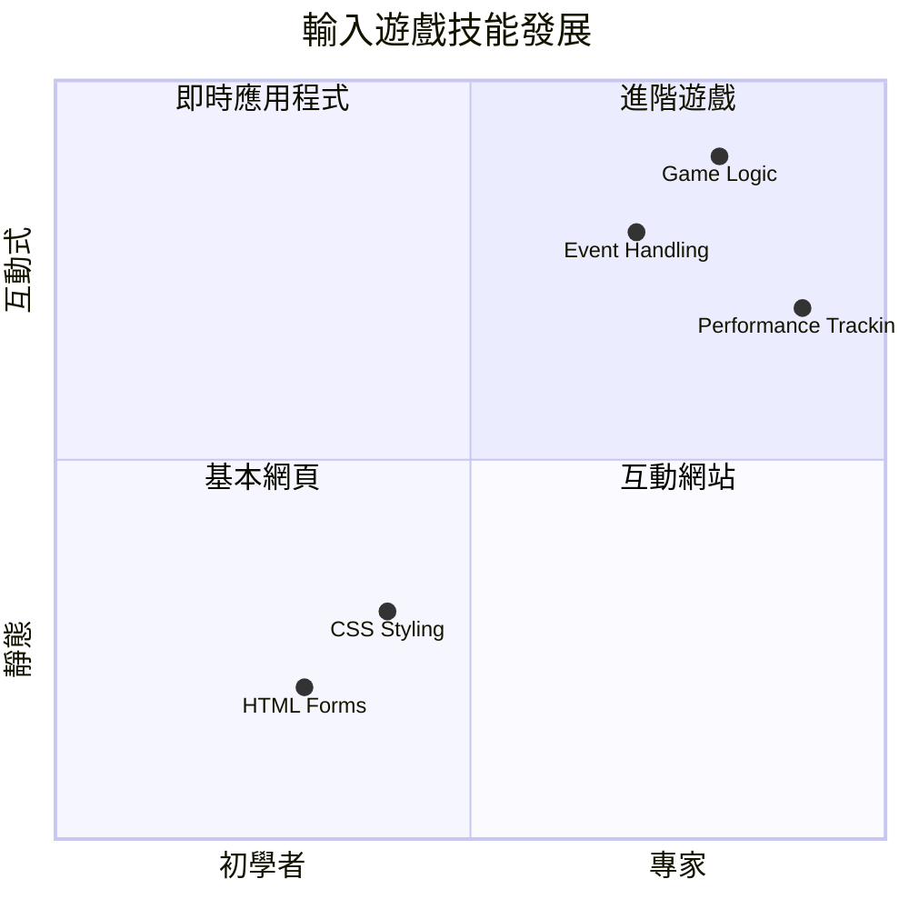
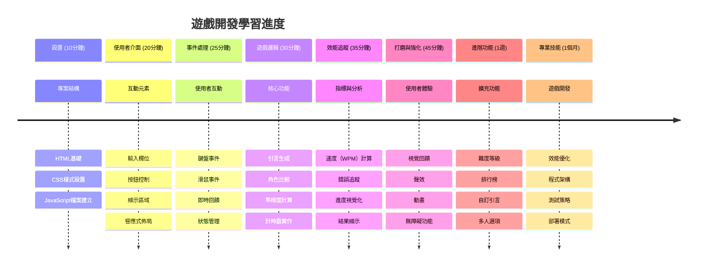

<!--
CO_OP_TRANSLATOR_METADATA:
{
  "original_hash": "efa2ab875b8bb5a7883816506da6b6d2",
  "translation_date": "2026-01-06T13:21:04+00:00",
  "source_file": "4-typing-game/README.md",
  "language_code": "tw"
}
-->
# 事件驅動程式設計 - 建立一款打字遊戲

## 簡介

這是每位開發者都知道但很少談論的事：打字快是一種超能力！🚀 想想看 — 你把腦中的想法更快輸入到程式編輯器中，創意就能流暢發揮。這就像在你的思緒與螢幕之間有條直接的管線。

想知道提升這項技能的最好方法之一嗎？你猜對了 — 我們要一起做個遊戲！

> 讓我們一起打造一款超棒的打字遊戲吧！

準備好將你學過的 JavaScript、HTML 和 CSS 技能派上用場了嗎？我們將建立一款打字遊戲，挑戰來自傳奇偵探 [福爾摩斯](https://en.wikipedia.org/wiki/Sherlock_Holmes) 的隨機語錄。遊戲會記錄你打字的速度與正確性 — 相信我，比你想像中還要上癮！

## 你需要具備的知識

在開始之前，請確保你熟悉以下概念（如果需要快速複習也沒關係—我們都經歷過！）：

- 建立文字輸入和按鈕控制項
- CSS 及使用類別設定樣式  
- JavaScript 基礎
  - 建立陣列
  - 產生隨機數字
  - 取得目前時間

如果感覺某些稍微生疏，完全沒問題！有時最好的鞏固方法就是直接動手做專案，邊做邊學。

### 🔄 **教學小檢視**
**基礎評估**：開始開發前，請確定你了解：
- ✅ HTML 表單和輸入元素的運作
- ✅ CSS 類別與動態樣式
- ✅ JavaScript 事件監聽與處理程序
- ✅ 陣列操作與隨機選取
- ✅ 時間測量與計算

**快速自我測試**：你能解釋這些概念如何在互動遊戲中結合嗎？
- **事件** 在使用者互動時觸發元素
- **處理程序** 處理事件並更新遊戲狀態
- **CSS** 提供使用者操作的視覺回饋
- **時間控制** 支援效能測量和遊戲進度

## 開始動手做吧！

[使用事件驅動程式設計建立打字遊戲](./typing-game/README.md)

### ⚡ **你接下來的 5 分鐘可以做什麼**
- [ ] 開啟瀏覽器主控台，嘗試使用 `addEventListener` 監聽鍵盤事件
- [ ] 建立簡單的 HTML 頁面，含輸入欄位，測試打字偵測
- [ ] 練習字串比對，將打字文字與目標文本做比較
- [ ] 嘗試 `setTimeout`，熟悉計時函數

### 🎯 **下一個小時你可以完成什麼**
- [ ] 完成課後測驗，理解事件驅動程式設計
- [ ] 建立簡易版打字遊戲，包括文字驗證
- [ ] 新增正確與錯誤打字的視覺回饋
- [ ] 根據速度與正確率實作簡單計分系統
- [ ] 用 CSS 美化遊戲界面

### 📅 **你的週遊戲開發計劃**
- [ ] 完成具備所有功能與精緻度的完整打字遊戲
- [ ] 增加難度等級，詞彙複雜度分級
- [ ] 實作使用者統計追蹤（每分鐘字數、準確率趨勢）
- [ ] 製作音效與動畫，提升使用體驗
- [ ] 讓遊戲響應式並支援觸控裝置
- [ ] 在線上分享遊戲，收集使用者反饋

### 🌟 **你的月度互動式開發計劃**
- [ ] 建造多款探索不同互動模式的遊戲
- [ ] 學習遊戲迴圈、狀態管理及效能優化
- [ ] 參與開源遊戲開發專案
- [ ] 精通高級時間控制與流暢動畫製作
- [ ] 建立展示多種互動應用的作品集
- [ ] 指導其他對遊戲開發與互動設計有興趣的人

## 🎯 你的打字遊戲專精時程

### 🛠️ 你的遊戲開發工具總結

完成本專案後，你將掌握：
- **事件驅動程式設計**：打造對輸入反應靈敏的使用者介面
- **即時回饋**：瞬時視覺與效能更新
- **效能測量**：精準的計時與計分系統
- **遊戲狀態管理**：掌控應用流程與使用者體驗
- **互動設計**：創造引人入勝、令人上癮的使用體驗
- **現代網頁 API**：運用瀏覽器功能提升互動豐富度
- **無障礙設計模式**：確保所有使用者皆能無障礙使用

**實務應用**：這些技能可廣泛應用於：
- **網頁應用程式**：任何互動介面或儀表板
- **教育軟體**：學習平台與技能評量工具
- **生產力工具**：文字編輯器、IDE、協作軟體
- **遊戲產業**：瀏覽器遊戲與互動娛樂
- **行動開發**：觸控介面與手勢操作

**下一階段**：你已準備好探究進階遊戲框架、即時多人系統或複雜互動式應用！

## 製作人員名單

由 [Christopher Harrison](http://www.twitter.com/geektrainer) ❤ 撰寫

---

<!-- CO-OP TRANSLATOR DISCLAIMER START -->
**免責聲明**：  
本文件係使用 AI 翻譯服務 [Co-op Translator](https://github.com/Azure/co-op-translator) 進行翻譯。雖然我們力求準確，請注意自動翻譯可能包含錯誤或不準確之處。原始文件的母語版本應視為權威來源。對於重要資訊，建議採用專業人工翻譯。我們對因使用本翻譯所導致之任何誤解或誤譯概不負責。
<!-- CO-OP TRANSLATOR DISCLAIMER END -->