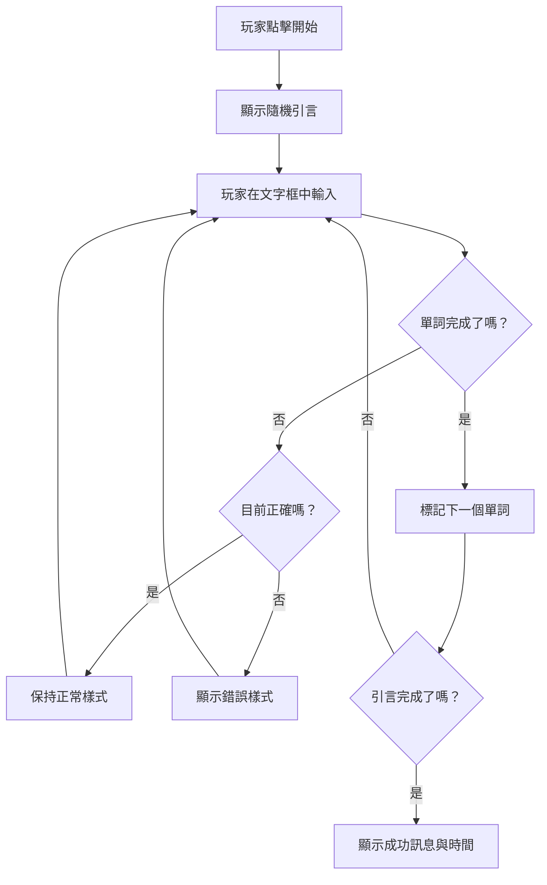
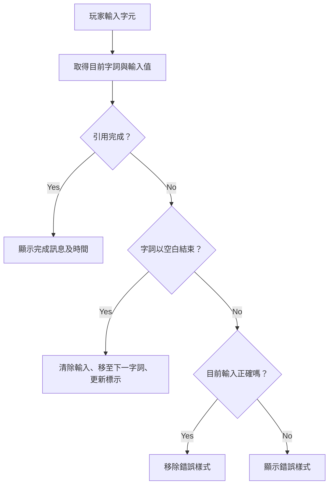
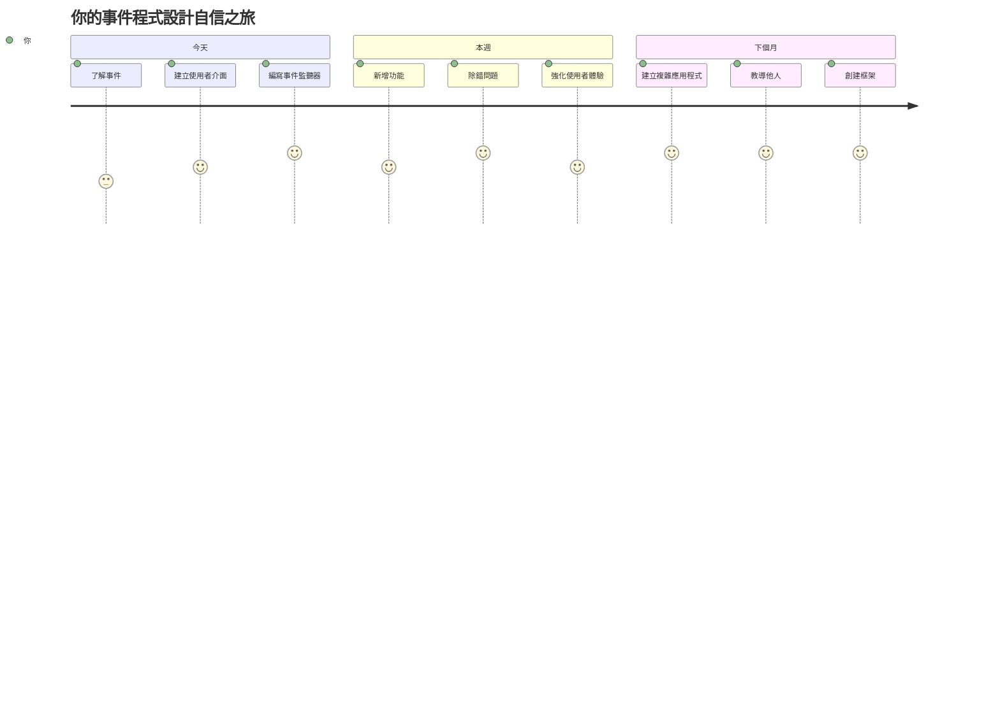

<!--
CO_OP_TRANSLATOR_METADATA:
{
  "original_hash": "da8bc72041a2bb3826a54654ee1a8844",
  "translation_date": "2026-01-06T14:09:38+00:00",
  "source_file": "4-typing-game/typing-game/README.md",
  "language_code": "tw"
}
-->
# 使用事件創建遊戲

你是否曾經想過網站如何知道你何時點擊按鈕或在文字框中輸入？這就是事件驅動程式設計的魔力！還有什麼比透過建構一個有用的東西——一個會對你的每個按鍵反應的打字速度遊戲——更好的學習方式呢。

你將親眼看到網頁瀏覽器如何「與」你的JavaScript程式碼「對話」。每次你點擊、輸入或移動滑鼠時，瀏覽器會傳送小訊息（我們稱它們為事件）到你的程式碼，你就會決定如何回應！

當我們結束時，你將創建一款真正的打字遊戲，可以追蹤你的速度和準確度。更重要的是，你會理解支撐每個互動式網站的基本概念。讓我們開始吧！

## 講座前小測驗

[講座前小測驗](https://ff-quizzes.netlify.app/web/quiz/21)

## 事件驅動程式設計

想想你最喜歡的應用程式或網站——是什麼讓它感覺充滿活力且反應迅速？全在於它如何回應你的操作！每次點擊、點按、滑動或按鍵都會產生所謂的「事件」，這才是網頁開發真正的魔法所在。

讓網頁程式設計如此有趣的原因是：我們永遠不知道有人什麼時候會點擊按鈕或開始在文本框輸入。他們可能立刻點擊，可能等五分鐘，甚至可能永遠不點擊！這種不可預測性讓我們必須用不同的思維來撰寫程式碼。

我們不會寫那種像食譜一樣從上到下執行的程式碼，而是寫那種耐心等待某件事發生的程式碼。就像19世紀的電報操作員坐在機器旁，隨時準備一有訊息即刻回應。

那麼，什麼是「事件」？簡單說，就是發生的事情！當你點擊按鈕，那是一個事件。當你輸入一個字母，那也是事件。當你移動滑鼠，那又是另一個事件。

事件驅動程式設計讓我們能夠設定程式碼聆聽並回應。我們創建特殊的函數，稱為**事件監聽器（event listeners）**，它們耐心等待特定事件發生，然後立即採取行動。

你可以把事件監聽器想像成程式碼的門鈴。你設定門鈴（`addEventListener()`），告訴它要傾聽哪種聲音（例如 ‘click’ 或 ‘keypress’），然後指定有人按鈴時該怎麼做（你的自訂函數）。

**事件監聽器的工作原理如下：**
- **監聽**用戶特定的行為，如點擊、按鍵或滑鼠移動
- **執行**當指定的事件發生時你的自訂程式碼
- **立即回應**用戶互動，創造無縫的體驗
- **處理**同一元素上的多重事件，使用不同的監聽器

> **注意：** 值得強調的是，有很多方法可以建立事件監聽器。你可以使用匿名函數，或創建具名函數。你也可以用許多捷徑，比如設置 `click` 屬性，或使用 `addEventListener()`。在我們的練習中，我們將專注於 `addEventListener()`和匿名函數，因為這可能是網頁開發者最常用的技術。它也最靈活，因為 `addEventListener()` 可用於所有事件，且事件名稱可以作為參數傳入。

### 常見事件

雖然網頁瀏覽器提供數十種不同的事件可以監聽，但大多數互動應用通常只依賴幾個基本事件。理解這些核心事件將為你建立複雜的使用者互動打下基礎。

當你建立應用程式時，基本上用戶在頁面上的任何操作都會觸發一個事件，這給了你很大的能力，確保他們獲得你想要的體驗。幸運的是，通常你只需要少量事件。以下是一些常見事件（包括我們製作遊戲時會用到的兩個）：

| 事件 | 描述 | 常見用途 |
|-------|-------------|------------------|
| `click` | 使用者點擊了某物 | 按鈕、連結、互動元素 |
| `contextmenu` | 使用者按了右鍵 | 自訂右鍵選單 |
| `select` | 使用者標記了部分文字 | 文字編輯、複製操作 |
| `input` | 使用者輸入了文字 | 表單驗證、即時搜尋 |

**了解這些事件類型：**
- **在用戶與特定頁面元素互動時觸發**
- **透過事件物件提供用戶操作的詳細資訊**
- **讓你創建反應快速且互動性強的網頁應用**
- **在不同瀏覽器和裝置間一致運作**

## 建立遊戲

現在你已理解事件的運作方式，我們來實際應用：創建一個打字速度遊戲，展示事件處理，同時幫助你培養重要的開發者技能。

我們將創建一個遊戲，探索 JavaScript 裡的事件運作。遊戲會測試玩家的打字技巧，這是所有開發人員都常被低估的重要技能。趣事：我們現在使用的 QWERTY 鍵盤配置實際上是在1870年代為打字機設計的——打字技巧對程式設計師如今仍然相當重要！遊戲大致流程如下：


**以下是遊戲的運作方式：**
- **開始**當玩家點擊開始按鈕並顯示隨機引言
- **追蹤**玩家的打字進度，逐字即時更新
- **突出顯示**當前單字，指引玩家專注焦點
- **提供**打字錯誤的即時視覺反饋
- **計算**並顯示當引言全部完成的總用時

我們來一起創建這款遊戲，並學習事件吧！

### 檔案結構

在開始寫程式前，先整理好檔案結構！一開始就有乾淨的檔案結構會減少你日後的困擾，並讓你的專案更專業。😊

我們將保持簡單，僅使用三個檔案：用於頁面結構的 `index.html`、用於遊戲邏輯的 `script.js`，以及用於視覺效果的 `style.css`。這組組合是大多數網頁的經典配置！

**透過打開命令視窗或終端機執行以下指令，為你的作品創建新資料夾：**

```bash
# Linux 或 macOS
mkdir typing-game && cd typing-game

# Windows
md typing-game && cd typing-game
```

**這些指令的功能：**
- **建立**一個名為 `typing-game` 的新目錄，供你放置專案檔案
- **自動切換**到剛建立的資料夾內
- **打造**一個乾淨的工作區，方便你開發遊戲

**打開 Visual Studio Code：**

```bash
code .
```

**此指令的效果：**
- **啟動** Visual Studio Code 並定位到目前目錄
- **在編輯器中開啟**你的專案資料夾
- **提供**所有你需要的開發工具

**在 Visual Studio Code 裡新增三個檔案，命名如下：**
- `index.html` - 遊戲的結構和內容
- `script.js` - 遊戲邏輯和事件監聽器
- `style.css` - 視覺外觀和樣式設定

## 建立使用者介面

現在讓我們建構遊戲進行時的舞台！想像這是設計太空船的控制面板——我們必須確保所有玩家需要的東西都放在他們期望的位置。

想想我們的遊戲到底需要什麼。如果你正在玩一個打字遊戲，你希望螢幕上出現什麼？這是必須的介面元素：

| UI 元件 | 目的 | HTML 元素 |
|------------|---------|-------------|
| 引言顯示區 | 顯示要輸入的文字 | `<p>` 並帶有 `id="quote"` |
| 訊息區 | 顯示狀態及成功訊息 | `<p>` 並帶有 `id="message"` |
| 文字輸入框 | 玩家輸入引言的地方 | `<input>` 並帶有 `id="typed-value"` |
| 開始按鈕 | 開始遊戲 | `<button>` 並帶有 `id="start"` |

**介面結構說明：**
- **合乎邏輯**地從上到下組織內容
- **給予**元素獨特的 ID，方便 JavaScript 操作
- **建立**清晰視覺層級，提升用戶體驗
- **使用**語意化的 HTML 元素，增進無障礙性

每個元素都需要 ID，才能在 JavaScript 中操作。我們也會新增對 CSS 和 JavaScript 檔案的引用。

建立一個名為 `index.html` 的新檔案。加入以下 HTML：

```html
<!-- inside index.html -->
<html>
<head>
  <title>Typing game</title>
  <link rel="stylesheet" href="style.css">
</head>
<body>
  <h1>Typing game!</h1>
  <p>Practice your typing skills with a quote from Sherlock Holmes. Click **start** to begin!</p>
  <p id="quote"></p> <!-- This will display our quote -->
  <p id="message"></p> <!-- This will display any status messages -->
  <div>
    <input type="text" aria-label="current word" id="typed-value" /> <!-- The textbox for typing -->
    <button type="button" id="start">Start</button> <!-- To start the game -->
  </div>
  <script src="script.js"></script>
</body>
</html>
```

**這個 HTML 結構實現了以下功能：**
- **在 `<head>` 頁面標頭載入 CSS 樣式表
- **創建**明確的標題和使用者說明
- **設置**帶有特定 ID 的占位段落，用於動態內容
- **包含**帶有無障礙屬性的輸入欄位
- **提供**一個開始遊戲的按鈕
- **在檔案尾端**載入 JavaScript，提升效能

### 啟動應用程式

在開發過程中經常測試應用程式有助於及早捕捉問題，並即時查看進度。Live Server 是一款非常實用的工具，每當你儲存變更時，它會自動刷新瀏覽器，讓開發更加高效。

最好採用逐步開發的方法查看效果。讓我們啟動應用程式。有個相當棒的 Visual Studio Code 擴充套件叫做 [Live Server](https://marketplace.visualstudio.com/items?itemName=ritwickdey.LiveServer&WT.mc_id=academic-77807-sagibbon)，它可以在本機架設伺服器，並在你儲存時刷新瀏覽器。

**按照連結安裝 [Live Server](https://marketplace.visualstudio.com/items?itemName=ritwickdey.LiveServer&WT.mc_id=academic-77807-sagibbon)，點擊安裝：**

**安裝過程會有以下動作：**
- **提示**你的瀏覽器打開 Visual Studio Code
- **引導你**完成擴充功能安裝流程
- **可能需要**重啟 Visual Studio Code 以完成設定

**安裝完成後，在 Visual Studio Code 按 Ctrl-Shift-P（或 Cmd-Shift-P）開啟命令面板：**

**命令面板說明：**
- **快速存取**所有 VS Code 指令
- **輸入時即時搜尋**指令
- **提供**鍵盤快捷鍵加快開發效率

**輸入「Live Server: Open with Live Server」：**

**Live Server 功能包括：**
- **啟動**你的專案的本機開發伺服器
- **在你儲存檔案時**自動刷新瀏覽器
- **從本機 URL（通常是 `localhost:5500`）提供服務**

**打開瀏覽器並前往 `https://localhost:5500`：**

現在你應該看到剛建立的頁面了！讓我們加入一些功能。

## 加入 CSS

現在讓我們讓畫面好看一點！視覺反饋自電腦早期時代就對使用者介面至關重要。1980年代的研究發現，立即的視覺反饋能顯著提升使用者表現並減少錯誤。這正是我們要創造的效果。

我們的遊戲需要讓玩家一目了然地知道目前狀況。玩家應該立刻知道該輸入哪個單字，如果犯錯，應該立即看到它。我們來創建一些簡單但有效的樣式：

建立一個名為 `style.css` 的新檔案，加入以下語法。

```css
/* inside style.css */
.highlight {
  background-color: yellow;
}

.error {
  background-color: lightcoral;
  border: red;
}
```

**這些 CSS 類別的意義：**
- **以黃色背景突出顯示**當前單字，幫助視覺聚焦
- **以淺珊瑚色背景標示**打字錯誤
- **提供**即時回饋而不干擾使用者輸入流程
- **使用**對比明顯的色彩，提升無障礙性與視覺溝通效果

✅ CSS 部分，你可以自由安排頁面版面配置，多花點時間讓頁面更吸引人：

- 選擇不同的字型
- 讓標題更有色彩
- 調整元件大小

## JavaScript

現在事情變有趣了！🎉 我們已經有 HTML 結構和 CSS 樣式，但目前遊戲就像一輛漂亮卻沒有引擎的車子。JavaScript 就是那台引擎——它使一切都實際運作並對玩家操作做出回應。

你將看到你的作品活起來。我們會一步步接觸這些內容，避免讓你感到壓力過大：

| 步驟 | 目的 | 你將學到的内容 |
|------|---------|------------------|
| [建立常數](../../../../4-typing-game/typing-game) | 設定引言和 DOM 參考 | 變數管理與 DOM 選取 |
| [開始遊戲的事件監聽器](../../../../4-typing-game/typing-game) | 處理遊戲初始化 | 事件處理和 UI 更新 |
| [鍵入的事件監聽器](../../../../4-typing-game/typing-game) | 即時處理用戶輸入 | 輸入驗證與動態反饋 |

**此結構化方式幫助你：**
- **整合**程式碼成邏輯且易管理的部分
- **逐步建立**功能以便輕鬆除錯
- **理解**應用程式中不同部分如何協同工作
- **創造**可重複使用的設計模式，便於未來專案

不過先建立一個新檔案，名為 `script.js`。

### 建立常數

在深入實作前，讓我們先整合所有資源！就像 NASA 的任務控制中心啟動前會先架設監控系統，有備而來能讓整個過程順利許多，也能減少打錯字的機率。

我們首先需要設定：

| 資料類型 | 目的 | 範例 |
|-----------|---------|--------|
| Array of quotes | 儲存遊戲中所有可能的引言 | `['Quote 1', 'Quote 2', ...]` |
| Word array | 將當前引言拆解成單字陣列 | `['When', 'you', 'have', ...]` |
| Word index | 追蹤玩家正在輸入的單字索引 | `0, 1, 2, 3...` |
| Start time | 計算計分所需的經過時間 | `Date.now()` |

**我們也需要參考 UI 元素：**
| Element | ID | 用途 |
|---------|----|---------|
| 文字輸入框 | `typed-value` | 玩家輸入文字的位置 |
| 引言顯示區 | `quote` | 顯示需輸入的引言 |
| 訊息區 | `message` | 顯示狀態更新訊息 |

```javascript
// 在 script.js 內部
// 我們所有的引言
const quotes = [
    'When you have eliminated the impossible, whatever remains, however improbable, must be the truth.',
    'There is nothing more deceptive than an obvious fact.',
    'I ought to know by this time that when a fact appears to be opposed to a long train of deductions it invariably proves to be capable of bearing some other interpretation.',
    'I never make exceptions. An exception disproves the rule.',
    'What one man can invent another can discover.',
    'Nothing clears up a case so much as stating it to another person.',
    'Education never ends, Watson. It is a series of lessons, with the greatest for the last.',
];
// 存放單詞清單和玩家當前輸入的單詞索引
let words = [];
let wordIndex = 0;
// 起始時間
let startTime = Date.now();
// 頁面元素
const quoteElement = document.getElementById('quote');
const messageElement = document.getElementById('message');
const typedValueElement = document.getElementById('typed-value');
```
  
**解析這段設定程式碼的成果：**
- 使用 `const` **儲存**一組夏洛克·福爾摩斯的引言，因為引言不會變動  
- 使用 `let` **初始化**追蹤變數，因為遊戲中這些值會變化  
- 利用 `document.getElementById()` **擷取** DOM 元素的參照以提高效率  
- 建立所有遊戲功能的基礎，並且使用清晰、具描述性的變數名稱  
- 將相關資料和元素邏輯性地組織起來，方便日後維護程式碼  

✅ 請繼續為你的遊戲新增更多引言

> 💡 **專家提示**：你可以在程式碼中任何時候使用 `document.getElementById()` 取得元素。由於我們會常常用到這些元素，透過常數避免字串拼寫錯誤是很好的做法。像是 [Vue.js](https://vuejs.org/) 或 [React](https://reactjs.org/) 這類框架可以幫助你更好地集中管理程式碼。
>
**這個作法效果好有以下原因：**
- **避免**多次引用元素時的拼寫錯誤  
- **提升**程式碼可讀性，使用具描述性的常數名稱  
- **增強** IDE 的自動完成與錯誤檢查支援  
- **使得**以後如果元素 ID 改變，重構程式碼更加容易  

花一點時間觀看關於 `const`、`let` 和 `var` 的影片

[](https://youtube.com/watch?v=JNIXfGiDWM8 "Types of variables")

> 🎥 點擊上方圖片觀看變數相關教學影片。

### 新增開始邏輯

這裡一切就緒！🚀 你即將寫下第一個真正的事件監聽器，看到程式碼對按鈕點擊有反應，那感覺超滿足。

想想看：某個地方，一名玩家正準備點擊「開始」按鈕，你的程式需要準備好。完全不知道他什麼時候會按下去——可能是馬上，也可能喝完咖啡後——但當那刻來臨，你的遊戲便啟動。

當用戶點擊 `start` 時，我們需要選擇一段引言、設定用戶介面，以及初始化當前輸入單字和時間的追蹤。以下是你要加入的 JavaScript 程式碼；我們會在程式碼區塊後面詳細說明。

```javascript
// 在 script.js 的結尾
document.getElementById('start').addEventListener('click', () => {
  // 取得一個引言
  const quoteIndex = Math.floor(Math.random() * quotes.length);
  const quote = quotes[quoteIndex];
  // 將引言放入一個字詞陣列中
  words = quote.split(' ');
  // 重設字詞索引以追蹤
  wordIndex = 0;

  // 使用者介面更新
  // 建立一個 span 元素陣列，以便我們可以設置類別
  const spanWords = words.map(function(word) { return `<span>${word} </span>`});
  // 轉成字串並設定為引言顯示區的 innerHTML
  quoteElement.innerHTML = spanWords.join('');
  // 強調第一個字詞
  quoteElement.childNodes[0].className = 'highlight';
  // 清除任何先前的訊息
  messageElement.innerText = '';

  // 設置文字框
  // 清空文字框
  typedValueElement.value = '';
  // 設定焦點
  typedValueElement.focus();
  // 設定事件處理器

  // 啟動計時器
  startTime = new Date().getTime();
});
```
  
**將程式碼分成邏輯區塊說明：**

**📊 單字追蹤設定：**  
- 使用 `Math.floor()` 和 `Math.random()` **隨機選擇**一段引言，增加多樣性  
- 使用 `split(' ')` 將引言 **切割成單字陣列**  
- 將 `wordIndex` **重置為 0**，因為玩家從第一個單字開始  
- **準備**遊戲狀態以開始新的回合  

**🎨 UI 佈局與顯示：**  
- 透過包裹 `<span>` 元素，分別設定單字以便個別樣式調整  
- 將所有 span 元素合併成一個字串，**有效率地更新 DOM**  
- 透過加入 `highlight` CSS 類別，**標記第一個單字為高亮**  
- 清除先前遊戲訊息，讓畫面保持乾淨  

**⌨️ 文字框準備：**  
- 清空輸入欄現有文字  
- 將輸入框設定 **focus**，讓玩家能立刻開始輸入  
- 為新遊戲回合做好輸入區準備  

**⏱️ 計時器初始化：**  
- 使用 `new Date().getTime()` **擷取當前時間戳**  
- 方便後續準確計算打字速度與完成時間  
- 開始遊戲計時與效能追蹤  

### 新增打字邏輯

這裡開始處理遊戲核心了！別擔心剛開始看起來複雜，我們會逐一說明每段程式碼，最後你會看到它多麼合邏輯。

我們正在打造的是一套複雜的邏輯：每當玩家輸入一個字母，我們都會查看輸入內容、給予回饋，並決定下一步該怎麼做。它類似 1970 年代早期的文字處理器 WordStar，會即時回饋輸入狀況。

```javascript
// 在 script.js 的結尾
typedValueElement.addEventListener('input', () => {
  // 取得當前的單字
  const currentWord = words[wordIndex];
  // 取得當前的值
  const typedValue = typedValueElement.value;

  if (typedValue === currentWord && wordIndex === words.length - 1) {
    // 句子結尾
    // 顯示成功
    const elapsedTime = new Date().getTime() - startTime;
    const message = `CONGRATULATIONS! You finished in ${elapsedTime / 1000} seconds.`;
    messageElement.innerText = message;
  } else if (typedValue.endsWith(' ') && typedValue.trim() === currentWord) {
    // 單字結尾
    // 清除 typedValueElement 以便輸入新單字
    typedValueElement.value = '';
    // 移動到下一個單字
    wordIndex++;
    // 重設 quote 中所有元素的類別名稱
    for (const wordElement of quoteElement.childNodes) {
      wordElement.className = '';
    }
    // 突顯新單字
    quoteElement.childNodes[wordIndex].className = 'highlight';
  } else if (currentWord.startsWith(typedValue)) {
    // 目前正確
    // 突顯下一個單字
    typedValueElement.className = '';
  } else {
    // 錯誤狀態
    typedValueElement.className = 'error';
  }
});
```
  
**理解除錯邏輯流程：**

此函式採用瀑布式檢查邏輯，從最特定的狀況往較普遍的判斷依序過濾。以下逐步拆解各情境：


**🏁 引言輸入完成（情境 1）：**  
- 檢查輸入值是否與目前單字相符，且為最後一個單字  
- 計算經過時間，即用現在時間減去開始時間  
- 將毫秒轉換成秒，除以 1,000  
- 顯示恭喜訊息並包含完成時間  

**✅ 單字完成（情境 2）：**  
- 當輸入字串以空白結尾時，判斷字完成  
- 確認修剪後的輸入與目前單字精確相符  
- 清空輸入框以準備輸入下一個  
- 將 `wordIndex` 增加，前進下一個單字  
- 移除所有單字的類別，並高亮新單字  

**📝 正在輸入中（情境 3）：**  
- 確認目前單字以已輸入字串開頭  
- 移除錯誤樣式，表示目前輸入正確  
- 允許持續輸入，不中斷  

**❌ 錯誤輸入狀態（情境 4）：**  
- 輸入字串不符合目前單字開頭時觸發  
- 加入錯誤 CSS 類別，立刻給予視覺回饋  
- 幫助玩家迅速辨識並修正錯誤  

## 測試你的應用程式

看看你都完成了什麼！🎉 你剛剛用事件驅動程式設計從零打造出一個真實可玩的打字遊戲。花點時間好好欣賞這成就——這絕非易事！

接下來是測試階段！它會不會如預期運作？有沒有漏掉什麼？其實如果一開始沒完美運作很正常，即使是資深開發者也常在程式中找到錯誤。這都是開發流程的一部分！

點擊 `start`，開始打字吧！應該會像之前看到的動畫一樣。


**你應該測試的重點：**  
- 點擊 Start 後是否顯示隨機引言  
- 輸入時當前單字是否正確高亮  
- 錯誤輸入時是否出現錯誤樣式提示  
- 完成單字後高亮是否正確往前推進  
- 完成整段引言後是否顯示完成訊息與計時  

**常見除錯建議：**  
- 檢查瀏覽器主控台 (F12) 是否有 JavaScript 錯誤  
- 驗證所有檔案名稱是否完全匹配（含大小寫）  
- 確認 Live Server 是否正常執行與刷新  
- 嘗試多段引言以測試隨機選取功能  

---

## GitHub Copilot Agent 挑戰 🎮

使用 Agent 模式完成以下挑戰：

**描述：** 擴充打字遊戲，實作一個能根據玩家表現調整遊戲難度的系統。這挑戰讓你練習進階事件處理、資料分析與動態 UI 更新。

**提示：** 為打字遊戲創建難度調整系統，要求包括：  
1. 追蹤玩家的打字速度（每分鐘字數）及準確度百分比  
2. 自動調整為三種難度：簡單（簡單引言）、中等（現有引言）、困難（包含標點符號的複雜引言）  
3. 在 UI 顯示當前難度與玩家統計數據  
4. 實作連勝計數器，連續三次表現良好時提升難度  
5. 新增視覺回饋（顏色、動畫）指出難度變化  

加入必要的 HTML 元素、CSS 樣式與 JavaScript 函式來實現此功能。包含適當的錯誤處理，並確保遊戲具備適當的 ARIA 標籤以保持無障礙。

更多 agent 模式資訊，參考 [agent mode](https://code.visualstudio.com/blogs/2025/02/24/introducing-copilot-agent-mode)。

## 🚀 挑戰

準備將你的打字遊戲推向新高度？試著實作這些進階功能，深化你對事件處理與 DOM 操控的了解：

**新增功能：**

| 功能 | 描述 | 你將練習的技能 |
|---------|-------------|------------------------|
| **輸入控管** | 完成後禁用 `input` 事件監聽器，按鈕點擊時恢復 | 事件管理與狀態控制 |
| **UI 狀態管理** | 玩家完成引言後停用輸入框 | DOM 屬性操作 |
| **彈跳視窗** | 使用模態視窗顯示成功訊息 | 進階 UI 模式與無障礙 |
| **最高分系統** | 使用 `localStorage` 儲存最高分 | 瀏覽器儲存 API 與資料持久性 |

**實作提示：**  
- 查閱 `localStorage.setItem()` 和 `localStorage.getItem()` 以持久儲存資料  
- 練習動態添加與移除事件監聽器  
- 探索 HTML dialog 元素或 CSS 模態視窗樣式  
- 停用與啟用表單控件時考慮無障礙設計  

## 課後小考

[課後小考](https://ff-quizzes.netlify.app/web/quiz/22)

---

## 🚀 你的打字遊戲精通路徑

### ⚡ **接下來 5 分鐘能做的事**  
- [ ] 以不同引言測試打字遊戲，確保運行流暢  
- [ ] 嘗試修改 CSS 樣式，改變高亮與錯誤顏色  
- [ ] 打開瀏覽器開發工具（F12），在遊玩時觀察 Console  
- [ ] 挑戰自己盡快完成一段引言  

### ⏰ **本小時能達成的目標**  
- [ ] 為陣列新增更多引言（可挑選喜愛的書籍或電影）  
- [ ] 實作挑戰區中的 localStorage 最高分系統  
- [ ] 建置每分鐘字數計算器並在遊戲後顯示  
- [ ] 增加正確輸入、錯誤與完成的音效  

### 📅 **本週冒險任務**  
- [ ] 製作多人遊戲版本，讓好友並肩競賽  
- [ ] 創造不同難度層級且引言複雜度不同  
- [ ] 新增進度條顯示引言輸入進度  
- [ ] 實作用戶帳號與個人統計追蹤  
- [ ] 設計自訂主題，讓使用者選擇喜愛的樣式  

### 🗓️ **本月轉變進度**  
- [ ] 建立漸進式打字課程，教導正確指法  
- [ ] 製作分析報告，找出最易出錯的字母或單字  
- [ ] 支援不同語言與鍵盤配置  
- [ ] 串接教育 API，從文學資料庫取得引言  
- [ ] 發佈強化版打字遊戲，讓更多人使用和喜愛  

### 🎯 **最終反思檢核**

**在繼續前，花些時間慶祝：**  
- 製作這款遊戲時，最令人滿意的時刻是什麼？  
- 相較起初，現在對事件驅動程式設計有什麼感想？  
- 有什麼功能讓你迫不及待想加進遊戲變得獨一無二？  
- 你會如何將事件處理概念應用到其他專案？  


> 🌟 **記得**：你剛掌握了支撐每個互動網站與應用的核心概念。事件驅動程式設計讓網路充滿活力且反應即時。每當你看到下拉選單、即時驗證表單、或是會回應你點擊的遊戲，你現在都會明白背後的魔法。你不只是在學寫程式，你是在學創造直覺且吸引人的體驗！🎉

---

## 複習與自學

閱讀關於瀏覽器可監聽的[所有事件](https://developer.mozilla.org/docs/Web/Events)，並思考何時會用到它們。

## 作業

[製作新鍵盤遊戲](assignment.md)

---

<!-- CO-OP TRANSLATOR DISCLAIMER START -->
**免責聲明**：  
本文件係使用 AI 翻譯服務 [Co-op Translator](https://github.com/Azure/co-op-translator) 進行翻譯。雖然我們致力於確保翻譯的準確性，但請注意自動翻譯可能包含錯誤或不精確之處。原文文件的母語版本應被視為權威來源。對於關鍵資訊，建議使用專業人工翻譯。我們不對因使用本翻譯內容而產生的任何誤解或誤釋負責。
<!-- CO-OP TRANSLATOR DISCLAIMER END -->