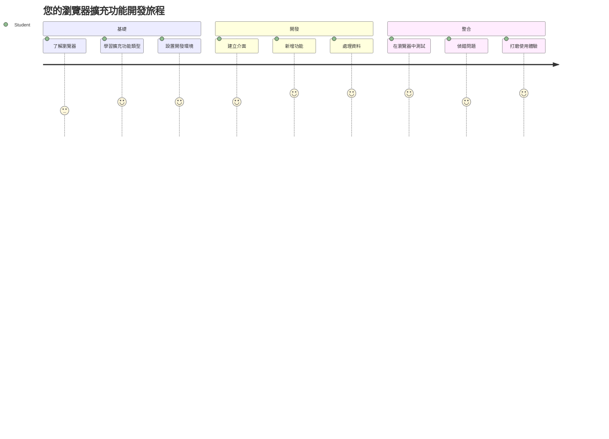
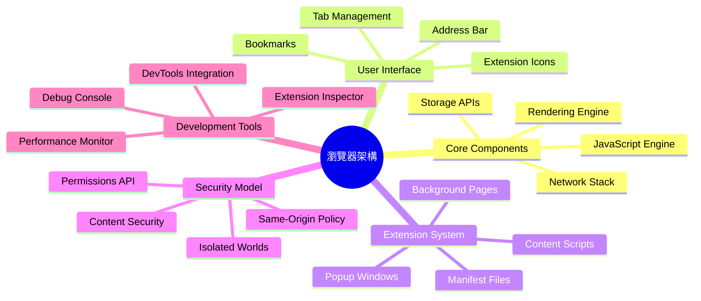
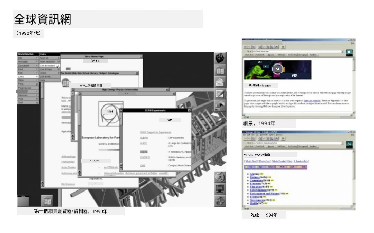
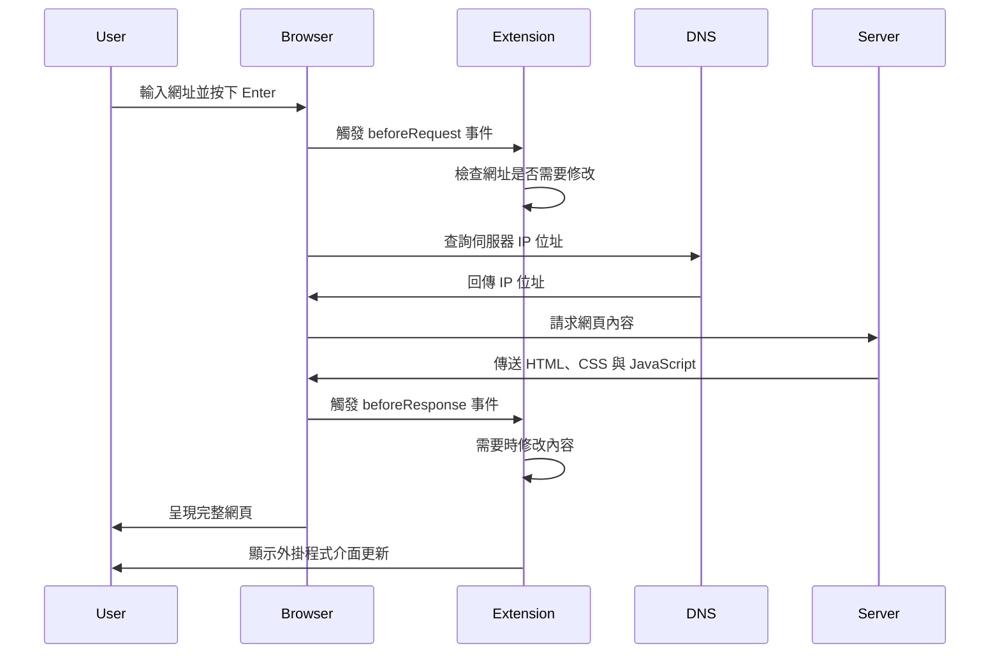
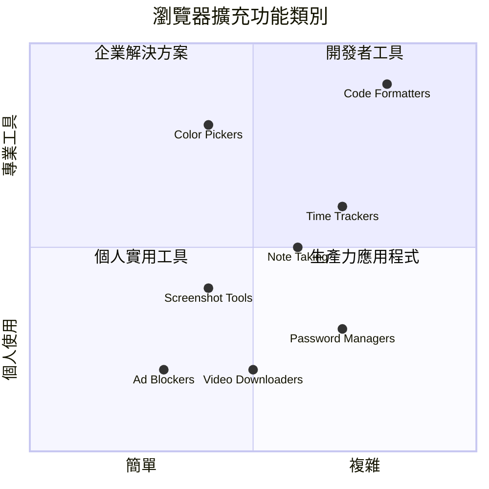
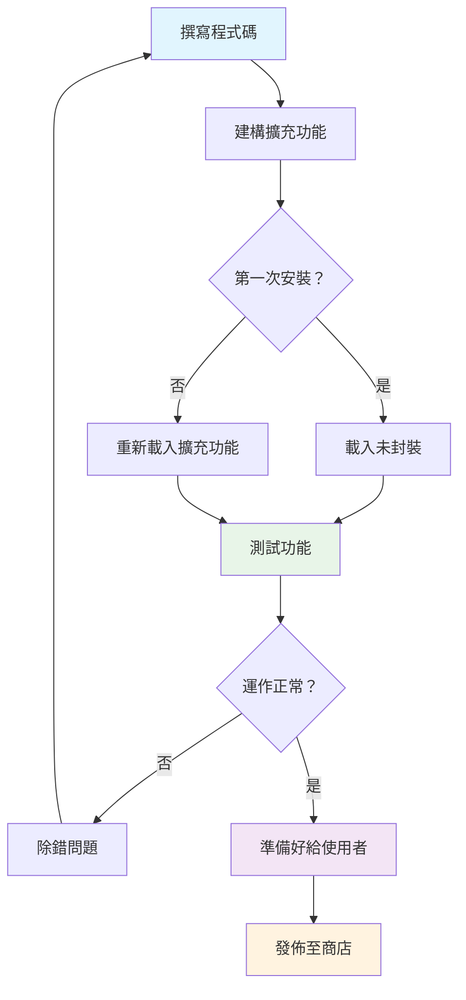
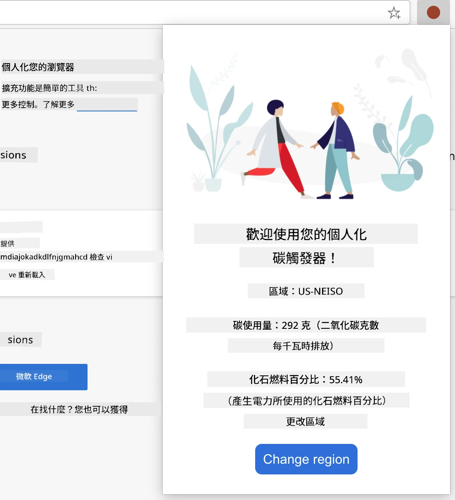
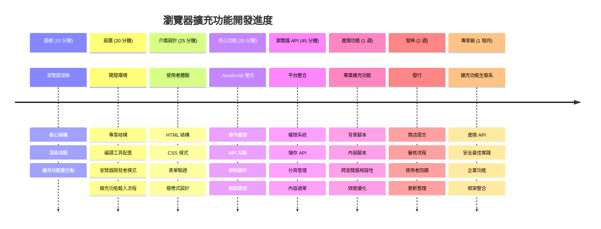

<!--
CO_OP_TRANSLATOR_METADATA:
{
  "original_hash": "00aa85715e1efd4930c17a23e3012e69",
  "translation_date": "2026-01-06T13:55:08+00:00",
  "source_file": "5-browser-extension/1-about-browsers/README.md",
  "language_code": "tw"
}
-->
# 瀏覽器擴充功能專案第一部分：關於瀏覽器的所有知識



> 速寫筆記由 [Wassim Chegham](https://dev.to/wassimchegham/ever-wondered-what-happens-when-you-type-in-a-url-in-an-address-bar-in-a-browser-3dob) 製作

## 課前測驗

[課前測驗](https://ff-quizzes.netlify.app/web/quiz/23)

### 介紹

瀏覽器擴充功能是增強您網路瀏覽體驗的迷你應用程式。就像 Timothy Berners-Lee 最初對互動式網路的願景一樣，擴充功能將瀏覽器的能力擴展到簡單文件瀏覽之外。從保持帳號安全的密碼管理器，到協助設計師挑選完美色調的色彩選取器，擴充功能解決了日常瀏覽中的挑戰。

在我們建立您的第一個擴充功能之前，讓我們先了解瀏覽器的運作方式。就像亞歷山大·格雷厄姆·貝爾（Alexander Graham Bell）在發明電話之前需要理解聲音的傳播原理一樣，了解瀏覽器的基礎知識將有助於您創建與既有瀏覽器系統無縫整合的擴充功能。

本課結束時，您將能了解瀏覽器架構，並開始構建您的第一個擴充功能。


## 理解網頁瀏覽器

網頁瀏覽器本質上是一個複雜的文件解析器。當您在網址列輸入「google.com」，瀏覽器會執行一連串複雜動作——向全球伺服器請求內容，然後解析並渲染程式碼，呈現出您所見的互動式網頁。

這個流程與第一個網頁瀏覽器 WorldWideWeb 由 Tim Berners-Lee 於 1990 年設計，目的是讓具超連結的文件能被大眾存取的精神相呼應。

✅ **小歷史**：第一個瀏覽器叫做「WorldWideWeb」，由 Sir Timothy Berners-Lee 於 1990 年創建。


> 一些早期瀏覽器，圖片來源 [Karen McGrane](https://www.slideshare.net/KMcGrane/week-4-ixd-history-personal-computing)

### 瀏覽器如何處理網頁內容

從輸入網址到看到網頁所經歷的過程包含多個協調完成的步驟，這些都在數秒內完成：


**這個流程完成了以下工作：**
- **將**人類可讀的網址轉譯成伺服器IP位址（DNS查詢）
- **建立**與網路伺服器的安全連線，使用HTTP或HTTPS協議
- **向伺服器請求**特定的網頁內容
- **接收**伺服器回傳的HTML標記、CSS樣式以及JavaScript程式碼
- **渲染**所有內容成為您看到的互動式網頁

### 瀏覽器核心功能

現代瀏覽器提供了眾多功能，擴充功能開發者可以利用：

| 功能 | 目的 | 擴充功能機會 |
|---------|---------|------------------------|
| **渲染引擎** | 顯示HTML、CSS和JavaScript | 內容修改、樣式注入 |
| **JavaScript引擎** | 執行JavaScript程式碼 | 客製腳本、API互動 |
| **本地存儲** | 在地保存資料 | 使用者偏好、緩存資料 |
| **網路堆疊** | 處理網路請求 | 請求監控、資料分析 |
| **安全模型** | 保護使用者免受惡意內容 | 內容過濾、安全強化 |

**理解這些功能幫助您：**
- **辨識**擴充功能能夠在哪些地方加強價值
- **選擇**合適的瀏覽器API提供擴充功能所需功能
- **設計**與瀏覽器系統高效協作的擴充功能
- **確保**您的擴充功能遵循瀏覽器安全最佳實務

### 跨瀏覽器開發注意事項

不同瀏覽器雖然遵循標準，但在實作上有些微差異，就像不同程式語言處理同一演算法會略有不同。Chrome、Firefox 和 Safari 各有特性，開發者在擴充功能開發時必須考慮這些差異。

> 💡 **專業建議**：使用 [caniuse.com](https://www.caniuse.com) 檢查不同瀏覽器對網路技術的支援狀況。這對規劃擴充功能的特性非常有幫助！

**擴充功能開發關鍵考量：**
- **測試**您的擴充功能在 Chrome、Firefox 和 Edge 瀏覽器的運作
- **適應**不同瀏覽器擴充功能API和清單格式的差異
- **處理**不同的效能特性及限制
- **提供**針對瀏覽器特有功能缺失的替代方案

✅ **分析見解**：您可在您的網頁開發專案中安裝分析套件，查明使用者偏好使用的瀏覽器。此數據有助於您優先支援哪些瀏覽器。

## 理解瀏覽器擴充功能

瀏覽器擴充功能直接在瀏覽器介面中加入功能，解決常見網路瀏覽問題。它們不需額外應用程式或複雜流程，方便立即存取工具與功能。

這種概念呼應早期電腦先驅道格拉斯·英格巴特（Douglas Engelbart）如何藉由技術增加人類能力的想法——擴充功能強化了瀏覽器的基本功能。


**流行擴充功能類別及其效益：**
- **生產力工具**：任務管理、筆記應用和時間追蹤器，幫您保持組織
- **安全強化**：密碼管理器、廣告阻擋和隱私工具，保護您的資料
- **開發者工具**：程式碼格式化、色彩挑選和除錯工具，簡化開發
- **內容增強**：閱讀模式、影片下載和截圖工具，改善您的網路體驗

✅ **反思問題**：您最喜歡的瀏覽器擴充功能有哪些？它們執行什麼特定工作，如何改善您的瀏覽體驗？

### 🔄 **教學進度檢查**
**瀏覽器架構理解：** 在進行擴充功能開發前，請確保您能：
- ✅ 解釋瀏覽器如何處理網路請求及渲染內容
- ✅ 辨識瀏覽器架構的主要組成部分
- ✅ 了解擴充功能如何與瀏覽器功能整合
- ✅ 認識保護使用者的安全模型

**快速自我檢測**：您能追蹤從輸入網址到看到網頁的流程嗎？
1. **DNS查詢**將網址轉成IP地址
2. **HTTP請求**從伺服器抓取內容
3. **解析**處理HTML、CSS和JavaScript
4. **渲染**展示最終網頁
5. **擴充功能**可在多個步驟修改內容

## 安裝與管理擴充功能

了解擴充功能安裝流程，能幫助您預期使用者安裝時的體驗。安裝流程在現代瀏覽器中有標準化，介面設計上略有差異。


> **重要提示**：測試自己開發的擴充功能時，請務必開啟開發者模式，並允許來自其他商店的擴充功能。

### 開發階段擴充功能安裝流程

當您自行開發與測試擴充功能時，請遵循此流程：


```bash
# 第一步：建立你的擴充功能
npm run build
```

**此命令完成的工作：**
- **編譯**您的原始碼成瀏覽器可用的檔案
- **打包**JavaScript模組成優化後的封裝
- **產生**最終擴充功能檔案於 `/dist` 資料夾
- **準備**您的擴充功能以供安裝與測試

**步驟2：前往瀏覽器擴充功能頁面**
1. **打開**瀏覽器的擴充功能管理頁面
2. **點擊**右上角「設定與更多」按鈕（三個點 `...`）
3. **從下拉選單**中選擇「擴充功能」

**步驟3：載入您的擴充功能**
- **新安裝**：選擇「載入未封裝擴充功能」，並指定您的 `/dist` 資料夾
- **更新**：點擊已安裝擴充功能旁的「重新載入」
- **測試中**：啟用「開發者模式」以使用更多除錯功能

### 正式版擴充功能安裝

> ✅ **注意**：以上開發指示適用於自行建立的擴充功能。要安裝發佈的擴充功能，請前往官方瀏覽器擴充功能商店，如 [Microsoft Edge 附加元件商店](https://microsoftedge.microsoft.com/addons/Microsoft-Edge-Extensions-Home)。

**理解差異：**
- **開發安裝**允許您在開發中測試尚未發佈的擴充功能
- **商店安裝**提供已審核並發佈的擴充功能，並有自動更新
- **旁載安裝**可從官方商店外安裝擴充功能（需要開發者模式）

## 建立您的碳足跡擴充功能

我們將創建一款顯示您所在區域能源使用碳足跡的瀏覽器擴充功能。這個專案展示了基本的擴充功能開發概念，同時具備環保意識的實用工具。

此方法遵循約翰·杜威（John Dewey）教育理論中的「做中學」原則——結合技術技能與意義重大的現實應用。

### 專案需求

開始開發前，我們先收集所需的資源與相依套件：

**需要的API授權：**
- **[CO2 Signal API key](https://www.co2signal.com/)**：輸入您的電子郵件地址以免費取得API金鑰
- **[區域代碼](http://api.electricitymap.org/v3/zones)**：使用 [Electricity Map](https://www.electricitymap.org/map) 查詢您的區域代碼（例如，波士頓使用 'US-NEISO'）

**開發工具：**
- **[Node.js 和 NPM](https://www.npmjs.com)**：用於安裝專案依賴的套件管理工具
- **[起始程式碼](../../../../5-browser-extension/start)**：下載 `start` 資料夾開始開發

✅ **進階學習**：提升您的套件管理技巧，請參考此 [完整學習模組](https://docs.microsoft.com/learn/modules/create-nodejs-project-dependencies/?WT.mc_id=academic-77807-sagibbon)

### 理解專案架構

了解專案架構有助於高效率組織開發流程。就像亞歷山大圖書館（Alexandria Library）為方便知識檢索而組織良好，一個結構清晰的代碼庫讓開發更有效率：

```
project-root/
├── dist/                    # Built extension files
│   ├── manifest.json        # Extension configuration
│   ├── index.html           # User interface markup
│   ├── background.js        # Background script functionality
│   └── main.js              # Compiled JavaScript bundle
├── src/                     # Source development files
│   └── index.js             # Your main JavaScript code
├── package.json             # Project dependencies and scripts
└── webpack.config.js        # Build configuration
```

**解析各檔案功能：**
- **`manifest.json`**：**定義**擴充功能的元資料、權限及入口點
- **`index.html`**：**建立**使用者介面，當使用者點擊擴充功能圖標會看到此畫面
- **`background.js`**：**處理**背景任務與瀏覽器事件監聽
- **`main.js`**：**包含**編譯後最終打包的JavaScript
- **`src/index.js`**：**儲存**您的開發主程式碼，編譯後會生成`main.js`

> 💡 **組織小提示**：將API金鑰及區域代碼存放在安全筆記中，方便開發過程中參考。這些資料是測試擴充功能功能時必須的。

✅ **安全提醒**：切勿將API金鑰或敏感認證提交至您的程式碼庫。我們會在後續步驟教您如何安全處理這些資料。

## 建立擴充功能介面

接著開始建置使用者介面元件。此擴充功能採用雙畫面設計：配置畫面供初次設定，結果畫面則顯示資料。

這符合界面設計中的漸進式揭露原則——逐步呈現資訊與選項，避免一次給予過多訊息造成使用者困惑。

### 擴充功能畫面總覽

**設定畫面** - 初次使用者配置：


**結果畫面** - 碳足跡資料展示：


### 建立設定表單

設定表單用於收集初次使用時的用戶資料。設定完成後，資料會儲存在瀏覽器中以供未來使用。

在 `/dist/index.html` 檔案中，加入以下表單結構：

```html
<form class="form-data" autocomplete="on">
    <div>
        <h2>New? Add your Information</h2>
    </div>
    <div>
        <label for="region">Region Name</label>
        <input type="text" id="region" required class="region-name" />
    </div>
    <div>
        <label for="api">Your API Key from tmrow</label>
        <input type="text" id="api" required class="api-key" />
    </div>
    <button class="search-btn">Submit</button>
</form>
```

**此表單實現的功能：**
- **建立**具語意的表單結構，配合適當標籤和輸入欄位關聯
- **啟用**瀏覽器自動完成，提升使用者體驗
- **使用** `required` 屬性，要求兩欄必填才能送出
- **組織**輸入欄位具描述性的類別名稱，便利樣式與JavaScript操作
- **提供**明確指示，協助首次設定擴充功能的使用者

### 建立結果顯示畫面

接著，建立顯示碳足跡資料的區域。於表單下方加入此HTML結構：

```html
<div class="result">
    <div class="loading">loading...</div>
    <div class="errors"></div>
    <div class="data"></div>
    <div class="result-container">
        <p><strong>Region: </strong><span class="my-region"></span></p>
        <p><strong>Carbon Usage: </strong><span class="carbon-usage"></span></p>
        <p><strong>Fossil Fuel Percentage: </strong><span class="fossil-fuel"></span></p>
    </div>
    <button class="clear-btn">Change region</button>
</div>
```

**此結構提供的功能拆解：**
- **`loading`**：**顯示**API資料擷取時的讀取訊息
- **`errors`**：**展示**API呼叫失敗或資料錯誤時的錯誤訊息
- **`data`**：**保存**除錯用的原始資料
- **`result-container`**：**呈現**格式化的碳足跡資訊給使用者
- **`clear-btn`**：**允許**使用者變更區域並重新設定擴充功能

### 設定建置流程

現在安裝專案依賴，並測試建置流程：

```bash
npm install
```

**此安裝流程完成的工作：**
- **下載**Webpack 及 package.json 指定的其他開發依賴套件
- **設定**建置工具鏈，編譯現代JavaScript程式碼
- **準備**開發環境以構建並測試擴充功能
- **啟用**程式碼打包、優化與跨瀏覽器相容功能

> 💡 **建置流程洞察**：Webpack 會將您 `/src/index.js` 的原始碼打包成 `/dist/main.js`，優化您的程式碼以用於正式環境並確保瀏覽器兼容。

### 測試您的進度

此時，您可以測試您的擴充功能：
1. **執行** build 指令以編譯你的程式碼  
2. **載入** 擴充功能到瀏覽器，使用開發者模式  
3. **確認** 表單正確顯示且專業美觀  
4. **檢查** 所有表單元素是否正確對齊且可正常使用  

**你已完成的事項：**  
- **建立** 擴充功能的基礎 HTML 結構  
- **創建** 具語義化標記的設定與結果介面  
- **設置** 使用業界標準工具的現代化開發流程  
- **準備** 新增互動式 JavaScript 功能的基礎  

### 🔄 **教學檢核**  
**擴充功能開發進度**：在繼續前確認你的理解：  
- ✅ 你能說明專案結構中各檔案的用途嗎？  
- ✅ 你了解建置流程如何轉換原始碼嗎？  
- ✅ 為什麼要將設定與結果分成不同的 UI 區塊？  
- ✅ 表單結構如何支援易用性與無障礙？  

**開發流程理解**：你現在應該能夠：  
1. **修改**擴充功能介面的 HTML 與 CSS  
2. **執行** build 指令編譯變更  
3. **重新載入**瀏覽器中的擴充功能以測試更新  
4. **使用**瀏覽器開發者工具進行除錯  

你已完成瀏覽器擴充功能開發的第一階段。正如萊特兄弟在成功飛行前必須理解空氣動力學，理解這些基礎概念能幫助你在下一課中建造更多複雜的互動功能。  

## GitHub Copilot Agent 挑戰 🚀  

使用 Agent 模式完成以下挑戰：  

**說明：** 透過新增表單驗證與用戶回饋功能來提升擴充功能使用者在輸入 API 金鑰與區域代碼時的體驗。  

**提示：** 建立 JavaScript 驗證函式，檢查 API 金鑰欄位至少含有 20 個字元，並確保區域代碼格式正確（例如 'US-NEISO'）。加入視覺反饋，將輸入框框的邊框顏色改為綠色表示有效，紅色表示無效。另增設切換功能以顯示/隱藏 API 金鑰以確保安全。  

想了解更多 [agent mode](https://code.visualstudio.com/blogs/2025/02/24/introducing-copilot-agent-mode)。  

## 🚀 挑戰  

瀏覽擴充功能商店並安裝一個到你的瀏覽器，觀察其檔案構成，有什麼發現？  

## 課後測驗  

[課後測驗](https://ff-quizzes.netlify.app/web/quiz/24)  

## 複習與自學  

本課你稍微了解了網頁瀏覽器的歷史；趁此機會多讀一些關於萬維網發明者如何設想網路用途的歷史資料。以下幾個網站很有參考價值：  

[網頁瀏覽器歷史](https://www.mozilla.org/firefox/browsers/browser-history/)  

[網路歷史](https://webfoundation.org/about/vision/history-of-the-web/)  

[提姆·柏納斯-李訪談](https://www.theguardian.com/technology/2019/mar/12/tim-berners-lee-on-30-years-of-the-web-if-we-dream-a-little-we-can-get-the-web-we-want)  

### ⚡ **接下來 5 分鐘內可以做的事**  
- [ ] 開啟 Chrome/Edge 擴充功能頁面（chrome://extensions）並瀏覽已安裝項目  
- [ ] 載入網頁時檢視瀏覽器開發者工具的 Network 分頁  
- [ ] 嘗試查看頁面原始碼（Ctrl+U），了解 HTML 結構  
- [ ] 檢視任何網頁元素並於 DevTools 調整其 CSS  

### 🎯 **本小時可完成的目標**  
- [ ] 完成課後測驗並理解瀏覽器基礎  
- [ ] 建立基本的 manifest.json 瀏覽器擴充功能檔案  
- [ ] 製作簡易的「Hello World」擴充功能，並顯示彈出窗口  
- [ ] 測試在開發者模式下載入你的擴充功能  
- [ ] 瀏覽目標瀏覽器的擴充功能文件  

### 📅 **你的週期擴充功能旅程**  
- [ ] 完成一個具備實用功能的瀏覽器擴充功能  
- [ ] 了解內容腳本、背景腳本與彈出視窗互動  
- [ ] 精通瀏覽器 API，如儲存、分頁與訊息傳遞  
- [ ] 設計使用者友善的擴充功能介面  
- [ ] 測試你的擴充功能於不同網站與使用情境  
- [ ] 發布擴充功能到瀏覽器擴充商店  

### 🌟 **你的月度瀏覽器開發目標**  
- [ ] 建置多個解決不同用戶需求的擴充功能  
- [ ] 學習進階瀏覽器 API 及安全最佳實踐  
- [ ] 貢獻開源瀏覽器擴充功能專案  
- [ ] 精通跨瀏覽器相容性與漸進式增強技巧  
- [ ] 創造擴充功能開發工具與模板供他人使用  
- [ ] 成為協助其他開發者的瀏覽器擴充功能專家  

## 🎯 你的瀏覽器擴充功能精通時間表  


### 🛠️ 你的擴充功能開發工具箱摘要  

完成本課後，你已具備：  
- **瀏覽器架構知識**：了解渲染引擎、安全模型與擴充功能整合  
- **開發環境**：現代化開發工具鏈，包含 Webpack、NPM 與除錯功能  
- **介面設計基礎**：語義化的 HTML 結構與逐步揭露設計模式  
- **安全意識**：瀏覽器權限與安全開發實務的理解  
- **跨瀏覽器概念**：相容性考量與測試方法的知識  
- **API 整合**：與外部資料來源合作的基礎  
- **專業工作流程**：業界標準的開發與測試程序  

**實務應用範圍**：這些技能直接適用於  
- **網頁開發**：單頁應用程式（SPA）與漸進式網頁應用（PWA）  
- **桌面應用**：Electron 與基於網路的桌面軟體  
- **行動裝置開發**：混合式與網頁行動應用  
- **企業工具**：內部生產力應用與工作流程自動化  
- **開源專案**：參與瀏覽器擴充功能與網頁標準開發  

**下一階段**：你已準備好新增互動功能、使用瀏覽器 API，並創建解決實際使用者問題的擴充功能！  

## 作業  

[重新設計你的擴充功能](assignment.md)

---

<!-- CO-OP TRANSLATOR DISCLAIMER START -->
**免責聲明**：  
本文件係使用 AI 翻譯服務 [Co-op Translator](https://github.com/Azure/co-op-translator) 進行翻譯。雖然我們努力確保翻譯準確，但請注意，自動翻譯可能包含錯誤或不準確之處。原始文件之母語版本應視為權威來源。對於關鍵資訊，建議採用專業人工翻譯。本公司對於因使用本翻譯而產生的任何誤解或曲解概不負責。
<!-- CO-OP TRANSLATOR DISCLAIMER END -->