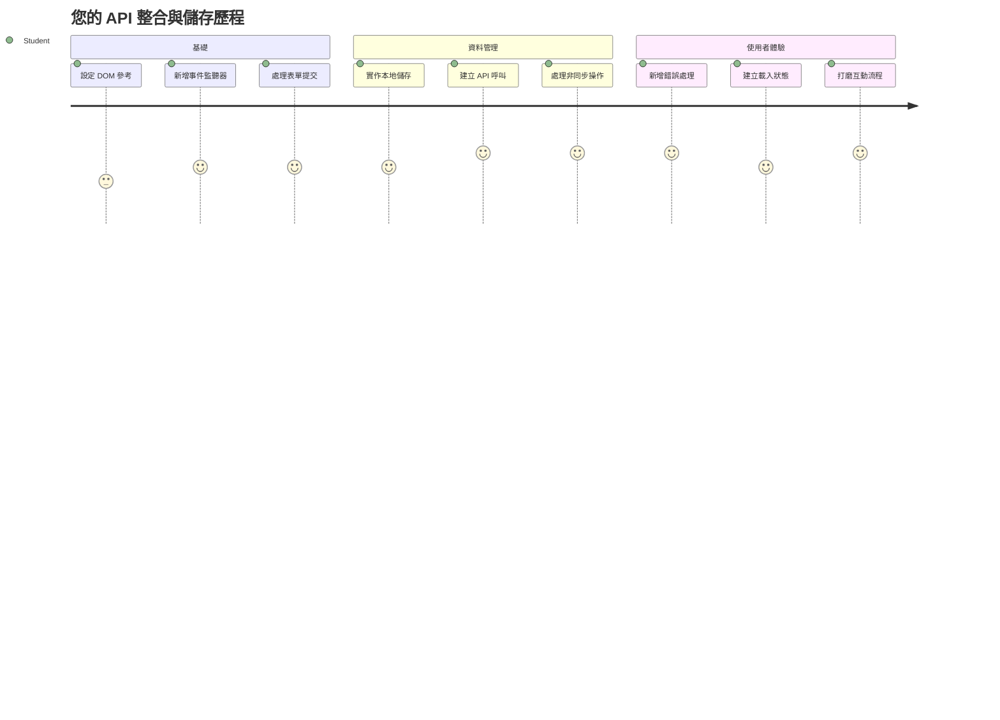
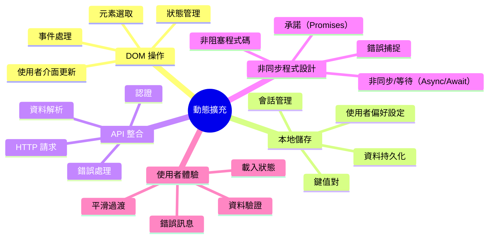
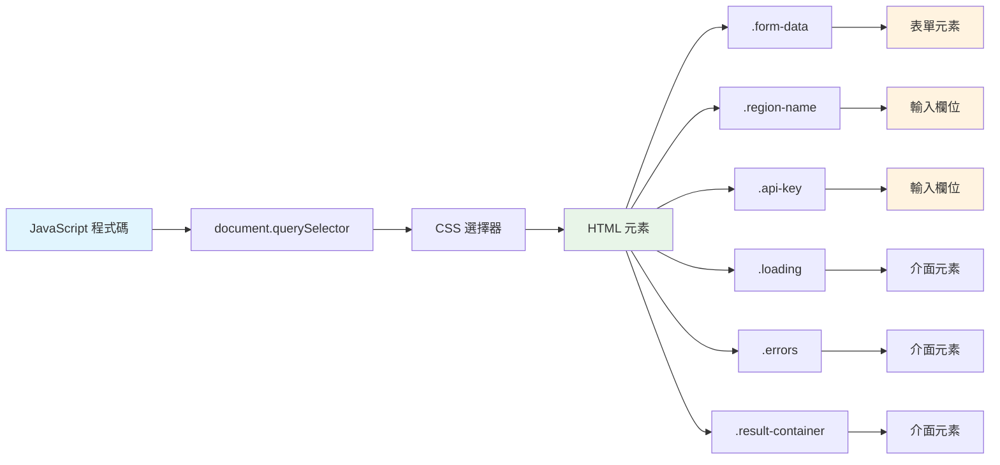
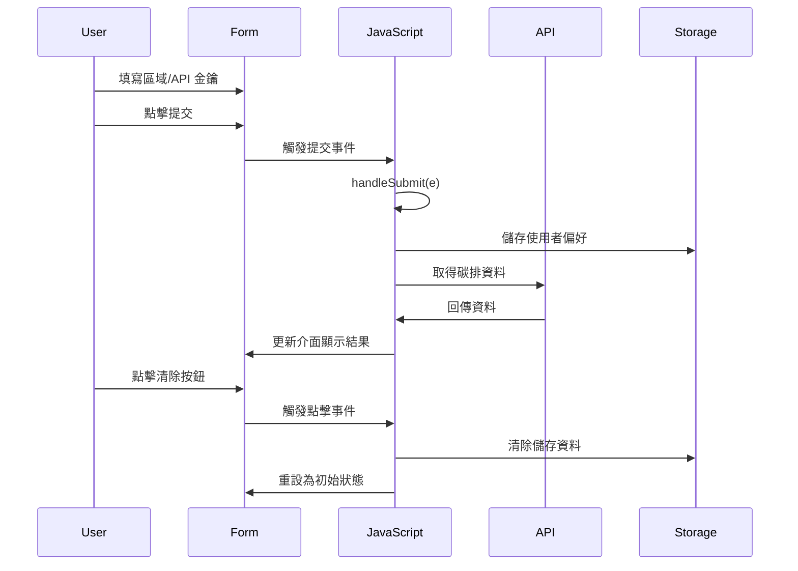
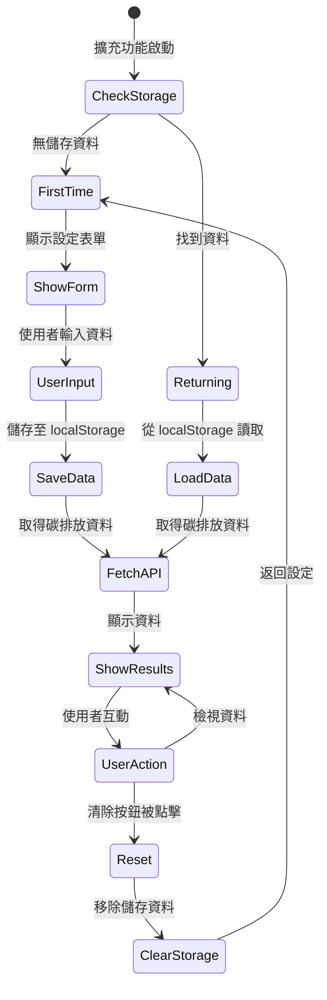
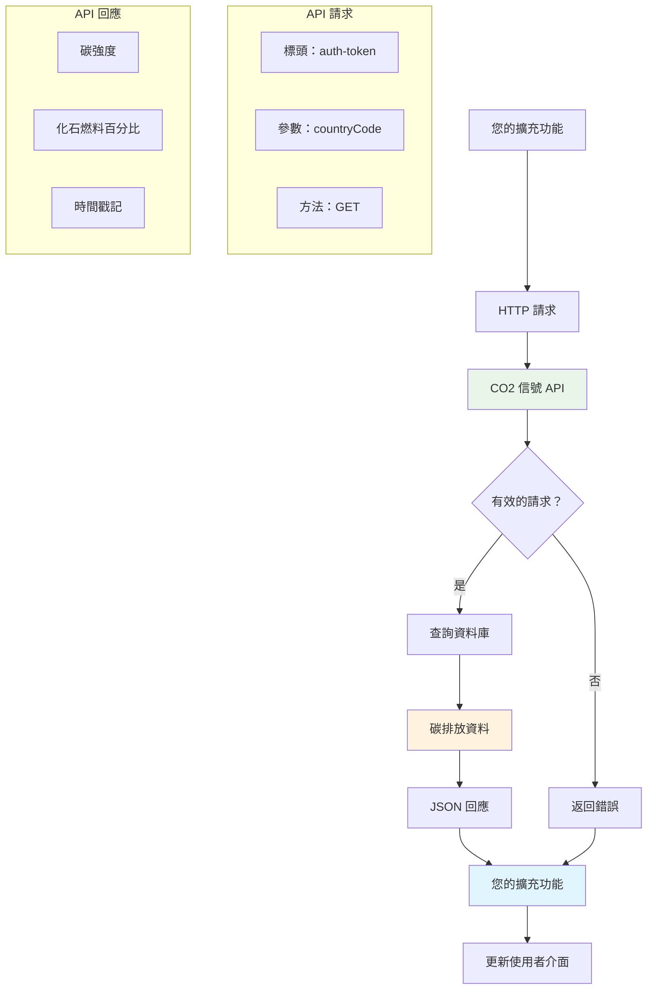
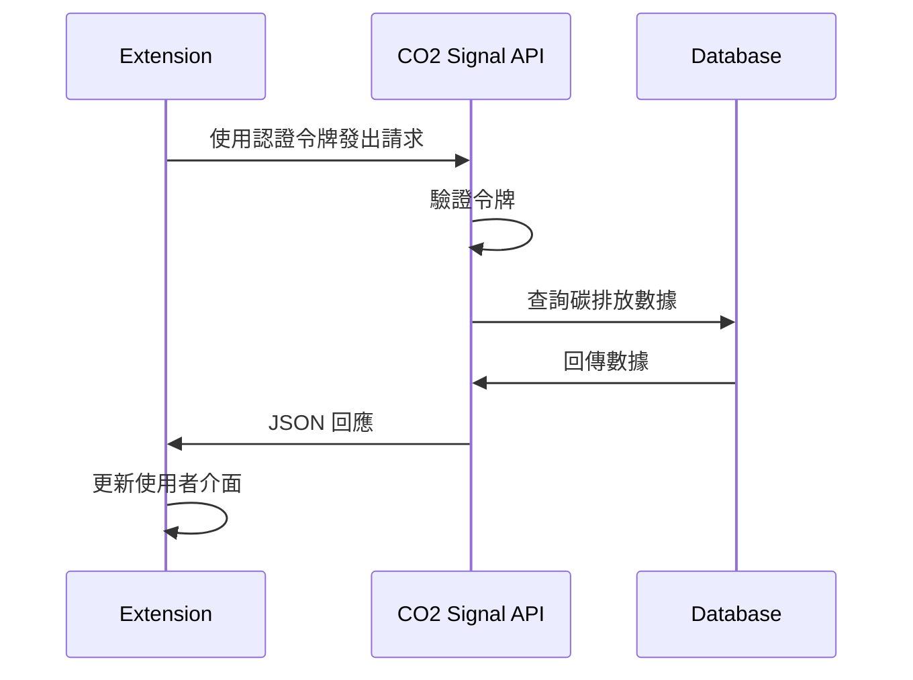
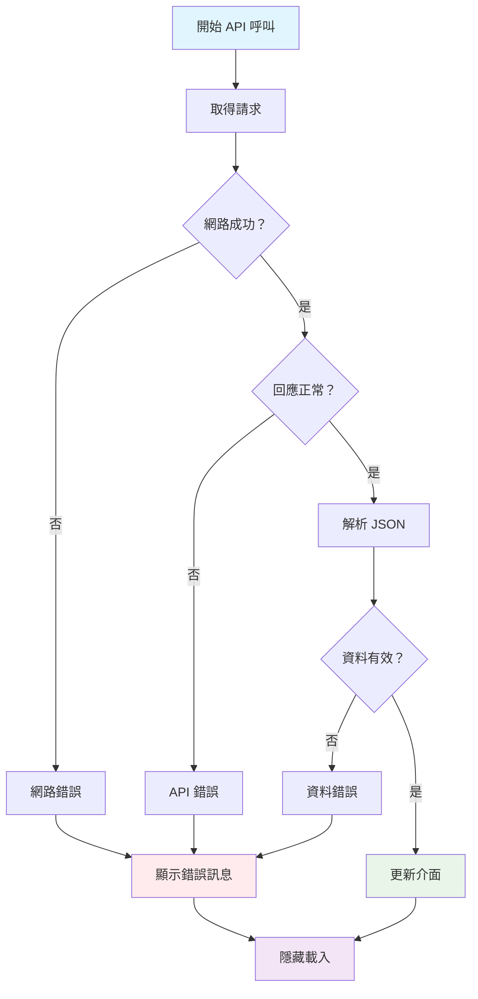
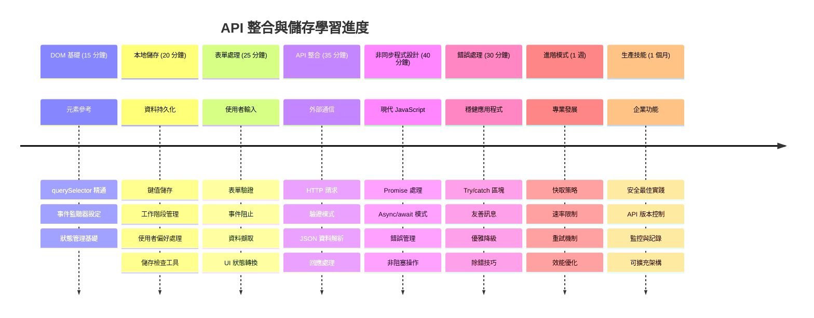

<!--
CO_OP_TRANSLATOR_METADATA:
{
  "original_hash": "2b6203a48c48d8234e0948353b47d84e",
  "translation_date": "2026-01-06T13:50:40+00:00",
  "source_file": "5-browser-extension/2-forms-browsers-local-storage/README.md",
  "language_code": "tw"
}
-->
# 瀏覽器擴充功能專案第二部分：呼叫 API，使用本機儲存空間


## 課前測驗

[課前測驗](https://ff-quizzes.netlify.app/web/quiz/25)

## 介紹

還記得你先前開始建置的瀏覽器擴充功能嗎？現在你已有一個美觀的表單，但它本質上是靜態的。今天，我們將讓它活起來，藉由連接真實資料並賦予它記憶功能。

想像阿波羅任務控制中心的電腦──它們不只是顯示固定資訊，而是持續與太空船溝通，更新遙測資料，並記錄關鍵任務參數。這就是我們今天將打造的動態行為。你的擴充功能將連網抓取真實的環境資料，並記住你的設定以便下次使用。

API 整合聽起來可能很複雜，但其實就是教導你的程式如何與其他服務溝通。不論你是在取得天氣資料、社群媒體資訊，還是像今天一樣抓碳足跡資料，重點都是建立這些數位連結。我們也會探討瀏覽器如何持久保存資料──就像圖書館曾使用卡片目錄記住書本的位置。

本課結束時，你將擁有一個能抓實時資料、儲存使用者偏好並提供順暢體驗的瀏覽器擴充功能。讓我們開始吧！


✅ 請依據適當檔案中的編號段落來放置程式碼

## 設定要在擴充功能中操作的元素

在你的 JavaScript 能操控介面之前，需要先取得對特定 HTML 元素的參考。就像望遠鏡必須對準特定星星一樣──蓋利略研究木星的衛星前，得先找到並聚焦在木星本身。

在你的 `index.js` 檔案中，我們會建立 `const` 變數來擷取每個重要表單元素的參考。這就像科學家貼標籤給設備──不用每次都在實驗室裡東找西找，直接取得所需即可。


```javascript
// 表單欄位
const form = document.querySelector('.form-data');
const region = document.querySelector('.region-name');
const apiKey = document.querySelector('.api-key');

// 結果
const errors = document.querySelector('.errors');
const loading = document.querySelector('.loading');
const results = document.querySelector('.result-container');
const usage = document.querySelector('.carbon-usage');
const fossilfuel = document.querySelector('.fossil-fuel');
const myregion = document.querySelector('.my-region');
const clearBtn = document.querySelector('.clear-btn');
```

**此段程式碼的功能：**
- **擷取** 使用 `document.querySelector()` 搭配 CSS 類別選擇器來取得表單元素
- **建立** 輸入欄位如地域名稱與 API 金鑰的參考
- **設定** 用於顯示碳排放資料的結果元素連結
- **準備** 介面元件如載入指示器和錯誤訊息的參考
- **將** 每個元素參考存放於 `const` 變數以便在程式中重複使用

## 加入事件監聽器

接著讓你的擴充功能能對使用者行為做出反應。事件監聽器就是你的程式負責監控使用者互動的方式。想像早期電話交換員──他們聽有無來電，並在有人想接通時連接正確的電路。


```javascript
form.addEventListener('submit', (e) => handleSubmit(e));
clearBtn.addEventListener('click', (e) => reset(e));
init();
```

**理解這些概念：**
- **綁定** 表單提交事件的監聽器，當用戶按 Enter 鍵或點擊送出時觸發
- **綁定** 清除按鈕的點擊事件，重設表單
- **將** 事件對象 `(e)` 傳入處理函式以增強控制
- **立即呼叫** `init()` 函式來設定擴充功能的初始狀態

✅ 注意這裡使用的簡寫箭頭函式語法。這是較現代的 JavaScript 用法，比傳統函式表達式更簡潔，但兩種都能正常運作！

### 🔄 **教學檢核點**
**事件處理理解檢核**：在移至初始化前，請確保你能：
- ✅ 解釋 `addEventListener` 如何將使用者行為連結至 JavaScript 函式
- ✅ 理解為何要將事件物件 `(e)` 傳入處理函式
- ✅ 辨識 `submit` 與 `click` 事件的差異
- ✅ 描述 `init()` 函式什麼時候執行及原因

**快速自測**：如果忘了在表單提交時呼叫 `e.preventDefault()` 會發生什麼？
*回答：頁面會重新載入，導致所有 JavaScript 狀態遺失並中斷使用者體驗*

## 建立初始化與重設函式

我們來撰寫你的擴充功能初始化邏輯。`init()` 函式就像航船的導航系統檢查儀器──判斷現況並調整介面。它會檢查使用者是否已使用過你的擴充功能，並載入先前設定。

`reset()` 函式則讓使用者可以重新開始──像科學家在實驗間歇重設儀器以確保資料乾淨。

```javascript
function init() {
	// 檢查使用者是否先前已儲存 API 憑證
	const storedApiKey = localStorage.getItem('apiKey');
	const storedRegion = localStorage.getItem('regionName');

	// 將擴充功能圖示設為通用綠色（未來課程佔位符）
	// 待辦事項：在下一課程中實作圖示更新

	if (storedApiKey === null || storedRegion === null) {
		// 新用戶：顯示設定表單
		form.style.display = 'block';
		results.style.display = 'none';
		loading.style.display = 'none';
		clearBtn.style.display = 'none';
		errors.textContent = '';
	} else {
		// 回訪用戶：自動載入已儲存的資料
		displayCarbonUsage(storedApiKey, storedRegion);
		results.style.display = 'none';
		form.style.display = 'none';
		clearBtn.style.display = 'block';
	}
}

function reset(e) {
	e.preventDefault();
	// 清除已存地區以允許使用者選擇新位置
	localStorage.removeItem('regionName');
	// 重新啟動初始化程序
	init();
}
```

**這段程式碼步驟說明：**
- **從瀏覽器本機儲存空間中** 取出 API 金鑰與地域名稱
- **判斷** 是否為新用戶（無儲存資料）或是回訪用戶
- **顯示** 新手設定表單並隱藏其他介面元素
- **自動載入** 儲存資料並顯示重設按鈕給回訪用戶
- **根據資料狀態管理** 使用者介面呈現

**關於本機儲存的關鍵概念：**
- **在瀏覽器會話間持久保存**資料（不同於 session storage）
- **以鍵值對方式儲存資料**，透過 `getItem()` 和 `setItem()` 操作
- **當指定鍵無資料時會回傳 `null`**
- **簡便方式儲存使用者偏好與設定**

> 💡 **理解瀏覽器儲存空間**：[LocalStorage](https://developer.mozilla.org/docs/Web/API/Window/localStorage) 就像給你的擴充功能一個持久記憶。想像古代亞歷山大圖書館如何保存羊皮卷──知識即使學者離開再次回來仍能被取得。
>
> **重要特性：**
> - 即使關閉瀏覽器仍持續保存資料
> - 可抵抗電腦重啟與瀏覽器當機
> - 提供足夠空間保存使用者偏好
> - 無需網路延遲即時存取

> **重要說明**：瀏覽器擴充功能擁有獨立的本機儲存空間，與一般網頁隔離。提供安全性並避免與其他網站衝突。

你可以打開瀏覽器開發者工具（F12），切換到 **Application** 分頁，展開 **Local Storage** 以查看儲存的資料。




> ⚠️ **安全性考量**：在正式應用程式中，將 API 金鑰存放於 LocalStorage 有安全風險，因為 JavaScript 可讀取此資料。學習階段可接受，但實際應用應使用安全的伺服器端儲存機制保存敏感憑證。

## 處理表單提交

現在我們來處理使用者提交表單時的行為。瀏覽器預設會在表單提交時重新整理頁面，我們將攔截這個行為以提供更順暢的體驗。

這與任務控制中心處理太空船通訊類似──他們不會每次通訊時重新啟動整個系統，而是持續操作並處理新資訊。

建立一個函式來捕捉表單提交事件並取得使用者輸入：

```javascript
function handleSubmit(e) {
	e.preventDefault();
	setUpUser(apiKey.value, region.value);
}
```

**以上內容說明：**
- **阻止** 預設提交行為避免頁面重新整理
- **取得** API 金鑰與地域欄位的使用者輸入值
- **將** 表單資料交給 `setUpUser()` 函式處理
- **保持** 單頁應用程式行為，避免頁面重整

✅ 記得你的 HTML 表單欄位均設有 `required` 屬性，瀏覽器會自動驗證使用者是否輸入 API 金鑰和地域，才會觸發此函式。

## 設定使用者偏好

`setUpUser` 函式負責儲存使用者憑證並啟動第一次 API 呼叫，讓流程從設定到結果展現順暢過渡。

```javascript
function setUpUser(apiKey, regionName) {
	// 儲存使用者認證以供未來使用
	localStorage.setItem('apiKey', apiKey);
	localStorage.setItem('regionName', regionName);
	
	// 更新使用者介面以顯示載入狀態
	loading.style.display = 'block';
	errors.textContent = '';
	clearBtn.style.display = 'block';
	
	// 使用使用者認證擷取碳排放使用資料
	displayCarbonUsage(apiKey, regionName);
}
```

**逐步說明：**
- **將** API 金鑰與地域名稱存入本機儲存空間以備日後使用
- **顯示** 載入中指示，告知使用者資料正在抓取
- **清除** 先前顯示的錯誤訊息
- **顯示** 清除按鈕以供使用者日後重設設定
- **開始** 呼叫 API 擷取真實碳排放資料

此函式統一管理資料持久化與使用者介面更新，確保使用者體驗流暢。

## 顯示碳排放資料

接著讓你的擴充功能連結外部資料來源──API，將它從獨立工具轉變為可取得全球即時資訊的利器。

**理解 API**

[API](https://www.webopedia.com/TERM/A/API.html) 是應用程式間通訊的橋樑。可以將它想像成 19 世紀連結遙遠城市的電報系統，操作員發送請求至遠方站台，並取得所需回應。你每次查看社群媒體、問語音助理問題或用外送 App，都在透過 API 交換資料。


**REST API 的核心概念：**
- **REST** 代表「表述性狀態轉換」（Representational State Transfer）
- **使用** 標準 HTTP 方法（GET、POST、PUT、DELETE）操作資料
- **回傳** 通常是格式確定的資料，如 JSON
- **提供** 穩定且基於 URL 的端點供不同請求使用

✅ 我們使用的 [CO2 Signal API](https://www.co2signal.com/) 提供全球電網的即時碳強度資料，有助使用者了解電力使用對環境的影響。

> 💡 **異步 JavaScript 理解**：`async` 關鍵字讓你的程式能同時處理多項任務。當你向伺服器要求資料時，不希望整個擴充功能停擺──那就如同航空管制在等一架飛機回答時停止所有調度。
>
> **主要好處：**
> - **維持** 擴充功能回應性，資料加載期間不死機
> - **允許** 其他程式碼在網路請求時繼續執行
> - **改善** 可讀性，相較於傳統 callback 更直覺
> - **支援** 網路異常時的優雅錯誤處理

以下是一段關於 `async` 的簡短影片：

[](https://youtube.com/watch?v=YwmlRkrxvkk "使用 Async 與 Await 管理 Promise")

> 🎥 點擊上方圖片觀看 async/await 介紹影片。

### 🔄 **教學檢核點**
**異步程式設計理解：** 在深入 API 函式前，請確認你了解：
- ✅ 為什麼使用 `async/await` 避免凍結擴充功能
- ✅ 如何用 `try/catch` 區塊優雅處理網路錯誤
- ✅ 同步與異步作業間的差異
- ✅ API 呼叫失敗原因與錯誤處理方式

**生活連結範例：**
- **點餐**：你不會站在廚房等，拿到收據後繼續忙別的事
- **寄信**：郵件發送時 App 不會凍結，你可以繼續寫信
- **網頁載入**：圖片可以邊載入邊讀文字

**API 認證流程**：

建立抓取並顯示碳排放資料的函式：

```javascript
// 現代 fetch API 方式（不需要外部依賴）
async function displayCarbonUsage(apiKey, region) {
	try {
		// 從 CO2 Signal API 擷取碳強度數據
		const response = await fetch('https://api.co2signal.com/v1/latest', {
			method: 'GET',
			headers: {
				'auth-token': apiKey,
				'Content-Type': 'application/json'
			},
			// 為特定區域新增查詢參數
			...new URLSearchParams({ countryCode: region }) && {
				url: `https://api.co2signal.com/v1/latest?countryCode=${region}`
			}
		});

		// 檢查 API 請求是否成功
		if (!response.ok) {
			throw new Error(`API request failed: ${response.status}`);
		}

		const data = await response.json();
		const carbonData = data.data;

		// 計算四捨五入的碳強度值
		const carbonIntensity = Math.round(carbonData.carbonIntensity);

		// 使用擷取的數據更新使用者介面
		loading.style.display = 'none';
		form.style.display = 'none';
		myregion.textContent = region.toUpperCase();
		usage.textContent = `${carbonIntensity} grams (grams CO₂ emitted per kilowatt hour)`;
		fossilfuel.textContent = `${carbonData.fossilFuelPercentage.toFixed(2)}% (percentage of fossil fuels used to generate electricity)`;
		results.style.display = 'block';

		// TODO: calculateColor(carbonIntensity) - 下一課程實作

	} catch (error) {
		console.error('Error fetching carbon data:', error);
		
		// 顯示使用者友善的錯誤訊息
		loading.style.display = 'none';
		results.style.display = 'none';
		errors.textContent = 'Sorry, we couldn\'t fetch data for that region. Please check your API key and region code.';
	}
}
```

**這段程式碼說明：**
- **使用** 現代的 `fetch()` API，避免額外依賴如 Axios 等外部函式庫，使程式更精簡
- **加入** 正確的錯誤判斷 `response.ok`，提早偵測 API 呼叫失敗
- **以** `async/await` 管理非同步流程，使程式碼更易讀
- **透過** `auth-token` 標頭驗證 CO2 Signal API
- **解析** JSON 回應並取出碳強度資訊
- **更新** 多個介面元素，格式化呈現環境數據
- **在** API 發生錯誤時顯示友善的錯誤訊息

**展現 JavaScript 重要現代概念：**
- 利用 `${}` 的模板字串潔淨格式化文字
- 使用 try/catch 做錯誤處理，提升應用健壯性
- async/await 處理網路請求，控制流程自然
- 物件解構賦值取得 API 回傳中特定資料
- 方法鏈結應用於多重 DOM 操作

✅ 此函式示範多項網頁開發核心技巧──與外部伺服器通信、認證、資料處理、介面更新及錯誤管理。這些都是職業程式設計師日常運用的基本能力。


### 🔄 **教學檢核點**
**系統全貌理解**：確認你已掌握整個流程：
- ✅ DOM 參考如何使 JavaScript 控制介面
- ✅ 為何本機儲存令資料能在瀏覽器會話間永久保存
- ✅ async/await 如何非凍結地進行 API 請求
- ✅ API 連線失敗時發生什麼及錯誤如何處理
- ✅ 使用者體驗包含載入狀態及錯誤訊息的原因

🎉 **你已完成：** 製作出一個：
- **連上互聯網並擷取真實環境資料**
- **在會話間持續保存使用者設定**
- **能夠錯誤優雅處理而非崩潰**
- **提供流暢且專業的使用者體驗**

嘗試使用 `npm run build` 並在瀏覽器重新載入擴充功能，現在你已有功能完善的碳足跡追蹤器。下一課將加入動態圖示功能，完成整個擴充功能專案。

---

## GitHub Copilot Agent 挑戰 🚀

使用 Agent 模式完成以下挑戰：
**說明：** 透過新增錯誤處理改進和使用者體驗功能來增強瀏覽器擴充功能。這個挑戰將幫助你練習使用 API、本地存儲和現代 JavaScript 應用於 DOM 操作的技巧。

**提示：** 建立 displayCarbonUsage 函式的增強版，包含：1) 失敗 API 呼叫的指數退避重試機制，2) 在進行 API 呼叫前對區域代碼進行輸入驗證，3) 帶有進度指示器的加載動畫，4) 以 localStorage 快取 API 回應並設定過期時間（快取 30 分鐘），以及 5) 顯示先前 API 呼叫歷史資料的功能。並新增適當的 TypeScript 風格 JSDoc 註解，記錄所有函式參數與回傳型別。

在此了解更多關於 [agent mode](https://code.visualstudio.com/blogs/2025/02/24/introducing-copilot-agent-mode)。

## 🚀 挑戰

透過探索豐富的瀏覽器 API，加深你對 API 的理解，這些瀏覽器 API 對網頁開發都非常重要。請從以下瀏覽器 API 中選擇一個，進行小型示範開發：

- [地理位置 API](https://developer.mozilla.org/docs/Web/API/Geolocation_API) - 取得使用者目前位置
- [通知 API](https://developer.mozilla.org/docs/Web/API/Notifications_API) - 傳送桌面通知
- [HTML 拖放 API](https://developer.mozilla.org/docs/Web/API/HTML_Drag_and_Drop_API) - 建立互動式拖放介面
- [Web Storage API](https://developer.mozilla.org/docs/Web/API/Web_Storage_API) - 進階本地存儲技巧
- [Fetch API](https://developer.mozilla.org/docs/Web/API/Fetch_API) - XMLHttpRequest 的現代替代方案

**研究問題以供考慮：**
- 這個 API 解決了哪些實際問題？
- 這個 API 如何處理錯誤與邊緣情況？
- 使用此 API 時有哪些安全性注意事項？
- 此 API 在不同瀏覽器中支援度如何？

完成研究後，請歸納出使 API 對開發者友善且可靠的特徵。

## 課後測驗

[課後測驗](https://ff-quizzes.netlify.app/web/quiz/26)

## 複習與自我學習

本課你學到 LocalStorage 與 API，都是專業網頁開發者非常實用的技術。你能思考它們如何協同運作嗎？試著想像你會如何架構一個網站，將要由 API 使用的資料存取與保存。

### ⚡ **你接下來 5 分鐘能做的事情**
- [ ] 打開開發者工具 Application 分頁並探索任一網站的 localStorage
- [ ] 建立簡單的 HTML 表單並測試瀏覽器內建表單驗證
- [ ] 嘗試在瀏覽器控制台使用 localStorage 儲存及取回資料
- [ ] 使用 Network 分頁檢查送出的表單資料

### 🎯 **你這一小時可以達成目標**
- [ ] 完成課後測驗並了解表單處理概念
- [ ] 建立瀏覽器擴充功能的表單，並保存使用者偏好設定
- [ ] 實作客戶端表單驗證並顯示有用的錯誤訊息
- [ ] 練習使用 chrome.storage API 來維持擴充功能資料
- [ ] 建立響應已保存使用者設定的介面

### 📅 **你為期一週的擴充功能開發計畫**
- [ ] 完成具有完整表單功能的瀏覽器擴充功能
- [ ] 精通不同存儲選項：local、sync 和 session
- [ ] 實作高級表單功能，如自動完成和驗證
- [ ] 新增使用者資料的匯入/匯出功能
- [ ] 在不同瀏覽器中完整測試你的擴充功能
- [ ] 打磨擴充功能的使用者體驗和錯誤處理

### 🌟 **你為期一個月的網頁 API 精通計畫**
- [ ] 使用多種瀏覽器存儲 API 建立複雜應用
- [ ] 學習離線優先開發模式
- [ ] 參與與資料持久化相關的開源專案
- [ ] 精通隱私導向開發與 GDPR 合規
- [ ] 建立可重複使用的表單處理及資料管理函式庫
- [ ] 分享有關網頁 API 和擴充功能開發的知識

## 🎯 你的擴充功能開發精通時間軸


### 🛠️ 你的全端開發工具組總結

完成本課後，你現在擁有：
- **DOM 精通**：精確的元素定位及操作
- **存儲專家**：以 localStorage 管理持久資料
- **API 整合**：即時資料擷取與身份驗證
- **非同步編程**：使用現代 JavaScript 非阻塞操作
- **錯誤處理**：打造能優雅應對錯誤的強健應用
- **使用者體驗**：加載狀態、驗證與流暢互動設計
- **現代開發模式**：fetch API、async/await 與 ES6+ 功能

**專業技能提升**：你已實作出：
- **網頁應用**：單頁應用及外部資料來源
- **行動開發**：具離線能力的 API 驅動應用
- **桌面軟體**：Electron 應用的持久存儲
- **企業系統**：身份驗證、快取與錯誤處理
- **現代框架**：React/Vue/Angular 資料管理模式

**下一階段**：你已準備好探索更進階主題，如快取策略、即時 WebSocket 連線或複雜狀態管理！

## 作業

[Adopt an API](assignment.md)

---

<!-- CO-OP TRANSLATOR DISCLAIMER START -->
**免責聲明**：  
本文件係使用 AI 翻譯服務 [Co-op Translator](https://github.com/Azure/co-op-translator) 所翻譯。雖然我們力求準確，但自動翻譯可能包含錯誤或不準確之處。原文之母語版本應視為權威資料來源。對於重要資訊，建議尋求專業人工翻譯。我們不對因使用本翻譯而產生的任何誤解或曲解負責。
<!-- CO-OP TRANSLATOR DISCLAIMER END -->