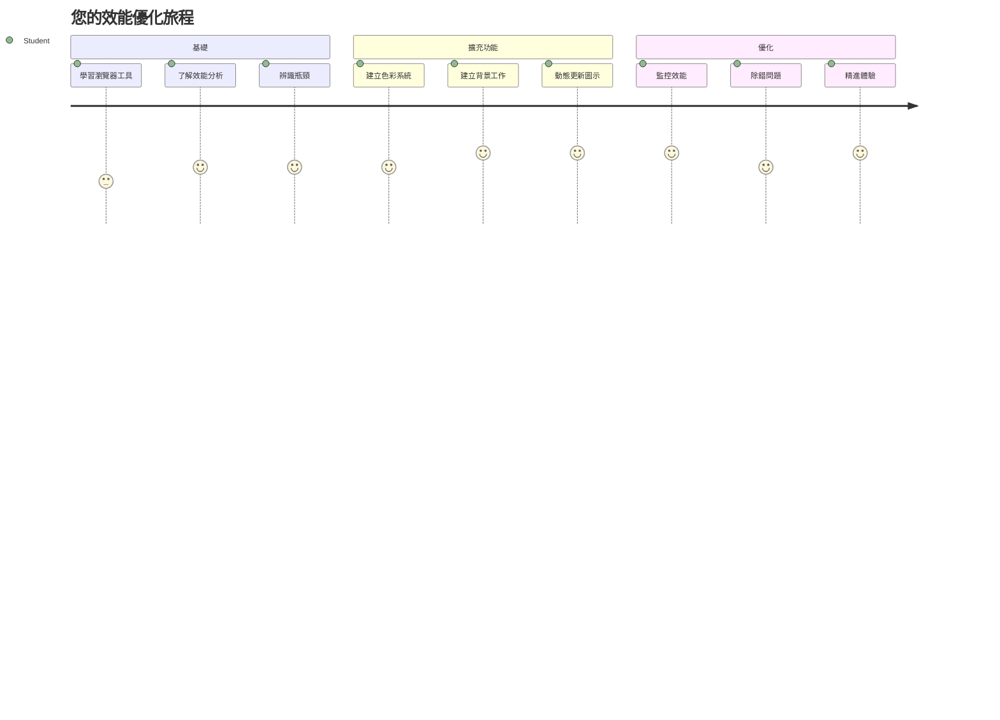
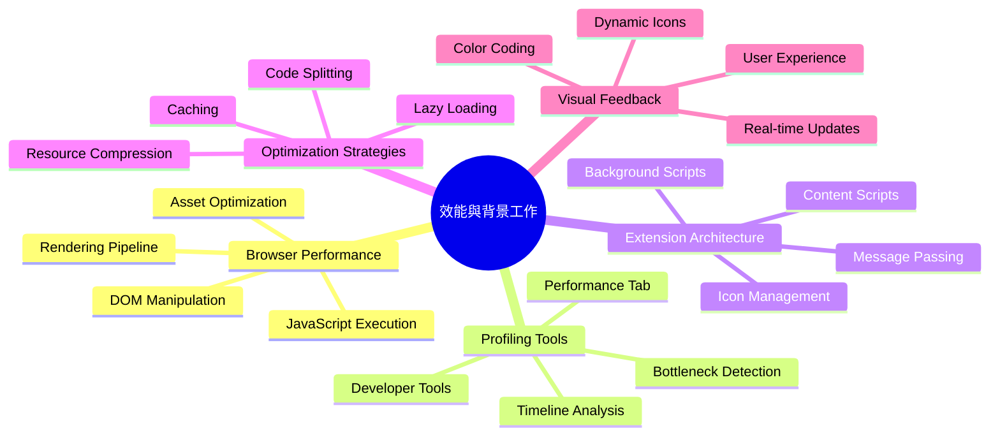
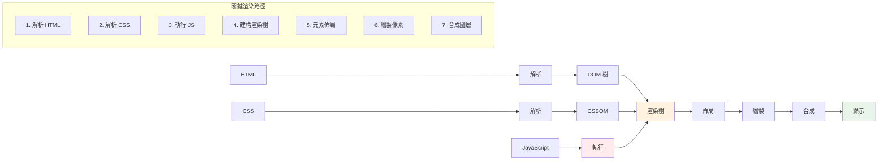
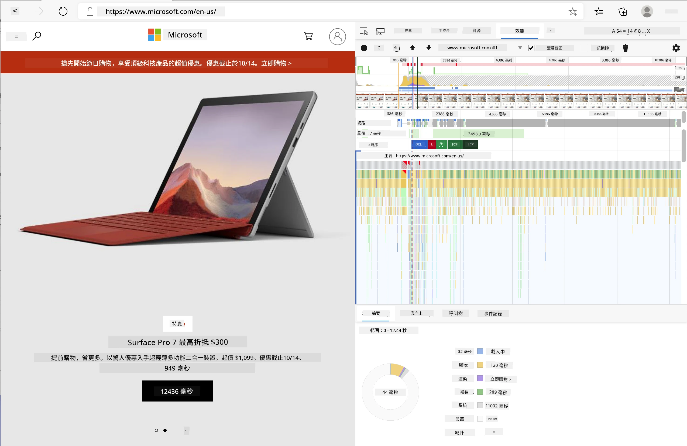
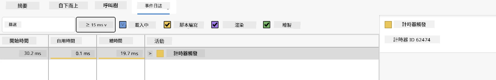
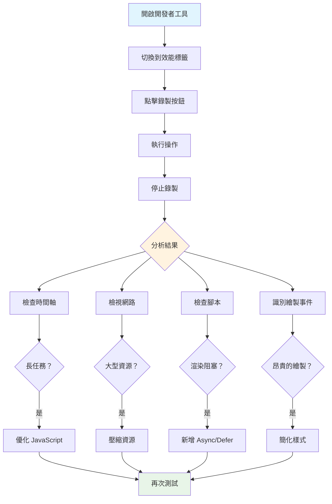
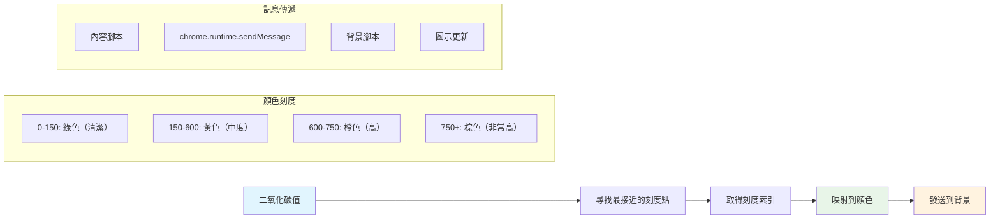
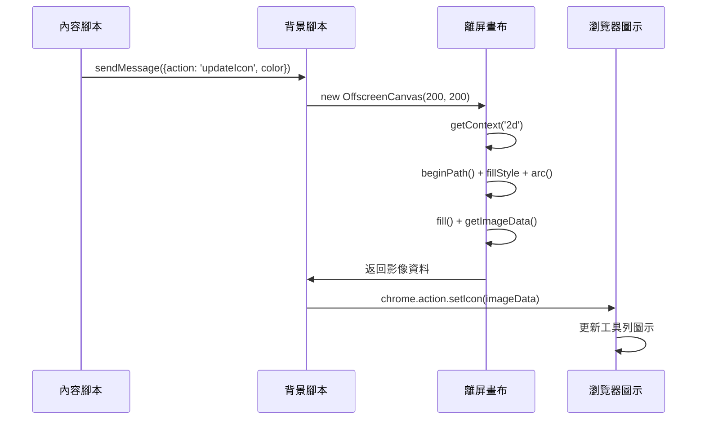
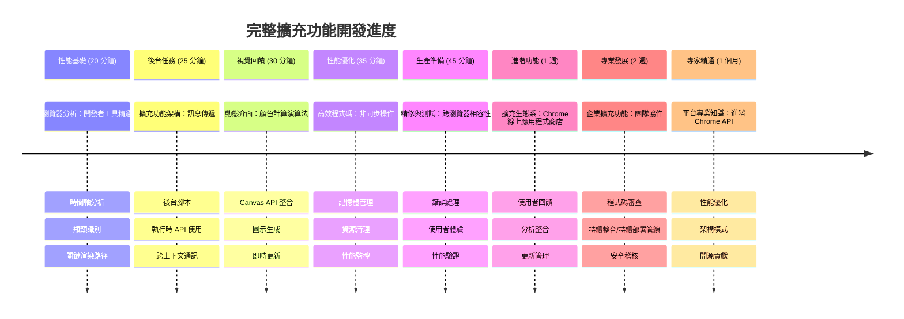

<!--
CO_OP_TRANSLATOR_METADATA:
{
  "original_hash": "b275fed2c6fc90d2b9b6661a3225faa2",
  "translation_date": "2026-01-06T13:52:53+00:00",
  "source_file": "5-browser-extension/3-background-tasks-and-performance/README.md",
  "language_code": "tw"
}
-->
# 瀏覽器擴充套件專案第三部分：了解背景工作與效能


是否曾好奇為什麼有些瀏覽器擴充套件感覺流暢且回應迅速，而其他的則顯得遲鈍？祕密就在幕後發生的事情。當使用者在您的擴充套件介面上點擊時，背後有一整個世界的背景程序靜靜地在管理資料擷取、圖示更新和系統資源。

這是瀏覽器擴充套件系列的最後一課，我們將讓您的碳足跡追蹤器順暢運作。您將新增動態圖示更新，並學會如何提前發現效能問題，避免成為麻煩。這就像調校賽車──小幅調整就能讓整體運作大不相同。

完成後，您將擁有一個精緻的擴充套件，並理解分隔優秀與卓越網頁應用的效能原則。讓我們深入瀏覽器優化的世界吧。

## 課前小測驗

[課前小測驗](https://ff-quizzes.netlify.app/web/quiz/27)

### 介紹

在之前的課程中，您建立了一個表單，連接 API，並處理非同步資料擷取。您的擴充套件正逐漸成形。

現在我們需要加上最後的修飾，例如讓擴充套件圖示根據碳排放資料改變顏色。這讓我想起 NASA 必須優化阿波羅太空船上的每個系統。他們無法承受任何浪費的運算週期或記憶體，因為生命安全依賴效能。雖然我們的瀏覽器擴充套件沒有那麼關鍵，但相同的原則依然適用──有效率的程式碼能帶來更佳的使用者體驗。


## 網頁效能基礎

當您的程式碼有效率地運行時，人們真的能“感受到”差異。您知道那種網頁瞬間載入或動畫流暢播放的感覺嗎？那就是良好效能的展現。

效能不僅關乎速度，更是打造感覺自然、不笨拙且不令人挫折的網頁體驗。早期電腦時代，Grace Hopper 著名地在桌上放了一段納秒長的線（約一英尺），用來說明光在十億分之一秒內能傳多遠。這是她解釋為何每一微秒在運算中都很重要的方式。讓我們一起探索協助您找出效能瓶頸的偵查工具。

>「網站效能關乎兩件事：頁面載入速度，以及其上的程式碼執行速度。」-- [Zack Grossbart](https://www.smashingmagazine.com/2012/06/javascript-profiling-chrome-developer-tools/)

如何讓您的網站在各式裝置、面對各種使用者、處於不同情境時都極速響應，這話題不意外地相當廣泛。以下是一些建議，無論您是開發標準網頁專案或瀏覽器擴充套件，都能參考。

優化網站的第一步是了解底層實際發生什麼。幸運的是，您的瀏覽器內建強而有力的偵察工具。


在 Edge 中開啟開發者工具，點擊右上角三個點，再選擇「更多工具」>「開發者工具」。或用快捷鍵：Windows 是 `Ctrl` + `Shift` + `I`，Mac 則是 `Option` + `Command` + `I`。進去後，點選「效能」標籤──這裡就是您的偵查場域。

**這是您的效能偵查工具箱：**
- **開啟** 開發者工具（作為開發者您會一直用到它！）
- **前往** 效能標籤──想像它是您的網頁健身追蹤器
- **點擊** 錄製按鈕，觀察頁面運作情形
- **檢視** 結果，找出哪些環節拖慢速度

試試看這個方法。開啟一個網站（Microsoft.com 效果不錯），按「錄製」。現在重新整理頁面，觀察分析器捕捉的過程。停止錄製後，您會看到瀏覽器如何「腳本執行」、「渲染」及「繪製」的詳細流程。這讓我想起火箭發射任務控制中心監控所有系統的即時數據──您可以確切知道何時發生了什麼。



✅ [Microsoft 文件](https://docs.microsoft.com/microsoft-edge/devtools-guide/performance/?WT.mc_id=academic-77807-sagibbon)提供了更多深入細節，想深入了解請參考

> 專業提示：測試之前清除瀏覽器快取，來看看您的網站對第一次訪客的效能──通常與回訪者有顯著差異！

在分析時間軸中選擇特定事件，放大觀察頁面載入時的細節。

挑選部分分析時間軸，查看摘要面板，就能獲得您的頁面效能快照：


檢查事件記錄面板，看看是否有事件耗時超過 15 毫秒：



✅ 熟悉您的分析器！打開本網站的開發者工具，檢查是否有瓶頸。哪個資源載入最慢？最快的是哪個？


## 分析時該注意什麼

執行分析只是起點──真正的技巧是理解那些彩色圖表意指何物。別擔心，很快您就能讀懂。資深開發者能在問題形成前發現警訊。

讓我們談談常見的嫌疑犯──經常潛入網頁專案的效能問題。就像 Marie Curie 必須仔細監控實驗室中的輻射值，我們也要注意顯示潛在問題的特定模式。提早偵測可以省去您（以及使用者）很多挫折。

**資產大小**：網站載入的「重量」多年來日益增長，而其中許多為圖片所致。就像我們往數位行李箱塞入越來越多東西。

✅ 查看[網際網路檔案館](https://httparchive.org/reports/page-weight)，瞭解頁面大小的歷年變化，非常有啟發。

**保持資產優化方式：**
- **壓縮** 圖片！現代格式像 WebP 能顯著減小檔案大小
- **為** 每種裝置服務適合的圖片尺寸──無需將超大桌面圖傳給手機
- **縮小** CSS 與 JavaScript 檔案──每個字節都重要
- **使用** 延遲載入，圖片僅在使用者捲動至該區時下載

**DOM 遍歷**：瀏覽器根據您的程式碼建構文件物件模型（DOM），因此為了效能，盡量使用必要且最簡潔的標籤。舉例來說，頁面不需要的 CSS 可以優化；只在單頁使用的樣式不必放在主要樣式表。

**DOM 優化關鍵策略：**
- **減少** HTML 元素數量與巢狀層級
- **移除** 未使用的 CSS 規則，並有效整合樣式表
- **規劃** CSS 只載入每頁所需
- **結構化** HTML，使用語意標籤提升瀏覽器解析效率

**JavaScript**：每個 JavaScript 開發者都該注意『阻斷渲染』的腳本，這些腳本必須先被載入才能繼續解析並繪製 DOM。考慮對內嵌腳本使用 `defer`（如 Terrarium 模組所示）。

**現代 JavaScript 優化技巧：**
- **使用** `defer` 屬性讓腳本在 DOM 解析後載入
- **實作** 程式碼拆分，只載入必要 JavaScript
- **應用** 延遲載入非關鍵功能
- **減少** 使用笨重的函式庫與框架（若可能）

✅ 在[網站速度測試網站](https://www.webpagetest.org/)試試各種網站，瞭解判斷網站效能的常見檢測

### 🔄 **教學檢核點**
**效能理解**：建立擴充套件功能前，請確保您可以：
- ✅ 解釋從 HTML 到像素的關鍵渲染路徑
- ✅ 識別網頁應用常見效能瓶頸
- ✅ 使用瀏覽器開發者工具分析頁面效能
- ✅ 瞭解資產大小與 DOM 複雜度如何影響速度

**快速自測**：當您有阻斷渲染的 JavaScript 時會發生什麼？
*答案：瀏覽器必須先下載並執行該腳本，才能繼續解析 HTML 並渲染頁面*

**實務效能影響：**
- **100 毫秒延遲**：用戶察覺速度變慢
- **1 秒延遲**：用戶開始失去專注
- **3 秒以上**：40% 用戶離開頁面
- **行動網路**：效能更為重要

現在您對瀏覽器如何呈現您送出的資產已有基礎認識，我們來看完成擴充套件還剩哪些步驟：

### 建立配色函式

現在我們將建立一個函式，把數字資料轉換成有意義的顏色。可以把它想像成交通號誌系統──綠色代表清潔能源，紅色代表碳密度高。

這個函式會從 API 取得的 CO2 資料判斷出最適合呈現環境影響的顏色。就像科學家在熱圖中用色彩視覺化複雜資料模式一樣──從海洋溫度到恆星形成。我們將它加入 `/src/index.js`，緊接之前設定的那些 `const` 變數之後：


```javascript
function calculateColor(value) {
	// 定義二氧化碳強度刻度（每千瓦時克數）
	const co2Scale = [0, 150, 600, 750, 800];
	// 對應顏色由綠色（清潔）到深棕色（高碳）
	const colors = ['#2AA364', '#F5EB4D', '#9E4229', '#381D02', '#381D02'];

	// 找出最接近輸入的刻度值
	const closestNum = co2Scale.sort((a, b) => {
		return Math.abs(a - value) - Math.abs(b - value);
	})[0];
	
	console.log(`${value} is closest to ${closestNum}`);
	
	// 找出對應顏色映射的索引值
	const num = (element) => element > closestNum;
	const scaleIndex = co2Scale.findIndex(num);

	const closestColor = colors[scaleIndex];
	console.log(scaleIndex, closestColor);

	// 傳送顏色更新訊息給背景腳本
	chrome.runtime.sendMessage({ action: 'updateIcon', value: { color: closestColor } });
}
```

**讓我們拆解這個巧妙的小函式：**
- **建立** 兩個陣列──一個存 CO2 水平，另一個存顏色（綠色 = 清潔，棕色 = 污染！）
- **透過** 陣列排序找到最接近實際 CO2 值的選項
- **用** findIndex() 方法抓出對應顏色
- **發送** 訊息到 Chrome 背景腳本，帶上選定的顏色字串
- **利用** 模板字串（反引號）讓字串格式更清晰
- **用** const 宣告保持程式有條理

`chrome.runtime` [API](https://developer.chrome.com/extensions/runtime) 就像您的擴充套件神經系統──它處理幕後通訊和各項工作流程：

>「使用 chrome.runtime API 取得背景頁面、回傳清單細節，監聽及回應應用程式或擴充套件生命週期事件。您也可以用此 API 將相對路徑 URL 轉成完整 URL。」

**為何 Chrome Runtime API 如此方便：**
- **讓** 擴充套件各部分互相溝通
- **在背景** 執行工作而不凍結使用者介面
- **管理** 擴充套件的生命週期事件
- **方便** 脚本間訊息傳遞

✅ 如果您在 Edge 開發此擴充套件，可能會驚訝它用的是 Chrome API。新版 Edge 瀏覽器基於 Chromium 引擎，因此可以利用這些工具。


> **專業提示**：若想分析瀏覽器擴充套件的效能，請從該擴充套件本身啟動開發者工具，因為它是獨立的瀏覽器實例。這樣您可以取得擴充特定的效能指標。

### 設定預設圖示顏色

在開始擷取真實資料前，先給擴充套件一個起始狀態。沒有人喜歡看見空白或損壞的圖示。我們先以綠色開始，讓使用者在安裝後立即知道擴充套件正常運作。

在您的 `init()` 函式中，設定這個預設綠色圖示：

```javascript
chrome.runtime.sendMessage({
	action: 'updateIcon',
	value: {
		color: 'green',
	},
});
```

**此初始化達成：**
- **將** 中性綠色設為預設狀態
- **提供** 擴充套件載入時的即時視覺反饋
- **建立** 與背景腳本通訊的模式
- **確保** 使用者在資料載入前看到功能正常的擴充套件
### 呼叫函式，執行呼叫

現在將所有部分串連，確保新 CO2 資料一到，您的圖示自動用對應顏色更新。這如同電子裝置中接通最後一條電路──所有元件瞬間協同工作。

在取得 API CO2 資料後，加入這行程式碼：

```javascript
// 從 API 取得二氧化碳數據後
// 讓 CO2 = data.data[0].intensity.actual;
calculateColor(CO2);
```

**此整合達成：**
- **連結** API 資料流與視覺指示系統
- **自動** 觸發圖示更新，反映新資料
- **提供** 根據當前碳強度的即時視覺回饋
- **保持** 資料擷取與顯示邏輯的分離

最後，在 `/dist/background.js` 新增監聽背景動作呼叫的事件：

```javascript
// 監聽來自內容腳本的訊息
chrome.runtime.onMessage.addListener(function (msg, sender, sendResponse) {
	if (msg.action === 'updateIcon') {
		chrome.action.setIcon({ imageData: drawIcon(msg.value) });
	}
});

// 使用 Canvas API 繪製動態圖示
// 借用自 energy lollipop 擴充功能 - 很棒的功能！
function drawIcon(value) {
	// 建立離屏畫布以提升效能
	const canvas = new OffscreenCanvas(200, 200);
	const context = canvas.getContext('2d');

	// 繪製代表碳強度的彩色圓圈
	context.beginPath();
	context.fillStyle = value.color;
	context.arc(100, 100, 50, 0, 2 * Math.PI);
	context.fill();

	// 回傳瀏覽器圖示的圖像資料
	return context.getImageData(50, 50, 100, 100);
}
```

**此背景腳本功能：**
- **監聽** 您主脚本發來的訊息（就像接待員接電話）
- **處理** 'updateIcon' 請求以改變工具列圖示
- **使用** Canvas API 動態繪製新圖示
- **繪製** 一個簡單彩色圓圈，顯示當前碳強度
- **更新** 您的瀏覽器工具列圖示
- **利用** OffscreenCanvas 確保平滑效能（不阻塞 UI）

✅ 您會在[太空遊戲課程](../../6-space-game/2-drawing-to-canvas/README.md)中學到更多 Canvas API


### 🔄 **教學檢核點**
**完整擴充套件理解**：驗證您對整個系統的掌握：
- ✅ 擴充套件不同脚本間的訊息傳遞如何運作？
- ✅ 為什麼效能上會使用 OffscreenCanvas 而非一般 Canvas？
- ✅ Chrome Runtime API 在擴充功能架構中扮演什麼角色？
- ✅ 顏色計算演算法如何將資料映射到視覺反饋？

**效能考量**：您的擴充功能現在展示了：
- **高效訊息傳遞**：腳本上下文之間的乾淨通訊
- **優化呈現**：OffscreenCanvas 防止 UI 阻塞
- **即時更新**：根據即時資料動態更改圖示
- **記憶體管理**：適當清理和資源處理

**是時候測試您的擴充功能了：**
- **使用** `npm run build` 建置所有內容
- **在瀏覽器** 重新載入您的擴充功能（別忘了這步驟）
- **開啟** 擴充功能並觀察圖示變色
- **檢查** 它如何響應來自全球的真實碳排放資料

現在您可以一眼判斷是否適合洗衣服，或是應該等待更乾淨的能源。您剛剛建立了一個真正有用的功能，同時學會了瀏覽器效能。

## GitHub Copilot Agent 挑戰 🚀

使用 Agent 模式完成以下挑戰：

**描述：** 透過新增追蹤並顯示擴充功能不同元件載入時間的功能，增強瀏覽器擴充功能的效能監控能力。

**提示：** 建立一個效能監控系統，測量並紀錄從 API 抓取 CO2 資料、計算顏色和更新圖示所需時間。新增名為 `performanceTracker` 的函式，利用 Performance API 來測量這些操作，並在瀏覽器主控台顯示帶有時間戳記和持續時間的結果。

欲了解更多 [agent mode](https://code.visualstudio.com/blogs/2025/02/24/introducing-copilot-agent-mode) 內容。

## 🚀 挑戰

這是一個有趣的偵探任務：挑選幾個存在多年的開源網站（如 Wikipedia、GitHub、Stack Overflow 等），深入挖掘他們的提交歷史。你能發現他們何時做出效能改進嗎？並且這些問題經常是什麼？

**你的調查方法：**
- **搜尋** 提交訊息中包含「optimize」、「performance」或「faster」等字眼
- **觀察** 是否有模式——他們是否持續修正相同類型問題？
- **識別** 造成網站變慢的常見元凶
- **分享** 你發現的內容，讓其他開發者從實際案例中學習

## 課後測驗

[課後測驗](https://ff-quizzes.netlify.app/web/quiz/28)

## 複習與自學

考慮訂閱一份 [效能電子報](https://perf.email/)

透過瀏覽器開發工具的效能分頁，研究瀏覽器如何評估網頁效能。你發現了哪些主要差異？

### ⚡ **接下來 5 分鐘能做的事**
- [ ] 開啟瀏覽器工作管理員（Chrome 使用 Shift+Esc）查看擴充功能的資源使用情況
- [ ] 使用開發工具效能分頁錄製與分析網頁效能
- [ ] 檢查瀏覽器擴充功能頁面，找出哪些擴充功能影響啟動時間
- [ ] 暫時停用擴充功能，觀察效能差異

### 🎯 **這一小時可以完成的任務**
- [ ] 完成課後測驗並理解效能概念
- [ ] 為瀏覽器擴充功能實作背景腳本
- [ ] 學習使用 browser.alarms 進行高效背景任務
- [ ] 練習內容腳本與背景腳本之間的訊息傳遞
- [ ] 測量並優化擴充功能的資源使用

### 📅 **一周內的效能旅程**
- [ ] 完成具備背景功能的高效能瀏覽器擴充功能
- [ ] 精通 Service Worker 及現代擴充功能架構
- [ ] 實作高效資料同步與快取策略
- [ ] 學習進階擴充功能效能除錯技術
- [ ] 優化擴充功能的功能與資源效率
- [ ] 建立擴充功能效能測試範例

### 🌟 **一個月的優化掌握**
- [ ] 打造企業級高性能瀏覽器擴充功能
- [ ] 掌握 Web Workers、Service Workers 及現代網頁效能技術
- [ ] 參與專注於效能優化的開源專案
- [ ] 精通瀏覽器內部及進階除錯技術
- [ ] 建立效能監控工具與最佳實踐指南
- [ ] 成為幫助優化網頁應用的效能專家

## 🎯 您的瀏覽器擴充功能掌握時程


### 🛠️ 您的完整擴充功能開發工具組

完成此三部曲後，您已掌握：
- **瀏覽器架構**：深入瞭解擴充功能如何與瀏覽器系統整合
- **效能分析**：使用開發者工具識別與修正瓶頸
- **非同步程式設計**：現代 JavaScript 模式，實現回應式且非阻塞操作
- **API 整合**：利用授權與錯誤處理抓取外部資料
- **視覺設計**：動態 UI 更新與基於 Canvas 的圖形生成
- **訊息傳遞**：擴充功能架構中的跨腳本通訊
- **用戶體驗**：載入狀態、錯誤處理與直覺互動
- **生產技能**：測試、除錯與針對實務環境的優化

**實務應用**：您的擴充功能開發技能直接適用於：
- **漸進式網頁應用**：相似架構與效能模式
- **Electron 桌面應用**：使用網頁技術的跨平台應用
- **行動混合應用**：Cordova/PhoneGap 使用網頁 API 開發
- **企業級網頁應用**：複雜儀表板和生產力工具
- **Chrome DevTools 擴充功能**：開發者進階工具與除錯
- **Web API 整合**：任何與外部服務通訊的應用程式

**專業影響**：您現在能夠：
- **構建** 從概念到部署的生產級瀏覽器擴充功能
- **優化** 使用業界標準分析工具的網頁應用效能
- **架構** 具適當職責分離的可擴展系統
- **除錯** 複雜非同步操作與跨上下文通訊
- **貢獻** 開源擴充功能專案與瀏覽器標準

**下一階段機會**：
- **Chrome 網路商店開發者**：為數百萬用戶發佈擴充功能
- **網頁效能工程師**：專長優化與用戶體驗
- **瀏覽器平台開發者**：貢獻瀏覽器引擎開發
- **擴充功能框架打造者**：構建協助其他開發者的工具
- **開發者關係**：透過教學與內容創作分享知識

🌟 **成就解鎖**：您已打造出一個完整、功能齊備的瀏覽器擴充功能，展示專業開發實踐與現代網頁標準！

## 作業

[分析一個網站效能](assignment.md)

---

<!-- CO-OP TRANSLATOR DISCLAIMER START -->
**免責聲明**：  
本文件已使用 AI 翻譯服務 [Co-op Translator](https://github.com/Azure/co-op-translator) 進行翻譯。雖然我們努力追求準確性，但請注意自動翻譯可能包含錯誤或不準確之處。原始文件的原文版本應被視為權威依據。對於重要資訊，建議採用專業人工翻譯。我們不對因使用此翻譯而產生的任何誤解或誤譯負責。
<!-- CO-OP TRANSLATOR DISCLAIMER END -->