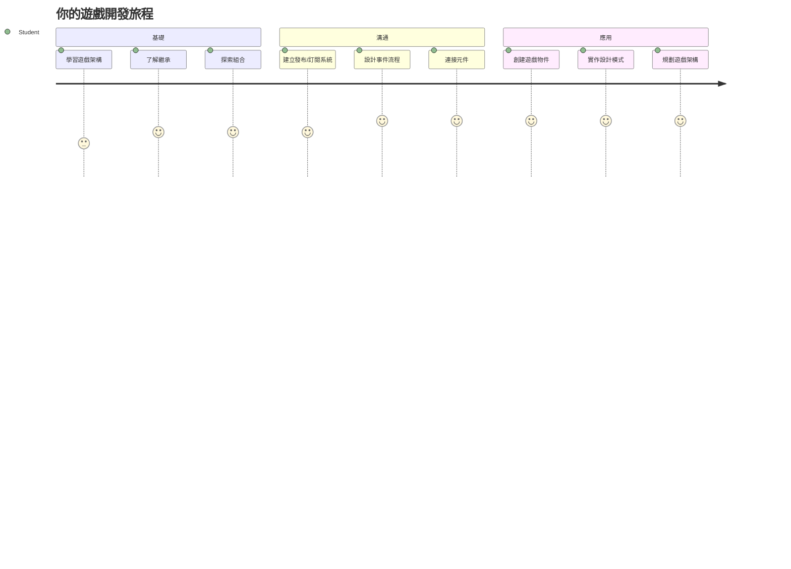
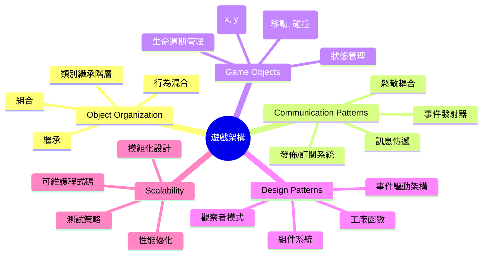
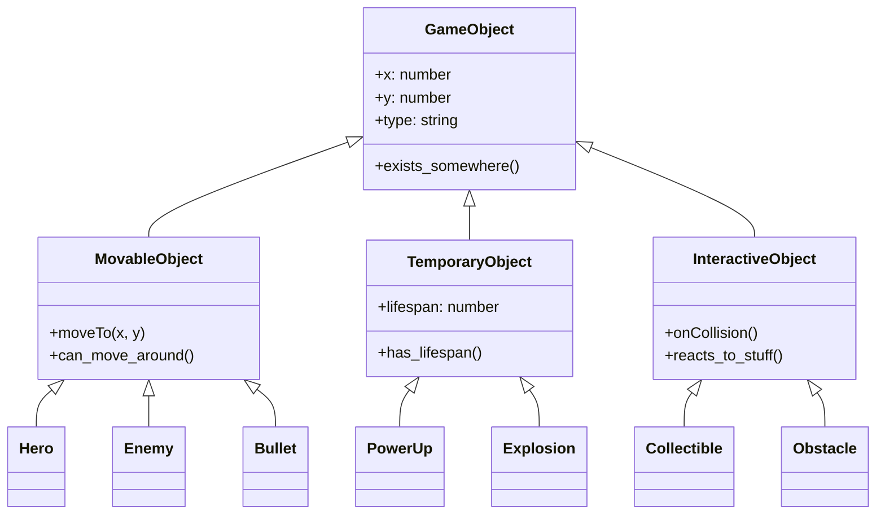
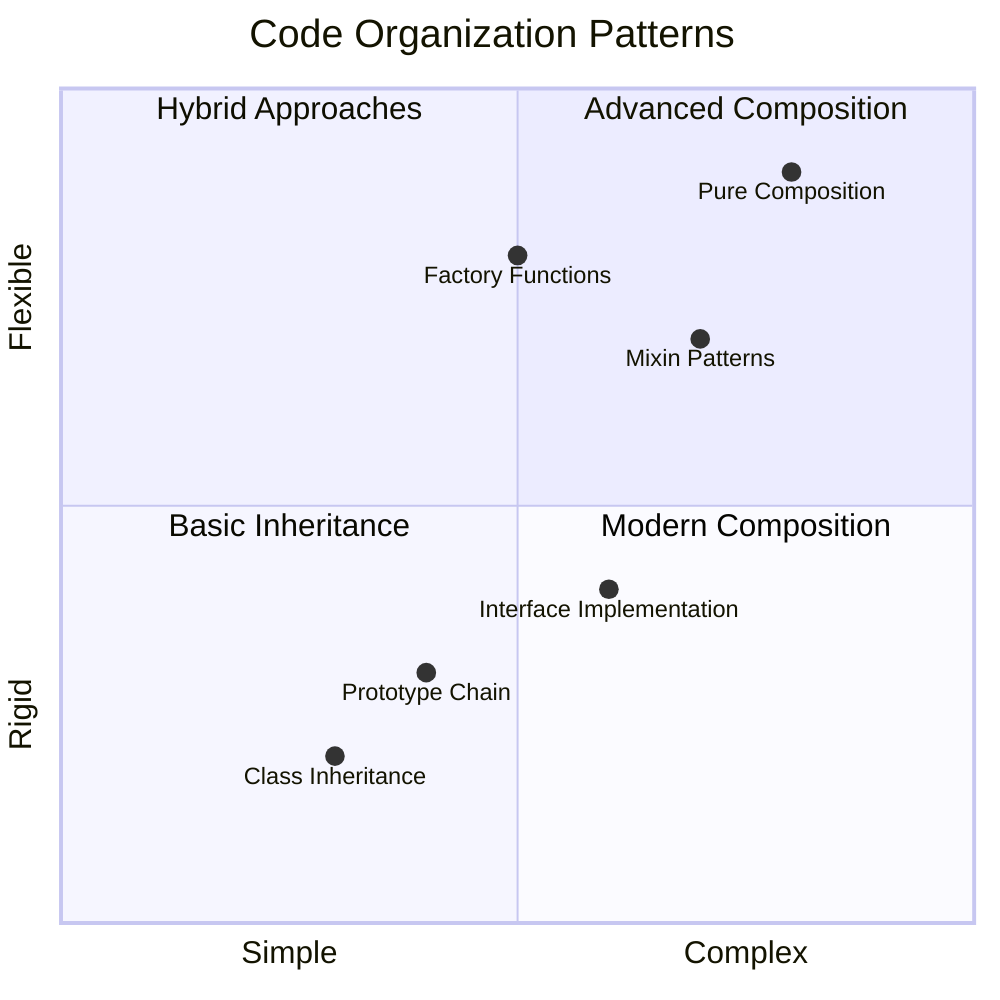
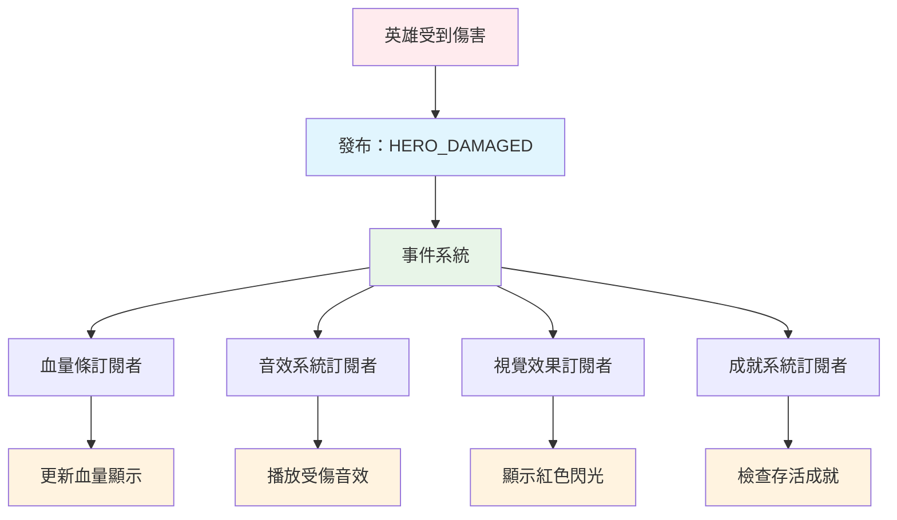
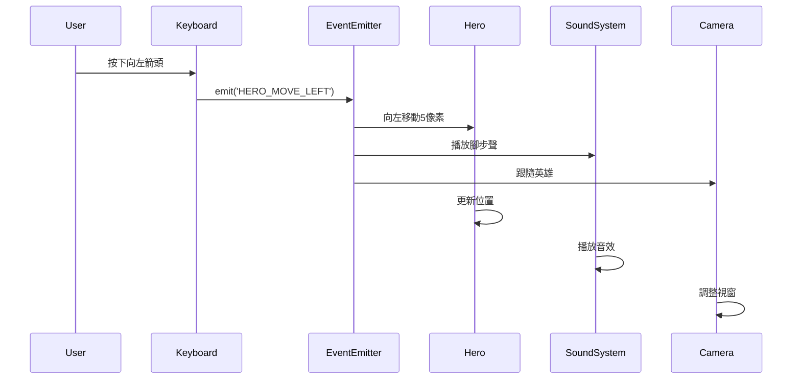

<!--
CO_OP_TRANSLATOR_METADATA:
{
  "original_hash": "a6332a7bb4d0be3bfd24199c83993777",
  "translation_date": "2026-01-06T13:46:20+00:00",
  "source_file": "6-space-game/1-introduction/README.md",
  "language_code": "tw"
}
-->
# 建造太空遊戲第一部分：簡介




就像 NASA 的任務控制中心在太空發射期間協調多個系統一樣，我們將建造一款太空遊戲，展示程式不同部分如何無縫協作。在創造你實際可以玩的東西時，你將學習適用於任何軟體專案的重要程式設計概念。

我們將探索兩種基本的程式碼組織方法：繼承和組合。這些不僅是學術概念——它們是推動從電子遊戲到銀行系統一切的相同模式。我們還將實現一種稱為發布/訂閱（pub/sub）的通訊系統，其運作方式類似於航天器中使用的通訊網路，允許不同元件共享資訊而不產生彼此依賴。

透過本系列結束時，你將了解如何構建可擴展且可演進的應用程式——無論你是在開發遊戲、網頁應用程式還是其他軟體系統。


## 課前測驗

[課前測驗](https://ff-quizzes.netlify.app/web/quiz/29)

## 遊戲開發中的繼承與組合

隨著專案複雜度增加，程式碼組織變得關鍵。一開始可能只是簡單的腳本，但缺乏良好結構的話，會變得難以維護——就像阿波羅任務需要仔細協調成千上萬的元件一樣。

我們將探索兩種基本的程式碼組織方法：繼承與組合。每種方法都有其獨特優勢，理解兩者將幫助你在不同情況下選擇合適方法。我們將透過太空遊戲示範這些概念，在遊戲中，英雄、敵人、加成物和其他物件必須高效互動。

✅ 最著名的程式設計書籍中就有一本專注於[設計模式](https://en.wikipedia.org/wiki/Design_Patterns)。

在任何遊戲中，你都會碰到`遊戲物件`——遊戲世界中互動的元素。英雄、敵人、加成物與視覺特效都是遊戲物件。每個物件都存在於特定螢幕座標，使用`x`與`y`值，類似在座標平面繪點。

儘管外觀不同，這些物件通常有基本共同行為：

- **它們存在於某處**——每個物件有 x 和 y 座標，遊戲才知道要畫在哪裡
- **許多會移動**——英雄奔跑，敵人追逐，子彈飛過螢幕
- **它們有壽命**——有些永遠存在，有些（例如爆炸）短暫出現後消失
- **它們對事件作出反應**——當碰撞發生、取得加成物、血條更新

✅ 想想 Pac-Man 這款遊戲。你能在這遊戲中識別上面列出的四種物件類型嗎？


### 用程式碼表達行為

現在你了解遊戲物件共享的共同行為，我們來探討如何用 JavaScript 實現這些行為。你可以透過附加到類別或個別物件上的方法表達物件行為，有幾種方法可供選擇。

**基於類別的方法**

類別與繼承提供了一種結構化的方法來組織遊戲物件。像 Carl Linnaeus 開發的生物分類系統一樣，你先有一個包含共同屬性的基底類別，然後建立繼承基本特性並增加專門功能的子類別。

✅ 繼承是很重要的概念。詳細了解請看 [MDN 繼承文章](https://developer.mozilla.org/docs/Web/JavaScript/Inheritance_and_the_prototype_chain)。

以下示範如何使用類別和繼承實作遊戲物件：

```javascript
// 第一步：建立基礎的 GameObject 類別
class GameObject {
  constructor(x, y, type) {
    this.x = x;
    this.y = y;
    this.type = type;
  }
}
```

**一步步拆解：**
- 我們創建了一個基礎範本供所有遊戲物件使用
- 建構子保存物件所在位置（`x`, `y`）以及物件類型
- 這成為你所有遊戲物件建造的基礎

```javascript
// 第2步：透過繼承新增移動功能
class Movable extends GameObject {
  constructor(x, y, type) {
    super(x, y, type); // 呼叫父類別建構子
  }

  // 新增移動至新位置的能力
  moveTo(x, y) {
    this.x = x;
    this.y = y;
  }
}
```

**以上程式我們：**
- **擴展**了 GameObject 類別，新增移動功能
- **使用** `super()` 呼叫父建構子以初始化繼承屬性
- **新增** `moveTo()` 方法更新物件位置

```javascript
// 第3步：建立特定的遊戲物件類型
class Hero extends Movable {
  constructor(x, y) {
    super(x, y, 'Hero'); // 自動設定類型
  }
}

class Tree extends GameObject {
  constructor(x, y) {
    super(x, y, 'Tree'); // 樹木不需要移動
  }
}

// 第4步：使用你的遊戲物件
const hero = new Hero(0, 0);
hero.moveTo(5, 5); // 英雄可以移動！

const tree = new Tree(10, 15);
// tree.moveTo() 會造成錯誤－樹木無法移動
```

**理解這些概念：**
- **創造**繼承適當行為的專門物件類型
- **展示**繼承如何允許選擇性地加入功能
- **說明**英雄會移動，樹木則保持靜止
- **解釋**類別層級防止不當動作發生

✅ 花幾分鐘重新想像 Pac-Man 英雄（例如 Inky、Pinky 或 Blinky）如何用 JavaScript 寫出。

**組合方法**

組合遵循模組化設計哲學，類似於工程師設計航天器時使用可互換元件。你不從父類繼承，而是混合特定行為來創造具備所需功能的物件。此方法提供彈性，沒有嚴格層級限制。

```javascript
// 步驟1：建立基本行為物件
const gameObject = {
  x: 0,
  y: 0,
  type: ''
};

const movable = {
  moveTo(x, y) {
    this.x = x;
    this.y = y;
  }
};
```

**這段程式碼作用：**
- **定義**基底 `gameObject` 含位置與類型屬性
- **建立**獨立的 `movable` 行為物件提供移動功能
- **將**位置數據與移動邏輯分開，解耦

```javascript
// 步驟 2：透過組合行為來組合物件
const movableObject = { ...gameObject, ...movable };

// 步驟 3：為不同物件類型建立工廠函式
function createHero(x, y) {
  return {
    ...movableObject,
    x,
    y,
    type: 'Hero'
  };
}

function createStatic(x, y, type) {
  return {
    ...gameObject,
    x,
    y,
    type
  };
}
```

**以上程式我們：**
- **用展開語法**結合基底物件屬性與移動行為
- **創建**回傳客製物件的工廠函式
- **實現**無階級結構的彈性物件創建
- **允許**物件擁有其恰當的行為組合

```javascript
// 第4步：創建並使用您的組合物件
const hero = createHero(10, 10);
hero.moveTo(5, 5); // 運作完美！

const tree = createStatic(0, 0, 'Tree');
// tree.moveTo() 未定義 - 沒有組合移動行為
```

**關鍵重點：**
- **透過混合行為來組合物件，而非繼承**
- **比嚴格繼承層級更具彈性**
- **讓物件只有它們需要的特性**
- **使用現代 JavaScript 展開語法清理物件結合**  
```

**Which Pattern Should You Choose?**

**Which Pattern Should You Choose?**



> 💡 **專家小技巧**：這兩種模式在現代 JavaScript 開發中都有應用。類別適合明確定義的層級結構，組合則適合最大彈性的需求。
> 
**何時使用哪一種：**
- **有明確「是個」關係時選用繼承**（英雄 *是個* 可移動物件）
- **當需要「擁有」關係時選擇組合**（英雄 *擁有* 移動能力）
- **考慮團隊偏好與專案要求**
- **記得可以在同一應用中混用兩種方式**

### 🔄 **教學自我檢測**
**物件組織理解**：在進入通訊模式前，確保你可以：
- ✅ 解釋繼承與組合的差異
- ✅ 判斷何時使用類別 vs 工廠函式
- ✅ 了解繼承中 `super()` 怎麼運作
- ✅ 認識兩種方式對遊戲開發的優點

**快速自測**：如何用這兩種方法創建一個能移動且會飛的敵人？
- **繼承方式**：`class FlyingEnemy extends Movable`
- **組合方式**：`{ ...movable, ...flyable, ...gameObject }`

**實務連結**：這些模式隨處可見：
- **React Components**：屬性（組合）vs 類別繼承
- **遊戲引擎**：實體-組件系統採用組合
- **行動應用程式**：UI 框架常用繼承層級

## 通訊模式：發布/訂閱系統

隨著應用愈發龐大，管理元件間通訊成挑戰。發布/訂閱模式利用類似無線廣播原理——一個發送者可以觸及多個接收者，且發送者不需知道誰在聽。

想想當英雄受傷時發生什麼：血條更新、音效撥放、視覺反饋出現。與其讓英雄物件直接耦合這些系統，pub/sub 允許英雄廣播「受傷」訊息。任何需要回應的系統都可以訂閱該訊息類型並作出反應。

✅ **Pub/Sub** 是「發布-訂閱」的縮寫。


### 理解 Pub/Sub 架構

pub/sub 模式讓應用不同部分鬆散耦合，意即它們能配合運作，卻非彼此直接依賴。此分離使程式碼更易維護、測試且彈性高。

**pub/sub 重要角色：**
- **訊息**——簡單標籤類似 `'PLAYER_SCORED'` 描述發生了什麼（可帶額外資訊）
- **發布者**——負責「事情發生了！」訊息傳出給關注者
- **訂閱者**——表示「對該事件有興趣」並在事件發生時作出反應的物件
- **事件系統**——中介者確保訊息送達正確的聽眾

### 建立事件系統

讓我們創建簡單但強大的事件系統示範以上概念：

```javascript
// 第一步：建立 EventEmitter 類別
class EventEmitter {
  constructor() {
    this.listeners = {}; // 儲存所有事件監聽器
  }
  
  // 為特定的訊息類型註冊監聽器
  on(message, listener) {
    if (!this.listeners[message]) {
      this.listeners[message] = [];
    }
    this.listeners[message].push(listener);
  }
  
  // 向所有已註冊的監聽器傳送訊息
  emit(message, payload = null) {
    if (this.listeners[message]) {
      this.listeners[message].forEach(listener => {
        listener(message, payload);
      });
    }
  }
}
```

**程式運作分析：**
- **創建**中心事件管理系統使用簡單類別
- **使用物件**以訊息類型分類儲存監聽器
- **以 `on()` 註冊**新監聽器
- **用 `emit()` 向所有相關監聽器廣播訊息**
- **支援可選數據載荷傳遞相關資訊**

### 實做範例

來看看實際應用！我們打造簡單移動系統，展示 pub/sub 乾淨且彈性的特色：

```javascript
// 第一步：定義您的訊息類型
const Messages = {
  HERO_MOVE_LEFT: 'HERO_MOVE_LEFT',
  HERO_MOVE_RIGHT: 'HERO_MOVE_RIGHT',
  ENEMY_SPOTTED: 'ENEMY_SPOTTED'
};

// 第二步：建立您的事件系統和遊戲物件
const eventEmitter = new EventEmitter();
const hero = createHero(0, 0);
```

**程式碼功能簡述：**
- **定義**常數物件避免訊息名稱拼寫錯誤
- **創建**事件發射器物件處理通訊
- **初始化**英雄物件於起始位置

```javascript
// 第三步：設置事件監聽器（訂閱者）
eventEmitter.on(Messages.HERO_MOVE_LEFT, () => {
  hero.moveTo(hero.x - 5, hero.y);
  console.log(`Hero moved to position: ${hero.x}, ${hero.y}`);
});

eventEmitter.on(Messages.HERO_MOVE_RIGHT, () => {
  hero.moveTo(hero.x + 5, hero.y);
  console.log(`Hero moved to position: ${hero.x}, ${hero.y}`);
});
```

**以上程式我們：**
- **註冊**事件監聽器回應移動訊息
- **根據移動方向更新**英雄位置
- **新增**控制台日誌追蹤英雄位置
- **將移動邏輯從輸入處理分離**

```javascript
// 第4步：將鍵盤輸入連接到事件（發布者）
window.addEventListener('keydown', (event) => {
  switch(event.key) {
    case 'ArrowLeft':
      eventEmitter.emit(Messages.HERO_MOVE_LEFT);
      break;
    case 'ArrowRight':
      eventEmitter.emit(Messages.HERO_MOVE_RIGHT);
      break;
  }
});
```

**理解這些概念：**
- **連接**鍵盤輸入與遊戲事件，無需緊耦合
- **讓輸入系統間接與遊戲物件通訊**
- **允許多系統回應同一鍵盤事件**
- **便於更換按鍵配置或添入新輸入方法**


> 💡 **專家小技巧**：此模式美妙之處在於彈性！你能簡單地添入音效、畫面震動或粒子效果，只需加更多事件監聽器，無須修改現有鍵盤或移動程式碼。
> 
**這就是你會喜歡此方法的理由：**
- 新增功能變得超簡單，只要監聽你關注的事件
- 多個系統能對同一事件產生反應，互不干擾
- 測試更容易，因為各部分獨立運作
- 出錯時明確知道該從哪裡找問題

### 為什麼 Pub/Sub 可有效擴展

Pub/sub 模式在應用複雜度提升時仍維持簡潔。無論管理數十個敵人、動態 UI 更新或音效系統，該模式能在不改變架構下應對更大規模。新功能輕鬆整合進既有事件系統，不影響現有功能。

> ⚠️ **常見錯誤**：剛開始別創造過多特定訊息類型。先用大類別，之後根據遊戲需求細化。
> 
**最佳實作建議：**
- **將相關訊息分組歸類**
- **使用清楚描述發生事件的名稱**
- **使訊息載荷簡潔聚焦**
- **為團隊協作做好訊息類型文件化**

### 🔄 **教學自我檢測**
**事件驅動架構理解**：檢驗你對系統完整概念的掌握：
- ✅ Pub/sub 如何避免組件間緊耦合？
- ✅ 為何事件驅動使新增功能更簡單？
- ✅ EventEmitter 在通訊流程中扮演什麼角色？
- ✅ 訊息常數如何避免錯誤並提升維護性？

**設計挑戰**：你會如何用 pub/sub 處理以下遊戲場景？
1. **敵人死亡**：更新分數、撥放音效、生成加成道具、從畫面移除
2. **關卡完成**：停止音樂、顯示介面、存檔進度、載入下一關
3. **加成物被收集**：提升能力、更新 UI、撥放效果、啟動計時器

**專業連結**：此模式廣泛應用於：
- **前端框架**：React/Vue 事件系統
- **後端服務**：微服務通訊
- **遊戲引擎**：Unity 事件系統
- **行動開發**：iOS/Android 通知系統

---

## GitHub Copilot Agent 挑戰 🚀

使用 Agent 模式完成以下挑戰：

**描述：** 建立簡單遊戲物件系統，結合繼承與 pub/sub 模式。實作基礎遊戲，讓不同物件能透過事件通訊，不需彼此直接認識。

**提示：** 用 JavaScript 建立遊戲系統，要求如下：1) 創建含 x, y 座標與 type 屬性的基礎 GameObject 類別。2) 創建可移動的 Hero 類別繼承 GameObject。3) 創建可追逐英雄的 Enemy 類別繼承 GameObject。4) 實作用於 pub/sub 模式的 EventEmitter 類別。5) 設置事件監聽器，當英雄移動時，附近敵人士接收到 'HERO_MOVED' 事件並更新位置向英雄靠近。加入 console.log 來顯示物件間通訊。

了解更多[agent 模式](https://code.visualstudio.com/blogs/2025/02/24/introducing-copilot-agent-mode)資訊。

## 🚀 挑戰
考慮 pub-sub 模式如何增強遊戲架構。識別哪些元件應該發送事件以及系統應如何響應。設計一個遊戲概念並繪製其元件之間的通訊模式。

## 課後測驗

[課後測驗](https://ff-quizzes.netlify.app/web/quiz/30)

## 複習與自學

透過[閱讀相關內容](https://docs.microsoft.com/azure/architecture/patterns/publisher-subscriber/?WT.mc_id=academic-77807-sagibbon)，深入了解 Pub/Sub。

### ⚡ **您可以在接下來的 5 分鐘內做什麼**
- [ ] 開啟任意 HTML5 線上遊戲並使用開發者工具檢查其程式碼
- [ ] 建立一個簡單的 HTML5 Canvas 元素並繪製基本形狀
- [ ] 試用 `setInterval` 創建簡單動畫迴圈
- [ ] 探索 Canvas API 文件並試用繪圖方法

### 🎯 **您可以在這一小時內完成什麼**
- [ ] 完成課後測驗並理解遊戲開發概念
- [ ] 建立含 HTML、CSS 和 JavaScript 檔案的遊戲專案結構
- [ ] 建立一個持續更新和渲染的基本遊戲迴圈
- [ ] 在畫布上繪製第一個遊戲精靈
- [ ] 實作基本的圖像與音效資產載入

### 📅 **您的一週遊戲製作計畫**
- [ ] 完成全部預定功能的太空遊戲
- [ ] 新增精緻的圖形、音效與流暢動畫
- [ ] 實作遊戲狀態（開始畫面、遊戲中、遊戲結束）
- [ ] 建立計分系統及玩家進度追蹤
- [ ] 使遊戲可以跨裝置響應並兼顧無障礙性
- [ ] 線上分享遊戲並蒐集玩家回饋

### 🌟 **您的一個月遊戲開發計畫**
- [ ] 製作多款遊戲，探索不同類型與機制
- [ ] 學習 Phaser 或 Three.js 等遊戲開發框架
- [ ] 參與開源遊戲開發專案
- [ ] 精通進階遊戲程式設計模式與優化技巧
- [ ] 建立展示遊戲開發技能的作品集
- [ ] 指導對遊戲開發與互動媒體感興趣的新人

## 🎯 您的遊戲開發精通時間表

```mermaid
timeline
    title 遊戲架構學習進程
    
    section 物件模式（20分鐘）
        程式碼組織：類別繼承
                  ：組合模式
                  ：工廠函式
                  ：行為混合
        
    section 通訊系統（25分鐘）
        事件架構：發布/訂閱實作
                  ：訊息設計
                  ：事件觸發器
                  ：鬆散耦合
        
    section 遊戲物件設計（30分鐘）
        實體系統：屬性管理
                  ：行為組合
                  ：狀態處理
                  ：生命週期管理
        
    section 架構模式（35分鐘）
        系統設計：組件系統
                  ：觀察者模式
                  ：命令模式
                  ：狀態機
        
    section 進階概念（45分鐘）
        可擴展架構：效能優化
                   ：記憶體管理
                   ：模組化設計
                   ：測試策略
        
    section 遊戲引擎概念（一週）
        專業發展：場景圖
                  ：資產管理
                  ：渲染流程
                  ：物理整合
        
    section 框架精通（兩週）
        現代遊戲開發：React 遊戲模式
                    ：Canvas 優化
                    ：WebGL 基礎
                    ：進階網頁應用遊戲
        
    section 業界實務（一個月）
        專業技能：團隊合作
                  ：程式碼審查
                  ：遊戲設計模式
                  ：效能剖析
```


### 🛠️ 您的遊戲架構工具組總結

完成本課程後，您已具備：
- **設計模式精通**：理解繼承與組合的取捨
- **事件驅動架構**：Pub/sub 實作以支援可擴充通訊
- **物件導向設計**：類別繼承與行為組合
- **現代 JavaScript**：工廠函式、展開語法及 ES6+ 模式
- **可擴充架構**：鬆耦合與模組化設計原則
- **遊戲開發基礎**：實體系統與元件模式
- **專業模式**：業界標準程式碼組織方法

**實務應用**：這些模式可直接應用於：
- **前端框架**：React/Vue 元件架構及狀態管理
- **後端服務**：微服務通訊與事件驅動系統
- **行動開發**：iOS/Android 應用架構與通知系統
- **遊戲引擎**：Unity、Unreal 以及 Web 遊戲開發
- **企業軟體**：事件溯源與分散式系統設計
- **API 設計**：RESTful 服務及即時通訊

**專業技能獲得**：您現在能夠：
- **設計** 使用已驗證模式的可擴充軟體架構
- **實作** 處理複雜互動的事件驅動系統
- **選擇** 適當的程式碼組織策略因應不同場景
- **除錯** 與維護鬆耦合系統的效率提升
- **溝通** 使用業界標準術語說明技術決策

**下一階段**：您已準備好將這些模式應用於真實遊戲，探索進階遊戲開發主題，或在 Web 應用中實踐這些架構概念！

🌟 **成就解鎖**：您已掌握從簡單遊戲到複雜企業系統所需的基本軟體架構模式！

## 作業

[製作一款遊戲模擬](assignment.md)

---

<!-- CO-OP TRANSLATOR DISCLAIMER START -->
**免責聲明**：  
本文件係使用 AI 翻譯服務 [Co-op Translator](https://github.com/Azure/co-op-translator) 翻譯而成。雖然我們力求準確，但請注意自動翻譯可能包含錯誤或不準確之處。原始文件之原文版本應視為權威來源。對於重要資訊，建議採用專業人工翻譯。我們不對因使用本翻譯所導致之任何誤解或誤釋負責。
<!-- CO-OP TRANSLATOR DISCLAIMER END -->