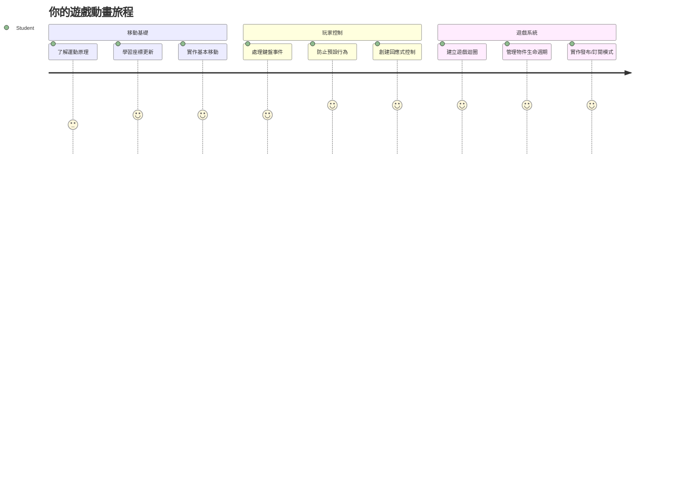
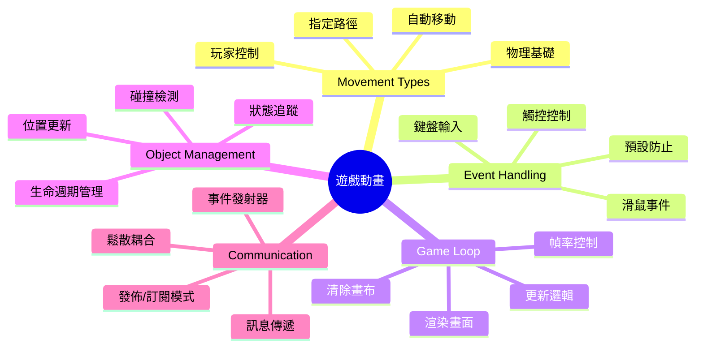
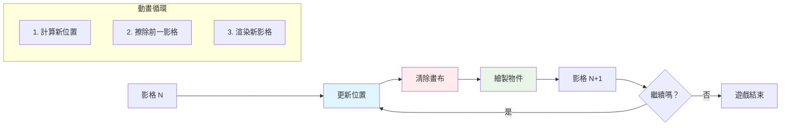
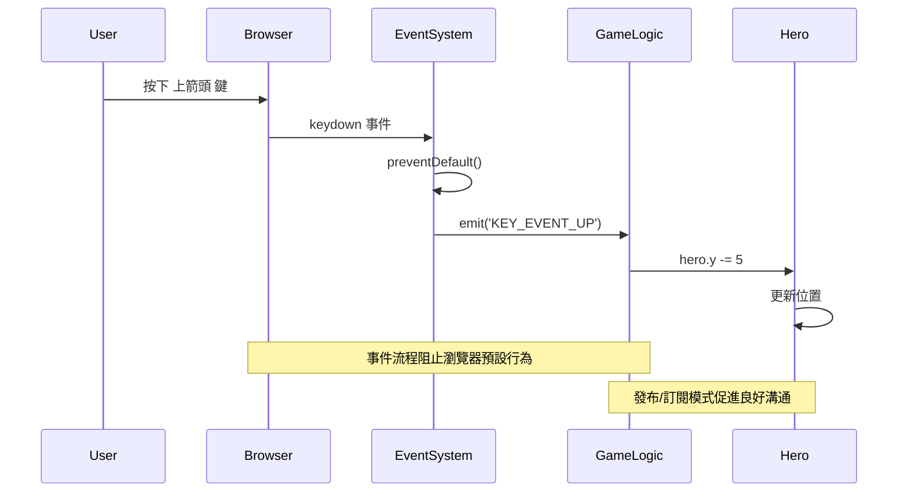
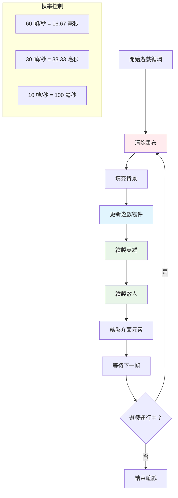
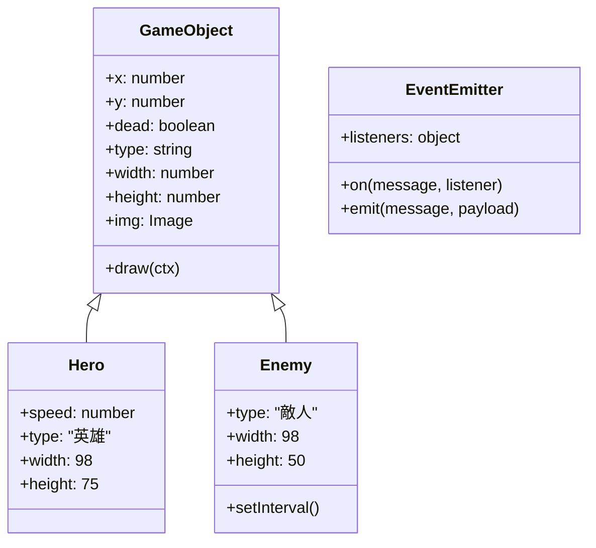
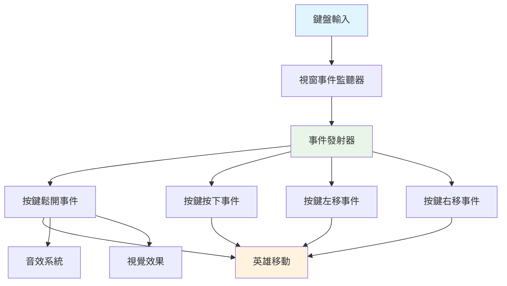
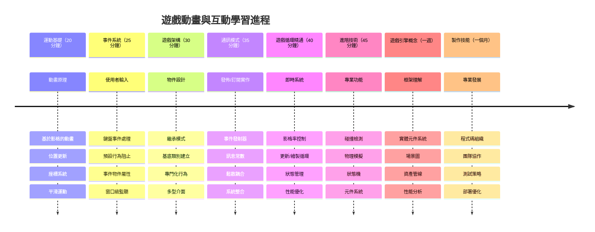

<!--
CO_OP_TRANSLATOR_METADATA:
{
  "original_hash": "8c55a2bd4bc0ebe4c88198fd563a9e09",
  "translation_date": "2026-01-06T13:48:37+00:00",
  "source_file": "6-space-game/3-moving-elements-around/README.md",
  "language_code": "tw"
}
-->
# 建造太空遊戲第三部分：新增移動功能


想想你最喜愛的遊戲——吸引人的不只是漂亮的畫面，更是所有事物隨著你的操作移動和回應的方式。現在你的太空遊戲像是一幅漂亮的畫，但我們將新增讓它栩栩如生的移動效果。

當NASA的工程師為阿波羅任務編寫導航電腦程式時，面臨相似的挑戰：如何讓太空船在維持自動修正航線的同時，對飛行員的輸入做出反應？我們今天要學的原則即反映了這些概念——管理玩家控制的移動和自動系統行為。

在本課程中，你將學會如何讓太空船滑動穿梭畫面、響應玩家指令並創造流暢的移動模式。我們會把所有內容拆解成易於理解的概念，並自然地彼此銜接。

最後，你將能讓玩家駕駛英雄飛船在畫面上飛行，同時敵艦在上方巡邏。更重要的是，你將理解驅動遊戲移動系統的核心原理。


## 課前測驗

[課前測驗](https://ff-quizzes.netlify.app/web/quiz/33)

## 理解遊戲移動

遊戲之所以生動，是因為事物開始在畫面上移動，這基本上有兩種方式：

- **玩家控制移動**：當你按鍵或點擊滑鼠，某個物件移動。這是你與遊戲世界的直接連結。
- **自動移動**：遊戲自己決定物體移動，例如那些敵艦無論你是否操作，都會在畫面巡邏。

讓物體在電腦畫面上移動比你想像的更簡單。還記得數學課上的 x 和 y 座標嗎？這正是我們用的東西。當伽利略在1610年觀測木星衛星時，實際上也是做同樣的事——紀錄位置隨時間的變化以理解運動模式。

在畫面上移動物件就像製作翻頁動畫——你需要遵守這三個簡單步驟：


1. **更新位置** — 改變你的物件應該在的位置（可能是向右移動5個像素）
2. **清除舊畫面** — 清除畫面避免看到殘影
3. **繪製新畫面** — 把物件畫在新位置

足夠快地執行這三步，你就能得到讓玩家感覺自然的流暢移動。

以下是程式碼示範：

```javascript
// 設定英雄的位置
hero.x += 5;
// 清除英雄所在的矩形區域
ctx.clearRect(0, 0, canvas.width, canvas.height);
// 重新繪製遊戲背景和英雄
ctx.fillRect(0, 0, canvas.width, canvas.height);
ctx.fillStyle = "black";
ctx.drawImage(heroImg, hero.x, hero.y);
```

**這段程式碼做了什麼：**
- **更新**英雄的 x 座標，水平向右移動5像素
- **清除**整個畫布內容以移除前一幀
- **填滿**畫布背景為黑色
- **重新繪製**英雄圖像在新的位置

✅ 你能想出為什麼每秒多幀繪製英雄會耗損效能嗎？可以閱讀關於[此模式的替代方案](https://developer.mozilla.org/en-US/docs/Web/API/Canvas_API/Tutorial/Optimizing_canvas)。

## 處理鍵盤事件

這是我們將玩家輸入連結到遊戲動作的地方。當玩家按下空白鍵發射雷射、或按方向鍵閃避小行星時，遊戲需要偵測並回應這些輸入。

鍵盤事件會在視窗層級發生，意味著整個瀏覽器視窗都在聆聽按鍵。滑鼠點擊則可以綁定到特定元素（例如按鈕）。對我們的太空遊戲而言，我們將專注於鍵盤控制，讓玩家有經典街機的感覺。

這讓我想到1800年代的電報員必須將摩斯密碼翻譯成有意義訊息——我們正在做類似的工作，將按鍵轉譯成遊戲指令。

要處理事件，你需要使用 window 的 `addEventListener()` 方法，並提供兩個輸入參數。第一個參數是事件名稱，例如 `keyup`。第二個參數是當事件發生時要執行的函式。

以下示範：

```javascript
window.addEventListener('keyup', (evt) => {
  // evt.key = 按鍵的字串表示
  if (evt.key === 'ArrowUp') {
    // 做某事
  }
});
```

**解析發生了什麼：**
- **監聽**整個視窗的鍵盤事件
- **取得**事件物件，包含哪個鍵被按下的資訊
- **判斷**按下的鍵是否為特定鍵（這裡是向上箭頭）
- **執行**當條件滿足時的程式碼

鍵盤事件有兩個屬性能判斷按了什麼鍵：

- `key` — 按鍵的字串表示，例如 `'ArrowUp'`
- `keyCode` — 數字表示，例如 `37`，代表 `ArrowLeft`

✅ 鍵盤事件處理技術在遊戲開發外也很實用。你還想到哪些用途？


### 特殊按鍵小提醒！

有些按鍵有內建瀏覽器行為，會干擾你的遊戲。方向鍵會滾動頁面，空白鍵會跳頁——這並非你想要玩家駕駛飛船時出現的行為。

我們可以阻止這些預設行為，讓遊戲自己處理輸入。這類似早期程式設計師覆寫系統中斷來自訂行為——只是我們是在瀏覽器層級操作。方法如下：

```javascript
const onKeyDown = function (e) {
  console.log(e.keyCode);
  switch (e.keyCode) {
    case 37:
    case 39:
    case 38:
    case 40: // 方向鍵
    case 32:
      e.preventDefault();
      break; // 空白鍵
    default:
      break; // 不要阻擋其他按鍵
  }
};

window.addEventListener('keydown', onKeyDown);
```

**理解此阻止程式碼：**
- **判斷**可能造成干擾瀏覽器行為的特定按鍵碼
- **阻止**方向鍵與空白鍵的預設動作
- **允許**其他按鍵正常運作
- **使用** `e.preventDefault()` 停止瀏覽器內建行為

### 🔄 **教學檢核點**
**事件處理理解**：在進入自動移動前，確保你能：
- ✅ 解釋 `keydown` 與 `keyup` 的差異
- ✅ 理解為何要阻止瀏覽器預設行為
- ✅ 描述事件監聽器如何連結使用者輸入與遊戲邏輯
- ✅ 辨識哪些鍵可能干擾遊戲控制

**快速自我測試**：若不阻止方向鍵預設行為會怎樣？
*答案：瀏覽器會滾動頁面，干擾遊戲移動*

**事件系統架構**：你已知：
- **視窗層級監聽**：捕捉整個瀏覽器的事件
- **事件物件屬性**：`key` 字串與 `keyCode` 數字
- **預設行為阻止**：阻擋不想要的瀏覽器反應
- **條件邏輯**：回應特定按鍵組合

## 遊戲自動移動

現在來談談沒有玩家輸入也會移動的物體。想像敵艦在畫面巡航、子彈筆直飛行，或雲朵在背景飄動。這種自主移動讓遊戲世界即便沒人操作也顯得活潑。

我們利用JavaScript內建定時器定期更新位置。這概念類似擺鐘運作——透過規律機構觸發恆定、規律行動。簡單範例如下：

```javascript
const id = setInterval(() => {
  // 在 y 軸上移動敵人
  enemy.y += 10;
}, 100);
```

**此移動程式碼的作用：**
- **建立**每100毫秒運作一次的計時器
- **更新**敵人y座標每次增加10像素
- **儲存**interval ID以便日後停止
- **自動**將敵人向畫面下方移動

## 遊戲循環

這是把所有東西串起來的概念—遊戲循環。如果遊戲是一部電影，遊戲循環就像投影機，一次接一次顯示畫面，使一切看起來連續平滑。

每個遊戲背後都會運作這樣的循環。這是一個函式，更新所有物件，重畫畫面，並不斷重複。它會追蹤英雄、敵人、飛舞的雷射——整個遊戲狀態。

這概念讓我想到早期動畫師像華特·迪士尼一樣，必須一幀一幀重畫角色，製造移動的錯覺。我們做的也是一樣，只是用程式碼取代畫筆。

以下是遊戲循環典型模樣，程式碼表示：


```javascript
const gameLoopId = setInterval(() => {
  function gameLoop() {
    ctx.clearRect(0, 0, canvas.width, canvas.height);
    ctx.fillStyle = "black";
    ctx.fillRect(0, 0, canvas.width, canvas.height);
    drawHero();
    drawEnemies();
    drawStaticObjects();
  }
  gameLoop();
}, 200);
```

**理解遊戲循環架構：**
- **清除**整個畫布移除前一幀
- **填滿**背景實色
- **繪製**所有遊戲物件於當前位置
- **每200毫秒重複**此程序打造流暢動畫
- **控制**執行頻率調控幀率

## 繼續太空遊戲

現在我們把前面靜態場景加上移動功能。將它從一張截圖變成互動體驗，一步步確保每個部分都連貫建構。

拿取前一課留下的程式碼（或若需重新開始，使用[Part II- starter](../../../../6-space-game/3-moving-elements-around/your-work)資料夾裡的程式碼）。

**今天要實現的功能：**
- **英雄控制**：使用方向鍵駕駛太空船在螢幕移動
- **敵人移動**：外星飛船開始前進

我們開始實作這些功能。

## 推薦步驟

找到 `your-work` 子資料夾裡已建立的檔案，應包含以下內容：

```bash
-| assets
  -| enemyShip.png
  -| player.png
-| index.html
-| app.js
-| package.json
```

你可以在 `your-work` 資料夾開始專案，執行：

```bash
cd your-work
npm start
```

**這指令的作用：**
- **切換**至專案目錄
- **啟動**HTTP伺服器，位址為 `http://localhost:5000`
- **提供**遊戲檔案供瀏覽器測試

以上會啟動HTTP伺服器在 `http://localhost:5000`。打開瀏覽器輸入該位址，現在應能呈現英雄與所有敵人；但尚未開始移動！

### 新增程式碼

1. **新增專屬物件**給 `hero`、`enemy` 和 `game object`，它們應該有 `x` 與 `y` 屬性。（回想[繼承或組合](../README.md)部分）

   *提示* `game object` 應該是有 `x`、`y` 並且可以將自己繪製到畫布上的物件。

   > **提示**：先新增一個新的 `GameObject` 類別，建構子如下示範，並繪製到畫布：

    ```javascript
    class GameObject {
      constructor(x, y) {
        this.x = x;
        this.y = y;
        this.dead = false;
        this.type = "";
        this.width = 0;
        this.height = 0;
        this.img = undefined;
      }
    
      draw(ctx) {
        ctx.drawImage(this.img, this.x, this.y, this.width, this.height);
      }
    }
    ```

    **理解此基底類別：**
    - **定義**所有遊戲物件共用的屬性（位置、尺寸、圖片）
    - **包含**一個 `dead` 標誌以追蹤是否要移除
    - **提供** `draw()` 方法繪製物件於畫布
    - **設定**預設值，供子類覆寫


    接下來，從 `GameObject` 擴展建立 `Hero` 和 `Enemy`：

    ```javascript
    class Hero extends GameObject {
      constructor(x, y) {
        super(x, y);
        this.width = 98;
        this.height = 75;
        this.type = "Hero";
        this.speed = 5;
      }
    }
    ```

    ```javascript
    class Enemy extends GameObject {
      constructor(x, y) {
        super(x, y);
        this.width = 98;
        this.height = 50;
        this.type = "Enemy";
        const id = setInterval(() => {
          if (this.y < canvas.height - this.height) {
            this.y += 5;
          } else {
            console.log('Stopped at', this.y);
            clearInterval(id);
          }
        }, 300);
      }
    }
    ```

    **這些類別的重點：**
    - **繼承**自 `GameObject` 使用 `extends` 關鍵字
    - **呼叫**上層建構子 `super(x, y)`
    - **設定**各類物件專屬尺寸與屬性
    - **使用** `setInterval()` 實現敵人自動移動

2. **新增鍵盤事件處理器**以控制鍵盤導航（讓英雄上下左右移動）

   *記得*座標系為笛卡兒座標，左上為 `0,0`。也記得加入程式碼阻止*預設行為*

   > **提示**：建立 `onKeyDown` 函式並綁定到 window：

   ```javascript
   const onKeyDown = function (e) {
     console.log(e.keyCode);
     // 新增上課程中的程式碼以阻止預設行為
     switch (e.keyCode) {
       case 37:
       case 39:
       case 38:
       case 40: // 方向鍵
       case 32:
         e.preventDefault();
         break; // 空白鍵
       default:
         break; // 不阻擋其他按鍵
     }
   };

   window.addEventListener("keydown", onKeyDown);
   ```
    
   **此事件處理器做了什麼：**
   - **監聽**整個視窗的 keydown 事件
   - **記錄**按鍵碼幫助調試
   - **阻止**方向鍵與空白鍵的預設瀏覽器行為
   - **允許**其他按鍵正常運作
   
   在此階段檢查瀏覽器控制台，可以看到按鍵記錄。

3. **實作**[發布-訂閱模式](../README.md)，保持後續程式碼乾淨整潔。

   發布-訂閱模式幫助分離事件偵測和事件處理，使程式更模組化，易於維護。

   完成最後這部分你可以：

   1. **新增事件監聽器**於 window：

       ```javascript
       window.addEventListener("keyup", (evt) => {
         if (evt.key === "ArrowUp") {
           eventEmitter.emit(Messages.KEY_EVENT_UP);
         } else if (evt.key === "ArrowDown") {
           eventEmitter.emit(Messages.KEY_EVENT_DOWN);
         } else if (evt.key === "ArrowLeft") {
           eventEmitter.emit(Messages.KEY_EVENT_LEFT);
         } else if (evt.key === "ArrowRight") {
           eventEmitter.emit(Messages.KEY_EVENT_RIGHT);
         }
       });
       ```

   **此事件系統功能：**
   - **偵測**鍵盤輸入並轉為自訂遊戲事件
   - **分離**輸入偵測與遊戲邏輯
   - **方便**日後更改控制方式而不影響遊戲主要邏輯
   - **允許**多系統回應同一輸入


   2. **創建 EventEmitter 類別**以發布與訂閱訊息：

       ```javascript
       class EventEmitter {
         constructor() {
           this.listeners = {};
         }
       
         on(message, listener) {
           if (!this.listeners[message]) {
             this.listeners[message] = [];
           }
           this.listeners[message].push(listener);
         }
       
   3. **新增常數**並設定 EventEmitter：

       ```javascript
       const Messages = {
         KEY_EVENT_UP: "KEY_EVENT_UP",
         KEY_EVENT_DOWN: "KEY_EVENT_DOWN",
         KEY_EVENT_LEFT: "KEY_EVENT_LEFT",
         KEY_EVENT_RIGHT: "KEY_EVENT_RIGHT",
       };
       
       let heroImg, 
           enemyImg, 
           laserImg,
           canvas, ctx, 
           gameObjects = [], 
           hero, 
           eventEmitter = new EventEmitter();
       ```

   **理解此設定：**
   - **定義**訊息常數以避免錯字並方便重構
   - **宣告**影像、畫布上下文與遊戲狀態變數
   - **建立**發布-訂閱系統的全域事件發射器
   - **初始化** 一個陣列來存放所有遊戲物件

   4. **初始化遊戲**

       ```javascript
       function initGame() {
         gameObjects = [];
         createEnemies();
         createHero();
       
         eventEmitter.on(Messages.KEY_EVENT_UP, () => {
           hero.y -= 5;
         });
       
         eventEmitter.on(Messages.KEY_EVENT_DOWN, () => {
           hero.y += 5;
         });
       
         eventEmitter.on(Messages.KEY_EVENT_LEFT, () => {
           hero.x -= 5;
         });
       
4. **設置遊戲循環**

   重構 `window.onload` 函數以初始化遊戲並以適當間隔設置遊戲循環。你還會加入一道雷射光束：

    ```javascript
    window.onload = async () => {
      canvas = document.getElementById("canvas");
      ctx = canvas.getContext("2d");
      heroImg = await loadTexture("assets/player.png");
      enemyImg = await loadTexture("assets/enemyShip.png");
      laserImg = await loadTexture("assets/laserRed.png");
    
      initGame();
      const gameLoopId = setInterval(() => {
        ctx.clearRect(0, 0, canvas.width, canvas.height);
        ctx.fillStyle = "black";
        ctx.fillRect(0, 0, canvas.width, canvas.height);
        drawGameObjects(ctx);
      }, 100);
    };
    ```

   **了解遊戲設定：**
   - **等待** 頁面完全載入後才開始
   - **取得** canvas 元素及其 2D 繪製上下文
   - **非同步載入** 所有圖片資源，使用 `await`
   - **啟動** 遊戲循環，間隔為 100 毫秒（10 FPS）
   - **清除並重繪** 每一幀的整個畫面

5. **加入程式碼** 以特定間隔移動敵人

    重構 `createEnemies()` 函數，建立敵人並將它們推入新的 gameObjects 類別：

    ```javascript
    function createEnemies() {
      const MONSTER_TOTAL = 5;
      const MONSTER_WIDTH = MONSTER_TOTAL * 98;
      const START_X = (canvas.width - MONSTER_WIDTH) / 2;
      const STOP_X = START_X + MONSTER_WIDTH;
    
      for (let x = START_X; x < STOP_X; x += 98) {
        for (let y = 0; y < 50 * 5; y += 50) {
          const enemy = new Enemy(x, y);
          enemy.img = enemyImg;
          gameObjects.push(enemy);
        }
      }
    }
    ```

    **敵人創建的功能：**
    - **計算** 位置，使敵人置中於畫面
    - **利用巢狀迴圈** 創建敵人網格
    - **將敵人圖像指派** 給每個敵人物件
    - **將每個敵人加入** 全域遊戲物件陣列
    
    並新增一個 `createHero()` 函數，為英雄執行類似程序。
    
    ```javascript
    function createHero() {
      hero = new Hero(
        canvas.width / 2 - 45,
        canvas.height - canvas.height / 4
      );
      hero.img = heroImg;
      gameObjects.push(hero);
    }
    ```

    **英雄創建的功能：**
    - **將英雄定位** 在畫面底部中央
    - **指派英雄圖像** 給英雄物件
    - **將英雄加入** 遊戲物件陣列以供繪製

    最後，新增一個 `drawGameObjects()` 函數開始繪製：

    ```javascript
    function drawGameObjects(ctx) {
      gameObjects.forEach(go => go.draw(ctx));
    }
    ```

    **了解繪圖函數：**
    - **遍歷** 陣列中所有遊戲物件
    - **呼叫** 每個物件的 `draw()` 方法
    - **傳遞** canvas 上下文，好讓物件自行繪製

    ### 🔄 **教學回顧檢查**
    **完整遊戲系統理解**：確認你對整體架構的掌握：
    - ✅ 繼承如何讓 Hero 和 Enemy 共享共同的 GameObject 屬性？
    - ✅ 為什麼 pub/sub 模式可以讓程式碼更易維護？
    - ✅ 遊戲循環在創造流暢動畫中扮演什麼角色？
    - ✅ 事件監聽器如何將使用者輸入連接至遊戲物件行為？

    **系統整合**：你的遊戲現在展示了：
    - **物件導向設計**：帶有專門繼承的基底類別
    - **事件驅動架構**：用 pub/sub 模式實現鬆散耦合
    - **動畫框架**：遊戲循環持續刷新幀畫面
    - **輸入處理**：鍵盤事件與預設行為阻止
    - **資產管理**：圖片載入與精靈繪製

    **專業模式**：你已實作：
    - **職責分離**：輸入、邏輯與繪製分開管理
    - **多型性**：所有遊戲物件共享共同繪製介面
    - **訊息傳遞**：元件間的清晰通訊
    - **資源管理**：高效的精靈與動畫控制

    你的敵人應該開始逼近你的英雄太空船了！
      }
    }
    ```
    
    and add a `createHero()` function to do a similar process for the hero.
    
    ```javascript
    function createHero() {
      hero = new Hero(
        canvas.width / 2 - 45,
        canvas.height - canvas.height / 4
      );
      hero.img = heroImg;
      gameObjects.push(hero);
    }
    ```

    最後，新增一個 `drawGameObjects()` 函數開始繪製：

    ```javascript
    function drawGameObjects(ctx) {
      gameObjects.forEach(go => go.draw(ctx));
    }
    ```

    你的敵人應該開始逼近你的英雄太空船了！

---

## GitHub Copilot Agent 挑戰 🚀

這是一個將提升你遊戲品質的挑戰：加入邊界限制與流暢控制。目前你的英雄可以飛出螢幕，且移動感受可能不夠順暢。

**你的任務：** 透過實作螢幕邊界與流暢移動，使你的太空船移動更加逼真。這類似 NASA 的飛行控制系統防止太空船超過安全操作範圍。

**要建置的東西：** 創建系統讓英雄太空船維持留在螢幕內，且控制方式流暢連續。當玩家按住方向鍵時，太空船應該持續滑行，而非一步步跳動。考慮在太空船接近螢幕邊界時加入視覺反饋——比如輕微效果顯示遊戲區域邊緣。

在此了解更多關於 [agent 模式](https://code.visualstudio.com/blogs/2025/02/24/introducing-copilot-agent-mode)。

## 🚀 挑戰

隨著專案規模擴大，程式碼組織變得越來越重要。你可能已注意到檔案中函式、變數和類別混雜一起。這讓我想起負責阿波羅計畫代碼的工程師，他們必須創建清晰且可維護的系統，讓多個團隊能同時協作。

**你的任務：**
當作軟體架構師思考。你要怎麼組織程式碼，好讓六個月後你或隊友依然可以理解？即使現在全部放在同一檔案，也能做出更好的組織：

- **將相關功能** 用清楚註解標頭分組
- **分離關心事項** - 保持遊戲邏輯與繪製分開
- **使用一致命名** 風格於變數與函式
- **建立模組** 或命名空間來組織遊戲不同面向
- **添加文件說明** 解釋每個主要區塊用途

**反思問題：**
- 回來看時，哪些程式碼最難理解？
- 如何組織程式碼能讓其他人更容易貢獻？
- 若要新增像強化道具或不同敵人類型，會如何改動程式？

## 課後小測驗

[課後小測驗](https://ff-quizzes.netlify.app/web/quiz/34)

## 複習與自學

我們都是從零搭建起來，這很棒，有助於學習基礎，但這裡有個小秘密 — 有許多很棒的 JavaScript 框架能替你處理大量繁重工作。一旦你對我們涵蓋的基礎感覺熟悉，就值得 [探索現有工具](https://github.com/collections/javascript-game-engines)。

將框架比作一套配備完善的工具箱，而不必每項工具都手工打造。它們能解決許多我們討論的程式碼組織問題，還提供你花數週時間才能開發的功能。

**值得探索的方向：**
- 遊戲引擎如何組織程式碼—你會對它們聰明的架構模式驚嘆不已
- 讓 canvas 遊戲更流暢的效能優化技巧
- 讓程式碼更清潔且易維護的現代 JavaScript 功能
- 管理遊戲物件及其關係的不同方法

## 🎯 你的遊戲動畫掌握時間表


### 🛠️ 你的遊戲開發工具包總結

完成本課後，你已精通：
- **動畫原理**：基於幀的移動與流暢過渡
- **事件驅動程式設計**：鍵盤輸入處理與完善事件管理
- **物件導向設計**：繼承階層與多型介面
- **通訊模式**：使用 pub/sub 架構維持可維護程式碼
- **遊戲循環架構**：實時更新與繪製週期
- **輸入系統**：使用者控制映射與預設行為阻止
- **資產管理**：精靈載入與高效繪製技巧

### ⚡ **接下來五分鐘你可以做的事**
- [ ] 開啟瀏覽器主控台，嘗試 `addEventListener('keydown', console.log)` 觀察鍵盤事件
- [ ] 建立一個簡單 div 元素，用方向鍵移動它
- [ ] 嘗試用 `setInterval` 建立連續移動
- [ ] 嘗試用 `event.preventDefault()` 阻止預設行為

### 🎯 **本小時你可以達成的目標**
- [ ] 完成課後測驗並理解事件驅動程式
- [ ] 建構帶有完整鍵盤控制的移動英雄太空船
- [ ] 實作流暢的敵人移動模式
- [ ] 加入邊界限制防止遊戲物件離開畫面
- [ ] 創建基礎碰撞偵測系統

### 📅 **你的一週動畫旅程**
- [ ] 完成完整太空遊戲，優化移動與互動體驗
- [ ] 加入進階移動模式，如曲線、加速度與物理效果
- [ ] 實作流暢過渡與緩動函式
- [ ] 建立粒子特效與視覺反饋系統
- [ ] 優化遊戲效能，達成流暢 60fps 播放
- [ ] 新增行動裝置觸控操作與響應式設計

### 🌟 **你的一個月互動開發計畫**
- [ ] 建造複雜互動應用與進階動畫系統
- [ ] 學習動畫函式庫如 GSAP 或打造自有動畫引擎
- [ ] 貢獻開源遊戲開發與動畫專案
- [ ] 精通圖形密集應用的效能優化
- [ ] 創作遊戲開發與動畫的教學內容
- [ ] 建立展示高階互動編程技巧的作品集

**實務應用範圍**：你的遊戲動畫技巧直接適用於：
- **互動網頁應用**：動態儀表板與即時介面
- **資料視覺化**：動畫圖表與互動圖形
- **教育軟體**：互動模擬與學習工具
- **行動開發**：觸控遊戲與手勢控制
- **桌面應用**：Electron 應用搭配流暢動畫
- **網頁動畫**：CSS 與 JavaScript 動畫函式庫

**獲得專業技能**：你現在能夠：
- **架構** 隨複雜度擴展的事件驅動系統
- **實作** 利用數學原理打造流暢動畫
- **除錯** 使用瀏覽器開發工具調查複雜互動系統
- **優化** 適應不同裝置與瀏覽器的遊戲效能
- **設計** 採用驗證模式維護良好程式架構

**掌握遊戲開發概念**：
- **幀率管理**：理解 FPS 與時間控制
- **輸入處理**：跨平台鍵盤及事件系統
- **物件生命週期**：建立、更新與銷毀模式
- **狀態同步**：保持遊戲狀態跨幀一致
- **事件架構**：遊戲系統間解耦式通訊

**下一步**：你已準備好新增碰撞偵測、計分系統、音效，或探索諸如 Phaser、Three.js 等現代遊戲框架！

🌟 **成就解鎖**：你已打造出具有專業架構模式的完整互動遊戲系統！

## 作業

[註解你的程式碼](assignment.md)

---

<!-- CO-OP TRANSLATOR DISCLAIMER START -->
**免責聲明**：  
本文件係使用人工智慧翻譯服務 [Co-op Translator](https://github.com/Azure/co-op-translator) 所翻譯而成。雖然我們致力於確保翻譯的準確性，但請注意自動翻譯可能包含錯誤或不準確之處。原始文件的母語版本應視為權威來源。對於重要資訊，建議採用專業人工翻譯。本公司不對因使用本翻譯所導致的任何誤解或錯誤詮釋承擔責任。
<!-- CO-OP TRANSLATOR DISCLAIMER END -->