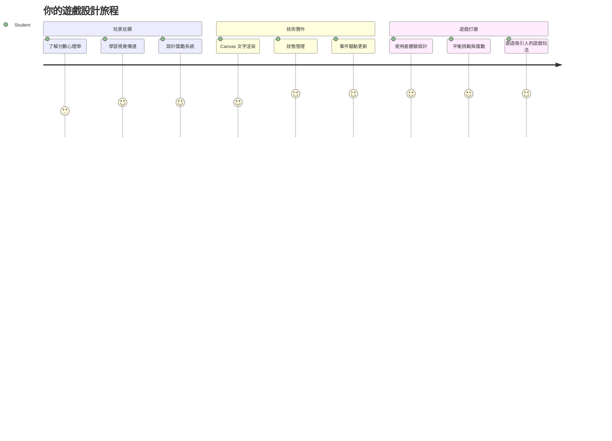
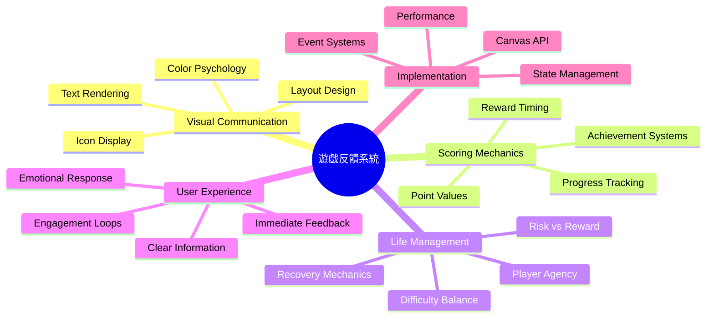
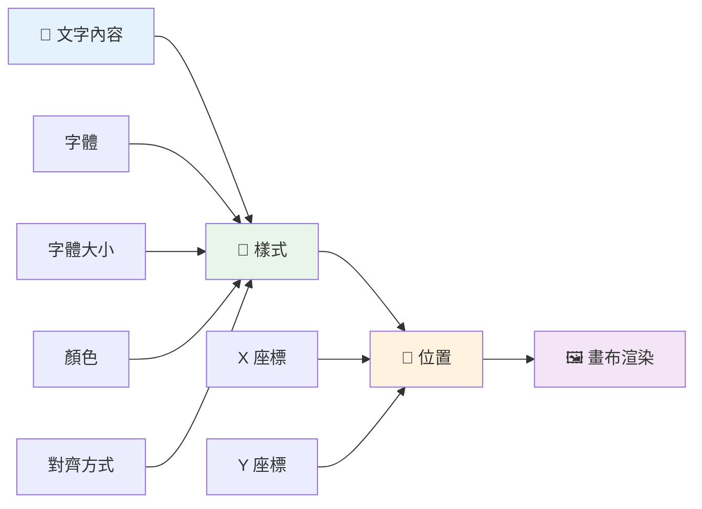
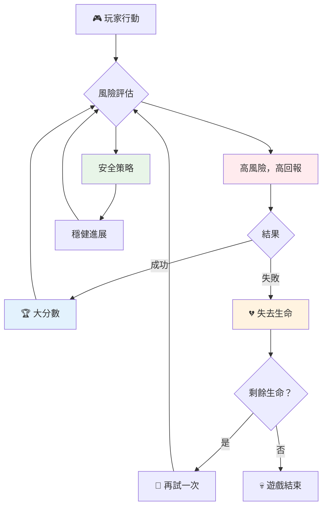
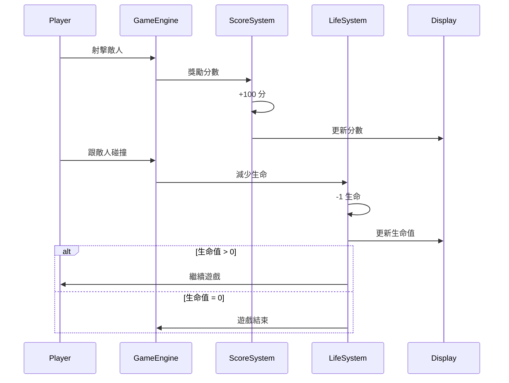
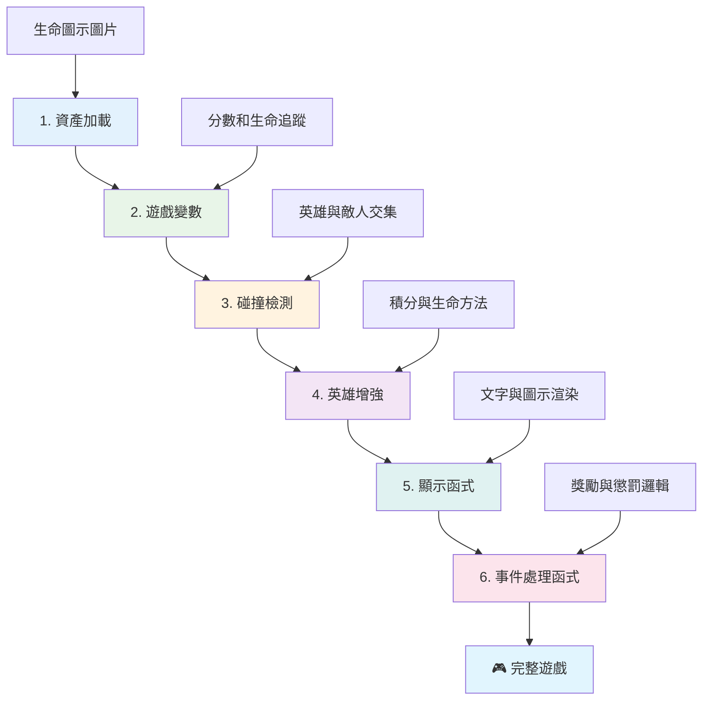
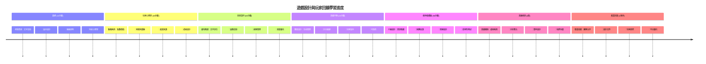

<!--
CO_OP_TRANSLATOR_METADATA:
{
  "original_hash": "2ed9145a16cf576faa2a973dff84d099",
  "translation_date": "2026-01-06T13:45:15+00:00",
  "source_file": "6-space-game/5-keeping-score/README.md",
  "language_code": "tw"
}
-->
# 建立太空遊戲 第五部分：計分與生命值


## 課前測驗

[課前測驗](https://ff-quizzes.netlify.app/web/quiz/37)

準備好讓你的太空遊戲成為真正的遊戲了嗎？讓我們加入計分與生命值管理——這些早期街機遊戲如《太空侵略者》從簡單演示變成讓人上癮娛樂的核心機制。這是讓你的遊戲真正可玩的關鍵。


## 在畫面上繪製文字——你的遊戲之聲

要顯示分數，我們需要學會如何在畫布上繪製文字。`fillText()` 方法是你的主要工具——這也是經典街機遊戲用來顯示分數和狀態資訊的技術。


你可以完全控制文字的外觀：

```javascript
ctx.font = "30px Arial";
ctx.fillStyle = "red";
ctx.textAlign = "right";
ctx.fillText("show this on the screen", 0, 0);
```

✅ 深入了解[在畫布上添加文字](https://developer.mozilla.org/docs/Web/API/Canvas_API/Tutorial/Drawing_text) — 你會驚訝於你在字型與樣式上能發揮多少創意！

## 生命值——不只是一個數字

在遊戲設計中，「生命」代表玩家犯錯的餘地。這個概念可追溯到彈球機，你會獲得多顆球來進行遊戲。在早期像《小行星》的遊戲中，生命讓玩家敢於冒險並從錯誤中學習。


視覺呈現非常重要——顯示飛船圖示而不是僅標示「生命值：3」能立即建立視覺認知，類似早期街機機台利用圖示跨越語言障礙。

## 建立你遊戲的獎勵系統

現在我們將實現保持玩家投入的核心回饋系統：


- **計分系統**：每擊落一艘敵機獲得 100 分（整數分數讓玩家更容易心算）。分數顯示在左下角。
- **生命計數器**：你的英雄從三條命開始——這是早期街機遊戲為了挑戰與可玩性平衡而建立的標準。每碰撞一次敵人就損失一條命。我們會用飛船圖示在右下角顯示剩餘生命 。

## 開始動手做吧！

首先，設定你的工作區。進入你的 `your-work` 子資料夾，你應該會看到這些檔案：

```bash
-| assets
  -| enemyShip.png
  -| player.png
  -| laserRed.png
-| index.html
-| app.js
-| package.json
```

要測試你的遊戲，從 `your_work` 資料夾啟動開發伺服器：

```bash
cd your-work
npm start
```

這會在 `http://localhost:5000` 運行本機伺服器。打開瀏覽器進入該地址查看你的遊戲。用方向鍵測試控制，嘗試射擊敵人以確認一切運作正常。


### 開始編碼！

1. **取得你需要的視覺資源**。把 `solution/assets/` 資料夾中的 `life.png` 拷貝到你的 `your-work` 資料夾。然後將 lifeImg 加入你的 window.onload 函式：

    ```javascript
    lifeImg = await loadTexture("assets/life.png");
    ```

1. 別忘了將 `lifeImg` 加入你的資源清單：

    ```javascript
    let heroImg,
    ...
    lifeImg,
    ...
    eventEmitter = new EventEmitter();
    ```
  
2. **設定遊戲變數**。新增程式碼追蹤總分（起始為 0）和剩餘生命（起始為 3）。我們會將這些資訊顯示在畫面上，讓玩家隨時知道狀態。

3. **實作碰撞偵測**。擴充你的 `updateGameObjects()` 函式來偵測敵人與你的英雄碰撞：

    ```javascript
    enemies.forEach(enemy => {
        const heroRect = hero.rectFromGameObject();
        if (intersectRect(heroRect, enemy.rectFromGameObject())) {
          eventEmitter.emit(Messages.COLLISION_ENEMY_HERO, { enemy });
        }
      })
    ```

4. **為英雄新增生命與分數追蹤**。  
   1. **初始化計數器**。在你的 `Hero` 類別中，`this.cooldown = 0` 下面設定生命和分數：

        ```javascript
        this.life = 3;
        this.points = 0;
        ```

   1. **將這些數值顯示給玩家**。建立函式將值繪製於畫面：

        ```javascript
        function drawLife() {
          // 待辦事項，35，27
          const START_POS = canvas.width - 180;
          for(let i=0; i < hero.life; i++ ) {
            ctx.drawImage(
              lifeImg, 
              START_POS + (45 * (i+1) ), 
              canvas.height - 37);
          }
        }
        
        function drawPoints() {
          ctx.font = "30px Arial";
          ctx.fillStyle = "red";
          ctx.textAlign = "left";
          drawText("Points: " + hero.points, 10, canvas.height-20);
        }
        
        function drawText(message, x, y) {
          ctx.fillText(message, x, y);
        }

        ```

   1. **將所有功能掛載到遊戲循環**。在 `updateGameObjects()` 後將這些函式加入你的 window.onload：

        ```javascript
        drawPoints();
        drawLife();
        ```

### 🔄 **教學檢查點**
**遊戲設計理解**：在實作後果之前，確認你理解：  
- ✅ 視覺回饋如何向玩家傳達遊戲狀態  
- ✅ UI 元件整齊擺放為何能提升易用性  
- ✅ 分數值與生命管理背後的心理學原理  
- ✅ 畫布文字渲染與 HTML 文字的差異  

**快速自我測驗**：為何街機遊戲通常用整數分數？  
*答案：整數分數玩家心算較容易，且帶來心理上滿足感獎勵*

**使用者體驗原則**：你目前應用：  
- **視覺層級**：重要資訊放在醒目位置  
- **即時回饋**：玩家行動即時更新  
- **認知負荷**：簡潔清晰資訊呈現  
- **情感設計**：用圖示與色彩建立玩家連結  

1. **實現遊戲後果與獎勵系統**。現在加入讓玩家行動有意義的回饋系統：

   1. **碰撞會損失生命**。每當英雄撞上敵人，就會失去一條命。  

      把此方法加入你的 `Hero` 類別：

        ```javascript
        decrementLife() {
          this.life--;
          if (this.life === 0) {
            this.dead = true;
          }
        }
        ```

   2. **射擊敵人會獲得分數**。每次成功擊中累積 100 分，為精準射擊帶來即時正向回饋。

      擴充英雄類別新增分數增加方法：

        ```javascript
          incrementPoints() {
            this.points += 100;
          }
        ```

        現在將此功能與碰撞事件連結：

        ```javascript
        eventEmitter.on(Messages.COLLISION_ENEMY_LASER, (_, { first, second }) => {
           first.dead = true;
           second.dead = true;
           hero.incrementPoints();
        })

        eventEmitter.on(Messages.COLLISION_ENEMY_HERO, (_, { enemy }) => {
           enemy.dead = true;
           hero.decrementLife();
        });
        ```

✅ 想知道其他用 JavaScript 和 Canvas 建置的遊戲嗎？好好探索一番，你會驚艷於可能達成的效果！

實作完這些功能後，測試你的遊戲完整回饋系統。你會在右下角看到生命圖示，左下角看到分數，隨碰撞扣生命，成功射擊則增加分數。

你的遊戲現在擁有早期街機遊戲令人著迷的核心機制──明確目標、即時回饋與玩家行動後果。

### 🔄 **教學檢查點**
**完整遊戲設計系統**：驗證你已精通玩家回饋系統：  
- ✅ 計分機制如何激發玩家動機與投入？  
- ✅ 視覺一致性在界面設計中的重要性？  
- ✅ 生命系統如何平衡挑戰與玩家留存？  
- ✅ 即時回饋在創造滿意遊戲體驗中的作用？  

**系統整合**：你的回饋系統展現：  
- **使用者體驗設計**：清晰視覺溝通與資訊層級  
- **事件驅動架構**：對玩家行動做即時回應  
- **狀態管理**：追蹤並顯示動態遊戲數據  
- **畫布技巧**：文字繪製與精靈定位  
- **遊戲心理學**：理解玩家動機與投入  

**專業設計模式**：你已實作：  
- **MVC 架構**：遊戲邏輯、資料與呈現分離  
- **觀察者模式**：事件驅動遊戲狀態更新  
- **元件設計**：可重用渲染與邏輯函式  
- **效能優化**：遊戲循環中高效渲染  

### ⚡ **接下來五分鐘可以做的事情**
- [ ] 嘗試不同分數顯示的字型大小與顏色  
- [ ] 改變分數值，感受遊戲節奏變化  
- [ ] 增加 console.log 記錄分數與生命值變化時機  
- [ ] 測試極限情況，如生命耗盡或達成高分  

### 🎯 **這小時可達成目標**
- [ ] 完成課後答題，理解遊戲設計心理學  
- [ ] 新增計分與失去生命的音效  
- [ ] 實作使用 localStorage 的高分系統  
- [ ] 為不同敵人設定不同點數  
- [ ] 加入失去生命時畫面震動等視覺效果  

### 📅 **你的周長遊戲設計之旅**
- [ ] 完成有完善回饋系統的完整太空遊戲  
- [ ] 實現進階計分機制如連擊倍數  
- [ ] 新增成就和可解鎖內容  
- [ ] 建立難度進程與平衡系統  
- [ ] 設計選單和遊戲結束畫面介面  
- [ ] 研究其他遊戲理解玩家投入機制  

### 🌟 **你的一個月遊戲開發修練**
- [ ] 建構具進階遊戲流程的完整作品  
- [ ] 學習遊戲分析與玩家行為量化  
- [ ] 參與開源遊戲開發專案  
- [ ] 精通進階遊戲設計模式與營收策略  
- [ ] 製作遊戲設計和使用者體驗教學內容  
- [ ] 建立遊戲設計與開發作品集  

## 🎯 你的遊戲設計掌握時程


### 🛠️ 你的遊戲設計工具摘要

完成本課程後，你已精通：  
- **玩家心理學**：了解動機、風險/獎勵、與投入循環  
- **視覺傳達**：用文字、圖示與排版提升 UI 效果  
- **回饋系統**：對玩家行為及遊戲事件即時反應  
- **狀態管理**：高效追蹤與呈現動態遊戲數據  
- **畫布文字繪製**：專業文字顯示與樣式置中操作  
- **事件整合**：將用戶操作連接到有意義的遊戲後果  
- **遊戲平衡**：設計關卡難度與玩家成長系統  

**實務應用**：你的遊戲設計能力可直接用於：  
- **使用者介面設計**：打造吸引人且直覺的介面  
- **產品開發**：理解用戶動機與回饋回圈  
- **教育科技**：遊戲化與學習投入系統  
- **資料視覺化**：讓複雜資訊變得易懂有趣  
- **行動應用開發**：用戶留存機制與體驗設計  
- **營銷科技**：理解用戶行為與轉換優化  

**你已獲得的專業技能**：  
- **設計**出能激發動機且讓用戶投入的體驗  
- **實作**引導用戶行為的回饋系統  
- **平衡**互動系統的挑戰與可達性  
- **創造**跨用戶群有效的視覺傳達  
- **分析**用戶行為與迭代設計改進  

**掌握的遊戲開發概念**：  
- **玩家動機**：了解促成參與與留存的關鍵  
- **視覺設計**：打造清晰、吸引且實用的介面  
- **系統整合**：結合多個遊戲系統提供完整體驗  
- **效能優化**：高效畫面更新與狀態管理  
- **無障礙設計**：適應不同技巧與玩家需求  

**下一階段**：你已準備好探索進階遊戲設計模式、實作分析系統，或研究遊戲營收與玩家留存策略！

🌟 **成就解鎖**：你已建立完整的玩家回饋系統並掌握專業遊戲設計原則！

---

## GitHub Copilot Agent 挑戰 🚀

使用 Agent 模式完成以下挑戰：

**說明**：強化太空遊戲的計分系統，實作高分功能並加入持久儲存與連殺加分機制。

**提示**：建立高分系統，將玩家最高分數儲存到 localStorage。增加連續擊殺敵人（連擊系統）的獎勵分數，並為不同敵人實作不同分數值。在玩家創造新高分時顯示視覺提示，在遊戲畫面顯示目前最高分。

## 🚀 挑戰任務

你現在有一個具備計分與生命值的功能完整遊戲。想想看有哪些額外功能可以提升玩家體驗。

## 課後測驗

[課後測驗](https://ff-quizzes.netlify.app/web/quiz/38)

## 複習與自學

想要深入探索嗎？研究計分與生命系統的不同做法。市面上有些很棒的遊戲引擎如 [PlayFab](https://playfab.com) 負責計分、排行榜與玩家成長系統。整合這種方案會如何將你的遊戲推向新境界？

## 作業

[製作一款計分遊戲](assignment.md)

---

<!-- CO-OP TRANSLATOR DISCLAIMER START -->
**免責聲明**：  
本文件由 AI 翻譯服務 [Co-op Translator](https://github.com/Azure/co-op-translator) 進行翻譯。雖然我們致力於確保翻譯的準確性，但請注意，自動翻譯可能包含錯誤或不準確之處。原始文件的母語版本應被視為權威來源。對於重要資訊，建議採用專業人員的人工翻譯。我們不對因使用本翻譯而導致的任何誤解或誤譯負責。
<!-- CO-OP TRANSLATOR DISCLAIMER END -->