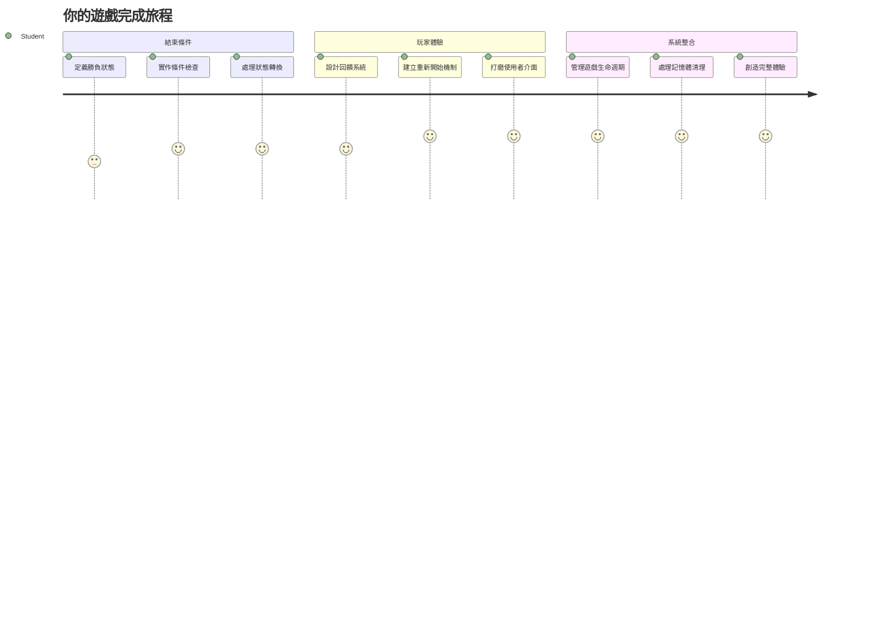
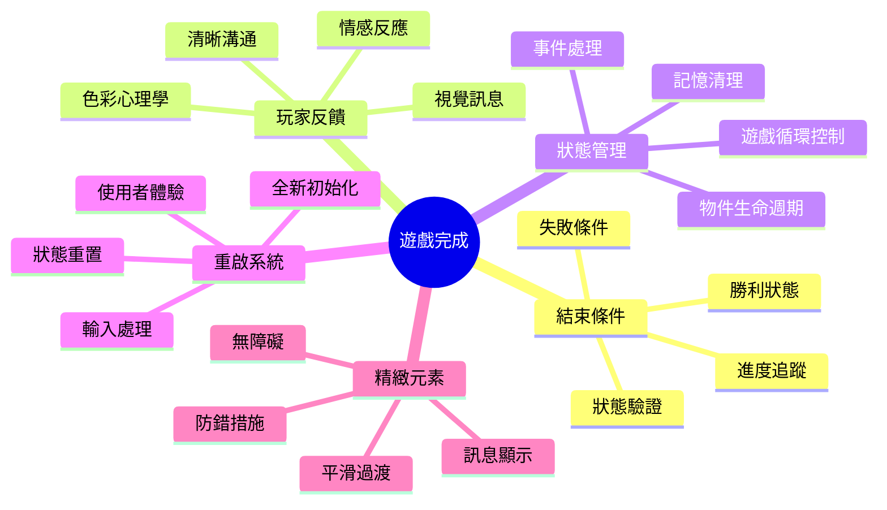
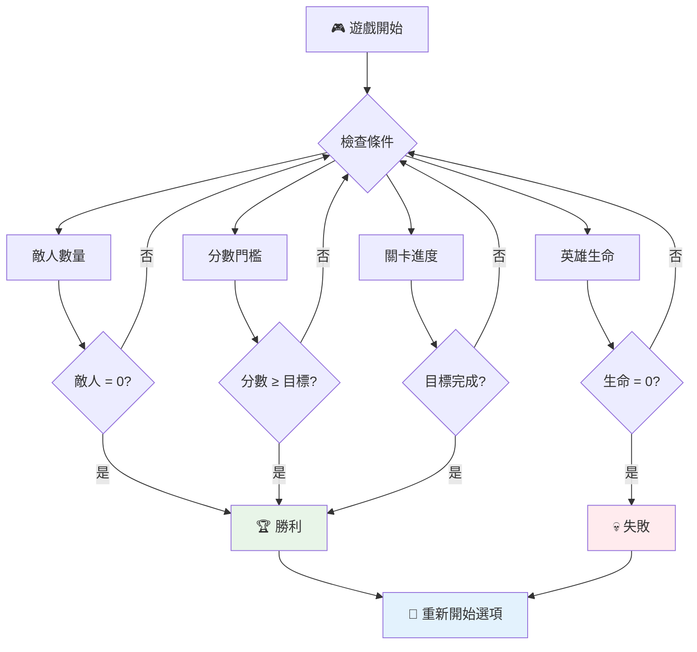
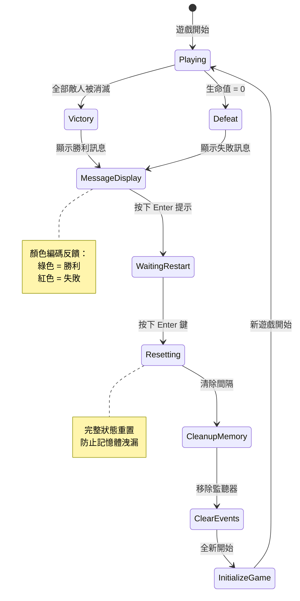
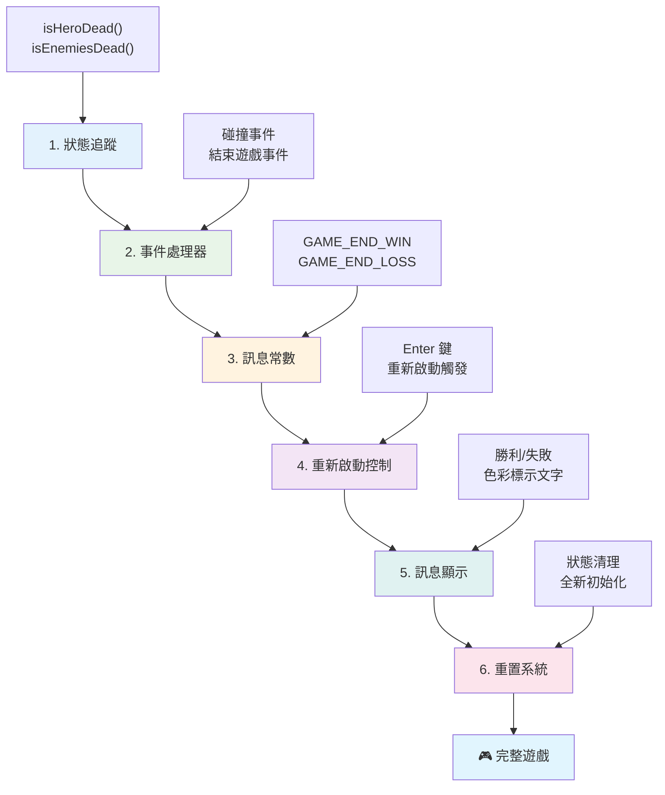
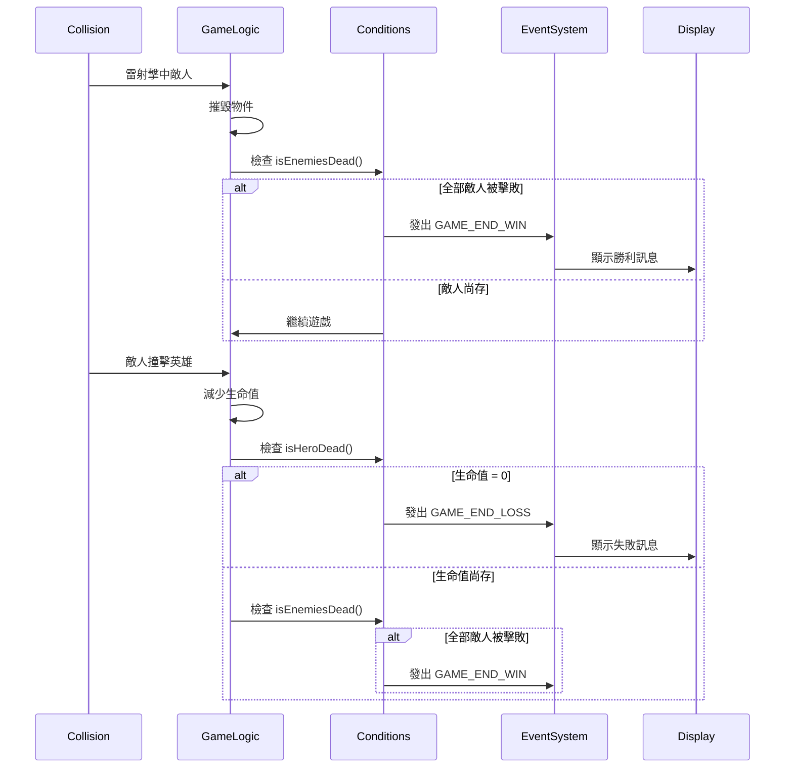
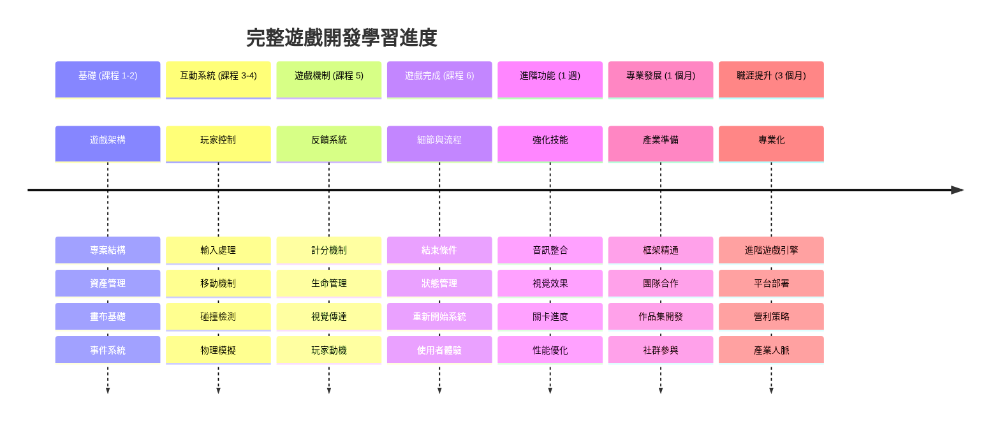

<!--
CO_OP_TRANSLATOR_METADATA:
{
  "original_hash": "a4b78043f4d64bf3ee24e0689b8b391d",
  "translation_date": "2026-01-06T13:42:46+00:00",
  "source_file": "6-space-game/6-end-condition/README.md",
  "language_code": "tw"
}
-->
# 建立太空遊戲第六部：結束與重啟


每一款經典遊戲都需要明確的結束條件與順暢的重啟機制。你已經建立了一款有移動、戰鬥和得分功能的精彩太空遊戲——現在是時候加入最後的元素，讓遊戲更完整。

你的遊戲目前無限運行，就像美國航太總署在1977年發射的旅行者探測器，數十年後仍在太空中旅行。雖然對太空探索來說沒問題，但遊戲需要有明確的終點，才能創造令人滿意的體驗。

今天，我們將實作合適的勝利與失敗條件與重啟系統。課程結束時，你將擁有完成度高、玩家能結束並重玩的遊戲，就像定義了遊戲媒介的經典街機一樣。


## 課前小測驗

[課前小測驗](https://ff-quizzes.netlify.app/web/quiz/39)

## 了解遊戲結束條件

遊戲應該何時結束？這個根本性問題自早期街機時代便影響遊戲設計。貪食蛇玩法是被鬼抓到或吃完所有點數便結束，太空侵略者是在外星人抵達底部或被全數擊毀時結束。

作為遊戲創作者，你定義勝利與失敗條件。針對我們的太空遊戲，以下是創造有趣玩法的經典方法：


- **摧毀 `N` 艘敵艦**：若遊戲分為多關，往往需要摧毀一定數量的敵艦才能過關
- **你的飛船被摧毀**：許多遊戲會在你的飛船被毀時判定失敗。另一種常見做法是有生命值概念，每次飛船毀滅扣一條命，生命耗盡則遊戲結束
- **收集了 `N` 點數**：另一種常見的結束條件是玩家須累積一定點數，點數可依各種行動獲取，如擊毀敵艦或收集敵艦被擊毀後掉落的物品
- **完成一關**：可能包含多種條件，例如摧毀 `X` 艘敵艦、收集 `Y` 點數，或是收集特定物品等

## 實作遊戲重啟功能

優良遊戲透過順暢重啟機制鼓勵重玩。玩家完成遊戲（或失敗）後，往往喜歡立即重新嘗試，不論是為了破高分或改善表現。


「俄羅斯方塊」就是完美例子：當方塊堆到頂端時，你可立刻開始新遊戲，無需瀏覽繁複選單。我們將建立類似的重啟系統，讓遊戲狀態乾淨重設，迅速帶玩家重返戰場。

✅ **思考**：想想你玩過的遊戲，它們在什麼條件會結束？如何提示你重啟？什麼讓重啟體驗順暢或令人沮喪？

## 你將實作的內容

你將完成最後功能，讓專案成為完整遊戲。這些元素決定遊戲的精緻度，而不只是基本原型。

**今天新增的是：**

1. **勝利條件**：消滅所有敵人並展現恰當的慶祝（你值得擁有！）
2. **失敗條件**：生命耗盡，呈現失敗畫面
3. **重啟機制**：按 Enter 鍵立即重新開始 — 因為一場遊戲永遠不夠
4. **狀態管理**：每次都從乾淨狀態開始，不留敵人或奇怪的殘留錯誤

## 開始前準備

讓我們準備開發環境。你應該已準備好之前課程的所有太空遊戲檔案。

**你的專案看起來應該像這樣：**

```bash
-| assets
  -| enemyShip.png
  -| player.png
  -| laserRed.png
  -| life.png
-| index.html
-| app.js
-| package.json
```

**啟動開發伺服器：**

```bash
cd your-work
npm start
```

**此指令：**
- 在 `http://localhost:5000` 執行本地伺服器
- 正確提供你的檔案
- 檔案更動時自動刷新頁面

打開瀏覽器前往 `http://localhost:5000`，確認遊戲運作正常。你應該能移動、射擊並和敵人互動。確認無誤後，我們就可進行功能實作。

> 💡 **專業提示**：為避免 Visual Studio Code 中警告，請在檔案頂端宣告 `let gameLoopId;`，而非於 `window.onload` 函式內宣告。此做法符合現代 JavaScript 變數宣告最佳實踐。


## 實作步驟

### 步驟 1：建立結束條件追蹤函式

我們需要函式來監控遊戲何時該結束。就像國際太空站的感測器持續監控重要系統，這些函式會持續檢查遊戲狀態。

```javascript
function isHeroDead() {
  return hero.life <= 0;
}

function isEnemiesDead() {
  const enemies = gameObjects.filter((go) => go.type === "Enemy" && !go.dead);
  return enemies.length === 0;
}
```

**背後運作如下：**
- **檢查**主角是否已無生命（糟糕！）
- **計算**還有多少敵人存活並活躍
- **回傳**當敵場清空時為 `true`
- **使用**簡單的真假邏輯保持清晰
- **篩選**遊戲中的物件找出倖存者

### 步驟 2：更新事件處理器用於結束條件

現在將結束條件判斷與遊戲事件系統連接。每次碰撞事件發生時，遊戲會評估是否觸發結束條件。如此可對重要事件給予即時回饋。


```javascript
eventEmitter.on(Messages.COLLISION_ENEMY_LASER, (_, { first, second }) => {
    first.dead = true;
    second.dead = true;
    hero.incrementPoints();

    if (isEnemiesDead()) {
      eventEmitter.emit(Messages.GAME_END_WIN);
    }
});

eventEmitter.on(Messages.COLLISION_ENEMY_HERO, (_, { enemy }) => {
    enemy.dead = true;
    hero.decrementLife();
    if (isHeroDead())  {
      eventEmitter.emit(Messages.GAME_END_LOSS);
      return; // 勝利之前的損失
    }
    if (isEnemiesDead()) {
      eventEmitter.emit(Messages.GAME_END_WIN);
    }
});

eventEmitter.on(Messages.GAME_END_WIN, () => {
    endGame(true);
});
  
eventEmitter.on(Messages.GAME_END_LOSS, () => {
  endGame(false);
});
```

**運作內容：**
- **雷射擊中敵人**：雙方消失，你得分，檢查是否勝利
- **敵人撞上你**：扣一條命並檢查是否存活
- **智能順序**：先檢查失敗條件（沒有人想同時贏又輸！）
- **即時反應**：重要事件一發生，遊戲立即得知

### 步驟 3：新增訊息常數

你需要在 `Messages` 常數物件裡新增事件訊息類型。這些常數確保事件系統一致性與避免拼字錯誤。

```javascript
GAME_END_LOSS: "GAME_END_LOSS",
GAME_END_WIN: "GAME_END_WIN",
```

**以上更動包含：**
- **新增**與遊戲結束事件相關的常數，保持一致性
- **使用**清楚敘述事件目的的名稱
- **依循**既有訊息類型的命名慣例

### 步驟 4：實作重啟控制

現在加入鍵盤控制，允許玩家重啟遊戲。Enter 鍵是自然的選擇，因為它通常與確認動作和開始遊戲相關聯。

**在現有 keydown 事件監聽器中加入 Enter 鍵判斷：**

```javascript
else if(evt.key === "Enter") {
   eventEmitter.emit(Messages.KEY_EVENT_ENTER);
}
```

**新增訊息常數：**

```javascript
KEY_EVENT_ENTER: "KEY_EVENT_ENTER",
```

**重要資訊：**
- **擴充**現有鍵盤事件處理系統
- **使用**Enter 鍵做為直覺的重啟觸發
- **發出**可被其他系統監聽的自訂事件
- **維持**和其他鍵盤控制相同模式

### 步驟 5：建立訊息顯示系統

遊戲需清楚向玩家傳達結果。我們將建立訊息系統，用具有色彩標示的文字清楚表示勝利和失敗狀態，類似早期電腦終端機使用綠色表示成功、紅色表示錯誤。

**建立 `displayMessage()` 函式：**

```javascript
function displayMessage(message, color = "red") {
  ctx.font = "30px Arial";
  ctx.fillStyle = color;
  ctx.textAlign = "center";
  ctx.fillText(message, canvas.width / 2, canvas.height / 2);
}
```

**細節說明：**
- **設定**字型大小與字體，提高可視性
- **使用**顏色參數，可預設為紅色警告色
- **讓**文字水平垂直置中呈現在畫布上
- **利用**現代 JavaScript 預設參數提供彈性
- **充分利用** canvas 2D context 實現直接文字渲染

**建立 `endGame()` 函式：**

```javascript
function endGame(win) {
  clearInterval(gameLoopId);

  // 設置延遲以確保所有待處理的渲染完成
  setTimeout(() => {
    ctx.clearRect(0, 0, canvas.width, canvas.height);
    ctx.fillStyle = "black";
    ctx.fillRect(0, 0, canvas.width, canvas.height);
    if (win) {
      displayMessage(
        "Victory!!! Pew Pew... - Press [Enter] to start a new game Captain Pew Pew",
        "green"
      );
    } else {
      displayMessage(
        "You died !!! Press [Enter] to start a new game Captain Pew Pew"
      );
    }
  }, 200)  
}
```

**該函式作用：**
- **凍結**所有活動：飛船與雷射停止移動
- **小暫停**(200 毫秒)讓上個畫面完成渲染
- **清空**畫面，並以黑色底顯示展現戲劇效果
- **對勝利與失敗者**顯示不同訊息
- **顏色區別**訊息：綠色代表好消息，紅色...代表不妙
- **指示**玩家如何重新開始遊戲

### 🔄 **教學檢核**
**遊戲狀態管理**：在實作重置功能前，請確保你了解：
- ✅ 結束條件如何創造明確遊戲目標
- ✅ 直觀視覺回饋為何對玩家理解非常重要
- ✅ 適當清理在防止記憶體洩漏上的重要性
- ✅ 事件驅動架構如何實現乾淨的狀態轉換

**自我測驗**：如果你不在重置時清除事件監聽器會發生什麼？
*答案：引起記憶體洩漏和事件監聽器重複，造成不可預測行為*

**遊戲設計原則**：你正執行以下重點：
- **明確目標**：玩家清楚何謂成功或失敗
- **即時回饋**：遊戲狀態變更能即刻傳達
- **用戶控制**：玩家能在準備好時重新開始
- **系統穩定**：適當清理避免 Bug 與性能問題

### 步驟 6：實作遊戲重置功能

重置系統必須徹底清理現有遊戲狀態，並初始化全新遊戲環境。確保玩家每次從乾淨環境開始，沒有前場殘留資料。

**建立 `resetGame()` 函式：**

```javascript
function resetGame() {
  if (gameLoopId) {
    clearInterval(gameLoopId);
    eventEmitter.clear();
    initGame();
    gameLoopId = setInterval(() => {
      ctx.clearRect(0, 0, canvas.width, canvas.height);
      ctx.fillStyle = "black";
      ctx.fillRect(0, 0, canvas.width, canvas.height);
      drawPoints();
      drawLife();
      updateGameObjects();
      drawGameObjects(ctx);
    }, 100);
  }
}
```

**逐段解析：**
- **檢查**是否已有進行中的遊戲迴圈
- **清除**現有迴圈，終止目前所有遊戲活動
- **移除**所有事件監聽器，避免記憶體洩漏
- **重新初始化**遊戲狀態，包括物件和變數
- **啟動**帶有必要遊戲功能的新遊戲迴圈
- **沿用**100 毫秒執行間隔，保持遊戲性能一致

**在 `initGame()` 函式中新增 Enter 鍵事件監聽：**

```javascript
eventEmitter.on(Messages.KEY_EVENT_ENTER, () => {
  resetGame();
});
```

**在 EventEmitter 類別新增 `clear()` 方法：**

```javascript
clear() {
  this.listeners = {};
}
```

**記得關鍵點：**
- **將** Enter 鍵按下連結到重置遊戲功能
- **於遊戲初始化時**註冊此事件監聽
- **提供**一個方式在重置時移除所有事件監聽
- **避免**記憶體洩漏，重設遊戲間清理事件處理器
- **清空**listeners 物件，準備新初始化

## 恭喜！🎉

👽 💥 🚀 你成功從零打造出完整遊戲。就像1970年代創造第一批電子遊戲的程式設計師一樣，你將程式碼轉成有完整遊戲機制與使用者回饋的互動體驗。🚀 💥 👽

**你已完成：**
- **實作**完整勝負條件及使用者回饋
- **創建**無縫重啟系統，讓遊戲持續進行
- **設計**清晰視覺顯示遊戲狀態
- **管理**複雜遊戲狀態轉換與清理
- **組合**所有元件成完整且可玩的遊戲

### 🔄 **教學檢核**
**完整遊戲開發系統**：慶祝你掌握全遊戲開發流程：
- ✅ 結束條件如何塑造讓玩家滿意的體驗？
- ✅ 為何正確狀態管理對遊戲穩定性關鍵？
- ✅ 視覺回饋如何強化玩家理解？
- ✅ 重啟系統在玩家留存中扮演什麼角色？

**系統掌握**：你打造的遊戲展現了：
- **全端遊戲開發**：涵蓋圖像、輸入及狀態管理
- **專業架構**：事件驅動、且具適當清理
- **使用者體驗設計**：清楚回饋與直覺操作
- **性能優化**：高效率渲染與記憶體管理
- **精緻與完整**：所有細節成就成熟遊戲感

**業界技能**：你已實作：
- **遊戲迴圈架構**：具一致性能的即時系統
- **事件驅動程式設計**：有效擴展的解耦系統
- **狀態管理**：複雜資料及生命週期處理
- **使用者界面設計**：明確溝通與回應式控制
- **測試與除錯**：反覆開發與問題解決能力

### ⚡ **接下來五分鐘可以做的事**
- [ ] 遊玩完成的遊戲並測試所有勝負條件
- [ ] 嘗試修改不同結束條件參數
- [ ] 加入 console.log 陳述追蹤遊戲狀態變化
- [ ] 分享遊戲給朋友並蒐集反饋

### 🎯 **這小時內能達成目標**
- [ ] 完成課後問答並反省遊戲開發歷程
- [ ] 為勝利與失敗狀態加入音效
- [ ] 實作更多結束條件，如限時或額外獎勵
- [ ] 製作不同難度關卡，調整敵人數量
- [ ] 美化視覺呈現，使用更佳字型與色彩

### 📅 **一週遊戲開發精通計畫**
- [ ] 完成改良版太空遊戲，含多關卡與進度
- [ ] 增加進階功能，如能量提升、敵人種類、多樣武器
- [ ] 建立持久化的排行榜系統
- [ ] 設計選單、設定和遊戲選項介面
- [ ] 優化不同裝置和瀏覽器的性能
- [ ] 將遊戲部署至網路並與社群分享
### 🌟 **你的一個月遊戲開發職涯**
- [ ] 製作多款完整遊戲，探索不同類型和機制
- [ ] 學習高階遊戲開發框架，如 Phaser 或 Three.js
- [ ] 參與開源遊戲開發專案
- [ ] 研究遊戲設計原則與玩家心理
- [ ] 建立作品集展示你的遊戲開發技能
- [ ] 與遊戲開發社群接軌並持續學習

## 🎯 你的完整遊戲開發精通時間軸


### 🛠️ 你的完整遊戲開發工具箱摘要

完成整個太空遊戲系列後，你已掌握：
- **遊戲架構**：事件驅動系統、遊戲循環及狀態管理
- **圖形程式設計**：Canvas API、精靈繪製及視覺特效
- **輸入系統**：鍵盤處理、碰撞偵測及響應式控制
- **遊戲設計**：玩家反饋、進程系統及互動機制
- **效能優化**：高效渲染、記憶體管理及幀率控制
- **使用者體驗**：清楚溝通、直覺操作及細節修飾
- **專業範式**：乾淨程式碼、除錯技巧及專案組織

**實務應用領域**：你的遊戲開發技能可直接應用於：
- **互動式網頁應用**：動態介面與即時系統
- **資料視覺化**：動畫圖表與互動圖形
- **教育科技**：遊戲化與吸引人的學習體驗
- **行動裝置開發**：觸控互動與效能優化
- **模擬軟體**：物理引擎與即時建模
- **創意產業**：互動藝術、娛樂與數位體驗

**專業技能提升**：你現在能夠：
- **架構**複雜互動系統並從零開始打造
- **除錯**即時應用並運用系統化方法
- **優化**效能以實現流暢使用體驗
- **設計**引人入勝的使用者介面與互動模式
- **協作**於技術專案中有效組織程式碼

**遊戲開發核心概念精通**：
- **即時系統**：遊戲循環、幀率管理及效能
- **事件驅動架構**：解耦系統與訊息傳遞
- **狀態管理**：複雜資料處理與生命週期管理
- **使用者介面程式設計**：Canvas 繪圖與響應式設計
- **遊戲設計理論**：玩家心理與互動機制

**下一步**：你已準備好探索進階遊戲框架、3D 圖形、多玩家系統，或轉向專業遊戲開發職涯！

🌟 **成就解鎖**：你完成了完整的遊戲開發旅程，並從零打造了一個專業品質的互動體驗！

**歡迎加入遊戲開發社群！** 🎮✨

## GitHub Copilot Agent 挑戰 🚀

使用 Agent 模式完成以下挑戰：

**說明：** 透過實作關卡進度系統，並增加難度與額外功能，提升太空遊戲。

**提示：** 製作多關卡太空遊戲系統，每關擁有更多敵艦，速度與生命值提升。新增隨關卡增加的得分倍數，並實作道具（如連射或護盾），敵人被消滅時隨機出現。關卡完成時給予獎勵，並在畫面上顯示目前關卡，同時搭配既有得分和生命數。

進一步了解 [agent 模式](https://code.visualstudio.com/blogs/2025/02/24/introducing-copilot-agent-mode)。

## 🚀 選擇性強化挑戰

**為你的遊戲加入音效**：用音效增強遊戲體驗！考慮加入以下音效：

- 玩家發射時的 **雷射聲**
- 敌艦被摧毀時的 **爆炸聲**
- 玩家受傷時的 **受創聲**
- 遊戲勝利的 **勝利音樂**
- 遊戲失敗的 **失敗音效**

**音效實作範例：**

```javascript
// 建立音訊物件
const laserSound = new Audio('assets/laser.wav');
const explosionSound = new Audio('assets/explosion.wav');

// 在遊戲事件中播放聲音
function playLaserSound() {
  laserSound.currentTime = 0; // 重設到開始位置
  laserSound.play();
}
```

**你需要知道：**
- **建立**不同音效的 Audio 物件
- **重設**currentTime 以實現連續快速播放音效
- **因應**瀏覽器自動播放政策，需從使用者互動觸發音效
- **管理**音量與時機，提升遊戲體驗

> 💡 **學習資源**：探索此 [音效沙盒](https://www.w3schools.com/jsref/tryit.asp?filename=tryjsref_audio_play)，了解如何在 JavaScript 遊戲中實作音效。

## 課後小測驗

[課後小測驗](https://ff-quizzes.netlify.app/web/quiz/40)

## 複習與自學

你的作業是創建一個新的示範遊戲，請探索一些有趣的遊戲，看看你可能想做哪種類型的遊戲。

## 作業

[製作示範遊戲](assignment.md)

---

<!-- CO-OP TRANSLATOR DISCLAIMER START -->
**免責聲明**：
本文件使用 AI 翻譯服務 [Co-op Translator](https://github.com/Azure/co-op-translator) 進行翻譯。雖然我們致力於翻譯的準確性，但請注意自動翻譯可能包含錯誤或不準確之處。原始文件的原文版本應視為權威來源。針對重要資訊，建議採用專業人工翻譯。我們不對因使用本翻譯所產生的任何誤解或誤釋負責。
<!-- CO-OP TRANSLATOR DISCLAIMER END -->