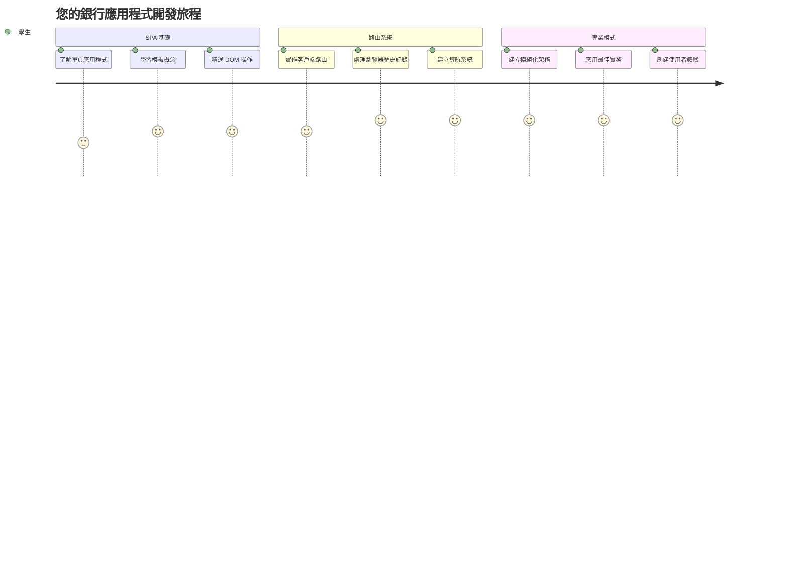
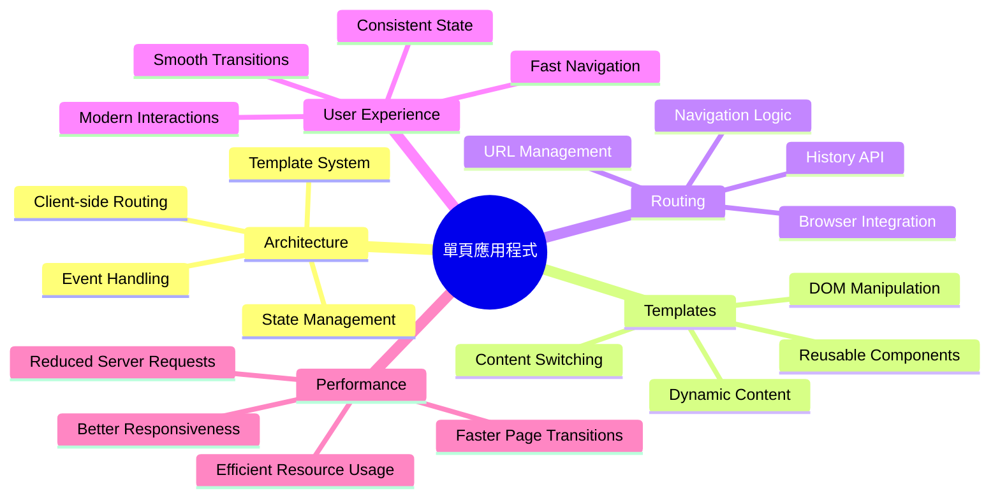
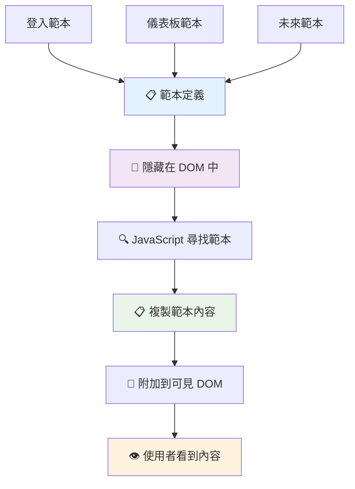
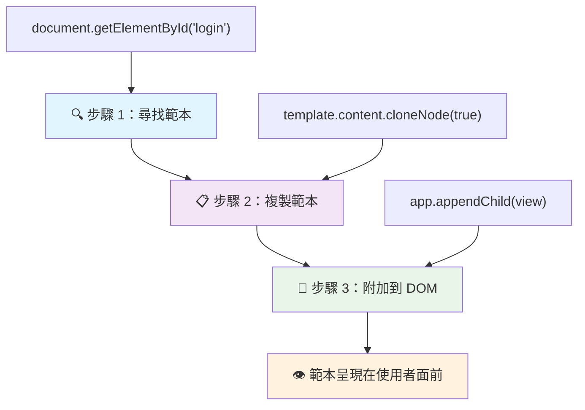
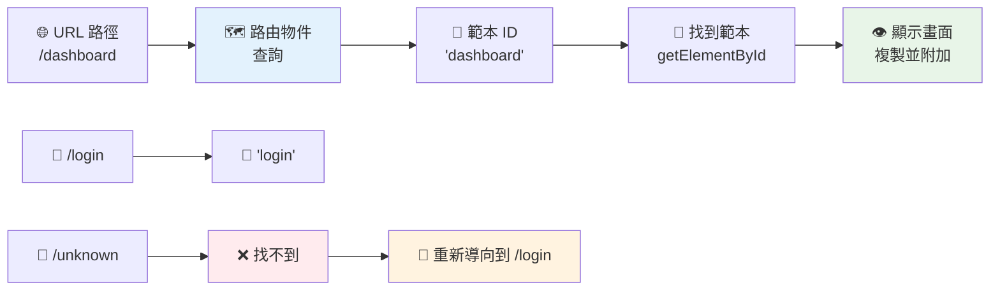
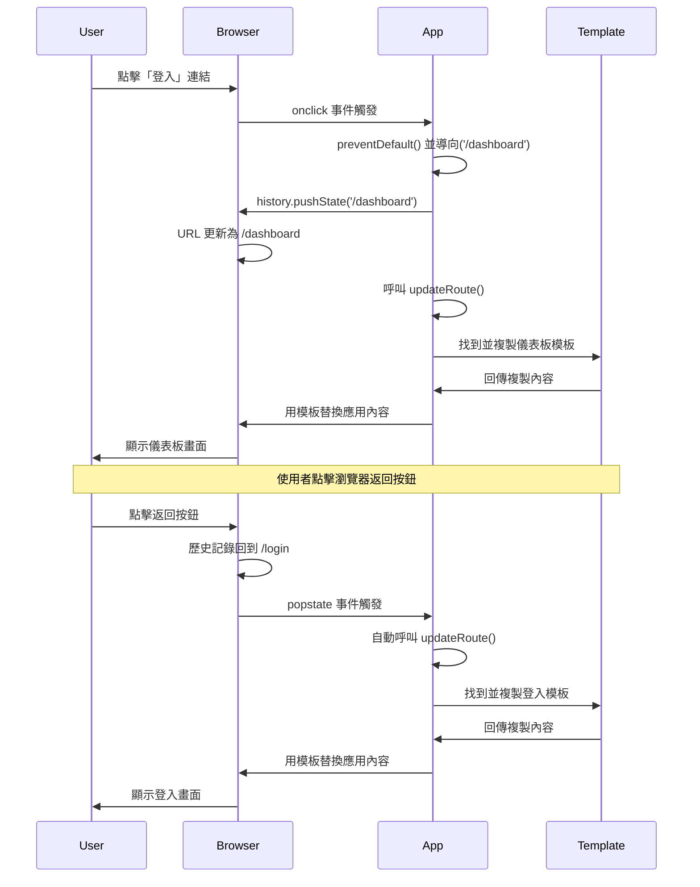
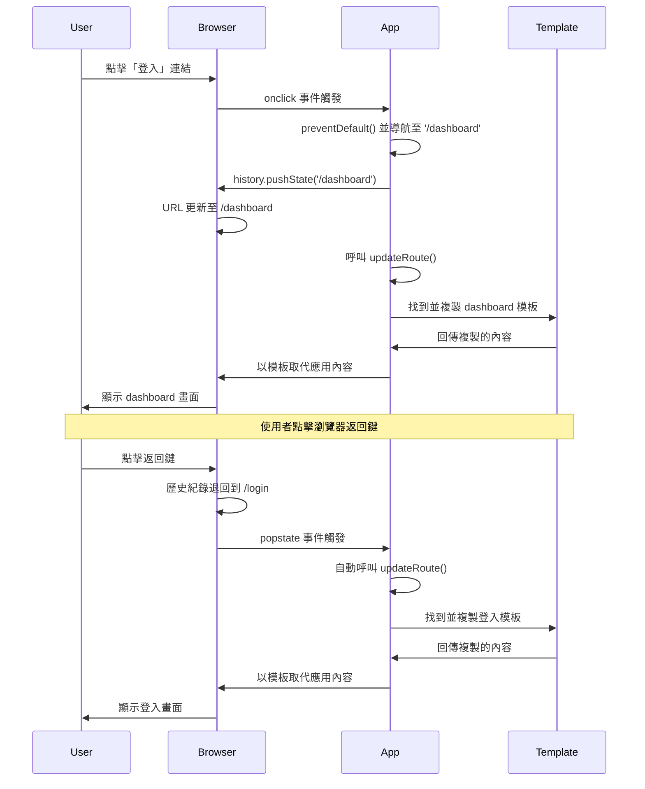
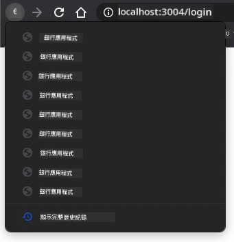
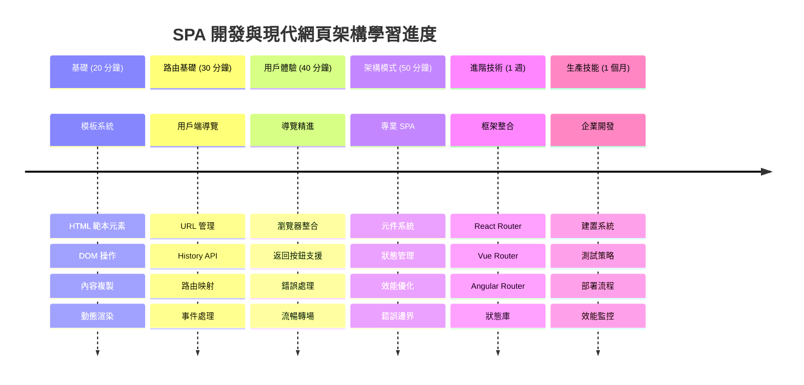

<!--
CO_OP_TRANSLATOR_METADATA:
{
  "original_hash": "351678bece18f07d9daa987a881fb062",
  "translation_date": "2026-01-06T14:00:46+00:00",
  "source_file": "7-bank-project/1-template-route/README.md",
  "language_code": "tw"
}
-->
# 建立銀行應用程式 第一部分：HTML 模板與網頁應用程式中的路由


當阿波羅11號在1969年登月時，其導航電腦必須在不同程式間切換，卻不需重新啟動整個系統。現代網頁應用程式也類似 — 它們改變你所看到的內容，而非重新載入全部，這讓用戶體驗變得流暢且反應迅速。

不同於傳統網站每次互動都會重新載入整頁，現代網頁應用程式只更新需要改變的部分。這種作法就像任務控制中心在切換不同顯示畫面，同時保持持續通訊，帶來我們所期望的流暢體驗。

使差異如此顯著的原因如下：

| 傳統多頁應用程式 | 現代單頁應用程式 |
|-----------------|------------------|
| **導覽** | 每個畫面重新載入整頁 | 內容即時切換 |
| **效能** | 因為完整HTML下載較慢 | 部分更新較快 |
| **用戶體驗** | 頁面閃爍令人分心 | 流暢，像是原生應用程式的轉場 |
| **資料共享** | 頁面間共享困難 | 狀態管理容易 |
| **開發** | 需維護多個HTML文件 | 單一HTML搭配動態模板 |

**理解演變歷程：**
- **傳統應用程式** 每次導覽都需要向伺服器發送請求
- **現代SPA** 一次載入即可利用JavaScript動態更新內容
- **用戶期望** 現在偏好即時無縫的互動體驗
- **效能優勢** 包含降低頻寬使用與加快回應速度

在本課程中，我們將建立一個銀行應用程式，有多個畫面並且流暢銜接。就像科學家使用可模組化的儀器，可依需求重新組合，我們將用HTML模板作為可重複使用的元件，必要時顯示。

你會操作HTML模板（用於不同畫面重複使用的藍圖）、JavaScript路由系統（負責畫面切換）、以及瀏覽器歷史API（讓返回按鈕如預期運作）。這些就是React、Vue、Angular等框架背後的基本技術。

最後，你將擁有一個功能完整且展現專業單頁應用原則的銀行應用程式。


## 課前測驗

[課前測驗](https://ff-quizzes.netlify.app/web/quiz/41)

### 所需準備

我們需要一個本地網頁伺服器來測試銀行應用程式 — 不用擔心，這很簡單！如果你還沒設定好，安裝 [Node.js](https://nodejs.org) 之後，在專案目錄執行 `npx lite-server` 即可。此指令會啟動本地伺服器並自動打開瀏覽器顯示你的應用程式。

### 準備工作

在電腦上建立一個資料夾名為 `bank`，裡面放一個 `index.html` 檔案。我們將從這個HTML [樣板](https://en.wikipedia.org/wiki/Boilerplate_code)開始：

```html
<!DOCTYPE html>
<html lang="en">
  <head>
    <meta charset="UTF-8">
    <meta name="viewport" content="width=device-width, initial-scale=1.0">
    <title>Bank App</title>
  </head>
  <body>
    <!-- This is where you'll work -->
  </body>
</html>
```

**此樣板提供了什麼：**
- **建立** 正確的HTML5文件結構及DOCTYPE宣告
- **設定** 字元編碼為UTF-8，支援多國文字
- **啟用** 響應式設計的viewport標籤，適用手機裝置
- **設置** 出現在瀏覽器分頁標題的描述性標題
- **創建** 一個乾淨的body區域，讓我們構建應用程式

> 📁 **專案結構預覽**
> 
> **本課結束時，你的專案將包含：**
> ```
> bank/
> ├── index.html      <!-- Main HTML with templates -->
> ├── app.js          <!-- Routing and navigation logic -->
> └── style.css       <!-- (Optional for future lessons) -->
> ```
> 
> **檔案職責分工：**
> - **index.html**：包含所有模板並提供應用架構
> - **app.js**：負責路由、導覽與模板管理
> - **模板**：定義登入、儀表板及其他畫面UI

---

## HTML 模板

模板解決了網頁開發中的一個基本問題。當古騰堡在1440年代發明活字印刷時，他發現不必雕刻整頁，而是可製作可重複使用的字元塊，並根據需要組合。HTML模板遵循同樣原理 — 不用為每個畫面建立單獨HTML檔，而是定義可重用的結構，並按需顯示。


想像模板是應用程式不同部份的藍圖。就像建築師繪製一次藍圖，並多次使用，而不必重複畫相同房間一樣，我們也只創建一次模板，根據需要實例化。瀏覽器會將這些模板隱藏，直到JavaScript啟用它們。

如果你要建立多個網頁畫面，一個解決方案是為每個畫面建立一個HTML文件，但這有些不便：

- 在切換畫面時必須重新載入完整HTML，速度會慢
- 不同畫面間共享資料較困難

另一種作法是只用一個HTML檔，用 `<template>` 元素定義多個 [HTML模板](https://developer.mozilla.org/docs/Web/HTML/Element/template)。模板是一段可重用而瀏覽器不會直接顯示的HTML區塊，必須用JavaScript在執行時實例化。

### 讓我們開始打造

我們要做一個有兩個主要畫面的銀行應用：登入頁與儀表板。先在HTML的body標籤內加一個佔位元素 — 所有不同畫面都將在這裡出現：

```html
<div id="app">Loading...</div>
```

**此佔位元素說明：**
- **建立** 一個ID為 "app" 的容器，所有畫面將顯示在這裡
- **顯示** 加載中的訊息，直到JavaScript初始化第一個畫面
- **提供** 一個動態內容的唯一載入點
- **方便** JavaScript用 `document.getElementById()` 操控

> 💡 **專家小技巧**：由於該元素內容會被替換，我們可以放置載入中消息或指示器，顯示應用程式正在載入中。

接著，在HTML中加入登入頁的模板，暫時只放標題和一個連結區讓我們用來導覽。

```html
<template id="login">
  <h1>Bank App</h1>
  <section>
    <a href="/dashboard">Login</a>
  </section>
</template>
```

**分析這個登入模板：**
- **定義** 一個唯一ID為 "login" 的模板，供JavaScript定位
- **包含** 顯示應用品牌的主標題
- **以** 語意 `<section>` 元素群組相關內容
- **提供** 一個連結幫助導向儀表板頁面

接著，我們增加一個儀表板的HTML模板。這頁面包含不同區塊：

- 一個標題列含頁面標題和登出連結
- 顯示銀行帳戶目前餘額
- 一份交易記錄，以表格形式呈現

```html
<template id="dashboard">
  <header>
    <h1>Bank App</h1>
    <a href="/login">Logout</a>
  </header>
  <section>
    Balance: 100$
  </section>
  <section>
    <h2>Transactions</h2>
    <table>
      <thead>
        <tr>
          <th>Date</th>
          <th>Object</th>
          <th>Amount</th>
        </tr>
      </thead>
      <tbody></tbody>
    </table>
  </section>
</template>
```

**了解儀表板模板各部分：**
- **用** 語意 `<header>` 元素構造頁首並含導覽連結
- **統一顯示** 應用名稱品牌
- **包含** 一個登出連結，路由回登入頁
- **顯示** 專門區塊呈現當前帳戶餘額
- **以** 正確結構HTML表格組織交易資料
- **定義** 表格標題列分為日期、物件及金額欄
- **將** 表格主體留空，待動態注入內容

> 💡 **專家小技巧**：想預覽模板實際呈現，可將 `<template>` 和 `</template>` 標籤包在 `<!-- -->` 註解內，即會顯示裡面內容。

### 🔄 **教學檢視點**
**模板系統理解**：在寫JavaScript前，請確定你知道：
- ✅ 模板與普通HTML元素的差異
- ✅ 模板為何會隱藏直到JavaScript啟用
- ✅ 模板中語意HTML結構的重要性
- ✅ 模板如何實現UI元件重複使用

**快速自我測驗**：如果把 `<template>` 標籤移除，會怎麼樣？
*答案：內容會馬上可見，失去模板功能*

**架構優勢**：模板提供：
- **重用性**：單一定義，多次實例
- **效能**：避免重複HTML解析
- **維護性**：UI結構集中管理
- **彈性**：動態切換內容

✅ 為什麼我們在模板上使用 `id` 屬性？我們能改用類別（class）嗎？

## 用JavaScript讓模板活起來

現在我們要把模板變成可用的介面。就像3D印表機以數位藍圖實體化物件，JavaScript會從我們隱藏的模板創建可見且互動的元素。

這流程遵循三個一致的步驟，是現代網頁開發的基石。理解後，你會在許多框架及函式庫中看到相同模式。

若你嘗試將現有HTML載入瀏覽器，會看到只顯示 `Loading...`，因為我們尚未寫JavaScript來實例化並顯示模板。

執行模板實例化通常分3步：

1. 透過 [`document.getElementById`](https://developer.mozilla.org/docs/Web/API/Document/getElementById) 取得DOM中的模板元素。
2. 用 [`cloneNode`](https://developer.mozilla.org/docs/Web/API/Node/cloneNode) 複製模板元素。
3. 把複製品附加到DOM中可見的元素下，例如用 [`appendChild`](https://developer.mozilla.org/docs/Web/API/Node/appendChild)。


**此流程視覺解析：**
- **步驟1** 定位DOM中隱藏的模板元素
- **步驟2** 製作可安全修改的可用複本
- **步驟3** 將複本插入可見的頁面區域
- **結果** 是一個用戶可互動的功能畫面

✅ 為何要先複製模板再附加進DOM？如果沒這步驟，會怎樣？

### 任務

在專案資料夾新增 `app.js` 文件，並在HTML `<head>` 區塊引入：

```html
<script src="app.js" defer></script>
```

**理解這個腳本引入：**
- **連結** JavaScript檔案至HTML文件
- **使用** `defer` 屬性確保腳本在HTML解析完後執行
- **確保** DOM元素皆已載入才執行腳本
- **遵循** 現代最佳腳本載入與效能慣例

接著，在 `app.js` 中創建一個新函式 `updateRoute`：

```js
function updateRoute(templateId) {
  const template = document.getElementById(templateId);
  const view = template.content.cloneNode(true);
  const app = document.getElementById('app');
  app.innerHTML = '';
  app.appendChild(view);
}
```

**步驟說明：**
- **用ID定位** 相應的模板元素
- **用 `cloneNode(true)`** 深度複製模板內容
- **找出** app容器元素（顯示區域）
- **清空** app容器現有內容
- **將複製內容** 插入至可見DOM中

現在呼叫此函式並輸入一個模板ID，看看結果。

```js
updateRoute('login');
```

**此函式呼叫所達成：**
- **啟用** 登入模板，傳入其ID作為參數
- **展示** 程式切換應用畫面的方式
- **將** 登入頁取代原先的「Loading...」訊息

✅ 這段程式碼 `app.innerHTML = '';` 作用為何？不寫會怎樣？

## 建立路由（Routes）

路由本質是將網址(URL)對應到正確內容。想像早期電話接線員以交換臺將通話連接至正確電話號碼 — 網路路由作用類似，接收URL請求並決定顯示哪些內容。


傳統網頁伺服器根據不同URL回傳不同HTML文件。因為我們做的是單頁應用程式，必須用JavaScript自己處理路由，這讓我們能更靈活控管用戶體驗與效能。


**了解路由流程：**
- **URL變更** 觸發路由對照查詢
- **有效路由** 對應特定模板ID以渲染畫面
- **無效路由** 觸發預設行為以避免顯示錯誤狀態
- **模板渲染** 跟先前學的三步驟處理一致

提到網頁應用，我們稱「路由」是映射 **URLs** 到應該顯示的特定畫面。在有多個HTML文件的網站中，這會根據檔案路徑自動完成。例如，專案中有以下檔案：

```
mywebsite/index.html
mywebsite/login.html
mywebsite/admin/index.html
```

若你用 `mywebsite` 當作根目錄設置網頁伺服器，URL會對應為：

```
https://site.com            --> mywebsite/index.html
https://site.com/login.html --> mywebsite/login.html
https://site.com/admin/     --> mywebsite/admin/index.html
```

但我們的網頁應用只有一個HTML檔包含全部畫面，因此這種預設行為不適用。我們必須自己建立對照表，並用JavaScript更新顯示的模板。

### 任務

我們將使用一個簡單物件實作 [映射](https://en.wikipedia.org/wiki/Associative_array) ，將URL路徑對應至模板。把這個物件加在 `app.js` 頂端。

```js
const routes = {
  '/login': { templateId: 'login' },
  '/dashboard': { templateId: 'dashboard' },
};
```

**理解此路由設定：**
- **定義** URL路徑與模板識別碼的對應映射
- **用** 物件語法，關鍵字是URL路徑，值包含模板資訊
- **方便** 查找對應URL該顯示哪個模板
- **建立** 擴展性良好的架構以便未來新增路由
現在讓我們稍微修改一下 `updateRoute` 函式。我們不直接將 `templateId` 作為參數傳入，而是先從當前 URL 中擷取，然後透過之前建立的對應表取得相應的模板 ID 值。我們可以使用 [`window.location.pathname`](https://developer.mozilla.org/docs/Web/API/Location/pathname) 來取得 URL 中的路徑部分。

```js
function updateRoute() {
  const path = window.location.pathname;
  const route = routes[path];

  const template = document.getElementById(route.templateId);
  const view = template.content.cloneNode(true);
  const app = document.getElementById('app');
  app.innerHTML = '';
  app.appendChild(view);
}
```

**拆解這裡發生的事情：**
- **擷取** 瀏覽器 URL 中的目前路徑，使用 `window.location.pathname`
- **查詢** routes 物件中相對應的路由設定
- **取出** 路由設定中的模板 ID
- **沿用** 之前的模板渲染流程
- **建立** 一個根據 URL 變更動態回應的系統

這裡我們將宣告的路由映射到對應的模板。你可以透過手動變更瀏覽器的 URL 來測試它是否正確運作。

✅ 如果你輸入一個未知的路徑會發生什麼？我們該怎麼解決？

## 新增導航

當路由機制建置完成後，用戶需要一種方法在應用程式中導航。傳統網站點擊連結會重新載入整個頁面，而我們想要在不重新整理頁面的情況下更新 URL 和內容。這會創造出更流暢的體驗，類似桌面應用程式在不同檢視間切換的感覺。

我們需要協調兩件事：更新瀏覽器的 URL，讓使用者可以書籤及分享連結；以及顯示相對應的內容。正確實作下，這將建構出使用者對現代應用程式所期望的無縫導航體驗。


### 🔄 **教學核對點**
**單頁應用程式架構**：檢視你對整體系統的理解：
- ✅ 客戶端路由與傳統伺服器端路由有何不同？
- ✅ 為什麼 History API 對 SPA 的導航至關重要？
- ✅ 模板如何在不重新整理的情況下實現動態內容？
- ✅ 事件處理在攔截導航上扮演什麼角色？

**系統整合**：你的 SPA 展現了：
- **模板管理**：可重複使用的 UI 元件與動態內容
- **客戶端路由**：不透過伺服器請求管理 URL
- **事件驅動架構**：響應式導航與使用者互動
- **瀏覽器整合**：正確支援歷史紀錄及前進後退鍵
- **效能優化**：快速轉場與降低伺服器負載

**專業模式**：你已實作：
- **模型-視圖分離**：模板與應用邏輯分開
- **狀態管理**：URL 狀態與顯示內容同步
- **漸進式增強**：JavaScript 強化基本 HTML 功能
- **使用者體驗**：流暢且類 App 的無刷新導航

> � **架構洞察**：導航系統元件
>
> **你正在建構：**
> - **🔄 URL 管理**：更新瀏覽器位址欄且不重新整理頁面
> - **📋 模板系統**：根據當前路由動態切換內容
> - **📚 歷史整合**：維持瀏覽器前進/後退按鈕功能
> - **🛡️ 錯誤處理**：對無效或缺失路由提供優雅備援
>
> **元件如何協作：**
> - **監聽** 導航事件（點擊、歷史變動）
> - **更新** 使用 History API 設定 URL
> - **渲染** 對應路由的模板
> - **保持** 用戶體驗的連續性

我們應用的下一步是加入在頁面間導航的功能，不需手動更改 URL。這包含兩件事：

  1. 更新當前 URL
  2. 根據新 URL 更新顯示模板

第二部分我們已用 `updateRoute` 函式解決，現在要處理如何更新當前 URL。

我們得使用 JavaScript，特別是 [`history.pushState`](https://developer.mozilla.org/docs/Web/API/History/pushState)，它允許更新 URL 並在瀏覽歷史中新增紀錄，但不會重新載入 HTML。

> ⚠️ **重要提示**：雖然 HTML 錨點元素 [`<a href>`](https://developer.mozilla.org/docs/Web/HTML/Element/a) 可用於不同 URL 的超鏈結，但預設會導致瀏覽器重新載入。使用自訂 JavaScript 控制路由時，需要在點擊事件中透過 `preventDefault()` 防止此行為。

### 任務

讓我們建立一個可以用來在應用程式中導航的新函式：

```js
function navigate(path) {
  window.history.pushState({}, path, path);
  updateRoute();
}
```

**理解這個導航函式：**
- **使用** `history.pushState` 更新瀏覽器 URL 到新路徑
- **新增** 瀏覽器歷史紀錄堆疊的紀錄，以支援前進/後退按鈕
- **觸發** `updateRoute()` 函式，顯示相對應模板
- **維持** 單頁應用無重新整理的使用體驗

此方法先根據指定路徑更新目前 URL，再更新模板。`window.location.origin` 屬性會回傳 URL 根部，可用來從路徑重建完整 URL。

現在我們擁有此函式後，針對找不到匹配路由的情況，我們會在 `updateRoute` 函式裡加入回退方案，轉向現有路由中的其中一頁。

```js
function updateRoute() {
  const path = window.location.pathname;
  const route = routes[path];

  if (!route) {
    return navigate('/login');
  }

  const template = document.getElementById(route.templateId);
  const view = template.content.cloneNode(true);
  const app = document.getElementById('app');
  app.innerHTML = '';
  app.appendChild(view);
}
```

**記住這些重點：**
- **檢查** 當前路徑是否存在路由
- **無效路由時** 重新導向至登入頁
- **提供** 備援機制避免導致導航破裂
- **確保** 使用者即使輸入錯誤 URL 也看得到有效頁面

若找不到路由，我們會重定向至 `login` 頁面。

接著建立一個函式，在點擊連結時取得該 URL 並阻止瀏覽器預設行為：

```js
function onLinkClick(event) {
  event.preventDefault();
  navigate(event.target.href);
}
```

**拆解此點擊處理器：**
- **透過 `preventDefault()`** 防止瀏覽器預設的連結行為
- **擷取** 被點擊連結元素的目標 URL
- **呼叫** 我們的自訂導航函式取代重新載入頁面
- **保持** 順暢的單頁應用體驗

```html
<a href="/dashboard" onclick="onLinkClick(event)">Login</a>
...
<a href="/login" onclick="onLinkClick(event)">Logout</a>
```

**此 onclick 綁定達成：**
- **將** 每個連結接入我們的自訂導航系統
- **將** 點擊事件傳給 `onLinkClick` 函式處理
- **實現** 無刷新頁面的流暢導航
- **維持** 使用者能書籤或分享的正確 URL 結構

[`onclick`](https://developer.mozilla.org/docs/Web/API/GlobalEventHandlers/onclick) 屬性綁定了 `click` 事件的 JavaScript 代碼，這裡是呼叫 `navigate()` 函式。

試試點擊這些連結，你應能在不同畫面間成功切換。

✅ `history.pushState` 方法是 HTML5 標準的一部分，且[所有現代瀏覽器](https://caniuse.com/?search=pushState)均有實作。如需支援舊版瀏覽器，有個技巧可用：利用路徑前的 [hash (`#`)](https://en.wikipedia.org/wiki/URI_fragment) 實作路由，這樣可以使用傳統錨點導航且不會重新載入頁面，因為 hash 主要用於頁面內部連結。

## 支援前進與後退按鈕

前進與後退按鈕是網頁瀏覽的根本，就像太空任務中的 NASA 控制員可以檢視先前系統狀態一般。使用者期望這些按鈕能正常工作，若不行就會破壞瀏覽體驗。

我們的單頁應用需要額外設定才支援此功能。瀏覽器會維護歷史堆疊（我們透過 `history.pushState` 持續新增），但使用者在歷史中移動時，我們的應用必須回應並更新顯示內容。


**重要互動點：**
- **使用者行動**：點擊或瀏覽器按鈕觸發導航
- **應用攔截**：連結點擊事件防止頁面刷新
- **歷史 API**：管理 URL 變化及歷史堆疊
- **模板**：為每個畫面提供內容架構
- **事件監聽**：確保任何導航類型均有反應

使用 `history.pushState` 會在瀏覽器導覽歷史新增紀錄。你可以長按瀏覽器的 *後退鍵* 查看，應該會顯示類似以下內容：



若嘗試點擊後退鍵幾次，你會看到 URL 變更且歷史紀錄更新，但畫面模板不變。

這是因為應用無法偵測每次歷史堆疊變動時應呼叫 `updateRoute()`。查看 [`history.pushState` 文件](https://developer.mozilla.org/docs/Web/API/History/pushState) 可知，當狀態發生改變（即網址轉換）時，會觸發 [`popstate`](https://developer.mozilla.org/docs/Web/API/Window/popstate_event) 事件。我們會利用這點來修正問題。

### 任務

為確保瀏覽器歷史發生變動時模板同步更新，我們將新增函式呼叫 `updateRoute()`，並放在 `app.js` 檔案底部：

```js
window.onpopstate = () => updateRoute();
updateRoute();
```

**理解此歷史整合：**
- **監聽** 使用者用瀏覽器前後鈕時觸發的 `popstate` 事件
- **使用** 箭頭函式簡潔宣告事件處理器
- **自動** 呼叫 `updateRoute()` 更新模板內容
- **初始化** 頁面載入時先呼叫 `updateRoute()` 顯示初始畫面
- **確保** 無論如何導航均顯示正確模板

> 💡 **專家小技巧**：此處使用 [箭頭函式](https://developer.mozilla.org/docs/Web/JavaScript/Reference/Functions/Arrow_functions) 宣告 `popstate` 事件處理器，簡潔明了；若改用傳統函式同樣有效。

這裡有一段箭頭函式教學影片複習：

[](https://youtube.com/watch?v=OP6eEbOj2sc "Arrow Functions")

> 🎥 點擊上方圖片觀看箭頭函式說明影片。

現在試著使用瀏覽器的前進與後退按鈕，確認這次顯示的路由是否隨之正確更新。

### ⚡ **你可以在接下來 5 分鐘完成的事項**
- [ ] 測試你的銀行應用在瀏覽器前後按鈕下的導航功能
- [ ] 嘗試在位址欄手動輸入不同 URL 測試路由機制
- [ ] 開啟瀏覽器開發工具，檢查模板如何被克隆並插入 DOM
- [ ] 動手加入 console.log 追蹤路由流程

### 🎯 **你可以在這一小時內達成的目標**
- [ ] 完成課後測驗，了解 SPA 架構概念
- [ ] 為銀行應用模板加入 CSS 美化
- [ ] 實作 404 錯誤頁面挑戰並完善錯誤處理
- [ ] 建立製作頁面挑戰並新增路由功能
- [ ] 在模板切換間新增載入狀態與過場動畫

### 📅 **你的週度 SPA 開發歷程**
- [ ] 完成完整銀行應用，涵蓋表單、資料管理與持久化
- [ ] 增加進階路由功能，如參數路由與巢狀路由
- [ ] 實作導航守衛與基於認證的路由控制
- [ ] 建立可重用模板元件與元件庫
- [ ] 新增動畫及過場提升使用者體驗流暢度
- [ ] 將 SPA 部署到主機平台並正確設定路由配置

### 🌟 **你一個月內的前端架構大師養成**
- [ ] 使用 React、Vue 或 Angular 建置複雜 SPA
- [ ] 學習進階狀態管理模式與函式庫
- [ ] 精通建置工具及 SPA 開發工作流程
- [ ] 實作漸進式網頁應用 (PWA) 與離線功能
- [ ] 研究大型 SPA 的效能優化技術
- [ ] 貢獻開源 SPA 專案並分享知識

## 🎯 你的單頁應用掌握時程


### 🛠️ 你的 SPA 開發工具總覽

完成本課後，你已精通：
- **模板架構**：可重複使用的 HTML 元件與動態內容渲染
- **客戶端路由**：無刷新頁面切換的 URL 管理與導航
- **瀏覽器整合**：History API 使用及前進/後退支援
- **事件驅動系統**：導航處理與使用者互動管理
- **DOM 操作**：模板克隆、內容切換與元素管理
- **錯誤處理**：對無效路由及缺失內容的優雅處理
- **效能模式**：高效內容載入與渲染策略

**實務應用**：你的 SPA 技能可直接應用於：
- **現代網頁應用**：React、Vue、Angular 等框架開發
- **漸進式網頁應用**：具備離線能力與類 App 體驗
- **企業儀表板**：多視圖複雜商業應用
- **電商平台**：產品目錄、購物車及結帳流程
- **內容管理**：動態內容建立與編輯介面
- **行動開發**：使用網路技術的混合應用程式

**所獲專業技能**：你現在能夠：
- **架構** 單頁應用程式並維持適當的關注點分離
- **實作** 隨應用複雜度可擴充的客戶端路由系統
- **除錯** 複雜的導覽流程，利用瀏覽器開發者工具
- **優化** 透過有效的模板管理提升應用程式效能
- **設計** 原生且具回應性的使用者體驗

**掌握的前端開發概念**：
- **元件架構**：可重複使用的 UI 範式和模板系統
- **狀態同步**：網址狀態管理與瀏覽器歷史紀錄
- **事件驅動程式設計**：使用者互動處理與導覽
- **效能優化**：高效的 DOM 操控與內容載入
- **使用者體驗設計**：流暢過場與直覺性導覽

**下一步**：你已準備好探索現代前端框架、進階狀態管理，或打造複雜的企業級應用程式！

🌟 **成就解鎖**：你已建立具有現代網路架構模式的專業單頁應用基礎！

---

## GitHub Copilot Agent 挑戰 🚀

使用 Agent 模式完成以下挑戰：

**說明：** 強化銀行應用程式，實作錯誤處理及針對無效路徑的 404 頁面模板，改善使用者瀏覽不存在頁面時的體驗。

**提示：** 建立一個新的 HTML 模板，id 為 "not-found"，以顯示具友善提示的 404 錯誤頁面並包含樣式。接著修改 JavaScript 路由邏輯，在使用者瀏覽無效網址時顯示此模板，並新增一個「回首頁」按鈕，可導回登入頁面。

更多關於[agent mode](https://code.visualstudio.com/blogs/2025/02/24/introducing-copilot-agent-mode)的資訊。

## 🚀 挑戰

為此應用程式新增第三頁的模板與路由，該頁展示製作人員名單。

**挑戰目標：**
- **建立** 一個新的 HTML 模板並具合適內容結構
- **加入** 新路由至路由配置物件
- **包含** 導覽連結以往返製作人員頁面
- **測試** 確認所有導覽功能正常並符合瀏覽器歷史紀錄運作

## 課後小測驗

[課後小測驗](https://ff-quizzes.netlify.app/web/quiz/42)

## 複習與自學

路由是 Web 開發中意外地棘手部分，尤其當 Web 從頁面重新整理行為轉向單頁應用程式的頁面刷新時。閱讀一點有關 [Azure 靜態網站服務](https://docs.microsoft.com/azure/static-web-apps/routes/?WT.mc_id=academic-77807-sagibbon) 如何處理路由。你能解釋該文件中描述的某些決策為什麼是必要的嗎？

**額外學習資源：**
- **探索** React Router 和 Vue Router 等熱門框架如何實作客戶端路由
- **研究** 基於 hash 的路由與 history API 路由的差異
- **了解** 伺服器端渲染（SSR）及其對路由策略的影響
- **調查** 漸進式網路應用程式（PWA）如何處理路由與導覽

## 作業

[改善路由](assignment.md)

---

<!-- CO-OP TRANSLATOR DISCLAIMER START -->
**免責聲明**：  
本文件係使用 AI 翻譯服務 [Co-op Translator](https://github.com/Azure/co-op-translator) 進行翻譯。我們雖致力於提供準確的翻譯，但請注意，機器翻譯可能存在錯誤或不準確之處。原始語言版本的文件應視為權威來源。對於重要資訊，建議委託專業人工翻譯。我們不對因使用本翻譯而產生的任何誤解或錯誤詮釋負責。
<!-- CO-OP TRANSLATOR DISCLAIMER END -->