<!--
CO_OP_TRANSLATOR_METADATA:
{
  "original_hash": "7cbdbd132d39a2bb493e85bc2a9387cc",
  "translation_date": "2026-01-06T13:57:17+00:00",
  "source_file": "7-bank-project/2-forms/README.md",
  "language_code": "tw"
}
-->
# 建立銀行應用程式 第二部：建立登入與註冊表單

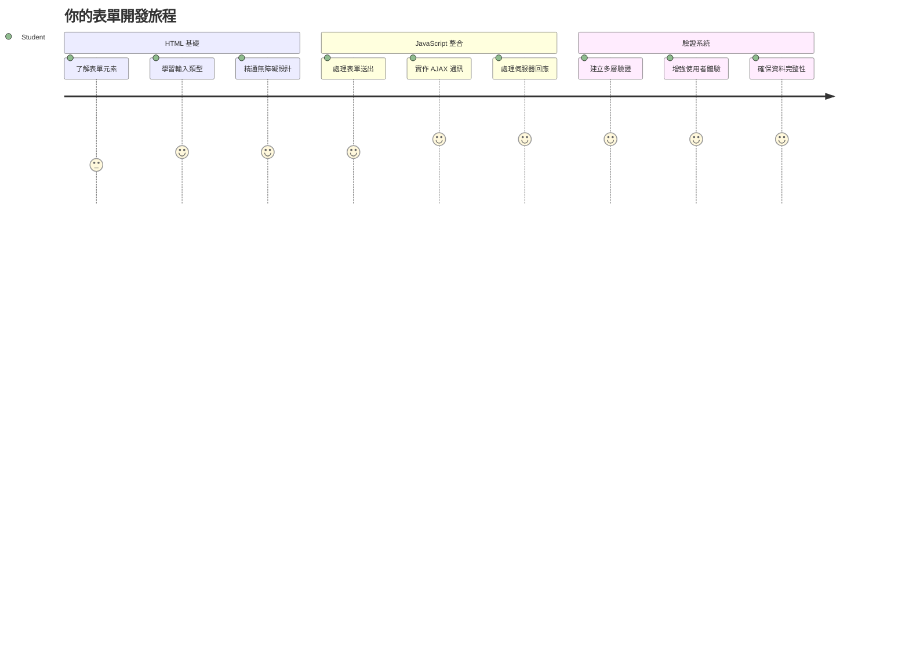
## 課前測驗

[課前測驗](https://ff-quizzes.netlify.app/web/quiz/43)

曾經填寫過線上表單，卻被拒絕你的電子郵件格式？或者點擊提交時，所有資料都消失了？這些令人沮喪的經驗我們都遇過。

表單是使用者與應用程式功能之間的橋樑。就像空中交通管制員小心翼翼指引飛機安全抵達目的地，精心設計的表單提供明確的回饋並防止代價高昂的錯誤。反之，糟糕的表單會像忙碌機場中的誤傳一樣，讓使用者迅速離開。

在本課中，我們將把你的靜態銀行應用程式變成交互式應用程式。你將學會如何建立表單來驗證使用者輸入、與伺服器通訊並提供有用的回饋。可以想像成建立一個控制介面，讓使用者操作你的應用功能。

課程結束時，你將擁有完整的登入與註冊系統，並內建驗證，引導使用者走向成功，而非挫折。

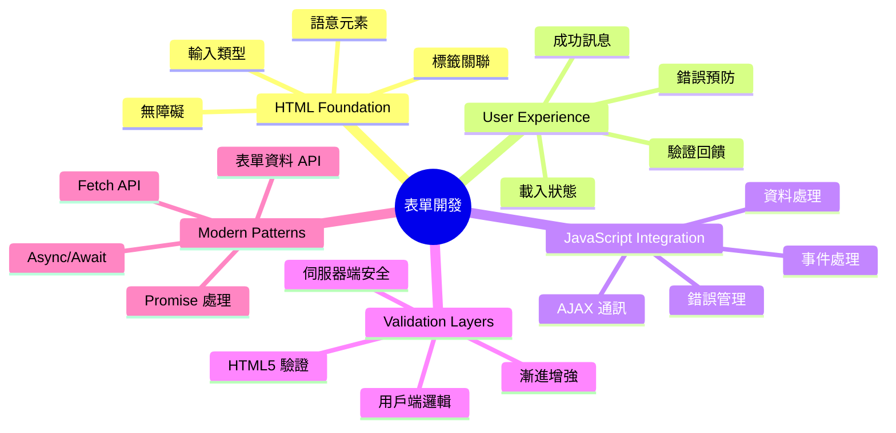
## 先決條件

在開始建立表單前，先確定你的環境已正確設置。本課從先前課程中斷的地方繼續，若你跳過了中間步驟，建議先回頭完成基本設定。

### 必備設定

| 元件 | 狀態 | 說明 |
|-----------|--------|-------------|
| [HTML 模板](../1-template-route/README.md) | ✅ 必需 | 你的基本銀行應用架構 |
| [Node.js](https://nodejs.org) | ✅ 必需 | 用於伺服器的 JavaScript 執行環境 |
| [銀行 API 伺服器](../api/README.md) | ✅ 必需 | 資料儲存的後端服務 |

> 💡 **開發小提示**：你將同時運行兩個獨立的伺服器 — 一個為前端銀行應用，一個為後端 API 伺服器。這模擬了真實世界中前後端獨立運作的開發環境。

### 伺服器設定

**您的開發環境包含：**
- **前端伺服器**：提供銀行應用服務（通常埠號 `3000`）
- **後端 API 伺服器**：處理資料存取（埠號 `5000`）
- **兩個伺服器**可同時運作，互不衝突

**測試你的 API 連線：**
```bash
curl http://localhost:5000/api
# 預期回應：「銀行 API v1.0.0」
```

**如果看到 API 版本回應，代表環境已準備好！**

---

## 認識 HTML 表單與控制項

HTML 表單是使用者與你的網頁應用互動的方式。想像它們是 19 世紀連接遙遠地方的電報系統 —— 它們是使用者意圖與應用回應之間的通訊協定。設計得當時，表單能捕捉錯誤、引導輸入格式並提供有用建議。

現代表單遠比單純輸入文字更為進階。HTML5 引入專用的輸入類型，能自動處理郵件驗證、數字格式及日期選擇等，增進無障礙與行動裝置體驗。

### 基本必備表單元素

**每個表單必備的組件：**

```html
<!-- Basic form structure -->
<form id="userForm" method="POST">
  <label for="username">Username</label>
  <input id="username" name="username" type="text" required>
  
  <button type="submit">Submit</button>
</form>
```

**此段程式碼的作用：**
- **建立**一個帶唯一識別碼的表單容器
- **指定**資料提交的 HTTP 方法
- **為**輸入欄位關聯標籤以增進無障礙
- **定義**提交按鈕來處理表單動作

### 現代輸入類型與屬性

| 輸入類型 | 目的 | 範例用法 |
|------------|---------|---------------|
| `text` | 一般文字輸入 | `<input type="text" name="username">` |
| `email` | 電子郵件驗證 | `<input type="email" name="email">` |
| `password` | 隱藏文字輸入 | `<input type="password" name="password">` |
| `number` | 數字輸入 | `<input type="number" name="balance" min="0">` |
| `tel` | 電話號碼 | `<input type="tel" name="phone">` |

> 💡 **HTML5 現代優勢**：利用專門的輸入類型，會自動啟用驗證、適合行動裝置的鍵盤，並增強無障礙體驗，無須額外 JavaScript！

### 按鈕類型與行為

```html
<!-- Different button behaviors -->
<button type="submit">Save Data</button>     <!-- Submits the form -->
<button type="reset">Clear Form</button>    <!-- Resets all fields -->
<button type="button">Custom Action</button> <!-- No default behavior -->
```

**各種按鈕類型的功能：**
- **提交按鈕**：觸發表單送出並將資料發送到指定端點
- **重置按鈕**：將所有欄位恢復初始狀態
- **一般按鈕**：無預設行為，需要自訂 JavaScript 以實現功能

> ⚠️ **重要提醒**：`<input>` 元素是自閉合標籤，不需要閉合標籤。現代寫法是 `<input>` 不用斜線。

### 建立你的登入表單

現在建立一個實務的登入表單，示範現代 HTML 表單最佳實務。從基礎結構開始，並逐步加強無障礙功能與驗證。

```html
<template id="login">
  <h1>Bank App</h1>
  <section>
    <h2>Login</h2>
    <form id="loginForm" novalidate>
      <div class="form-group">
        <label for="username">Username</label>
        <input id="username" name="user" type="text" required 
               autocomplete="username" placeholder="Enter your username">
      </div>
      <button type="submit">Login</button>
    </form>
  </section>
</template>
```

**此段程式碼的解析：**
- **結構化**表單使用語意化 HTML5 元素
- **群組**相關元素，使用具意義的 `div` 容器與 class
- **關聯**標籤與輸入元件，利用 `for` 與 `id` 屬性
- **包含**現代屬性如 `autocomplete` 與 `placeholder` 以提升使用體驗
- **加入**`novalidate` 以將驗證交由 JavaScript 控制，而非瀏覽器預設

### 適當標籤的威力

**為何標籤對現代網頁開發至關重要：**

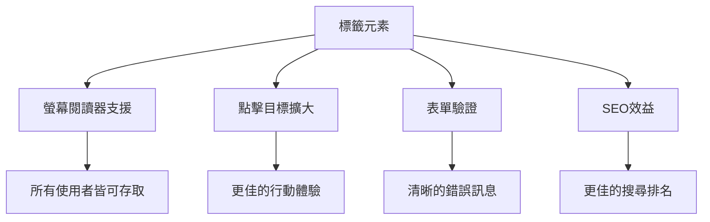
**適當標籤帶來的效果：**
- **讓**螢幕閱讀器清楚朗讀表單欄位
- **擴大**點擊範圍（點擊標籤會聚焦輸入框）
- **改善**行動裝置可點擊範圍，友善觸控操作
- **支持**表單驗證與有意義的錯誤訊息
- **增強**SEO，賦予表單元素語義

> 🎯 **無障礙目標**：每個輸入欄位都應有標籤關聯。此簡單做法讓所有使用者（包含障礙者）均能使用你的表單，並提升整體體驗。

### 建立註冊表單

註冊表單需更多詳細資料，用以建立完整用戶帳號。讓我們利用現代 HTML5 特性與增強無障礙設計來打造它。

```html
<hr/>
<h2>Register</h2>
<form id="registerForm" novalidate>
  <div class="form-group">
    <label for="user">Username</label>
    <input id="user" name="user" type="text" required 
           autocomplete="username" placeholder="Choose a username">
  </div>
  
  <div class="form-group">
    <label for="currency">Currency</label>
    <input id="currency" name="currency" type="text" value="$" 
           required maxlength="3" placeholder="USD, EUR, etc.">
  </div>
  
  <div class="form-group">
    <label for="description">Account Description</label>
    <input id="description" name="description" type="text" 
           maxlength="100" placeholder="Personal savings, checking, etc.">
  </div>
  
  <div class="form-group">
    <label for="balance">Starting Balance</label>
    <input id="balance" name="balance" type="number" value="0" 
           min="0" step="0.01" placeholder="0.00">
  </div>
  
  <button type="submit">Create Account</button>
</form>
```

**前述程式碼完成了：**
- **將**每個欄位用容器 div 包裹，方便排版與樣式
- **加入**恰當的 `autocomplete` 屬性，支援瀏覽器自動填寫
- **提供**有幫助的佔位文字，引導用戶輸入
- **設定**合理的預設值，使用 `value` 屬性
- **應用**驗證屬性如 `required`、`maxlength` 與 `min`
- **在**餘額欄位用 `type="number"` 且允許小數

### 探索輸入類型與行為

**現代輸入類型具備多種強化功能：**

| 特性 | 優勢 | 範例 |
|---------|---------|----------|
| `type="number"` | 行動裝置數字鍵盤 | 減少餘額輸入困難 |
| `step="0.01"` | 小數精度控制 | 支援金額分角輸入 |
| `autocomplete` | 瀏覽器自動填入 | 縮短填表時間 |
| `placeholder` | 上下文提示 | 引導使用者預期 |

> 🎯 **無障礙挑戰**：試著全用鍵盤操作表單！用 `Tab` 鍵切換欄位，`Space` 選取勾選框，`Enter` 提交表單。這能幫助你理解螢幕閱讀器使用者與鍵盤使用者如何互動。

### 🔄 **教學重點確認**
**理解表單基礎**：在實作 JavaScript 前，請確保你了解：
- ✅ 語意化 HTML 如何打造無障礙表單結構
- ✅ 為什麼輸入類型與手機鍵盤和驗證息息相關
- ✅ 標籤與表單控制元件的關係
- ✅ 表單屬性如何影響瀏覽器預設行為

**快速自我檢測**：若未使用 JavaScript，直接提交表單發生什麼事？
*答案：瀏覽器執行預設提交，通常會跳轉至 action URL*

**HTML5 表單好處**：現代表單具備：
- **內建驗證**：自動檢測郵件與數字格式
- **行動優化**：根據輸入類型帶出適切鍵盤
- **無障礙設計**：支援螢幕閱讀器與鍵盤導航
- **漸進增強**：即使無 JavaScript 也能正常運作

## 認識表單提交方法

當使用者填寫表單並按下提交，資料需要被送往某個地方 —— 通常是伺服器以便儲存。提交方法有幾種，知道何時用哪種能避免後面麻煩。

來看看點擊提交後到底發生什麼。

### 表單預設行為

先觀察基本的表單提交行為：

**測試你目前的表單：**
1. 點擊表單內的 *註冊* 按鈕
2. 觀察瀏覽器網址列變化
3. 注意頁面重載且資料顯示在 URL 中


### HTTP 方法比較

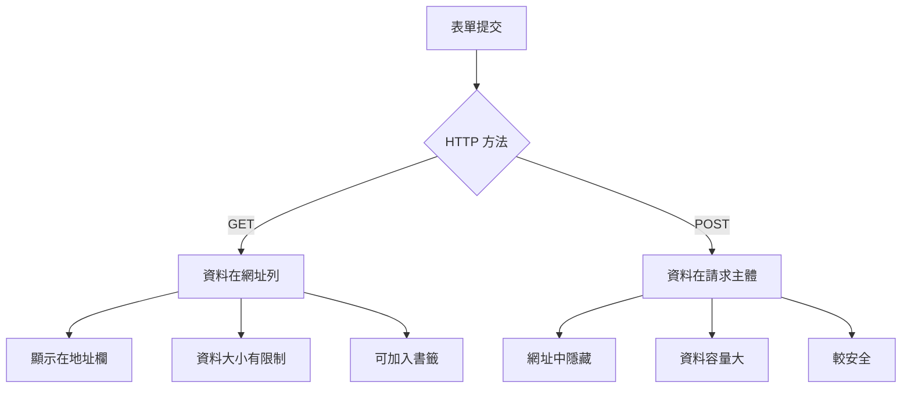
**瞭解差異：**

| 方法 | 使用狀況 | 資料所在 | 安全性 | 大小限制 |
|--------|----------|---------------|----------------|-------------|
| `GET` | 搜尋查詢、篩選 | URL 參數 | 較低（明文可見） | 約 2000 字元 |
| `POST` | 用戶帳號、敏感資料 | 請求本文 | 較高（隱藏） | 幾乎無限制 |

**基本差異理解：**
- **GET**：把表單資料附加在 URL 查詢字串（適合檢索操作）
- **POST**：將資料包在請求本文（必須用於敏感資料）
- **GET 限制**：容量受限、資料可見、瀏覽器歷史可追蹤
- **POST 優點**：資料容量大、隱私較高、支援檔案上傳

> 💡 **最佳實務**：用 `GET` 處理搜尋與篩選（取用資料），`POST` 用於用戶註冊、登入與建立資料。

### 設定表單提交

設定註冊表單，使其正確使用 POST 與後端 API 通訊：

```html
<form id="registerForm" action="//localhost:5000/api/accounts" 
      method="POST" novalidate>
```

**此設定達成：**
- **導向**表單資料送往 API 端點
- **使用** POST 方法以確保傳輸安全
- **加入** `novalidate` 以由 JavaScript 控制驗證

### 測試表單提交

**依步驟測試表單：**
1. **填寫**註冊表單資料
2. **點擊**「建立帳號」按鈕
3. **觀察**伺服器回應在瀏覽器中

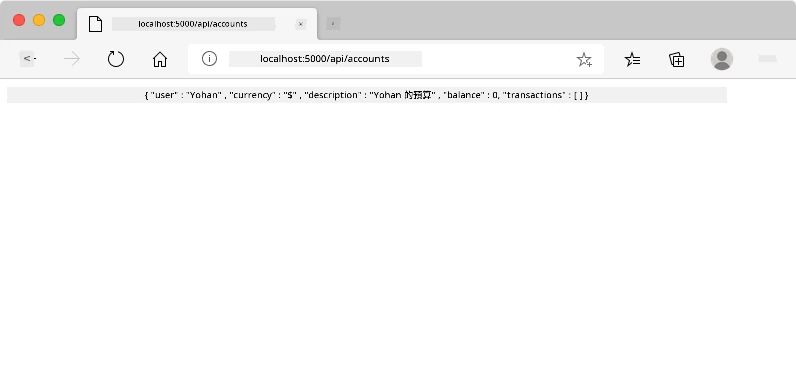

**你應該看到：**
- **瀏覽器導向**至 API 端點網址
- **JSON 回應**包含剛創建的帳號資料
- **伺服器確認**帳號已成功建立

> 🧪 **實驗時間**：嘗試使用相同使用者名稱再次註冊，會收到什麼回應？這可幫助理解伺服器如何處理重複資料與錯誤狀況。

### 理解 JSON 回應

**伺服器成功處理表單時：**
```json
{
  "user": "john_doe",
  "currency": "$",
  "description": "Personal savings",
  "balance": 100,
  "id": "unique_account_id"
}
```

**此回應說明：**
- **建立**一個新帳號，帶有你輸入的資料
- **分配**唯一識別碼以供後續識別
- **回傳**所有帳號資訊，以便驗證
- **表示**資料已成功存入資料庫

## 使用 JavaScript 的現代表單處理

傳統表單提交會導致整頁重新載入，類似早期太空任務需整組系統重置來校正航向。此方式破壞使用體驗，並遺失應用程式狀態。

JavaScript 表單處理則像現代太空船的連續輔助導航系統 — 即時修正且不喪失導航上下文。我們可以攔截表單提交，立即提供回饋、優雅處理錯誤，根據伺服器回應更新介面，並維持使用者在應用程式中的位置。

### 為何避免頁面重載？

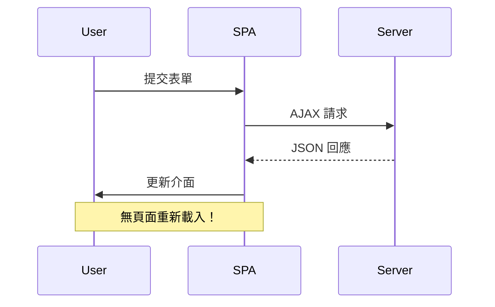
**JavaScript 表單處理優勢：**
- **維持**應用程式狀態與使用者上下文
- **即時**提供回饋與載入指示
- **實現**動態錯誤處理與驗證
- **打造**流暢如應用程式的使用體驗
- **允許**根據伺服器回應執行條件邏輯

### 從傳統到現代表單的轉變

**傳統方法面臨的挑戰：**
- **將**使用者導離你的應用程式
- **遺失**目前應用狀態與上下文
- **為簡單操作**需整頁刷新
- **難以**控制使用者回饋

**現代 JavaScript 方法優勢：**
- **讓**使用者留在應用程式內
- **保留**所有應用狀態與資料
- **支援**即時驗證與回饋
- **促進**漸進增強與無障礙

### 實作 JavaScript 表單處理

讓我們用現代 JavaScript 事件監聽取代傳統表單提交：

```html
<!-- Remove the action attribute and add event handling -->
<form id="registerForm" method="POST" novalidate>
```

**將註冊邏輯加入 `app.js` 檔案：**

```javascript
// 現代事件驅動的表單處理
function register() {
  const registerForm = document.getElementById('registerForm');
  const formData = new FormData(registerForm);
  const data = Object.fromEntries(formData);
  const jsonData = JSON.stringify(data);
  
  console.log('Form data prepared:', data);
}

// 頁面載入時附加事件監聽器
document.addEventListener('DOMContentLoaded', () => {
  const registerForm = document.getElementById('registerForm');
  registerForm.addEventListener('submit', (event) => {
    event.preventDefault(); // 防止預設的表單提交
    register();
  });
});
```

**此處程式碼說明：**
- **阻止**預設表單提交行為 `event.preventDefault()`
- **取得**表單元素，使用現代 DOM 選取方式
- **擷取**表單資料，運用強大的 `FormData` API
- **將** FormData 轉為純物件，利用 `Object.fromEntries()`
- **序列化**資料為 JSON 字串，方便與伺服器通訊
- **紀錄**處理後資料以便除錯與驗證

### 了解 FormData API

**FormData API 提供強大的表單處理能力：**
```javascript
// FormData 擷取範例
const formData = new FormData(registerForm);

// FormData 自動擷取：
// {
//   "user": "john_doe",
//   "currency": "$",
//   "description": "個人帳戶",
//   "balance": "100"
// }
```

**FormData API 優勢：**
- **全面收集**：捕獲所有表單元素，包括文字、檔案及複雜輸入
- **型別感知**：自動處理不同輸入類型，無需自訂程式碼
- **效率**：透過單一 API 呼叫消除手動欄位收集
- **適應性**：隨著表單結構演進保持功能不變

### 建立與伺服器通訊函式

現在讓我們用現代 JavaScript 範式建立與 API 伺服器穩健通訊的函式：

```javascript
async function createAccount(account) {
  try {
    const response = await fetch('//localhost:5000/api/accounts', {
      method: 'POST',
      headers: { 
        'Content-Type': 'application/json',
        'Accept': 'application/json'
      },
      body: account
    });
    
    // 檢查回應是否成功
    if (!response.ok) {
      throw new Error(`HTTP error! status: ${response.status}`);
    }
    
    return await response.json();
  } catch (error) {
    console.error('Account creation failed:', error);
    return { error: error.message || 'Network error occurred' };
  }
}
```

**瞭解非同步 JavaScript：**

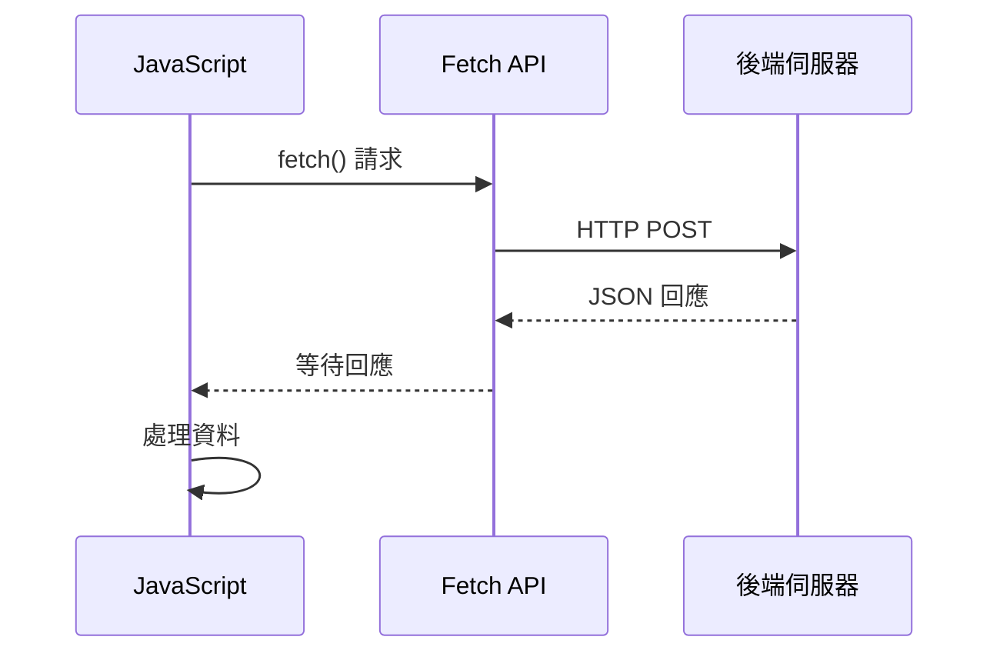
**此現代實作達成：**
- **使用** `async/await` 編寫可讀的非同步程式碼
- **包含** 適當的錯誤處理（try/catch 區塊）
- **檢查** 回應狀態後再處理資料
- **設定** 適合 JSON 通訊的標頭
- **提供** 詳盡錯誤訊息以利除錯
- **回傳** 成功與錯誤案例的一致資料結構

### 現代 Fetch API 的力量

**Fetch API 相較舊方法的優勢：**

| 功能 | 優點 | 實作方式 |
|---------|---------|----------------|
| 基於 Promise | 清晰的非同步程式碼 | `await fetch()` |
| 請求自訂 | 完整 HTTP 控制 | 標頭、方法、主體 |
| 回應處理 | 靈活的資料解析 | `.json()`, `.text()`, `.blob()` |
| 錯誤處理 | 全面錯誤攔截 | Try/catch 區塊 |

> 🎥 **進一步學習**：[Async/Await 教學](https://youtube.com/watch?v=YwmlRkrxvkk) — 理解現代網頁開發的非同步 JavaScript 模式。

**伺服器通訊核心觀念：**
- **Async 函式** 允許暫停執行以等待伺服器回應
- **Await 關鍵字** 使非同步程式碼讀起來像同步程式碼
- **Fetch API** 提供現代基於 Promise 的 HTTP 請求
- **錯誤處理** 確保應用程式對網路問題優雅反應

### 完成註冊函式

把所有內容整合成完整的生產等級註冊函式：

```javascript
async function register() {
  const registerForm = document.getElementById('registerForm');
  const submitButton = registerForm.querySelector('button[type="submit"]');
  
  try {
    // 顯示載入狀態
    submitButton.disabled = true;
    submitButton.textContent = 'Creating Account...';
    
    // 處理表單資料
    const formData = new FormData(registerForm);
    const jsonData = JSON.stringify(Object.fromEntries(formData));
    
    // 傳送到伺服器
    const result = await createAccount(jsonData);
    
    if (result.error) {
      console.error('Registration failed:', result.error);
      alert(`Registration failed: ${result.error}`);
      return;
    }
    
    console.log('Account created successfully!', result);
    alert(`Welcome, ${result.user}! Your account has been created.`);
    
    // 成功註冊後重置表單
    registerForm.reset();
    
  } catch (error) {
    console.error('Unexpected error:', error);
    alert('An unexpected error occurred. Please try again.');
  } finally {
    // 還原按鈕狀態
    submitButton.disabled = false;
    submitButton.textContent = 'Create Account';
  }
}
```

**此加強版實作包含：**
- **提供** 表單提交期間的視覺反饋
- **停用** 提交按鈕以防止重複提交
- **優雅處理** 預期及非預期錯誤
- **顯示** 使用者友善的成功與錯誤訊息
- **成功後** 重設表單
- **不論結果** 恢復 UI 狀態

### 測試你的實作

**打開瀏覽器開發工具測試註冊功能：**

1. **開啟** 瀏覽器控制台（F12 → Console 頁籤）
2. **填寫** 註冊表單
3. **點擊**「建立帳號」
4. **觀察** 控制台訊息與使用者反饋

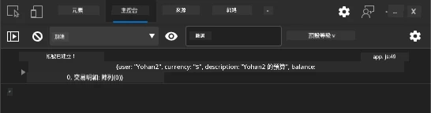

**你應該會看到：**
- **提交按鈕** 顯示載入狀態
- **控制台日誌** 顯示流程詳細資訊
- **成功訊息** 在帳號建立成功時出現
- **表單自動重置** 在成功提交後

> 🔒 **安全提醒**：目前資料是透過 HTTP 傳輸，生產環境缺乏安全保障。實務上應始終使用 HTTPS 加密傳輸。詳見 [HTTPS 安全性](https://en.wikipedia.org/wiki/HTTPS) 及其重要性。

### 🔄 **教學重點檢核**
**現代 JavaScript 整合**：檢驗非同步表單處理理解度：
- ✅ `event.preventDefault()` 如何改變表單預設行為？
- ✅ 為何 FormData API 比手動欄位收集更有效率？
- ✅ async/await 模式如何改善程式碼可讀性？
- ✅ 錯誤處理在使用者體驗中扮演什麼角色？

**系統架構**：你的表單處理展示：
- **事件驅動程式設計**：表單回應使用者操作不重載頁面
- **非同步通訊**：伺服器請求不阻塞介面
- **錯誤處理**：網路故障時優雅降級
- **狀態管理**：UI 更新反映伺服器回應
- **漸進式增強**：基礎功能完整，JavaScript 強化體驗

**專業模式**：已實作：
- **單一職責**：函式明確目的
- **錯誤邊界**：try/catch 防止崩潰
- **用戶回饋**：載入狀態與成功/錯誤訊息
- **資料轉換**：FormData 轉 JSON 傳送伺服器

## 全面表單驗證

表單驗證可避免用戶提交後才發現錯誤的挫折。就像國際太空站的多重冗餘系統，良好驗證採用多層安全檢查。

最佳策略結合瀏覽器層的即時驗證、JavaScript 提升使用體驗，以及伺服器端的安全與資料完整性檢驗。這種冗餘確保用戶滿意與系統保護。

### 了解驗證層級

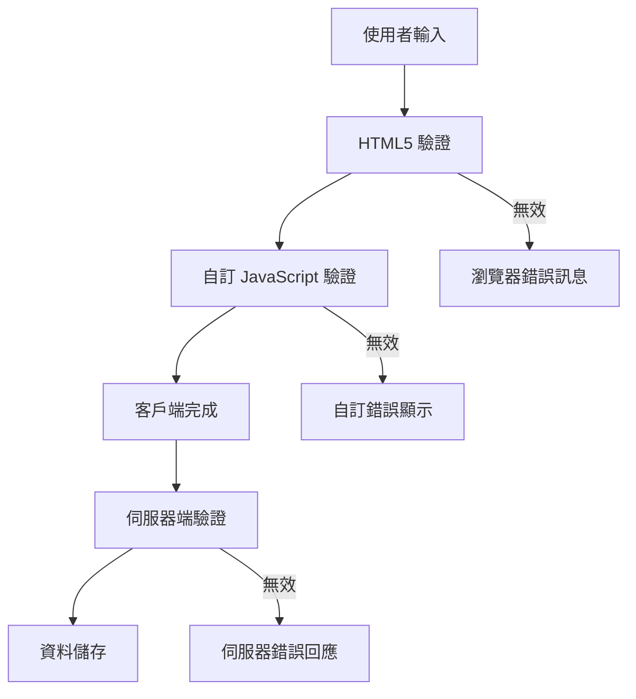
**多層驗證策略：**
- **HTML5 驗證**：即時瀏覽器檢查
- **JavaScript 驗證**：自訂邏輯與優化體驗
- **伺服器端驗證**：最終安全與資料完整度檢查
- **漸進式增強**：JavaScript 禁用時仍運作

### HTML5 驗證屬性

**現代驗證工具一覽：**

| 屬性 | 目的 | 範例用法 | 瀏覽器行為 |
|-----------|---------|---------------|------------------|
| `required` | 必填欄位 | `<input required>` | 防止空白提交 |
| `minlength`/`maxlength` | 文字長度限制 | `<input maxlength="20">` | 強制字元數限制 |
| `min`/`max` | 數值範圍 | `<input min="0" max="1000">` | 驗證數字邊界 |
| `pattern` | 自訂正規表達式規則 | `<input pattern="[A-Za-z]+">` | 符合特定格式 |
| `type` | 資料類型驗證 | `<input type="email">` | 格式專屬驗證 |

### CSS 驗證樣式

**創造驗證狀態的視覺反饋：**

```css
/* Valid input styling */
input:valid {
  border-color: #28a745;
  background-color: #f8fff9;
}

/* Invalid input styling */
input:invalid {
  border-color: #dc3545;
  background-color: #fff5f5;
}

/* Focus states for better accessibility */
input:focus:valid {
  box-shadow: 0 0 0 0.2rem rgba(40, 167, 69, 0.25);
}

input:focus:invalid {
  box-shadow: 0 0 0 0.2rem rgba(220, 53, 69, 0.25);
}
```

**這些視覺提示達成：**
- **綠色邊框**：表示驗證成功，猶如任務管制中心的綠燈
- **紅色邊框**：提示需注意的驗證錯誤
- **焦點高亮**：明確顯示目前輸入位置
- **一致風格**：建立用戶易學的介面模式

> 💡 **技巧提示**：使用 `:valid` 和 `:invalid` CSS 偽類提供即時視覺反饋，讓介面回應使用者輸入。

### 實現全面驗證

讓註冊表單增強為強大驗證，提供優秀的使用者體驗與資料品質：

```html
<form id="registerForm" method="POST" novalidate>
  <div class="form-group">
    <label for="user">Username <span class="required">*</span></label>
    <input id="user" name="user" type="text" required 
           minlength="3" maxlength="20" 
           pattern="[a-zA-Z0-9_]+" 
           autocomplete="username"
           title="Username must be 3-20 characters, letters, numbers, and underscores only">
    <small class="form-text">Choose a unique username (3-20 characters)</small>
  </div>
  
  <div class="form-group">
    <label for="currency">Currency <span class="required">*</span></label>
    <input id="currency" name="currency" type="text" required 
           value="$" maxlength="3" 
           pattern="[A-Z$€£¥₹]+" 
           title="Enter a valid currency symbol or code">
    <small class="form-text">Currency symbol (e.g., $, €, £)</small>
  </div>
  
  <div class="form-group">
    <label for="description">Account Description</label>
    <input id="description" name="description" type="text" 
           maxlength="100" 
           placeholder="Personal savings, checking, etc.">
    <small class="form-text">Optional description (up to 100 characters)</small>
  </div>
  
  <div class="form-group">
    <label for="balance">Starting Balance</label>
    <input id="balance" name="balance" type="number" 
           value="0" min="0" step="0.01" 
           title="Enter a positive number for your starting balance">
    <small class="form-text">Initial account balance (minimum $0.00)</small>
  </div>
  
  <button type="submit">Create Account</button>
</form>
```

**瞭解強化驗證內容：**
- **結合** 必填欄位標示與說明文字
- **加入** 格式驗證的 `pattern` 屬性
- **提供** 輔助的 `title` 屬性作為可及性與工具提示
- **新增** 使用者輸入指引的輔助文字
- **採用** 語意化 HTML 結構改善可及性

### 高階驗證規則

**各驗證規則作用解析：**

| 欄位 | 驗證規則 | 用戶效益 |
|-------|------------------|--------------|
| 使用者名稱 | `required`, `minlength="3"`, `maxlength="20"`, `pattern="[a-zA-Z0-9_]+"` | 確保有效且唯一識別 |
| 貨幣 | `required`, `maxlength="3"`, `pattern="[A-Z$€£¥₹]+"` | 接受常見貨幣符號 |
| 餘額 | `min="0"`, `step="0.01"`, `type="number"` | 避免負數餘額 |
| 描述 | `maxlength="100"` | 合理長度限制 |

### 測試驗證行為

**試試這些驗證情境：**
1. **空白必填欄位** 嘗試提交
2. **輸入少於 3 字元的使用者名稱**
3. **使用者名稱欄位試輸入特殊字元**
4. **輸入負數餘額**


**你會看到：**
- **瀏覽器顯示** 原生驗證訊息
- **樣式根據** `:valid` 與 `:invalid` 狀態變化
- **表單阻擋提交** 直至驗證通過
- **自動聚焦** 於第一個錯誤欄位

### 用戶端與伺服器端驗證

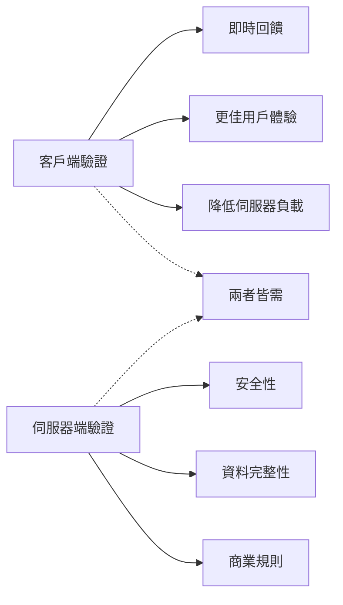
**為何兩層驗證都必須：**
- **用戶端驗證**：即時回饋，改善體驗
- **伺服器端驗證**：確保安全與複雜商業規則
- **合併策略**：打造可靠、友善且安全應用
- **漸進增強**：JavaScript 禁用時仍正常運作

> 🛡️ **安全提醒**：切勿只信任用戶端驗證！惡意用戶能繞過用戶端檢查，必須以伺服器端驗證確保安全與資料完整。

### ⚡ **接下來 5 分鐘的小任務**
- [ ] 用無效資料測試表單，觀察驗證訊息
- [ ] 禁用 JavaScript 後嘗試提交，見識 HTML5 驗證
- [ ] 開啟開發者工具檢視送往伺服器的表單資料
- [ ] 嘗試不同輸入類型，觀察手機鍵盤變化

### 🎯 **這一小時你可以達成**
- [ ] 完成課後測驗並理解表單處理概念
- [ ] 實作全面驗證挑戰，提供即時回饋
- [ ] 加入 CSS 樣式，打造專業表單外觀
- [ ] 處理重複用戶名及伺服器錯誤的錯誤處理
- [ ] 新增密碼確認欄位與匹配驗證

### 📅 **你的週長表單精通之路**
- [ ] 完成具有進階表單功能的完整銀行應用
- [ ] 實作個人檔案圖片或文件的檔案上傳功能
- [ ] 新增帶進度指示與狀態管理的多步驟表單
- [ ] 建立適應用戶選擇的動態表單
- [ ] 實作表單自動儲存與回復，提升使用體驗
- [ ] 新增進階驗證如電子郵件驗證與電話格式化

### 🌟 **你的月長前端精通之路**
- [ ] 建構具條件邏輯與工作流程的複雜表單應用
- [ ] 學習表單函式庫與框架以加速開發
- [ ] 精通無障礙指導方針與包容性設計原則
- [ ] 實作國際化與在地化支援全球表單
- [ ] 建立可重用的表單元件庫與設計系統
- [ ] 貢獻開源表單專案並分享最佳實踐

## 🎯 你的表單開發精通時間軸

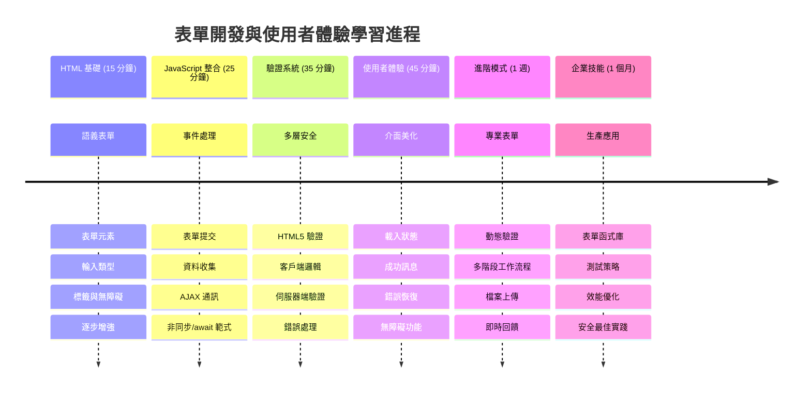
### 🛠️ 你的表單開發工具總結

完成本課後，你已掌握：
- **HTML5 表單**：語義結構、輸入類型與可及性功能
- **JavaScript 表單處理**：事件管理、資料收集與 AJAX 通訊
- **驗證架構**：多層驗證確保安全與體驗
- **非同步程式設計**：現代 Fetch API 與 async/await 模式
- **錯誤管理**：全面錯誤處理與用戶回饋系統
- **使用者體驗設計**：載入狀態、成功訊息與錯誤回復
- **漸進式增強**：跨瀏覽器與能力完整表單

**實務應用**：你的表單技能適用於：
- **電子商務應用**：結帳流程、帳戶註冊與付款表單
- **企業軟體**：資料輸入系統、報表介面與工作流程工具
- **內容管理**：發佈平台、用戶產生內容與管理介面
- **金融應用**：銀行介面、投資平台與交易系統
- **醫療系統**：病人入口網站、預約排程與病歷表單
- **教育平台**：課程註冊、評量工具與學習管理

**專業技能提升**：你現在能：
- **設計** 適用於所有用戶（含障礙者）的可及表單
- **實作** 防止資料損毀及安全漏洞的安全表單驗證
- **創建** 提供明確回饋與指引的響應式使用介面
- **偵錯** 利用瀏覽器開發工具與網路分析調試複雜交互
- **優化** 透過有效資料處理與驗證策略提升性能

**前端開發概念掌握**：
- **事件驅動架構**：使用者互動處理與回應系統
- **非同步程式設計**：非阻塞伺服器通訊與錯誤處理
- **資料驗證**：用戶端及伺服器端安全與完整性檢查
- **使用者體驗設計**：引導使用者成功的直覺介面
- **無障礙工程**：滿足多樣用戶需求的包容性設計

**下一階段**：你已準備好探索進階表單函式庫，實作複雜驗證規則或打造企業級資料收集系統！

🌟 **成就解鎖**：你已建立完整表單處理系統，包含專業驗證、錯誤處理與使用者體驗模式！

---


---

## GitHub Copilot Agent 挑戰 🚀

使用 Agent 模式完成以下挑戰：

**說明：** 加強註冊表單的全面用戶端驗證與使用者反饋。此挑戰將幫助你練習表單驗證、錯誤處理，以及藉由互動式反饋提升使用者體驗。
**提示：** 為註冊表單建立完整的表單驗證系統，包含：1) 使用者輸入時每個欄位即時驗證回饋，2) 自訂驗證訊息顯示於每個輸入欄位下方，3) 密碼確認欄位的比對驗證，4) 視覺指示（例如有效欄位的綠色勾勾與無效欄位的紅色警告），5) 當所有驗證通過時才會啟用提交按鈕。使用 HTML5 驗證屬性、CSS 進行驗證狀態的樣式設計，以及 JavaScript 實現互動行為。

在此了解更多關於 [agent mode](https://code.visualstudio.com/blogs/2025/02/24/introducing-copilot-agent-mode)。

## 🚀 挑戰

如果使用者已存在，在 HTML 中顯示錯誤訊息。

下面是經過一些樣式設計後，登入頁面的範例：

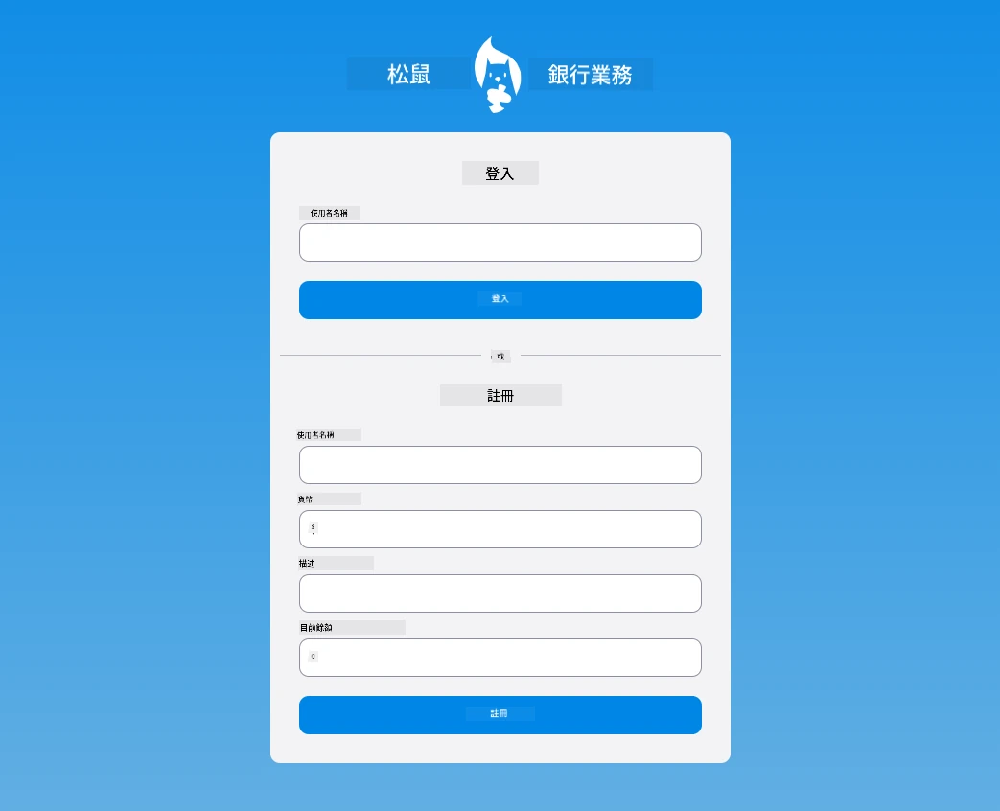

## 課後小考

[課後小考](https://ff-quizzes.netlify.app/web/quiz/44)

## 複習與自學

開發者在表單建置上已有非常多創意，尤其是在驗證策略部分。可以透過瀏覽 [CodePen](https://codepen.com) 學習各種表單流程，找找有趣且富啟發性的表單範例。

## 作業

[替你的銀行應用程式設計樣式](assignment.md)

---

<!-- CO-OP TRANSLATOR DISCLAIMER START -->
**免責聲明**：  
本文件係使用 AI 翻譯服務 [Co-op Translator](https://github.com/Azure/co-op-translator) 所翻譯。儘管我們致力於準確性，請注意機器翻譯可能包含錯誤或不準確之處。原始文件的母語版本應視為權威來源。對於重要資訊，建議採用專業人工翻譯。對因使用本翻譯所引起的任何誤解或錯誤詮釋，本公司概不負責。
<!-- CO-OP TRANSLATOR DISCLAIMER END -->