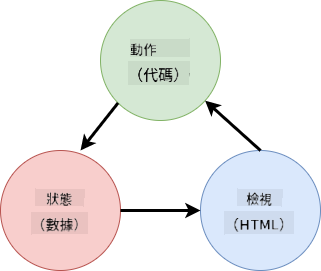

<!--
CO_OP_TRANSLATOR_METADATA:
{
  "original_hash": "5d2efabbc8f94d89f4317ee8646c3ce9",
  "translation_date": "2025-08-29T15:17:01+00:00",
  "source_file": "7-bank-project/4-state-management/README.md",
  "language_code": "tw"
}
-->
# 建立銀行應用程式第 4 部分：狀態管理的概念

## 課前測驗

[課前測驗](https://ff-quizzes.netlify.app/web/quiz/47)

### 介紹

隨著網頁應用程式的規模增長，追蹤所有數據流變得越來越具有挑戰性。哪些程式碼獲取了數據，哪些頁面使用了數據，數據需要在何時何地更新……很容易導致程式碼變得混亂且難以維護。當需要在應用程式的不同頁面之間共享數據時（例如用戶數據），這種情況尤其明顯。*狀態管理* 的概念一直存在於各類程式中，但隨著網頁應用程式的複雜性不斷增加，狀態管理已成為開發過程中的關鍵考量點。

在這最後一部分，我們將重新審視我們建立的應用程式，重新思考如何管理狀態，以支持在任何時候刷新瀏覽器，並在用戶會話之間持續保存數據。

### 前置條件

您需要完成本課程中網頁應用程式的[數據獲取](../3-data/README.md)部分。此外，您還需要安裝 [Node.js](https://nodejs.org) 並[本地運行伺服器 API](../api/README.md)，以便管理帳戶數據。

您可以通過在終端中執行以下命令來測試伺服器是否正常運行：

```sh
curl http://localhost:5000/api
# -> should return "Bank API v1.0.0" as a result
```

---

## 重新思考狀態管理

在[上一課](../3-data/README.md)中，我們在應用程式中引入了一個基本的狀態概念，即全域變數 `account`，它包含當前登錄用戶的銀行數據。然而，我們目前的實現存在一些缺陷。嘗試在儀表板頁面刷新頁面。會發生什麼？

目前的程式碼存在三個問題：

- 狀態未被持久化，刷新瀏覽器會將您帶回登錄頁面。
- 有多個函數修改狀態。隨著應用程式的增長，這可能使得追蹤更改變得困難，並且很容易忘記更新某些部分。
- 狀態未被清理，因此當您點擊 *登出* 時，即使您已經在登錄頁面，帳戶數據仍然存在。

我們可以逐一更新程式碼來解決這些問題，但這會導致程式碼重複，並使應用程式更加複雜且難以維護。或者，我們可以暫停幾分鐘，重新思考我們的策略。

> 我們真正想要解決的問題是什麼？

[狀態管理](https://en.wikipedia.org/wiki/State_management) 的核心在於找到一種良好的方法來解決以下兩個特定問題：

- 如何讓應用程式中的數據流保持清晰易懂？
- 如何確保狀態數據始終與用戶界面保持同步（反之亦然）？

一旦解決了這些問題，您可能已經解決了其他問題，或者使它們變得更容易解決。解決這些問題有許多可能的方法，但我們將採用一種常見的解決方案，即**集中化數據及其更改方式**。數據流將如下所示：



> 我們在此不會涵蓋數據自動觸發視圖更新的部分，因為這涉及到更高級的[反應式編程](https://en.wikipedia.org/wiki/Reactive_programming)概念。如果您有興趣深入研究，這是一個不錯的後續主題。

✅ 市面上有許多不同方法的狀態管理庫，[Redux](https://redux.js.org) 是一個流行的選擇。了解其使用的概念和模式通常是學習如何解決大型網頁應用程式中潛在問題的好方法。

### 任務

我們將從一些重構開始。將 `account` 聲明替換為：

```js
let account = null;
```

改為：

```js
let state = {
  account: null
};
```

這樣做的目的是將我們應用程式的所有數據集中到一個單一的狀態物件中。目前狀態中只有 `account`，因此變化不大，但這為未來的擴展奠定了基礎。

我們還需要更新使用它的函數。在 `register()` 和 `login()` 函數中，將 `account = ...` 替換為 `state.account = ...`;

在 `updateDashboard()` 函數的開頭，添加以下程式碼：

```js
const account = state.account;
```

這次重構本身並未帶來太多改進，但目的是為接下來的更改奠定基礎。

## 追蹤數據變更

現在我們已經設置了 `state` 物件來存儲數據，下一步是集中更新。目標是更容易追蹤任何變更及其發生的時間。

為了避免對 `state` 物件進行直接更改，將其視為[*不可變*](https://en.wikipedia.org/wiki/Immutable_object)是一個好習慣，這意味著它完全不能被修改。這也意味著如果您想更改其中的任何內容，必須創建一個新的狀態物件。這樣做可以防止潛在的[副作用](https://en.wikipedia.org/wiki/Side_effect_(computer_science))，並為應用程式的新功能（如實現撤銷/重做）提供可能性，同時也更容易進行調試。例如，您可以記錄對狀態所做的每次更改，並保留更改歷史記錄，以便了解錯誤的來源。

在 JavaScript 中，您可以使用 [`Object.freeze()`](https://developer.mozilla.org/docs/Web/JavaScript/Reference/Global_Objects/Object/freeze) 創建物件的不可變版本。如果嘗試更改不可變物件，將引發異常。

✅ 您知道 *淺不可變* 和 *深不可變* 物件之間的區別嗎？您可以在[這裡](https://developer.mozilla.org/docs/Web/JavaScript/Reference/Global_Objects/Object/freeze#What_is_shallow_freeze)閱讀相關內容。

### 任務

讓我們創建一個新的 `updateState()` 函數：

```js
function updateState(property, newData) {
  state = Object.freeze({
    ...state,
    [property]: newData
  });
}
```

在這個函數中，我們創建了一個新的狀態物件，並使用[*展開運算符 (`...`)*](https://developer.mozilla.org/docs/Web/JavaScript/Reference/Operators/Spread_syntax#Spread_in_object_literals)從先前的狀態中複製數據。然後，我們使用[方括號表示法](https://developer.mozilla.org/docs/Web/JavaScript/Guide/Working_with_Objects#Objects_and_properties) `[property]` 覆蓋狀態物件中的特定屬性。最後，我們使用 `Object.freeze()` 鎖定物件以防止修改。目前狀態中僅存儲了 `account` 屬性，但通過這種方法，您可以在狀態中添加任意多的屬性。

我們還需要更新 `state` 的初始化，以確保初始狀態也是不可變的：

```js
let state = Object.freeze({
  account: null
});
```

接下來，更新 `register` 函數，將 `state.account = result;` 替換為：

```js
updateState('account', result);
```

對 `login` 函數執行相同操作，將 `state.account = data;` 替換為：

```js
updateState('account', data);
```

我們現在可以趁機修復用戶點擊 *登出* 時帳戶數據未被清除的問題。

創建一個新函數 `logout()`：

```js
function logout() {
  updateState('account', null);
  navigate('/login');
}
```

在 `updateDashboard()` 中，將重定向 `return navigate('/login');` 替換為 `return logout();`

嘗試註冊一個新帳戶，登出並重新登錄，檢查一切是否仍然正常運作。

> 提示：您可以通過在 `updateState()` 的底部添加 `console.log(state)`，並打開瀏覽器開發工具中的控制台，來查看所有狀態變更。

## 持久化狀態

大多數網頁應用程式需要持久化數據才能正常運作。所有關鍵數據通常存儲在數據庫中，並通過伺服器 API 訪問，例如我們的用戶帳戶數據。但有時，將一些數據存儲在瀏覽器中運行的客戶端應用程式中也是有意義的，這樣可以提升用戶體驗或改善加載性能。

當您想在瀏覽器中持久化數據時，有幾個重要問題需要考慮：

- *數據是否敏感？* 您應避免在客戶端存儲任何敏感數據，例如用戶密碼。
- *您需要保存這些數據多久？* 您是僅計劃在當前會話中訪問這些數據，還是希望永久保存？

根據您的需求，有多種方式可以在網頁應用程式中存儲信息。例如，您可以使用 URL 存儲搜索查詢，並使其可在用戶之間共享。您還可以使用 [HTTP cookies](https://developer.mozilla.org/docs/Web/HTTP/Cookies) 存儲需要與伺服器共享的數據，例如[身份驗證](https://en.wikipedia.org/wiki/Authentication)信息。

另一個選擇是使用瀏覽器提供的多種 API 之一來存儲數據。其中兩個特別值得關注：

- [`localStorage`](https://developer.mozilla.org/docs/Web/API/Window/localStorage)：一種[鍵值存儲](https://en.wikipedia.org/wiki/Key%E2%80%93value_database)，允許跨不同會話持久化特定於當前網站的數據。存儲在其中的數據永不過期。
- [`sessionStorage`](https://developer.mozilla.org/docs/Web/API/Window/sessionStorage)：其工作方式與 `localStorage` 相同，但存儲在其中的數據會在會話結束時（瀏覽器關閉時）被清除。

請注意，這兩個 API 僅允許存儲[字串](https://developer.mozilla.org/docs/Web/JavaScript/Reference/Global_Objects/String)。如果您想存儲複雜物件，則需要使用 [`JSON.stringify()`](https://developer.mozilla.org/docs/Web/JavaScript/Reference/Global_Objects/JSON/stringify) 將其序列化為 [JSON](https://developer.mozilla.org/docs/Web/JavaScript/Reference/Global_Objects/JSON) 格式。

✅ 如果您想創建一個不依賴伺服器的網頁應用程式，也可以使用 [`IndexedDB` API](https://developer.mozilla.org/docs/Web/API/IndexedDB_API) 在客戶端創建數據庫。這適用於需要存儲大量數據的高級用例，因為它的使用更為複雜。

### 任務

我們希望用戶在明確點擊 *登出* 按鈕之前保持登錄狀態，因此我們將使用 `localStorage` 存儲帳戶數據。首先，定義一個用於存儲數據的鍵。

```js
const storageKey = 'savedAccount';
```

然後在 `updateState()` 函數的末尾添加以下程式碼：

```js
localStorage.setItem(storageKey, JSON.stringify(state.account));
```

通過這樣做，用戶帳戶數據將被持久化，並且由於我們之前集中化了所有狀態更新，因此數據始終是最新的。這正是我們之前重構開始帶來的好處 🙂。

由於數據已保存，我們還需要在應用程式加載時恢復它。由於我們即將有更多初始化程式碼，因此最好創建一個新的 `init` 函數，將之前在 `app.js` 底部的程式碼也包含進來：

```js
function init() {
  const savedAccount = localStorage.getItem(storageKey);
  if (savedAccount) {
    updateState('account', JSON.parse(savedAccount));
  }

  // Our previous initialization code
  window.onpopstate = () => updateRoute();
  updateRoute();
}

init();
```

在這裡，我們檢索保存的數據，如果有數據，則相應地更新狀態。重要的是在更新路由*之前*執行此操作，因為在頁面更新期間可能有程式碼依賴於狀態。

我們還可以將 *儀表板* 頁設為應用程式的默認頁面，因為我們現在已經持久化了帳戶數據。如果未找到數據，儀表板會負責重定向到 *登錄* 頁。在 `updateRoute()` 中，將回退 `return navigate('/login');` 替換為 `return navigate('/dashboard');`。

現在登錄應用程式並嘗試刷新頁面。您應該仍然停留在儀表板頁面。通過這次更新，我們解決了所有初始問題……

## 刷新數據

……但我們可能也創造了一個新問題。糟糕！

使用 `test` 帳戶進入儀表板，然後在終端中運行以下命令以創建一個新交易：

```sh
curl --request POST \
     --header "Content-Type: application/json" \
     --data "{ \"date\": \"2020-07-24\", \"object\": \"Bought book\", \"amount\": -20 }" \
     http://localhost:5000/api/accounts/test/transactions
```

現在嘗試刷新瀏覽器中的儀表板頁面。會發生什麼？您是否看到新的交易？

由於 `localStorage` 的狀態被無限期持久化，這也意味著在您登出應用程式並重新登錄之前，它永遠不會更新！

解決這個問題的一種策略是每次加載儀表板時重新加載帳戶數據，以避免數據陳舊。

### 任務

創建一個新函數 `updateAccountData`：

```js
async function updateAccountData() {
  const account = state.account;
  if (!account) {
    return logout();
  }

  const data = await getAccount(account.user);
  if (data.error) {
    return logout();
  }

  updateState('account', data);
}
```

此方法檢查我們當前是否已登錄，然後從伺服器重新加載帳戶數據。

再創建另一個名為 `refresh` 的函數：

```js
async function refresh() {
  await updateAccountData();
  updateDashboard();
}
```

此函數更新帳戶數據，然後負責更新儀表板頁面的 HTML。這是我們需要在加載儀表板路由時調用的函數。使用以下程式碼更新路由定義：

```js
const routes = {
  '/login': { templateId: 'login' },
  '/dashboard': { templateId: 'dashboard', init: refresh }
};
```

現在嘗試重新加載儀表板，它應該顯示更新的帳戶數據。

---

## 🚀 挑戰

現在我們每次加載儀表板時都會重新加載帳戶數據，您認為我們是否仍然需要持久化*所有帳戶*數據？

嘗試與團隊合作，修改 `localStorage` 中保存和加載的內容，使其僅包含應用程式正常運作所需的數據。

## 課後測驗

[課後測驗](https://ff-quizzes.netlify.app/web/quiz/48)

## 作業
[實作「新增交易」對話框](assignment.md)

以下是完成任務後的範例結果：


---

**免責聲明**：  
本文件使用 AI 翻譯服務 [Co-op Translator](https://github.com/Azure/co-op-translator) 進行翻譯。我們致力於提供準確的翻譯，但請注意，自動翻譯可能包含錯誤或不準確之處。應以原始語言的文件作為權威來源。對於關鍵資訊，建議尋求專業人工翻譯。我們對因使用此翻譯而產生的任何誤解或錯誤解讀概不負責。