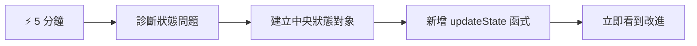
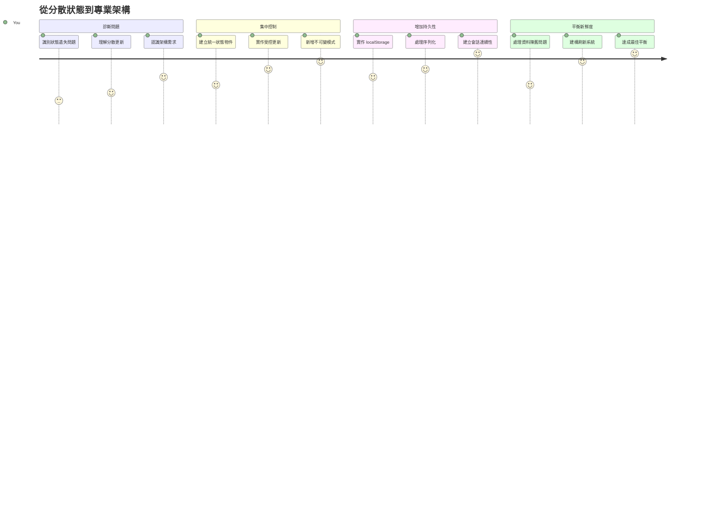
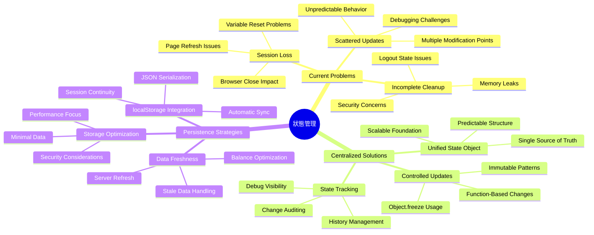
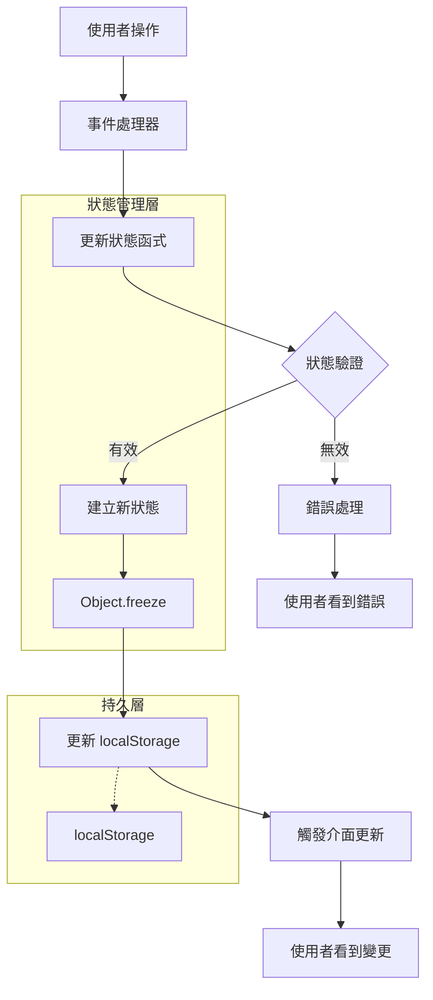
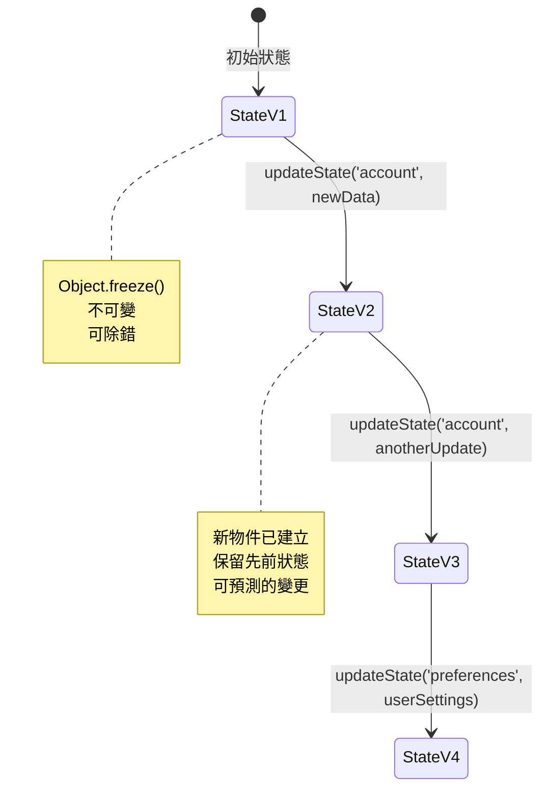
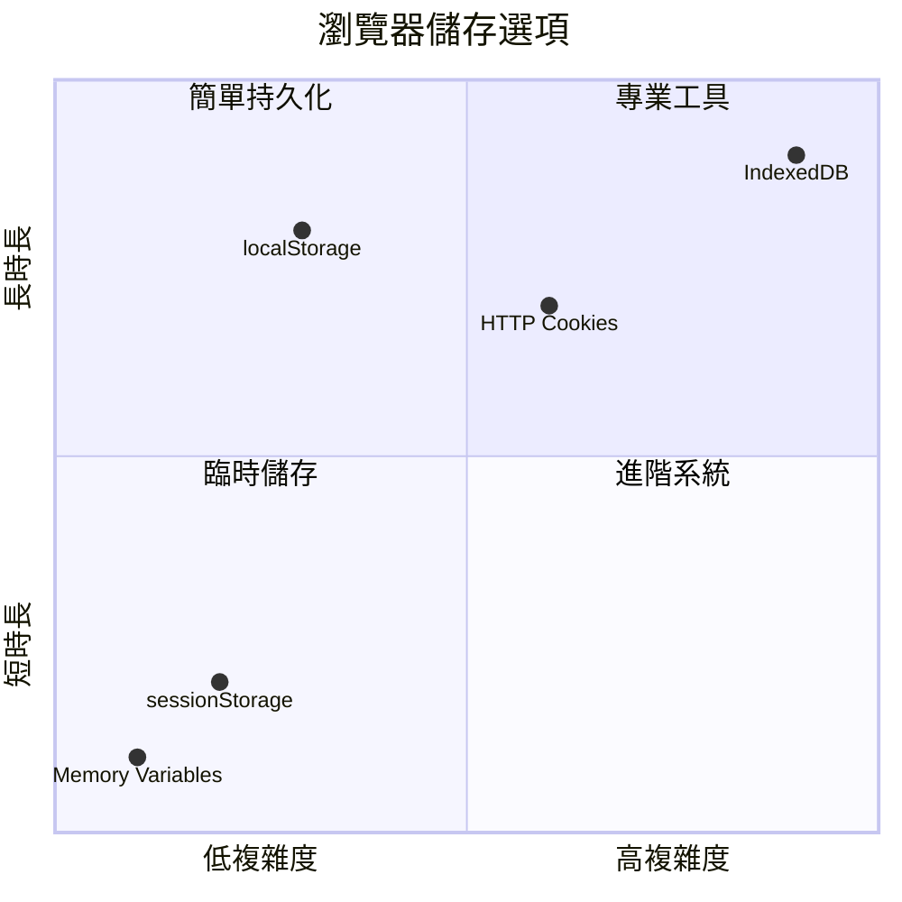
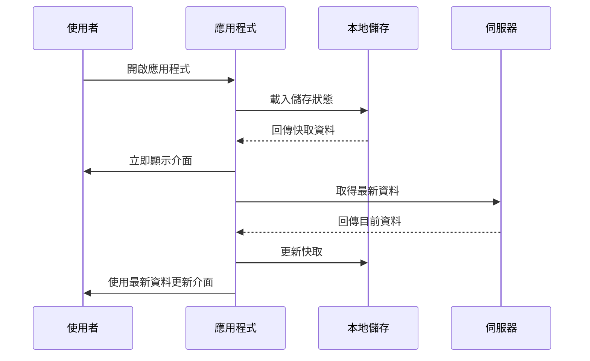
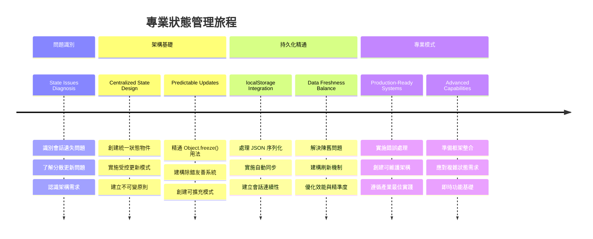
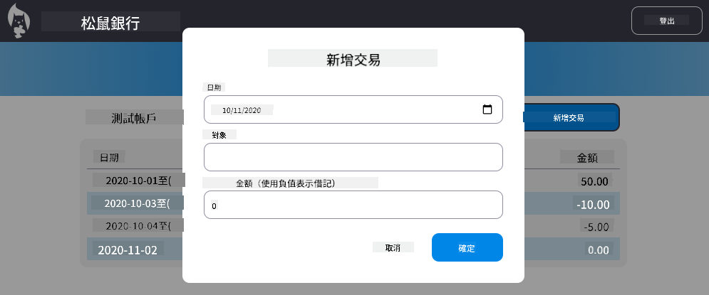

<!--
CO_OP_TRANSLATOR_METADATA:
{
  "original_hash": "b807b09df716dc48a2b750835bf8e933",
  "translation_date": "2026-01-06T14:06:54+00:00",
  "source_file": "7-bank-project/4-state-management/README.md",
  "language_code": "tw"
}
-->
# 建立銀行應用程式第四部分：狀態管理概念

## ⚡ 接下來五分鐘你可以做什麼

**忙碌開發者的快速入門路徑**


- **第1分鐘**：測試目前的狀態問題 - 登入，刷新頁面，觀察是否登出
- **第2分鐘**：將 `let account = null` 替換為 `let state = { account: null }`
- **第3分鐘**：建立一個簡單的 `updateState()` 函式以進行控制更新
- **第4分鐘**：更新一個函式以使用新的模式
- **第5分鐘**：測試改良後的可預測性和除錯能力

**快速診斷測試**：
```javascript
// 之前：分散狀態
let account = null; // 重新整理時會遺失！

// 之後：集中式狀態
let state = Object.freeze({ account: null }); // 可控且可追蹤！
```

**為什麼重要**：在5分鐘內，你將體驗從混亂的狀態管理到可預測、易除錯模式的轉變。這是讓複雜應用可維護的基礎。

## 🗺️ 你在狀態管理精通的學習之旅


**你的旅程終點**：本課結束時，你將建立一個專業級的狀態管理系統，處理持久化、資料鮮度與可預測更新——這些是生產環境應用使用的相同模式。

## 講前測驗

[講前測驗](https://ff-quizzes.netlify.app/web/quiz/47)

## 介紹

狀態管理就像航行者太空船上的導航系統——當一切運作順利時，你幾乎感受不到它存在。但當事情出錯時，它就是區分能否抵達星際空間或迷失在宇宙虛空中的關鍵。在網頁開發中，狀態代表應用程式需要記得的所有資訊：使用者登入狀態、表單資料、導航歷史及臨時介面狀態。

隨著你的銀行應用從簡單的登入表單演變為更複雜的應用，你很可能遇到一些常見問題。刷新頁面時，使用者意外被登出。關閉瀏覽器後，所有進度消失。除錯問題時，你需要在多個以不同方式修改相同資料的函式中穿梭。

這些不是糟糕程式碼的表徵——而是當應用達到某個複雜度門檻時，自然產生的成長痛。每個開發者在應用從「概念驗證」過渡至「生產準備」階段都會面對這些挑戰。

在本課，我們將實作一個集中式狀態管理系統，將你的銀行應用轉變為可靠且專業的應用。你將學會可預測地管理資料流、適當持續使用者會話，並打造現代網頁應用所需的流暢使用者體驗。

## 預備知識

在深入狀態管理概念之前，你需要將開發環境妥善設置，且銀行應用基礎已經完成。本課直接基於本系列前幾部分的概念與程式碼。

請確認你已準備好以下元件後再繼續：

**所需設置：**
- 完成 [資料取得課程](../3-data/README.md) — 應用應能成功載入並顯示帳戶資料
- 在系統安裝 [Node.js](https://nodejs.org) 以執行後端 API
- 啟動本機的 [伺服器 API](../api/README.md) 以處理帳戶資料操作

**測試你的環境：**

在終端機執行此指令確認 API 伺服器運作正常：

```sh
curl http://localhost:5000/api
# -> 應該回傳 "Bank API v1.0.0" 作為結果
```

**此指令的作用：**
- **發送** GET 請求至本機 API 伺服器
- **測試** 連線並確認伺服器回應
- **回傳** API 版本資訊，若一切正常

## 🧠 狀態管理架構概述


**核心原則**：專業狀態管理平衡可預測性、持久性與效能，打造可靠的使用者體驗，從簡單互動到複雜應用流程都能擴展。

---

## 診斷當前的狀態問題

就像福爾摩斯檢視犯罪現場一樣，我們需要了解目前實作到底發生了什麼，才能解開消失使用者會話之謎。

讓我們做個簡單實驗，揭露潛藏的狀態管理挑戰：

**🧪 嘗試此診斷測試：**
1. 登入你的銀行應用並進入儀表板
2. 刷新瀏覽器頁面
3. 觀察你的登入狀態會有什麼變化

如果你被重新導向回登入頁，就是發現了經典的狀態持久化問題。此行為發生是因為我們目前的實作將使用者資料儲存在會隨頁面載入重置的 JavaScript 變數內。

**目前實作的問題：**

來自我們[前課程](../3-data/README.md)的簡單 `account` 變數導致三個重大問題，影響使用者體驗與程式碼維護：

| 問題 | 技術原因 | 使用者影響 |
|---------|--------|----------------|
| **會話流失** | 頁面刷新會清除 JavaScript 變數 | 使用者需經常重新認證 |
| **更新分散** | 多個函式直接修改狀態 | 除錯難度提高 |
| **清理不完全** | 登出未清除所有狀態引用 | 可能有安全與隱私風險 |

**架構挑戰：**

就像鐵達尼號艙室的分隔設計，乍看堅固，但多個艙室同時淹水時仍難以挽救，單獨修復這些問題無法解決底層架構缺陷。我們需要一個全面的狀態管理方案。

> 💡 **我們真正想達成什麼？**

[狀態管理](https://en.wikipedia.org/wiki/State_management) 其實是解決兩個根本謎題：

1. **我的資料在哪裡？**：追蹤擁有哪些資訊以及來源
2. **所有人都有相同認知嗎？**：確保使用者看到的介面與實際狀態一致

**我們的策略：**

不用再東奔西跑，我們要建立一個**集中式狀態管理**系統。想像它是一位非常有組織的人，負責所有重要事項：



**理解此資料流：**
- **將**所有應用狀態集中於一處
- **導引**所有狀態變更通過控制函式
- **確保**使用者介面與當前狀態同步
- **提供**清晰、可預測的資料管理模式

> 💡 **專業提示**：本課專注基礎概念。對複雜應用，像是[Redux](https://redux.js.org)等庫提供更進階的狀態管理功能。理解這些核心原則將協助你掌握任何狀態管理函式庫。

> ⚠️ **進階主題**：我們不涵蓋由狀態變更自動觸發的 UI 更新，此涉[反應式程式設計](https://en.wikipedia.org/wiki/Reactive_programming)概念。這是你學習旅程中的優秀後續課題！

### 任務：集中狀態結構

讓我們開始將分散的狀態管理轉變成集中式系統。這第一步建立所有改進的基礎。

**步驟1：建立中央狀態物件**

替換簡單的 `account` 宣告：

```js
let account = null;
```

改為結構化的狀態物件：

```js
let state = {
  account: null
};
```

**此變更重要原因：**
- **集中**所有應用資料在一處
- **為未來新增更多狀態屬性做好準備**
- **建立**狀態與其他變數的明確邊界
- **創造**隨應用成長可擴充的模式

**步驟2：更新狀態存取模式**

更新函式以使用新狀態結構：

**在 `register()` 與 `login()` 函式中**，替換：
```js
account = ...
```

為：
```js
state.account = ...
```

**在 `updateDashboard()` 函式中**，於頂部新增此行：
```js
const account = state.account;
```

**這些改動達成：**
- **保持**現有功能並改善結構
- **為更複雜的狀態管理準備代碼**
- **建立**存取狀態資料的一致模式
- **奠定**集中式狀態更新基礎

> 💡 **注意**：此重構尚未立即解決問題，但它打造了強大改善方案的核心基礎！

### 🎯 教學檢查點：集中原則

**暫停並反思**：你剛完成了集中式狀態管理的基礎實作。這是關鍵的架構決策。

**快速自我評估**：
- 你能解釋為何將狀態集中在一個物件比分散變數好嗎？
- 如果忘記更新某函式以使用 `state.account` 會發生什麼？
- 這模式如何讓你的程式碼準備好迎接更進階功能？

**現實世界連結**：你學到的集中模式是現代框架如 Redux、Vuex、React Context 的基礎。你正在建立大型應用使用的相同架構思維。

**挑戰問題**：如果需要加入使用者偏好（主題、語言）到應用中，你會將它們加入狀態結構何處？這樣做如何擴充？

## 實作受控狀態更新

在狀態集中後，接著要建立對資料修改的控制機制。這確保狀態變化可預測、易於除錯。

核心原則類似空中交通管制：不允許多個函式獨立改變狀態，而是將所有變更經由單一受控函式。此模式提供清晰監管，掌握資料何時、如何變更。

**不可變狀態管理：**

我們將視 `state` 物件為 [*不可變*](https://en.wikipedia.org/wiki/Immutable_object)，意即不直接修改它。每次變更都產生一個新的狀態物件，包含更新後的資料。

雖然此方式初看似較不效率，較直接修改費時，但對除錯、測試與保持應用可預測性有重大優勢。

**不可變狀態管理的好處：**

| 好處 | 說明 | 影響 |
|---------|-------------|--------|
| **可預測性** | 狀態變更僅透過受控函式 | 除錯和測試更容易 |
| **歷史追蹤** | 每次變動產生新物件 | 支援復原/重做功能 |
| **防止副作用** | 防止意外修改 | 避免神祕錯誤 |
| **效能優化** | 易於偵測狀態實際變更 | 支援高效 UI 更新 |

**JavaScript 使用 `Object.freeze()` 實現不可變：**

JavaScript 提供 [`Object.freeze()`](https://developer.mozilla.org/docs/Web/JavaScript/Reference/Global_Objects/Object/freeze) 來防止物件修改：

```js
const immutableState = Object.freeze({ account: userData });
// 任何嘗試修改 immutableState 的行為都會拋出錯誤
```

**逐步解讀此處：**
- **防止**直接修改或刪除屬性
- **於嘗試修改時**拋出例外
- **確保**狀態必須經由受控函式更新
- **建立**明確規定如何更新狀態

> 💡 **深入瞭解**：閱讀 [MDN 文件](https://developer.mozilla.org/docs/Web/JavaScript/Reference/Global_Objects/Object/freeze#What_is_shallow_freeze) 了解 *淺層* 與 *深層* 不可變物件的差異。掌握該區分對複雜狀態結構至關重要。


### 任務

讓我們建立新的 `updateState()` 函式：

```js
function updateState(property, newData) {
  state = Object.freeze({
    ...state,
    [property]: newData
  });
}
```

此函式中，我們使用 [擴展運算子(`...`)](https://developer.mozilla.org/docs/Web/JavaScript/Reference/Operators/Spread_syntax#Spread_in_object_literals) 從先前狀態複製資料至新物件，接著使用 [中括號符號](https://developer.mozilla.org/docs/Web/JavaScript/Guide/Working_with_Objects#Objects_and_properties) `[property]` 指派指定屬性新的資料。最後，使用 `Object.freeze()` 鎖定物件防止修改。目前狀態中僅有 `account` 屬性，但你可以依需求新增更多。

同時我們也會更新 `state` 初始化，確保初始狀態也是被鎖定的：

```js
let state = Object.freeze({
  account: null
});
```

接著更新 `register` 函式，將 `state.account = result;` 取代為：

```js
updateState('account', result);
```

`login` 函式也同理，將 `state.account = data;` 替換成：

```js
updateState('account', data);
```

我們現在順便修正用戶點擊 *登出* 時帳戶資料未清除的問題。

建立新的 `logout()` 函式：

```js
function logout() {
  updateState('account', null);
  navigate('/login');
}
```

在 `updateDashboard()` 中，把導向 `return navigate('/login');` 改成 `return logout()`；

試著註冊新帳號，登出後再登入，確認一切正常運作。

> 小提示：你可以在 `updateState()` 函式底部加上 `console.log(state)`，並啟用瀏覽器開發工具的主控台來查看所有狀態變更。

## 實作資料持久化

我們先前發現的會話流失問題需要持久化方案，保持使用者狀態跨瀏覽器會話。這使應用從暫時體驗轉變成可靠的專業工具。

想像原子鐘即使停電也能維持精確時間，因為它將關鍵狀態儲存在非揮發性記憶體。類似地，網頁應用需要持久儲存機制以保留重要使用者資料，跨會話及刷新。

**資料持久化的策略性問題：**

實作持久化之前，請考慮這些關鍵因素：

| 問題 | 銀行應用脈絡 | 決策影響 |
|----------|-------------------|----------------|
| **資料是否敏感？** | 帳戶餘額、交易紀錄 | 選擇安全的儲存方式 |
| **應該持續多久？** | 登入狀態 vs. 臨時的 UI 偏好設定 | 選擇適當的儲存期限 |
| **伺服器需要它嗎？** | 認證令牌 vs. UI 設定 | 判斷是否需要分享 |

**瀏覽器儲存選項：**

現代瀏覽器提供多種儲存機制，各自針對不同使用情境設計：

**主要儲存 API：**

1. **[`localStorage`](https://developer.mozilla.org/docs/Web/API/Window/localStorage)**：持久的[鍵/值儲存](https://zh.wikipedia.org/wiki/键值数据库)
   - **資料持續**跨瀏覽器工作階段無限期  
   - **瀏覽器重新啟動及電腦重啟時依然保持**
   - **限定**於特定網站網域
   - **完美**適用於使用者偏好和登入狀態

2. **[`sessionStorage`](https://developer.mozilla.org/docs/Web/API/Window/sessionStorage)**：臨時會話儲存
   - 在活躍會話中功能與 localStorage 相同
   - 瀏覽器分頁關閉時自動清除
   - 適合不應持續保留的臨時資料

3. **[HTTP Cookies](https://developer.mozilla.org/docs/Web/HTTP/Cookies)**：伺服器共享儲存
   - 每次伺服器請求時自動附加
   - 適合[認證](https://zh.wikipedia.org/wiki/身份验证)令牌
   - 容量有限且可影響效能

**資料序列化需求：**

`localStorage` 和 `sessionStorage` 皆只儲存[字串](https://developer.mozilla.org/docs/Web/JavaScript/Reference/Global_Objects/String)：

```js
// 將物件轉換為 JSON 字串以便儲存
const accountData = { user: 'john', balance: 150 };
localStorage.setItem('account', JSON.stringify(accountData));

// 取得資料時，將 JSON 字串解析回物件
const savedAccount = JSON.parse(localStorage.getItem('account'));
```

**序列化解說：**
- **將** JavaScript 物件轉換成使用 [`JSON.stringify()`](https://developer.mozilla.org/docs/Web/JavaScript/Reference/Global_Objects/JSON/stringify) 的 JSON 字串
- **使用** [`JSON.parse()`](https://developer.mozilla.org/docs/Web/JavaScript/Reference/Global_Objects/JSON/parse) 從 JSON 重建物件
- **自動**處理複雜巢狀物件與陣列
- **無法**處理函式、未定義值及循環參考

> 💡 **進階選項**：對於複雜的離線應用與大量資料，建議考慮 [`IndexedDB` API](https://developer.mozilla.org/docs/Web/API/IndexedDB_API)。它提供完整的客戶端資料庫，但實作較為複雜。


### 任務：實作 localStorage 的持久化

讓我們實作持久化儲存，使使用者能維持登入狀態直到主動登出。我們將使用 `localStorage` 來跨瀏覽器工作階段儲存帳戶資料。

**步驟 1：定義儲存設定**

```js
const storageKey = 'savedAccount';
```

**此常數的作用：**
- **建立**穩定且一致的儲存資料識別碼
- **避免**儲存金鑰拼寫錯誤
- **便於**日後修改儲存金鑰
- **遵守**維護性佳的最佳實踐

**步驟 2：加入自動持久化**

在 `updateState()` 函式結尾加入此行：

```js
localStorage.setItem(storageKey, JSON.stringify(state.account));
```

**這裡發生了什麼：**
- **將**帳戶物件轉換成 JSON 字串以便儲存
- **使用**前面定義的儲存金鑰保存資料
- **在**狀態改變時自動執行
- **確保**儲存資料永遠與當前狀態同步

> 💡 **架構優勢**：因為所有狀態更新集中在 `updateState()`，只需加一行就完成持久化，展現良好架構設計的威力！

**步驟 3：在應用載入時還原狀態**

建立初始化函式來還原儲存的資料：

```js
function init() {
  const savedAccount = localStorage.getItem(storageKey);
  if (savedAccount) {
    updateState('account', JSON.parse(savedAccount));
  }

  // 我們之前的初始化程式碼
  window.onpopstate = () => updateRoute();
  updateRoute();
}

init();
```

**初始化流程說明：**
- **從** localStorage 取回先前保存的帳戶資料（如有）
- **解析** JSON 字串，還原為 JavaScript 物件
- **使用**受控更新函式更新狀態
- **自動**還原使用者的會話
- **於**路由更新前執行確保狀態可用

**步驟 4：優化預設路由**

更新預設路由以利用持久化優勢：

於 `updateRoute()` 中替換：
```js
// 替換：return navigate('/login');
return navigate('/dashboard');
```

**本變更的合理性：**
- **有效利用**新加入的持久化系統
- **讓**儀表板處理認證檢查
- **無會話時**自動導向登入頁
- **營造**更順暢的使用者體驗

**測試你的實作：**

1. 登入你的銀行應用
2. 重新整理瀏覽器頁面
3. 確認你仍保持登入且位於儀表板
4. 關閉再重新開啟瀏覽器
5. 返回你的應用並確認依舊登入

🎉 **成就達成**：你已成功實作持久狀態管理！你的應用已具備專業網頁應用行為。

### 🎯 教學檢核：持久化架構

**架構理解**：你實作了一個平衡使用者體驗與資料管理複雜度的高階持久化層。

**精通概念：**
- **JSON 序列化**：複雜物件轉存字串
- **自動同步**：狀態變動即觸發儲存
- **會話復原**：可於中斷後還原使用者上下文
- **集中持久化**：單一更新函式掌管所有儲存

**產業連結**：這種持久化模式是漸進式網頁應用（PWA）、離線優先應用，以及現代行動網頁體驗的根基。你正在建立具備生產力水準的功能。

**反思問題**：如何修改此系統，以便同一台裝置能管理多個使用者帳戶？要考慮隱私與安全性影響。

## 持久化與資料新鮮度的平衡

我們的持久化系統成功維持使用者會話，但帶來新挑戰：資料陳舊。當多位使用者或應用修改伺服器資料時，本地快取資訊可能已過時。

此情況類似維京航海師同時依賴存有的星圖與即時天象觀察。星圖提供一致參考，但航海師必須以新觀測補強。類似地，我們的應用需要持久的使用者狀態和最新的伺服器資料。

**🧪 探索資料新鮮度問題：**

1. 使用 `test` 帳號登入儀表板
2. 用終端機執行此指令以模擬其他來源的交易：

```sh
curl --request POST \
     --header "Content-Type: application/json" \
     --data "{ \"date\": \"2020-07-24\", \"object\": \"Bought book\", \"amount\": -20 }" \
     http://localhost:5000/api/accounts/test/transactions
```

3. 於瀏覽器重新整理儀表板頁面
4. 觀察是否看到新的交易紀錄

**此測試說明：**
- **示範**本地儲存可能變陳舊
- **模擬**真實世界資料於應用外部改動情境
- **揭示**持久化與資料新鮮的張力衝突

**資料陳舊挑戰：**

| 問題 | 成因 | 對使用者影響 |
|---------|-------|-------------|
| **資料過時** | localStorage 不會自動過期 | 使用者看到陳舊資訊 |
| **伺服器變更** | 其他應用或使用者改動相同資料 | 跨平台檢視不一致 |
| **快取與真實差異** | 本地快取與伺服器狀態不符 | 使用者體驗差異與混淆 |

**解決策略：**

我們將實作「載入時刷新」模式，在維持持久化優勢下確保資料新鮮，兼顧流暢體驗與精確資料。


### 任務：實作資料刷新系統

建立透過持久狀態管理同時自動從伺服器抓取新資料的系統。

**步驟 1：建立帳戶資料更新器**

```js
async function updateAccountData() {
  const account = state.account;
  if (!account) {
    return logout();
  }

  const data = await getAccount(account.user);
  if (data.error) {
    return logout();
  }

  updateState('account', data);
}
```

**此函式邏輯說明：**
- **檢查**目前是否有使用者登入（state.account 是否存在）
- **無有效會話時**導向登出
- **利用既有 `getAccount()` 函式**從伺服器取得最新帳戶資料
- **優雅處理**伺服器錯誤，無效會話時登出
- **使用控制更新系統**同步更新帶新資料的狀態
- **透過 `updateState()`**函式觸發自動 localStorage 持久化

**步驟 2：建立儀表板刷新處理器**

```js
async function refresh() {
  await updateAccountData();
  updateDashboard();
}
```

**此刷新函式達成目標：**
- **協調**資料刷新及 UI 更新流程
- **等待**新資料載入完成後才更新顯示
- **確保**儀表板呈現最新資訊
- **維持**資料管理與 UI 更新分離明確

**步驟 3：整合路由系統**

更新路由設定以自動觸發刷新：

```js
const routes = {
  '/login': { templateId: 'login' },
  '/dashboard': { templateId: 'dashboard', init: refresh }
};
```

**此整合如何發揮作用：**
- **每次載入儀表板路由時執行刷新函式**
- **確保使用者導向儀表板時總是顯示新資料**
- **維持既有路由結構同時加入資料新鮮度**
- **提供一致的路由專屬初始化模式**

**測試資料刷新系統：**

1. 登入你的銀行應用
2. 執行前述 curl 指令新增交易
3. 重新整理儀表板頁面或切換再回來
4. 確認新交易即刻顯示

🎉 **完美平衡實現**：你的應用現已兼具持久狀態的流暢體驗與新鮮伺服器資料的準確度！

## 📈 你的狀態管理精通時程表


**🎓 畢業里程碑**：你已成功打造完整狀態管理系統，採用 Redux、Vuex 等專業狀態庫背後相同原理。這些模式可從簡單應用擴展至企業級。

**🔄 下一階段能力：**
- 准備掌握狀態管理框架（Redux、Zustand、Pinia）
- 準備實作以 WebSocket 為基礎的即時功能
- 配備建置離線優先漸進式網頁應用能力
- 建立狀態機與觀察者等進階模式基礎

## GitHub Copilot Agent 挑戰 🚀

使用 Agent 模式完成以下挑戰：

**說明：**為銀行應用實作具備復原與重做（undo/redo）功能的完整狀態管理系統。此挑戰將協助你練習先進狀態管理概念，包括歷史狀態追蹤、不可變更新、與用戶介面同步。

**提示：**建構強化版的狀態管理系統，包含：1) 追蹤所有先前狀態的歷史狀態陣列，2) 可回復至先前狀態的 undo/redo 函式，3) 儀表板上的 undo/redo 操作按鈕，4) 限制最多儲存 10 筆歷史狀態以避免記憶體問題，5) 使用者登出時適當清理歷史。確保 undo/redo 功能能搭配帳戶餘額變更，且能跨瀏覽器刷新持續運作。

想了解更多請見 [agent mode](https://code.visualstudio.com/blogs/2025/02/24/introducing-copilot-agent-mode)。

## 🚀 挑戰：儲存優化

你現有的實作有效處理使用者會話、資料刷新與狀態管理。然而，思考我們目前方法是否在儲存效率與功能性間達到最佳平衡。

猶如象棋高手會區分必要棋子與可犧牲卒子，有效狀態管理需判斷哪些資料必須持續保存，哪些則必須保持最新且直接取自伺服器。

**優化分析：**

評估你現有的 localStorage 實作，思考以下策略問題：
- 維持使用者認證最少需要哪些資訊？
- 哪些資料變化頻繁，當地快取益處不大？
- 如何優化儲存提升效能同時不損失使用者體驗？

這類架構分析是區分具經驗開發者，能兼顧功能與效率的關鍵。

**實作策略：**
- **識別**必須持續儲存的關鍵資料（可能僅為使用者識別資訊）
- **修改** localStorage 實作僅存放關鍵會話資料
- **確保**在儀表板訪問時總是從伺服器載入新資料
- **測試**優化後仍能維持相同使用者體驗

**進階考量：**
- **比較**儲存完整帳戶資料與僅存認證令牌的利弊
- **記錄**你的決策過程與原因以便團隊參考

此挑戰將訓練你如專業開發者般全盤考量使用者體驗與應用效率。慢慢試驗各種方法吧！

## 講義後測驗

[講義後測驗](https://ff-quizzes.netlify.app/web/quiz/48)

## 作業

[實作「新增交易」對話框](assignment.md)

完成作業後範例呈現：



---

<!-- CO-OP TRANSLATOR DISCLAIMER START -->
**免責聲明**：  
本文件係使用 AI 翻譯服務 [Co-op Translator](https://github.com/Azure/co-op-translator) 進行翻譯。雖然我們致力於追求準確性，但請注意，自動化翻譯可能包含錯誤或不準確之處。原始文件的母語版本應被視為權威來源。對於關鍵資訊，建議採用專業人工翻譯。我們不對因使用本翻譯而引起的任何誤解或曲解承擔責任。
<!-- CO-OP TRANSLATOR DISCLAIMER END -->